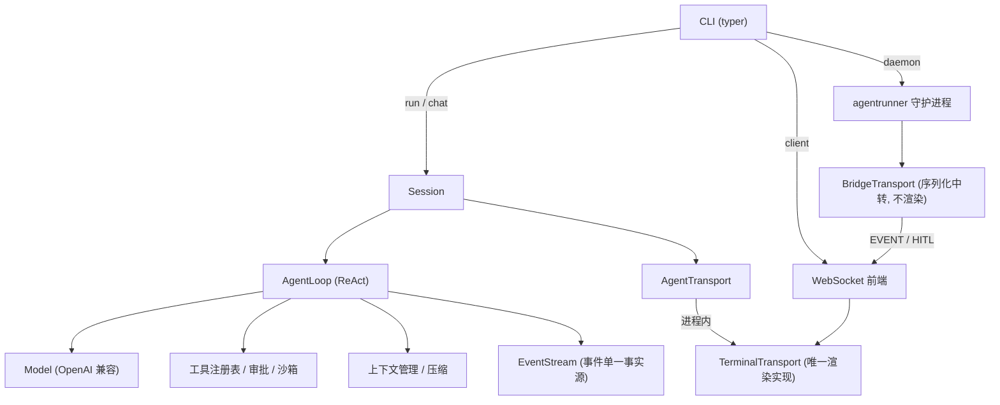
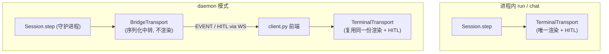

# work-agent

通用编码 Agent（类 Claude Code / Codex）。把「决策」交给 LLM，把「循环 / 权限 / 路由 / 压缩 / 持久化」全部做成确定性的工程实现；并通过 **agentrunner 守护进程分离**（WebSocket 协议）让渲染前端（CLI / Web）与 Agent 核心彻底解耦、常驻多会话。

> 完整架构依据见 [`通用Agent架构调研与设计报告.md`](./通用Agent架构调研与设计报告.md)；开发约定见 [`CODEBUDDY.md`](./CODEBUDDY.md)；里程碑计划见 [`milestones/`](./milestones/)。

---

## 特性

- **ReAct 循环**：模型只决策，工具执行 / 迭代 / 并发由确定性循环驱动。
- **安全分层**：沙箱（本地 `unshare` / `CommandFilter` 应用层拦截）+ 审批门（四模式）+ 风险分级（read/edit/exec）。
- **可观测与韧性**：Trace/Span（OTel 语义、父子树）持久化到 SQLite；限流 / 熔断 / 降级；`agent health` 健康检查 + HTTP `/health` 端点。
- **上下文与记忆**：Microcompact（零成本占位符）→ Auto Compact（9 段摘要）→ Session Memory（后台子 Agent 增量维护）→ 防漂移；`/context` `/compact` 可观测与手动压缩。
- **扩展能力**：Skill（双轨加载 / 触发目录）+ Subagent（内置 explore/plan/general-purpose + 自定义 / 工具白名单 / 深度限制 / 隔离上下文）+ 后台 Subagent（`/agent` `/bg`）。
- **意图澄清 / PLAN 模式**：`ask_clarification` 工具、计划落盘 + 进度更新 + 风险门控。
- **agentrunner 守护进程分离（M7，已落地）**：`agent daemon` 常驻 + `agent client` 经 WebSocket 连接，多会话 `attach` / `switch`，前端断连不中断 Agent，后台 Subagent 持续运行。

---

## 架构总览

整体分层：决策交给 LLM，循环 / 权限 / 路由 / 压缩 / 持久化是确定性工程实现；渲染层在进程内直连 `TerminalTransport`，或在 daemon 模式下经 WebSocket 与 Agent 核心解耦（渲染仍复用同一份 `TerminalTransport`）。



ReAct 主循环：

```mermaid
flowchart TD
    A[用户输入 task] --> B[Session.step]
    B --> C[AgentLoop: 调用 Model]
    C --> D{决策?}
    D -->|工具调用| E[执行工具 (沙箱 + 审批)]
    E --> F[EventStream 事件]
    F --> C
    D -->|澄清| G[ask_clarification → HITL]
    G --> C
    D -->|计划| H[show_plan → 确认门]
    H --> C
    D -->|结束| I[Final / 返回 AgentResult]
```

---

## 安装

要求 **Python ≥ 3.12**。

```bash
# 克隆后在项目根目录
pip install -e ".[dev]"      # 含开发依赖（pytest / pytest-asyncio）
```

安装后可用 `python -m agent.cli <命令>` 或（若安装了控制台脚本）`agent <命令>` 调用。

---

## 配置

密钥与模型只写在 YAML，**不读 `.env` / 环境变量**。

```bash
# 首次运行自动生成配置骨架（仅创建缺失项，绝不覆盖已有 settings.yaml）
python -m agent.cli init
```

- **项目级**：`<project>/.agent/settings.yaml`（随项目，优先级更高）
- **用户级**：`~/.agent/settings.yaml`（跨项目个人偏好，优先级更低）
- **优先级**：CLI 参数 > 项目级 YAML > 用户级 YAML > 内置默认

直接创建上述任一 YAML 文件并填入密钥即可：

```yaml
llm:
  base_url: https://api.deepseek.com   # 任意 OpenAI 兼容端点
  model: deepseek-v4-flash
  api_key: sk-xxx                       # 你的密钥（已 .gitignore 忽略）
max_iterations: 25
```

> **provider 无关**：底层走 OpenAI 兼容协议（`/v1/chat/completions`）。换 DeepSeek / OpenAI / 本地 vLLM 等，仅需改 `base_url` / `model` / `api_key`，**无需改代码**。默认指向 DeepSeek。
>
> 可用环境变量 `AGENT_PROJECT_ROOT`（覆盖项目根，也支持从其他目录启动）、`AGENT_USER_CONFIG_DIR`（覆盖用户级配置目录）。

---

## 快速开始

```bash
# 一次性执行（非交互）：给任务，Agent 跑完一轮 ReAct 返回
python -m agent.cli run "把 TODO 注释清理掉"

# PLAN 模式：先产出计划，确认后再执行
python -m agent.cli run --plan "重构 utils 模块"

# 交互式 REPL：多轮对话，单会话持续累积历史
python -m agent.cli chat
```

---

## CLI 命令参考

| 命令 | 说明 |
|---|---|
| `run <task>` | 一次性执行任务。选项：`--plan/--no-plan`（PLAN 起步）、`--yes`（跳过计划确认）、`--no-clarify`（关澄清）、`--no-trace`（关 trace）。 |
| `chat` | 交互式 REPL，多轮对话。 |
| `init` | 生成 `.agent/` 配置骨架（settings.yaml / skills / agents / AGENTS.md）。 |
| `health` | 健康检查：`--watch`（轮询）、`--port 9090`（HTTP `/health` 端点）。 |
| `daemon` | 启动 agentrunner 守护进程（常驻，仅绑 `127.0.0.1`）。`--port` 覆盖端口。 |
| `client` | 连接 daemon 的 CLI 前端。`--session <id>` attach 指定会话、`--resume` 恢复最近会话、`--run "<task>"` 一次性模式。 |

### chat REPL 内置命令

| 命令 | 作用 |
|---|---|
| `/plan` · `/exec` | 切换探索 / 执行模式（任意轮次） |
| `/approve` | 批准当前计划并切到执行 |
| `/mode` | 查看当前模式 |
| `/skills` · `/agents` | 列出可用 Skill / Subagent 类型 |
| `/skill <name>` | 显式把某 Skill 加载到下一轮 |
| `/agent <name> <task>` | 后台运行一个 Subagent（如 `/agent explore "梳理调用关系"`） |
| `/bg` | 查看运行中的后台 Subagent |
| `/context` | 查看上下文占用占比 |
| `/compact` | 手动压缩上下文 |

输入 `exit` / `quit` 退出（退出时会优雅等待后台 Subagent 收尾）。

---

## agentrunner 守护进程（M7）

渲染层与 Agent 核心分离为「常驻守护进程 + 前端」：

```bash
# 终端 1：启动守护进程（默认 127.0.0.1:18789，另起 18790 健康检查）
python -m agent.cli daemon

# 终端 2：CLI 前端连接、发任务、触发 HITL、切换会话
python -m agent.cli client --run "帮我加一个单元测试"
python -m agent.cli client --resume          # 恢复最近会话
python -m agent.cli client --session <id>    # attach 指定会话
```

- WebSocket 双向流式：事件直接复用 `Event.to_dict()` 转发，前端复用 `TerminalTransport._on_event` 逐事件渲染（逐字 / 逐参流式）。
- HITL 经带 `id` 的协议消息 + `asyncio.Future` 往返：前端就地提问、回传应答。
- 多会话：`attach` 其一；切换 = `detach` + `attach`；环形缓冲仅收持久化事件，`tool_call_delta` 不重画。
- 后台 Subagent 在无人 attach 时仍由 daemon 单循环驱动，attach 后回放近期活动。
- **安全**：daemon 仅绑 `127.0.0.1`；core（loop/session/transport/events）保持零 / 极小改动。

> 同一套协议天然支撑未来 Web 前端：只需另写一个订阅事件流的渲染器。

**传输与渲染分离**：渲染只有 `TerminalTransport` 一份；daemon 侧的 `BridgeTransport` 仅做序列化中转，不渲染。两种路径共用同一份渲染实现。



**事件与 HITL 往返**（daemon 模式下，每类事件都经 `TerminalTransport._on_event` 渲染，无遗漏）：

```mermaid
sequenceDiagram
    participant Loop as AgentLoop
    participant Bridge as BridgeTransport
    participant WS as WebSocket
    participant Client as client.py
    participant Term as TerminalTransport

    Loop->>Bridge: emit Event / HITL 请求
    Bridge->>WS: 序列化消息 (event/ask/approve/...)
    WS->>Client: 转发
    Client->>Term: _on_event / ask / confirm_plan / approve / show_*
    Term-->>Client: 渲染到终端
    Client->>WS: 回传应答 (answer/approve/...)
    WS->>Bridge: 唤醒 asyncio.Future
    Bridge->>Loop: 返回 HITL 结果
```

---

## 目录结构

```
agent/
  core/        循环 / 意图 / 模型 / 事件流 / 会话 / 传输层
  runtime/     工具注册 / 审批 / 沙箱
  context/     上下文管理 / 压缩器（Microcompact / AutoCompact / Session Memory）
  skills/      Skill 加载
  resilience/  限流 / 熔断 / 降级 / 健康检查
  obs/         Trace / Span 持久化
  config/      配置（pydantic-settings + YAML）
  daemon/      agentrunner 守护进程（WS / HTTP server + BridgeTransport + 协议）
  cli.py       typer 入口（run / chat / init / health / daemon / client）
tools/         内置工具（read / write / edit / bash / grep / find）
skills/        项目级 Skill（<.agent/skills/>）
milestones/    里程碑计划与步骤文档
knowledge/     跨里程碑知识沉淀
```

---

## 里程碑进度

| 里程碑 | 状态 |
|---|---|
| M1 骨架 | ✅ 已完成 |
| M2 安全与确认 | ✅ 已完成 |
| M3 可观测与韧性层 | ✅ 已完成 |
| M4 上下文与记忆 | 🟡 部分完成（M4.1–M4.7 已落地，M4.5–M4.7 见文档） |
| M5 扩展能力 | ✅ 已完成 |
| M6 生产化（会话恢复 / 测试金字塔 / CI） | ⚪ 待启动 |
| M7 agentrunner 守护进程分离 | ✅ 已完成（全量 `pytest` 380 passed） |

---

## 开发

```bash
pip install -e ".[dev]"
pytest -q                       # 跑全部测试
pytest --cov=agent             # 带覆盖率（需 pip install pytest-cov）
pytest tests/test_daemon.py     # 单跑某文件
```

- LLM 一律可 Mock：`Model` 抽象 + `FakeModel` / `RecordingModel`，测试不依赖真实 API。
- 异步测试：`pytest-asyncio`（`asyncio_mode = "auto"`）。

---

## 许可

内部项目。
