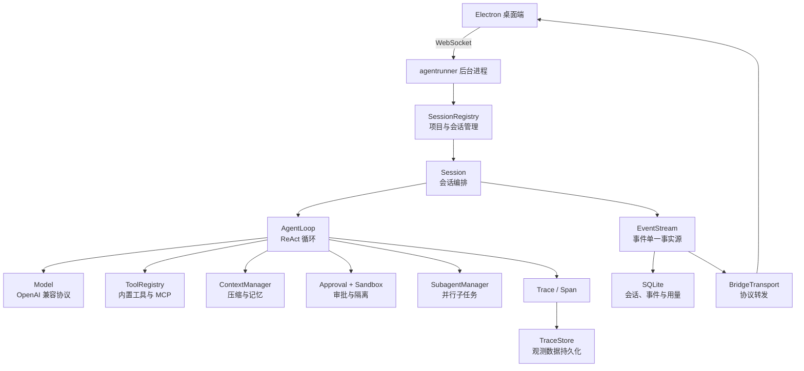
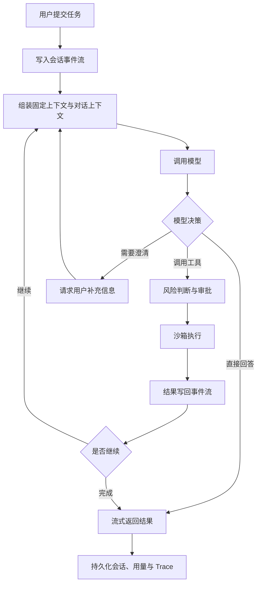

# Work Agent

Work Agent 是一个面向真实软件项目的通用编码 Agent。它把需求理解、方案规划和工具选择交给大模型，把工具执行、权限审批、上下文压缩、会话恢复、任务并发与运行观测做成确定性的工程系统，并通过 Electron 桌面端提供完整的可视化工作区。

项目当前版本为 **v1.1.0**，已覆盖从单轮工具调用到多项目、多会话、后台子 Agent、长期记忆、MCP 外部工具接入和 Windows 隔离沙箱的完整链路。

## 项目定位

普通的模型对话只能生成文本，而编码 Agent 需要持续观察环境、调用工具、处理失败并根据结果继续决策。Work Agent 的核心目标，是让这条循环既有足够的自主性，又具备明确的安全边界和可追踪性。

系统遵循三个基本原则：

- **模型负责决策，程序负责约束**：模型选择下一步动作，循环次数、工具路由、并发、审批和错误恢复由代码控制。
- **事件流是真相来源**：用户输入、模型决策、工具调用、审批、结果和异常都进入统一事件流，用于实时渲染、持久化和恢复。
- **能力彼此正交**：Tool 提供原子操作，Skill 提供按需知识，Subagent 提供隔离的任务上下文，MCP 连接外部工具生态。

## 核心能力

| 能力 | 说明 |
|---|---|
| ReAct 执行循环 | 支持模型流式输出、工具调用、结果回填、多轮迭代、重复调用保护和并发控制。 |
| 计划与人工确认 | 计划模式只分析不修改；高风险动作经过审批，可在执行前澄清需求或请求授权。 |
| 多项目与多会话 | 桌面端可打开不同项目，每个项目独立保存配置、会话、事件和观测数据。 |
| 会话恢复与分支 | 会话写入 SQLite，应用重启后可继续；也可从历史状态派生新会话，保留父子关系。 |
| 上下文与长期记忆 | 通过工具结果瘦身、自动摘要和 Session Memory 控制上下文体积，同时保留完整审计事件。 |
| Skill 与子 Agent | Skill 按需加载；子 Agent 使用独立上下文和工具白名单，可在后台并行执行任务。 |
| MCP 外部工具 | 支持 stdio MCP Server、用户级与项目级配置、运行时启停和工具延迟加载。 |
| 安全执行 | 提供只读、工作区可写和完全访问三档策略，并结合命令过滤、审批门与操作系统隔离。 |
| 可观测与韧性 | Trace/Span、工具时间线、Token 用量和错误持久化；内置限流、熔断、重试与降级机制。 |

## 桌面工作区

桌面端基于 Electron、React 和 TypeScript 构建，是项目的主要交互界面。应用启动时会自动拉起一个本地 agentrunner 后台进程，渲染进程通过 WebSocket 订阅实时事件，不直接持有命令执行能力。

当前桌面端提供：

- 项目文件夹打开与最近项目管理；
- 会话新建、重命名、删除、切换、恢复和分支；
- 模型流式回复、工具调用参数、执行结果和错误展示；
- 计划/执行模式切换、停止生成和人工审批弹窗；
- Skill、子 Agent 和 MCP Server 管理面板；
- 后台子 Agent 状态与结果查看；
- Trace、Span、Token 用量和工具执行时间线；
- 模型、沙箱、审批、上下文和外观设置。

后台进程与桌面窗口分离后，即使渲染界面短暂断开，正在运行的主任务和后台子 Agent 仍可继续执行。重新连接时，界面会依据持久化事件恢复状态。

## 架构总览


```mermaid
graph TD
    Desktop["Electron 桌面端"] -->|WebSocket| Daemon["agentrunner 后台进程"]
    Daemon --> Registry["SessionRegistry<br/>项目与会话管理"]
    Registry --> Session["Session<br/>会话编排"]
    Session --> Loop["AgentLoop<br/>ReAct 循环"]

    Loop --> Model["Model<br/>OpenAI 兼容协议"]
    Loop --> Tools["ToolRegistry<br/>内置工具与 MCP"]
    Loop --> Context["ContextManager<br/>压缩与记忆"]
    Loop --> Safety["Approval + Sandbox<br/>审批与隔离"]
    Loop --> Subagents["SubagentManager<br/>并行子任务"]

    Session --> Events["EventStream<br/>事件单一事实源"]
    Events --> Store["SQLite<br/>会话、事件与用量"]
    Events --> Bridge["BridgeTransport<br/>协议转发"]
    Bridge --> Desktop

    Loop --> Tracer["Trace / Span"]
    Tracer --> TraceStore["TraceStore<br/>观测数据持久化"]
```

一次任务的主要执行流程如下：


```mermaid
flowchart TD
    A[用户提交任务] --> B[写入会话事件流]
    B --> C[组装固定上下文与对话上下文]
    C --> D[调用模型]
    D --> E{模型决策}
    E -->|直接回答| F[流式返回结果]
    E -->|调用工具| G[风险判断与审批]
    G --> H[沙箱执行]
    H --> I[结果写回事件流]
    I --> J{是否继续}
    J -->|继续| C
    J -->|完成| F
    E -->|需要澄清| K[请求用户补充信息]
    K --> C
    F --> L[持久化会话、用量与 Trace]
```

## 上下文与记忆

长任务最容易遇到的问题不是“记不住”，而是工具输出和历史对话持续膨胀，最终挤占模型上下文。Work Agent 使用逐级处理策略控制体积：

1. **Microcompact**：优先把较旧、体积较大的工具结果替换成可追溯占位信息，不调用模型。
2. **Session Memory**：后台增量维护当前任务的目标、进度、关键决策、文件状态和待办事项。
3. **Auto Compact**：接近上下文上限时生成结构化摘要，保留最近对话继续工作。
4. **Reactive Compact**：模型请求因上下文超限失败时，立即压缩并重试。

模型看到的是经过治理的工作上下文，SQLite 中保存的 EventStream 则保留完整事实。这样既能控制 Token 成本，也不会为了压缩而破坏会话恢复和审计能力。

`AGENTS.md`、系统约束和工具定义属于固定底座，不参与历史压缩。项目约定因此能在长会话中持续生效。

## 安全模型

安全能力由“风险识别、人工审批、应用层过滤、操作系统隔离”共同组成，而不是仅依赖提示词。

| 沙箱档位 | 文件访问 | 网络访问 | 典型用途 |
|---|---|---|---|
| `read-only` | 只读 | 默认禁止 | 代码检索、依赖分析、方案规划 |
| `workspace-write` | 工作区内可写 | 默认禁止 | 常规开发、测试和文档修改 |
| `danger-full` | 不限制 | 允许 | 用户明确批准后的特殊任务 |

在 Windows 上，系统可使用受限本地账户、受限 Token、ACL 和 Job Object 形成操作系统级隔离；在 Linux 上可使用内核隔离能力；也可切换到一次性 Docker 执行器。若硬隔离不可用，应用层 `CommandFilter` 仍会在进程创建前拦截明显越界的写入、网络和危险命令。

审批的含义是允许当前动作临时突破默认边界，而不是永久关闭保护。动作结束后，后续执行仍回到原有沙箱策略。

## Skill、子 Agent 与 MCP

这三类扩展解决的问题不同：

- **Tool** 是可执行的最小能力，例如读取文件、编辑内容或运行测试。
- **Skill** 是按需加载的任务说明和领域知识，不会默认占满上下文。
- **Subagent** 拥有独立对话历史和事件流，适合代码检索、方案设计、测试分析等可并行任务。
- **MCP** 把外部服务转换成统一工具，例如代码托管、数据库或内部系统。

MCP 工具采用两级加载。未激活工具只以名称和简介出现在目录中，模型需要使用时先通过 `tool_search` 检索并激活，随后才把完整参数 Schema 放入上下文。这样可以连接较多工具，同时避免工具定义挤占主要任务空间。

子 Agent 默认受工具白名单和最大深度限制。它们的中间消息不会混入主会话，完成后只把结构化结果交还父 Agent；后台任务即使暂时没有界面连接，也会由 agentrunner 继续维护。

## 配置

桌面端可直接编辑常用设置。高级配置使用 YAML，分为两层：

- 项目级：`<project>/.agent/settings.yaml`，只影响当前项目；
- 用户级：`~/.agent/settings.yaml`，作为所有项目的个人默认值。

项目级配置优先于用户级配置。`.agent/` 默认被版本控制忽略，模型密钥和本地会话数据不会提交到仓库。

```yaml
llm:
  base_url: https://api.deepseek.com
  model: deepseek-v4-flash
  api_key: sk-xxx

loop:
  max_iterations: 25
  max_tool_concurrency: 5

sandbox:
  mode: local
  profile: workspace-write
  isolation: auto

approval:
  mode: on-request
  elevated_sandbox_profile: danger-full

context:
  context_window: 200000
  microcompact_enabled: true
  auto_compact_enabled: true
  session_memory_enabled: true

skills:
  enabled: true

subagents:
  enabled: true
  max_depth: 5

mcp:
  enabled: true
  tool_timeout_sec: 45
  concurrency: 4
```

模型层使用 OpenAI 兼容的 `/v1/chat/completions` 协议。更换 DeepSeek、OpenAI 兼容服务或本地模型时，只需要调整 `base_url`、`model` 和 `api_key`，无需修改 Agent 核心代码。

MCP Server 使用独立的 `mcp.yaml` 管理，支持用户级与项目级覆盖，也可以在桌面端 MCP 面板中增删、启停和查看连接状态。

## 本地开发

环境要求：

- Python 3.12 或更高版本；
- Node.js 20 或更高版本；
- Windows、macOS 或 Linux 桌面环境。

安装后端与测试依赖：

```bash
pip install -e ".[dev]"
```

安装并启动桌面端：

```bash
cd desktop
npm install
npm run dev
```

桌面窗口会自动启动并连接本地 agentrunner。首次进入后，打开一个项目文件夹，并在设置面板中填写模型服务信息即可开始使用。

常用质量检查：

```bash
pytest -q
ruff check .
ruff format --check .
basedpyright

cd desktop
npm test
npm run typecheck
npm run build
```

后端模型调用通过 `Model` 接口抽象，测试可使用 `FakeModel` 和 `RecordingModel`，因此大部分测试不依赖真实模型服务。耗时或非确定性的端到端测试与常规门禁分开运行。

## 目录结构

```text
agent/
  core/          ReAct 循环、会话、事件、模型与传输协议
  runtime/       工具注册、风险审批和沙箱执行
  context/       上下文计量、压缩、长期记忆与会话恢复
  daemon/        agentrunner、会话注册表和 WebSocket 协议
  mcp/           MCP 客户端、配置、适配器与生命周期管理
  skills/        Skill 发现、解析与加载
  obs/           Trace、Span 和 SQLite 观测存储
  resilience/    限流、熔断、重试、降级与健康检查
  tools/         内置文件、检索和命令工具

desktop/
  src/main/      Electron 主进程与 agentrunner 生命周期
  src/preload/   安全的主进程桥接
  src/renderer/  React 工作区入口、主题与布局
  src/features/  会话、聊天、Skill、Agent、MCP、设置与观测面板

tests/           单元、集成、快照与端到端测试
milestones/      各里程碑的实现方案、验收标准与复盘
knowledge/       跨里程碑沉淀的设计知识
docs/            架构设计、实现细节与专题文档
```

## 进一步阅读

- [上下文与记忆体系介绍](./docs/上下文与记忆体系介绍.md)：四层压缩防线、EventStream 与 Session Memory 的职责边界。
- [沙箱体系介绍](./docs/沙箱体系介绍.md)：三档安全策略、执行器选择、审批和命令过滤。
- [Windows AppContainer 硬沙箱设计](./docs/windows-appcontainer-hard-sandbox.md)：Windows 隔离模型、Token、ACL 与进程约束。
- [Agent 长连接与崩溃恢复机制](./docs/Agent长连接与崩溃恢复机制.md)：前后台分离、断线恢复和任务续跑。
- [MCP 接入设计](./docs/mcp-接入设计.md)：MCP 生命周期、工具适配、风险分级与延迟加载。
- [Subagent 异步通信架构设计](./docs/subagent异步通信架构设计.md)：上下文隔离、并行调度和结果回传。
- [测试体系介绍](./docs/测试体系介绍.md)：测试金字塔、模型替身、录像带与端到端验证。
- [v1.1.0 发布说明](./docs/release-v1.1.0.md)：当前版本新增能力和质量门禁。

## 项目状态

项目已完成核心 Agent、沙箱与审批、可观测与韧性、上下文与记忆、Skill 与子 Agent、会话生产化、agentrunner 分离、桌面客户端、用量与消息模型、MCP 接入等里程碑。当前工作重点是继续完善桌面体验、扩展外部工具生态，并加强真实项目上的长期运行评测。

## 许可

内部项目。
