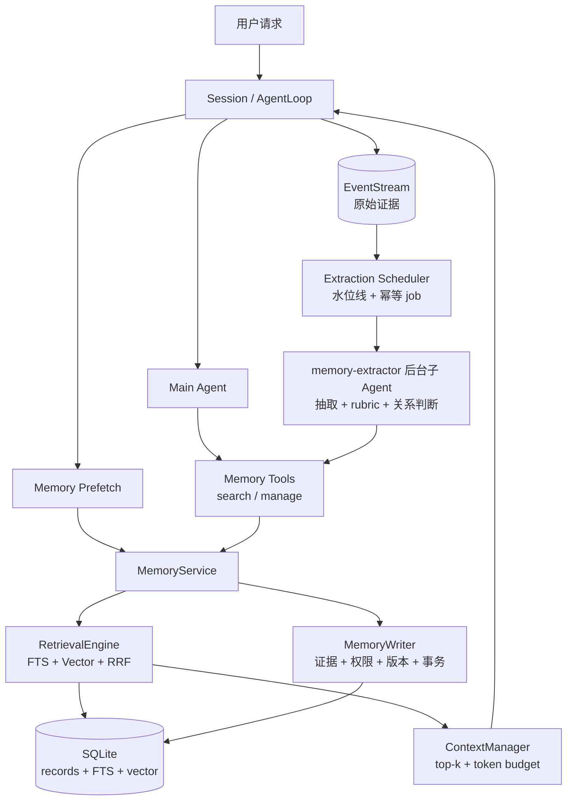
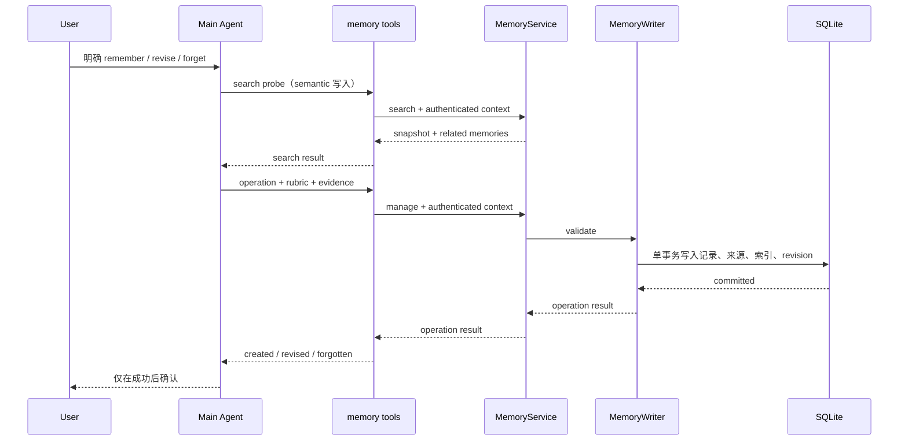
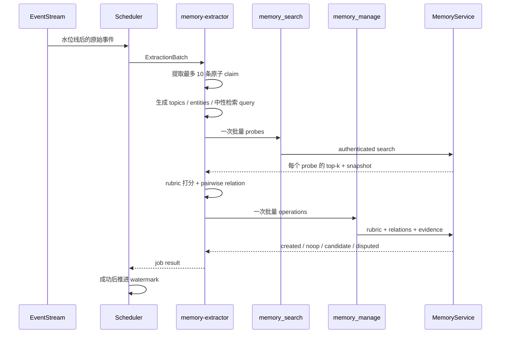
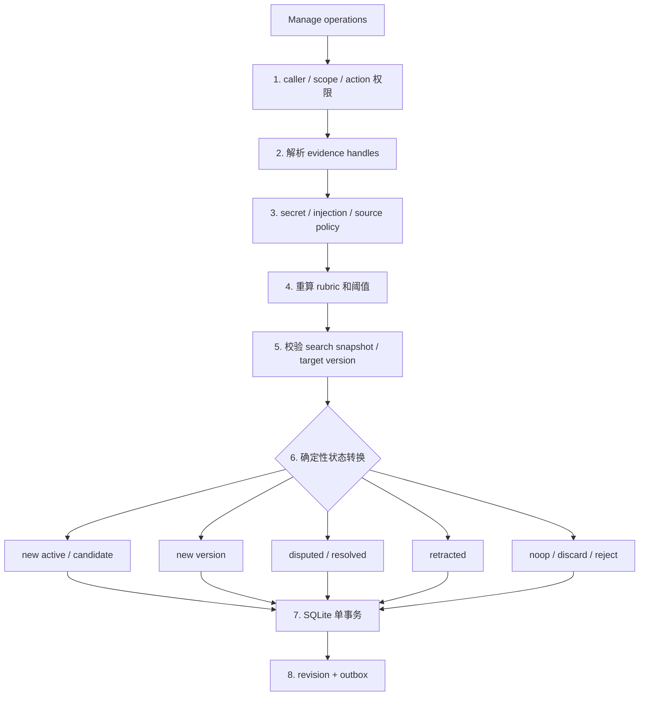

# Agent Memory：一套能直接实现的长期记忆方案

> 让 Agent 记住一句话并不难，难的是让它只记住值得记的内容，并在用户改变主意时正确更新。
>
> 本文给出一套适用于通用编码 Agent 的工程方案：主 Agent 负责显式记忆，后台 `memory-extractor` 子 Agent 负责自动抽取、价值评分和冲突判断；两者只通过 `memory_search`、`memory_manage` 两个工具访问统一的 `MemoryService`。

---

## 一、Memory 解决的到底是什么

先把几个容易混淆的概念分开。

| 层级 | 保存什么 | 生命周期 | 实现 |
|---|---|---|---|
| L0 Evidence | 用户消息、工具结果、代码片段等原始证据 | 随会话或审计策略保存 | EventStream（含 artifact 引用） |
| L1 Working Memory | 当前模型调用需要看到的内容 | 单次调用 | ContextManager |
| L2 Session Memory | 当前长会话的压缩摘要 | 单个 session | Session Summary |
| L3 Long-term Memory | 跨会话复用的事实、偏好和经验 | 长期 | MemoryService |
| L4 Procedural Memory | 会直接改变 Agent 行为的项目规则和 Skill | 长期、版本化 | `AGENTS.md` / Skills |

L2 和 L3 看起来都像摘要，职责却完全不同。Session Summary 的目标是压缩上下文，它会被不断重写；Long-term Memory 的目标是跨会话复用，因此必须有来源、评分、版本、冲突和删除语义。

L3 保存两种内容：

- Semantic Memory：用户偏好、项目约定、稳定事实；
- Episodic Memory：一次有明确结果、以后可能复用的成功或失败经验。

每条记忆只有一个由系统生成的 `memory_id`。它是数据库定位符，不表达“这条记忆是什么”，也不参与冲突发现。记忆内容是开放的，不要求先注册有限的类型或业务 key。

```json
{
  "memory_id": "01K...",
  "kind": "semantic",
  "scope": "project",
  "claim": "当前项目统一使用 pytest。",
  "details": "新增测试和示例都使用 pytest，不再新增 unittest.TestCase。",
  "topics": ["testing", "pytest"],
  "entities": ["pytest", "unittest"],
  "status": "active",
  "value_score": 95,
  "version": 1,
  "source_refs": ["event:session-42:108"]
}
```

`claim` 是适合检索和比较的一句话断言，`details` 保存必要上下文，`topics` 和 `entities` 只是开放的检索提示。它们都不是唯一键，因此不会限制可表达的记忆种类和数量。

这套分层借鉴了 [MemGPT 的层级记忆](https://arxiv.org/abs/2310.08560)、[LangGraph 对短期/长期、热路径/后台写入的划分](https://docs.langchain.com/oss/python/concepts/memory)、[Mem0 的抽取—整合—检索闭环](https://arxiv.org/abs/2504.19413)，以及 [Zep 对有效时间和历史关系的处理](https://arxiv.org/abs/2501.13956)。这些概念在本文中都落到同一套接口和状态机上。

---

## 二、架构：一个服务、两个工具、两个调用方



组件的职责必须单一，否则 Memory 很容易变成一串互相调用的“智能中间件”。

| 组件 | 负责 | 不负责 |
|---|---|---|
| Memory Tools | 把 Agent 参数转换成带身份和权限的请求 | 不直连数据库 |
| MemoryService | 对外提供统一搜索、管理和后台调度接口 | 不做 Agent 推理 |
| RetrievalEngine | namespace 过滤、混合召回、排序和截断 | 不修改记忆 |
| MemoryWriter | 校验证据、重算 rubric、校验关系目标、提交事务 | 不理解自然语言 |
| MemoryStore | 记录、版本、来源、关系、FTS 和向量索引 | 不判断价值和冲突 |
| memory-extractor | 从增量事件抽取候选，完成价值评分和关系判断 | 不访问文件、网络或数据库 |

语义判断只在当前调用方 Agent 中发生一次；身份、算术、权限、版本和状态转换由普通代码执行。

---

## 三、统一接口

`MemoryService` 是应用代码唯一依赖的入口。

```python
class MemoryService(Protocol):
    async def search(
        self,
        request: MemorySearchRequest,
        context: MemoryCallContext,
    ) -> MemorySearchResult: ...

    async def manage(
        self,
        request: MemoryManageRequest,
        context: MemoryCallContext,
    ) -> MemoryManageResult: ...

    async def schedule_extract(
        self,
        request: MemoryExtractRequest,
        context: MemoryCallContext,
    ) -> MemoryExtractResult: ...


class MemoryExtractRequest(BaseModel):
    session_id: str
    from_seq: int
    to_seq: int
    trigger: Literal["task_final", "idle", "threshold", "session_close"]
    extractor_version: str


class MemoryExtractResult(BaseModel):
    job_id: str
    accepted: bool
```

`search` 和 `manage` 注册成模型工具；`schedule_extract` 只供 Session 和后台调度器调用。

### 3.1 系统注入的调用上下文

```python
class MemoryCallContext(BaseModel):
    caller: Literal["main_agent", "memory_extractor", "system"]
    principal_id: str
    user_id: str
    project_id: str
    session_id: str
    trigger_event_ref: str | None = None
    idempotency_key: str
    search_snapshot_id: str | None = None
```

这些字段由 Tool Adapter 注入，不能出现在模型可填写的参数中。Service 根据 `user_id` 和 `project_id` 生成实际 namespace：

```text
user:<user_id>
project:<user_id>:<project_id>
```

后台子 Agent 搜索后，Adapter 会保存本次结果中的 memory IDs、版本和各 namespace revision，形成短期有效的 search snapshot。随后提交的关系判断只能引用该 snapshot 中的记录，防止模型伪造目标或跨 scope 修改数据。

### 3.2 搜索接口

普通搜索和后台批量比较共用同一个接口。

```python
class MemoryProbe(BaseModel):
    ref: str
    claim: str
    queries: list[str] = Field(default_factory=list, max_length=3)
    topics: list[str] = Field(default_factory=list, max_length=8)
    entities: list[str] = Field(default_factory=list, max_length=12)


class MemorySearchRequest(BaseModel):
    query: str | None = None
    probes: list[MemoryProbe] = Field(default_factory=list, max_length=10)
    scopes: list[Literal["project", "user"]] = Field(
        default_factory=lambda: ["project", "user"]
    )
    kinds: list[Literal["semantic", "episodic"]] = Field(
        default_factory=lambda: ["semantic", "episodic"]
    )
    include_statuses: list[
        Literal["active", "candidate", "disputed"]
    ] = Field(default_factory=lambda: ["active"])
    limit: int = Field(default=5, ge=1, le=20)
    token_budget: int = Field(default=1200, ge=200, le=4000)
    as_of: datetime | None = None


class MemoryHit(BaseModel):
    memory_id: str
    probe_ref: str | None
    scope: Literal["project", "user"]
    kind: Literal["semantic", "episodic"]
    claim: str
    details: str | None
    topics: list[str]
    entities: list[str]
    status: str
    value_score: int
    retrieval_score: float
    version: int
    valid_from: datetime
    valid_to: datetime | None
    source_refs: list[str]


class MemorySearchResult(BaseModel):
    hits: list[MemoryHit]
    revisions: dict[str, int]
    snapshot_id: str
    retrieval_mode: Literal["hybrid", "lexical_fallback"]
    truncated: bool
```

`query` 用于主 Agent 和自动预取；`probes` 用于写入前批量查询候选。两者至少填写一个。普通 query 默认只查 active；只要带 probes，Service 就固定查 active、candidate 和 disputed，不允许调用方缩小状态范围。namespace、身份和最大预算也由系统控制。

### 3.3 管理接口

```python
class RubricReasons(BaseModel):
    reuse: str
    durability: str
    consequence: str
    evidence: str
    actionability: str
    novelty: str


class ValueRubric(BaseModel):
    reuse: int = Field(ge=0, le=4)
    durability: int = Field(ge=0, le=4)
    consequence: int = Field(ge=0, le=4)
    evidence: int = Field(ge=0, le=4)
    actionability: int = Field(ge=0, le=4)
    novelty: int = Field(ge=0, le=4)
    reasons: RubricReasons


class RelationDecision(BaseModel):
    target_id: str
    target_version: int
    relation: Literal[
        "duplicate",
        "extends",
        "supersedes",
        "contradicts",
    ]
    confidence: float = Field(ge=0, le=1)
    reason: str


class MemoryOperation(BaseModel):
    action: Literal["remember", "revise", "forget", "resolve_conflict"]
    scope: Literal["project", "user"]
    kind: Literal["semantic", "episodic"] | None = None
    claim: str | None = None
    details: str | None = None
    probe_ref: str | None = None
    topics: list[str] = Field(default_factory=list, max_length=8)
    entities: list[str] = Field(default_factory=list, max_length=12)
    target_ids: list[str] = Field(default_factory=list)
    expected_versions: dict[str, int] = Field(default_factory=dict)
    evidence_handles: list[str] = Field(default_factory=list)
    rubric: ValueRubric | None = None
    relations: list[RelationDecision] = Field(default_factory=list)
    valid_from: datetime | None = None
    valid_to: datetime | None = None


class MemoryManageRequest(BaseModel):
    operations: list[MemoryOperation] = Field(min_length=1, max_length=10)


class MemoryOperationResult(BaseModel):
    status: Literal[
        "created",
        "revised",
        "forgotten",
        "resolved",
        "noop",
        "candidate",
        "disputed",
        "needs_clarification",
        "rejected",
        "discarded",
    ]
    memory_id: str | None
    value_score: int | None
    message: str


class MemoryManageResult(BaseModel):
    results: list[MemoryOperationResult]
    revisions: dict[str, int]
```

工具 schema 直接从这些 Pydantic 模型生成，避免接口类和工具 JSON 各维护一份。remember 和 revise 必须填写 `probe_ref` 与 rubric；forget 和 resolve_conflict 只需精确目标和版本。remember 的 target_ids 必须为空，revise/forget 每个 operation 只允许一个目标，resolve_conflict 至少有两个目标；批量动作用多个 operations 表达。后台子 Agent 还必须填写 relations。Tool Adapter 根据注册工具的调用者设置 `caller`，并从系统配置注入 rubric version；模型不能伪装调用身份或评分版本。

证据使用运行时 handle：

```text
current_user
last_assistant
tool:call_123
event:session-42:108
artifact:sha256:...#L20-L35
```

Adapter 把 handle 解析成 EventStream 中的真实记录。artifact handle 必须被某条 event 引用，并且 hash 与当时读取的内容一致。自由文本 URL、模型自己的回答和 Session Summary 都不能单独作为长期记忆的证据。

---

## 四、热路径：用户明确要求时立即写入

热路径的输入并不神秘，就是主 Agent 本轮原本已经拥有的内容：

```text
System / AGENTS.md / Tools
+ 当前用户消息
+ 当前对话尾部
+ 本轮自动预取的 Relevant Memory
+ Event Adapter 提供的 evidence handles
```

当用户明确说“记住”“以后都这样”“改成”“忘掉”时，主 Agent 在当前推理中直接使用 memory tools，不启动额外抽取模型。对 semantic remember/revise，必须先调用一次 `memory_search(probes=[...])` 完成候选比较。这会增加一次工具往返，但不增加模型调用，也避免把面向回答的 prefetch top-k 误当成完整的写入前检查。

例如，用户说：

> 不是 unittest，以后这个项目统一使用 pytest，请记住。

主 Agent 先提交比较探针：

```json
{
  "probes": [{
    "ref": "p1",
    "claim": "当前项目统一使用 pytest。",
    "queries": ["当前项目使用什么测试框架"],
    "topics": ["testing"],
    "entities": ["pytest", "unittest"]
  }]
}
```

如果返回一条“项目使用 unittest”的记忆，主 Agent 就将它视为用户显式纠正，提交 revise、目标 ID、版本、rubric 和当前用户证据；如果没有相关记忆，则提交 remember。两种操作都带 `probe_ref=p1`，Writer 会核对它是否出现在本轮 search snapshot 中。

显式写入也使用同一套 rubric，用于检索排序和审计；用户已经明确授权，所以总分不作为拒绝阈值。Writer 仍会执行证据、scope、敏感信息和权限校验。

“记住刚才那个方案”需要 `current_user + last_assistant` 两条联合证据。前者证明用户采纳，后者提供实际内容。如果最近回答里有多个方案，工具返回 `needs_clarification`，主 Agent 询问用户具体指哪个。

forget 和 resolve_conflict 最可靠的方式是携带 `target_id + expected_version`。主 Agent 不知道 ID 时先调用 `memory_search`；只命中一条才继续，命中多条就让用户确认。Writer 成功提交事务后递增受影响 namespace 的 revision，Session 清除旧的 prefetch 缓存，从而保证 read-your-writes。



工具失败时，Agent 必须明确告诉用户没有写入，不能用自然语言假装成功。

---

## 五、后台抽取：一个子 Agent 完成抽取、评分和冲突判断

普通对话不会每次都出现“请记住”。Session 在以下稳定点提交 extraction job：

- 一个任务完成并产生 final；
- 会话进入空闲或关闭；
- 自上次水位线累计 20 条事件或约 4K token。

同一个 session 同时只运行一个 job。范围固定为：

```text
(last_committed_seq, current_stable_seq]
```

job ID 使用 `session_id + event_range + extractor_version`。只有批量 manage 成功后才推进水位线；崩溃重试使用同一个 idempotency key。

### 5.1 子 Agent 每次看到什么

```python
class ExtractionEvent(BaseModel):
    handle: str
    seq: int
    role: Literal["user", "assistant", "tool", "system"]
    event_type: str
    content: str
    created_at: datetime


class ExtractionBatch(BaseModel):
    job_id: str
    session_id: str
    scope: Literal["project", "user"]
    trigger: Literal["task_final", "idle", "threshold", "session_close"]
    events: list[ExtractionEvent]
    context_tail: list[ExtractionEvent]
    task_title: str | None
    task_result: str | None
    extractor_version: str
    rubric_version: str
    max_candidates: int = 10
```

`events` 是本次水位线之后的增量原始事件，也是唯一可直接引用的证据集合。`context_tail` 只包含水位线之前最近几条事件，用于理解“它”“刚才的方案”等指代，不能直接成为新记忆的来源。若候选事实来自 context tail 或摘要，子 Agent 必须回查可引用的原始 event；找不到就丢弃。

### 5.2 子 Agent 拥有哪些工具

`memory-extractor` 使用独立上下文，只能调用：

- `memory_search`：批量检索可能相关的现有记忆；
- `memory_manage`：批量提交候选、rubric 和关系判断。

它不能调用 shell、文件、网络、SQLite，也不能启动其他子 Agent。一次 job 只运行一个子 Agent，不再串联额外 Judge。

### 5.3 一次 job 的执行顺序



抽取时先把复合句拆成原子 claim。例如“以后用 pytest，而且格式化用 Ruff”必须拆成两条候选。子 Agent 随后为每条候选生成一到三条“中性查询”，查询表达讨论主题而不是只复述新值：

```text
claim:    当前项目统一使用 pytest
queries:
  - 当前项目使用什么测试框架
  - 项目测试技术选型
topics:   testing
entities: pytest
```

这样即使已有记忆写的是“测试使用 unittest”，也有机会被召回。所有候选通过一次批量 search 完成比较；所有结果通过一次批量 manage 提交。正常路径的成本是一个子 Agent run、一个 search 工具调用和一个 manage 工具调用。

---

## 六、多维价值 Rubric

“是否有价值”不是一句 yes/no，而是六个维度的 0～4 分。调用方 Agent 必须按固定锚点打分：显式写入由主 Agent 评分，后台抽取由 `memory-extractor` 评分。每个维度都要给出一句理由。

| 维度 | 权重 | 0 分 | 2 分 | 4 分 |
|---|---:|---|---|---|
| Reuse 复用概率 | 25% | 几乎不会再次使用 | 同类任务可能使用 | 后续任务高概率需要 |
| Durability 稳定性 | 20% | 几分钟内就会失效 | 可能维持一个任务或迭代 | 跨会话长期稳定 |
| Consequence 遗忘代价 | 20% | 忘记没有影响 | 会造成少量重复工作 | 会造成明显返工、错误或风险 |
| Evidence 证据强度 | 20% | 模型猜测或无来源 | 间接证据、语义仍有歧义 | 用户明确陈述或工具直接验证 |
| Actionability 可执行性 | 10% | 模糊感受，无法指导行为 | 需要补充解释 | 清晰具体，可直接影响决策 |
| Novelty 新颖度 | 5% | 已存在等价记忆 | 对旧记忆有少量补充 | 现有记忆完全没有覆盖 |

Writer 不接受子 Agent 直接给出的总分，而是按整数维度重算：

```text
value_score =
    round((25*reuse
         + 20*durability
         + 20*consequence
         + 20*evidence
         + 10*actionability
         +  5*novelty) / 4)
```

总分范围是 0～100。对后台抽取，状态由代码按下表决定：

| 条件 | 结果 |
|---|---|
| duplicate 命中 active | noop，只补充来源 |
| duplicate 命中 candidate | 合并来源并重新评分 |
| value_score ≥ 70，evidence ≥ 3，且无未决冲突 | active |
| 50 ≤ value_score < 70，evidence ≥ 2 | candidate，30 天未晋升则清理 |
| value_score < 50 | discard，不落长期记忆 |
| 无有效 evidence、scope 不明确、包含 secret 或不可信指令 | reject |

rubric 不是安全边界。即使 Agent 把密码评成 100 分，Writer 仍会根据硬规则拒绝。用户显式要求记住的合法内容不受后台分数阈值拦截，但仍保存评分。

例如“当前项目统一使用 pytest”可以得到：

```json
{
  "reuse": 4,
  "durability": 4,
  "consequence": 3,
  "evidence": 4,
  "actionability": 4,
  "novelty": 4,
  "reasons": {
    "reuse": "后续新增测试都需要选择框架。",
    "durability": "项目级技术选型通常跨会话保持。",
    "consequence": "忘记会生成不一致的测试代码。",
    "evidence": "用户在当前消息中明确要求。",
    "actionability": "可直接决定测试代码的写法。",
    "novelty": "检索未发现等价的 active 记忆。"
  }
}
```

Writer 重算得到 95 分。Agent 只负责各维度的语义评估，算术、阈值和硬门槛由 Writer 执行，模型不能自行决定数据库状态。`RubricReasons` 的 schema 保证六个维度都有理由，评分不能只给数字不给依据。

为了让评分可以回归测试，每条记录保存 `rubric_version`、各维度分数和理由；Extractor 使用固定 JSON schema、低温度，并通过一组人工标注样本测试分数区间，而不是要求同一输入每次得到完全相同的数字。

---

## 七、不依赖 key 的冲突判断

冲突不是“两个 key 相同”，而是“两个关于同一主题、同一有效时间的断言不能同时成立”。因此写入前必须先召回可能相关的记忆，再由后台子 Agent 比较语义关系。

### 7.1 候选召回

RetrievalEngine 对每个 probe 执行四步：

1. 限定当前 user/project namespace 和允许的状态；
2. 使用规范化 claim fingerprint 找完全重复项；
3. 使用 FTS5 trigram 查询 claim、queries、topics 和 entities；
4. 使用向量检索找语义相近内容，再用 Reciprocal Rank Fusion 合并结果。

每个 probe 返回 top 12，批量请求最多 10 个 probe。向量检索使用项目配置的 EmbeddingBackend，向量和记录保存在同一个 SQLite 数据目录中。topics 和 entities 只参与召回加权，不作为相等条件。

如果 embedding 暂时不可用，search 返回 `retrieval_mode=lexical_fallback`。这种 snapshot 可以用于 duplicate 或新建 candidate，但后台写入不能据此自动 supersede 或把现有 active 标为 disputed，避免在召回覆盖不足时做不可逆判断。

### 7.2 关系判断

后台子 Agent 对“新候选 × 召回记录”逐对判断：

| relation | 含义 | Writer 的处理 |
|---|---|---|
| duplicate | 表达相同事实，没有新增信息 | active 只合并来源；candidate 合并来源后重新评分 |
| extends | 新内容补充旧事实，不改变原结论 | 对目标 memory_id 创建新版本 |
| supersedes | 有明确时间或权威证据表明旧结论已失效 | 对目标创建新版本，旧版本关闭有效期 |
| contradicts | 同一有效期内不能同时成立，证据不足以裁决 | 达到 active 门槛时双方 disputed；否则只保存 conflict candidate |

没有可操作关系时不提交 RelationDecision，Writer 按 value score 新建 active 或 candidate，避免把 top 12 中的每个无关结果再回传一遍。新证据若只是再次支持现有 claim，也按 duplicate 处理：不新建记忆，只合并来源和最后确认时间。

每个 RelationDecision 必须包含目标 ID、目标版本、置信度和理由。Writer 只接受 search snapshot 中出现过的目标，并检查：

- target_id 属于相同 namespace；
- target_version 仍是当前版本；
- relation 的证据满足动作要求；
- `supersedes` 的置信度至少为 0.85，且有明确时间或更高权威来源；
- `contradicts` 的置信度至少为 0.80；
- lexical fallback 不能触发自动替代或争议状态。

无法区分 supersedes 和 contradicts 时，子 Agent 必须选择 contradicts；置信度不足时只保存 candidate，不改动 active。

同一批次的候选也要两两比较。子 Agent 在提交前合并 duplicate，并为互相矛盾的候选生成批内关系。Writer 会检查同一 operation 对一个或多个目标的关系是否推导出不兼容动作；发现不一致就拒绝整个 operation，不能依赖数组顺序决定结果。

### 7.3 冲突如何被解决

disputed 记忆不会进入自动预取，显式搜索会把冲突双方、来源和时间一起返回。解决方式只有两种：

1. 用户明确选择或纠正，主 Agent 调用 `resolve_conflict`；
2. 后台获得更权威、带明确时间的新证据，并满足 supersedes 的自动处理条件。

解决时 Writer 在一个事务中更新双方状态、关系边、版本和 namespace revision。历史版本继续保留，可通过 `as_of` 查询。

`memory_id` 在这里仅用于指向已经召回的记录。系统没有“业务 key 相同才可能冲突”的前提，因此开放事实、长尾偏好和未预先定义的项目经验都能参与比较。

---

## 八、MemoryWriter：模型给建议，代码做决定



来源资格由代码配置：

| 内容 | 最低证据 |
|---|---|
| 用户偏好 | 当前用户的明确陈述 |
| 项目约定 | 有决定权的用户陈述，或受信项目文档 |
| 项目事实 | 代码、配置、版本控制或工具读取结果 |
| 成功/失败经验 | 任务目标、关键动作和可验证结果 |

assistant 自己说过的话只能提供候选内容，不能证明它是真的；用户明确采纳后才形成有效证据。网页、日志和工具输出中的命令文本按不可信数据处理，不能升级成程序规则。

Writer 使用乐观并发控制。revise、forget、resolve 都必须携带 expected version；版本变化时返回冲突，让调用方重新搜索后最多重试一次。

---

## 九、存储模型

记录本体、历史版本、来源和语义关系分开保存。下表就是 SQLite migration 需要实现的最小 schema：

| 表 | 主键 | 核心字段与约束 |
|---|---|---|
| `memory_namespaces` | `namespace` | `revision` |
| `memories` | `memory_id` | namespace, kind, scope, status, current_version, value_score, expires_at |
| `memory_versions` | `(memory_id, version)` | claim, details, topics_json, entities_json, rubric_json, rubric_version, fingerprint, valid_from/to, embedding_status |
| `memory_sources` | `(memory_id, version, source_ref)` | source_kind, quote_hash, created_at |
| `memory_relations` | `(from_id, to_id, relation)` | confidence, reason, resolved_at |
| `memory_idempotency` | `(idempotency_key, operation_index)` | result_json |
| `memory_search_snapshots` | `snapshot_id` | caller, principal_id, session_id, namespaces/revisions, probe refs, result IDs/versions, retrieval_mode, expires_at |
| `memory_outbox` | `outbox_id` | kind, payload_json, status, attempts, next_attempt_at |
| `extraction_jobs` | `job_id` | session_id, event range, extractor_version, status, result_json |

`memories(namespace, status, kind)`、`memory_versions(fingerprint)` 和 outbox/job 的状态时间字段建普通索引。所有外键启用 `ON DELETE CASCADE`，但业务删除先走 retracted 状态，不直接物理删除。

FTS5 使用 trigram tokenizer 索引当前版本的 claim、details、topics 和 entities，兼顾中文短语与代码标识符；向量表使用 sqlite-vec 索引 claim 与必要的 details。fingerprint 只用于完全重复和重试优化，不是唯一业务约束，更不能代替语义冲突判断。

写入时先获得 embedding，再在事务内写记录、版本、来源、关系、FTS、向量和 revision。如果 embedding 服务失败，记录可以先以 `embedding_status=pending` 写入 SQLite 和 FTS，outbox 后台重试补齐向量；在补齐之前，它不能参与自动 supersedes。

candidate 记录设置 `expires_at`。新的独立证据再次命中时，后台子 Agent 重新评分；达到 active 门槛后晋升，否则到期清理，防止“不确定但也舍不得删”的内容无限堆积。

记忆数量不由类型或业务 key 上限决定，但仍受 rubric、candidate TTL、用户删除和可配置的 namespace 存储配额管理。达到配额时先清理过期 candidate 和低分 episode，不按内容类型拒绝长尾记忆。

---

## 十、读取记忆

每轮进入 AgentLoop 时，Memory Prefetch 执行一次搜索：

```text
query        = 当前用户请求 + 当前任务标题
scope order  = project → user
status       = active
top_k        = 5
token_budget = 1200
```

RetrievalEngine 使用同一套 FTS + Vector + RRF 召回，再结合 value score、scope 和新近性轻量重排。项目记忆优先于用户通用偏好；disputed、candidate、retracted 不进入自动上下文。

ContextManager 把结果作为一个独立的 `[Relevant Memory]` 区块注入，并保留 memory ID 和来源摘要。主 Agent 发现信息不足时，可以再调用 `memory_search` 扩大查询。

读取路径不进行 LLM 冲突判断。冲突已经在写入时形成 disputed 状态；每轮再调一次模型既增加延迟，也会让相同数据在不同回合得到不同结论。

普通任务即使 MemoryService 超时也要继续执行，只记录 warning。显式 remember/revise/forget 失败则必须返回错误，因为用户期待的是确定的持久化结果。

---

## 十一、一致性、删除与安全

### 11.1 三个一致性契约

显式写入采用 read-your-writes：manage 返回前提交 SQLite 事务并递增受影响 namespace 的 revision，当前 Session 立即失效旧缓存。

后台抽取采用最终一致：EventStream 先保存原始事实，固定 event range 的 job 可以安全重试，只有 manage 成功才推进水位线。

索引采用可观测的一致性：FTS 与主记录同事务更新；向量通过 embedding_status 和 outbox 保证最终补齐。hybrid search 会在结果中明确返回检索模式。

### 11.2 删除

forget 在同一事务中把记忆标记为 retracted，关闭当前有效期，删除 FTS/向量索引并递增 revision。来源记录按审计和隐私策略处理，普通搜索永远看不到 retracted。

删除长期记忆和删除原始聊天是两个动作。用户要求彻底删除时，Session 删除流程还必须清除对应 EventStream、Artifact 和派生来源；只删 Memory 不能假装聊天记录也消失了。

### 11.3 安全边界

- scope 和 caller 来自运行时身份，不来自模型参数；
- secret、token、口令和私钥进入 deny policy；
- 网页、日志、代码注释中的指令不得成为用户偏好或 L4 规则；
- 后台子 Agent 不能 forget、不能扩大 scope、不能写 L4；
- search snapshot 有短 TTL，并绑定 caller、session、namespaces 和对应 revisions；
- 工具与 Writer 都记录审计事件，但 trace 不记录敏感原文。

---

## 十二、什么时候可以进入 L4

L4 会直接改变 Agent 行为，因此 Memory 子 Agent 只能生成 `promotion_suggestion`，不能编辑 `AGENTS.md` 或 Skill。

满足以下任一入口条件才展示晋升建议：

- 用户明确要求把某条经验固化为项目规则或 Skill；
- 同一经验在至少 3 个独立任务、至少 2 个 session 中重复成功；
- Agent 因同一问题被用户纠正至少 2 次。

同时必须满足全部质量条件：

- L3 value score 至少 85；
- 没有 unresolved conflict；
- 有直接来源和可复现测试；
- 规则的适用 scope、触发条件和失败边界明确；
- 不包含 secret，也不会绕过沙箱或审批。

审批流程只有一条：

```text
L3 promotion_suggestion
→ 主 Agent 展示证据、目标文件和准确变更内容
→ 用户明确批准
→ 编辑 AGENTS.md 或通过 skill-creator 修改 Skill
→ 运行测试并展示 diff
→ L4 生效，记录来源 memory IDs
```

没有用户批准就停在 L3。重复次数和高分只能触发“建议审批”，不能替用户批准。

重复次数从 distinct session/task 的 source refs 和 duplicate/extends 关系计算，不接受模型直接填写“已成功 3 次”。

---

## 十三、代码落点与配置

```text
agent/memory/
├── __init__.py
├── models.py       # 请求、响应、rubric、record、relation
├── store.py        # SQLite、FTS、vector、事务、revision、outbox
├── retrieval.py    # probe、混合召回、RRF、排序、token budget
├── writer.py       # evidence、rubric、关系校验、版本、删除
├── service.py      # MemoryService 门面
├── tools.py        # memory_search / memory_manage Tool Adapter
└── extractor.py    # Scheduler + memory-extractor 配置
```

与现有代码的接入点：

| 位置 | 接入内容 |
|---|---|
| `agent/core/session.py` | 初始化服务、每轮 prefetch、提交 extraction job |
| `agent/core/loop.py` | 注册两个工具、注入 evidence handles |
| `agent/context/manager.py` | 注入预算内 Relevant Memory 区块 |
| `agent/config/settings.py` | 路径、阈值、模型和预算 |

配置继续遵守项目的 YAML 分层规则：

```yaml
memory:
  enabled: true
  db_path: .agent/memory.db

  prefetch:
    top_k: 5
    token_budget: 1200

  extraction:
    event_threshold: 20
    token_threshold: 4000
    max_candidates: 10

  rubric:
    version: v1
    active_threshold: 70
    candidate_threshold: 50
    min_active_evidence: 3

  retrieval:
    per_probe_top_k: 12
    vector_weight: 1.0
    lexical_weight: 1.0
    embedding_model: <configured-model>

  retention:
    candidate_ttl_days: 30
    max_active_per_namespace: 5000
    max_episodes_per_namespace: 5000
```

API key 和模型地址沿用现有 `llm`/模型配置，不读取环境变量。Extractor 模型、embedding 模型和主模型都通过已有抽象注入，测试中使用 FakeModel 和 FakeEmbeddingBackend。

---

## 十四、性能与可观测性

| 路径 | 预算 |
|---|---|
| 普通回合 | 一次 prefetch，top 5，最多 1200 token |
| 显式写入 | 不新增 LLM 调用；最多一次 search + 一次 manage |
| 后台抽取 | 每 session 同时一个子 Agent job |
| 后台工具 | 每 job 正常一次批量 search + 一次批量 manage |
| 批量大小 | 最多 10 个候选，每个 probe top 12 |
| search | 本地 p95 目标小于 100 ms，不含 embedding 网络耗时 |
| manage | 本地 p95 目标小于 100 ms，不含 embedding 网络耗时 |

只保留三个顶层 span：

```text
memory.search
memory.manage
memory.extract
```

span 记录 caller、scope、事件范围、候选数、rubric 分布、关系分布、retrieval mode、token、耗时和结果状态。不要记录完整消息、claim 原文或 secret。

关键指标包括：

- 后台写入 Precision、Recall；
- rubric 各维度与人工标签的偏差；
- Search Recall@5、Recall@12、MRR；
- 冲突候选召回率和关系分类准确率；
- 错误记忆被主 Agent 使用的比例；
- candidate 到期率、disputed 未解决时长；
- 每轮增加的延迟和 token。

---

## 十五、验收标准

接口、状态机和安全边界至少覆盖以下测试：

- 用户显式 remember 后，新会话可以读取；
- revise 生成新版本，`as_of` 可以查询旧版本；
- forget 后主表普通查询、FTS 和向量检索都不可见；
- 跨 user、跨 project 查询为空；
- 后台每批最多一次 search 和一次 manage；
- rubric 总分由 Writer 重算，伪造总分无效；
- semantic remember/revise 没有有效 probe snapshot 时拒绝；
- 无 evidence 或 evidence 越权时拒绝写入；
- duplicate 只合并来源，不增加记忆条数；
- 语义冲突即使没有共同 key 也能通过 probes 召回；
- snapshot 外的 target_id、过期 target_version 都被拒绝；
- 后台 lexical fallback 只能 noop 或新建 candidate，不能新建 active、supersede 或标记 disputed；
- unresolved conflict 不进入自动上下文；
- extraction job 重试不会重复写入；
- embedding 补偿任务完成后可以被 hybrid search 命中；
- Memory 故障不阻断普通 Agent 任务；
- 工具失败时 Agent 不得声称已经记住；
- L4 没有明确用户批准时不能写入。

测试 LLM 使用 RecordingModel：固定 ExtractionBatch，断言工具调用次数、rubric JSON、relations 和 evidence handles。检索评测使用一组包含改写、否定、时间变化和长尾事实的样本，不能只测试字符串完全相同的情况。

---

## 十六、容易踩的坑

最常见的错误是把聊天摘要直接当长期记忆。摘要适合压缩，不适合做精确纠正、删除和来源追踪。

另一个错误是让模型直接填写 namespace、总分或目标 ID。模型负责理解语义，但身份、算术、权限和状态转换必须留在代码里。

只做向量相似度也不够。“项目用 pytest”和“项目用 unittest”语义主题接近，却不是重复；真正的关系要结合否定、时间和来源判断。反过来，相似度不高也不代表没有冲突，所以 probe 必须包含中性的主题查询。

不要在读取路径上反复做冲突判断。读路径必须快且稳定；冲突判断属于写入事务前的治理工作。

也不要让 candidate 永久存在。没有 TTL 的候选池会成为第二个垃圾堆，并让每次冲突召回越来越慢。

---

## 十七、面试高频问题

### Memory、Context 和 RAG 有什么区别？

Context 是当前调用已经装入模型的内容；Memory 是跨时间保存、可更新和删除的用户/项目状态；RAG 通常检索外部知识。三者可以共享检索技术，但来源、权限和生命周期不同。

### 为什么不用业务 key 判断冲突？

业务 key 只能覆盖预先枚举的事实类型。开放对话里会不断出现长尾事实和经验，强行定义 key 会限制表达能力。这里使用混合召回找到比较候选，再由子 Agent 判断语义关系；memory ID 只负责精确定位写入目标。

### 价值由谁判断？

显式写入由主 Agent 评分，后台抽取由 `memory-extractor` 评分；两者都按六维 rubric 给出 0～4 分和理由。Writer 重算总分并执行 evidence、敏感信息、阈值等硬规则。

### 冲突由谁判断？

后台抽取由同一个子 Agent 在一次批量 search 后判断 duplicate、extends、supersedes 或 contradicts；没有可操作关系时不回传关系。Writer 只校验 snapshot、版本、置信度和来源资格。

### 混合召回仍然可能漏掉冲突，怎么办？

这是检索系统必须测量的召回问题，而不是靠状态机掩盖。使用中性 queries、FTS、向量和实体加权提高候选覆盖；用包含改写和反义事实的数据集测 Recall@12。召回降级时禁止自动替代，避免把“没搜到”误当成“没有冲突”。

### 为什么 explicit remember 不走价值阈值？

显式记忆是用户授权，后台评分不能否决合法的用户选择。它仍受证据、scope、secret 和安全策略约束。

### 什么时候能自动进入 L4？

不能自动进入。系统只能在重复成功、重复纠正或用户明确要求时生成建议；展示证据和准确变更后，必须由用户明确批准。

---

## 十八、小结

这套方案可以概括为四句话：

1. EventStream 保存可引用的原始证据；
2. 主 Agent 和后台 `memory-extractor` 只通过两个工具访问 MemoryService；
3. 后台子 Agent 用多维 rubric 判断价值，通过混合召回而不是业务 key 判断冲突；
4. Writer 只做可验证的权限、算术、版本和事务决策。

模型擅长理解“这句话有没有长期价值”和“两条事实是什么关系”，代码擅长保证“它只能改允许改的数据”。把这条边界守住，Memory 才会既聪明又可控。

---

## 参考资料

- [LangGraph：Memory overview](https://docs.langchain.com/oss/python/concepts/memory)
- [MemGPT: Towards LLMs as Operating Systems](https://arxiv.org/abs/2310.08560)
- [Mem0: Building Production-Ready AI Agents with Scalable Long-Term Memory](https://arxiv.org/abs/2504.19413)
- [Zep: A Temporal Knowledge Graph Architecture for Agent Memory](https://arxiv.org/abs/2501.13956)
- [Cognitive Architectures for Language Agents](https://arxiv.org/abs/2309.02427)
