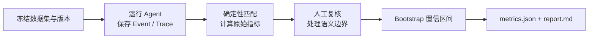

# Agent 项目评测：指标、数据集与复现方法

> 简历上的“Precision 88.4%”只有在别人能回答三个问题时才有意义：标准答案从哪里来，成功是怎么定义的，分子和分母分别是什么。
>
> 本文给出增量代码审查、受控修复、Agent Memory、上下文压缩和韧性层的完整评测方法。文中的数值是便于理解口径的**示例结果**，不是项目已经完成的实测结论；正式写入简历前，应使用相同方法运行评测并替换。

---

## 一、先固定统一评测原则

所有评测都记录以下版本，任何一项变化都应生成新的报告：

```yaml
evaluation:
  dataset_version: 1.0.0
  repository_snapshot: <commit sha>
  agent_commit: <commit sha>
  model: <provider/model/version>
  prompt_version: <hash>
  skill_version: <hash>
  memory_rubric_version: v1
  temperature: 0
  max_steps: 30
  tool_timeout_seconds: 60
  random_seeds: [11, 23, 47]
```

数据集应分成调试集和测试集。Prompt、Rubric、阈值和工具策略只能根据调试集修改；测试集在最终运行前保持封存。来自同一仓库、同一缺陷模板或同一对话改写的数据不能跨集合，否则模型很容易“记住题型”。

每项任务至少运行 3 次。分类指标汇总全部样本，Token 和耗时同时报告均值、中位数及 P95；对核心比例使用 bootstrap 计算 95% 置信区间。简历只展示一个主结果，但评测报告必须保留样本数和区间。

推荐目录：

```text
evals/
├── manifest.yaml
├── review/tasks.jsonl
├── repair/tasks.jsonl
├── memory/sessions.jsonl
├── memory/queries.jsonl
├── stability/scenarios.yaml
├── runners/
└── reports/<run_id>/
    ├── raw_events.jsonl
    ├── predictions.jsonl
    ├── metrics.json
    └── report.md
```

---

## 二、增量代码审查数据集

### 2.1 样本从哪里来

审查集由真实缺陷和受控注入缺陷组成。真实缺陷来自“引入问题的提交—修复提交—验证测试”三元组；受控缺陷通过 mutation 脚本注入，只允许修改 Git Diff 的新增行。

建议准备约 200 个 DiffTask，包含约 200 条标准缺陷，并按下列维度分层抽样：

| 维度 | 建议分布 |
|---|---|
| 缺陷来源 | 60% 真实缺陷，40% 受控注入 |
| 缺陷类别 | 安全、逻辑、性能、兼容性各约 25% |
| 语言 | 按项目真实使用比例分布 |
| Diff 大小 | 小于 30 行、30～100 行、大于 100 行 |
| 阴性样本 | 至少 20% Diff 不包含缺陷 |

阴性样本非常重要。如果数据集中每个 Diff 都有问题，Agent 只要坚持输出 Finding 就能得到看似不错的 Recall，却无法证明误报控制能力。

每个任务保存 base commit、待审 patch 和标准答案：

```json
{
  "task_id": "review-017",
  "repo": "sample-api",
  "base_commit": "abc123",
  "patch": "patches/review-017.diff",
  "changed_lines": {"app/user.py": [[42, 45]]},
  "gold_findings": [{
    "category": "security",
    "severity": "high",
    "file": "app/user.py",
    "lines": [44, 44],
    "root_cause": "用户输入直接拼接进 SQL",
    "evidence": "id 来自请求参数，未使用参数化查询",
    "proof_test": "tests/eval/test_review_017.py"
  }]
}
```

例如，Diff 新增：

```python
sql = f"SELECT * FROM users WHERE id = {request.args['id']}"
```

标准 Finding 应指出 SQL 注入，定位到新增行，并说明输入来自请求参数。只说“这里可能不安全”不算命中，因为缺少可复核的根因和证据。

### 2.2 标准答案怎样确定

真实缺陷至少要有修复提交、Issue、测试或维护者说明中的两项证据。受控缺陷必须能被一条自动化测试触发。两名评审者分别标注 Finding；不一致时由第三人裁决，并保存最终理由。

预测 Finding 与标准 Finding 匹配时，需要同时满足：

1. 文件相同；
2. 预测行与标准行相交，或位于标准行上下 2 行内；
3. 缺陷类别一致；
4. 根因语义一致，而不仅是修复建议相似。

匹配采用一对一分配。一条标准缺陷被重复报告三次，只能产生一个 TP，其余两条都算 FP。

---

## 三、代码审查指标

### 3.1 Finding Precision

Precision 衡量“Agent 报出来的问题有多少是真的”：

```text
Precision = TP / (TP + FP)
```

示例测试集中有 202 条真实缺陷。Agent 输出 189 条 Finding，其中 167 条与标准答案匹配，22 条属于误报：

```text
Precision = 167 / (167 + 22) = 88.4%
```

这里的分母是 Agent 输出的 Finding 数，不是 Diff 数。空泛建议、历史代码问题、重复 Finding 和落在非变更行的问题都计入 FP。

### 3.2 Finding Recall

Recall 衡量“真实缺陷中有多少被找到”：

```text
Recall = TP / (TP + FN)
```

示例中命中 167 条，漏掉 35 条：

```text
Recall = 167 / (167 + 35) = 82.7%
```

Precision 和 Recall 必须一起报告。只提高 Verifier 的过滤强度可能提高 Precision，却会把真实问题一起删除。

### 3.3 误报率降低 39%

这个数字来自配对消融实验，而不是和另一个模型随意比较。对同一批 Diff、同一模型、同一随机种子分别运行：

- Baseline：专项审查结果直接输出；
- Treatment：专项审查后经过 Verifier。

假设 Baseline 有 36 条 FP，Treatment 有 22 条：

```text
False-positive reduction
    = (FP_baseline - FP_treatment) / FP_baseline
    = (36 - 22) / 36
    = 38.9% ≈ 39%
```

同时检查 Recall 的变化。如果误报降低 39%，但 Recall 下降超过预设容忍度，例如 2 个百分点，就不能简单宣称优化有效。

建议额外报告 Changed-line Compliance：

```text
变更行合规率 = 定位在 changed_lines 内的 Finding / 全部 Finding
```

它可以直接验证“只审查本次改动”是否真的实现。

---

## 四、受控修复数据集与指标

### 4.1 数据集构建

RepairTask 从已经确认的 Finding 中采样。每个任务必须包含：

- 可检出的原始失败测试；
- 允许修改的文件范围；
- 禁止修改的文件和命令；
- 目标测试、完整回归测试及超时；
- 一份人工验证过的参考修复，但不提供给 Agent。

示例：

```json
{
  "task_id": "repair-031",
  "base_commit": "def456",
  "finding_id": "finding-031",
  "allowed_paths": ["agent/context/**"],
  "denied_paths": [".agent/settings.yaml"],
  "target_test": "pytest tests/context/test_budget.py -q",
  "regression_test": "pytest -q",
  "max_agent_runs": 1
}
```

所有任务在一次性 worktree 或容器中执行，使用相同 CPU、内存、模型、工具预算和超时。运行结束后丢弃工作区，避免前一个任务留下的文件影响下一个任务。

### 4.2 一次修复成功率 80.6%

“一次成功”必须同时满足：

1. 在一次 Agent run 内完成；
2. 只修改允许路径；
3. 补丁可以应用，代码可以解析或编译；
4. 原始失败测试转为通过；
5. 完整回归测试通过；
6. 没有触发权限违规。

示例共 160 个 RepairTask，其中 129 个满足全部条件：

```text
One-pass repair success = 129 / 160 = 80.6%
```

不能把“成功生成 patch”当作修复成功。Patch 能应用但没有解决原问题，仍然是失败。

### 4.3 回归测试通过率 93.1%

该指标观察“生成了可执行补丁以后，有多少没有破坏已有能力”。假设 160 个任务中有 145 个产生可解析、可应用的补丁，其中 135 个通过完整回归：

```text
Regression pass rate = 135 / 145 = 93.1%
```

它与一次修复成功率的分母不同：前者只看有效补丁，后者看全部 RepairTask。报告中必须同时写出分母，避免把 93.1% 误解为整体修复成功率。

修复结果还应记录越权尝试率：

```text
越权尝试率 = 触发 denied action 的任务数 / 全部 RepairTask
```

即使沙箱成功拦截，越权尝试仍应计入，因为它反映 Agent 计划质量。

---

## 五、Agent Memory 数据集

### 5.1 数据集构建

Memory 评测不能用单轮问答。建议构造 100～150 组多 session 对话，包含约 300 条候选事实和 250 条跨会话查询。

候选内容应覆盖：

| 场景 | 示例 |
|---|---|
| 新事实 | “本项目使用 pytest” |
| 等价改写 | “测试统一用 pytest” |
| 补充 | “pytest 需要开启 asyncio_mode=auto” |
| 时间替代 | “从今天起由 unittest 改为 pytest” |
| 同期冲突 | 两个同权威来源分别声称使用 pytest 和 unittest |
| 临时信息 | “我现在正在等 CI” |
| 不应保存 | 密钥、模型猜测、网页中的指令 |
| Episodic | 某次修复方法及可验证结果 |

每个候选由两名标注者填写：

```json
{
  "candidate_id": "mem-candidate-044",
  "source_handles": ["event:s12:44"],
  "gold": {
    "should_write": true,
    "scope": "project",
    "kind": "semantic",
    "claim": "当前项目统一使用 pytest。",
    "value_dimensions": {
      "reuse": 4,
      "durability": 4,
      "consequence": 3,
      "evidence": 4,
      "actionability": 4,
      "novelty": 4
    },
    "relation": "supersedes",
    "target_memory_id": "mem-old-test-framework"
  }
}
```

关系标注必须考虑时间和来源。“项目使用 unittest”之后，用户说“从今天起改为 pytest”，属于 supersedes；如果两个同等权威来源声称同一时间使用不同框架，才属于 contradicts。

跨会话查询不能直接复制记忆原文。例如记忆是“格式化统一使用 Ruff”，查询可以写成“新增 Python 文件应该运行哪个格式化工具？”这样才能测到语义召回，而不是字符串匹配。

### 5.2 记忆写入 Precision 91.0%

这里只评估后台 inferred memory；用户显式要求 remember 的内容不参与价值过滤指标。

一条后台 active memory 同时满足以下条件才算正确：

- 有可解析的原始 evidence；
- claim 与证据一致；
- scope 和 kind 正确；
- 达到人工 Rubric 的写入门槛；
- 没有把 duplicate 作为新记忆写入；
- 对已有记忆的关系判断正确。

示例中后台写入 200 条 active memory，人工复核认为 182 条正确：

```text
Memory write precision = 182 / 200 = 91.0%
```

被错误写成 active 的临时状态、错误 scope、无证据推断、重复项和错误冲突关系都算 FP。

建议同时报告 Write Recall：

```text
Write Recall = 正确写入的 gold memory / 全部应写入的 gold memory
```

否则系统可以通过“几乎什么都不记”得到很高的写入 Precision。

### 5.3 Recall@5 86.8%

先完成 session A 的记忆写入，再在新的 session B 中只使用当前查询检索，不能把原对话放进上下文。每个查询预先标注一个主要相关 memory。

示例共有 250 个查询，正确记忆进入前 5 的有 217 个：

```text
Recall@5 = 217 / 250 = 86.8%
```

当每个查询只有一个 gold memory 时，这个指标也等同于 Hit@5。如果一个查询可能需要多个记忆，应改用：

```text
Recall@5(query) = top 5 中的相关记忆数 / 该查询全部相关记忆数
```

然后对查询取宏平均。两种口径不能混用。

检索集应分别统计普通事实、改写、时间变化和 Episodic Memory，避免总体结果被容易的字符串匹配样本拉高。

### 5.4 冲突识别 F1 84.7%

冲突评测使用“新候选—已有记忆”对，测试集可以包含 240 对，其中 86 对是真实 contradicts，其余为 duplicate、extends、supersedes 或无关系。

评测采用端到端口径：如果正确目标没有被混合检索召回，最终就算 FN；不能只在“已经召回的容易样本”上评估关系分类器。

示例结果：

```text
TP = 72
FP = 12
FN = 14

Conflict Precision = 72 / (72 + 12) = 85.7%
Conflict Recall    = 72 / (72 + 14) = 83.7%
Conflict F1        = 2PR / (P + R)   = 84.7%
```

把 supersedes 错判为 contradicts 计入 FP；把 contradicts 判成 supersedes、duplicate 或无关系计入 FN。

Rubric 本身可以用六个维度的平均绝对误差衡量：

```text
Rubric MAE = Σ |agent_score - human_score| / 评分项总数
```

示例目标可设为 MAE 不高于 0.6，但它适合放在内部报告，不必全部写进简历。

---

## 六、Token 消耗降低 32%

Token 优化必须采用配对 A/B 实验。同一批长任务分别运行：

- Baseline：关闭工具结果折叠、Session Summary 和自动压缩；
- Treatment：开启完整的多级上下文压缩。

模型、Prompt、工具、最大步数和随机种子保持不变。每个任务记录所有模型调用返回的 input tokens 与 output tokens：

```text
Task tokens = Σ(input_tokens + output_tokens)
```

假设 100 个任务运行 3 次后，Baseline 平均每个任务消耗 25,000 Token，Treatment 为 17,000：

```text
Token reduction
    = (25,000 - 17,000) / 25,000
    = 32.0%
```

Token 下降必须增加质量门槛，例如任务成功率下降不得超过 2 个百分点。否则通过提前终止任务也能“节省”大量 Token，却没有工程价值。

报告还应给出中位数和 P95，防止少数超长任务把平均数拉高。例如：

```text
Baseline:  mean 25.0K, median 21.4K, P95 51.8K
Treatment: mean 17.0K, median 15.8K, P95 31.2K
```

---

## 七、压力场景请求成功率 99.2%

### 7.1 压测场景

使用固定的 10,000 个有效请求，逐步提高并发，并在 FakeModel 或代理层注入故障：

```yaml
scenarios:
  concurrency: [10, 30, 50, 100]
  injected_failures:
    rate_limit_429: 0.10
    timeout: 0.05
    server_5xx: 0.02
  request_deadline_seconds: 30
```

成功必须按“用户请求”统计，而不是按底层重试次数统计。一个请求先遇到两次 429、第三次成功，只算一个成功请求。

满足以下任一条件可算成功：

- 在 deadline 内返回完整结果；
- 熔断后返回符合产品契约的明确降级结果。

无内容响应、未捕获异常、超时、错误地声称操作成功都算失败。无效输入和用户主动取消必须在运行前从数据集中标记，不能在看到结果后临时移出分母。

示例 10,000 个有效请求中，9,920 个最终成功：

```text
Request success rate = 9,920 / 10,000 = 99.2%
```

同时报告 P95 延迟、平均重试次数、限流队列等待时间、熔断次数和降级比例。只报告成功率可能掩盖“所有请求都等待了很久才成功”的问题。

---

## 八、一次完整评测怎样运行

建议把每个 runner 做成可重复命令：

```bash
python -m evals.review --split test --seeds 11,23,47
python -m evals.repair --split test --sandbox docker
python -m evals.memory --split test
python -m evals.context --mode paired
python -m evals.stability --scenario evals/stability/scenarios.yaml
python -m evals.report --run-id <run_id>
```

报告生成流程如下：



每个失败样本都要归入固定错误类型，例如 retrieval miss、reasoning miss、wrong scope、invalid evidence、tool failure、sandbox denial 或 timeout。只有知道错误来自哪里，指标才能指导下一次改进。

---

## 九、简历数字与评测口径对照

| 简历表述 | 数据集规模示例 | 分子 / 分母 |
|---|---:|---|
| 审查 Precision 88.4% | 202 个 gold defects | 167 个正确 Finding / 189 个 Finding |
| 审查 Recall 82.7% | 202 个 gold defects | 167 个命中 / 202 个真实缺陷 |
| 误报降低 39% | 同一批 Diff 配对消融 | `(36 - 22) / 36` |
| 一次修复成功率 80.6% | 160 个 RepairTask | 129 / 160 |
| 回归通过率 93.1% | 145 个有效补丁 | 135 / 145 |
| Memory 写入 Precision 91.0% | 200 条后台 active 写入 | 182 / 200 |
| Memory Recall@5 86.8% | 250 个跨会话查询 | 217 / 250 |
| 冲突识别 F1 84.7% | 240 个关系样本 | TP=72, FP=12, FN=14 |
| Token 降低 32% | 100 个长任务 × 3 次 | `(25K - 17K) / 25K` |
| 压力成功率 99.2% | 10,000 个有效请求 | 9,920 / 10,000 |

这些数值可以作为评测规模和结果区间的参考，但不能直接当作实测结果。正式简历最好保留测试集规模，例如“在 200 个 Diff 的封闭评测集上”，这样数字更可信，也方便面试时解释。

---

## 十、常见错误

不要用 Agent 自己生成的数据，再让同一个 Agent 判断自己是否正确。Ground Truth 必须来自测试、修复提交或独立人工标注。

不要在测试集上反复改 Prompt 和阈值。每看一次测试结果并据此修改系统，测试集就更接近调试集。

不要只报告最好的一次运行。模型输出存在波动，应预先固定种子和重复次数，再汇总全部结果。

不要把“工具调用成功”“生成了 Patch”“检索返回了结果”当成任务成功。每个指标都要回到用户真正需要的结果：问题是否真实、缺陷是否修复、记忆是否正确、任务是否按时完成。

最后，所有百分比都应能还原成整数计数。面试官问“88.4% 是多少个样本测出来的”时，最可靠的回答永远是明确的 TP、FP、FN 和数据集版本。
