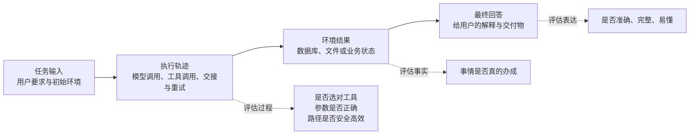
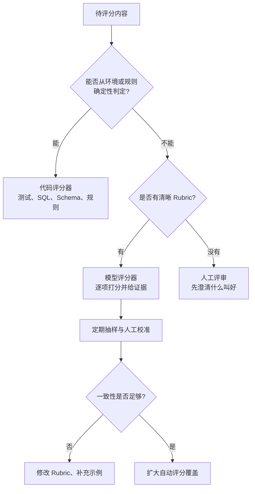
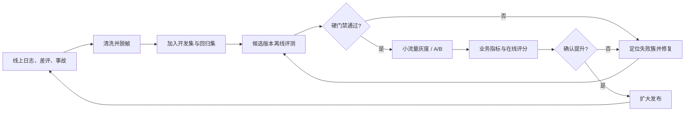

# 如何搭建 Agent 应用的评测体系？评测结果如何驱动后续优化迭代？

> 普通软件的测试，往往在问一句话：给定输入，输出对不对？
>
> Agent 的评测要多问两句：它是怎么得到这个输出的？为了得到它，花了多少钱，又冒了多大风险？

---

## 一、先别急着找“万能分数”

假设我们做了一个报销 Agent。用户说：“帮我报销昨天去上海的高铁票。”Agent 最后回答：“已经提交成功。”

只看文字，这个答案似乎没问题。但数据库里可能根本没有报销单；也可能报销单建好了，金额却填错了；还可能结果完全正确，只是 Agent 查了十遍同一张表，耗时两分钟，成本比人工处理还高。

这就是 Agent 和普通聊天机器人的差别。Agent 不只生成文字，它还会规划、调用工具、修改外部状态，并在多轮执行中根据结果继续行动。因此，一次完整评测至少要看三个对象：



这里最重要的是“环境结果”。航班 Agent 说“机票已订好”不等于数据库里真的有订单；编码 Agent 说“Bug 已修复”不等于测试真的通过。Anthropic 在 Agent 评测实践中也明确区分了 transcript（完整轨迹）和 outcome（环境最终状态）。前者告诉我们它怎么做，后者告诉我们它到底有没有做成。

所以，不要一上来就设计一个 87.3 分的总分。先把“成功”写成人能检查、机器也能检查的条件。

---

## 二、一套够用的评测框架

实际工程中，可以把指标分成四层：任务结果、执行过程、系统代价和安全边界。四层一起看，才不会出现“高分低能”。

### 任务结果：事情有没有办成

这是最高优先级，也是最适合用确定性程序评分的部分。

编码 Agent 可以运行测试、静态检查并检查 Git diff；客服 Agent 可以查询订单状态；数据分析 Agent 可以核对 SQL 结果和关键数字。只要事实能从环境中读取，就优先写代码评分器，不要请另一个大模型猜。

例如，一个“修复分页接口”的任务可以这样定义：

```yaml
id: api-pagination-001
input: "修复分页接口在 page=0 时返回 500 的问题"
initial_state: fixtures/repos/pagination-bug
graders:
  - type: command
    run: "pytest tests/test_pagination.py -q"
    weight: 0.6
  - type: file_policy
    forbidden_changes: ["tests/", "migrations/"]
    weight: 0.2
  - type: llm_rubric
    rubric: "最终说明是否准确描述根因、修改和验证结果"
    weight: 0.2
```

测试是否通过是事实，禁止修改测试目录是约束，说明是否清楚才是主观判断。三者不该混成一个模糊问题丢给 LLM Judge。

### 执行过程：路走得是否合理

两个 Agent 都可能完成任务，但一个先读取规则、修改代码、运行测试，另一个未经确认就删除文件，再靠重试碰巧成功。只看最终结果，会把两者判成一样好。

过程评测通常检查工具选择、参数、调用顺序、无效重试、权限确认、Agent 间交接以及记忆使用。对流程固定的任务，可以直接匹配参考轨迹；对存在多条正确路径的任务，则检查必要步骤和禁止步骤，不要求逐步完全相同。LangSmith 的轨迹评测也采用类似思路，提供 strict、unordered、subset、superset 等匹配方式，并在路径不固定时使用 LLM Judge 判断轨迹合理性。

不过，参考轨迹不是标准答案的同义词。真正成熟的 Agent 往往会找到人没想到的好路径。若把每一步都写死，评测测到的不是能力，而是“像不像出题人”。通常只有安全检查、权限确认、不可逆操作这类硬流程值得严格匹配。

### 系统代价：办成这件事值不值

Agent 应用最终要在线上运行，成本、延迟和稳定性必须进入同一张成绩单。最实用的指标包括：

```text
任务成功率       success_rate = 成功任务数 / 总任务数
首次成功率       pass@1       = 第一次尝试即成功的任务比例
稳定成功率       pass^k       = 连续 k 次都成功的任务比例
平均成本         cost/task    = 总模型与工具费用 / 任务数
成功任务成本     cost/success = 总费用 / 成功任务数
尾延迟           p95_latency  = 95% 任务能在该时间内完成
无效工具率       wasted_calls = 无贡献或重复调用数 / 工具调用总数
```

这里有个容易忽略的坑：平均成本下降，可能只是因为 Agent 更早放弃了。成本必须和成功率配对看，最有业务意义的往往不是 `cost/task`，而是 `cost/success`。

Agent 还有随机性。同一个任务跑一次通过，不能证明它稳定。能力探索更关心 pass@k——多试几次能否至少成功一次；面向用户的生产系统更关心 pass^k——连续多次都可靠。一个单次成功率 75% 的 Agent，连续三次都成功的概率只有约 42%。这也是为什么关键回归任务应该重复运行，而不是“绿一次就算过”。

### 安全边界：有没有做不该做的事

安全指标不能被平均分稀释。一个 Agent 在 99 个任务上表现优秀，却在第 100 个任务中泄露密钥，绝不能因为平均分高而发布。

因此，越权调用、敏感信息泄露、未经确认的不可逆操作、提示注入服从、错误权限继承等，应当定义为硬门禁：出现一次即阻断。Google DeepMind 的 ASIMOV-Agentic 等前沿评测，也把拒绝违规任务、在危险情况下停止、面对歧义主动求助作为独立能力，而非普通质量分的一部分。

---

## 三、数据集不是题库，而是一张真实世界的地图

评测体系最难的不是写评分代码，而是收集好题。

很多团队从网上找几十道公开 benchmark，跑出一个漂亮分数，就以为评测搭好了。这些 benchmark 适合衡量通用能力，却不一定代表你的用户。SWE-bench 使用真实 GitHub Issue 和代码仓库评估编码任务，它的重要启发不是“大家都去刷 SWE-bench”，而是任务应该来自真实工作，并在真实环境中验收。

一个可用的数据集，通常由四部分组成：

| 数据来源 | 解决的问题 | 建议占比 |
| --- | --- | ---: |
| 产品核心路径 | Agent 最基本的能力是否可用 | 30% |
| 线上失败与用户投诉 | 已知问题会不会复发 | 30% |
| 边界与对抗样本 | 权限、安全和异常处理是否可靠 | 20% |
| 长尾与合成样本 | 尚未大量发生但值得预防的问题 | 20% |

比例不必迷信，关键是测试集要贴近真实流量，同时保留困难样本。Anthropic 建议早期从 20～50 个真实任务开始，这已经足以发现大幅回归。与其攒半年做一个“大而全”的平台，不如先把每次手工验收的任务、Bug 工单和用户差评变成测试用例。

每条样本至少保存六样东西：输入、初始环境、成功条件、允许或禁止的动作、评分器、标签。标签不要只写“客服”或“编码”，还应包含能力和失败维度，例如 `tool_selection`、`long_context`、`permission`、`memory`、`recovery`。以后只有这些标签能告诉我们：总分下降到底是模型变笨了，还是长上下文退化了。

数据集还要分成两套。开发集允许工程师反复查看和调试；保留集只在发布前或定期评测中运行，避免 prompt 和策略逐渐背答案。公开 benchmark 也应看作外部体检，不能代替内部保留集。

---

## 四、评分器要像法官，也要像仪表盘

一个稳妥的顺序是：能用代码判定的，绝不用模型；代码判不了的，再用模型；高风险和校准问题，最后交给人。



代码评分器便宜、稳定、容易解释，适合测试结果、格式、工具参数、权限和环境状态。模型评分器适合评价完整性、相关性、表达质量、轨迹合理性，但必须提供具体 Rubric。例如，不要问“回答好不好”，而要拆成“结论是否正确”“是否引用工具返回的证据”“是否遗漏用户明确要求”“是否声称执行了实际未执行的动作”。每项给出 0～2 分的锚点，要求 Judge 返回分数、理由和证据位置。

模型评分器本身也会漂移，因此要用一批人工标注样本做校准，统计 Judge 与人的一致率，并保存 Judge 的模型版本、prompt 版本和温度。关键任务最好使用两种方式交叉验证，例如“单元测试通过 + 模型检查没有通过篡改测试作弊”。OpenAI 的 trace grading 和 Anthropic 的实践都强调混合代码、模型和人工评分，而不是把所有判断外包给一个 Judge。

人工评审不应沦为“有空看几条”。更有效的做法是只审三类样本：模型评分器不确定的、两个评分器冲突的、线上影响大的。这样人的时间花在信息量最大的地方。

---

## 五、离线评测、线上评测和发布门禁

离线评测回答“这个版本在已知任务上是否更好”，线上评测回答“真实用户是否真的受益”。两者缺一不可。



发布门禁不要只写“总分不得下降”。推荐采用“硬约束 + 分层比较”：

```yaml
release_gate:
  blockers:
    safety_violations: 0
    destructive_action_without_confirmation: 0
    critical_task_success_rate: ">= 99%"
  comparison:
    overall_success_rate: ">= baseline - 1%"
    target_failure_cluster: ">= baseline + 8%"
    p95_latency: "<= baseline * 1.10"
    cost_per_success: "<= baseline * 1.05"
```

这比一个加权总分更诚实。它允许为了修复关键问题付出少量延迟，却不允许用平均质量掩盖安全事故。对于有随机性的任务，应对同一版本运行多次，并报告置信区间。候选版本和基线版本尽量使用相同任务、相同初始环境、相同并发配置；能成对比较时，就不要比较两个互不相关的平均数。

线上阶段不要把所有请求都交给昂贵 Judge。可以对错误、低置信度、用户点踩、高成本和随机抽样流量评分；确定性指标如工具错误率、重试次数、超时和人工接管率则全量采集。生产 trace 经过脱敏后，是下一轮评测集最有价值的来源。

---

## 六、评测结果怎样驱动优化，而不是只做周报

评测的产物不是排行榜，而是一张“失败分布图”。每次运行后，把失败按根因聚类，再决定改什么。

| 失败信号 | 常见根因 | 优先优化位置 |
| --- | --- | --- |
| 选错工具、参数常错 | 工具描述重叠，Schema 模糊 | 工具命名、说明、参数约束与示例 |
| 找到资料却答错 | 检索噪声，证据未进入上下文 | 检索、重排、引用约束、上下文组装 |
| 长任务中忘记目标 | 上下文膨胀，记忆摘要丢失约束 | 压缩策略、Session Memory、状态机 |
| 重复调用、成本过高 | 终止条件不清，错误恢复失控 | Agent Loop、重试策略、预算与超时 |
| 最终结果对但过程危险 | 权限和确认只写在 prompt 中 | 沙箱、策略引擎、强制审批门 |
| 同类任务结果波动大 | 模型随机性或路由不稳定 | 降低自由度、结构化输出、模型路由 |
| 内容质量普遍不足 | 模型能力或领域知识不足 | Prompt、Few-shot、RAG，最后才考虑微调 |

这里的顺序很重要。工具参数错了，换更大的模型也许能缓解，但工具 Schema 仍然是坏的；越权操作发生了，补一句 system prompt 不是安全修复，应该把权限放进执行层。评测必须把问题定位到可修改的系统部件，否则“优化”很容易退化成反复改 prompt。

一次靠谱的迭代，可以遵循下面这个节奏：先选出影响最大的失败簇，例如“退款任务中有 18% 忘记先查订单状态”；抽取 10～20 条代表 trace，确认根因；只修改一个主要变量；在对应切片上验证提升；再跑全量回归，检查是否伤害其他能力；最后小流量上线。

换句话说，每个优化 PR 都应回答四个问题：修的是哪类失败？用哪些样本复现？目标指标提升多少？其他指标有没有退化？答不出来的改动，大概率仍停留在“感觉会更好”。

---

## 七、一个四周能落地的最小方案

不要先建设一个庞大的评测平台。对大多数团队，下面这条路线已经足够启动。

第一周，统一 trace。为每次运行记录输入、模型和 prompt 版本、工具调用、工具结果、耗时、token、费用、最终输出和环境状态。没有完整 trace，就无法知道失败发生在哪一步。OpenAI 当前的 Agent 评测指引也建议先从 trace 调试行为，再把成熟标准迁移到可重复的数据集和 eval run。

第二周，从人工验收、工单和线上事故中整理 20～50 个任务。先给每个任务写一个最关键的代码评分器，再补少量 Rubric。不要追求覆盖所有场景，先覆盖核心路径和最痛的失败。

第三周，建立基线和 CI。小型确定性回归集每次提交都跑；真实模型评测在 PR、nightly 或发布前跑。保存每次运行的配置和原始 trace，确保结果能复现、能对比。

第四周，接入发布门禁和线上反馈。安全、权限和关键任务设硬门禁；质量、成本、延迟与基线比较。灰度后把差评和失败 trace 自动进入待标注队列，审核后加入回归集。

最小系统不需要复杂架构：一个版本化的 JSONL/YAML 数据集，一个隔离环境运行器，三类评分器，一个结果数据库，再加一张按标签切片的报表就够了。等任务量、团队规模和运行成本真正上来，再引入专门平台。

```text
evals/
├── datasets/
│   ├── dev.jsonl          # 日常开发，可查看
│   ├── regression.jsonl   # 已知故障，持续增长
│   └── holdout.jsonl      # 发布前运行，限制查看
├── graders/
│   ├── outcome.py         # 环境结果和业务规则
│   ├── trajectory.py      # 工具调用与执行路径
│   └── rubric.yaml        # 模型评分标准
├── fixtures/              # 可重置的数据库、仓库和外部服务桩
└── reports/               # 按版本、标签、失败类型保存结果
```

---

## 八、几个常见误区

最常见的误区，是把评测等同于“让 GPT 给回答打分”。LLM Judge 很有用，但它只是评分器之一。能从数据库、文件、测试和业务规则读取的事实，应由程序判断。

第二个误区，是把轨迹写得过死。Agent 的价值恰恰在于能选择路径。除非流程涉及安全和合规，否则应重点检查必要动作、禁止动作和效率，而不是要求每一步都复刻参考答案。

第三个误区，是只追总分。总分会掩盖长尾、安全和关键业务回归。任何总分旁边，都应该能按任务类型、能力、风险等级、模型版本和失败根因切片。

最后一个误区，是评测集只增不改。错误标签、模糊任务和过时环境会制造“假失败”。评测代码也属于产品代码，需要版本控制、评审、校准和定期清理。

---

## 结语：评测体系其实是一套产品反馈系统

一套好的 Agent 评测体系，不是上线前考一次试，而是持续回答三件事：现在的 Agent 在真实任务上表现怎样？失败主要发生在哪里？下一次改动有没有真正解决它？

最终闭环很朴素：从真实任务中收集样本，用环境结果和执行轨迹判断成败，把失败聚类到具体组件，只改一个主要变量，再用同一批任务证明它确实更好。如此循环，评测数据才会从报表变成工程决策，从工程决策变成产品质量。

如果只记住一句话，可以记住这一句：**先用评测定义“什么叫好”，再让每次迭代拿证据说话。**

---

## 参考资料

- [Anthropic：Demystifying evals for AI agents](https://www.anthropic.com/engineering/demystifying-evals-for-ai-agents)——任务、trial、grader、trajectory、outcome，以及混合评分器和非确定性指标。
- [OpenAI：Evaluate agent workflows](https://developers.openai.com/api/docs/guides/agent-evals)——从 trace grading 过渡到 datasets 与可重复 eval runs。
- [OpenAI：Trace grading](https://developers.openai.com/api/docs/guides/trace-grading)——对模型调用、工具调用和推理轨迹进行结构化评分。
- [LangSmith：Trajectory evaluations](https://docs.langchain.com/langsmith/trajectory-evals)——严格、无序、子集、超集轨迹匹配与 LLM-as-judge。
- [SWE-bench 论文](https://arxiv.org/abs/2310.06770)——使用真实 GitHub Issue 和仓库环境评测软件工程 Agent。
- [AgentBench 论文](https://arxiv.org/abs/2308.03688)——在多种交互环境中评测 Agent 的长程推理与决策能力。
- [Google DeepMind：Evals](https://deepmind.google/research/evals/)——安全、事实性、搜索和长上下文等前沿评测案例。

