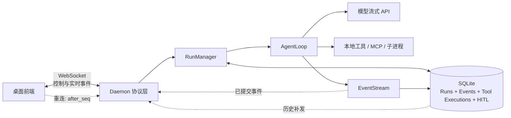
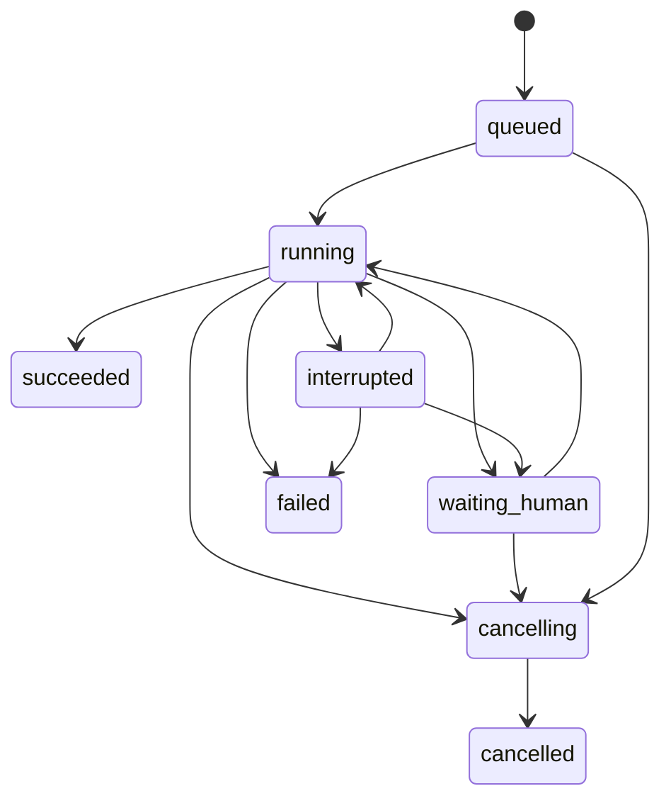
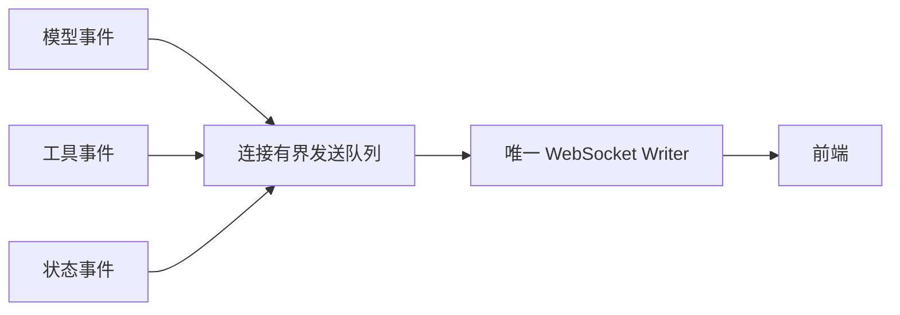
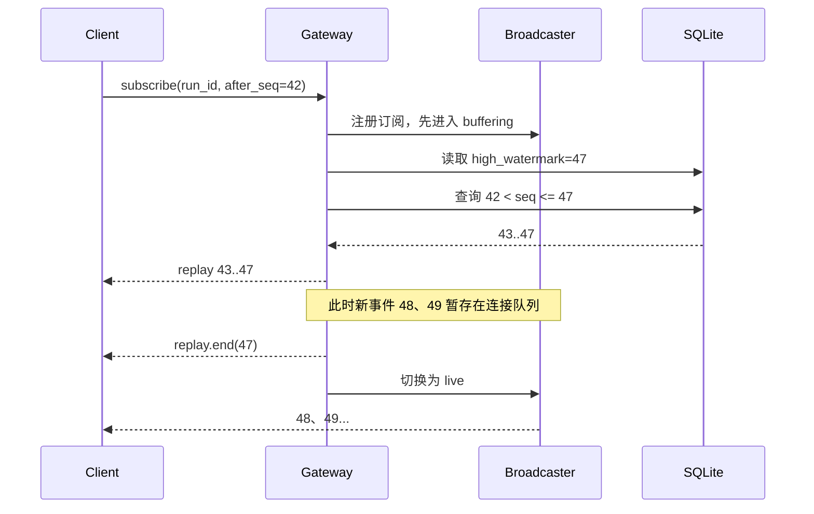
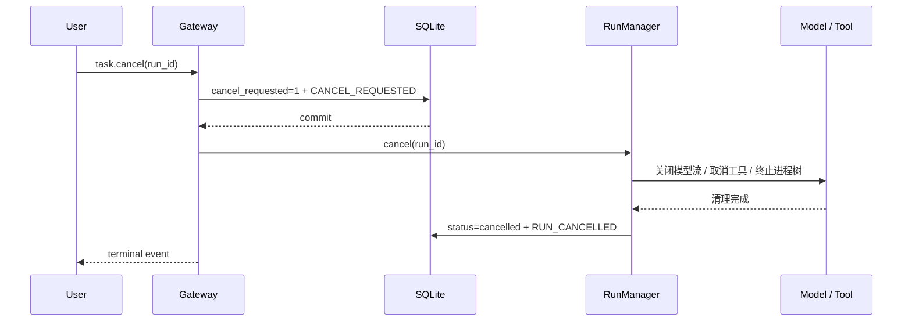
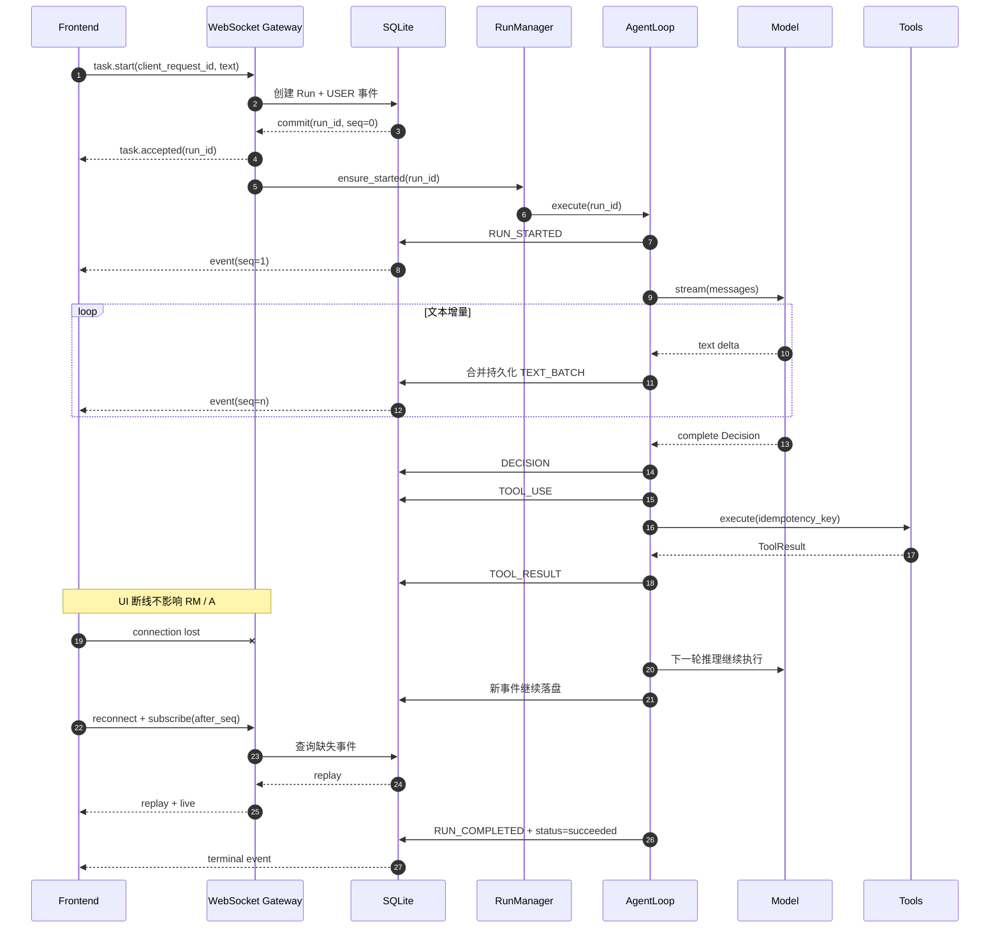

# Agent 长连接、崩溃恢复与断点重连

## 1. 先说结论

长时间运行的 Agent 任务不应该依赖一条始终不断的网络连接。合理的最终形态是：

> **任务由持久化的 Run 驱动，事件由 EventStream 保存，WebSocket 只负责实时通知；连接断开后任务继续运行，客户端重连时根据事件序号补齐历史，daemon 崩溃后根据持久化状态恢复到最近一个安全边界。**

本文采用与项目部署方式匹配的单机最终形态：进程内 `RunManager`、事务化 SQLite 和可重放的 `EventStream`。不引入 Redis、Kafka、Temporal 或独立 Worker 集群，重点是把“连接”“任务”“事件”三个生命周期分开。

最终架构可以概括为：



这里有三条必须坚持的原则：

1. **连接断开不等于任务取消**。WebSocket 消失只说明前端暂时收不到通知，不能据此停止 Agent。
2. **只发送已经提交的业务事实**。事件先持久化，再推送；否则客户端看见的内容可能在重连后消失。
3. **恢复不是恢复 Python 协程**。崩溃后重建的是业务状态，并从最近的安全边界重新执行，而不是让已经消失的调用栈“原地复活”。

## 2. 先区分四个容易混淆的概念

### 2.1 长连接

长连接指前端与 daemon 之间长期保持的 WebSocket。它适合承载模型文本增量、工具状态、审批请求、取消命令和任务状态变化。

长连接解决的是“低延迟通信”，不是“可靠存储”。TCP 和 WebSocket 能保证一条存活连接内的数据有序，但连接断开后并不知道客户端最后处理到了哪条业务事件，也不会自动补发断线期间的内容。

### 2.2 断线重连

断线重连是传输层恢复。前端网络抖动、休眠或切换页面后重新建立 WebSocket，并携带最后确认的事件序号 `after_seq`。服务端先补发缺失事件，再切回实时推送。

断线重连期间，daemon 和 Agent 任务仍然存活，因此不需要重新执行模型或工具。

### 2.3 崩溃恢复

崩溃恢复是进程级恢复。daemon 被杀死、机器重启或进程异常退出后，内存中的 `asyncio.Task`、Future、锁和网络连接全部消失。新 daemon 启动时从 SQLite 读取未完成 Run，判断最后完成到哪个业务边界，再决定继续等待、重新调用或进入人工确认。

### 2.4 断点续跑

断点续跑是业务层恢复。断点不是 Python 源码行号，而是已经持久化的语义边界，例如：

- 一次完整模型 `Decision` 已提交；
- 某个工具调用已经登记但还没有结果；
- Agent 正在等待用户审批；
- 所有工具结果已经提交，可以开始下一轮模型推理。

因此，EventStream 是断点恢复的重要基础，但只有事件还不够。系统还需要 Run 状态和工具执行账本，才能判断“接下来应该做什么”。

## 3. 最终架构中的核心对象

### 3.1 Session 与 Run 必须分开

`Session` 表示长期对话，可以包含很多轮用户请求；`Run` 表示其中一次可独立开始、取消、失败和完成的 Agent 执行。

```text
Session
├── Run 1：解释项目结构       succeeded
├── Run 2：修改认证代码       cancelled
└── Run 3：执行完整测试       running
```

如果只使用 `session_id`，就很难准确回答以下问题：用户取消的是哪一次请求、哪次执行失败、某条事件属于哪轮任务，以及断线后应该订阅哪次任务。因此每次用户提交都必须立即生成稳定的 `run_id`。

同一 Session 同时只允许一个前台 Run 处于执行态。不同 Session 可以并发运行。这样既保护会话消息和上下文顺序，也不会让一个慢任务阻塞全部用户。

### 3.2 Run 状态机

状态不宜过细，否则每增加一个模型或工具阶段都要扩充状态机。最终保留以下状态即可：



其中：

- `queued`：请求已经可靠接收，尚未开始执行；
- `running`：正在进行模型推理、工具调用或上下文处理；
- `waiting_human`：等待澄清、计划确认或高风险工具审批；
- `cancelling`：取消请求已经持久化，正在清理模型流、工具和子进程；
- `cancelled`、`succeeded`、`failed`：终态；
- `interrupted`：进程崩溃后发现执行停在不确定边界，正在恢复或等待处置。

“正在调用模型”或“正在执行工具”不必都做成 Run 状态，可以由最后一条事件和工具执行账本表达，避免状态组合爆炸。

### 3.3 最小持久化模型

在已有 `sessions` 和 `events` 基础上，最终只增加 `runs`，并给现有 `events` 增加 Run 归属和业务幂等键。`EventStream` 是内存中的事件追加、订阅抽象，`events` 是它唯一的 SQLite 持久化表，二者不是两份数据，也不再创建 `run_events`。

```sql
CREATE TABLE runs (
    run_id             TEXT PRIMARY KEY,
    session_id         TEXT NOT NULL,
    client_request_id  TEXT NOT NULL,
    status             TEXT NOT NULL,
    input_text         TEXT NOT NULL,
    cancel_requested   INTEGER NOT NULL DEFAULT 0,
    next_seq           INTEGER NOT NULL DEFAULT 0,
    created_at         REAL NOT NULL,
    updated_at         REAL NOT NULL,
    finished_at        REAL,
    error_json         TEXT,
    UNIQUE(session_id, client_request_id)
);

ALTER TABLE events ADD COLUMN run_id TEXT;
ALTER TABLE events ADD COLUMN event_key TEXT;

CREATE INDEX idx_events_run_seq
ON events(run_id, seq);

CREATE UNIQUE INDEX uq_events_business_key
ON events(run_id, type, event_key)
WHERE event_key IS NOT NULL;
```

最终只有三层概念：

| 结构 | 职责 |
|---|---|
| `EventStream` | 进程内追加、排序和实时分发事件 |
| `events` | EventStream 唯一的持久化、审计和回放来源 |
| `runs` | 当前 Run 状态投影，用于快速查询、取消和终态条件更新 |

现有 `events` 的主键仍然保持 `(session_id, seq)`，因此 `seq` 继续是会话级单调游标；`run_id` 只标识事件属于哪次用户执行。顶层请求可以让 `run_id` 与当前的 `message_id` 使用同一个值，避免为同一轮再制造一套无关 ID。按 Run 重连时查询：

```sql
SELECT * FROM events
WHERE session_id = ? AND run_id = ? AND seq > ?
ORDER BY seq;
```

`event_key` 不是事件序号，而是少数事件的业务唯一键。例如同一个工具调用的开始事件使用 `event_key=tool:<tool_call_id>`，同一个人工请求使用 `event_key=human:<request_id>`。唯一索引保证同一种业务事件不会因重试被插入两次。允许重复出现的尝试事件需要把次数纳入 key，例如 `tool:<tool_call_id>:retry:2`。

工具和人工请求的详细内容直接保存在对应事件的 `json` 中：

```json
{
  "type": "tool_use",
  "event_key": "tool:call_123",
  "tool_call_id": "call_123",
  "tool_name": "write_file",
  "arguments": {"path": "README.md", "content": "..."},
  "idempotency_key": "7dd552e5-...",
  "arguments_fingerprint": "sha256:..."
}
```

```json
{
  "type": "human_requested",
  "event_key": "human:approval_123",
  "request_id": "approval_123",
  "kind": "tool_approval",
  "request": {"tool_call_id": "call_123", "risk": "high"}
}
```

这里的 JSON 是完整 Event 的规范序列化；`run_id/type/event_key/seq` 列只是从同一个 Event 同步写出的索引字段，用于排序、过滤和唯一约束，不是另一份可独立修改的业务状态。

恢复时对一个未完成 Run 的事件按 `seq` 做 fold 即可得到当前状态：

```text
TOOL_USE - TOOL_RESULT           = 未完成工具
HUMAN_REQUESTED - HUMAN_RESOLVED = 未完成的人机交互
```

因此在本项目的单机最终形态里，不额外建立 `tool_executions` 和 `human_requests`。这两张表会与 EventStream 重复保存同一事实，还会引入双写一致性问题。只有 `run_id`、`type`、`seq`、`event_key` 这类用于过滤、排序和唯一约束的字段需要成为数据库列；工具参数、结果、问题和回答保存在 JSON 中即可。不能把 `event_key` 也只藏在 JSON 里，否则数据库难以用普通唯一索引原子阻止重复消费。

`runs.status` 虽然可以从 events 推导，但仍值得保留：它是事件流的当前状态投影，让“列出未完成任务”“终态条件更新”和“取消与完成竞态”不必每次扫描整个事件流。Run 状态变化与对应事件必须在同一个事务中提交。

不需要保存 Python 栈、协程对象或 Future。它们都是进程内临时对象，重启后根据 `runs + events` 重新创建。

## 4. 长任务的请求与执行流程

### 4.1 请求必须先被可靠接收

客户端发起任务时携带自己生成的 `client_request_id`：

```json
{
  "type": "task.start",
  "session": "session_123",
  "payload": {
    "client_request_id": "req_01K...",
    "text": "分析并修复这个项目"
  }
}
```

服务端在一个 SQLite 事务中创建 Run 和首条用户事件，事务提交成功后立即返回：

```json
{
  "type": "task.accepted",
  "session": "session_123",
  "payload": {
    "run_id": "run_01K...",
    "status": "queued",
    "last_seq": 0
  }
}
```

`task.accepted` 的含义是“任务已经可靠落盘”，不是“任务已经完成”。这与长耗时 HTTP API 通常先返回 `202 Accepted` 和状态查询地址的思想一致，只是本项目通过 WebSocket 返回确认并继续推送事件。

`client_request_id` 用于请求幂等。如果客户端发送后没有收到确认，它可以用同一个 ID 重试；服务端返回原有 `run_id`，不能创建两个相同任务。

### 4.2 执行不能挂在连接处理函数上

协议处理函数只负责校验、持久化和提交给 `RunManager`，不能一直 `await AgentLoop.run()` 到任务结束。否则连接取消、handler 异常或会话切换容易把任务一起带走。

```python
async def handle_task_start(message):
    run = run_store.create_idempotently(message)
    run_manager.ensure_started(run.run_id)
    return task_accepted(run)
```

`RunManager` 持有强引用，避免后台 `asyncio.Task` 被垃圾回收，并在任务完成时统一收尾：

```python
class RunManager:
    def __init__(self):
        self.tasks: dict[str, asyncio.Task] = {}

    def ensure_started(self, run_id: str) -> None:
        task = self.tasks.get(run_id)
        if task is None or task.done():
            self.tasks[run_id] = asyncio.create_task(self._execute(run_id))
```

WebSocket 断开时，只删除该连接对应的订阅者，不取消 `self.tasks[run_id]`。只有明确的 `task.cancel`、运行超时或 daemon 关闭策略才能改变 Run。

### 4.3 事件先提交，再推送

每个正式事件都通过同一个入口追加：

```python
async def append_event(run_id, event_type, payload, new_status=None):
    # 事务内：分配 seq、插入事件、更新 Run 状态
    event = store.append_atomically(run_id, event_type, payload, new_status)
    # 事务提交之后才通知在线客户端
    broadcaster.publish(event)
    return event
```

顺序不能反过来。如果先通过 WebSocket 发送再写数据库，进程可能在两步之间崩溃，前端已经看到一条永远无法回放的“幽灵事件”。

一次事务应同时完成：

1. 读取并递增 `runs.next_seq`；
2. 插入 `(run_id, seq)` 唯一的事件；
3. 必要时更新 Run 状态；
4. 提交后再进入实时广播队列。

因此 EventStream 的因果顺序来自持久化序号，而不是系统时间。时间戳只用于展示和排查，不能代替序号。

## 5. 哪些事件需要持久化

事件分为“业务事实”和“实时预览”。业务事实必须落盘，实时预览可以丢失。

| 事件 | 是否持久化 | 原因 |
|---|---:|---|
| `RUN_STARTED` | 是 | 标记 Run 已开始 |
| `USER` | 是 | 恢复会话输入 |
| `TEXT_BATCH` | 是 | 重连后恢复已展示的部分文本 |
| `TOOL_CALL_DELTA` | 否 | 参数尚不完整，不能作为可执行事实 |
| `DECISION` | 是 | 一次完整模型决策的语义提交点 |
| `TOOL_USE` | 是 | 证明工具已经进入执行阶段 |
| `TOOL_RESULT` | 是 | 恢复模型上下文和判断是否需要重试 |
| `HUMAN_REQUESTED` | 是 | 重启后重新展示审批或澄清 |
| `HUMAN_RESOLVED` | 是 | 防止重复消费用户回答 |
| `CANCEL_REQUESTED` | 是 | 取消意图不能只存在于内存 |
| `RUN_CANCELLED` | 是 | 明确终态 |
| `RUN_COMPLETED` | 是 | 明确终态和最终答案 |
| `RUN_FAILED` | 是 | 保存结构化失败原因 |

模型通常会产生大量很小的文本 delta。如果每个 token 都开一次 SQLite 事务，写放大会很明显。合理方式是实时显示可以逐片推送，而持久化按 **50～100ms 或 1～4KiB** 合并成 `TEXT_BATCH`。崩溃最多丢失一个很短的预览尾巴；当完整 `DECISION` 提交后，它才是后续模型上下文的语义真相。

完整工具参数只能在模型流结束、JSON 解析成功后随 `DECISION` 落盘。半截 `tool_call_delta` 只适合 UI 预览，绝不能在恢复时直接执行。

## 6. WebSocket 应该承担什么

WebSocket 在最终架构中只承担两类职责：

- 控制消息：开始、取消、订阅、审批、澄清回答；
- 实时通知：文本、工具状态、Run 状态和错误。

它不承担任务存储、消息确认队列或执行状态机。WebSocket 是双向通信协议，客户端和服务端都可以主动发送消息；协议还定义了 Ping、Pong 和 Close 控制帧。Ping/Pong 可用于保活和判断对端是否仍响应，但不能替代业务事件确认。

### 6.1 心跳与连接超时

推荐由 daemon 每 20～30 秒发送一次 WebSocket Ping，10～15 秒未收到 Pong 则关闭连接。具体值可以配置，但必须满足两个条件：

- 小于反向代理、防火墙或系统休眠策略的空闲连接超时；
- 不要短到产生无意义的频繁唤醒。

长时间没有模型输出不代表连接已死，所以不能用“多久没收到业务事件”判断断线。协议级 Ping/Pong 才是连接活性依据。

### 6.2 单写协程与背压

每条 WebSocket 连接只保留一个发送协程。其他协程把消息放入有界队列，不能同时直接调用 `send()`，否则消息容易乱序，慢客户端还会反向阻塞 AgentLoop。



如果队列接近上限，优先合并尚未发送的连续文本增量。若客户端长期消费不过来，则主动关闭这条慢连接，让它稍后从 SQLite 回放。不能无限堆积内存，也不能让一个慢页面拖慢所有 Run。

这体现了一个重要取舍：实时链路允许丢失连接，但持久化事件不能丢；与其在内存里无限等待，不如断开后可靠重放。

## 7. 断线重连与事件补发

### 7.1 客户端保存游标

客户端每处理完一条事件，就记录该 Run 的最大连续序号 `last_seq`。重连后发送：

```json
{
  "type": "task.subscribe",
  "payload": {
    "run_id": "run_01K...",
    "after_seq": 42
  }
}
```

服务端返回当前 Run 状态，并补发所有 `seq > 42` 的事件：

```text
task.snapshot(status=running, last_seq=47)
replay.start(from_seq=43, to_seq=47)
event(seq=43)
...
event(seq=47)
replay.end(last_seq=47)
```

补发结束后，连接继续接收 48、49……等实时事件。客户端按 `(run_id, seq)` 去重，并且只在连续收到序号后推进 `last_seq`。

### 7.2 为什么只能承诺至少一次投递

假设服务端发送了 `seq=47`，客户端已经处理，但确认信息在网络中丢失。服务端无法知道客户端到底有没有处理，因此重连时可能再次发送 47。这是正常现象。

可靠系统通常采用：

> **服务端至少发送一次，客户端依据唯一序号实现幂等消费，最终得到“效果上的恰好一次”。**

不要声称 WebSocket 能提供业务层 exactly-once。网络在任意时刻断开时，发送方都无法区分“消息没到”和“消息到了但确认没回来”。

### 7.3 处理“回放与实时推送”的竞态

最容易漏事件的地方，是服务端查询历史的同时 Run 又产生了新事件。正确做法是先注册实时订阅并暂存新事件，再读取高水位和历史：



即便极端竞态造成重复，客户端去重也能保证结果正确；但不能只“先查数据库，再注册订阅”，否则两步之间产生的事件可能永久漏掉。

本项目的具体实现由 `Connection.begin_replay()` 在 attach/switch 的第一个 `await` 前打开屏障，`Connection.replay_events()` 持有 WebSocket 写锁发送完整的 `replay_start → 历史事件 → replay_end`。屏障期间 `BridgeTransport` 新产生的实时 EVENT 进入连接级 pending buffer；历史结束后，服务端先按父/子事件流的高水位删除快照重复，再把剩余事件发送到 `replay_end` 后面。

父 Session 和 Subsession 拥有各自的 EventStream，因此去重游标不是单独的 `seq`，而是：

```text
(session_id, subsession_id 或 session_id, seq)
```

前端 `ReplayBuffer` 使用相同复合游标做第二次去重；每条流内部严格按 `seq` 排序，多条父子流再按各自队首时间进行稳定合并。当前协议仍会在 attach 时回放完整历史，增加 `after_seq` 后也继续复用同一套 replay/live 屏障。

### 7.4 前端如何恢复界面

前端不保存一份不可解释的组件树，而是用事件 reducer 重建视图：

- `TEXT_BATCH` 追加到当前回答；
- `DECISION` 结束当前模型决策，但不一定结束 Run；
- `TOOL_USE` 创建工具卡片；
- `TOOL_RESULT` 完成对应卡片；
- `HUMAN_REQUESTED` 展示审批或澄清框；
- 只有 `RUN_COMPLETED`、`RUN_FAILED`、`RUN_CANCELLED` 才结束整体 loading 状态。

这能避免把一次中间 `DECISION` 错当成整个任务完成，也能让断线重放和实时事件走同一套渲染逻辑。

## 8. daemon 崩溃后如何恢复

### 8.1 启动扫描

daemon 启动后扫描所有非终态 Run：

```sql
SELECT * FROM runs
WHERE status IN ('queued', 'running', 'waiting_human', 'cancelling', 'interrupted');
```

对每个 Run 读取最后的 Decision、工具相关事件、HITL 事件和取消标志，再按下面的规则处理。

| 崩溃前状态 | 恢复行为 |
|---|---|
| `queued` | 重新提交给 `RunManager` |
| `waiting_human` | 保持等待；客户端订阅后重新展示未完成请求 |
| `cancelling` 或 `cancel_requested=1` | 完成资源清理并写入 `RUN_CANCELLED` |
| 已有完整 `DECISION`，尚未开始工具 | 从该 Decision 执行工具 |
| 某工具已有 `TOOL_RESULT` | 不再执行该工具，复用结果 |
| `TOOL_USE` 后没有结果 | 按工具幂等策略判断重试、核验或人工处理 |
| 模型流开始但没有完整 `DECISION` | 放弃不完整工具参数，从上一个完整上下文重新请求模型 |
| 已有全部工具结果但没有下一轮 Decision | 用已恢复的 messages 进入下一轮模型推理 |

恢复过程应该追加 `RUN_RECOVERING` 或结构化 `ERROR/NOTICE` 事件，告诉前端发生过进程中断。恢复成功后回到 `running`；无法确认外部副作用时进入 `waiting_human` 或 `failed`，不能悄悄重复执行。

### 8.2 为什么不能恢复 Python 协程

进程退出后，协程栈、局部变量、锁和 Socket 都已经不存在。即使把对象序列化下来，外部世界也可能发生变化：子进程可能已退出、HTTP 请求可能已经被远端处理、文件可能被其他程序修改。

因此恢复必须采用“重新解释持久化事实”的方式：

```text
最后完整 Decision
        +
已完成 TOOL_RESULT 事件
        +
TOOL_USE 与 TOOL_RESULT 的差集
        +
取消 / 审批状态
        ↓
计算下一个安全动作
```

这与数据库事务日志和工作流引擎的思路相同：恢复的是确定性状态，而不是操作系统现场。

### 8.3 模型流中断

模型文本流中断时，已经持久化的 `TEXT_BATCH` 可以继续展示，但不能把半截内容当成完整 Decision，尤其不能执行半截 JSON 工具参数。

恢复时分两种情况：

1. 模型供应商提供可查询的响应 ID，并且响应仍在后台执行：保存该 ID，重新查询或续订供应商事件；
2. 供应商不提供：记录本次模型 attempt 中断，从上一个完整 Decision 和 ToolResult 重发请求。

第二种方式可能生成不同措辞，但业务状态仍然正确。不要为了保住几个 token 而执行不完整决策。

### 8.4 工具执行中断是最困难的情况

假设事件流停在：

```text
TOOL_USE(send_email)
-- 邮件服务已经接受请求 --
-- daemon 在写 TOOL_RESULT 前崩溃 --
```

此时数据库无法判断邮件到底有没有发送。盲目重试可能发送两封邮件。这就是分布式系统中的“不确定结果”问题。

正确策略不是追求无法普遍实现的 exactly-once，而是给每个逻辑工具调用稳定的执行身份，再由具体工具决定如何使用这个身份。

### 8.5 `idempotency_key` 到底有什么用

`idempotency_key` 表示“一次逻辑副作用”，它最重要的性质是：同一次逻辑调用无论重试多少次都使用同一个 key，不同的逻辑调用使用不同 key。它有三个用途：

1. Agent 恢复时识别这是旧调用的重试，而不是一个新动作；
2. 工具适配器可以用它查询、核验或拒绝重复执行；
3. 下游 API 支持幂等请求时，把它作为 `Idempotency-Key` 或业务请求 ID 传下去。

`idempotency_key` 本身不会神奇地让工具变成幂等。如果 shell 命令、邮件服务或 MCP Server 完全忽略这个 key，那么它最多只能用于审计，不能阻止外部副作用发生两次。

它与上一节的 `event_key` 也不是一个概念：

| Key | 解决的问题 | 示例 |
|---|---|---|
| `event_key` | 防止同一种事件在本地 SQLite 重复插入 | `tool:call_123` |
| `idempotency_key` | 防止同一次外部动作在重试时重复产生副作用 | `7dd552e5-...` |

例如 `TOOL_USE` 和 `TOOL_RESULT` 可以拥有相同的实体标识 `event_key=tool:call_123`，但事件 `type` 不同，所以都能写入；两次重复的 `TOOL_USE` 会被唯一索引拦住。事件记录里的 `idempotency_key` 则会传给实际工具或远端服务。

### 8.6 通用生成规则

推荐使用已经提交到 `DECISION` 的 `run_id + tool_call_id` 生成 UUIDv5：

```python
logical_id = f"{run_id}:{tool_call_id}"
idempotency_key = str(uuid.uuid5(AGENT_TOOL_NAMESPACE, logical_id))
```

其中 `AGENT_TOOL_NAMESPACE` 是固定且版本稳定的 UUID namespace，不能在重启或升级时随意变化。重试次数不能进入 `logical_id`，否则每次重试都会得到新 key，失去去重意义。

也可以第一次执行前生成 UUIDv4 并随 `TOOL_USE` 持久化，只要恢复时读取旧值而不是重新生成。UUIDv5 更容易保证同一逻辑调用稳定生成同一个结果。

同时保存参数指纹，但不要只用参数哈希充当幂等键：

```python
canonical = canonical_json({"tool": tool_name, "arguments": arguments})
arguments_fingerprint = "sha256:" + sha256(canonical).hexdigest()
```

参数指纹用于检测“同一个 key 却出现了不同参数”的数据错误。不能只用参数哈希作为 key，是因为两个独立的用户意图可能合法地执行完全相同的参数，例如用户明确要求发送两次相同内容的通知；反过来，同一语义的路径或 JSON 也可能存在不同但等价的表示。

生成和执行顺序必须是：

```text
完整 DECISION 已提交
    ↓
根据 run_id + tool_call_id 生成 idempotency_key
    ↓
事务写入 TOOL_USE（包含 key、工具名、参数和参数指纹）
    ↓
事务提交成功
    ↓
真正调用工具，并把同一个 key 传给工具适配器
```

不能在工具执行完成后才记录 key，否则进程可能在副作用发生后、事件落盘前崩溃。

### 8.7 不同工具如何生成和使用幂等键

所有工具都可以使用相同的基础生成方式 `UUIDv5(run_id:tool_call_id)`，区别不在“怎么随机”，而在具体工具能否利用它阻止重复副作用。

| 工具类型 | Key 与附加信息 | 恢复和重复执行策略 |
|---|---|---|
| 文件读取、目录列表、代码搜索、HTTP GET | Key 可只用于日志；保存参数指纹 | 没有副作用，可以自动重试 |
| 文件覆盖 `write_file` | 基础 key；另外保存规范化路径、写前内容哈希和目标内容哈希 | 当前文件等于目标哈希时直接返回已完成；等于写前哈希时用临时文件加原子替换；两者都不等则报告冲突 |
| 文件编辑 `edit_file` | 基础 key；保存路径、base 哈希、patch 哈希和结果哈希 | 已是结果内容则返回成功；仍是 base 才重新应用；文件被其他操作修改时禁止盲目重放 |
| 文件追加 `append_file` | 基础 key；保存追加内容哈希 | 普通文件系统不识别 key，崩溃后很难判断是否已经追加；除非内容带唯一操作标记并可核验，否则不自动重试 |
| 只读 shell，如 `git status`、测试、查询命令 | 基础 key 只作关联 | 通常可以重试，但仍需注意测试脚本是否暗含写操作 |
| 任意可变 shell，如发布、删除、迁移脚本 | 基础 key 只能审计，不能自动注入幂等语义 | 根据产物或外部状态核验；无法核验时进入人工确认，不能因为有 key 就自动重跑 |
| HTTP POST / 远程 API | 基础 key 转成下游允许的格式，放入 `Idempotency-Key`；同时保存远端 request/resource ID | 下游支持幂等键时可用同一 key 重试；否则先查询业务状态 |
| MCP 工具 | 基础 key；仅当工具 schema 或协议扩展明确支持时传入 | MCP Server 不支持幂等参数时，按具体工具的读写性质处理，不能假设协议自动去重 |
| 数据库创建 | 基础 key 作为 `operation_id` 或预生成业务主键 | 通过唯一约束和 `INSERT ... ON CONFLICT` 返回已有结果 |
| 数据库“设置为某值” | 基础 key，加资源 ID、目标值和版本号 | `SET state=X` 通常天然幂等；结合乐观锁防止覆盖其他修改 |
| 数据库增减、扣款 | 基础 key 必须写入业务流水唯一列 | 在同一数据库事务中先插入唯一 operation，再执行增减；重复 key 返回第一次结果 |
| 邮件、消息、支付、发布 | 基础 key 传给供应商，并保存其业务回执 ID | 供应商支持幂等则安全重试；不支持且无法查询时必须人工确认 |
| 长时间子进程 | 基础 key，加命令指纹、PID、开始时间和预期产物 | PID 只用于同一进程内清理；daemon 重启后核验产物，不根据旧 PID 假设任务仍可接管 |

对于本项目最常见的编码工具，可以记住三个结论：读工具直接重试；写文件依赖写前/写后哈希进行核验；任意 shell 和不透明 MCP 工具不能因为生成了 key 就自动重试。

### 8.8 是否需要独立的工具执行表

不需要。`TOOL_USE` JSON 已经保存 `tool_call_id`、工具名、参数、参数指纹和 `idempotency_key`，`TOOL_RESULT` 保存最终结果。按 Run 重放事件即可得到：

```text
只有 TOOL_USE                  → 执行结果未知
TOOL_USE + TOOL_RESULT         → 已完成，直接复用结果
TOOL_USE + TOOL_RETRY          → 曾经按策略重试
TOOL_USE + TOOL_UNCERTAIN      → 等待核验或人工处理
```

本地防重复由 `(run_id, type, event_key)` 唯一索引完成，外部防重复由工具适配器或下游服务消费 `idempotency_key` 完成。额外的 `tool_executions` 表不会增强外部 exactly-once，反而需要解决它与 EventStream 的双写一致性。

### 8.9 是否需要独立的人工请求表

也不需要。人工审批、计划确认和澄清分别用一对事件表示：

```text
HUMAN_REQUESTED(request_id, kind, question, options, context)
HUMAN_RESOLVED(request_id, answer, resolved_by, resolved_at)
```

恢复时查找存在 `HUMAN_REQUESTED`、但不存在对应 `HUMAN_RESOLVED` 的 `request_id`，就能重建等待中的对话框。客户端重复提交回答时，`HUMAN_RESOLVED` 使用 `event_key=human:<request_id>`，唯一索引保证只有第一份回答生效。

处理回答的事务应同时验证 Run 仍是 `waiting_human`、插入 `HUMAN_RESOLVED` 并把 Run 改回 `running`。进程内 Future 只是让当前协程方便等待；断线或重启后 Future 可以丢弃，再根据事件重新创建。将请求和回答再复制到 `human_requests` 会产生两个事实来源，因此本文只使用 events JSON。

## 9. 用户取消如何做到可靠

取消不是简单调用一次 `asyncio.Task.cancel()`，而是一条需要持久化的状态转换。



顺序上必须先持久化取消意图，再触发内存取消。如果先取消协程，daemon 恰好在落盘前崩溃，重启后任务可能被当作普通中断重新执行。

Python 的 `Task.cancel()` 只是安排在下一次协程调度点抛出 `CancelledError`，并不保证任务已经停止。因此各层必须遵守以下规则：

- 模型 HTTP 流关闭响应体和连接；
- 工具协程不要吞掉 `CancelledError`，清理后继续抛出；
- shell 工具终止整个进程树，而不只是取消 `communicate()`；
- 并发工具使用结构化并发，父 Run 取消时取消全部子任务并等待清理；
- HITL Future 从进程内 pending 映射移除，并追加对应的取消或终止事件；
- 后台子 Agent 默认随父 Run 级联取消，除非创建时明确声明为独立任务；
- 最后写入唯一的终态事件。

取消与正常完成可能竞态。终态更新必须带条件，例如仅允许从非终态转换：

```sql
UPDATE runs
SET status = 'cancelled', finished_at = ?
WHERE run_id = ?
  AND status NOT IN ('succeeded', 'failed', 'cancelled');
```

如果模型恰好先完成并提交 `succeeded`，随后到达的取消请求只能返回“任务已经完成”，不能覆盖成功结果。

## 10. 超时、重试与长连接不是一回事

不应该给整个 Agent Run 设置一个很短的 HTTP 请求超时，因为任务本来就可能持续几分钟。超时应该施加在具体等待点：

| 超时 | 作用 |
|---|---|
| WebSocket Pong 超时 | 判断连接是否失活，只关闭连接，不停止 Run |
| 模型首字节超时 | 防止请求建立后长期没有任何响应 |
| 模型流空闲超时 | 防止供应商连接挂住但不再产出数据 |
| 单次模型总超时 | 限制一次模型 attempt，而不是整个 Agent 任务 |
| 工具超时 | 限制单个命令或 MCP 调用 |
| 取消清理超时 | 温和终止失败后升级为强制终止 |
| HITL 等待 | 通常不设短超时，可跨断线和重启长期等待 |

重试只适用于瞬时故障，并采用指数退避和随机抖动。例如 0.5、1、2、4、8 秒，达到上限后固定在 15 秒附近。服务端明确返回限流时间时应尊重 `Retry-After`，避免客户端或多个 Run 同时形成重试风暴。

模型和只读工具可以有限重试；带副作用的工具必须先满足幂等条件。参数错误、权限拒绝和用户否决不是瞬时故障，不应该自动重试。

## 11. SQLite 在这个架构中是否够用

对于单机桌面 daemon，SQLite 是合适的：部署简单、事务可靠、崩溃恢复成熟，事件量也远没有达到必须使用消息队列的程度。

建议启用 WAL 模式和合理的 busy timeout：

```sql
PRAGMA journal_mode = WAL;
PRAGMA synchronous = FULL;
PRAGMA busy_timeout = 5000;
```

`FULL` 优先保证已经确认接收的任务在断电场景下也尽量不丢；如果产品明确接受断电时损失最后极少量提交，才考虑以 `NORMAL` 换取更高写入性能。WAL 允许读者和写者并发，但 SQLite 仍然只有一个写者。因此要注意：

- 事务保持短小，不在事务里调用模型、工具或 WebSocket；
- 文本增量批量落盘，减少高频小事务；
- 写入出现 `SQLITE_BUSY` 时做短暂有界重试；
- 定期 checkpoint，避免 WAL 文件无限增长；
- SQLite 文件和 WAL 文件必须在本机磁盘，不放网络文件系统；
- 数据库写成功后才广播事件。

## 12. 完整端到端流程



最终，任务是否成功由 SQLite 中的 Run 终态决定，前端是否在线只影响它何时看到结果。

## 13. 常见故障场景与系统行为

| 场景 | 正确行为 |
|---|---|
| 前端刷新或休眠 | Run 继续；重连后按 `after_seq` 补发 |
| WebSocket 短暂抖动 | 指数退避重连，不重发新的业务任务 |
| `task.start` 确认丢失 | 使用相同 `client_request_id` 重试，返回原 Run |
| 回放期间又产生新事件 | 先订阅缓冲，再回放到高水位，最后切实时 |
| 客户端重复收到事件 | 按 `(run_id, seq)` 去重 |
| 客户端消费很慢 | 合并文本；队列超限则断开并让客户端回放 |
| daemon 在模型流中崩溃 | 丢弃未完成 Decision，从完整上下文重新请求模型 |
| daemon 在只读工具中崩溃 | 自动重试 |
| daemon 在副作用工具中崩溃 | 从 `TOOL_USE` 读取幂等键并查询外部状态，无法判断则人工确认 |
| 等待审批时 daemon 重启 | 从未配对的 `HUMAN_REQUESTED` 事件恢复并重新展示请求 |
| 用户取消后 daemon 立刻崩溃 | `cancel_requested` 已落盘，重启后继续完成取消 |
| 完成与取消同时发生 | 条件更新保证只有一个终态生效 |
| 数据库暂时繁忙 | 短事务、busy timeout 和有界重试；不丢弃事件 |

## 14. 可观测性与运维指标

长任务最怕“看起来还在运行，实际上已经卡死”。每个 Run 应记录结构化日志和 trace，并至少暴露以下指标：

- Run 数量：按 `queued/running/waiting_human/failed` 分类；
- Run 总耗时以及各模型、工具阶段耗时；
- 最后一条事件时间，用于识别停滞；
- WebSocket 在线数、重连次数、Pong 超时次数；
- 每连接发送队列长度和慢消费者断开次数；
- 事件落盘延迟、SQLite busy 次数和 WAL 大小；
- 崩溃恢复次数、恢复成功率和不确定工具调用数量；
- 取消请求到真正终止的耗时；
- 按 `run_id` 关联 EventStream 与 Trace/Span。

“进度百分比”只有在任务步骤可预估时才应该展示。开放式 ReAct 循环通常不知道还剩几轮，伪造 80%、90% 会误导用户。更可靠的是展示当前阶段、已用时间、最近活动和正在执行的工具。

## 15. 安全边界

重连协议不能只凭 `run_id` 返回事件。每次订阅、取消和回答 HITL 都要重新验证：当前连接是否有权访问该项目、Session 和 Run。

此外还应注意：

- 客户端提交的 `after_seq` 只是游标，服务端必须检查范围；
- 事件 payload 中的工具输出可能含密钥或敏感文件内容，持久化前执行既定脱敏策略；
- HITL 回答通过唯一 `request_id` 幂等消费，过期或已回答请求不能再次触发执行；
- 取消、审批和高风险工具都写审计事件；
- 不把数据库异常堆栈和本机绝对敏感路径直接暴露给远程客户端。

## 16. 实现时最常见的坑

### 16.1 把 Socket 当成任务

连接关闭时直接取消 Agent，是最常见的错误。网络抖动、页面刷新和用户点击“停止”具有完全不同的业务含义，必须使用显式 `task.cancel`。

### 16.2 只保存最终答案

只保存 Final 无法恢复工具执行、审批状态和中断位置。相反，每个 token 都同步写数据库又会导致大量事务。应当保存完整 Decision 和工具边界，文本采用批量日志。

### 16.3 先推送后落盘

这会产生无法回放的幽灵事件。正式事件必须提交后再广播。

### 16.4 用时间戳充当游标

多个事件可能拥有相同时间戳，机器时间也可能回拨。重连游标必须是单调序号或不可重复的有序 ID。

### 16.5 回放后才注册实时订阅

查询历史和注册订阅之间会出现丢事件窗口。应先进入 buffering，再回放到高水位。

### 16.6 认为 `Task.cancel()` 等于进程已停止

取消只有在协程到达可取消点并正确传播 `CancelledError` 后才生效。同步阻塞代码、被吞掉的异常和独立子进程都可能继续运行，必须分别清理。

### 16.7 无条件重跑未完成工具

数据库里缺少结果不代表外部副作用没有发生。必须依靠幂等键、结果查询、产物核验或人工确认。

### 16.8 让 WebSocket 写阻塞 EventStream

一个慢客户端不应该阻塞事件落盘和 Agent 执行。实时广播必须经过独立的有界队列。

### 16.9 把 Decision 当成 Run 完成

Agent 可能经历多轮“Decision → Tools → Decision”。只有明确的终态事件才能关闭 Stop 按钮和整体 loading 状态。

## 17. 面试高频问题

### 17.1 长任务为什么不能一直占着一个 HTTP 请求？

因为代理、浏览器和服务器都有连接超时，客户端断开还会让请求生命周期与任务生命周期耦合。正确做法是先可靠接收并返回 `run_id`，任务异步执行，状态通过 WebSocket、SSE 或查询接口获取。

### 17.2 为什么这里选择 WebSocket，而不是 SSE？

Agent 不仅需要服务端推送文本，还需要客户端随时发送取消、审批和澄清回答。WebSocket 提供双向通道并能复用一条连接。SSE 也可以实现服务端推送，但客户端控制仍需额外 HTTP 接口。无论选择哪种协议，可靠性都来自事件持久化和游标重放，而不是连接本身。

### 17.3 WebSocket 能保证消息不丢吗？

只能保证存活连接内的有序可靠传输。断线边界上，应用无法知道最后一条消息是否已被业务处理。因此需要持久化事件、序号游标、至少一次补发和客户端幂等去重。

### 17.4 如何做到断点重连？

客户端保存最后连续处理的 `seq`，重连时发送 `after_seq`。服务端先注册实时缓冲，再查询并回放 `(after_seq, high_watermark]`，最后发送缓冲的新事件并切换到实时模式。

### 17.5 如何避免重连时重复消息？

服务端允许至少一次投递，客户端以 `(run_id, seq)` 作为唯一键去重。重复投递是可靠系统的正常成本，不应靠猜测连接状态消除。

### 17.6 崩溃恢复和断线重连有什么区别？

断线重连时任务进程仍在，只需补事件；崩溃恢复时协程和连接都没了，需要从持久化的 Run、Decision、ToolResult 和 HITL 状态重新计算下一步。

### 17.7 EventStream 已经持久化，为什么还需要 Run 表？

EventStream 回答“发生了什么”，Run 表快速、明确地回答“现在是什么状态”。没有 Run 表也能扫描全部事件推导状态，但查询成本高，取消竞态和幂等接收更难做。两者应在同一事务中更新：事件是审计真相，Run 是当前状态投影。

### 17.8 哪些模型输出应该持久化？

文本增量批量持久化用于 UI 恢复；完整 Decision 必须持久化，作为模型上下文和工具执行的语义边界；半截工具参数只用于实时预览，不作为恢复依据。

### 17.9 工具执行一半崩溃，怎么保证不重复副作用？

无法仅靠本地日志普遍保证 exactly-once。应在执行前保存幂等键和 `TOOL_USE`，恢复时复用幂等键、查询外部业务状态或核验产物。不可核验的高风险操作交给人工确认。

### 17.10 `idempotency_key` 应该怎么生成？

用已经提交的 `run_id + tool_call_id` 生成稳定 UUIDv5，或者第一次执行前生成 UUIDv4 并持久化。重试必须复用旧 key，新逻辑调用必须生成新 key。参数哈希只用于校验参数是否意外变化，不能单独充当 key。读工具不依赖它；文件写通过前后内容哈希核验；远程 API 需要把它传给下游；任意 shell 如果不消费 key，仍不能保证幂等。

### 17.11 工具执行和 HITL 是否需要单独建表？

本项目不需要。`TOOL_USE/TOOL_RESULT` 和 `HUMAN_REQUESTED/HUMAN_RESOLVED` 的内容保存在 events JSON 中，按序重放即可恢复。用于查询和唯一约束的 `run_id/type/event_key` 必须是数据库列，不能全部藏进 JSON。额外表会复制事件事实并引入双写一致性问题。

### 17.12 用户取消是怎么传播的？

先持久化 `cancel_requested`，再取消顶层 Task。取消沿 await 链传播到模型流和并发工具；子进程需要显式终止进程树；清理完成后写 `RUN_CANCELLED`。取消和完成通过条件状态更新解决竞态。

### 17.13 心跳和业务事件有什么区别？

Ping/Pong 只判断连接是否存活，业务事件表示任务进展。模型几十秒没有输出可能是正常推理，不能因此判断连接失效或任务失败。

### 17.14 慢客户端如何处理？

每连接使用有界发送队列，连续文本可以合并。如果积压超过限制，关闭连接，让客户端重连回放。绝不能无限占用内存，也不能阻塞 AgentLoop。

### 17.15 SQLite 能扛住并发事件写入吗？

单机 Agent 通常可以。WAL 模式允许读写并行，但仍是单写者，因此要使用短事务、文本批量写、busy timeout 和 checkpoint。

### 17.16 为什么不能恢复原来的协程？

协程只是进程内执行现场，进程退出后就不存在，而且外部副作用无法随内存一起回滚。可靠恢复必须基于持久化业务事实重新计算下一步。

### 17.17 如何判断一个 Run 卡死而不是正常等待？

查看 Run 状态、最后事件时间以及当前阶段。`waiting_human` 可以长期无事件；`running` 如果超过对应模型或工具的空闲超时且无心跳或 span 更新，才判定为停滞并触发恢复或失败处理。

## 18. 验收与故障注入测试

这类能力不能只测试正常路径，至少要覆盖：

1. 模型持续输出时断开 WebSocket，期间继续产生事件，重连后内容完整且不重复渲染；
2. 在“读取高水位”和“回放完成”之间制造新事件，验证没有缺口；
3. `task.start` 已提交但确认丢失，重复请求只产生一个 Run；
4. daemon 在模型半截文本处被强制结束，重启后不执行半截工具参数；
5. daemon 在 `TOOL_USE` 后、`TOOL_RESULT` 前结束，分别验证只读和副作用工具策略；
6. 等待审批时重启，前端重连后仍能回答同一个 `request_id`；
7. 模型、工具、HITL 各阶段取消，最终都只有一个终态事件；
8. shell 工具取消后确认整个进程树退出；
9. 模拟慢客户端，验证发送队列有界且不会阻塞其他 Run；
10. SQLite 短暂返回 busy，验证事件最终写入且序号连续；
11. 重复投递同一事件，验证前端 reducer 幂等；
12. 完成和取消同时发生，验证终态不会被覆盖。

最关键的三个不变量是：

```text
任何已推送的正式事件都能从数据库重放；
任何 Run 最多只有一个有效终态；
任何不确定的副作用都不会被无条件重复执行。
```

## 19. 参考资料

- [RFC 6455：The WebSocket Protocol](https://www.rfc-editor.org/rfc/rfc6455)：WebSocket 双向消息以及 Ping、Pong、Close 控制帧。
- [Microsoft Azure：Asynchronous Request-Reply Pattern](https://learn.microsoft.com/en-us/azure/architecture/patterns/asynchronous-request-reply)：长任务快速确认、状态资源、`202 Accepted`、`Location` 与 `Retry-After`。
- [Python 3.12：Coroutines and Tasks](https://docs.python.org/3.12/library/asyncio-task.html)：`Task.cancel()`、`CancelledError`、清理和结构化并发语义。
- [SQLite：Write-Ahead Logging](https://sqlite.org/wal.html)：WAL 的读写并发、单写者、checkpoint 和文件约束。
