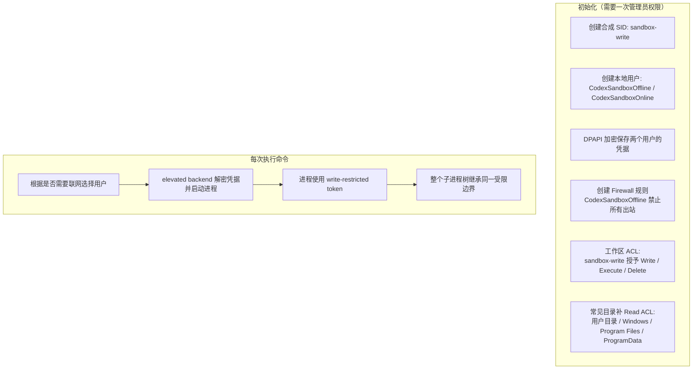
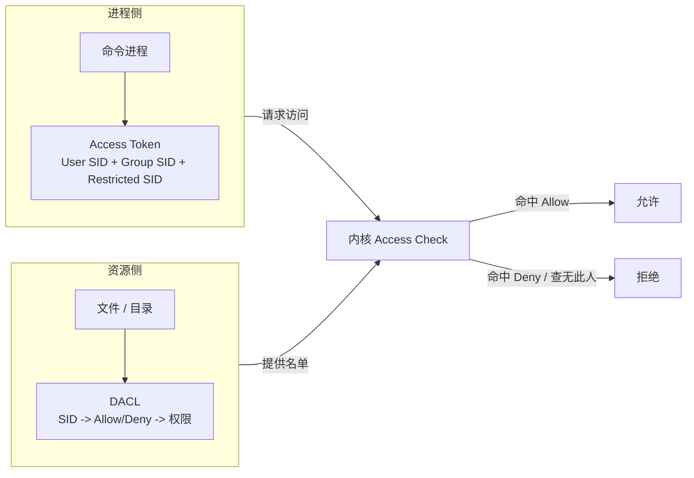
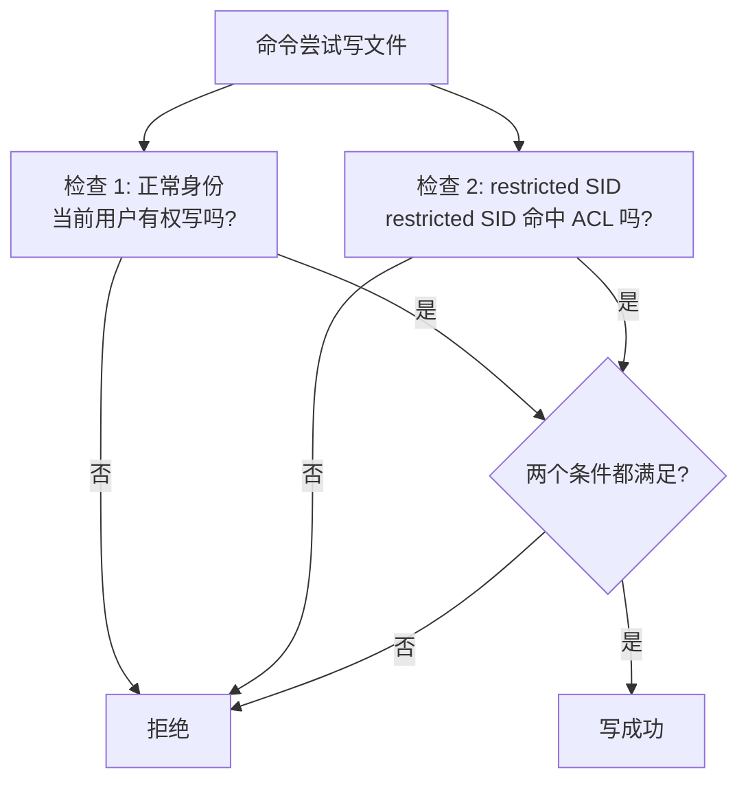
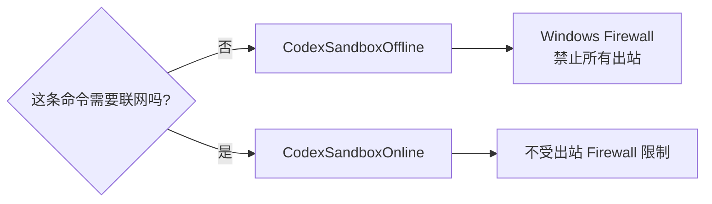
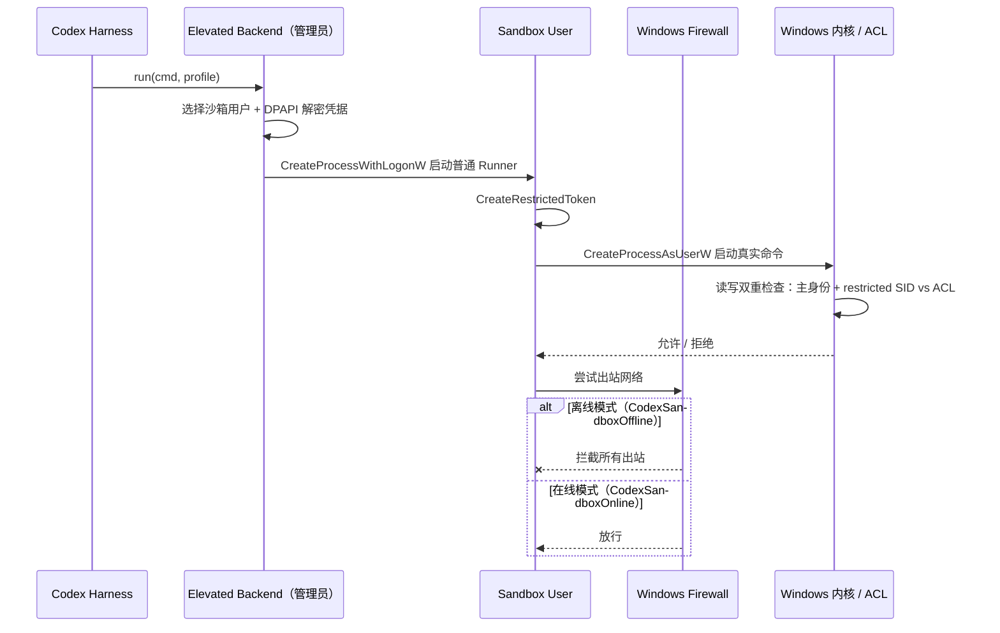

# Codex Windows 沙箱：write-restricted token + 合成 SID + ACL，网络交给专用本地用户和 Firewall

> 阅读时间：约 5 分钟
> 关键词：SID · synthetic SID · write-restricted token · ACL · CodexSandboxOffline · CodexSandboxOnline · Windows Firewall · DPAPI
> 一句话：Codex 在 Windows 上没有把现成的 AppContainer 当作主线，而是自己拼了一套“文件写入靠受限令牌 + ACL，网络靠两个专用本地用户 + 防火墙”的沙箱。

本文参考廖雪峰博客的风格：先讲人话，再拆原理，最后给出可以亲手验证的命令。

---

* ## 1. 为什么要自己造一个 Windows 沙箱

Codex 在 Windows 上要满足一个看起来很简单、做起来很难的要求：

- 可以读用户几乎任何地方的文件；
- 只能写当前工作区和用户显式配置的 `writable_roots`；
- 默认不能联网；
- 被批准的命令可以联网；
- 每次命令都从启动那一刻起被限制，子进程树必须继承同样的边界。

macOS 有 Seatbelt，Linux 有 Landlock / seccomp / Bubblewrap，Windows 却“没有开箱即用的、能给任意命令进程树套边界的沙箱”。微软提供了几个候选方案，Codex 团队评估后都放弃了：

| 候选方案 | 思路 | 为什么不选 |
|---|---|---|
| AppContainer | Windows 原生沙箱，能力强、OS 强制 | 它是给“启动前就知道自己要访问什么”的紧凑型 App 设计的，而 Coding Agent 是开放式工作流：Shell、Git、Python、包管理器、任意构建工具都可能跑 |
| Windows Sandbox | 一次性轻量虚拟机，隔离最强 | 像“另一个桌面”，需要重新装环境和宿主机桥接；而且 Windows Home 没有这个功能 |
| MIC 完整性标签 | 把工作区标成 Low Integrity，低完整性进程不能写高完整性对象 | 会改变真实文件系统的信任模型：不只 Codex 能写工作区，所有低完整性进程都能写，工作区变成了“低完整性垃圾桶” |

结论是：**自己组合 Windows 原生原语，做一套专门的沙箱。**

---

## 2. 先看全貌

最终方案分两段：安装时做一次“管理员初始化”，之后每次执行命令走“受限进程启动”。



后面四节分别解释四个关键部件：

1. 合成 SID：给沙箱造一个“机器里不存在的人”；
2. write-restricted token：让 Windows 在写操作上做双重检查；
3. ACL：把“这个人”的名字写进目录的权限名单；
4. 两个专用本地用户 + Firewall：让防火墙能精准地只拦沙箱进程树的网络。

---

## 3. 基础概念：SID、Token、ACL

### 3.1 SID：Windows 里的“身份证号”

Windows 不靠用户名认人，而是靠 **SID（Security Identifier，安全标识符）**。每个人、每个组、每次登录会话都有自己的 SID，长这样：

```text
S-1-5-21-1234567890-0987654321-1357902468-1001   一个本地用户
S-1-5-32-544                                    本地 Administrators 组
S-1-5-5-0-12345                                 某次登录会话
```

### 3.2 合成 SID：机器里“不存在的人”

Windows 允许创建 **synthetic SID（合成 SID）**：它不对应任何真实用户，但可以像普通 SID 一样出现在 ACL 里。

Codex 创建了一个专门给沙箱用的合成 SID，名字叫 **`sandbox-write`**：

```text
sandbox-write  S-1-5-21-<随机部分>-<更多随机部分>
```

为什么要造一个“不存在的人”？因为这样可以精确地回答问题：**哪些目录允许 sandbox-write 写？** 其他用户、其他进程、其他 SID 一概不受影响。

### 3.3 Token：进程的“通行证”

每个 Windows 进程都挂着一个 **Access Token**，里面记录着：

- User SID：进程以谁的身份运行；
- Group SIDs：进程属于哪些组；
- Privileges：进程有哪些特权；
- Restricted SIDs：进程被额外限制在哪些身份里（这是本方案的核心）。

普通进程的 Token 是“你是谁”，write-restricted token 是“你是谁，但写的时候还必须额外证明自己属于某个受限身份”。

### 3.4 Restricted SID：`Everyone`、`LogonSession`、`sandbox-write`

这三个 SID 会被放进 restricted token 的 **Restricted SID 列表**。它们不是普通的
用户组列表，而是 Windows 在受限访问检查时额外使用的一组身份。

- **`Everyone`**（`S-1-1-0`）：表示所有用户，保留基础的通用身份上下文。它不代表
  “所有写入都允许”，最终仍然要经过目标对象的 ACL。
- **`LogonSession`**：表示当前 Windows 登录会话的 SID，通常形如
  `S-1-5-5-...`。它用于保留与当前登录会话有关的身份关联，不是用户组，也不决定
  网络是否放行。
- **`sandbox-write`**：本项目生成的合成 SID，例如
  `S-1-5-21-111-222-333-444`。它不对应真实用户，只用于在 ACL 中精确表达“沙箱
  是否可以写这里”。工作区和 `writable_roots` 授予它写权限，`.git`、`.codex`、
  `.agents`、`.agent` 则对它显式拒绝写入。

因此，`sandbox-write` 是“写入范围”的标记，而不是沙箱用户本身。网络边界仍由
`CodexSandboxOffline` 用户 SID 和 Windows Firewall 规则负责。

### 3.5 Token 标志：`DISABLE_MAX_PRIVILEGE`、`LUA_TOKEN`、`WRITE_RESTRICTED`

Runner 调用 `CreateRestrictedToken` 时组合使用三个标志：

```text
DISABLE_MAX_PRIVILEGE | LUA_TOKEN | WRITE_RESTRICTED
```

- **`DISABLE_MAX_PRIVILEGE`**：禁用 Token 中不必要的高权限 privilege，例如调试、
  备份、还原、取得所有权等特权，避免命令利用 privilege 绕过普通 ACL。
- **`LUA_TOKEN`**：创建类似 UAC 普通用户的受限 Token，进一步去除管理员式的高权限
  能力。沙箱用户本身是标准用户，这里属于额外防御层。
- **`WRITE_RESTRICTED`**：对写操作增加 Restricted SID 检查。写入必须同时满足主身份
  的正常 ACL 检查，以及 restricted SID 列表中至少一个 SID 命中目标 ACL 的授权。

可以把最终 Token 理解为：

```text
我是 CodexSandboxOffline 用户
  + 没有不必要的高权限 privilege
  + 是一个受限普通用户 Token
  + 写入还必须通过 sandbox-write 的 ACL 检查
```

### 3.6 ACL：资源门前的“名单”

每个文件、目录、注册表键都有一张 **DACL（Discretionary Access Control List）**，一行一行写着：

```text
<谁的 SID> → Allow/Deny → <什么权限>
```

Windows 内核在放行访问前，会拿进程 Token 里的 SID 去比对资源 DACL 里的条目。

把三个概念拼起来：



---

## 4. 文件写入：write-restricted token + 合成 SID + ACL

### 4.1 双重检查

`write-restricted token` 让 Windows 对**写操作**执行一次额外的访问检查。一次写要成功，必须同时满足两个条件：

1. 正常身份检查通过：Token 的主身份（真实用户或 sandbox 用户）有权限；
2. 受限 SID 检查通过：Token 的 restricted SID list 里**至少有一个 SID** 出现在目标 ACL 的授权条目里。



### 4.2 名单怎么配

Codex 初始化时做两件事：

1. 把 `sandbox-write` 的 **Write / Execute / Delete** 权限授给：
   - 当前工作目录；
   - `config.toml` 里配置的额外 `writable_roots`。
2. 在“可写区域内但必须只读”的目录上，对同一个 SID 加 **Deny Write**：
   - `<cwd>/.git`
   - `<cwd>/.codex`
   - `<cwd>/.agents`

于是工作区 ACL 大致长这样：

```text
C:\work\my-agent                 sandbox-write: Allow  Write, Execute, Delete
C:\work\my-agent\.git            sandbox-write: Deny   Write
C:\work\my-agent\.codex          sandbox-write: Deny   Write
C:\work\my-agent\.agents         sandbox-write: Deny   Write
C:\Users\me                      （没有 sandbox-write 条目）
```

命令想写 `C:\Users\me\secrets.txt` 时，restricted SID 检查找不到 `sandbox-write` 的 Allow 条目，直接拒绝。想写 `C:\work\my-agent\.git` 时，命中 Deny Write，也拒绝。只有工作区和 writable_roots 能写。

### 4.3 读权限怎么办

合成 SID 只管“写”。读主要靠 Token 的**主身份**。

第一版原型里，进程主身份就是真实用户，所以“读任意”天然成立。最终版把进程换成 `CodexSandboxOffline` / `CodexSandboxOnline` 后，**“别的用户”默认读不到你的用户目录**。Codex 因此在初始化时额外给这两个用户补 Read/Execute ACL，覆盖常见目录：

```text
C:\Users\<真实用户>
C:\Windows\
C:\Program Files\
C:\Program Files (x86)\
C:\ProgramData\
```

这就是“任意读”不是免费的，而是初始化阶段显式配出来的。

---

## 5. 网络：为什么必须换成“专用本地用户 + Firewall”

### 5.1 第一版为什么失败

第一版原型没有用 Firewall，而是用“环境变量投毒 + 假二进制”做网络抑制：

```text
HTTPS_PROXY=http://127.0.0.1:9
ALL_PROXY=http://127.0.0.1:9
GIT_HTTPS_PROXY=http://127.0.0.1:9
NO_PROXY=localhost,127.0.0.1,::1
GIT_SSH_COMMAND=cmd /c exit 1
```

它让 Git、包管理器、SSH 这类“讲武德”的工具乖乖失败，但：

- 不认代理变量的程序直接绕过；
- 自己实现 socket 的程序直接绕过；
- 恶意代码完全无视这些环境变量。

这是**建议性的，不是强制性的**，所以不能作为最终方案。

### 5.2 为什么不能直接给 restricted token 配 Firewall

Codex 想用 Windows Firewall 拦截沙箱进程树的出站流量，但遇到几个硬问题：

| 匹配维度 | 问题 |
|---|---|
| 按 restricted SID 匹配 | Windows 不允许防火墙规则匹配 restricted token 里的非主身份 |
| 按程序路径匹配 | 只能拦 `codex.exe`，拦不到它派生的 `git.exe` / `python.exe` |
| 按真实用户匹配 | 规则会命中真实用户本身，而不是那个受限子进程 |
| 按端口 / 地址匹配 | 策略不对，我们要拦的是“这棵进程树的任意出站”，不是某个端口 |

结论：想让防火墙精准命中沙箱进程树，必须让进程有一个**独立的、可作为防火墙匹配对象的主身份**。

### 5.3 两个专用本地用户

Codex 创建了两个本地用户：

```text
CodexSandboxOffline    被防火墙规则禁止所有出站流量
CodexSandboxOnline     不受出站防火墙限制
```

需要联网的命令以 `CodexSandboxOnline` 身份运行，不需要联网的命令以
`CodexSandboxOffline` 身份运行。两者的**文件沙箱完全一样**：都是 write-restricted
token，restricted SID list 都是 `[Everyone, LogonSession, sandbox-write]`，只是网络侧
一个被防火墙堵死、一个放行。



### 5.4 初始化到底做了什么

管理员初始化阶段做四件事：

1. 创建合成 SID `sandbox-write`（不存在才创建）；
2. 创建 `CodexSandboxOffline` 和 `CodexSandboxOnline` 两个本地用户；
3. 用 **DPAPI** 把两个用户的凭据加密保存到沙箱用户读不到的地方；
4. 创建 Firewall 规则：`CodexSandboxOffline` 禁止所有出站；如果规则已存在，则校验它没有被改坏。

这套设计的重点是：**Codex 本体持有凭据，沙箱用户自己不持有；沙箱用户即使拿到了自己的进程，也没有权限读到 DPAPI 密文。**

---

## 6. 最终执行流程

### 6.1 为什么要先启动 Runner，再创建受限 Token？

当前实现不会让父进程直接创建 restricted token 并继续嵌套启动命令，而是分成两阶段：

```text
真实用户父进程
  ↓ CreateProcessWithLogonW
CodexSandboxOffline 用户下的普通 Runner
  ↓ CreateRestrictedToken
write-restricted token
  ↓ CreateProcessAsUserW
真实命令及其子进程树
```

这样设计有三个原因：

1. `CreateProcessWithLogonW` 可以让普通父进程以沙箱用户身份启动独立登录进程，通常不
   需要管理员权限。
2. 在已经持有 restricted token 的进程里再次调用 `CreateRestrictedToken` 可能失败，
   返回 `ERROR_INVALID_PARAMETER (87)`。先启动普通 Runner，可以避免嵌套创建受限 Token。
3. 两个 API 的职责不同：`CreateProcessWithLogonW` 负责“以哪个用户运行”，
   `CreateRestrictedToken` 负责“如何进一步收紧权限”，`CreateProcessAsUserW` 负责
   “使用最终 Token 启动真实命令”。

Runner 不执行用户命令，只负责 Token 转换和最终 spawn；命令、工作目录、环境变量、
超时和 `sandbox-write` SID 通过 stdin 的 JSON payload 传入，不落盘。

### 6.2 运行时序列



一旦进程以受限 Token 启动，它派生的所有子进程都继承同一个边界。命令无法通过“再 spawn 一个子进程”逃出去，因为子进程拿到的还是同一张通行证。

在本项目中，`read-only` 和 `workspace-write` 进入上述 Windows restricted-user 链路；
`danger-full` 则直接走真实用户的普通子进程，不创建 Windows 受限 Runner，以实现完整
访问和联网语义。Windows 硬沙箱初始化或执行失败时会 fail-closed，不降级为裸执行；只有
`isolation=auto` 在初始化探测阶段失败时，才会退回应用层 `CommandFilter`。

---

## 7. 和 AppContainer 的区别

Codex 最终没有用 AppContainer，这不代表 AppContainer 不好，而是“形状”不对：

| 维度 | AppContainer | Codex 最终方案 |
|---|---|---|
| 身份 | 换成几乎空的 AppContainer SID，默认全拒 | 换成专用本地用户 + restricted SID，默认读按用户身份、写按 restricted SID |
| 文件读 | 需要把读权限显式授予容器 SID | 通过主身份 + 初始化补 ACL 实现“读任意” |
| 文件写 | 通过 ACL 显式授权 | write-restricted token 双重检查，比普通 Token 更精确 |
| 网络 | Capability `internetClient` 控制 | 本地用户 + Firewall，按进程树主身份控制 |
| 适合场景 | 权限固定的紧凑型 App | 开放式开发者工作流 |

想深入理解 AppContainer 原理，可以看仓库里的 [windows-appcontainer-hard-sandbox.md](./windows-appcontainer-hard-sandbox.md)。

---

## 8. 小结

- **合成 SID**：`sandbox-write` 不是真实用户，只出现在沙箱自己的 ACL 里，不影响机器上其他人。
- **write-restricted token**：写操作必须同时通过“主身份检查”和“restricted SID 检查”，让 ACL 成为写权限的唯一事实来源。
- **ACL**：工作区和 `writable_roots` 授予 `sandbox-write` Write/Execute/Delete；`.git`、`.codex`、`.agents` 显式 Deny Write。
- **网络**：防火墙无法匹配 restricted SID，所以进程换成 `CodexSandboxOffline` / `CodexSandboxOnline` 两个独立本地用户；Offline 被防火墙禁止出站，Online 放行。
- **凭据**：DPAPI 加密保存，沙箱用户读不到，避免“沙箱用户自己把自己放出来”。
- **边界继承**：命令进程和所有子进程使用同一受限身份，安全边界从启动一刻起固定。

一句话记住：**文件靠“身份 + 名单”管，网络靠“换一个能被防火墙认出来的身份”管。**

---

## 9. 动手验证

如果你正跑在 Codex 的 Windows 沙箱里，可以直接执行：

```powershell
# 当前是谁？通常会看到 CodexSandboxOffline / CodexSandboxOnline
whoami

# 看 Token 里的 SID（含 Everyone、登录会话等）
whoami /all

# 看 Codex 创建的两个专用本地用户
Get-LocalUser | Where-Object Name -Like "CodexSandbox*"

# 看 Offline 用户的出站防火墙规则（部分命令需要管理员）
Get-NetFirewallRule -Direction Outbound |
    Where-Object DisplayName -Like "*Codex*"

# 看工作区的 ACL（能看到 sandbox-write 条目）
icacls <你的工作目录>
```

> 注意：这些用户、SID 和防火墙规则是 Codex 沙箱的一部分，不要为了“清理”而手动删除，否则沙箱会失效。

---

## 参考

- [Building a safe, effective sandbox to enable Codex on Windows](https://openai.com/index/building-codex-windows-sandbox/)
- [Codex Sandboxing](https://developers.openai.com/codex/concepts/sandboxing)
