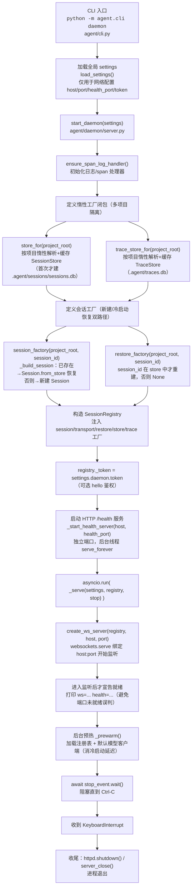
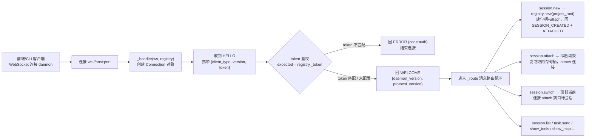

# Daemon 进程启动流程

## 一、主启动时序（flowchart）

## 二、就绪后：客户端连接握手（flowchart）

## 关键设计点

1. **多项目隔离**：`settings` 只承载 daemon 的**网络配置**；每个会话按自己的 `project_root` 经 `load_settings(project_root=...)` 解析项目配置，`SessionStore`/`TraceStore` 路径锚定到项目根，互不串扰。
2. **惰性 + 缓存**：`store_for`/`trace_store_for` 首次调用才建库，同项目复用同一实例；daemon 启动不预建任何库。
3. **就绪判定**：WebSocket 服务真正开始监听后才打印就绪，避免 `waitForReady` 在端口未可连接时误判。
4. **后台预热**：`_prewarm` 提前加载注册表与默认模型客户端，消除首次 attach 的冷启动延迟；失败仅记日志，不阻断主流程。
5. **鉴权可选**：`settings.daemon.token` 为空则 hello 不鉴权；非空则 `token` 必须匹配，否则回 `{code:auth}`。
