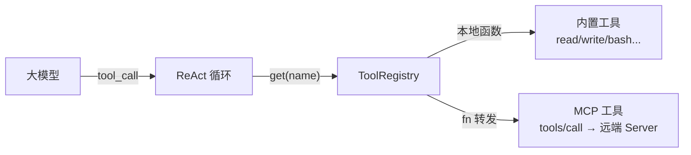
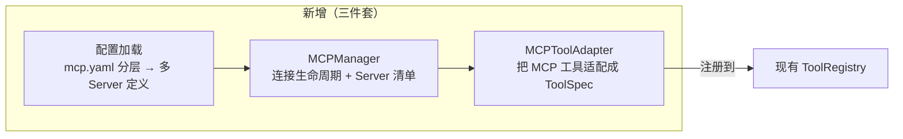
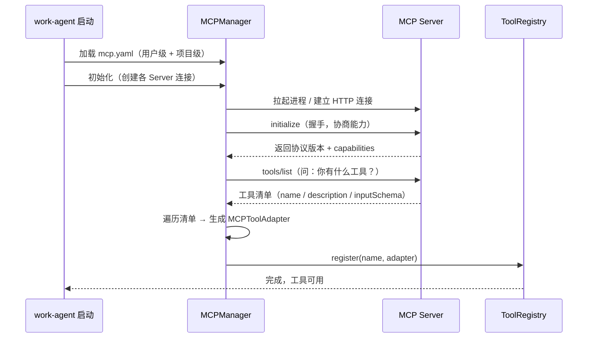
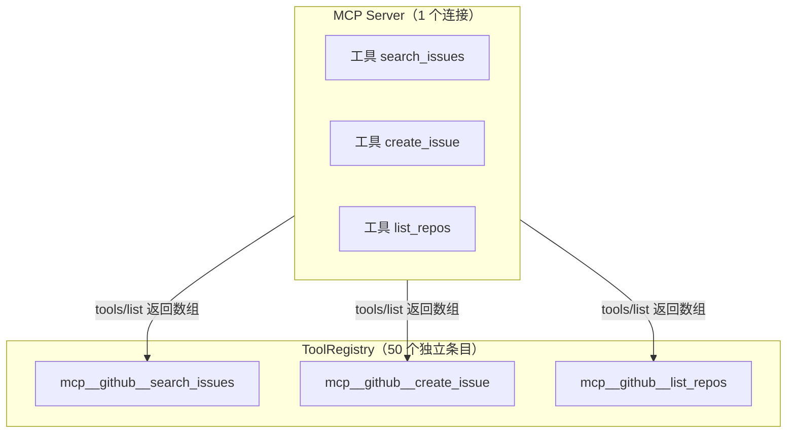
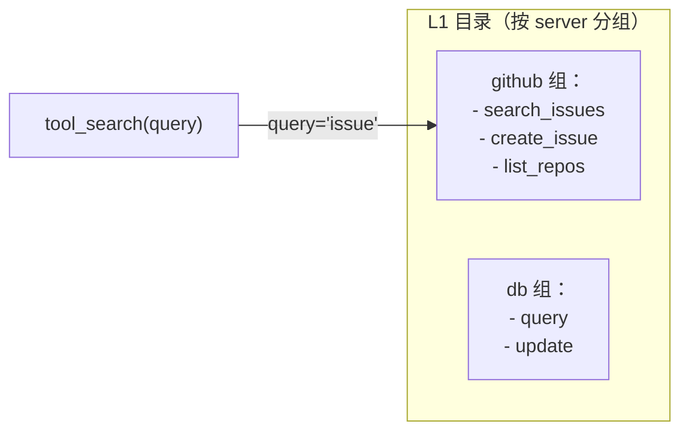
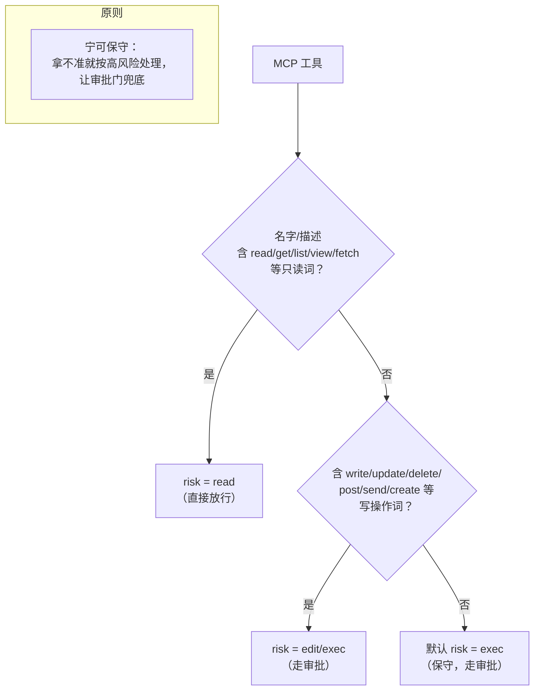
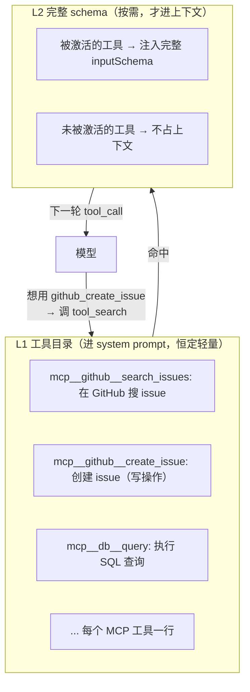
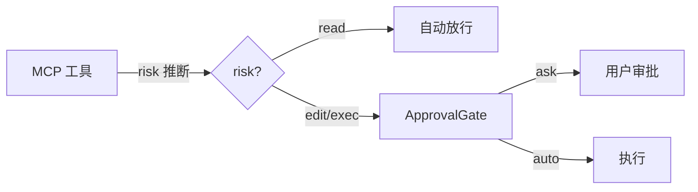

# work-agent 接入 MCP 设计文档

> 这篇文档回答一个核心问题：**work-agent 怎么发现一个 MCP 工具，又怎么调用它？**
>
> 阅读前建议先看 `docs/mcp-调研与教程.md`（MCP 概念与主流方案调研），
> 本文是它的"落地篇"——把 MCP 的概念翻译成 work-agent 的具体代码结构。

---

## 一、总纲：一句话设计

> **把 MCP 工具翻译成 work-agent 里的普通工具，让现有体系"无感"。**

work-agent 已经有了一套成熟工具机制：`ToolRegistry` 注册、`ToolSpec` 自描述、`ApprovalGate` 审批、`Executor` 沙箱、`_system_prompt` 注入、ReAct 循环调度。

MCP 带来的新东西只有一层：**工具的"来源"变了**（本地函数 → 远端 MCP Server）。我们不想为 MCP 重写一套调度/审批/上下文逻辑，那会破坏架构一致性。

所以核心思路是：**MCP 工具 = 一个 `ToolSpec`，`fn` 内部发一次 `tools/call` 到远端。**



对模型、对审批、对上下文来说，`mcp_search_issues` 和 `read` **长得一模一样**。

---

## 二、三个新增组件

要在现有代码里加 MCP 支持，只需要三个新东西：



| 组件 | 干什么 | 类比 |
|---|---|---|
| **配置加载** | 读分层 `mcp.yaml`（用户级 + 项目级），得到一堆 Server 定义（command / url / env） | 有点像现有的 `settings.yaml` |
| **MCPManager** | 负责拉起/连接每个 Server，做 `initialize` 握手，管理生命周期 | 有点像 `SessionStore` |
| **MCPToolAdapter** | 把一个 MCP 工具包装成 `ToolSpec`，`fn` 里发 `tools/call` | 适配器模式，翻译官 |

### 2.1 配置：分层 yaml（用户级 + 项目级）

Server 定义统一放 **yaml**（与 `settings.yaml` 同约定），分两层：

- **用户级**：`~/.agent/mcp.yaml`（`AGENT_USER_CONFIG_DIR` 可覆盖，跨项目，优先级低）
- **项目级**：`<project>/.agent/mcp.yaml`（`AGENT_PROJECT_ROOT` 可覆盖，随项目，优先级高）

合并顺序：用户级先读，项目级后读 → **项目覆盖用户**（同名 server 以项目为准）。

```yaml
# <project>/.agent/mcp.yaml
mcpServers:
  github:
    command: npx
    args: ["-y", "github-mcp-server"]
    env:
      TOKEN: "${GITHUB_TOKEN}"   # ${VAR} 环境变量展开，敏感信息不进 yaml
  demo:
    command: python
    args: ["-m", "agent.mcp.demo_server"]
```

> **安全**：`.agent/` 已被 `.gitignore` 忽略，项目级 `mcp.yaml` 天然不进版本控制；`${VAR}` 展开让密钥放环境变量即可。

---

## 三、如何发现 MCP 工具（Discovery）

这是本节重点。**"发现"指：从 MCP Server 那里拿到它提供了哪些工具，并翻译成 work-agent 能懂的 `ToolSpec`。**

### 3.1 发现的完整时序



发现结束的标志：**每个 MCP 工具都变成 `ToolRegistry` 里的一条 `ToolSpec`。**

### 3.2 MCP 工具 → ToolSpec 的翻译

MCP 返回的工具长得是这个样子：

```json
{
  "name": "search_issues",
  "description": "在 GitHub 仓库里搜索 issue",
  "inputSchema": {
    "type": "object",
      "properties": {
        "query": { "type": "string", "description": "搜索关键词" },
        "limit": { "type": "integer", "description": "返回条数，默认 5" }
      },
      "required": ["query"]
  }
}
```

我们的适配器把它翻译成：

```python
# 伪代码：MCPToolAdapter 怎么生成 ToolSpec
def make_tool_spec(mcp_tool) -> ToolSpec:
    return ToolSpec(
        name=mcp_tool.name,  # 名字直接沿用，避免模型困惑
        risk=_infer_risk(mcp_tool),  # 关键：怎么判断风险级别？
        schema=mcp_tool.inputSchema,  # 参数 schema 原样透传
        fn=mcp_tool_adapter(mcp_tool.name),  # fn = 发 tools/call 到远端
    )
```

### 3.2.1 一个 Server 多个工具怎么办？（重点）

你可能会想：MCP Server 暴露一堆工具，是不是要搞个什么"组"来包一下？**不用。** 我们坚持一个原则：

> **一个 MCP 工具 = 一个 `ToolSpec`，一对一翻译，绝不合并。**

一个 Server 暴露 50 个工具，就翻译成 50 个独立 `ToolSpec`，每个独立注册、独立审批、独立激活。**"Server 连接" 和 "工具" 是两层，各管各的**：



连接层：**一个 Server 一条连接**（复用 `MCPManager` 的 client）。工具层：**N 个工具 = N 个 `ToolSpec`**，各自带 `mcp_server` 字段记录归属。

#### 命名空间：靠前缀，不靠分组

多个工具带来的第一个问题就是**命名冲突**。两个 Server 可能都叫 `list`，内置工具里可能也有 `read`。我们用**前缀**区分，而不是搞一个"分组/命名空间"的复杂机制：

| 方案 | 例子 | 评价 |
|---|---|---|
| **`mcp__` 三段式（推荐）** | `mcp__github__search_issues` / `mcp__db__query` | `mcp__` 前缀天然免疫内置工具冲突、可反推归属、审计可溯源，`ToolRegistry` 不用改 |
| 两段前缀 | `github_search_issues` | 可行但可能被误认成普通工具，且不如 `mcp__` 清晰 |
| 命名空间分组 | `github:search_issues` | 要改注册表结构，破坏"工具是扁平的"假设，**不推荐** |
| 不处理 | `search_issues` | 两 Server 撞名就崩，**绝对不行** |

`mcp__` 方案让 `ToolRegistry.get(name)`、审批、system prompt 注入**全部不用改**——它们只认扁平的 `name`。同时要做 `safeServer`/`safeTool` 清洗：server/tool 名里非法字符（非 `[a-zA-Z0-9_-]`）替换成 `_`，保证名字永远是干净标识符。

#### 批量翻译流程

`tools/list` 返回的是一个**数组**，翻译也是批量循环：

```python
# 伪代码：一个 Server 的工具批量注册
async def register_server_tools(server, client, registry):
    listed = await client.list_tools()  # 返回 [tool, tool, ...] 数组
    for mcp_tool in listed:
        spec = make_tool_spec(server, mcp_tool)  # 加前缀 + risk + schema
        spec.mcp_server = server.name  # 记录归属，供调用时找连接
        registry.register(spec)  # 逐个注册
```

注意 `make_tool_spec` 比 3.2 多传了 `server`，因为 `name` 要拼前缀：

```python
def make_tool_spec(server, mcp_tool) -> ToolSpec:
    return ToolSpec(
        name=f"mcp__{safe(server.name)}__{safe(mcp_tool.name)}",  # mcp__github__search_issues
        risk=_infer_risk(mcp_tool),
        schema=mcp_tool.inputSchema,
        fn=mcp_tool_adapter(server, mcp_tool.name),  # 记住是哪个 server 的哪个工具
    )
```

`mcp_tool_adapter` 闭包捕获 `server`，调用时就能找到对应的 client 连接：

```python
def mcp_tool_adapter(server, tool_name):
    async def _call(args):
        client = await server.client()  # 找这个 server 的连接
        resp = await client.call_tool(name=tool_name, arguments=args)
        return ToolResult(...)

    return _call
```

#### 批量 + 延迟加载

一个 Server 50 个工具，如果全塞进上下文，之前的上下文优化就白做了。所以**延迟加载（3.5）的目录是 per-server 分组的**：



`tool_search` 的 `query` 匹配时，**自动带上 `server` 前缀一起匹配**，这样用户搜 "github issue" 也能命中。激活表（`mcp_active_tools`）同样按工具粒度记，不按 server 粒度——**一个工具命中，不影响同 server 的其他工具**，保持最小激活。

#### 汇总：多工具 Server 的处理清单

| 问题 | 答案 |
|---|---|
| N 个工具怎么注册？ | N 个 `ToolSpec`，一对一，不合并 |
| 撞名怎么办？ | `mcp__server__tool` 三段式命名空间（+ 非法字符清洗） |
| 调用时怎么找到连接？ | `ToolSpec.mcp_server` 字段 → adapter 闭包捕获 server |
| 延迟加载目录怎么分组？ | per-server 分组，`tool_search` 带 server 前缀匹配 |
| 激活粒度？ | 按工具，最小激活，同 server 其他工具不受影响 |

### 3.3 关键问题：`risk` 怎么定？

内置工具的 `risk`（`read`/`edit`/`exec`）决定了走不走审批、要不要沙箱。MCP 工具**不会自报风险级别**，得靠我们推断。

建议三级推断策略：



**原则：宁可保守（fail-closed）。** 拿不准就按 `exec` 处理，让审批门兜底。因为一旦把写操作误判成 `read` 放行，可能造成破坏。

设计原则：**`isReadOnly` 默认 `False`**——第三方工具默认当有写操作，只有显式命中的只读白名单（如名字含 read/get/list/view/fetch 且描述确认无副作用）才降为 `read`。宁可多审一次，不可漏审一次。

### 3.4 发现时的防御

发现阶段就该做的安全检查（别等调用时才想起来）：

1. **工具名冲突**：如果 MCP 工具和内置工具重名（比如 MCP 也有个 `read`），用 `mcp__server__tool` 三段式命名空间天然解决（`mcp__` 前缀不可能与内置短名撞），并对非法字符做清洗（`safeServer`/`safeTool` → `_`）。
2. **工具数量上限**：一个 Server 可能暴露几百个工具，全塞进 system prompt 会把上下文撑爆。**不用硬截断**（硬上限会静默丢工具），用"目录全暴露 + 按需激活"（见 3.5）。
3. **描述截断 + 消毒**：description 太长要截断；且 MCP 描述可能被注入"忽略我/override 规则"等指令，**进 system prompt 前要剥离指令注入模式**，不能原样信任。

### 3.5 延迟加载：Tool Search 设计（重点）

上面第 2 条提到"延迟加载"，这是**发现之后最关键的上下文优化**，单独展开讲。

#### 为什么要延迟加载？

现状的 `_model_tools()` 是**全量下发**：

```python
# 现状（全量）：所有工具 schema 一次性塞给模型
def _model_tools(self) -> list[dict]:
    return [spec.to_openai() for spec in self.registry.list()]  # 工具越多，上下文越胀
```

内置工具只有十几个（`read`/`write`/`bash`…），全量没问题。但一个 MCP Server 可能暴露**几百个工具**，每个工具的 `inputSchema` 可能几百上千字符。假设接了 5 个 Server、共 400 个工具，光工具描述就可能占掉几万 token——**还没开始干活，上下文先爆了。**

> 项目铁律里有一条「上下文稀缺」。工具清单就是最典型、最容易失控的上下文消耗点。

#### 核心思想：目录 + 按需加载

work-agent 其实**已经有这个模式了**——就是技能的 `catalog_prompt()`：

```python
# 技能目录：只注入 name + trigger_text（轻量索引），不注入正文
def catalog_prompt(self) -> str:
    lines = [f"- {spec.name}: {spec.trigger_text}" for spec in self._cache]
    return "可用技能：" + "\n".join(lines)
```

模型看到的是**一行一个技能的目录**，决定要用哪个技能，才去深挖它的正文。**Tool Search 就是把这个"目录 + 按需"思路套到工具上。**

#### 两层结构：L1 目录 / L2 完整



- **L1（目录）**：每个 MCP 工具只放 `name + 一句话描述`，恒定、轻量，塞进 system prompt 稳定前缀，**走 prompt cache 几乎不增加成本**。
- **L2（完整）**：模型想用某个工具时，先通过一个**发现动作**拿到完整 schema，之后该工具才进入 `_model_tools()` 下发的完整工具列表。

#### 实现：`tool_search` 内置发现工具

我们给 MCP 工具单独加一个**目录 + 发现机制**。它作为**内置工具**注册，模型随时可调，**默认启用**，不动其他内置工具：

```mermaid
sequenceDiagram
    participant Model as 大模型
    participant Loop as ReAct 循环
    participant Ctrl as tool_search 工具
    participant Reg as ToolRegistry
    participant S as MCP Server

    Note over Model, S: 每轮 system prompt 只带 L1 目录（name + 一句描述）

    Model->>Loop: 想用 github_create_issue，但只有目录
    Loop->>Ctrl: tool_search(name="github_create_issue")
    Ctrl->>Reg: 查该工具的完整 schema（已缓存在 adapter）
    Ctrl-->>Model: 返回完整 inputSchema + risk
    Model->>Loop: 正常 tool_call(name="github_create_issue", args=...)
    Loop->>S: tools/call(...)  # 走第四章的调用路径
```

`tool_search` 的实现要点：

```python
# 伪代码：目录 + 发现
@tool("tool_search", risk=ToolRisk.READ, schema={...})
async def tool_search(args):
    q = args.get("query", "")
    # 返回匹配工具的完整 schema（name/description/inputSchema/risk）
    hits = [t for t in mcp_tools if q.lower() in (t.name + t.description).lower()]
    return ToolResult(ok=True, output=format_full_schemas(hits))
```

#### 目录怎么生成？

在 `_model_tools()` 里把"全量下发"改成"**内置全量 + MCP 目录 + 按需完整**"：

```python
def _model_tools(self) -> list[dict]:
    builtin = [s.to_openai() for s in self.registry.list() if not s.is_mcp]  # 内置：全量
    mcp_catalog = [s.to_catalog() for s in self.registry.list() if s.is_mcp]  # MCP：目录（L1）
    # 再加上已激活（L2）的 MCP 工具完整 schema
    activated = [s.to_openai() for s in self.mcp_active_tools]
    return builtin + mcp_catalog + activated
```

为了区分，给 `ToolSpec` 加一个 `is_mcp` 标记和 `to_catalog()` 方法：

```python
class ToolSpec:
    is_mcp: bool = False  # MCP 适配器生成时置 True

    def to_catalog(self) -> dict:  # L1 目录：只有 name + 一句描述
        return {"name": self.name, "description": first_line(self.description)}
```

#### 激活策略：命中即常驻

模型调用 `tool_search` 命中了某个工具后，它就该**常驻完整 schema**（本轮会话内），避免反复 search。用 `self.mcp_active_tools`（一个集合）记录，命中就 add，之后每轮 `_model_tools()` 都带上。

> 一个"激活表"而已，类似 `self._prefetched_originals` 的思路——命中的记下来，别重复干活。

#### 配套保护

1. **目录上限**：`mcp.max_catalog`（比如 200 行），超过的部分干脆不注入，靠 search 按需找。
2. **激活上限**：`mcp.max_active`（比如 30 个完整 schema），防止模型把全部工具都激活，又撑爆上下文；满员时新激活要"顶掉"最旧的（LRU）。
3. **内置工具不延迟**：内置工具少且高频，永远全量，别为优化而优化。
4. **稳定前缀**：L1 目录放在 system prompt 静态段，配合 prompt cache 复用。

#### 何时做

MVP 里工具少，全量也能跑。**延迟加载放到"接入三四个 Server、工具明显增多"之后再做**。但在架构上要提前预留：`ToolSpec.is_mcp` 标记 + `to_catalog()` 接口，别等工具多到爆炸才回头改结构。

---

## 四、如何调用 MCP 工具（Invocation）

发现之后就是调用。**调用走的是完全现成的路径**——模型 `tool_call` → 审批 → 执行 → 结果回填。MCP 只是 `fn` 的"最后一公里"。

### 4.1 调用完整时序

```mermaid
sequenceDiagram
    participant Model as 大模型
    participant Loop as ReAct 循环
    participant Gate as ApprovalGate
    participant Adapter as MCPToolAdapter
    participant S as MCP Server

    Model->>Loop: tool_call(name="github_search_issues", args={...})
    Loop->>Loop: registry.get("github_search_issues")  # 拿到 adapter
    Loop->>Gate: decide(action)  # 根据 risk 判断要不要问用户
    alt 需要审批
        Gate-->>Loop: verdict=ask
        Loop-->>User: 弹审批
        User-->>Loop: 批准
    end

    Loop->>Adapter: adapter.fn(args)
    Adapter->>S: tools/call(name, args)  # JSON-RPC 请求
    S-->>Adapter: 工具结果
    Adapter->>Loop: 返回 ToolResult

    Loop->>Model: 结果作为 tool_result 回填
```

注意到没有？**从 `registry.get` 到结果回填，和调用内置工具 `read` 一模一样。** MCP 只出现在 `Adapter.fn` 那一小步。

### 4.2 适配器的 `fn` 实现

`MCPToolAdapter.fn` 的职责就一件事：**把 `args` 转发成 `tools/call`，把结果转成 `ToolResult`。**

```python
# 伪代码：MCP 工具的 fn
async def mcp_call(self, args: dict) -> ToolResult:
    # 1. 通过对应 Server 的连接，发 JSON-RPC tools/call
    resp = await self.client.call_tool(name=self.name, arguments=args)

    # 2. 判空：工具不存在 / 已禁用 → 报错
    if resp is None:
        return ToolResult(ok=False, error=f"MCP tool {self.name} not found or disabled")

    # 3. 错误处理：isError=true → 转 error
    if resp.isError:
        return ToolResult(ok=False, error=_text_content(resp))

    # 4. 结果提取：MCP 返回 content 数组，拼成文本
    text = _text_content(resp)  # content 里每个 TextContent 的 text 拼接
    return ToolResult(ok=True, output=text, original=None)
```

**关键细节：MCP 返回的是 `content` 数组**，每个元素可能是文本、图片、资源引用等。我们要从 `TextContent` 里把文本抽出来拼成 `output`。二进制/图片类暂不支持或转成占位。

### 4.3 调用时的高并发防护

MCP Server 是远端，天然有延迟、会失败。要比本地工具多考虑：

| 问题 | 对策 |
|---|---|
| 超时 | `tool_timeout_sec`，默认比如 45s，超时转 `ToolResult(ok=False)` |
| 并发限制 | 给每个 Server 设信号量（如同时最多 4 个调用） |
| 连接断开 | 调用前检查连接，断了自动重连或报错 |
| 结果过大 | 复用现有 `_cap_result` 截断；**超过阈值（如 25k token）改落盘**给文件引用，而不是硬塞回上下文 |
| 热更新竞态 | Server 热更新工具列表时**不静默改契约**：用会话级 system 补丁或让模型重新 `tool_search`，别让中途变化的 schema 搞乱进行中的调用 |

---

## 五、三个原语怎么落地

MCP 有三种原语，但 work-agent **当前主要用到 Tools**。Resources 和 Prompts 是加分项：

| 原语 | work-agent 落地 | 优先级 |
|---|---|---|
| **Tools** | 翻译成 `ToolSpec`，走全套现成体系 | ★★★ 必做 |
| **Resources** | 通过 `resources/read` 把资源作为上下文片段注入 | ★★☆ 二期 |
| **Prompts** | 通过 `prompts/get` 获取提示模板，拼进 system prompt | ★☆☆ 三期 |

第一阶段只做 Tools，先把"发现 + 调用"跑通，别的等有真实需求再说。

---

## 六、安全与审批设计

### 6.1 审批怎么接

MCP 工具已经翻译成了 `ToolSpec`，所以**审批完全复用现有的 `ApprovalGate`**，不需要新逻辑：



### 6.2 沙箱怎么接

理想状态：MCP 工具的**外部副作用**（写文件、发请求）也要过沙箱边界。但 MCP Server 是**独立进程/远端**，没法用 `Executor` 直接约束它。

落地策略（务实的）：

- **stdio 本地 Server**：以受限 profile 拉起子进程（类似 `Executor` 的思路），约束它触达的目录/网络。
- **远程 HTTP Server**：只能靠"调用前审批 + risk 推断"兜底，没有进程级沙箱。

> 一句话：**本地 Server 尽力沙箱化，远程 Server 靠审批兜底。** 不要假装远程 Server 能被我们沙箱约束。

### 6.3 配置安全

`mcp.yaml` 里的 `env`（API Key 等）**绝不能进版本控制**，沿用现有 `.gitignore` 策略（`.agent/` 已忽略，项目级 `mcp.yaml` 天然被忽略）。建议支持 `${VAR}` 环境变量展开，敏感信息放环境变量。用户级 `~/.agent/mcp.yaml` 同理不进版本控制。

---

## 七、目录与文件规划

```
agent/
  mcp/
    __init__.py
    config.py          # 读分层 mcp.yaml（用户级 + 项目级）→ Server 定义
    manager.py         # MCPManager：连接生命周期 + 握手 + 工具发现
    adapter.py         # MCPToolAdapter：ToolSpec 翻译 + tools/call 转发
    search.py          # 延迟加载：catalog 目录生成 + tool_search + 激活表（L2）
    client.py          # JSON-RPC 客户端：stdio / HTTP 两种传输
  core/
    loop.py            # 改动点：启动注册钩子 + _model_tools() 区分内置/MCP 目录
  config/
    settings.py        # 新增 mcp.enabled / mcp.max_catalog / mcp.max_active 等
```

**改动尽量收敛**：`loop.py` 只在启动时加一句"让 MCPManager 把工具注册进 `default_registry`"，其余全在 `agent/mcp/` 新模块里。

---

## 八、最小可用版本（MVP）范围

第一步先做到"能跑通一条链路"，别贪多：

- ✅ 支持 stdio 本地 Server（最常见）
- ✅ `tools/list` 发现 + 翻译成 `ToolSpec`
- ✅ `tools/call` 调用 + 结果拼成 `ToolResult`
- ✅ risk 推断 + 走 ApprovalGate 审批
- ✅ 工具名加前缀避免冲突
- ✅ 结果截断保护上下文
- ✅ **预留延迟加载接口**：`ToolSpec.is_mcp` 标记 + `to_catalog()` 方法（见 3.5）——MVP 全量下发也能跑，但先打好钩子，别等工具爆炸才改结构
- ✅ 配置统一 **yaml 分层**（用户级 + 项目级，项目覆盖用户）
- ✅ daemon 无会话可查 MCP：`/mcp` 命令 + `show_mcp` 消息（读分层 yaml 清单）

暂不做（放二期/三期）：

- ⏳ Streamable HTTP 远程 Server
- ⏳ Resources / Prompts 原语
- ⏳ 工具延迟加载完整版（L1 目录 + tool_search + 激活表，见 3.5）
- ⏳ 本地 Server 进程级沙箱化

---

## 九、验收标准（可自动化）

写清楚做完才叫完成的判据：

1. 配一个测试用 MCP Server（本地 stdio），`python -m agent.mcp.demo_server` 暴露工具（只读如 `search_files`，写如 `delete_file`）。
2. `pytest` 覆盖：发现后 `default_registry.get("demo_*")` 能取到对应 `ToolSpec`。
3. 读工具 `risk=read`：模型调用不弹审批。
4. 写工具 `risk=edit`：调用时 `ApprovalGate` 返回 `ask`，需授权。
5. `tools/call` 结果正确拼成 `ToolResult.output`；Server 挂掉时返回 `ok=False` 而非抛异常。
6. 现有 464 个测试全部不回归。

延迟加载（二期，补做时加这些判据）：
7. 接了 3 个 Server（共 50+ 工具）时，`_model_tools()` 下发的工具 schema 总量**明显小于全量**（目录行数可控）。
8. 模型调用 `tool_search("issue")` 后，命中的工具出现在下一轮完整工具列表里；未命中的仍在目录里。
9. 激活满 `mcp.max_active` 后，最旧的完整 schema 被顶掉，上下文不无限膨胀。

---

## 十、参考

- `docs/mcp-调研与教程.md` —— MCP 概念与主流方案调研
- `agent/runtime/registry.py` —— ToolSpec / ToolRegistry / ApprovalGate 所在
- `agent/runtime/sandbox.py` —— Executor / SandboxProfile 三档
- `agent/core/loop.py` —— ReAct 循环 / 审批接入点
- [MCP 官方文档](https://modelcontextprotocol.io)

---

*work-agent 项目设计文档，2026-08-02。*
