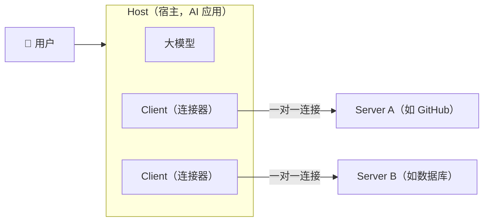
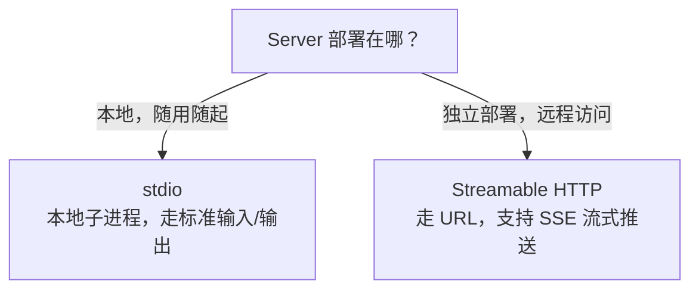
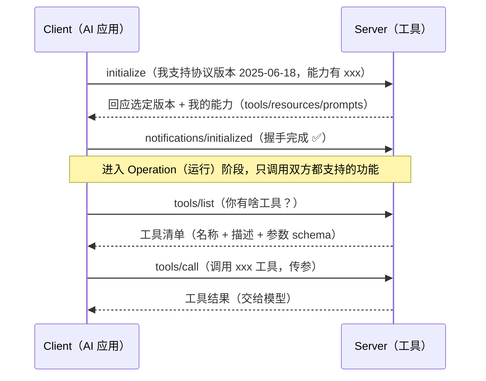
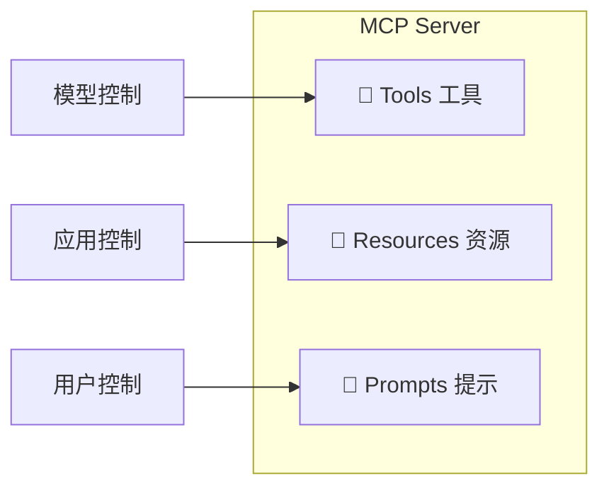
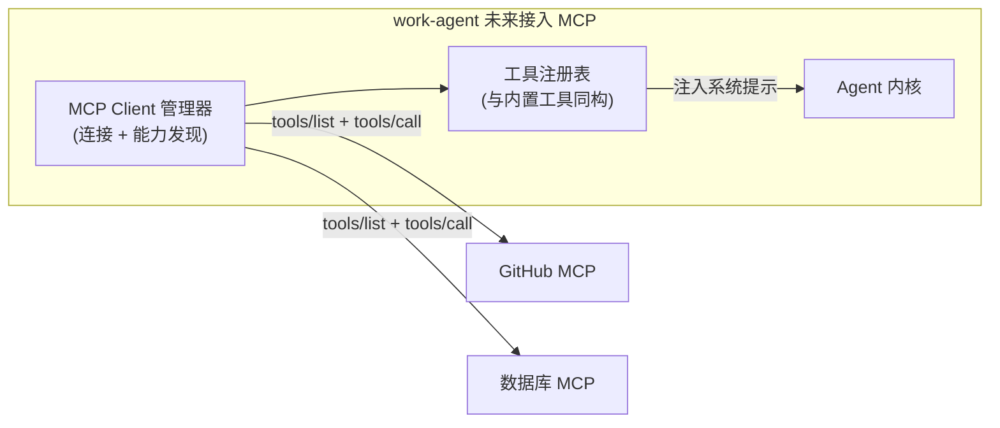

# MCP 到底是什么？写给编程 Agent 开发者的一份教程

> 阅读本文你将搞懂三件事：
>
> 1. MCP（Model Context Protocol，模型上下文协议）是什么、为什么需要它；
> 2. 它内部是怎么工作的（架构、协议、三种原语、传输方式）；
> 3. 对标产品 **Claude Code** 和 **OpenAI Codex** 是怎么管理 MCP 的，我们能学什么。

---

## 一、一句话：MCP 是"AI 应用的 USB-C 口"

你肯定见过 USB 接口。一个 USB-C 口，能接显示器、硬盘、键盘、手机充电器……无论设备是哪家生产的，只要都遵循 USB 标准，插上就能用。

**MCP 就是给 AI 应用做的"USB-C 口"。**

在 MCP 之前，AI 应用（Claude、Cursor、Codex）想接一个外部工具（数据库、搜索、GitHub），得为**每一对**组合写专门代码：

```
没有 MCP 之前：N 个 AI 应用 × M 个工具 = N×M 种连接，每对都要单独写对接
有 MCP 之后：工具写好一个 MCP Server，任何 AI 应用按标准接入 = N + M 种工作量
```

这个"每个 AI 应用都要和每个数据源/工具单独集成"的问题，业内叫 **N×M 集成问题**。MCP 的贡献，就是把"相乘"变成"相加"。

> 一句话记住：**MCP 让工具实现一次，处处接入。**

MCP 由 **Anthropic 于 2024 年 11 月**提出，现在是开源标准，微软、OpenAI、Google 等都已支持。

---

## 二、为什么需要 MCP？它解决什么痛点

我们用一个具体场景感受一下。

假设你要让 AI 助手能"查你们公司的 PostgreSQL 数据库"。没有 MCP 时，你大概要做这些：

1. 写一段代码，告诉 AI"数据库长这样、有哪些表、怎么查"；
2. 处理数据库返回结果的格式；
3. 处理认证、超时、错误；
4. 如果下次想接 MySQL、再下次想接 GitHub，又得重来一遍。

对**每一个 AI 应用 × 每一个数据源**都要重复这个过程。这就是 N×M 问题。

MCP 的解法很干脆：**数据源/工具方**实现一个 MCP Server（只做一次），**AI 应用方**实现 MCP Client（也只做一次），两者按统一协议对话。

| 角色 | 得到的好处 |
|---|---|
| 工具/数据源开发者 | 只写一次，所有兼容 AI 应用都能用 |
| AI 应用（Claude/Codex/Cursor...） | 一次接入，获得整个工具生态 |
| 终端用户 | 更强大的 AI，能读数据、能动手操作 |

---

## 三、MCP 的核心架构：Host / Client / Server

MCP 是**三件套**架构，别搞混了：



三个角色各管一摊：

| 角色 | 通俗理解 | 职责 |
|---|---|---|
| **Host（宿主）** | 你打开的那个 App | Claude Desktop、Claude Code、Codex CLI……它**持有大模型**，协调用户意图与多个连接 |
| **Client（客户端）** | App 内部的"插头" | 与每个 Server **一对一有状态连接**；连 3 个 Server 就有 3 个 Client |
| **Server（服务器）** | 外部的"插座" | 独立程序（本地子进程或远程 HTTP），封装能力，**不直接接触大模型** |

**关键设计**：一个 Client 只对一 个 Server，是**刻意隔离**。这样 Host 可以对每个 Server 单独施加权限边界，一个 Server 出问题不会污染其他连接。

> 你要记住：**Server 默认接触不到大模型**。它只和 Client 说话，除非 Client 显式声明了 `sampling`（采样）能力，Server 才能"反向请模型补全文本"。

---

## 四、MCP 内部怎么工作

### 4.1 传输层：stdio 还是 HTTP？

MCP 规定了两种连接方式（传输层），选哪种取决于 Server 部署在哪：



- **stdio**：Server 作为**本地子进程**被拉起，从标准输入读、往标准输出写。不暴露网络端口、延迟低。典型：`npx xxx-mcp-server`。
- **Streamable HTTP**：Server 是**远程 URL**。单端点处理 POST + 可选 SSE 推送，用 `Mcp-Session-Id` 头做会话管理。典型：Figma、Chrome DevTools 的云端服务。

> 传输层变了，但上层业务逻辑**完全不用改**——这就是"传输与语义分层"的好处。

### 4.2 消息格式：JSON-RPC 2.0

MCP 的报文用 **JSON-RPC 2.0**，只有三种消息：

| 类型 | 特征 | 例子 |
|---|---|---|
| **Request（请求）** | 带 `id`，期待回复 | `tools/list`、`tools/call` |
| **Response（响应）** | 带相同 `id`，返回结果或错误 | 工具调用结果 |
| **Notification（通知）** | 不带 `id`，发出去不等回复 | `notifications/initialized` |

方法名遵循 `资源/动作` 的约定，比如 `resources/read`、`prompts/get`、`tools/call`。

### 4.3 生命周期：先握手，再干活

Client 和 Server 建立连接后，不是马上就能用，要先"握手"确认双方版本和能力：



这段握手很关键：**双方版本不同也能优雅共存**——协商出共同支持的功能集即可。协议按日期版本化，如 `2024-11-05`、`2025-03-26`、`2025-06-18`。

---

## 五、三种原语：Tools / Resources / Prompts

MCP Server 能暴露三类能力，叫"原语"。你只要记住**谁控制谁用**：



| 原语 | 控制方 | 作用 | 主要方法 | 例子 |
|---|---|---|---|---|
| **Tools（工具）** | **模型**控制 | 模型主动调用的可执行函数 | `tools/list`、`tools/call` | 发邮件、执行 SQL、调用 API |
| **Resources（资源）** | **应用**控制 | 用 URI 标识、供当上下文的数据 | `resources/list`、`resources/read` | 文件内容、数据库记录 |
| **Prompts（提示）** | **用户**控制 | 带参数的可复用提示模板 | `prompts/list`、`prompts/get` | 代码审查模板、commit message 模板 |

> 一个实用洞察：**Tools 描述写得不清楚 → 模型根本不会去调**。所以做 MCP 工具时，名称和 description 要写得像给模型看的说明书，而不是给程序员看的注释。

---

## 六、Claude Code 怎么管理 MCP

Claude Code 是目前对 MCP 支持最"顺手"的编码 Agent，管理方式值得细看。

### 6.1 会话内：`/mcp` 面板

在 Claude Code 里敲 `/mcp`，能看所有已配置 Server：

- 每个 Server 的连接状态：✔ 已连接 / ! 需认证 / ✘ 连接失败
- 每个 Server 暴露了多少工具
- Server 来源（手动配置 / 插件 / claude.ai connectors）
- 可操作：**启用/禁用**、**OAuth 认证**、**清除/重新认证**

### 6.2 命令行：`claude mcp add/list/get/remove`

```bash
# 添加一个 stdio 服务器（npx 启动），注意 -- 后是服务器自己的命令
claude mcp add --env AIRTABLE_API_KEY=YOUR_KEY --transport stdio airtable \
  -- npx -y airtable-mcp-server

# 列出所有服务器及健康状态
claude mcp list

# 看某个服务器详情
claude mcp get airtable

# 移除
claude mcp remove airtable

# 添加远程 HTTP 服务器
claude mcp add --transport http stripe https://mcp.stripe.com
```

### 6.3 配置放哪：scope 层级

这是 Claude Code 设计得最好的地方之一。一个 Server 的配置可以放在**四个不同层级**，加载范围不同：

| Scope | 存储位置 | 加载范围 | 是否进版本控制 |
|---|---|---|---|
| **local**（默认） | `~/.claude.json`（项目条目下） | 仅当前项目、仅自己 | 否 |
| **project** | 项目根目录 `.mcp.json` | 当前项目、**团队共享** | **是** |
| **user** | `~/.claude.json`（全局） | 所有项目、仅自己 | 否 |
| 插件提供 | 插件包内 | 启用插件时自动加载 | 随插件分发 |

同名 Server 只连接一次，不合并字段，优先级：

```
local > project > user > 插件 > claude.ai connectors
```

### 6.4 `.mcp.json` 配置长啥样

```json
{
  "mcpServers": {
    "server-name": {
      "type": "stdio",                  // stdio / http / sse / ws
      "command": "npx",                 // stdio 用
      "args": ["-y", "server-package"],
      "env": { "API_KEY": "${API_KEY}" },   // 支持 ${VAR} 环境变量展开
      "url": "https://example.com/mcp",     // http/sse 用
      "headers": { "Authorization": "Bearer xxx" },
      "timeout": 600000,                // 毫秒
      "alwaysLoad": true,               // 豁免工具延迟加载
      "oauth": { "clientId": "xxx" }
    }
  }
}
```

### 6.5 安全：trust 审批

Claude Code 对 MCP 的安全处理很严格，值得学习：

- **项目级 `.mcp.json`** 里的 Server，需要**用户审批**后才能连（面板里显示 `⏸ Pending approval`）。
- 审批记录存在 `enabledMcpjsonServers` / `disabledMcpjsonServers`。
- **未信任的工作区**（没接受 trust dialog）不能通过提交到版本控制的 `.claude/settings.json` 自动批准 Server。
- `headersHelper`（会执行任意 shell 脚本）也只有在接受 trust dialog 后才执行。
- 服务器可在工具元数据里设 `_meta["anthropic/requiresUserInteraction"]: true`，让**每个工具每次调用都强制确认**——即使在 `bypassPermissions` 模式下也不例外。

### 6.6 上下文优化：工具延迟加载

Claude Code 默认开启 **Tool Search**：MCP 工具**延迟加载**，模型通过搜索按需发现工具，而不是把几百个工具全塞进上下文。这对我们项目（上下文稀缺是核心约束）很有借鉴意义。

---

## 七、OpenAI Codex CLI 怎么管理 MCP

Codex 走的是**"配置 + 沙箱"**路线，更工程化。

### 7.1 配置在哪：`config.toml`

Codex 把 MCP 配置放在 `config.toml` 的 `[mcp_servers]` 表下，分层与 Claude Code 类似：

| 层级 | 路径 | 说明 |
|---|---|---|
| 全局 | `~/.codex/config.toml` | 所有项目通用 |
| 项目级 | `.codex/config.toml` | **仅受信任的项目**生效（安全设计） |

CLI 和 IDE 扩展**共享同一份 config**，配置一次两头都能用。

### 7.2 命令行：`codex mcp add`

```bash
# 添加 stdio 服务器
codex mcp add context7 -- npx -y @upstash/context7-mcp

# 带环境变量
codex mcp add my-server --env VAR1=VALUE1 -- npx -y some-mcp-server

# OAuth 登录
codex mcp login my-server

# TUI 里查看活动中的 MCP 服务器
/mcp
```

### 7.3 `config.toml` 配置示例

**stdio（本地进程）：**

```toml
[mcp_servers.context7]
command = "npx"
args = ["-y", "@upstash/context7-mcp"]
env = { MY_ENV_VAR = "MY_VALUE" }
cwd = "/path/to/workdir"
startup_timeout_sec = 20   # 启动超时
tool_timeout_sec = 45      # 工具运行超时
```

**Streamable HTTP（远程）：**

```toml
[mcp_servers.figma]
url = "https://mcp.figma.com/mcp"
bearer_token_env_var = "FIGMA_OAUTH_TOKEN"
http_headers = { "X-Figma-Region" = "us-east-1" }
```

### 7.4 审批与过滤（Codex 的特色）

Codex 把 MCP 的权限管理做成了**多维度控制**，这点非常值得抄：

```toml
[mcp_servers.chrome_devtools]
url = "https://:3000/mcp"
enabled = true              # 设为 false 禁用但不删除
required = true             # 无法初始化时启动直接失败
enabled_tools = ["open", "screenshot"]   # 工具白名单
disabled_tools = ["screenshot"]          # 工具黑名单
default_tools_approval_mode = "prompt"   # 默认审批模式

# 单工具级覆盖
[mcp_servers.chrome_devtools.tools.open]
approval_mode = "approve"
```

审批模式有四种，你可以理解为"权限粒度旋钮"：

| 模式 | 含义 |
|---|---|
| `auto` | 自动执行，不打断用户 |
| `prompt` | 每次使用都问用户 |
| `approve` | 预先批准（可手动审批） |
| `writes` | 只读自动，写操作才问 |

**自动批准的两个条件**（否则就弹权限确认）：
1. 服务器级/工具级 `approval_mode = approve`；
2. 工具被标记为 `read_only`（只读）且会话允许该操作。

### 7.5 沙箱感知

Codex 的 MCP 是和它的**沙箱体系**打通的：

- 通过 `codex/sandbox-state/update` 通知，把当前沙箱权限限制**同步给 MCP Server**，让 Server 知道代理现在能干啥不能干啥。
- 支持 `elicitation`：Server 在运行中可以向用户**索取信息**（表单、URL）。
- 服务器进程本身也在沙箱限制下运行。

---

## 八、Claude Code vs Codex：MCP 管理对比

| 维度 | Claude Code | OpenAI Codex |
|---|---|---|
| 配置格式 | `.mcp.json`（JSON） | `config.toml`（TOML） |
| 会话内面板 | `/mcp` | `/mcp` |
| scope 层级 | local/project/user/插件 | 全局/项目级 |
| 审批模型 | trust dialog + 每次调用强制确认 | `auto/prompt/approve/writes` 四档 |
| 工具粒度 | 按服务器整体启停 | 服务器级 + **单工具白/黑名单** |
| 上下文优化 | Tool Search 延迟加载 | 工具缓存 + 按需加载 |
| 与沙箱 | 权限提示为主 | 深度打通 sandbox-state |
| 特色 | 生态最全、OAuth 最顺 | 工程化最强、可编程控制最细 |

一句话总结差异：**Claude Code 靠"用户体验 + 审批对话"取胜，Codex 靠"声明式配置 + 沙箱隔离"取胜。**

---

## 八点五、主流方案如何处理"一个 Server 多个工具"

前面讲的是配置管理，这里专门看各家在**工具发现与命名**层面的真实做法——一个 Server 暴露几十个工具时，它们是怎么组织、怎么暴露给模型的。这直接决定我们接入时的取舍。

### 1. Claude Code：命名空间 + 专用工具

Claude Code 是 MCP 支持最完善的，做法可逐条拆解。

**（1）工具命名：三段式命名空间**

Claude Code 把每个 MCP 工具映射为 **`mcp__<serverId>__<toolName>`**：

```text
mcp__github__search_issues      # server=github, tool=search_issues
mcp__github__create_issue
mcp__db__query
```

关键细节：
- 用 `mcp__` 前缀，**天然与内置工具不冲突**（内置工具是 `read`/`write`/`edit`… 不可能以 `mcp__` 开头）；
- 做了 **`safeServer`/`safeTool` 清洗**：server 名或工具名里的非法字符（非 `[a-zA-Z0-9_-]`）被替换成 `_`，保证名字永远是干净标识符；
- 客户端知道工具名就能反推 server——`mcp__github__search_issues` 一眼看出归属。

**（2）接入用三个内置工具**

Claude Code 在客户端注册表里放了**三个专用工具**处理 MCP：

| 工具 | 作用 |
|---|---|
| `MCPTool` | 通用的 MCP 工具调用器 |
| `LIST_MCP_RESOURCES` | 列出 MCP 资源 |
| `TOOL_SEARCH` | **延迟加载的语义搜索**，按相关性在注册表里找工具，默认启用 |

**（3）每个工具注入安全默认值（fail-closed）**

Claude Code 给每个 MCP 工具附加元数据，默认从保守侧：

```python
isReadOnly = inferReadOnly(t)  # 默认 False（宁可当有写操作）
isConcurrencySafe = False  # 第三方工具默认不并发安全
```

不是靠工具名猜只读，而是**默认 `isReadOnly=False`（fail-closed）**——拿不准就当有写操作走审批。

**（4）授权用通配符**

```json
{
  "permissions": {
    "allow": ["mcp__github__*", "mcp__db__query"]
  }
}
```

- `mcp__github__*`：授权整个 github server 的所有工具；
- `mcp__db__query`：只授权 db 的 query 一个工具。

**（5）策略包统一治理**

per-server trust level + `tool_overrides` 双层：低信任 server 的全部工具都需审批；单个工具可单独覆写。

### 2. Codex：配置分组 + 工具白/黑名单，无命名空间前缀

Codex 走**"声明式过滤"**路线，和 Claude 的命名空间思路不同：

**（1）配置按 server 分组 + 工具过滤**

```toml
[mcp_servers.chrome_devtools]
url = "https://:3000/mcp"
enabled_tools = ["open", "screenshot"]   # 白名单
disabled_tools = ["screenshot"]          # 黑名单（在白名单后应用）
default_tools_approval_mode = "prompt"
```

**（2）不加命名空间前缀**

Codex 文档里**没有**显式的工具名前缀机制，靠 `enabled_tools`/`disabled_tools` 在发现后过滤，工具名就是 MCP 原始名。冲突时靠配置分组隐式区分——但模型看到的可能是裸名，跨 server 存在撞名风险（这是它比 Claude 弱的一点）。

**（3）两层审批模式**

```toml
[mcp_servers.chrome_devtools]            # server 级默认
default_tools_approval_mode = "prompt"

[mcp_servers.chrome_devtools.tools.open] # 工具级覆盖
approval_mode = "approve"
```

**server 级默认 + 工具级覆盖**，和 Claude 的 `allowedTools` 通配符殊途同归。

### 3. Cursor 及主流：硬上限，暴露出痛点

Cursor 的做法最有警示意义：

- **硬上限 40 个 MCP 工具**：无论装了多少 Server，只有前 40 个暴露给模型，**超过的静默丢弃**；
- 这是为了控制上下文和资源，但代价是"装了却用不上"；
- 部分平台在底层 Messages API 用 `tool_search_tool_regex` / `tool_search_tool_bm25`（正则/BM25 语义检索）做延迟加载——和 Claude 的 `TOOL_SEARCH` 一致。

### 4. 业界共性 → 对我们的启示

综合三家，可归纳出业界在"一个 Server 多个工具"上的普遍做法：

| 维度 | 业界主流做法 |
|---|---|
| 命名 | `mcp__server__tool` 三段式命名空间（Claude 最清晰） |
| 发现 | 内置 `TOOL_SEARCH` 工具，默认启用，按需语义检索 |
| 安全 | 默认 fail-closed（`isReadOnly=False`），拿不准当有写操作 |
| 审批 | server 级通配授权（`mcp__github__*`）+ 工具级精确授权两层 |
| 上限 | 避免硬截断静默丢工具（Cursor 的教训），用目录 + 按需激活 |
| 额外防护 | 描述消毒防注入、输出过大落盘、热更新不静默改契约 |

> 一句话：**命名用 `mcp__` 前缀、发现用内置搜索工具、安全默认 fail-closed、审批 server/工具两级、不静默丢工具**，是当前主流共识。

---

## 九、对我们的借鉴（work-agent 项目）

结合本项目（work-agent，Python daemon + Electron 前端，正在做通用编码 Agent），MCP 的启示：



1. **工具同构**：我们已有 `default_registry`（内置 read/write/bash...），MCP 工具可以**映射成同一份 `ToolRegistry` 条目**，让现有 ReAct 循环、审批层、上下文管理**零改动**复用。
2. **延迟加载**：借鉴 Claude 的 Tool Search，MCP 工具按需发现，别把几百个工具全塞进 system prompt（我们上下文稀缺，这点尤其重要）。
3. **审批分层**：借鉴 Codex 的 `auto/prompt/approve` + 单工具白名单，接入我们已有的 `permission_mode` / 审批层。
4. **沙箱感知**：我们的 sandbox 是独立可插拔执行层，MCP 工具调用应走同一沙箱通道，不能绕过。
5. **配置分层**：借鉴 scope 设计，MCP Server 配置分"项目级（共享）/用户级（私有）"，敏感凭据不进版本控制。

---

## 十、参考

- [MCP 官方文档](https://modelcontextprotocol.io)
- [Anthropic: Introducing the Model Context Protocol](https://www.anthropic.com/news/model-context-protocol)
- [Claude Code MCP 文档](https://code.claude.com/docs/en/mcp)
- [OpenAI Codex MCP 文档](https://developers.openai.com/codex/mcp)
- [openai/codex 源码：config/mod.rs 与 codex-mcp/connection_manager.rs](https://github.com/openai/codex)

---

*本文为 work-agent 项目调研文档，2026-08-02 更新。*
