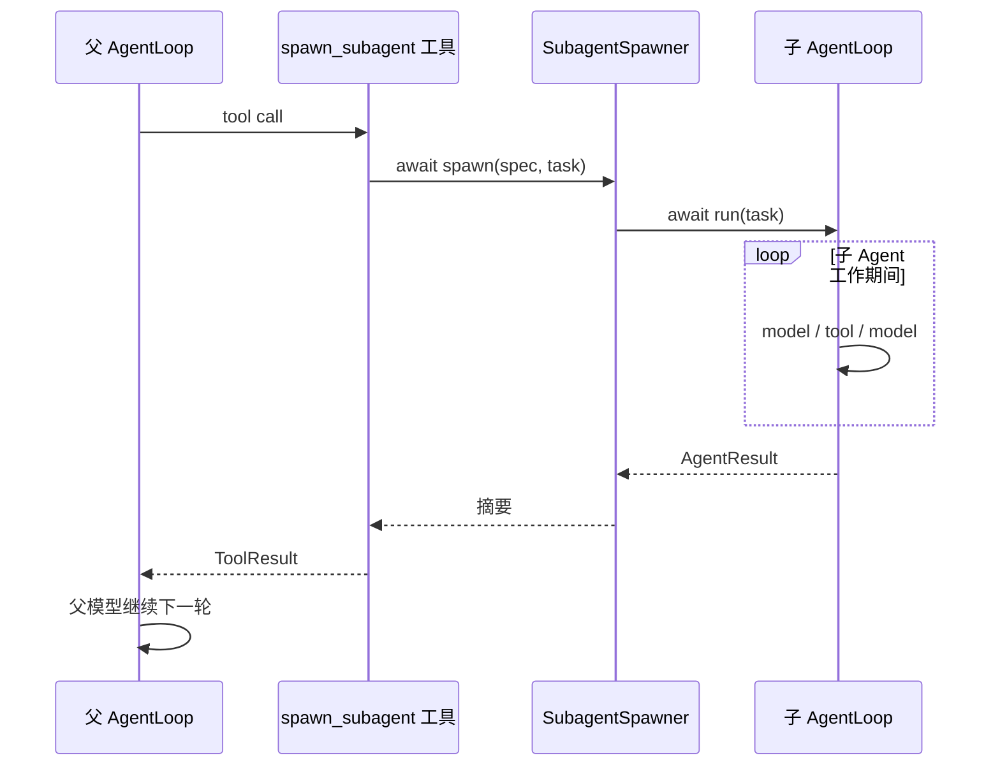
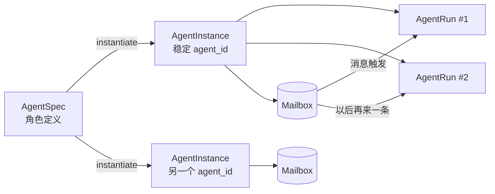
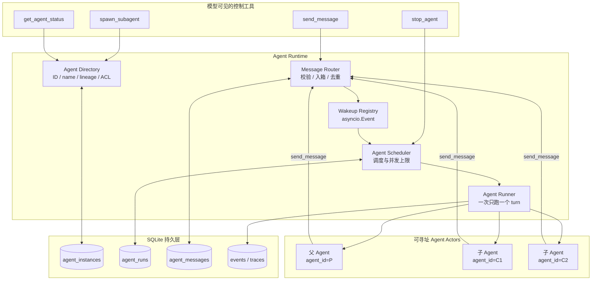
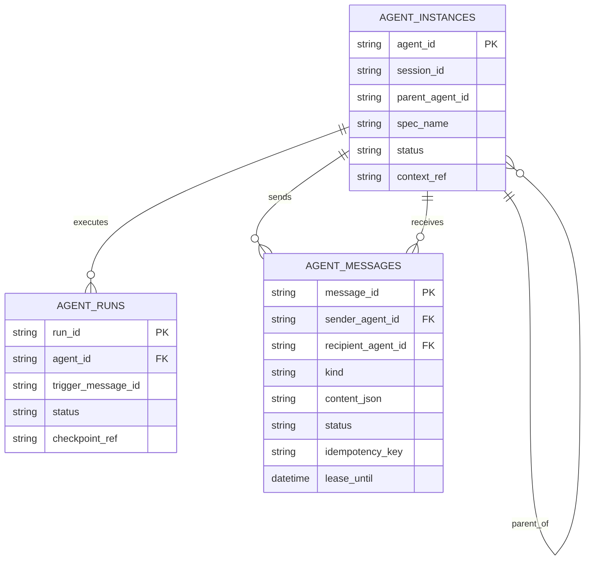
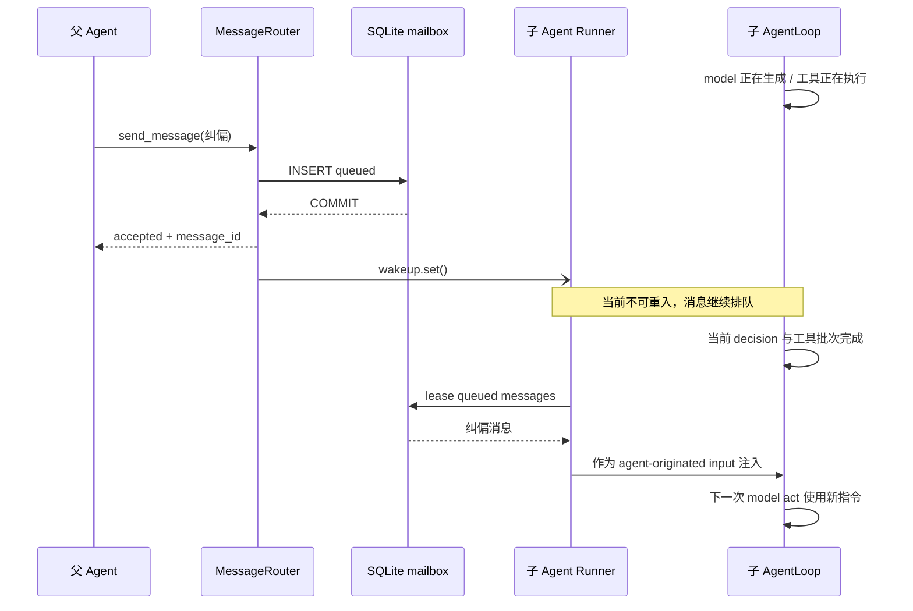
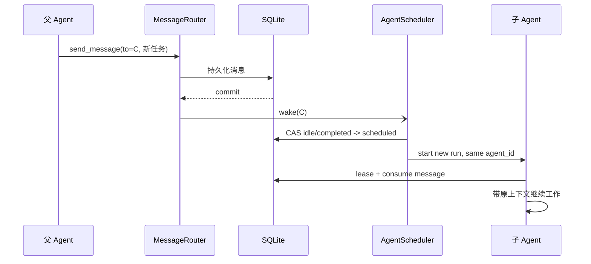
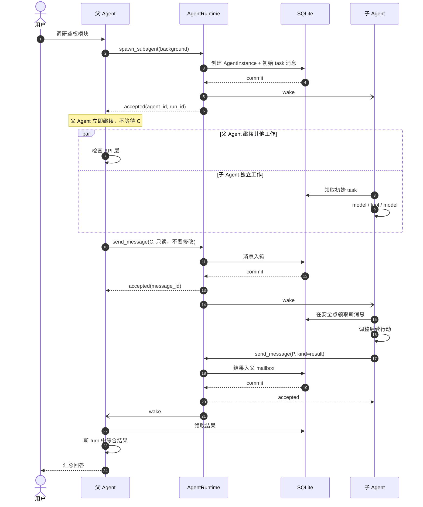
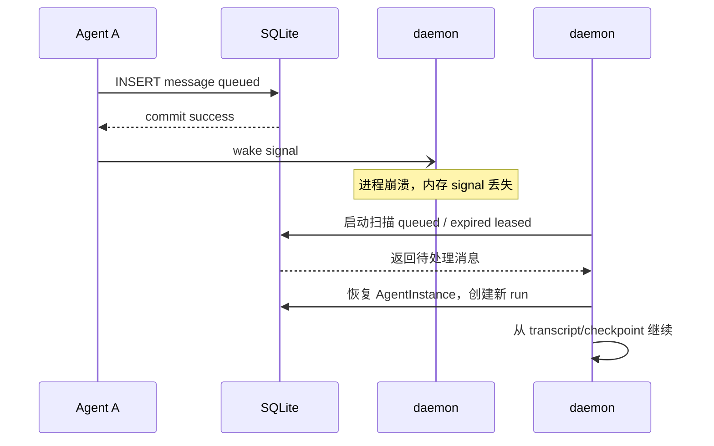
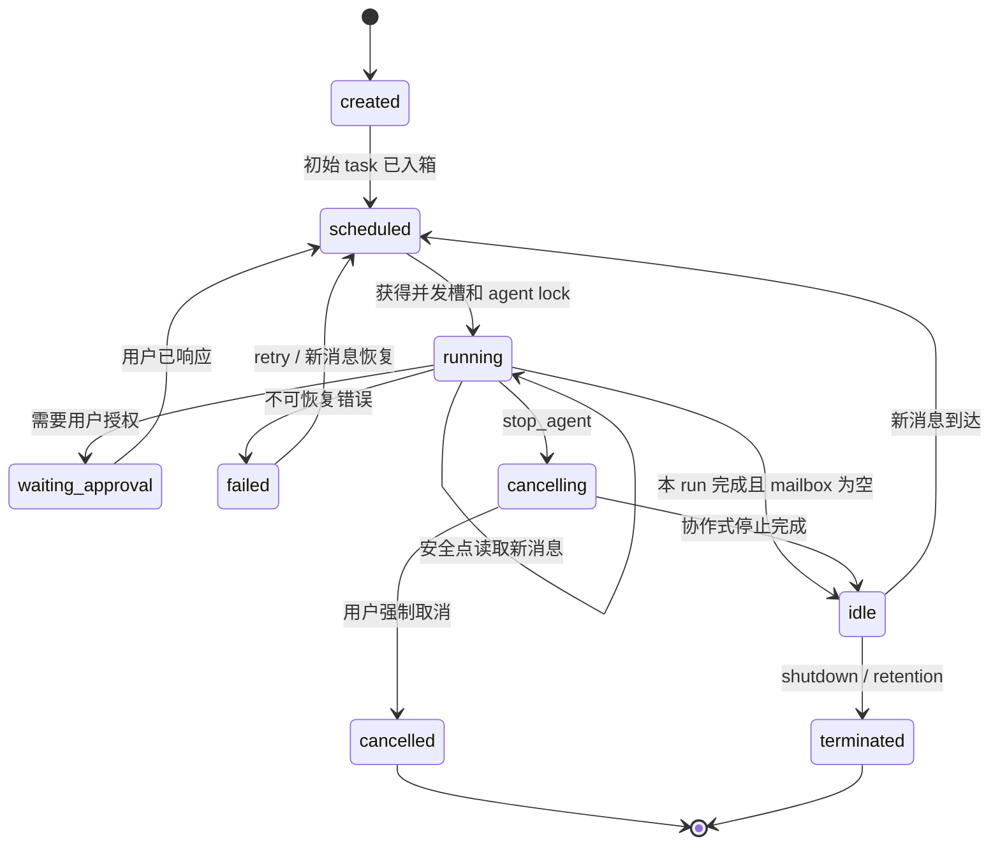

# Subagent 异步通信架构设计：从“函数调用”到“可唤醒的 Agent”

> 调研与设计日期：2026-08-26
>
> 适用项目：work-agent（Python 3.12+ / asyncio / SQLite）
>
> 文档性质：架构设计，不包含本轮代码实现

## 先说结论

现在的 Subagent 更像一个异步函数：父 Agent 调用 `spawn_subagent`，子 Agent 开始执行，父 Agent 一直等到它返回摘要。即使底层用了 `asyncio`，对正在进行这次工具调用的父模型来说，它仍然是阻塞的。

要得到 Claude Code 那种“子 Agent 在后台工作，父 Agent 随时补充指令，子 Agent 完成后主动叫醒父 Agent”的体验，不能只加一个 `send_message()` 函数。需要把 Subagent 从“一次函数调用”升级成一个有稳定地址、有持久状态、可以反复运行的 **Agent Actor**。

本设计采用以下模型：

1. `agent_id` 表示一个长期存在、可寻址的 Agent；`run_id` 只表示它的一次运行。
2. 每个 Agent 有一个 SQLite 持久 mailbox。发送消息时先提交数据库，再发内存唤醒信号。
3. `spawn_subagent` 默认立即返回 `agent_id`，父 Agent 不再等待子任务结束。
4. `send_message` 只保证消息已可靠入箱，不等待收件人处理。
5. 每个 Agent 同一时刻最多运行一个 turn。运行中的新消息只在安全点注入，不并发修改同一份上下文。
6. 子 Agent 用同一个 `send_message` 给父 Agent 发 `result`、`progress` 或 `question`；消息会唤醒空闲的父 Agent。
7. 投递语义采用 **至少一次（at-least-once）**，靠 `message_id` 和 `idempotency_key` 去重；不宣称做不到的“端到端恰好一次”。
8. SQLite 是事实，`asyncio.Event` 只是门铃。门铃可以丢，信不能丢。

一句话概括：

> 把 Subagent 做成 Actor，把 mailbox 做成持久队列，把 AgentLoop 做成一次又一次可恢复的 turn。

---

## 一、问题到底出在哪里

先看当前调用链：



代码也正是这样做的：

- `agent/core/loop.py::_tool_spawn_subagent()` 中直接 `await self.subagent_spawner.spawn(...)`；
- `agent/subagent.py::SubagentSpawner.spawn()` 中直接 `await loop.run(...)`；
- 子 Agent 执行结束后，只留下 `AgentResult.text` 和一个用于展示、回放的 subsession；
- `Session.spawn_background()` 虽然创建了 `asyncio.Task`，但它是 CLI/会话层的旁路机制，模型调用的 `spawn_subagent` 仍然没有变成非阻塞协议；
- `SessionHandle` 已有 `running_task`、`lock`、`children`，却还没有“可恢复 Agent 实例”和 mailbox。

这里容易混淆两个“异步”：

- **协程异步**：事件循环还能运行别的任务；项目已经具备。
- **协议非阻塞**：调用方拿到“已受理”就继续，不等业务结果；项目尚未具备。

真正缺少的是第二种。

---

## 二、业界怎么做

### 2.1 Claude Code：稳定身份 + mailbox + 自动恢复

Claude Code 已经把 Subagent 和 Agent Team 做成了两层：

- 普通 Subagent 可以在结束后凭 `agent ID` 恢复；向已完成的 Subagent 发送 `SendMessage`，会用原 ID 在后台自动恢复一次新的 run；
- Team 中每个 Agent 有独立上下文和 mailbox；消息自动投递，接收方不需要让模型轮询；
- mailbox 是本地持久文件，写入成功才报告“发送成功”；
- Agent 间消息明确标记为来自另一个 Agent，不能冒充用户授权；
- idle 通知和业务结果分离：idle 只表示状态变化，结果仍由 Agent 发消息或写共享任务表。

参考：[Claude Code Subagent 恢复与 SendMessage](https://code.claude.com/docs/en/sub-agents#resume-subagents)、[Claude Code Agent Teams 架构与 mailbox](https://code.claude.com/docs/en/agent-teams#architecture)。

这套设计最值得借鉴的不是 JSON 文件，而是三个语义：

1. 名字不是身份，稳定 `agent_id` 才是身份；
2. Agent 完成不等于销毁，它可以在同一个身份下再次运行；
3. 消息投递和任务完成是两回事。

### 2.2 OpenAI Agents SDK：Manager 与 Handoff 是两种不同关系

OpenAI Agents SDK 把多 Agent 编排分成两类：

- Manager（agents as tools）：管理者保留控制权，专家像工具一样被调用；
- Handoff：当前 Agent 把对话控制权交给另一个 Agent。

参考：[OpenAI Agents SDK 的多 Agent 模式](https://openai.github.io/openai-agents-python/agents/#multi-agent-system-design-patterns)。

本项目当前属于第一类，而且是同步 Manager。我们要增加的是“异步 Manager”，不是 Handoff。父 Agent 仍是主会话负责人，子 Agent 只拥有自己的工作上下文，不接管用户会话。

这一区分非常重要：如果把 `send_message` 做成 handoff，子 Agent 一醒来就会抢走主会话控制权；如果继续把它做成普通工具返回值，又会重新回到同步阻塞。

### 2.3 AutoGen Core：Agent Runtime 负责路由，Agent 只处理消息

AutoGen Core 采用事件驱动 runtime：Agent 有 `AgentId`，消息可以按 ID 直接发送，也可以发布到 topic；处理函数按消息类型路由。直接消息适合请求/响应，广播则是单向发布，返回值会被丢弃。

参考：[AutoGen Core Message and Communication](https://microsoft.github.io/autogen/stable/user-guide/core-user-guide/framework/message-and-communication.html)。

它给本项目的启发是：

- 路由、排队、并发限制属于 runtime，不属于模型；
- 父子通信默认应是 direct message，不应该一开始就做全局群聊；
- 消息协议应有类型，而不只是任意字符串。

### 2.4 LangGraph：恢复靠稳定 thread 和 checkpoint，不靠挂住调用栈

LangGraph 在中断时持久化状态，用稳定 `thread_id` 找回 checkpoint，再通过新一次调用恢复。它还明确区分一次性 Subgraph 与跨调用保留状态的 per-thread Subgraph。

参考：[LangGraph Interrupts](https://docs.langchain.com/oss/python/langgraph/interrupts)、[LangGraph Subgraph persistence](https://docs.langchain.com/oss/python/langgraph/use-subgraphs#subgraph-persistence)。

值得借鉴的是：

- 不要指望进程永远不重启、协程永远不丢；
- 恢复单位应是持久身份和 checkpoint；
- 一个执行步骤恢复时可能重做，所以步骤前的副作用必须幂等。

### 2.5 对比之后的选择

| 模型 | 控制权 | 通信方式 | 是否适合本项目目标 |
|---|---|---|---|
| 同步 Agent-as-Tool | 父 Agent | 工具返回值 | 当前实现；简单，但阻塞 |
| Handoff | 接收方 Agent | 转交整个对话 | 不适合，子 Agent 不应接管主会话 |
| Shared Group Chat | 调度器/选发言者 | 全员共享消息 | 适合讨论，不适合默认父子隔离 |
| Blackboard / 共享任务表 | 多方 | 读写共享状态 | 适合任务协调，不能代替定向消息 |
| Actor + Mailbox | 每个 Agent 自治 | 按稳定 ID 定向投递 | **本设计采用** |
| Durable Workflow | 工作流引擎 | signal + checkpoint | 作为恢复语义借鉴，MVP 不引入新引擎 |

最终选择是 **Actor + durable mailbox + 单 Agent 串行 turn**，同时保留现有父子层级、工具白名单、沙箱和事件流。

---

## 三、先把几个名词分清楚

如果名词混在一起，代码很快也会混在一起。

### AgentSpec

Agent 的“类定义”，例如 `explore`、`plan`、`general-purpose`。它描述 system prompt、模型、工具和权限。现有 `AgentSpec` 可以继续使用。

### AgentInstance

Agent 的“对象实例”，有稳定的 `agent_id`、父 Agent、上下文、mailbox 和生命周期。一个 `AgentSpec` 可以产生很多 `AgentInstance`。

### AgentRun

AgentInstance 的一次执行。Agent 收到一批消息后启动一个 run；run 结束后 Agent 可以回到 idle，稍后再被消息唤醒。

### Message

从一个 Agent 发给另一个 Agent 的持久信封。消息入箱成功不代表已被处理。

### Task

业务工作项。它可以由一个或多个 run 完成，也可以独立于 Agent 生命周期存在。MVP 不必立刻做共享 Task Board，但不要拿 `run_id` 冒充 `task_id`。

它们的关系如下：



最关键的一句是：**完成的是 run，休眠的是 AgentInstance。**

---

## 四、总体架构

### 4.1 组件图



### 4.2 职责边界

`SubagentSpawner` 以后只负责“怎么构造一个子 Agent”，不再负责它一生的运行管理。

新增 `AgentRuntime` 负责：

- 注册和恢复 AgentInstance；
- 把消息可靠地写进 mailbox；
- 决定哪个 Agent 应被唤醒；
- 确保一个 Agent 不会同时跑两个 turn；
- run 完成后更新状态并发出生命周期通知；
- daemon 重启后扫描未处理消息并恢复工作。

`AgentLoop` 仍负责一次 ReAct 执行，但要增加“安全点收信”能力。这样保留现有能力正交：

- Tool 是原子能力；
- Skill 是按需知识包；
- Subagent 是隔离上下文；
- Runtime 是生命周期和通信基础设施。

---

## 五、工具协议怎么设计

### 5.1 `spawn_subagent`

建议把工具协议改为：

```json
{
  "agent": "general-purpose",
  "task": "检查鉴权模块，并把发现发给我",
  "name": "auth-reviewer",
  "mode": "background"
}
```

立即返回：

```json
{
  "accepted": true,
  "agent_id": "agt_01K...",
  "run_id": "run_01K...",
  "name": "auth-reviewer",
  "status": "running"
}
```

语义：

- `background`：默认值，入箱初始任务后立即返回；
- `foreground`：兼容旧行为，等待当前 run 结束并返回摘要；
- `agent_id` 是权威地址；`name` 只是当前会话中的便捷别名；
- 初始 `task` 也应当通过 mailbox 写入，而不是绕过通信层直接传给 `loop.run()`。这样“第一次运行”和“后续唤醒”只有一条路径。

### 5.2 `send_message`

建议协议：

```json
{
  "to": "agt_01K...",
  "kind": "instruction",
  "content": "先不要改代码，只验证竞态条件",
  "reply_to": "msg_01K...",
  "idempotency_key": "tool-call-c42",
  "wake": true
}
```

立即返回：

```json
{
  "accepted": true,
  "message_id": "msg_01K...",
  "recipient_status": "running",
  "delivery": "queued"
}
```

这里的 `accepted` 只表示：消息已经通过校验并提交到 SQLite。它不表示收件人已经读到，更不表示收件人已经执行完。

### 5.3 消息类型

MVP 建议保留一个小而稳定的集合：

| kind | 用途 | 默认唤醒 |
|---|---|---|
| `task` | 初始任务或新的独立任务 | 是 |
| `instruction` | 补充要求、纠偏 | 是 |
| `result` | 子 Agent 返回阶段或最终结果 | 是 |
| `progress` | 有意义的进度更新 | 可配置，默认否 |
| `question` | 需要父 Agent 判断的问题 | 是 |
| `error` | 失败说明 | 是 |
| `control` | stop、shutdown 等结构化控制 | 是，走专门校验 |
| `lifecycle` | idle、completed、failed 等 runtime 事件 | 通常只通知，不喂给模型 |

不要把授权响应混进普通 `instruction`。审批必须继续走现有 ApprovalGate / 用户通道。

### 5.4 配套工具

为了让模型不靠猜，建议同时提供：

- `get_agent_status(agent_id)`：查 Agent 与当前 run 状态；
- `list_agents(scope="children")`：列出当前 Agent 可见的子 Agent；
- `stop_agent(agent_id, reason)`：请求优雅停止；
- 可选 `wait_agent(agent_ids, timeout)`：只给确实需要 join 的场景，不作为默认流程。

`wait_agent` 不是实现异步通信的必要条件。滥用它会把新架构重新用成同步调用。

---

## 六、mailbox 如何存储

### 6.1 为什么继续用 SQLite

项目已经以 SQLite 保存会话和事件流。单机 daemon 下，再引入 Redis、RabbitMQ 或 Kafka 只会增加部署成本，并不能自动带来正确语义。

SQLite 足以支持 MVP：

- 写入事务；
- 唯一约束与幂等键；
- 按收件人和状态建立索引；
- daemon 重启后恢复；
- 与现有项目级 `.agent/` 隔离方式一致。

### 6.2 建议表结构

```sql
CREATE TABLE agent_instances (
    agent_id          TEXT PRIMARY KEY,
    session_id        TEXT NOT NULL,
    parent_agent_id   TEXT,
    spec_name         TEXT NOT NULL,
    display_name      TEXT,
    generation        INTEGER NOT NULL DEFAULT 1,
    status            TEXT NOT NULL,
    depth             INTEGER NOT NULL,
    context_ref       TEXT NOT NULL,
    created_at        REAL NOT NULL,
    updated_at        REAL NOT NULL,
    last_run_id       TEXT,
    last_error        TEXT
);

CREATE TABLE agent_runs (
    run_id            TEXT PRIMARY KEY,
    agent_id          TEXT NOT NULL,
    trigger_message_id TEXT,
    status            TEXT NOT NULL,
    started_at        REAL,
    finished_at       REAL,
    checkpoint_ref    TEXT,
    result_summary    TEXT,
    error             TEXT,
    FOREIGN KEY(agent_id) REFERENCES agent_instances(agent_id)
);

CREATE TABLE agent_messages (
    message_id        TEXT PRIMARY KEY,
    session_id        TEXT NOT NULL,
    sender_agent_id   TEXT NOT NULL,
    recipient_agent_id TEXT NOT NULL,
    kind              TEXT NOT NULL,
    content_json      TEXT NOT NULL,
    reply_to          TEXT,
    correlation_id    TEXT,
    idempotency_key   TEXT,
    priority          INTEGER NOT NULL DEFAULT 0,
    status            TEXT NOT NULL,
    available_at      REAL NOT NULL,
    lease_owner       TEXT,
    lease_until       REAL,
    attempt_count     INTEGER NOT NULL DEFAULT 0,
    created_at        REAL NOT NULL,
    consumed_at       REAL,
    error             TEXT,
    UNIQUE(sender_agent_id, idempotency_key)
);

CREATE INDEX idx_agent_mailbox
ON agent_messages(recipient_agent_id, status, priority DESC, created_at);
```



### 6.3 消息状态

建议采用：

```text
queued -> leased -> consumed
              \-> queued       （租约超时，重试）
              \-> dead_letter  （超过最大次数或永久错误）
```

- `queued`：已入箱，尚未交给某个 run；
- `leased`：某个 run 已领取，但还没到可确认消费的安全点；
- `consumed`：已确定注入该 Agent 的持久上下文；
- `dead_letter`：毒消息或多次处理失败，保留诊断，不静默删除。

为什么需要 lease？因为 daemon 可能在“读出消息”和“写入上下文”之间崩溃。直接标 consumed 会丢消息，一直标 queued 又会无限重复。租约允许崩溃后自动重投。

### 6.4 事件流仍然是审计主线

mailbox 表是通信域的持久日志和投递索引；现有 `events` 仍是会话重放与 UI 的事实来源。每次通信状态变化应同步产生领域事件：

- `agent_spawned`
- `agent_message_enqueued`
- `agent_message_consumed`
- `agent_run_started`
- `agent_run_finished`
- `agent_state_changed`

写 mailbox 与写通信事件必须处于同一 SQLite 事务，或采用 outbox 投影。不要出现“消息已发但事件里看不到”或者反过来的半成功。

推荐把 `agent_messages` 视为不可丢的通信事实，把 UI `EventStream` 视为它的可重建投影。这样既保住当前事件流主线，也不让实时 EventStream 承担队列的租约和重试职责。

---

## 七、什么时候读取消息

这是整个设计最容易写错的地方。

### 7.1 基本原则：只在安全点读

不能在模型流式输出到一半时直接修改 `messages`，也不能在同一个 Agent 上并发启动第二个 `AgentLoop.run()`。否则会出现：

- tool call 与 tool result 被插断，破坏配对；
- 两个 run 同时写同一上下文；
- 后来的 run 覆盖前一个 run 的 compact 边界；
- trace 和 message_id 父子关系错乱。

因此，每个 Agent 都有一个 `asyncio.Lock`，并只在下列安全点收信：

1. **run 启动前**：批量领取所有可用消息，组成这次 turn 的输入；
2. **一次 model decision 完成后**：若没有待执行工具，在下一次模型调用前注入；
3. **一批工具全部完成后**：tool_use/tool_result 已配对，再注入；
4. **run 正常结束时**：再查一次 mailbox；若有新消息，不销毁 Agent，立即调度下一 run；
5. **idle 状态**：收到 wakeup 后创建新 run；
6. **daemon 恢复时**：扫描所有 `queued` 和过期 `leased` 消息。

### 7.2 运行中收到纠偏消息

默认不取消正在飞的模型请求或工具。消息先入箱，在最近的安全点注入：



以后可以增加 `priority=urgent + interruptible=true`，在可取消的模型调用上做 cooperative cancellation；MVP 不建议一开始就做强制抢占。

### 7.3 idle 或 completed Agent 收到消息

`completed` 在这里表示“上一次 run 已完成”，不是 AgentInstance 已销毁。只要没有被用户明确 `cancelled` 或 `terminated`，新消息就可以恢复它：



### 7.4 子 Agent 如何通知父 Agent

子 Agent 不应靠“函数 return”通知父 Agent，因为它们已经不在同一个等待栈上。它应调用完全相同的 `send_message`：

```json
{
  "to": "parent",
  "kind": "result",
  "content": {
    "summary": "发现两个竞态条件，均可稳定复现",
    "artifacts": ["docs/race-report.md"],
    "status": "completed"
  }
}
```

`to: "parent"` 由 runtime 根据 `parent_agent_id` 解析，落库时必须写真实 ID。

同时，runtime 自己还应发一个不可由模型伪造的 `lifecycle` 事件。两者分工如下：

- `result`：业务内容，由子模型决定；
- `lifecycle`：运行状态，由 runtime 保证。

即使子模型忘了报告结果，父 Agent 至少能知道子 Agent 已经 idle、失败或异常退出。

### 7.5 父 Agent 如何被唤醒

父 Agent 本身也要注册成一个 AgentInstance。根 Agent 的 `agent_id` 可以稳定绑定到 `session_id`，例如 `agt_root_<session_id>`。

收到子 Agent 消息时：

- 父 Agent 正在运行：消息在下一个安全点注入；
- 父 Agent idle：scheduler 为它启动新 turn；
- UI 正在等待用户输入：先显示“子 Agent 有新结果”，后台是否自动调用父模型由配置决定；
- 父 Agent等待用户审批：普通 Agent 消息不能替用户审批，只排队或显示通知。

建议配置：

```yaml
subagents:
  parent_wakeup: auto        # auto / notify_only
  progress_wakeup: false
  result_wakeup: true
  question_wakeup: true
```

`notify_only` 适合控制 token 消耗；`auto` 更接近 Claude Code 的体验。

---

## 八、完整时序

### 8.1 非阻塞派生、补充指令、结果回传



### 8.2 daemon 崩溃与恢复



这张图解释了为什么顺序必须是：

```text
先 commit 消息，再 set 唤醒信号
```

反过来会出现 Agent 被叫醒后查不到信，随后睡回去，而消息晚一点才入库的丢唤醒竞态。

### 8.3 无丢唤醒的等待循环

正确的消费者循环不是简单 `await event.wait()`，而是：

```python
while not stopping:
    messages = mailbox.claim_available(agent_id)
    if messages:
        await run_one_turn(agent_id, messages)
        continue

    wake_event.clear()

    # clear 之后再查一次，封住“查询为空”和“开始等待”之间的竞态窗口
    if mailbox.has_available(agent_id):
        wake_event.set()
        continue

    await wake_event.wait()
```

数据库是 level-triggered 的事实，`asyncio.Event` 是 edge-triggered 的优化。每次睡前复查数据库，才能不丢唤醒。

---

## 九、Agent 生命周期

### 9.1 状态机



建议不要把 `completed` 作为 AgentInstance 的终态。可以把 `completed` 留给 AgentRun，AgentInstance 对应状态是 `idle`。这会让“完成后收到消息自动恢复”的代码自然很多。

### 9.2 并发约束

必须守住四条：

1. 单个 AgentInstance 同时最多一个 running run；
2. 单个 run 内模型决策串行；
3. 同一 decision 的普通工具仍可按现有逻辑并发；
4. 多个 AgentInstance 之间可以并行，但受全局与父级 semaphore 限制。

这相当于 Actor 模型的“每个 mailbox 串行处理，Actors 之间并行”。

---

## 十、上下文如何处理

### 10.1 首次派生

沿用现有两种模式：

- `share_history=false`：独立上下文，只收到 spawn task、固定底座与项目上下文；
- `share_history=true`：创建 AgentInstance 时复制父 conv，之后独立演化。

复制只发生一次。后续父子交流一律走 mailbox，不再重复拷贝整段父历史。

### 10.2 消息如何喂给模型

Agent 间消息要有明确边界，不能伪装成用户原话。建议在模型上下文中使用结构化包装：

```text
<agent_message
  message_id="msg_01K..."
  from="agt_01K..."
  from_name="parent"
  kind="instruction">
先不要改代码，只验证竞态条件。
</agent_message>
```

如果底层模型协议支持独立 role，可以使用框架内部 `agent` role；在 OpenAI 兼容 chat 协议中，为兼容性可映射为 `user`，但必须保留不可混淆的来源标签。

### 10.3 压缩与 mailbox

- 已消费消息进入该 Agent 自己的对话投影，可参与 Microcompact / Auto Compact；
- 原始 `agent_messages` 行不被上下文压缩删除；
- Agent transcript 与父会话分开保存，父 compact 不影响子 Agent；
- 恢复时通过 `context_ref` 找回该 Agent 自己的 transcript，而不是重新读取父 Agent 当前历史。

---

## 十一、可靠性语义

### 11.1 为什么是至少一次

假设子 Agent 已经根据消息修改了文件，但还没把 mailbox 标成 consumed，daemon 崩溃。恢复后，这条消息会再次投递。

想做到严格恰好一次，必须让“模型推理、工具副作用、消息确认”进入同一个原子事务，这在文件系统、网络和 LLM 调用之间做不到。

所以正确承诺是：

- mailbox 投递至少一次；
- 同一个 `message_id` 不重复注入同一个成功提交的 run checkpoint；
- 工具副作用继续依赖现有确认、沙箱和幂等设计；
- 恢复时明确告诉 Agent 这是重投消息，并附带上次 run 状态。

### 11.2 幂等与去重

- 模型的一次 tool call 使用 `tool_call_id` 派生 `idempotency_key`；
- `(sender_agent_id, idempotency_key)` 唯一；
- 重试 `send_message` 返回原 `message_id`，不新建第二封信；
- `correlation_id` 串起 task、question、reply 和 result；
- name 解析后立刻固化为 `recipient_agent_id + generation`。

### 11.3 失败策略

| 失败点 | 策略 |
|---|---|
| mailbox 写失败 | `send_message` 返回失败，不报告 accepted |
| 收件人不存在 | 永久错误，不入箱 |
| 收件人 running | 入箱，安全点读取 |
| 收件人 idle | 入箱并唤醒 |
| 收件人 cancelled | 默认拒绝，只有用户显式 resume 可恢复 |
| lease 超时 | 重新 queued，attempt + 1 |
| 多次消费失败 | dead-letter + 通知父 Agent / UI |
| daemon 重启 | 扫描 queued 与过期 lease，重建 scheduler |
| LLM API 失败 | run failed；消息是否重投由错误类别和 checkpoint 决定 |

### 11.4 背压

至少需要：

- 每个 mailbox 最大未消费条数；
- 单消息大小限制；
- 同一发送方速率限制；
- progress 消息合并，例如同一 correlation 只保留最新进度；
- 全局 Agent 并发数和每父 Agent 子树并发数；
- 超过 retention 的 idle Agent 与 consumed 消息清理。

否则一个“每秒报告一次进度”的子 Agent 就能把父上下文和 SQLite 一起灌满。

---

## 十二、安全模型

Agent 间通信是可信 runtime 上的 **不可信内容**。需要守住：

1. Agent 消息不能当作用户授权；
2. Agent 消息不能改变 permission mode、system prompt、项目配置或 AGENTS.md；
3. 子 Agent 被拒绝的操作，不能通过让另一个 Agent 代做来绕过；
4. 每次工具执行仍按实际执行 Agent 的 sandbox 和 ApprovalGate 判定；
5. 默认 ACL 只允许父、子和同一 session 中显式可见的 Agent 互发；
6. `control` 消息由 runtime 校验 schema，普通文本不能伪造 shutdown 或 plan approval；
7. 展示层必须标注真实 sender，不把 Agent 消息显示成用户消息。

名字复用也有安全问题。假设旧的 `reviewer` 已结束，后来又创建一个同名 Agent。父 Agent 以前缓存的名字不应悄悄指向新人。

因此：

- 工具结果必须返回 `agent_id`；
- name 只用于当前目录查找；
- 解析 name 时校验 generation；
- 有歧义或发生重绑定时拒绝投递，要求改用 ID。

---

## 十三、如何接入现有代码

### 13.1 保留什么

以下现有能力可以直接复用：

- `AgentSpec` 发现、模型覆盖、工具白名单和权限收紧；
- `AgentLoop` 的 ReAct、tool_use/tool_result 配对和 trace；
- `SessionStore` 的 SQLite 项目隔离；
- `SessionHandle` 的 lock、running_task 和父子索引思想；
- subsession 的独立事件流和桌面端展示；
- `message_id / parent_message_id` 的用量归集。

### 13.2 需要拆开的地方

当前 `SubagentSpawner.spawn()` 同时做了四件事：构造、注册 subsession、运行、清理 transport。建议拆为：

```text
SubagentFactory.create_instance()
    -> 创建模型、工具、沙箱、上下文描述

AgentDirectory.register()
    -> 分配 agent_id、父子关系、name generation

AgentRuntime.enqueue_initial_task()
    -> 初始任务进入 mailbox

AgentRunner.run_turn()
    -> 从 mailbox 领取消息，调用 AgentLoop
```

### 13.3 建议模块

```text
agent/
├── subagent.py                  # AgentSpec + SubagentFactory（由现文件演进）
├── agents/
│   ├── types.py                 # AgentInstance / AgentRun / AgentMessage / enums
│   ├── store.py                 # SQLite AgentStore + schema/migration
│   ├── directory.py             # ID、name、generation、ACL、父子关系
│   ├── mailbox.py               # enqueue / lease / ack / retry
│   ├── scheduler.py             # wakeup、semaphore、恢复扫描
│   ├── runner.py                # 单 Agent 串行 turn + 安全点收信
│   └── runtime.py               # 对 loop / daemon 暴露的 facade
├── core/
│   ├── control_tools.py         # spawn/send/status/stop schema
│   └── loop.py                  # 控制工具分发 + safe-point hook
└── daemon/
    ├── registry.py              # 根 session 与 AgentRuntime 关联
    └── server.py                # 状态查询、事件转发、恢复启动
```

### 13.4 `AgentLoop` 的最小改造

不要把整个 scheduler 塞进 `AgentLoop`。只增加一个轻量 hook：

```python
class InboxHook(Protocol):
    async def drain_at_safe_point(self) -> list[Message]: ...

async def run(..., inbox_hook: InboxHook | None = None):
    ...
    # decision 完成，且 tool results 已配对
    if inbox_hook is not None:
        messages.extend(await inbox_hook.drain_at_safe_point())
```

Runner 负责 lease/ack，Loop 只接收已经包装好的模型消息。这样 Loop 仍然可以在无 runtime 的单元测试中独立运行。

### 13.5 根 Agent 的特殊处理

当前根 Agent 的生命周期由 `Session.step()` 驱动，而子 Agent 由 Spawner 驱动。要实现双向自动唤醒，二者最终应统一到 Runner 上，但可以分两步落地：

1. 第一阶段：子 Agent Actor 化；父 Agent 收到结果后先注入 `Session.messages` 并通知 UI，下一次用户 turn 消费；
2. 第二阶段：根 Session 注册 root agent actor，支持结果到达后自动启动 parent turn。

建议目标态直接统一，但实现时分阶段，避免一次同时重写 CLI、daemon 和 TUI。

---

## 十四、迁移路线

### Phase A：持久身份与非阻塞 spawn

- 增加 `agent_instances / agent_runs / agent_messages`；
- `spawn_subagent(mode=background)` 返回 ID，不等待；
- 现有同步行为保留为 `mode=foreground`；
- 子 Agent 完成后 runtime 注入一条兼容的 summary 通知。

验收：父模型拿到 `agent_id` 后可继续调用其他工具；daemon 重启后仍能查到 Agent。

### Phase B：SendMessage 与安全点收信

- 增加 `send_message` 控制工具；
- 增加 mailbox lease/ack；
- Runner 在 run 前和工具批次后收信；
- 子 Agent 可以收到中途纠偏。

验收：长任务运行中发补充指令，下一安全点生效；tool_use/tool_result 不被拆断。

### Phase C：子到父的主动通知

- root session 建立稳定 root agent ID；
- 子 Agent 用 `send_message(to="parent")` 发 result/question；
- 父 idle 时支持 `notify_only` 和 `auto` 两种唤醒策略。

验收：父没有 await 子任务，仍能在子结果到达后恢复并综合。

### Phase D：恢复、重试与背压

- daemon 启动扫描；
- lease 超时重投；
- dead-letter、限流、mailbox 配额；
- cancelled 与 auto-resume 规则；
- 完整 trace 与桌面状态面板。

验收：在消息 commit 后强杀 daemon，重启后消息仍被处理；重复 tool call 不产生重复消息。

### Phase E：共享任务表（可选）

只有出现多个同级 Agent 自主认领任务的需求时，再增加 Task Board。mailbox 负责“告诉谁什么”，Task Board 负责“谁负责哪件事”，两者不要混表。

---

## 十五、测试策略

### 15.1 单元测试

- 同一 idempotency key 重试只产生一条消息；
- 不存在、越权、cancelled 的收件人被拒绝；
- queued -> leased -> consumed 状态正确；
- lease 到期可重新领取；
- name generation 改变后旧绑定拒绝投递；
- 普通 Agent 消息不能通过审批；
- progress 合并和 mailbox 配额生效。

### 15.2 并发测试

- `clear()` 与 `set()` 竞态不丢唤醒；
- 十个发送方同时给一个 Agent 发消息，单 Agent turn 仍串行；
- 两个 Agent 并行运行，trace parent 正确；
- 运行中消息只在工具结果配对后注入；
- 同一个 Agent 不会产生两个 running run。

### 15.3 故障注入测试

在以下位置强制崩溃：

1. 消息 commit 前；
2. commit 后、wakeup 前；
3. lease 后、上下文写入前；
4. 工具副作用后、ack 前；
5. run finished 后、父通知前。

逐一断言：不静默丢信，允许有文档化的重投，并且 UI/trace 能解释发生了什么。

### 15.4 FakeModel 端到端脚本

建议至少覆盖这条主线：

```text
父 spawn(background)
-> 立即得到 agent_id
-> 父继续一次工具调用
-> 父 send_message 纠偏
-> 子安全点读到纠偏
-> 子 send_message(result) 给 parent
-> 父被唤醒并生成最终总结
```

整个测试不联网，继续使用现有 `FakeModel / RecordingModel`。

---

## 十六、不建议做的几件事

### 不要用一个全局 `asyncio.Queue` 当 mailbox

进程一重启，信就没了；而且无法查询、重放、去重和审计。

### 不要让 `send_message` 等对方回复

那只是换了名字的同步 RPC。发送工具只应等“可靠入箱”。

### 不要在模型请求中途硬插 messages

模型调用不是线程安全的上下文容器。只在安全点注入。

### 不要把 Agent 名称当永久地址

名称会重用，ID 不会。名称解析必须带 generation 防误投。

### 不要把完成结果只放在 lifecycle 事件里

状态和内容分开。runtime 保证状态通知，Agent 负责业务结果。

### 不要一开始就做广播群聊

父子通信首先是定向消息。等真正出现团队讨论需求，再在 direct mailbox 之上增加 topic/subscription。

### 不要承诺“恰好一次”

跨 LLM、文件系统和 SQLite 的副作用没有全局事务。承诺至少一次，做好幂等和可观测，才是工程上诚实的方案。

---

## 十七、最终决策清单

| 决策项 | 选择 |
|---|---|
| 编排关系 | 父 Agent 保持控制权的异步 Manager |
| Agent 模型 | Actor：稳定 ID、私有上下文、私有 mailbox |
| 发送语义 | 持久化成功即返回，不等待处理 |
| 投递保证 | at-least-once + 幂等去重 |
| 消息存储 | 项目级 SQLite |
| 唤醒机制 | 每 Agent `asyncio.Event`，只作提示 |
| 消费时机 | run 前、decision 后、工具批次后、run 结束前 |
| 单 Agent 并发 | 严格串行，一个 running run |
| Agent 与 run | 稳定 AgentInstance，多次 AgentRun |
| 完成后消息 | 同 ID 自动创建新 run，除非 cancelled/terminated |
| 子到父通信 | 同一个 `send_message(to="parent")` |
| 根 Agent | session 绑定稳定 root agent ID |
| 授权 | Agent 消息永不等价于用户同意 |
| 恢复 | SQLite 扫描 queued / expired lease + transcript/checkpoint |
| 兼容策略 | 保留 `foreground` 模式，默认逐步切到 `background` |

## 小结

表面上，这个需求只是多了一个 `send_message`。实际上，它改变了 Subagent 的基本抽象：

```text
旧模型：spawn(task) -> await result

新模型：
spawn(task) -> agent_id
send_message(agent_id, message) -> accepted
mailbox commit -> wakeup -> run -> idle
child send_message(parent_id, result) -> parent wakeup
```

一旦采用新模型，父 Agent 不再“等一个函数返回”，而是在协调一组有身份、有状态、可恢复的工作者。mailbox 解决可靠通信，scheduler 解决何时运行，safe point 解决上下文一致性，事件流与 trace 解决出了问题之后能不能讲清楚。

这四件事缺一不可。只加工具，没有 runtime，会再次阻塞；只加内存队列，没有持久化，会丢信；只加唤醒，没有安全点，会破坏上下文；只加状态，没有事件和 trace，系统出错时就只能猜。

因此，推荐以 `AgentRuntime + AgentStore + Mailbox + Runner` 为新的基础层，让现有 `SubagentSpawner` 回归“构造 Agent”的单一职责。这样既能得到 Claude Code 式的非阻塞协作，也能沿用本项目已经成熟的事件流、沙箱、权限、上下文和可观测体系。
