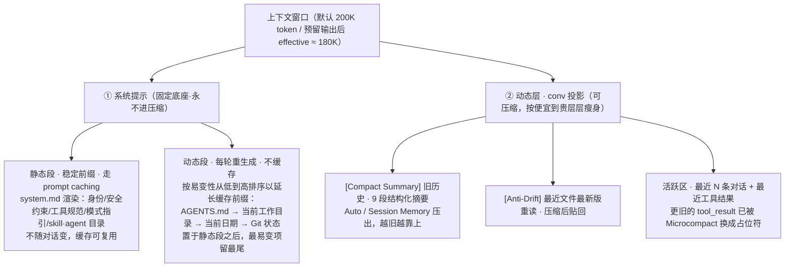
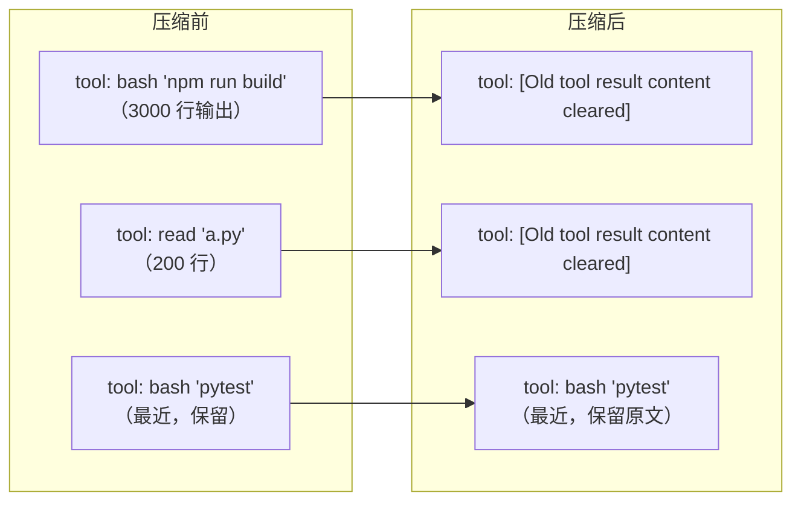
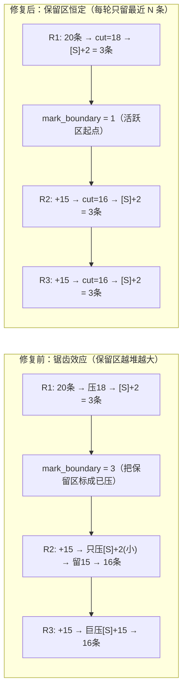
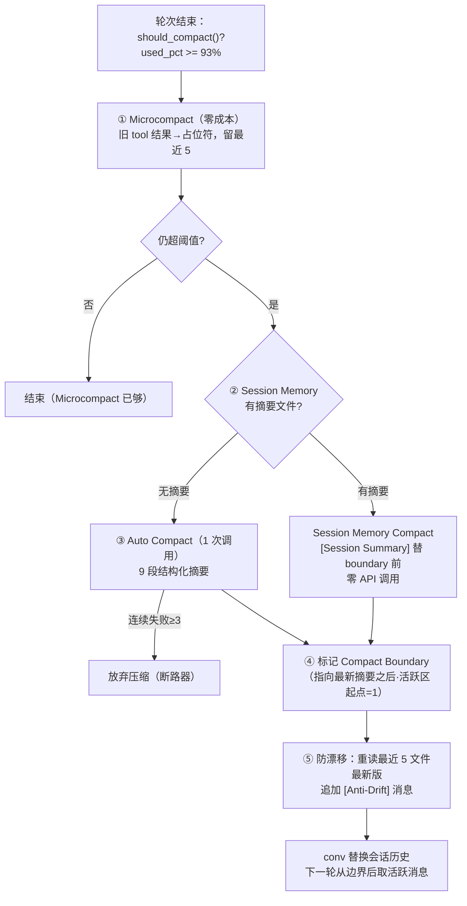

# 聊聊 work-agent 的上下文与记忆体系

> 上下文窗口就那么大，Agent 却越聊越长。怎么让一个"记性有限"的模型，干完一整天的活还不"失忆"？这篇文章用大白话讲清楚：我们为什么这么设计、四道防线怎么层层兜底、一条消息从产生到被压缩经历了什么，以及它和你的会话安全有什么关系。所有细节都对照 `agent/context/` 与 `agent/core/loop.py`、`agent/core/session.py`，放心看。

---

## 一、背景：为什么上下文会"撑爆"

大模型不是无限内存。它每次调用能"看见"的文本量有个硬上限，叫**上下文窗口**（默认 20 万 token）。而 Agent 干活时，上下文是**只增不减**地往里塞：

- 你每说一句话 → 一条 `user` 消息；
- 模型每调一次工具 → 一条 `assistant` 调用 + 一条 `tool` 回执；
- `bash` 跑个构建可能吐几千行、`read` 读个大文件可能上万行……

聊个半小时，窗口就满了。满了之后会发生什么？模型开始"忘记"前面的约定、读错的代码、没改完的文件——这就是**语义漂移**。更糟的是，工具回执（`tool_result`）和调用（`tool_use`）是**配对**的，API 要求它们必须前后紧跟，乱删会直接 400 报错。

所以"怎么在有限窗口里塞下无限对话"是 Agent 的命门。我们定的铁律是：**保存交给不可变的真相，注入交给可派生的投影；压缩只动投影，绝不碰真相。**

---

## 二、核心思路：双轨 + 四层渐进防线

### 2.1 双轨：一份数据，两种角色

「工具结果到底存不存」其实是个**伪二选一**——它既是历史、也进上下文。我们用两条轨道对应：

| 表示 | 角色 | 生命周期 | 压不压缩 |
|---|---|---|---|
| `EventStream`（事件流，`agent/core/events.py`） | 状态单一事实来源；审计 / 回放 / trace / **压缩派生源** | **永久、完整**，原始 `tool_result` 原样留 | **不压缩**（审计真相，不可变） |
| `conv` / `Session.messages`（上下文投影） | 逐轮喂给模型的历史 | 随轮累积、可裁剪 | **可压缩**（所有压缩的作用对象） |

一句话：`EventStream` 是"录像带"，永远完整；`conv` 是"给模型看的剪辑版"，可以压缩。二者不重复存内容，`conv` 从会话状态派生。

### 2.2 四层渐进防线：能不调模型就不调

压缩很贵——调一次 LLM 又要 token 又要延迟。所以防线是**由便宜到贵**渐进的，前面能解决就绝不上模型：

| 层级 | 名称 | 成本 | 做法 |
|---|---|---|---|
| 0 | 输出截断 / 分页读（M1 已有） | 0 | 超长输出截断、大文件分页读，先不让垃圾进窗口 |
| 1 | **Microcompact** | 0 | 把**旧的** `tool_result` 内容换成占位符，留最近 N 个 |
| 2 | **Session Memory Compact** | 0 | 复用后台持续维护的「10 段摘要文件」替代历史 |
| 3 | **Auto Compact** | 1 次调用 | LLM 把旧历史压成 9 段结构化摘要 |
| 4 | 防漂移（Anti-Drift） | 0 | 压缩后重读最近文件最新版，贴回上下文 |

> 设计原则：**98/1.6 法则**——"要不要压缩、压成啥样"是确定性工程，模型只负责"生成摘要文本"这一件事。

### 2.3 一张图看懂上下文窗口里装了什么

把上面两层、四道防线落到"模型实际看到的窗口"上，它从顶到底由 **① 系统提示（固定底座，永不压缩）+ ② conv 投影（可压缩动态层）** 两部分拼成。注意：**系统提示内部又分「静态段」和「动态段」**——只有静态段是走 prompt caching 的稳定前缀，动态段每轮重生成、不缓存。



要点：

- **系统提示是固定底座、永不压缩，但内部分两段**：`静态段`来自 `system.md` 渲染（身份/安全/工具规范/模式/skill·agent 目录），是真正恒定、走 prompt caching 的"稳定前缀"；`动态段`是每轮现算的 **AGENTS.md**、当前工作目录、当前日期、Git 状态，**故意排在稳定前缀之后**——这样即便动态段每轮变，前面的静态段缓存依然命中。所以"整个系统提示都恒定可缓存"是错的：`AGENTS.md` 等其实在动态段里，每轮从磁盘重新注入、不进缓存。
- **动态段内部也按"易变性从低到高"排序**（这是一处优化）：prompt caching 按**连续前缀**命中，所以把最不易变的放最前、最易变的留最尾，前缀就能覆盖更长。顺序为 `AGENTS.md`（仅用户编辑才变）→ 当前工作目录（会话内基本不变）→ 当前日期（当日不变、午夜轮换）→ Git 状态（每次文件改动都变）。这样一来，前缀缓存从"只覆盖静态段"扩展到"静态段 + AGENTS.md + 当前工作目录 +（当日）日期"，长期会话能省下可观 token；只有最易变的 Git 状态单独变动，不会破坏前面更长的前缀。cwd 和 AGENTS.md 本身比日期、Git 状态稳定得多，把它们往前挪让它们重新被纳入缓存。
- **conv 投影在下、会变**：`conv` 从下往上越聊越大，所有压缩都只动这一层——`[Compact Summary]` 是把旧历史"折叠"的结果，活跃区永远是窗口底部最近的那一段。
- **二者边界清晰**：系统提示（无论静态/动态段）永不进摘要、conv 压成摘要后也绝不回写 `EventStream`（真相在录像带里）。这正对应 2.1 的双轨铁律。

---

## 三、第 0 层：先防撑爆（M1 已有）

在完整的压缩层（M4）之前，M1 已经布了三道低成本防线，避免大输出直接灌爆窗口：

1. **输出截断（集中入口）**：`Settings.max_tool_output_chars`（默认 20000），`ToolRegistry.run` 经 `_cap_result` 截断超长输出并附 `[output truncated: N chars, kept first M]`。事件流和回填消息里输出一致被截断。
2. **分页读 + 定位搜**：`read` 支持 `offset/limit` 带行号分页、`grep` 单文件正则带行号返回，形成"grep 定位行号 → read 精确读范围"的闭环，避免一次读整份大文件。
3. **结果不进 assistant 文本**：模型只回 `tool_calls`，结果以 `role="tool"` 注入，不会把整段输出当自己的话重复生成。

---

## 四、第 1 层：Microcompact（零成本，每轮都跑）

这是最常用的一道。它**在每次 API 请求前**执行，纯字符串替换，不调模型：

- 把 `conv` 中**较旧的** `role="tool"` 消息的 `content` 换成占位符 `[Old tool result content cleared]`；
- **保留最近 `keep_recent`（默认 5）个**工具结果不动——否则模型看不到正在改的代码；
- **只改 `content`，保留 `tool_call_id`**，绝不拆散 `tool_use`/`tool_result` 配对（否则 API 400）；
- 只压**大输出类工具**（`bash`/`read`/`grep`/`glob`/`write`/`edit`/`find`）的结果，且 `content` 长度 > 100 才有压缩价值；审批/问答这类小回执原样保留。

```python
# agent/context/compactors/microcompact.py（精简）
PLACEHOLDER = "[Old tool result content cleared]"
COMPACTABLE_TOOLS = ("bash", "read", "grep", "glob", "write", "edit", "find")


async def compact(self, conv, boundary):
    id_to_name = self._build_id_to_name(conv)  # tool_call_id → 工具名
    tool_indices = [
        i
        for i, m in enumerate(conv[:boundary])
        if m.role == "tool" and self._is_compactable(m, id_to_name)
    ]
    replace = set(tool_indices[: len(tool_indices) - self.keep_recent])  # 留最近 N
    for i in replace:
        conv[i] = Message(role="tool", content=PLACEHOLDER, tool_call_id=conv[i].tool_call_id)
    return conv
```

效果一眼就懂：



---

## 五、第 2/3 层：Session Memory 与 Auto Compact

当 Microcompact 之后窗口**还是超了**，才上"重武器"。这里有两把，按"零成本优先"排序。

### 5.1 Session Memory Compact（零成本，复用后台摘要）

后台有个**记忆子 agent**（复用 M5 子代理机制）在闲时增量维护一份会话摘要文件，固定 **10 段结构**（Session Title / Current State / Task / Files / Workflow / Errors / Codebase / Learnings / Key results / Worklog），每段 ≤2K、整份 ≤12K token。

压缩时**直接复用这份摘要**替代旧历史，零 API 调用——比 Auto Compact 省一次 LLM 调用。它有自己的触发阈值（`settings.context`）：

- `session_memory_min_message_tokens = 10000`：首次需达此上下文量才建摘要；
- `session_memory_min_tokens_between = 5000`：两次更新最小 token 增量；
- `session_memory_tool_calls_between = 3`：两次更新最少 tool call 次数。

`compact()` 有摘要就返回 `[Session Summary] + 最近原文`，否则返回 `None` 让 Auto Compact 兜底。

### 5.2 Auto Compact（1 次调用，兜底摘要）

没有现成摘要时，才调 LLM 把**除最近 `recent_keep`（默认 8）条外的全部历史**压成**9 段结构化摘要**（意图/技术概念/文件代码/错误修复/思路/用户消息/待办/当前工作/下一步），第 8、9 段强制原文引用以防漂移。

```python
# agent/context/compactors/auto_compact.py（精简）
async def compact(self, conv, boundary):
    if len(conv) <= self.recent_keep:  # 太短不足以留出 recent_keep 条，原样返回
        return conv
    cut = max(1, len(conv) - self.recent_keep)  # 压缩点恒留最近 recent_keep 条
    history = conv[:cut]
    summary = await self._call_model(COMPACT_USER_TEMPLATE.format(history_text=...))
    return [Message(role="user", content=f"[Compact Summary]\n{summary}")] + conv[cut:]
```

两个细节保命：

- **失败断路器**：`max_failures=3`，连续 3 次模型调用失败就放弃压缩，绝不无限重试烧 token；
- **压缩点恒定（消除锯齿）**：`cut = max(1, len(conv) - recent_keep)`，每轮永远只留最近 `recent_keep` 条原文，**与传入 `boundary` 无关**——`boundary` 现在只用于日志/越界提示。这样多轮压缩保留区恒定、压缩量稳定，不会再出现"压一点留一大片、下一轮又巨压"的锯齿（详见 5.3）。

### 5.3 为什么压缩点要"恒留最近 N 条"：锯齿效应

早一版实现里，`mark_boundary` 把 `compact_boundary` 设成了 `len(conv)`——等于把**本轮刚保留的活跃区也标进了"已压边界之前"**。下一轮 `AutoCompact` 收到这个巨大 `boundary`，只压掉很小的 `[Summary] + 上一轮保留区`，却把本轮新增全部留作巨大保留区；再下一轮保留区早已爆满，又触发一次**巨量压缩**。窗口占用像锯齿一样忽小忽大、压缩量极不均匀。

修复后，压缩点恒为 `cut = max(1, len(conv) - recent_keep)`，**每轮只留最近 `recent_keep` 条**；`mark_boundary` 改为指向"最新摘要之后"（活跃区起点 = 1）。这样保留区恒定、压缩量平稳。

下面用 `recent_keep = 2` 的例子看三轮变化（每轮新增 15 条对话）：

| 轮次 | 修复前（锯齿） | 修复后（恒定） |
|---|---|---|
| R1（20 条起） | 压 18 条 → `[S]+2` = 3 条（正常） | 压 18 条 → `[S]+2` = 3 条（正常） |
| R2（再 +15） | 只压 ~2 条 → 保留区暴涨成 16 条（保留区过大） | 压 16 条 → `[S]+2` = 3 条（恒定） |
| R3（再 +15） | 巨压 ~16 条 → 仍 16 条（巨压） | 压 16 条 → `[S]+2` = 3 条（恒定） |
| R4（再 +15） | 又只压 ~2 条 → 继续膨胀（继续膨胀） | 压 16 条 → `[S]+2` = 3 条（恒定） |



一句话：**旧实现把"保留区"误当"已压区"，导致下一轮没东西可压、只能攒着；新实现每轮都按固定窗口"裁剪"活跃区，压缩量平滑、窗口占用稳定。**

---

## 六、完整压缩流程：一道决策链

把上面几层串起来，就是 `ContextManager.compact()` 的真实决策流（每次会话轮次结束后、且 `should_compact()` 为真时触发）：



而 Microcompact 更早——它在**每轮 `_decide` 之前**就跑，作用于本轮的 `conv` 投影，绝不碰 `EventStream`。

```mermaid
sequenceDiagram
    participant Loop as AgentLoop.run
    participant CM as ContextManager
    participant LLM as 模型
    Loop->>CM: set_conv(conv) + apply_microcompact()
    CM-->>Loop: 清旧 tool 结果后的 conv
    Loop->>LLM: 带压缩后 conv 调 act()
    LLM-->>Loop: Decision（工具调用）
    Loop->>Loop: 执行工具，track_file_access(最近文件)
    Loop->>CM: 轮次结束 set_conv + should_compact()?
    alt 超阈值
        CM->>CM: compact()（SM→Auto→防漂移）
        CM-->>Loop: 压缩后 conv → self.messages
    end
```

---

## 七、计量、触发与固定底座

### 7.1 怎么算"满了"

`ContextManager` 估算当前占用分类（system 静态段 / 动态段 / tools / 对话历史），公式：

```
effective_window = context_window − min(max_output_tokens, 20000)   # 给输出留预算，默认 180000
compact_threshold = effective_window − compact_buffer               # 默认 −13000 → 167000
should_compact() = used_pct >= 93%                                  # ≈ 阈值处触发
```

Token 估算零依赖（`_estimate_tokens`）：**CJK 按 1 token/字，其余按 ~4 字符/token**。真实用量由 `report_usage` 校准。

### 7.2 固定底座：永不进摘要

`AGENTS.md`、自动记忆、技能体这些"长期稳定"的内容，**从磁盘重新注入**，永远不进压缩摘要——这是对抗长期衰减的关键。压缩只处理"会过期的对话历史"。

### 7.3 防漂移：压缩后重读最近文件

压缩把旧历史砍了，但模型可能正在改某文件。所以压缩后会从 `recent_files`（loop 记录 `read`/`write`/`edit` 的路径，去重取前 5 个、每个 ≤10000 字符）重读最新版，追加一条 `[Anti-Drift]` 消息，确保模型不"忘记"手头的工作。

---

## 八、怎么用：配置与命令

相关配置都在 `settings.context`（默认全开）：

| 配置项 | 默认 | 含义 |
|---|---|---|
| `context_window` | 200000 | 上下文窗口上限 |
| `max_output_tokens` | 20000 | 单次输出预算（从窗口里预留） |
| `compact_buffer` | 13000 | 触发压缩前的余量 |
| `microcompact_enabled` / `keep_recent` | `True` / 5 | 零成本占位替换，保留最近 N 个 |
| `auto_compact_enabled` | `True` | 1 次调用兜底摘要 |
| `session_memory_enabled` | `True` | 后台摘要零成本复用 |

会话内可直接手动触发（见 `agent/core/session_command.py`）：

- `/context` —— 打印上下文占用明细（系统段 / 对话历史 / 剩余 / 使用率 / 上次压缩前后 token）；
- `/compact` —— 立即执行一次完整压缩（Microcompact → Session Memory → Auto Compact → 防漂移）。

终端状态栏还会实时显示 `ctx: 87%`（>90% 红、>70% 黄、否则绿），让你随时知道离"满"还有多远。

---

## 九、好处小结

| 好处 | 怎么来的 |
|---|---|
| **不丢真相** | `EventStream` 永久全量、只读；压缩只动 `conv` 投影，审计/回放永不损坏 |
| **零成本优先** | Microcompact + Session Memory 都是 0 API 调用，绝大多数情况不惊动模型 |
| **贵操作兜底** | 真超了才 Auto Compact（1 次调用），还有失败断路器防烧钱 |
| **不破配对** | 压缩始终把 `tool_use`/`tool_result` 当单元处理，绝不触发 API 400 |
| **抗漂移** | 压缩后重读最近文件 + 固定底座从磁盘重注入，模型不"忘记"手头活 |
| **可观测** | `/context` 明细、`/compact` 手动触发、状态栏占比、压缩 span 挂 Session 根 span |

---

## 十、小结

一句话收尾：

> **上下文稀缺，所以把"真相"和"视图"分开：事件流当录像带永不改，conv 当剪辑版随便压；压缩由便宜到贵层层兜底，能不调模型就不调，且永远不拆散工具配对、不碰审计真相。模型可以"记不清"，但录像带不会丢、手头的文件不会忘。**

下次你看到 `ctx: 87%` 飘红，或者某条 `tool` 结果变成了 `[Old tool result content cleared]`，就知道：不是模型偷懒，是它的"剪辑版"正在自动瘦身，真正的完整记录还在 `EventStream` 里好好躺着。

---

*想看代码？入口在这里：*
- *管理器：`agent/context/manager.py`（`ContextManager` / `estimate_usage` / `should_compact` / `compact` / `_anti_drift`）*
- *四层压缩器：`agent/context/compactors/`（`microcompact.py` / `session_memory.py` / `auto_compact.py`）*
- *Token 估算：`agent/context/tokens.py`（`_estimate_tokens`）*
- *集成点：`agent/core/loop.py`（`run` 前 `apply_microcompact`）、`agent/core/session.py`（轮次后 `should_compact`→`compact`）、`agent/core/session_command.py`（`/context` `/compact`）*
- *配置：`agent/config/settings.py`（`ContextConfig`）*
- *设计依据：`knowledge/context-management.md`、`knowledge/claude-code-context-management.md`*
