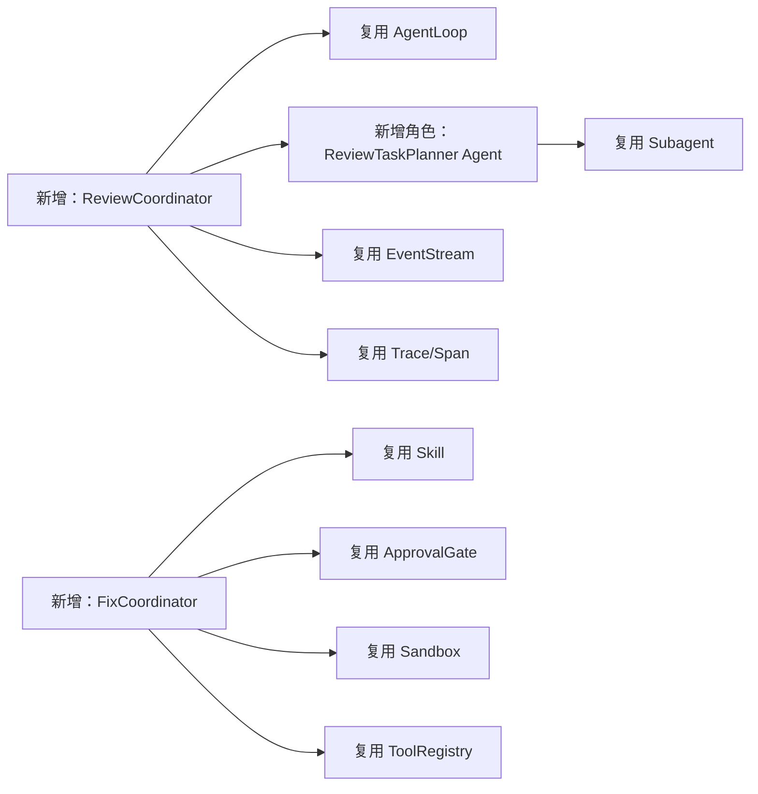

# 增量代码审查与受控修复：通俗版设计

> 这是一份面向开发者的简明设计说明。  
> 完整细节见《增量代码审查与受控修复系统设计》。

---

## 1. 我们到底要做什么

假设你刚改完一批代码，还没有提交。

现在你想让 Agent 帮你检查，但有三个要求：

1. 只检查这次修改，不翻旧账；
2. 找到的问题必须能定位到具体新增行；
3. 没有你的同意，Agent 不能修改代码。

所以，这个功能可以概括成一句话：

> 先看 Git Diff，再找问题；先让用户确认，再动代码。

完整流程如下：

```text
Git Diff
   ↓
并行审查
   ↓
复核问题
   ↓
展示报告
   ↓
用户确认
   ↓
生成修复计划
   ↓
用户批准
   ↓
修改并测试
```

看起来步骤很多，但大部分基础设施项目里已经有了。我们真正要新增的代码并不多。

---

## 2. 哪些东西已经有了

work-agent 目前已经具备：

- AgentLoop：负责“模型思考 → 调工具 → 看结果 → 继续”；
- Subagent：可以并行启动多个独立 Agent；
- Skill：可以按需加载修复说明；
- ToolRegistry：统一管理 read、edit、bash 和 MCP 工具；
- ApprovalGate：危险操作前询问用户；
- Sandbox：限制命令的文件和网络权限；
- EventStream：记录一次任务发生了什么；
- Trace/Span：记录调用链、耗时和 Token；
- ContextManager：折叠旧工具输出、维护摘要、自动压缩；
- MCP：连接外部知识库或工具服务；
- CircuitBreaker：下游连续失败时自动熔断。

因此，不需要再造一套新的 Agent 框架。

我们只需要把这些积木按“代码审查”这个业务重新组合起来。



---

## 3. 第一步：先把 Git Diff 看明白

### 3.1 为什么不能直接把整个仓库交给模型

如果把整个仓库交给模型，它很容易发现一个真实问题，但那个问题可能已经存在两年了。

这种问题对“本次代码审查”没有帮助，反而会产生误报。

所以，审查开始时先运行 Git Diff，得到：

- 哪些文件变了；
- 每个文件增加了哪些行；
- 每个修改块的上下文；
- 当前 diff 的唯一 hash。

例如：

```diff
 def divide(a, b):
-    return 0 if b == 0 else a / b
+    return a / b
```

系统会记住：新文件中的第 2 行是新增行。

如果 Agent 报告“第 20 行变量名不好看”，因为第 20 行不在新增行集合里，系统直接丢弃。

注意，这一步不是让模型判断，而是普通 Python 代码判断。

### 3.2 DiffSnapshot

一次审查使用一份固定快照：

```python
class DiffSnapshot:
    snapshot_id: str
    base_sha: str
    diff_hash: str
    changed_files: list[ChangedFile]
```

为什么要有 `diff_hash`？

因为审查完成后，用户可能又改了代码。此时原来的行号和证据可能已经过期。

开始修复前重新计算 hash：

- 一样：可以继续；
- 不一样：标记为过期，重新审查。

这样可以避免 Agent 根据旧代码修改新文件。

---

## 4. 第二步：先让 Planner Agent 分任务

拿到 DiffSnapshot 后，不要立刻把同一份 diff 同时扔给四个审查 Agent。

先启动一个只读的 `ReviewTaskPlanner Agent`，让它理解本次改动应该怎样分工。

例如，本次同时修改了：

```text
agent/api.py
agent/service.py
tests/test_service.py
README.md
```

固定的“每个文件一个任务”会把 `api.py` 和调用它的 `service.py` 拆开，不利于检查接口兼容性。

Planner Agent 可以先读 diff、import 和必要的符号定义，然后发现：

```text
任务组 A：api.py + service.py
原因：接口定义和调用方必须一起检查

任务组 B：service.py + test_service.py
原因：实现和测试应该一起检查逻辑缺陷

任务组 C：README.md
原因：只需要检查接口说明是否同步
```

这类分组需要理解代码语义，让 Agent 来做比硬编码目录规则更合适。

### 4.1 Planner Agent 的输入

`ReviewCoordinator` 启动现有 `SubagentSpawner`，使用一个新的内建 AgentSpec：

```text
name: review-task-planner
permission_mode: plan
tools: read, grep, glob, find
```

它收到：

- DiffSnapshot 摘要；
- 变更文件和 hunk；
- 系统计算出的新增行集合；
- 已启用的审查维度；
- 单任务 Token 上限；
- 单任务最大文件数；
- 项目目录和 AGENTS.md 中的关键约定。

Planner 可以使用只读工具补充查看 import、类型定义和直接调用关系，但不能修改文件，也不能调用写型 MCP。

### 4.2 Planner Agent 输出什么

Planner 不直接启动审查，而是输出 `ReviewTaskDraft[]`：

```json
[
  {
    "category": "compatibility",
    "files": ["agent/api.py", "agent/service.py"],
    "focus": "检查 api.py 的接口变化是否破坏 service.py 的现有调用",
    "context_requests": [
      "api.py 中被修改的公开函数",
      "service.py 中该函数的直接调用位置"
    ],
    "reason": "接口定义与调用方属于同一变更链路"
  },
  {
    "category": "correctness",
    "files": ["agent/service.py", "tests/test_service.py"],
    "focus": "检查新增分支的边界情况和测试覆盖",
    "context_requests": [],
    "reason": "实现和对应测试应放在同一个任务中"
  }
]
```

Planner 可以决定：

- 哪些文件应该一起检查；
- 每组重点检查哪个维度；
- 还需要读取哪些最小上下文；
- 为什么这样分组。

Planner 不可以决定：

- 哪些行属于新增行；
- 是否允许读取工作区外文件；
- 是否允许修改文件；
- 最终 task ID；
- 实际 Token 是否超过上限；
- Finding 是否可以进入报告。

### 4.3 Agent 生成的任务仍要校验

Planner 是模型，可能漏文件、重复分组、返回坏 JSON，或者一次塞进太多文件。

因此它输出的是 `ReviewTaskDraft`，不是最终 `ReviewTask`。

普通 Python 代码实现的 `ReviewTaskValidator` 接着检查：

```text
Planner 输出 ReviewTaskDraft[]
              ↓
          JSON Schema
              ↓
文件是否都属于 DiffSnapshot
              ↓
category 是否在启用列表
              ↓
补齐遗漏文件和必要审查维度
              ↓
按真实 Token 估算再次拆分
              ↓
生成稳定 task_id
              ↓
最终 ReviewTask[]
```

最终任务大致如下：

```json
{
  "task_id": "task_7f21a4c9",
  "snapshot_id": "snapshot_abc",
  "category": "compatibility",
  "files": ["agent/api.py", "agent/service.py"],
  "changed_lines": {
    "agent/api.py": [[42, 48]],
    "agent/service.py": [[81, 86]]
  },
  "focus": "检查接口变化是否破坏现有调用",
  "diff_excerpt": "...",
  "context": ["..."],
  "token_budget": 30000,
  "output_schema_version": "1"
}
```

其中：

- `changed_lines` 从 DiffSnapshot 复制，绝不使用 Planner 提供的行号；
- `task_id` 由 snapshot、category、文件集合和 Schema 版本计算；
- `token_budget` 由系统重新估算，超出就继续拆分；
- Planner 漏掉的变更文件由 Validator 按默认规则补上。

### 4.4 Planner 失败怎么办

Planner 失败不能导致代码审查完全不可用。

如果它超时、输出无法修复的 JSON，或者连续产生非法任务，系统退回简单规则：

```text
按文件和 Token 上限分批
×
所有已启用审查维度
```

这种分法不够聪明，但范围正确、安全，而且一定可以运行。

所以完整关系是：

> Planner Agent 负责聪明地拆分，TaskValidator 负责保证拆分正确，Fallback 负责保证任务可运行。

### 4.5 再让专项 Agent 分头检查

我们准备四个只读 Subagent：

| Agent | 主要检查什么 |
|---|---|
| security | 注入、越权、路径逃逸、敏感信息 |
| correctness | 空值、边界、状态错误、异常处理 |
| performance | 重复查询、无界循环、阻塞调用、内存问题 |
| compatibility | API、配置、协议、旧数据是否兼容 |

它们使用现有 `SubagentSpawner`，不需要实现新的 Agent 运行时。

区别只是：

- 使用不同的 system prompt；
- 只允许 read、grep、find 等只读工具；
- 输入只包含本次 diff 和必要上下文；
- 输出统一的 Finding JSON。

Validator 生成最终 ReviewTask 后，Coordinator 按任务的 category 选择对应 Agent，并行运行：

```python
results = await asyncio.gather(
    *(
        run_specialist(task.category, task)
        for task in review_tasks
    ),
    return_exceptions=True,
)
```

某个 Agent 超时，不应拖垮其他 Agent。

最终报告可以注明：“性能审查失败，本次报告覆盖不完整。”

### 为什么不让一个 Agent 全部检查

因为一个提示词同时考虑所有事情，通常会顾此失彼。

拆成四个 Agent 后：

- 每个 Agent 的目标更明确；
- 可以并行执行；
- 可以单独调整模型和预算；
- 哪个环节效果不好，也更容易定位。

---

## 5. 第三步：Finding 必须是统一格式

Agent 不能只返回一段散文，例如：

> 这里似乎可能有点问题，建议关注一下。

这种输出既不能自动过滤，也很难生成行级评论。

我们要求它返回结构化数据：

```json
{
  "category": "correctness",
  "severity": "high",
  "path": "agent/example.py",
  "start_line": 42,
  "end_line": 42,
  "title": "除数为零时会抛出异常",
  "evidence": {
    "failure_scenario": "当 b=0 时执行 a/b",
    "introduced_by_change": "本次修改删除了原有的 b==0 保护"
  },
  "recommendation": "恢复显式检查或定义异常行为",
  "confidence": 0.96
}
```

项目使用 Pydantic 定义 `Finding`，并导出 JSON Schema。

模型返回的数据必须通过 Schema 校验。缺字段、行号错误或 JSON 损坏，都不能直接展示给用户。

这里仍然复用现有 Model，只增加一个很薄的 `StructuredOutputAdapter`：

```text
模型输出
   ↓
提取 JSON
   ↓
Pydantic 校验
   ↓
FindingCandidate
```

---

## 6. 第四步：再找一个 Agent 复核

专项 Agent 的任务是尽量发现问题，所以它们可能想得太多。

Verifier 的任务正好相反：没有充分证据，就不要报告。

Verifier 逐项检查：

1. 这真的是 bug，还是编码风格？
2. 这个问题是本次修改引入的吗？
3. 问题位置是否确实在新增行？
4. 周围代码是不是已经做了保护？
5. 描述的失败场景真的能发生吗？

但是，在调用 Verifier 之前，先执行普通代码过滤：

```python
if finding.path not in snapshot.changed_files:
    reject(finding)

if not changed_lines.intersects(
    finding.path,
    finding.start_line,
    finding.end_line,
):
    reject(finding)
```

为什么先过滤再调用模型？

因为能用十行 Python 判断的事情，就没有必要花一次模型调用。

最终只有 `verified` 的问题进入报告。

---

## 7. 第五步：用户确认后才能修复

审查和修复是两件不同的事。

审查只读，风险很低；修复会修改文件，必须单独授权。

正确流程是：

```text
Finding 已复核
   ↓
用户选择要修的问题
   ↓
review-fix Skill 生成计划
   ↓
用户查看并批准计划
   ↓
FixCoordinator 才开放有限写权限
```

这里有两次用户决定：

1. “这个问题我要修”；
2. “这个修复计划可以执行”。

不能把两次决定合并成一次。

### 7.1 Skill 做什么

`review-fix` Skill 只负责教模型如何生成一个好计划：

- 要改哪些文件；
- 每个文件改什么；
- 为什么这是最小修改；
- 应该运行哪些测试。

Skill 不负责批准，也不负责授予权限。

### 7.2 FixCoordinator 做什么

`FixCoordinator` 是普通 Python 状态机：

```text
confirmed
→ plan_proposed
→ plan_approved
→ fixing
→ validating
→ fixed / failed
```

任何非法跳转都拒绝。

例如，没有 `plan_approved`，就不能进入 `fixing`。

---

## 8. 写权限到底怎么限制

“用户批准修复”不等于“Agent 可以修改整个仓库”。

假设 Finding 位于：

```text
agent/review/parser.py
```

那么默认只允许修改这个文件。

如果计划还要修改测试文件，测试文件必须明确列入计划和授权范围。

可以把权限理解成一张临时门票：

```python
class CapabilityScope:
    allowed_edit_paths: list[str]
    allowed_create_paths: list[str]
    allowed_commands: list[str]
    expires_at: datetime
```

修复 Agent 不使用普通 `edit/write`，而使用带范围检查的：

- `scoped_edit`
- `scoped_create`

工具每次修改前都检查：

- 路径是否在仓库内；
- 路径是否在批准列表中；
- 文件是否在审批后被别人修改；
- 当前能力是否过期。

验证命令也要受限。

普通 bash 不应该成为绕过 `scoped_edit` 的后门。测试运行时，源码目录尽量只读，只给临时目录和构建目录写权限。

执行完成后销毁临时权限，恢复只读模式。

---

## 9. 修完以后怎么证明真的好了

“代码已经修改”不等于“问题已经修复”。

修复后依次做四件事：

1. 检查实际修改文件有没有超出批准范围；
2. 运行和 Finding 最相关的测试；
3. 按项目配置运行 lint 或类型检查；
4. 让 Verifier 再检查一次原问题。

只有全部通过，状态才是 `fixed`。

如果测试失败：

- 保留当前 patch；
- 展示失败日志；
- 状态标记为 `failed`；
- 不自动回滚用户原来的修改；
- 不声称已经修复成功。

---

## 10. 项目知识库先做成可选增强

代码审查经常需要知道项目自己的规定，例如：

- API 必须返回哪种错误格式；
- 配置字段能不能删除；
- 以前类似功能是怎么实现的。

这些信息可以通过一个 `project-knowledge` MCP Server 提供。

```text
审查问题
  ├─ Milvus：按语义找相似内容
  └─ BM25：按关键词找精确内容
          ↓
       合并结果
          ↓
       Rerank 精排
          ↓
       返回少量证据
```

仍然复用项目现有 MCP 接入，不给 AgentLoop 增加知识库专用分支。

第一版提供四个工具就够了：

- `knowledge_search`
- `knowledge_get`
- `knowledge_status`
- `knowledge_reindex`

其中前三个只读，`knowledge_reindex` 需要审批。

Milvus 或 Reranker 挂了怎么办？

降级到 BM25；BM25 也不可用，就退回 grep/read。知识库是增强项，不能让核心审查完全不可用。

因此，建议在核心审查跑通后再实现知识库，不把它塞进第一版 MVP。

---

## 11. 长任务稳定性也尽量复用现有代码

### 11.1 工具出错

现有 AgentLoop 已经会把工具异常变成 `ToolResult(ok=False)`，这个方向是对的。

只需要给错误增加几个字段：

```json
{
  "code": "TIMEOUT",
  "retryable": true,
  "suggested_action": "缩小读取范围后重试"
}
```

模型看到这个观察后，可以换一种做法，而不是让整个任务崩溃。

### 11.2 重复调用

现有代码能发现完全相同的工具调用。

再增加一层简单的规范化即可，例如把：

```text
./agent/a.py
agent/a.py
```

视为同一个路径。

如果模型连续读取相同内容、得到相同错误、又没有新增 Finding，就认为任务没有进展。

第一次提醒模型换方法，多次重复后停止当前 Subagent。

### 11.3 上下文太长

继续使用现有 ContextManager：

```text
旧工具结果折叠
→ Finding 摘要
→ Session Memory
→ Auto Compact
```

新增的只是“Finding 摘要”：已经复核和已经拒绝的问题只保留结构化简表，不在每一轮重复发送完整描述。

60% Token 降幅不能靠感觉判断。要准备固定的大型 diff，用模型返回的真实 usage 做优化前后对比。

### 11.4 限流和熔断

现有熔断器已经是 CLOSED、OPEN、HALF_OPEN 三态，可以直接复用。

现有限流器只在单个进程内有效。如果以后运行多个 daemon，再增加 Redis ZSET + Lua 版本：

- ZSET 负责排队；
- Lua 保证“入队、检查名额、发放资格”是原子的；
- Redis 不可用时，单机环境退回现有限流器。

因此，Redis 也不是第一版 MVP 的前置条件。

---

## 12. 最少需要新增哪些模块

第一版可以控制在下面这些模块内：

```text
agent/review/
  models.py          # Diff、Finding、ReviewReport
  diff.py            # Git Diff 解析和新增行索引
  planner.py         # ReviewTaskPlanner Agent、Schema 和失败回退
  coordinator.py     # 校验任务并并行启动专项 Agent
  output.py          # JSON Schema 校验
  verifier.py        # 问题复核
  fix.py             # 用户确认、计划、审批、修复状态机
  scope.py           # 文件级临时权限
  store.py           # 审查结果持久化

agent/skills/builtin/review-fix/SKILL.md
```

后续增强再增加：

```text
agent/mcp/project_knowledge_server/   # Milvus + BM25 + Rerank
agent/resilience/redis_rate_limiter.py
agent/resilience/semantic_stall.py
```

不需要新建第二套：

- Agent 循环；
- 工具注册表；
- 事件系统；
- Trace 系统；
- MCP 客户端；
- 沙箱执行器；
- 上下文管理器。

---

## 13. 推荐开发顺序

### 第一阶段：只读审查 MVP

实现：

1. DiffSnapshot；
2. 新增行索引；
3. ReviewTaskPlanner Agent 和 ReviewTaskValidator；
4. Planner 失败时的简单分批回退；
5. 四个专项 Agent；
6. Finding Schema；
7. Verifier；
8. CLI 输出报告。

完成后，系统已经能回答：

> 这次改动引入了哪些证据充分的问题？

### 第二阶段：受控修复

实现：

1. 用户确认 Finding；
2. review-fix Skill；
3. FixCoordinator 状态机；
4. scoped_edit/scoped_create；
5. 测试和重新复核。

完成后，形成完整闭环。

### 第三阶段：知识和稳定性增强

实现：

1. Project Knowledge MCP；
2. Milvus + BM25 + Rerank；
3. Redis 排队限流；
4. 语义停滞检测；
5. Token 基准优化。

这些增强可以后做，不阻塞前两个阶段。

---

## 14. 怎么判断第一版做完了

第一版满足下面几条，就可以认为可用了：

- 只读取本次 Git Diff；
- ReviewTask 由 Planner Agent 生成并通过确定性校验；
- Planner 失败时可以回退到简单分批；
- 最终问题全部落在新增行；
- 四类审查可以并行运行；
- 坏 JSON 和单个 Agent 失败不会拖垮整个任务；
- 没有通过 Verifier 的问题不展示；
- 用户没有确认时不能修复；
- 修复计划没有批准时不能写文件；
- 修复只能修改批准的文件；
- 修复后自动运行测试并重新复核；
- 全过程能从 EventStream 和 Trace 中追溯。

最后记住最重要的一条：

> 模型负责提出建议，程序负责守住边界。

只要这条不变，系统就不会因为增加了几个 Agent 而变成一个难以控制的新框架。
