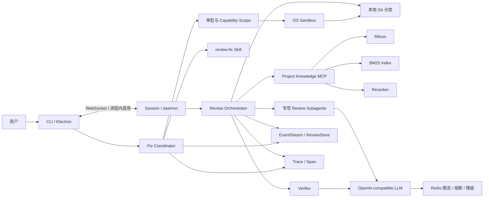
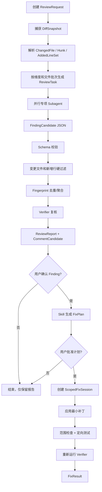
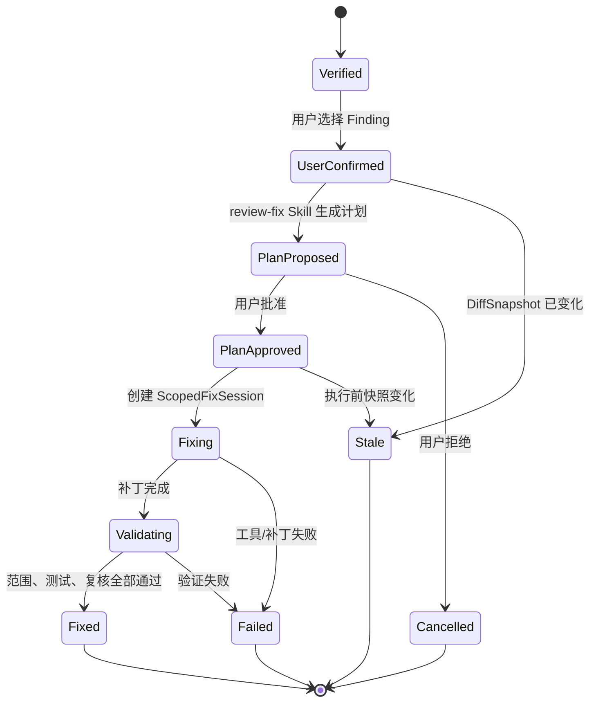
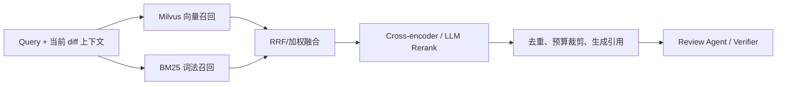
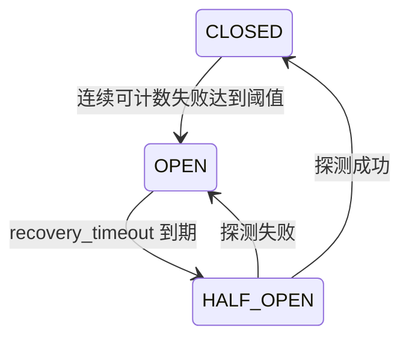

# work-agent 增量代码审查与受控修复系统设计

> 状态：设计提案  
> 日期：2026-08-25  
> 适用项目：work-agent 1.1.x 及后续版本  
> 目标里程碑：M12「增量代码审查与受控修复」

---

## 1. 文档目的

本文给出 work-agent 面向本地 Git 仓库的增量代码审查与缺陷修复能力的整体设计，覆盖：

- Git Diff 快照、解析与新增行索引；
- 安全、逻辑缺陷、性能、接口兼容四类 Subagent 并行审查；
- Finding 的 JSON Schema、确定性过滤与 Verifier 复核；
- 用户确认、Skill 生成计划、审批、最小权限修复和自动验证；
- 通过 MCP 接入项目知识库，并以 Milvus、BM25、Rerank 构建混合检索；
- Trace/Span、事件持久化、长任务上下文压缩；
- Redis ZSET + Lua 排队限流和三态熔断降级。

本文是系统级设计，不代表相关模块已经实现。文中的接口可以在实施阶段做小幅调整，但安全不变量、领域边界和验收指标不得弱化。

---

## 2. 背景与现状

### 2.1 已有基础能力

work-agent 已具备以下可复用底座：

| 现有能力 | 代码位置 | 本设计中的用途 |
|---|---|---|
| ReAct 循环、并发工具执行、异常回填、重复调用检测 | `agent/core/loop.py` | 运行专项审查与修复 Agent |
| EventStream 状态单一事实来源 | `agent/core/events.py` | 审查、Finding、审批、修复事件的实时传输与回放 |
| Subagent 独立上下文、工具白名单、权限映射 | `agent/subagent.py` | 并行专项审查和 Verifier |
| ToolRegistry、ToolRisk | `agent/runtime/registry.py` | 审查/修复工具能力划分 |
| ApprovalGate、临时提权 | `agent/runtime/approval.py` | 修复计划和危险动作审批 |
| 本地/Docker/外部沙箱 | `agent/runtime/sandbox.py` | 只读审查、隔离验证、单次提权 |
| Microcompact、Session Memory、Auto Compact | `agent/context/` | 长审查任务的多级上下文压缩 |
| Trace/Span 和 SQLite 持久化 | `agent/obs/` | 审查与修复决策链追溯 |
| 内存限流、三态熔断、Fallback Pipeline | `agent/resilience/` | 分布式韧性层的兼容基础 |
| MCP stdio 发现、调用和延迟加载 | `agent/mcp/` | 项目知识库接入 |
| daemon + WebSocket + CLI/Electron | `agent/daemon/`、`desktop/` | 审查进度、Finding、审批和修复结果展示 |

### 2.2 主要缺口

现有通用 Agent 尚缺少以下领域能力：

1. 没有稳定的 Git Diff 领域模型和 post-image 新增行索引。
2. Subagent 返回自由文本，缺少 Finding Schema 和结构化修复机制。
3. 没有强制的“变更行过滤器”和独立 Verifier。
4. 审批以单次工具调用为中心，缺少“Finding 确认 → 修复计划 → 计划审批 → 受限执行”的工作流状态机。
5. 文件工具只有工作区边界，缺少按本次修复文件集合收紧的能力边界。
6. 当前 RateLimiter 是进程内滑动窗口，不支持 daemon 多实例共享排队。
7. 三态熔断已存在，但尚未覆盖知识检索、Reranker、MCP 等新增故障域。
8. 多级压缩已经落地，但“单轮平均 Token 降低 60%”尚无固定基准和自动化门禁。

---

## 3. 目标、非目标与设计原则

### 3.1 系统目标

1. 只审查本次 Git 变更，最终 Finding 必须可定位、可复核。
2. 并行执行专项审查，同时保持结果确定性、可合并和可追溯。
3. 过滤历史遗留问题、风格偏好和证据不足的推测。
4. 只有用户明确确认的问题才允许进入修复阶段。
5. 修复计划必须先展示并审批；审批只授予最小范围、最短时间的能力。
6. 修复后自动执行范围检查、定向验证和问题复核。
7. 长任务能在模型、工具、知识库异常时继续推进或明确降级。
8. 在固定基准上，使单轮平均 Token 消耗相对无优化基线降低至少 60%，且审查质量不显著退化。

### 3.2 非目标

- 不做全仓静态扫描器，不主动报告与本次改动无关的历史问题。
- 不替代 SAST、依赖漏洞扫描、编译器和测试框架；这些能力以工具或证据源接入。
- 第一阶段不直接发布 GitHub/GitLab 行级评论，只生成平台无关的 `CommentCandidate`。
- 不允许 Agent 自动 commit、push、创建 PR 或发布制品，除非未来增加独立且显式的审批流程。
- 不以 prompt 作为安全边界；所有关键约束必须由确定性代码、审批和 OS 沙箱执行。

### 3.3 核心原则

- **Diff 是审查边界**：模型不能扩大最终 Finding 的定位范围。
- **事实与判断分离**：Git 行号、权限、状态转换由代码决定；缺陷判断由模型提出并由 Verifier 复核。
- **先过滤、后复核**：低成本确定性过滤早于高成本模型复核。
- **读写分离**：审查阶段永远只读；修复阶段使用独立会话和能力集。
- **审批是能力令牌**：批准某个 Finding 的修复，不等于批准任意文件修改或任意命令。
- **失败即观察**：可恢复异常统一回填为结构化观察，允许模型修正；不可恢复异常明确终止相应分支。
- **事件与 Trace 双主线**：EventStream 表示可恢复业务状态，Trace/Span 表示执行和决策链路。

---

## 4. 总体架构

### 4.1 系统上下文



### 4.2 容器与职责

| 容器 | 职责 | 是否持久化 | 权限 |
|---|---|---:|---|
| Review API/Coordinator | 创建快照、拆分任务、汇总结果、驱动状态机 | ReviewStore | 只读 |
| Review Subagent | 按专项发现候选问题 | 独立 EventStream，可选落盘 | 只读工具白名单 |
| Verifier | 复核因果、证据、定位和风险级别 | Finding 复核结果 | 只读 |
| Fix Coordinator | 用户确认、计划、审批、执行和验证 | ReviewStore + EventStream | 状态决定 |
| Scoped Fix Agent | 对批准 Finding 生成最小补丁 | 修改工作区 | 文件级能力范围 |
| Project Knowledge MCP | 索引、混合检索、返回可引用证据 | Milvus + BM25 元数据 | 默认只读，重建索引单独审批 |
| Resilience Backend | 分布式排队限流、熔断和降级 | Redis，可本地降级 | 无代码仓库写权限 |
| Obs/Store | Trace、Span、事件、审查运行和 Finding | SQLite / 外部观测平台 | 仅写 `.agent/` |

### 4.3 端到端数据流



---

## 5. 领域模型

领域模型使用 Pydantic 定义，并由同一模型导出 JSON Schema。Python、daemon 协议和 TypeScript 类型必须通过契约测试保持一致。

### 5.1 Diff 模型

```python
class ReviewTarget(BaseModel):
    mode: Literal["working_tree", "commit_range", "merge_base"]
    base_ref: str | None
    head_ref: str | None
    include_untracked: bool = True

class DiffSnapshot(BaseModel):
    snapshot_id: str
    repository_id: str
    repository_root: str
    base_sha: str
    head_sha: str | None
    diff_hash: str
    created_at: datetime
    dirty: bool
    files: list[ChangedFile]

class ChangedFile(BaseModel):
    old_path: str | None
    new_path: str
    status: Literal["added", "modified", "deleted", "renamed", "copied", "binary", "submodule"]
    old_blob: str | None
    new_blob: str | None
    hunks: list[DiffHunk]
    added_lines: list[LineRange]

class DiffHunk(BaseModel):
    old_start: int
    old_count: int
    new_start: int
    new_count: int
    lines: list[DiffLine]
```

`DiffSnapshot` 在一次审查内不可变。修复前重新计算 `diff_hash` 和相关文件哈希，不一致则把审查标记为 `stale`。

### 5.2 Finding 模型

```python
class FindingCandidate(BaseModel):
    category: Literal["security", "correctness", "performance", "compatibility"]
    severity: Literal["critical", "high", "medium", "low"]
    path: str
    start_line: int
    end_line: int
    title: str
    description: str
    evidence: Evidence
    recommendation: str
    confidence: float

class Evidence(BaseModel):
    changed_code: str
    failure_scenario: str
    introduced_by_change: str
    supporting_locations: list[CodeLocation] = []
    knowledge_refs: list[KnowledgeRef] = []

class Finding(FindingCandidate):
    finding_id: str
    fingerprint: str
    snapshot_id: str
    changed_lines: list[int]
    sources: list[FindingSource]
    verifier: VerifierDecision

class VerifierDecision(BaseModel):
    status: Literal["verified", "rejected", "needs_context"]
    reason: str
    confidence: float
    severity: Literal["critical", "high", "medium", "low"]

class CommentCandidate(BaseModel):
    finding_id: str
    path: str
    line: int
    side: Literal["RIGHT"] = "RIGHT"
    body: str
```

### 5.3 Finding 不变量

一个 Finding 进入最终报告前必须同时满足：

1. `path` 属于当前 `DiffSnapshot`。
2. `start_line..end_line` 至少与一个 post-image 新增行相交。
3. `changed_lines` 由系统计算，不能采信模型返回值。
4. `evidence.introduced_by_change` 能说明本次改动到失败结果的因果链。
5. Verifier 状态为 `verified`。
6. fingerprint 在本次 ReviewRun 内唯一。
7. 行级评论只能定位到 `changed_lines` 中的某一行。

删除文件或纯删除 hunk 在严格模式下不生成行级 Finding。未来若需要支持，应增加独立的 file-level Finding 类型，不能把问题伪定位到未变更行。

### 5.4 Review 与修复状态

```python
ReviewStatus = Literal[
    "created", "snapshotting", "reviewing", "verifying",
    "completed", "failed", "stale", "cancelled",
]

FixStatus = Literal[
    "not_requested", "user_confirmed", "plan_proposed", "plan_approved",
    "fixing", "validating", "fixed", "failed", "stale", "cancelled",
]
```

状态转换由 `ReviewCoordinator`/`FixCoordinator` 执行。模型只能提出内容，不能自行更改状态。

---

## 6. 模块设计

### 6.1 建议目录结构

```text
agent/
  review/
    __init__.py
    models.py               # Diff/Finding/Review/Fix 领域模型与 Schema
    git_provider.py         # Git 命令封装、仓库和 ref 校验
    diff_parser.py          # unified diff 解析与行号映射
    snapshot.py             # 不可变快照和 stale 检测
    task_planner.py         # 文件分批、维度拆分、预算计算
    coordinator.py          # 审查编排和 ReviewRun 状态机
    specialists.py          # 四类内建 AgentSpec
    structured_output.py    # JSON 提取、Schema 校验、修复重试
    filters.py              # 变更行过滤、证据过滤、去重
    verifier.py             # Verifier 编排
    comments.py             # Finding -> CommentCandidate
    store.py                # ReviewStore(SQLite)
    events.py               # 审查领域事件构造
    fix/
      coordinator.py        # 修复状态机
      scope.py              # CapabilityScope / 文件范围
      patcher.py            # 受限补丁应用
      validator.py          # 范围检查、测试和重审
  knowledge/
    client.py               # Project Knowledge MCP 调用门面
    models.py               # 检索请求、命中和引用
  resilience/
    redis_rate_limiter.py   # Redis ZSET + Lua
    semantic_stall.py       # 语义停滞检测
  skills/builtin/
    review-fix/SKILL.md
```

独立 MCP Server 建议放在：

```text
agent/mcp/project_knowledge_server/
  server.py
  config.py
  ingest.py
  chunker.py
  milvus_store.py
  bm25_store.py
  reranker.py
  hybrid_search.py
```

### 6.2 GitProvider

职责：

- 验证目录是否为 Git worktree；
- 解析 ref 为 SHA，禁止把未经校验的用户输入拼进 shell；
- 获取 tracked、staged、unstaged、untracked 状态；
- 以参数数组运行 Git，关闭 pager、颜色和外部 diff；
- 返回原始字节或 UTF-8 replacement 文本及 Git 元数据。

推荐命令语义：

```text
working_tree: git diff --find-renames --no-ext-diff --no-color HEAD --
commit_range: git diff --find-renames --no-ext-diff --no-color <base> <head> --
merge_base:   git diff --find-renames --no-ext-diff --no-color <merge-base> <head> --
```

untracked 文件不在普通 `git diff` 中，由系统读取文件并构造“全部为新增行”的虚拟文件变更。二进制和 submodule 只保留元数据，不把内容发送给 LLM。

接口建议：

```python
class GitProvider(Protocol):
    async def resolve_target(self, target: ReviewTarget) -> ResolvedTarget: ...
    async def collect_diff(self, target: ResolvedTarget) -> RawDiff: ...
    async def file_at(self, ref: str, path: str) -> bytes: ...
    async def status(self) -> RepositoryStatus: ...
```

### 6.3 DiffParser 与 ChangedLineIndex

`DiffParser` 是纯函数模块，不访问文件系统。它解析：

- `diff --git` 文件头；
- old/new path；
- mode、rename/copy、binary、submodule 信息；
- `@@ -old,count +new,count @@` hunk；
- context/add/delete 行及 old/new 游标。

`ChangedLineIndex` 为每个新路径保存排序且合并后的 `LineRange`，提供：

```python
class ChangedLineIndex:
    def intersects(self, path: str, start: int, end: int) -> bool: ...
    def matching_lines(self, path: str, start: int, end: int) -> list[int]: ...
    def nearest_changed_line(self, path: str, line: int) -> int | None: ...
```

最终 Finding 只使用 `intersects` 和 `matching_lines`。`nearest_changed_line` 仅供 UI 导航，不得用于绕过过滤。

### 6.4 ReviewTaskPlanner

输入：`DiffSnapshot`、项目配置、Token 预算。  
输出：有顺序、可并行的 `ReviewTask`。

拆分策略：

1. 先按专项维度拆分。
2. 再按文件依赖和 Token 上限分批。
3. 同一符号的声明和实现尽量放在同一批。
4. 大文件只发送 hunk、所在符号和必要邻域。
5. 每个任务携带固定 `snapshot_id`、文件白名单和输出 Schema 版本。

```python
class ReviewTask(BaseModel):
    task_id: str
    snapshot_id: str
    category: ReviewCategory
    files: list[str]
    diff_excerpt: str
    context_refs: list[ContextRef]
    token_budget: int
```

### 6.5 ReviewCoordinator

`ReviewCoordinator` 是审查用例入口，不直接复用模型自主调用 `spawn_subagent` 的路线，而是程序化调用 `SubagentSpawner.spawn()`，确保任务数量、权限和结果收集可控。

```python
class ReviewCoordinator:
    async def review(self, request: ReviewRequest) -> ReviewReport: ...
    async def cancel(self, review_id: str) -> None: ...
    async def resume(self, review_id: str) -> ReviewReport: ...
```

执行策略：

- 全局 `Semaphore` 限制并行任务；
- 同一个模型/provider 的实际调用还要经过 Redis 限流；
- `asyncio.gather(..., return_exceptions=True)` 隔离专项失败；
- 每个结果先做 Schema 校验和确定性过滤；
- 所有任务完成或降级后才进入 Verifier；
- ReviewRun 可以取消、持久化并从已完成任务恢复。

### 6.6 专项审查 Agent

| Agent | 重点 | 典型证据 |
|---|---|---|
| Security | 注入、越权、路径逃逸、密钥、认证、反序列化 | 可控输入到危险 sink 的数据流 |
| Correctness | 边界、空值、状态、并发、异常、资源生命周期 | 可执行失败路径或违反不变量 |
| Performance | 算法复杂度、N+1、阻塞 IO、无界内存、重复计算 | 输入规模、调用频率和复杂度推导 |
| Compatibility | 公共 API、协议、Schema、配置、持久化、跨平台 | 旧调用方或旧数据与新行为冲突 |

共同约束：

- `permission_mode=plan`；
- 只允许 `read`、`grep`、`glob`、`find` 和受限 `git_show`；
- 不允许 `write`、`edit`、普通 `bash` 和写型 MCP；
- 不继承完整父对话，只接收 ReviewTask；
- 只输出 `FindingCandidate[]`，无问题时输出空数组；
- 不输出修复补丁，避免审查与修复权限混合。

### 6.7 StructuredOutputAdapter

结构化输出按能力协商：

1. Provider 支持原生 `json_schema`：在模型请求中携带严格 Schema。
2. 仅支持 JSON mode：要求单个 JSON 对象并做本地 Schema 校验。
3. 均不支持：从文本中提取首个完整 JSON，校验失败后最多进行一次“只修格式、不改变结论”的修复调用。

任何路径最终都必须通过 Pydantic 校验。连续失败时将任务标记为 `invalid_output`，不能把自由文本解析成 Finding 展示给用户。

### 6.8 FindingFilter 与 Deduplicator

过滤顺序固定为：

```text
Schema → snapshot/path → line intersection → evidence completeness
→ prohibited category/style-only → fingerprint dedup → Verifier
```

fingerprint 建议由以下规范化字段计算：

```text
sha256(repository_id | snapshot_id | normalized_path |
       primary_changed_line | category | normalized_root_cause)
```

同一根因被多个 Agent 发现时，合并 `sources` 和互补证据，严重度先保留最高值，最终由 Verifier 校准。

### 6.9 Verifier

Verifier 采用单独的只读 AgentSpec，并接收：

- 原始 diff hunk；
- FindingCandidate；
- ChangedLineIndex 的系统计算结果；
- 所在函数/类型的完整上下文；
- 必要的调用方或协议定义；
- 被引用的项目知识片段。

Verifier 逐项回答：

1. 问题是否由本次变更引入或暴露？
2. 定位是否落在实际新增行？
3. 是否存在具体失败场景，而非一般性担忧？
4. 上下文是否足够排除已有保护逻辑？
5. 风险级别是否与影响匹配？
6. 修复建议是否保持最小范围？

`needs_context` 可以触发一次受预算约束的补充读取，仍不能确认则转换为 `rejected`。最终报告不展示被拒绝项，但 ReviewStore 保留驳回理由用于评估误报。

### 6.10 CommentBuilder

CommentBuilder 是纯函数：

- 从 `changed_lines` 选择最能表达根因的 post-image 行；
- 生成简短标题、影响、证据和建议；
- 不包含模型内部推理；
- 限制单条评论长度；
- 输出平台无关的 `CommentCandidate`。

未来 GitHub/GitLab 适配器只负责把 `CommentCandidate` 映射为外部 API，不重新解释 Finding。

---

## 7. 受控修复设计

### 7.1 修复状态机



### 7.2 Skill 与确定性协调器的边界

内建 `review-fix` Skill 负责：

- 阅读已确认 Finding；
- 生成最小修改方案；
- 列出预计修改文件；
- 列出验证命令和回滚说明；
- 提醒兼容性和测试影响。

`FixCoordinator` 负责：

- 校验 Finding 状态；
- 检查快照是否过期；
- 持久化计划；
- 暂停并等待审批；
- 构造能力范围；
- 驱动执行和验证；
- 确保权限回落。

Skill 不能自行批准计划，也不能扩大文件范围。

### 7.3 CapabilityScope

```python
class CapabilityScope(BaseModel):
    review_id: str
    fix_id: str
    allowed_read_paths: list[str]
    allowed_edit_paths: list[str]
    allowed_create_paths: list[str]
    allowed_commands: list[CommandRule]
    allowed_mcp_tools: list[str]
    expires_at: datetime
    single_use_elevations: bool = True
```

默认策略：

| 阶段 | 文件读取 | 源码修改 | 命令 | MCP |
|---|---|---|---|---|
| Review | 仓库只读 | 禁止 | 只读 Git/搜索 | 只读知识查询 |
| Plan | 仓库只读 | 禁止 | 禁止 | 只读知识查询 |
| Fix | 仓库只读 | 仅批准文件 | 默认禁止任意 shell 写源码 | 明确白名单 |
| Validate | 仓库只读 | 禁止再次修改 | 测试命令；源码树只读，scratch/build 可写 | 默认禁止写型 MCP |
| Elevated call | 按审批内容 | 单次明确目标 | 单次调用 | 单次明确工具 |

### 7.4 文件修改机制

修复阶段不应向 Agent 暴露不受范围约束的通用 `write/edit`。建议注册两个会话级工具：

- `scoped_edit`：只允许编辑 `allowed_edit_paths`；
- `scoped_create`：只允许创建 `allowed_create_paths`。

工具内部执行：

1. 将路径解析为绝对规范路径；
2. 验证位于仓库根内；
3. 验证命中 CapabilityScope；
4. 比较修改前文件 hash，防止覆盖并发变化；
5. 应用最小替换或 patch；
6. 返回 unified diff；
7. 记录 `fix.patch` Span 和审计事件。

禁止用普通 bash 修改源码。验证命令在源码树只读、临时目录和显式构建目录可写的沙箱中运行。若某个构建工具确需写源码目录，必须再次审批具体路径和命令。

### 7.5 双层安全机制

第一层是审批：确认“用户是否授权这个动作”。  
第二层是沙箱和 CapabilityScope：限制“即使已授权，动作最多能影响什么”。

当前通用 `on-request` 模式可能在模型没有显式请求审批时放行 edit/exec。修复工作流必须增加强制策略：

- `plan_approved` 之前所有写操作无条件拒绝；
- `plan_approved` 之后，超出 CapabilityScope 的动作无条件拒绝；
- 非交互修复默认拒绝审批；
- 临时提权不修改全局或 Session 默认 profile，只作为单次执行参数；
- 使用 `try/finally` 销毁临时能力令牌并回落到只读 profile。

### 7.6 修复验证

验证顺序：

1. 重新获取 Git 状态和文件 hash。
2. 检查实际修改文件是否为允许集合的子集。
3. 检查补丁是否仍保留用户原有未提交修改。
4. 执行与 Finding 相关的最小测试。
5. 按项目配置执行 lint/type check。
6. 重新运行对应专项 Agent 或 Verifier。
7. 生成 `FixResult`，区分 `fixed`、`tests_failed`、`still_present`、`scope_violation`。

验证失败不自动回滚用户工作区，也不得报告“修复完成”。UI 应展示当前 patch 和失败证据，由用户决定继续调整或手工处理。

---

## 8. 项目知识库设计

### 8.1 MCP 边界

项目知识库作为独立 MCP Server 接入，复用现有 `McpManager → MCPToolAdapter → ToolRegistry` 链路。第一阶段以 Tools 形式提供：

| 工具 | 风险 | 说明 |
|---|---|---|
| `knowledge_search` | read | 混合检索项目规范、代码和历史实现 |
| `knowledge_get` | read | 按文档/chunk ID 获取原文和定位 |
| `knowledge_status` | read | 查看索引版本、commit 和健康状态 |
| `knowledge_reindex` | exec | 增量或全量重建索引，必须审批 |

### 8.2 索引模型

```python
class KnowledgeChunk(BaseModel):
    project_id: str
    document_id: str
    chunk_id: str
    source_type: Literal["code", "docs", "knowledge", "history"]
    path: str
    commit_sha: str | None
    blob_hash: str
    start_line: int
    end_line: int
    symbol: str | None
    language: str | None
    content: str
    content_hash: str
```

增量索引以 Git blob hash/content hash 为依据：未变化 chunk 不重复 embedding；删除或重命名的文档清理旧索引；collection/partition 必须按 `project_id` 隔离。

默认排除：

- `.git/`、`.agent/settings.yaml`、密钥和凭据文件；
- `node_modules/`、虚拟环境、构建产物、大型二进制；
- `.gitignore` 和知识库专用 ignore 配置命中的路径。

### 8.3 混合检索



建议流程：

1. 向量召回和 BM25 使用 `asyncio.gather` 并发执行。
2. 分别取 top-K，按 document/chunk 去重。
3. 用 Reciprocal Rank Fusion 生成候选集，避免不同分值空间直接相加。
4. Reranker 对候选进行精排。
5. 根据 Token 预算返回 top-N，并附路径、行号、commit、score 和检索链路。

降级顺序：

```text
向量 + BM25 + Rerank
→ 向量 + BM25
→ BM25
→ 本地 grep/read
→ 无知识补充但继续审查
```

知识库结果是旁证，不改变 Diff 边界。任何引用都必须保留 `KnowledgeRef`，不得把无来源摘要当成事实。

---

## 9. 长任务稳定性设计

### 9.1 工具异常统一观察

在现有 `ToolResult` 基础上增加机器可读错误信息：

```python
class ToolErrorDetail(BaseModel):
    code: str
    category: Literal["invalid_input", "not_found", "permission", "timeout", "rate_limit", "dependency", "internal"]
    retryable: bool
    suggested_action: str | None
    downstream: str | None
    truncated: bool = False
```

工具异常不得以未处理异常破坏整个 ReviewRun。Coordinator 将失败回填给对应 Agent；模型可以修改参数、读取其他上下文或放弃该证据源。审批拒绝、路径越界和 Schema 违规属于不可盲目重试错误。

### 9.2 语义停滞检测

现有机制只检测完全相同的工具调用集合。新增 `SemanticStallDetector`，输入最近 N 次动作和观察：

- 工具名和规范化参数；
- 解析后的规范路径；
- read/grep 的查询和结果内容 hash；
- 错误 code；
- 模型声明的当前子目标。

检测模式：

1. 完全相同调用重复。
2. 参数表面变化但语义等价，例如 `./a.py` 与 `a.py`。
3. 在相同错误后反复进行等价重试。
4. 多个工具之间形成无进展循环，例如 `read A → grep X → read A`。
5. 最近观察没有新增文件、证据、Finding 或计划状态变化。

达到软阈值时注入一次结构化纠偏观察；达到硬阈值时终止当前子任务并返回 `stalled`，不直接拖垮其他专项任务。

### 9.3 多级上下文压缩

审查场景在现有 ContextManager 上增加领域感知：

1. **结果引用化**：大文件、完整 diff、知识 chunk 和测试日志存入 artifact/store，上下文只保留 ID、摘要和关键行。
2. **Microcompact**：折叠较旧工具结果，保留 tool_call/tool_result 配对。
3. **Finding Ledger**：把已接受、已拒绝、待复核 Finding 沉淀为紧凑结构，避免重复描述。
4. **Session Memory**：维护任务进度、已读文件、证据引用和未决问题。
5. **Auto Compact**：达到阈值时生成结构化摘要。
6. **防漂移**：重注入 DiffSnapshot 摘要、权限范围、未决 Finding 和最近文件。

不可压缩的固定底座包括：审查规则、JSON Schema 版本、DiffSnapshot ID、ChangedLineIndex 摘要、CapabilityScope 和当前状态机状态。

### 9.4 Token 目标与测量

定义：

```text
单轮 Token = prompt_tokens + completion_tokens
平均单轮 Token = 所有有效模型轮次 Token 总和 / 有效模型轮次数
降低比例 = 1 - 优化组平均单轮 Token / 基线组平均单轮 Token
```

固定基准至少包含：

- 小型单文件 diff；
- 多文件跨模块 diff；
- 大工具输出；
- 多次知识检索；
- 50 轮以上长审查与修复会话。

验收条件：平均单轮 Token 降低不少于 60%，并同时满足 Finding 召回率、误报率和验证成功率不低于约定基线。Trace 中记录每层压缩前后 Token，禁止只统计估算值而忽略模型返回 usage。

---

## 10. 限流、熔断与降级

### 10.1 Redis ZSET + Lua 排队限流

新增 `DistributedRateLimiter`，保留现有内存 RateLimiter 作为单进程和 Redis 故障时的降级实现。

按以下维度生成 key：

```text
rate:{provider}:{model}:{project_id}
```

ZSET member 为不可预测的 request ID，score 为入队时间或调度时间。Lua 脚本原子完成：

1. 清除窗口外或租约过期成员；
2. 写入当前请求；
3. 计算当前 rank 和窗口配额；
4. 若可执行则发放有过期时间的 lease；
5. 否则返回预计等待时间；
6. 完成或取消后由脚本释放 member。

必须支持：

- FIFO 公平性；
- 等待超时和任务取消；
- daemon 重启后的过期清理；
- Redis 不可用时按配置选择本地限流或 fail-fast；
- 队列长度、等待时间、拒绝数指标。

### 10.2 三态熔断

沿用 CLOSED、OPEN、HALF_OPEN：



每个故障域独立实例：

- `llm:{provider}:{model}`；
- `mcp:{server}`；
- `milvus:{collection}`；
- `reranker:{model}`；
- `sandbox:{backend}`。

参数校验失败、审批拒绝、用户取消不计入熔断失败。超时、连接失败、5xx 和协议错误按配置计数。HALF_OPEN 只允许有限探测请求，普通请求继续快速失败或走降级。

### 10.3 降级矩阵

| 故障 | 降级行为 |
|---|---|
| 某专项模型失败 | 保留其他专项结果并标记覆盖不完整 |
| Verifier 模型失败 | 不发布未经复核 Finding；报告 review degraded |
| Milvus 失败 | BM25 + 本地检索 |
| Reranker 失败 | 使用融合排序 |
| Redis 失败 | 单进程模式用本地 limiter；多实例严格模式 fail-fast |
| 某 MCP Server 失败 | 回填观察并熔断该 Server，不影响内置工具 |
| 验证命令超时 | 终止进程树，FixResult 标记验证未完成 |

---

## 11. 可观测设计

### 11.1 Trace 树

```text
review.run
├─ review.snapshot
│  └─ review.diff_parse
├─ review.task_plan
├─ review.specialist.security[*]
├─ review.specialist.correctness[*]
├─ review.specialist.performance[*]
├─ review.specialist.compatibility[*]
├─ review.filter
├─ review.deduplicate
├─ review.verify[*]
│  ├─ knowledge.vector_recall
│  ├─ knowledge.bm25_recall
│  └─ knowledge.rerank
└─ review.report

fix.run
├─ fix.snapshot_check
├─ fix.plan
├─ fix.approval
├─ fix.patch[*]
├─ fix.scope_check
├─ fix.validate.command[*]
└─ fix.reverify
```

### 11.2 Span 元数据

至少记录：

- `review_id`、`fix_id`、`finding_id`、`snapshot_id`；
- category、model、provider、任务批次；
- prompt/completion/total tokens 和是否估算；
- 输入文件数量、diff 行数、Finding 数；
- 过滤和驳回原因码；
- 检索 query hash、chunk ID、各阶段 score 和耗时；
- 审批结果、能力范围摘要、实际修改文件；
- 验证命令的规则 ID、退出码、耗时和截断状态；
- 限流等待、熔断状态和降级路径。

不得把 api_key、完整环境变量或不必要的敏感源码写入 Span。大内容存 artifact，只在 Span 中保存 hash/ID。

### 11.3 核心指标

- 审查耗时及 P50/P95；
- 各专项成功率和超时率；
- candidate → verified 转化率；
- Finding 被用户接受/拒绝比例；
- 修复成功率、验证通过率、范围违规次数；
- 单轮和单 ReviewRun Token；
- 压缩前后 Token；
- 检索召回、Rerank 耗时和降级次数；
- Redis 队列长度和等待时间；
- 各下游熔断状态。

---

## 12. 事件、持久化与协议

### 12.1 领域事件

建议扩展 EventType：

```text
review_started
review_progress
review_candidate
review_finding
review_rejected
review_completed
review_failed
fix_plan
fix_approval
fix_started
fix_patch
fix_validation
fix_completed
fix_failed
```

事件只携带可渲染摘要和对象 ID；完整对象由 ReviewStore 保存。所有持久化事件带 `review_id`，修复事件额外带 `fix_id` 和关联 Finding ID。

### 12.2 ReviewStore

SQLite 建议表：

| 表 | 关键字段 |
|---|---|
| `review_runs` | review_id、session_id、snapshot_id、status、config、时间 |
| `diff_snapshots` | snapshot_id、base/head、diff_hash、压缩后的 diff/artifact_id |
| `review_tasks` | task_id、category、files、status、usage、error |
| `findings` | finding_id、fingerprint、结构化 JSON、verifier status |
| `finding_decisions` | finding_id、用户决定、时间、操作者 |
| `fix_runs` | fix_id、review_id、plan、scope、status、结果 |
| `review_artifacts` | artifact_id、kind、path/hash、压缩内容或外部引用 |

所有写入按状态转换使用事务。重复事件、daemon 重连或 resume 不得重复创建 Finding 或重复执行修复。

### 12.3 daemon 协议

新增请求建议：

- `review.start`
- `review.cancel`
- `review.get`
- `review.list`
- `review.confirm_findings`
- `fix.plan`
- `fix.approve`
- `fix.cancel`

协议响应包含 `request_id`，长任务通过 EventStream 推送进度。Python `MsgType`、TypeScript 联合类型、契约检查脚本和 daemon API 文档必须在同一步同步修改。

---

## 13. 配置设计

建议在 `settings.yaml` 新增：

```yaml
review:
  enabled: true
  max_parallel_agents: 4
  categories: [security, correctness, performance, compatibility]
  strict_changed_lines: true
  include_untracked: true
  max_files_per_task: 8
  task_token_budget: 30000
  verifier_enabled: true
  verifier_context_retry: 1
  structured_output_retries: 1

fix:
  enabled: true
  require_finding_confirmation: true
  require_plan_approval: true
  noninteractive_default: deny
  allow_create_files: false
  validation_timeout_sec: 300

knowledge:
  enabled: false
  mcp_server: project-knowledge
  vector_top_k: 30
  bm25_top_k: 30
  rerank_top_k: 8
  max_context_tokens: 12000

resilience:
  distributed_rate_limit:
    enabled: false
    redis_url: redis://127.0.0.1:6379/0
    queue_timeout_sec: 120
    fail_mode: local
  semantic_stall:
    enabled: true
    window: 8
    soft_threshold: 3
    hard_threshold: 5
```

密钥仍遵循项目既有 YAML 约定，不进入版本控制。Redis/Milvus 等连接配置不得写入 Trace 或审查报告。

建议可选依赖组：

```toml
review = ["unidiff-or-internal-parser", "jsonschema"]
knowledge = ["pymilvus", "rank-bm25", "reranker-adapter"]
distributed = ["redis[hiredis]"]
```

具体库在实施前通过小型技术验证确定，核心领域接口不依赖某个 Milvus 或 Reranker SDK。

---

## 14. 部署拓扑

### 14.1 单机开发模式

```text
work-agent daemon
├─ Review/Fix Coordinator
├─ SQLite ReviewStore / TraceStore
├─ 本地 BM25
├─ 可选本地 Project Knowledge MCP
└─ 本地 RateLimiter + CircuitBreaker
```

不要求 Redis/Milvus即可运行，只是知识检索和多实例公平限流能力降级。

### 14.2 完整模式

```text
CLI/Electron
    │ WebSocket
work-agent daemon(s)
    ├─ SQLite 或后续共享 ReviewStore
    ├─ Redis ZSET/Lua
    ├─ Project Knowledge MCP
    │   ├─ Milvus
    │   ├─ BM25 持久索引
    │   └─ Reranker
    └─ OpenAI-compatible Model Provider
```

如果运行多个 daemon 实例，SQLite 仍按项目本地保存时，同一 session/review 必须固定路由到同一实例；否则需要把 ReviewStore 替换为共享数据库。Redis 只解决限流和短期协调，不作为审查状态的单一事实来源。

---

## 15. 并发、一致性与幂等

- `snapshot_id` 和 `diff_hash` 固定一次审查的输入。
- `task_id` 由 review/category/file-batch/schema-version 确定性生成，可安全重试。
- `finding_id` 基于 fingerprint 生成，重复结果采用 upsert。
- ReviewCoordinator 只有一个状态写入者；Subagent 通过结果返回或事件提交候选。
- FixRun 使用工作区锁，默认同一仓库一次只允许一个修复执行。
- 每次 patch 前使用文件 hash 做乐观并发检查。
- daemon 断连不取消后台 ReviewRun；用户明确 cancel 才传播取消信号。
- 修复审批令牌必须绑定 `fix_id + plan_hash + scope_hash`，计划或范围变化后旧批准立即失效。

---

## 16. 安全威胁与控制

| 威胁 | 控制措施 |
|---|---|
| diff/源码中的 prompt injection | 源码作为不可信数据分隔；固定系统规则不可覆盖；工具权限由代码控制 |
| 模型伪造变更行 | ChangedLineIndex 硬过滤，行号由系统重算 |
| Finding 引用历史问题 | Verifier 因果复核；主位置必须命中新增行 |
| 修复越界文件 | CapabilityScope + scoped_edit/create + 文件 hash |
| bash 绕过文件工具 | 修复阶段不开放可写源码的普通 bash；验证沙箱源码只读 |
| MCP 工具副作用 | fail-closed risk、显式白名单、审批和单次能力令牌 |
| 快照与修复间 TOCTOU | 执行前 diff/file hash 复核，变化即 stale |
| 检索泄露密钥 | ignore 规则、敏感文件排除、日志脱敏、项目 collection 隔离 |
| Redis 伪造/失效 lease | 随机 request ID、TTL、Lua 原子校验、连接安全配置 |
| 自动回滚覆盖用户改动 | 默认不自动回滚；保留 patch 和验证失败状态 |

---

## 17. 测试设计

### 17.1 单元测试

- DiffParser：新增/删除/rename/copy/binary/submodule/CRLF/Unicode/无尾换行。
- ChangedLineIndex：边界交集和属性测试。
- Finding Schema：合法、缺字段、越界、未知枚举、坏 JSON。
- Filter/Dedup：历史问题、重复根因、跨文件旁证。
- 状态机：非法跳转、重复审批、过期计划。
- CapabilityScope：路径穿越、符号链接、大小写、文件 hash 变化。
- SemanticStallDetector：等价参数、错误循环、真实进展不误杀。
- Redis Lua：公平性、超时、取消、过期清理和并发原子性。
- CircuitBreaker：三态转换和错误分类。

### 17.2 集成测试

- FakeModel 驱动四类 Subagent 并行返回 Finding。
- 某 Agent 超时、坏 JSON、工具错误时其余分支正常完成。
- Verifier 过滤不在新增行、上下文已有保护和证据不足的问题。
- MCP 混合检索及 Milvus/Reranker 降级。
- EventStream 落盘、daemon 重连和 ReviewRun resume。
- 计划审批前无法写文件，审批后只能修改范围内文件。

### 17.3 E2E

使用临时 Git 仓库构造已知缺陷：

```text
创建基线提交
→ 应用含缺陷 diff
→ /review
→ 得到已验证 Finding
→ 用户确认
→ 生成并批准修复计划
→ 应用修复
→ 定向测试通过
→ Verifier 确认问题消失
→ 检查无额外文件修改
```

覆盖安全、逻辑、性能、兼容性各至少一个正例和多个误报反例。

### 17.4 非功能验收

- 固定数据集上最终 Finding 均落在新增行。
- 不展示未通过 Verifier 的候选。
- 未审批时工作区零修改。
- 修复范围违规次数为零。
- 单轮平均 Token 相对基线下降不少于 60%。
- Redis/Milvus/Reranker 任一故障时行为符合降级矩阵。
- 全量 `pytest`、ruff、basedpyright、Python/TypeScript 契约测试通过。

---

## 18. 分阶段实施

| 阶段 | 交付 | 依赖 |
|---|---|---|
| M12.0 | 范围、Schema、质量/Token 基线 | 无 |
| M12.1 | Git Diff 快照、解析和 ChangedLineIndex | M12.0 |
| M12.2 | 四类专项 Agent、结构化输出和编排 | M12.1 |
| M12.3 | 硬过滤、去重、Verifier、ReviewReport | M12.2 |
| M12.4 | ReviewStore、事件、CLI/daemon/Electron 展示 | M12.3 |
| M12.5 | review-fix Skill、状态机、CapabilityScope、验证 | M12.3 |
| M12.6 | Project Knowledge MCP、Milvus/BM25/Rerank | M12.2，可并行开发 |
| M12.7 | Redis 排队限流、语义停滞、领域压缩 | M12.2，可并行开发 |
| M12.8 | E2E、安全、性能和 Token 门禁 | 前述全部 |

最小可用版本为 M12.0–M12.3，提供只读增量审查。M12.5 完成后形成受控修复闭环。知识库和分布式韧性能力可以独立启用，不应成为单机审查的强制依赖。

每个实施步骤都必须建立 `milestones/M12-增量审查与受控修复/` 对应文档，包含“实现方案 / 验收标准 / 知识沉淀”，完成后同步更新 `knowledge/INDEX.md`。

---

## 19. 关键决策摘要

1. 最终 Finding 的位置由 ChangedLineIndex 硬约束，模型无权扩大边界。
2. 专项 Agent 负责高召回地产生候选，Verifier 负责降低误报，两者职责分离。
3. 原生 JSON Schema 只是优化；本地 Pydantic 校验才是最终边界。
4. 审查与修复使用不同会话、工具集和权限，不在同一个开放循环内切换。
5. 用户确认 Finding 和批准 FixPlan 是两个独立审批点。
6. 修复权限绑定 plan hash、scope hash 和过期时间，不能复用于其他计划。
7. 普通 bash 不作为源码修改通道，源码修改必须经过 scoped 工具。
8. 项目知识库经 MCP 接入，混合检索失败时允许降级，但不能阻断核心审查。
9. EventStream 保存可恢复业务事实，Trace/Span 保存执行和决策证据，二者不互相替代。
10. 60% Token 降幅是基准测试结果门禁，不是仅凭启用压缩功能即可宣称完成的功能项。

---

## 20. 待实施前确认的问题

以下选择不影响总体架构，但应在 M12.0 固化：

1. 第一版默认审查范围采用 `HEAD → working tree`，还是优先提供 PR 风格的 merge-base 模式。
2. 纯删除问题是否暂时完全忽略，或增加不用于行级评论的 file-level Finding。
3. Reranker 使用本地模型、独立服务还是现有 LLM Provider。
4. Milvus 使用 Milvus Lite、独立 Milvus，还是两者通过同一接口兼容。
5. 完整部署是否需要支持多个 daemon 共同处理同一项目；若需要，ReviewStore 应直接选择共享数据库。
6. 修复验证命令由项目配置、Agent 建议和用户审批三者如何合并；推荐项目允许列表为上限，Agent 只能选择子集。

在这些问题确认前，可以先实现与选择无关的领域模型、DiffParser、ChangedLineIndex 和测试基准。
