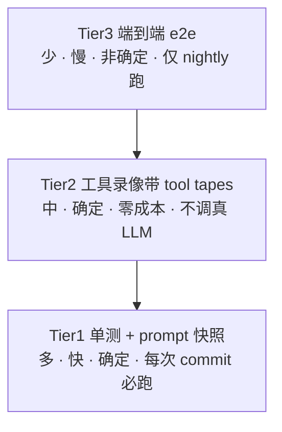
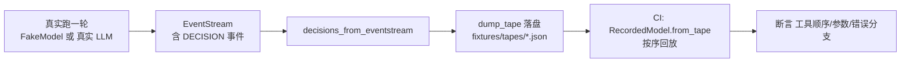
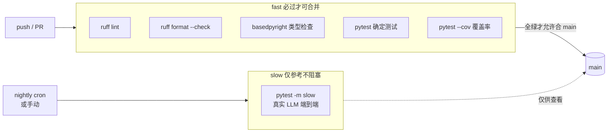

# 聊聊 work-agent 的测试体系

> 写代码容易，保证代码**一直**不出错难。
>
> 尤其是一个会调用大模型、会读写文件、会执行命令的 AI Agent——它天生就"不太听话"。这篇文章用大白话讲清楚：我们的测试到底是怎么搭的、为什么这么搭、对你有什么好处。

---

## 一、背景：为什么 Agent 的测试特别难写

普通的程序，输入一样，输出就一样。你写个 `add(1, 2)`，永远返回 `3`，单测好写得很。

但 Agent 不一样，它有三个"捣蛋鬼"：

1. **大模型不确定**。你问它"帮我读一下 a.txt"，它这回可能先 `read` 再 `echo`，下回可能反过来。同样的需求，模型给出的"决策序列"不固定。
2. **副作用危险**。Agent 真去删文件、真去跑 shell，测试环境一下就脏了，甚至把你的电脑搞崩。
3. **链条长**。从"用户一句话"到"最终改完代码"，中间要过意图识别、规划、工具调用、上下文压缩……任何一环回归都难查。

所以传统的"对着函数写断言"在 Agent 上基本歇菜。我们得换一套思路：**把"不确定"的部分和外部依赖隔离开，只测确定、可重放、零成本的行为**。

这就是测试金字塔的由来。

---

## 二、核心思路：三层测试金字塔

我们借鉴了业界（Tian Pan, 2026）的分层思想，把测试分成三层，形状像座金字塔：



记住一句话：**底层越多越快越确定，顶层越少越慢越接近真实**。越往上越像"真人在用"，但也越贵、越容易红。

---

## 三、逐层拆解

### Tier1：最快的"地基"——单测 + prompt 快照

这一层追求一个字：**快且确定**。每次 `git commit` 都跑。

#### 1. 普通单测（`tests/unit/`）
和所有项目一样，测纯逻辑：`add` 对不对、解析对不对、枚举对不对。纯函数、零依赖、毫秒级。

#### 2. prompt 快照（契约测试）
这是 Agent 特有的一招。我们的 system prompt 有一大段是**静态的**（来自 `system.md`，不含日期、Git 分支这些动态东西）。这段东西**不该被手滑改掉**——它关系到模型的"人格"和稳定前缀（影响 prompt caching 命中率）。

做法很巧妙：第一次跑，把渲染出来的静态段存成一个**基线文件**；之后每次跑，都和基线做 diff。不一致就报错。

```python
# tests/integration/test_prompt_snapshot.py（精简）
def test_system_prompt_static_snapshot():
    static, _ = _build_system_parts(Settings())
    if not _FIXTURE.exists():
        _FIXTURE.write_text(json.dumps({"static": static}, ...))  # 首次建基线
        pytest.skip("baseline created; re-run to verify snapshot")
    baseline = json.loads(_FIXTURE.read_text())["static"]
    assert static == baseline, "system prompt 静态段与基线不一致！"
```

> **好处**：有人不小心改了 `system.md` 或渲染逻辑，CI 立刻报警。你再也不会因为" prompt 被偷偷改了"而 debug 一整天。

基线文件要提交进仓库，有意变更时更新它即可。

---

### Tier2：最巧妙的"录像带"——工具重放（tool tapes）

这是整套体系里我最想安利你的一层。

**核心洞见**：Agent 跑一轮，会产生一串 `Event`（决策、工具调用、工具结果……）。这串 Event 本身就是一盘**录像带**。我们只要把真实跑出来的"模型决策序列"录下来，CI 里用一个 `RecordedModel` 按序回放，就能**确定性地**复现整个工具调用过程——而且**完全不调真实大模型**，零成本、零网络。

```mermaid
sequenceDiagram
    participant 真实运行 as 真实跑一轮
    participant 录像带 as EventStream
    participant CI as RecordedModel 重放
    真实运行->>录像带: 记录 Decision 序列
    CI->>CI: 按序回放 Decision
    CI->>Loop: 断言 工具顺序/参数/错误分支
```

**录制闭环（已落地）**：上面回放的「带子」现在可以由一次真实运行**自动产出**，不必再手写。`EventStream` 每轮都记了 `DECISION` 事件，`agent/testing/recorded_model.py` 提供三个函数把「跑出来的事件流」变成「可重放的带子」：

```python
# agent/testing/recorded_model.py（精简）
def decisions_from_eventstream(stream: EventStream) -> list[Decision]:
    """从一次运行的事件流提取模型决策序列（只取 DECISION 事件，顺序即因果顺序）。"""
    return [e.decision for e in stream.all()
            if e.type == EventType.DECISION and e.decision is not None]

def dump_tape(decisions, path):            # 决策序列 → JSON 文件落盘
    ...
def load_tape(path) -> list[Decision]:     # JSON 文件 → 决策序列
    ...
# RecordedModel.from_tape(path) 直接由 tape 文件构造回放模型
```

于是完整链路是：



两种「带子」用法：

- **手写 tape**（如 `test_tool_tape_error_branch_graceful_degradation`）：测试直接 `RecordedModel([...])` 构造，适合「我想精确验证某个分支」。
- **真实录制 tape**（如 `tests/integration/fixtures/tapes/echo_one.json`）：由 `decisions_from_eventstream` + `dump_tape` 从一次真实运行产出，结构完全一致；nightly 跑真实 LLM 时落下的就是这种文件。仓库里这个示例带本身也会被回放测试加载（`test_real_tape_file_replays`），证明「真实回放」链路真的跑通了——它确实加载了一个真实存在的 tape 文件并按序回放。

#### 怎么录：一行命令

最省事的录制入口——真实跑任务时加 `--record`：

```bash
python -m agent.cli run "把 TODO 注释清理掉" --record fixtures/tapes/todo_cleanup.json
# [record] 已录制 N 条决策 → fixtures/tapes/todo_cleanup.json
```

接**真实 LLM** 运行时，这一轮产生的决策序列会被落盘成 tape；之后任何人 `RecordedModel.from_tape("fixtures/tapes/todo_cleanup.json")` 都能零成本复现那一轮的真实工具行为。nightly 的 `slow` 通道也带了一个自动落盘闭环测试（`tests/e2e/test_tape_record_slow.py`）：跑完即 `dump_tape` 并 `RecordedModel.from_tape` 回放校验等价，确保「录制→落盘→回放」在完整 Session 链路下始终可用。

#### 真实录像（回放）什么时候用

录制好的 tape 主要在「确定性回放」场景下消费，而不是回放给用户看：

- **回归守门（每次 commit）**：nightly 真实 LLM 录下的 tape，被 fast job（每次 PR）用 `RecordedModel.from_tape` 回放，断言工具顺序/参数/错误分支没变。模型行为被「快照」住了——代码改动若悄悄改变了工具调用序列，CI 立刻红。
- **复现 bug**：线上某次真实运行出了问题，把那次的 tape 单独存下来，之后无需再烧真实 LLM、无需复现环境，直接回放就能稳定复现、定位。
- **对比不同版本 / 模型**：同一 tape 在旧版和新版代码上分别回放，diff 工具行为，评估重构是否改变了 Agent 的实际动作。
- **低成本的「真实感」测试**：想验证「真实跑出来的工具序列」长啥样，又不想到处烧 token——回放已录好的真实 tape 即可。

一句话：**真实录像用于把真实 LLM 的一次运行固化为可重复执行的契约，在不需要模型、不需要网络、不需要重新构造环境的前提下，反复验证 Agent 的行为是否稳定。**

`RecordedModel` 长这样（极简）：

```python
# agent/testing/recorded_model.py（精简）
class RecordedModel:
    def __init__(self, decisions: list[Decision]) -> None:
        self.decisions = list(decisions)        # 录好的"带子"
    async def act(self, messages, tools=None) -> Decision:
        return self.decisions.pop(0) if self.decisions else Decision(text="<tape exhausted>")
```

看个真实用例——验证"未知工具要优雅降级，不能崩"：

```python
# tests/integration/test_tool_tapes.py（精简）
def test_tool_tape_error_branch_graceful_degradation():
    tape = [
        Decision(tool_calls=[ToolCall(id="g1", name="ghost", arguments={})]),  # 调了个不存在的工具
        Decision(text="recovered"),
    ]
    model = RecordedModel(tape)
    result = asyncio.run(AgentLoop(model, reg, settings).run("call unknown"))
    tr = next(e for e in result.events if e.type == "tool_result")
    assert not tr.tool_result.ok                       # 降级成 ok=False
    assert result.text == "recovered"                  # 下一轮模型已恢复
```

> **好处**：
> - **确定**：同样的带子，永远跑出同样的结果，告别"看脸"测试。
> - **便宜**：不烧 API、不联网，CI 里随便跑。
> - **聚焦行为**：我们只关心"工具调用顺序对不对、参数对不对、出错时优不优雅"，而不是去猜模型会说什么。
> - **可真实录制**：带子既能手写，也能从 nightly 真实 LLM 跑出的 `EventStream` 录制（`decisions_from_eventstream` + `dump_tape`）；CI 回放时用 `RecordedModel.from_tape` 加载同一结构文件，零成本复现那一轮的真实工具行为。

---

### Tier3：最接近真实的"演练"——端到端 e2e

到了顶层，我们才让 Agent **真的跑完整会话**，验证那些只有端到端才暴露的能力：跨进程重启后**会话恢复（resume）**、父子**会话 fork**、上下文压缩等。

比如 `tests/e2e/test_recovery_e2e.py` 会模拟"daemon 崩溃"：先写一条 `DECISION` + `TOOL_USE` 但没回 `TOOL_RESULT`（代表中途断了），重启后用 `Session.from_store` 从 SQLite 恢复，断言能检测出中断并自动续跑。

```mermaid
flowchart LR
    A[跑一半的会话<br/>TOOL_USE 无 TOOL_RESULT] --> B[模拟 daemon 重启]
    B --> C[Session.from_store 从 SQLite 恢复]
    C --> D[detect_interruption 发现中断]
    D --> E[注入"继续" 自动续跑]
```

> **为什么这层特殊**：它**非确定、慢、还要真实 LLM**。所以**绝不在每次 push/PR 跑**，只在 nightly（每天凌晨）或手动触发时跑，结果只作参考，不阻塞合并。

---

## 四、平时怎么跑：一个开关管住"慢测试"

我们用 pytest 的 marker 给测试贴标签：`unit` / `integration` / `e2e` / `slow`。

关键点藏在 `pyproject.toml` 一行：

```toml
addopts = "-m 'not slow'"   # 默认跳过所有 slow（即 e2e）
```

于是：

```bash
pytest -q            # 日常：跑 unit + integration，跳过 e2e，秒级
pytest -m slow -q    # 深夜/手动：专门跑 e2e（要真实 LLM）
```

你写代码时，永远只需要 `pytest -q`，又快又绿，不会被慢测试拖累。

---

## 五、CI 门禁：快慢两道，互不耽误

GitHub Actions 把上面三层接成两道流水线：



四道快门禁各自守一块：

| 门禁 | 干啥的 | 拦什么 |
|---|---|---|
| `ruff check` | 静态规范 | 没定义的变量、没用的导入 |
| `ruff format --check` | 格式统一 | 缩进/引号乱七八糟 |
| `basedpyright` | 类型检查 | 参数类型不对、None 没判 |
| `pytest` + `cov` | 行为正确 + 覆盖率 | 逻辑回归、覆盖率掉太多 |

> **为什么要快慢分离**：e2e 要真实 LLM、又慢又贵又"看脸"，让它阻塞 PR 只会逼大家跳过测试。放进 nightly，该查的照样查，又不耽误日常合并。

---

## 六、顺手解决"误提交"：测试完自动大扫除

写 Agent 测试难免在仓库根留点临时文件（`a.txt`、`coverage.xml`、`x`……）。以前这些散文件常被手滑 `git add` 进去。

我们写了个清理脚本 `scripts/cleanup_test_artifacts.py`，并在 `tests/conftest.py` 里挂了个钩子：

```python
def pytest_sessionfinish(session, exitstatus):
    # 每次 pytest 结束自动清理仓库根散文件
    # 排除 coverage.xml，因为 CI 还要把它当 artifact 上传
    subprocess.run([sys.executable, script, "--exclude", "coverage.xml"], ...)
```

以后新增用例若在根目录漏写文件，只要往脚本里的 `CLEANUP_PATTERNS` 列表追加一条就行，不用再手动记。

（配套地，`.gitignore` 也忽略了 `coverage.xml`、`_*.txt`、`*.tmp` 等产物，双保险。）

---

## 七、小结

把今天讲的揉成一句话：

> **不确定的留给真实环境（nightly 跑），确定的全部自动化守住（每次 commit 跑）；模型用"录像带"代替，又快又稳又不烧钱——而且这盘带子既能手写，也能从 nightly 真实运行里录制下来反复回放。**

| 层 | 测什么 | 确定性 | 谁跑 | 成本 |
|---|---|---|---|---|
| Tier1 单测+快照 | 纯逻辑、prompt 静态段 | ✅ 确定 | 每次 commit | 免费 |
| Tier2 工具录像带 | 工具顺序/参数/错误分支 | ✅ 确定 | 每次 commit | 免费（不调 LLM） |
| Tier3 e2e | 会话恢复/fork/压缩 | ❌ 非确定 | nightly | 真实 LLM |

下次你改完代码，记住三步走：**`ruff format` 顺手格式化 → `pytest -q` 看绿 → `git push` 等 CI 转绿**。齐活。

---

*想看代码？入口在这里：*
- *金字塔落地：`tests/unit/`、`tests/integration/`、`tests/e2e/`*
- *录像带模型：`agent/testing/recorded_model.py`*
- *CI 配置：`.github/workflows/ci.yml`*
- *清理脚本：`scripts/cleanup_test_artifacts.py`*
