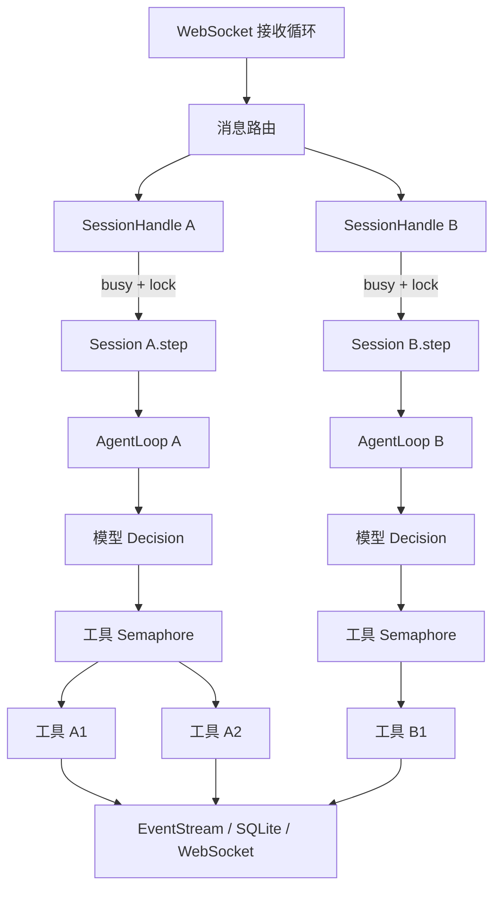
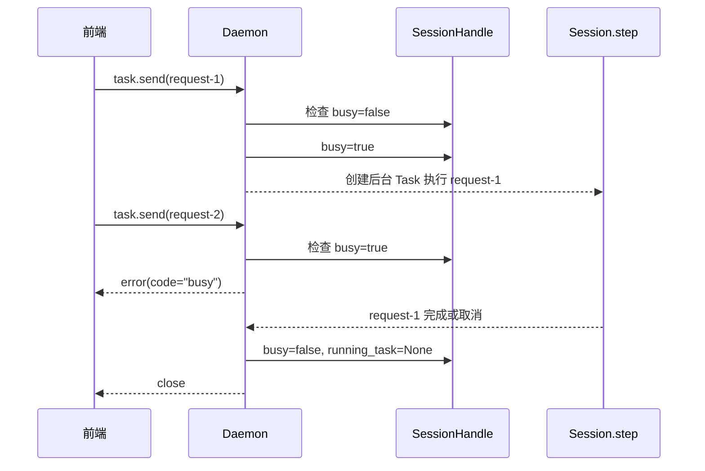
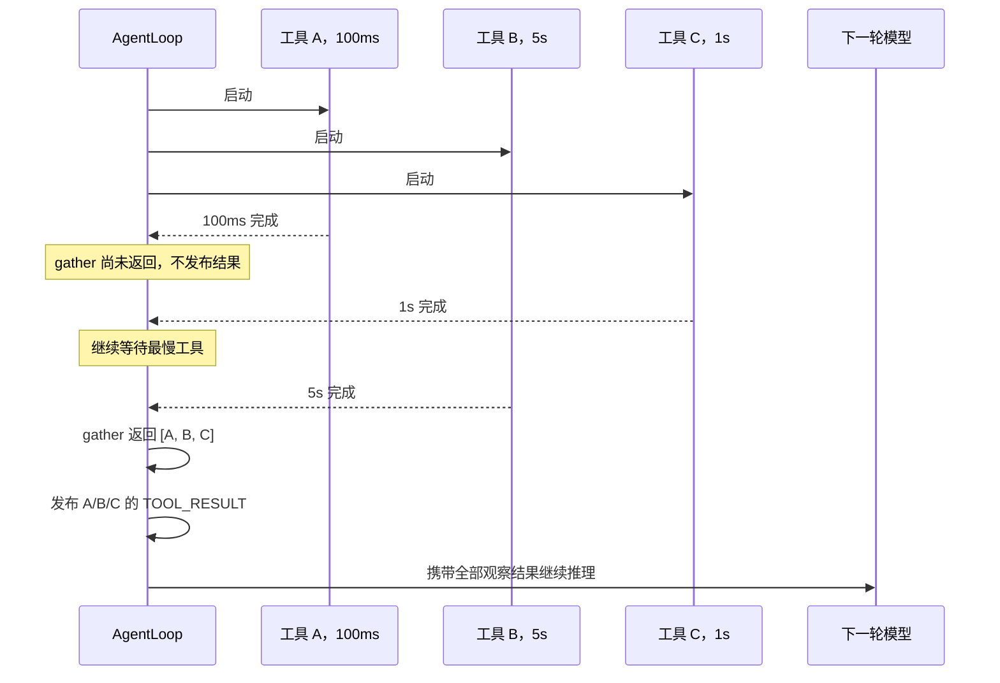
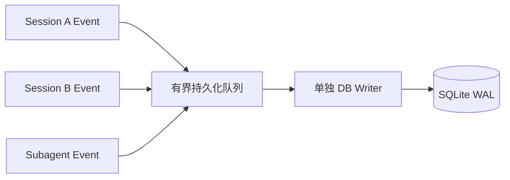
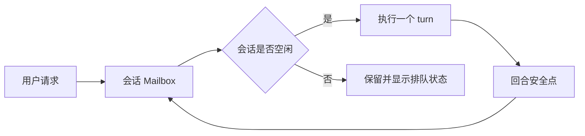

# 项目并发机制：会话串行、工具并发与事件有序传输

## 1. 先说结论

本项目运行在一个 Python `asyncio` 事件循环中，并发模型可以概括为：

> **同一会话严格单任务，不同会话可以并发；同一轮模型决策中的多个工具可以受限并发，但下一轮模型推理必须等待全部工具完成。**

这里的“并发”主要是协程并发，而不是为每个请求创建线程。模型流、WebSocket、子进程和 MCP 调用在等待 I/O 时主动让出事件循环，因此多个会话和多个工具可以交替推进。只有使用异步 I/O 或子进程的工具才能真正从这种调度中获益；直接执行同步文件读写的 `async def` 工具并不会因为放进 `asyncio.gather()` 就自动并行。

当前主要并发边界如下。

| 层级 | 当前策略 | 超出时的行为 |
|---|---|---|
| 同一会话的用户请求 | `busy` 快速拒绝 + 会话级 `asyncio.Lock` 兜底 | 第二个请求返回 `error(code="busy")`，不会排队 |
| 不同会话 | 各自拥有独立 `SessionHandle.lock`，可在同一事件循环中并发 | 互不等待，但仍共享进程级资源 |
| 同一 Decision 的普通工具 | `asyncio.gather` + `Semaphore(max_tool_concurrency)` | 超出并发数的工具在信号量前等待 |
| ReAct 不同轮次 | 串行 | 当前轮全部工具完成后才能调用下一轮模型 |
| 同一 MCP Server | Server 级 `Semaphore(mcp.concurrency)` | 超出上限的 MCP 调用等待，并有单次超时 |
| 后台子 Agent | 独立 `asyncio.Task`、独立 `AgentLoop` 和 `EventStream` | 与前台并发；当前没有统一的全局子 Agent 并发上限 |
| WebSocket 下行 | 每连接一个发送锁 | 所有消息串行写入 socket |
| Session Memory 更新 | `_sm_updating` 标志串行化 | 已有更新运行时跳过新的更新 |

核心实现集中在：

- `agent/daemon/server.py`：请求准入、任务创建、取消和会话锁；
- `agent/daemon/registry.py`：`SessionHandle` 的 `busy`、`running_task`、`lock`；
- `agent/core/loop.py`：ReAct 循环和工具并发；
- `agent/daemon/bridge.py`：HITL Future 和事件发送任务；
- `agent/core/session.py`：前台 step、后台子 Agent、Session Memory；
- `agent/mcp/adapter.py`：MCP Server 并发限制和超时。

## 2. 整体并发架构

daemon 不会为每个会话创建一个操作系统线程，而是让多个会话任务运行在同一个事件循环中。每个顶层会话都有自己的 `SessionHandle`，其中最关键的并发状态是：

```python
handle.busy: bool
handle.running_task: asyncio.Task | None
handle.lock: asyncio.Lock
```

可以把整体结构理解为：



“同会话串行”保护 `messages`、`EventStream`、压缩状态和计划状态的一致性；“跨会话并发”避免一个慢模型请求或人工审批阻塞所有用户；“同轮工具并发”缩短多个互不依赖工具的总等待时间。

## 3. 同一会话同时收到两个用户请求

### 3.1 当前行为：第二个请求直接被拒绝

前端发出 `task.send` 后，daemon 的 `_task_send()` 先检查：

```python
if handle.busy:
    await conn.send(
        MsgType.ERROR,
        {"code": "busy", "message": "session is busy"},
    )
    return
```

第一个请求通过检查后，会在创建后台任务之前同步执行：

```python
handle.busy = True
```

这一步不能放进后台 `_run()` 才做。否则两个连续到达的 `task.send` 都可能在后台任务获得执行机会之前看到 `busy=False`，从而同时进入同一个会话。现在的实现先同步占位，再用 `asyncio.ensure_future(_run())` 启动真正的 Agent 工作，封住了这个准入竞态窗口。

因此，两个请求几乎同时到达时，时间线是：



第二个请求不会等待、不会覆盖第一个请求，也不会被自动保存成“下一条待执行消息”。如果产品希望用户在生成过程中继续发送消息，需要额外设计会话 mailbox 或 `asyncio.Queue`，当前实现没有这层队列。

### 3.2 为什么同时还需要会话锁

仅有 `busy` 仍然不够，因为它是普通布尔值，主要承担协议入口的快速失败。真正的一致性底线是：

```python
async with handle.lock:
    await session.step(...)
```

即使未来增加了新的内部入口，或者某段代码绕过了 `busy` 检查，`handle.lock` 仍能保证同一会话最多只有一个 `Session.step()` 修改状态。项目因此使用了两层保护：

```text
busy：准入策略，告诉调用方“当前不能接收第二个请求”
lock：正确性约束，保证同一个 Session 不会并发执行两个 step
```

这两者不能简单互换。如果只使用锁，第二个请求会悄悄排队，并可能在几十秒后执行，用户未必还希望它继续；如果只使用 `busy`，内部调用路径一旦漏检，就可能并发修改同一份上下文。

### 3.3 人工审批等待期间仍然算 busy

会话锁覆盖整个 `session.step()` 生命周期，包括：

- 模型流式生成；
- 工具执行；
- 等待用户回答澄清问题；
- 等待计划确认；
- 等待工具执行审批。

所以当 Agent 正在等待用户点击“批准”时，同一会话的第二个普通请求依然会收到 `busy`。这是有意为之，因为此时原请求还没有结束，直接插入新用户消息会改变模型上下文的因果顺序。

WebSocket 接收循环本身并没有被 `session.step()` 阻塞。`_task_send()` 把 step 放入后台 Task 后立即返回，因此 daemon 仍可继续接收 `answer`、`approve`、`confirm_plan` 和 `task.cancel`。`BridgeTransport` 为每个 HITL 请求创建一个带唯一 ID 的 `asyncio.Future`；前端回传相同 ID 后，`resolve()` 调用 `future.set_result()`，原 step 才从等待点恢复。

## 4. 不同会话之间如何并发

不同会话各自拥有独立的：

- `busy` 状态；
- `asyncio.Lock`；
- `running_task`；
- `Session.messages`；
- 会话级 `EventStream`；
- 模型实例和 Trace。

因此，会话 A 等待模型或用户审批时，会话 B 可以继续运行。它们由同一个事件循环合作式调度：协程遇到网络读取、子进程等待、`Future`、`Semaphore` 或 `Lock` 时让出执行权。

但“不同会话可并发”不等于“所有资源完全隔离”。当前仍有几个进程级共享资源：

- 默认 `ToolRegistry`；
- 同一项目的 SQLite 文件；
- Python 进程的当前工作目录；
- 同一个前端 WebSocket 连接的发送锁；
- 系统 CPU、文件和网络资源。

这些共享点决定了后文所述的竞态风险。

## 5. 同一轮的工具并发调用

### 5.1 并发启动和并发上限

模型一次 `Decision` 可以返回多个 `tool_calls`。`AgentLoop._exec_tools()` 为这一组调用创建信号量：

```python
sem = asyncio.Semaphore(settings.loop.max_tool_concurrency)
```

默认配置是：

```yaml
loop:
  max_tool_concurrency: 5
```

普通真实工具在执行前进入：

```python
async with sem:
    return await registry.run(...)
```

然后整组调用通过下面的方式启动：

```python
results = await asyncio.gather(*(_one(tc) for tc in calls))
```

假设模型一次返回 8 个耗时工具，且并发上限是 5，那么前 5 个获得信号量，剩余 3 个等待。任何一个运行中的工具释放信号量后，下一个等待者才进入。

### 5.2 实际等待语义：存在全量汇合屏障

这里很容易产生一个误解：工具虽然并发执行，但结果并不是谁先完成就立刻交给模型。

当前流程是：

1. 先按模型调用顺序发布所有 `TOOL_USE` 事件；
2. 使用 `asyncio.gather()` 等待整组工具全部结束；
3. `gather()` 返回按输入顺序排列的结果列表；
4. 再按原始调用顺序发布所有 `TOOL_RESULT`；
5. 把全部工具结果加入上下文；
6. 发起下一轮模型调用。



因此一组工具的总等待时间约等于最慢工具耗时，而不是所有工具耗时之和，这是并发带来的收益；但前端也看不到快速工具的提前完成状态，这是当前“批量汇合”设计的代价。

如果希望 UI 先显示已经完成的工具，可以为每个调用创建带索引的 Task，使用完成回调或 `asyncio.as_completed()` 立即发布事件，同时把结果保存到按原始索引分配的数组中。这样既能实时显示完成顺序，又能在构造模型的 `tool` 消息时保持原始调用顺序。

### 5.3 为什么下一轮模型必须等待全部工具

一次 Decision 的多个工具调用共同构成这一轮的“动作”，下一轮模型输入需要包含与每个 `tool_call_id` 对应的工具消息。如果部分工具还没返回就调用模型，会出现：

- 模型看不到完整观察结果；
- assistant 的多个 tool call 与 tool result 不完整配对；
- 不同完成顺序可能产生不确定的上下文；
- 某些 OpenAI 兼容服务会拒绝不完整的工具消息序列。

所以“UI 可以提前看到单个结果”和“模型可以提前进入下一轮”是两件事。前者可以优化，后者一般需要更复杂的增量规划模型，而不是简单改成 `as_completed()`。

### 5.4 异常、取消和超时

普通工具执行中的 `Exception` 会被 `_one()` 捕获并转成：

```python
ToolResult(ok=False, error="...")
```

这意味着一个工具失败通常不会取消同组其他工具，模型会同时拿到成功结果和失败观察，再决定是否重试或换方案。

`asyncio.CancelledError` 不属于这里捕获的普通 `Exception` 路径。用户发送 `task.cancel` 后，daemon 对 `running_task` 调用 `cancel()`，取消会沿着：

```text
running_task
  → Session.step
  → AgentLoop.run
  → asyncio.gather
  → 尚未完成的工具协程
```

向下传播。工具是否能真正及时停止，还取决于工具实现是否正确响应取消。异步子进程和网络调用通常可以在等待点收到取消；在事件循环线程中执行的同步文件操作无法在操作中途被协程取消。

当前超时策略并不完全统一：

- `bash` 使用请求参数中的 timeout，默认 30 秒；
- MCP 工具有 `mcp.tool_timeout_sec`，默认 45 秒；
- 普通注册工具没有统一的外层 `wait_for()`，需要工具自行实现超时。

## 6. 哪些工具真的能并发

`asyncio.gather()` 提供的是协程并发，不会把同步代码自动放进线程池。

例如内置 `read`、`write`、`edit` 虽然声明为 `async def`，内部使用的仍是同步 `Path.read_text()` 和 `Path.write_text()`，执行期间没有 `await`。因此多个这类工具被 gather 启动后，通常仍会在事件循环线程中一个接一个运行，而且大文件操作还可能短暂阻塞其他会话的流式输出。

真正能明显并发的通常是：

- `await asyncio.sleep()` 一类测试工具；
- 异步模型 HTTP 请求；
- 异步 subprocess；
- MCP JSON-RPC 调用；
- 会在等待 I/O 时 `await` 的自定义工具。

CPU 密集型工作同样不适合直接放在事件循环里。应根据任务性质选择：

```text
异步网络/管道 I/O → 原生 async
短小同步文件 I/O   → 可直接执行，但注意阻塞时间
较慢同步 I/O       → asyncio.to_thread
CPU 密集型任务      → 进程池或独立 worker
```

## 7. MCP 的第二层并发控制

MCP 工具除了受当前 Decision 的 `max_tool_concurrency` 限制，还受 MCP Server 自身的信号量限制。`McpManager` 为每个 Server 创建：

```python
asyncio.Semaphore(settings.mcp.concurrency)
```

默认每个 Server 最多同时处理 4 个调用。于是一个 MCP 工具真正执行前可能经过两层限流：

```text
AgentLoop 每轮工具信号量，默认 5
        ↓
MCP Server 信号量，默认 4
        ↓
tools/call，默认超时 45 秒
```

MCP Client 为每次 JSON-RPC 请求分配递增 ID，并把 Future 保存到 `_pending[id]`。单独的读循环持续读取 Server stdout，根据响应 ID 唤醒对应 Future，因此同一 MCP 进程可以正确配对乱序返回的多个请求。

## 8. 工具审批并发

审批发生在普通工具获得 `max_tool_concurrency` 信号量之前。同一 Decision 中如果多个高风险工具都需要确认，多个 `_one()` 协程可能同时创建审批 Future，并向前端发送多个 `approve` 请求。

后端使用唯一请求 ID 保存多个未决 Future，前端 HITL 状态机也使用队列保存请求，所以协议层能够容纳多个审批。用户逐个处理后，相应工具才继续竞争执行信号量。

这种顺序的优点是不会让一个“等待用户点击”的工具长期占用工具并发槽；代价是用户可能一次看到多个审批。如果产品希望严格逐项审批，应在审批层增加专用锁，而不是占用工具执行信号量。

## 9. 子 Agent 与后台任务

前台 `spawn_subagent` 本身是一个控制工具。当同一 Decision 生成多个 `spawn_subagent` 调用时，它们会随 `_one()` 一起并发运行。每个子 Agent 拥有：

- 独立 `AgentLoop`；
- 独立上下文副本或空上下文；
- 独立 `EventStream`；
- 独立 `subsession_id`；
- 可选的模型覆盖和工具白名单。

它们的事件通过父会话 WebSocket 多路复用，但不会直接并发修改父 Agent 当前局部变量 `conv`。父 Agent 仍然要等待所有前台子 Agent 作为工具返回后，才进入下一轮模型推理。

`Session.spawn_background()` 则使用独立 `asyncio.Task`，不阻塞前台 step。Session Memory 更新复用了这个机制，并用 `_sm_updating` 保证同一会话同时最多只有一个摘要提取任务，避免两个任务并发写同一个 `summary.md`。

当前 `subagents` 配置只有 `max_depth`，没有统一的 `max_concurrency`。而 `spawn_subagent` 属于控制工具，执行位置在普通工具的 `Semaphore` 之前，所以它实际上不受 `max_tool_concurrency` 约束；单轮并发量主要取决于模型一次生成多少个调用，后台任务同样缺少全局并发配额。在大量会话同时派生子 Agent 时，可能出现模型连接数、工具进程数和 WebSocket 事件数量快速增长的问题。

另一个值得注意的点是：普通后台子 Agent 完成后会直接向 `Session.messages` 追加摘要，而前台 step 结束时也可能整体替换 `self.messages`。这两条路径没有共用 `handle.lock`，理论上存在逻辑竞态和摘要更新丢失的可能。更稳妥的设计是让后台结果先写入 mailbox，只在会话安全点由持有会话锁的前台流程合并。

## 10. 事件并发与 WebSocket 顺序

`EventStream.append()` 会同步完成：

1. 分配会话级单调递增 `seq`；
2. 加入内存事件序列；
3. 依次调用全部订阅者，包括 WebSocket bridge 和持久化 sink。

当前 `AgentLoop.run()` 先绑定 transport、再订阅持久化 sink，因此实时转发回调先创建 WebSocket 发送 Task，随后同一个 `append()` 调用才同步写 SQLite。两者都在 `append()` 返回前完成“提交动作”，但真正的 socket 写入由异步 Task 继续执行。

`BridgeTransport` 不会在同步回调里直接等待 socket，而是为每条消息创建发送 Task。这样模型流不会被一次 socket 写操作直接卡住。一个 WebSocket `Connection` 内部使用 `asyncio.Lock`，确保同一连接上的 JSON 消息不会并发写入。

任务结束时 `transport.flush()` 等待已经创建的发送任务完成，主要保证最终事件先于 `close` 到达。后台子 Agent 如果产生大量积压事件，会话切换前可以取消旧会话尚未发送的实时事件；事件已经持久化，用户切回时由 replay 恢复，所以取消旧实时发送不会丢失历史真相。

当前实现没有有界 WebSocket 发送队列和文本 chunk 合并。如果模型输出速度长期高于前端消费速度，会创建较多 pending send Task。后续可改为：

- 每连接一个有界 `asyncio.Queue`；
- 单独 writer Task 串行消费；
- 对连续 `TEXT` 做 16～50ms 合并；
- 队列满时只合并可丢弃的瞬时预览，不能丢正式事件。

## 11. SQLite 并发与事件一致性

每个正式事件都会通过 `SessionStoreSink` 写入 SQLite。`SessionStore` 每次操作创建一个短连接，并以 `(session_id, seq)` 为主键保存事件。同一会话由于 step 串行且 `EventStream.seq` 单调增长，正常情况下不会发生同会话事件序号冲突。

不同会话可以同时写同一个项目的数据库。SQLite 会对写事务做串行化，但当前连接没有显式配置 WAL、`busy_timeout` 或应用级写锁。在高频文本增量、多个子 Agent 和多个会话同时写入时，可能出现写竞争或同步磁盘 I/O 阻塞事件循环。

更稳妥的落地方案是使用单写者模型：



Writer 可以批量提交事件，同时使用 WAL 和合理的 `busy_timeout`。需要注意：如果改成异步批量落盘，`close`、进程退出和会话切换必须有 flush 语义，不能为了吞吐量破坏“最终事件已经持久化”的保证。

## 12. 当前最重要的并发风险

### 12.1 `os.chdir()` 是进程级状态

`AgentLoop._exec_tools()` 在执行工具前调用：

```python
old_cwd = os.getcwd()
os.chdir(self.cwd)
try:
    await asyncio.gather(...)
finally:
    os.chdir(old_cwd)
```

这对单会话有效，但对跨会话并发不安全。当前工作目录属于整个 Python 进程，不属于某个协程。可能出现：

```text
会话 A：chdir(project-A)，开始等待工具
会话 B：chdir(project-B)，开始等待工具
会话 A：某文件工具调用 Path.cwd()，实际得到 project-B
会话 A：恢复旧 cwd
会话 B：恢复的 cwd 也可能已经不是最初值
```

这是当前并发模型中优先级最高的风险。正确方向不是给 `os.chdir()` 再加一把全局锁，因为那会让所有会话的工具调用退化为串行。更合理的方案是给工具传递显式 `ToolContext`，其中包含 `cwd`、会话 ID、沙箱和取消信息；所有文件工具都基于 `context.cwd` 解析路径，彻底移除运行期 `os.chdir()`。

### 12.2 并发写同一文件没有资源锁

同一 Decision 可以同时调用两个 `write/edit`，不同会话和子 Agent 也可以修改同一工作区文件。当前没有按路径加锁，也没有文件版本或 hash 校验，因此可能出现最后写入者覆盖前者的问题。

建议给工具声明并发元数据：

```text
concurrency_safe：是否允许与其他调用并发
resource_key：例如绝对文件路径、MCP server 名、数据库名
access_mode：read / write
```

调度器据此实现：不同文件可并发、同文件读可共享、同文件写串行。对于 `edit`，还可在写入前校验读取时的 hash，检测到文件已变化就返回冲突，而不是静默覆盖。

### 12.3 同步工具会阻塞整个事件循环

内置文件工具的同步 I/O 如果遇到大文件或慢磁盘，会让所有会话的模型流转发、HITL 回应和 WebSocket 心跳一起短暂停顿。应把可能较慢的同步操作放进 `asyncio.to_thread()`，同时控制线程池大小，避免把协程并发问题转换成无限线程问题。

### 12.4 工具结果不能逐个完成展示

当前 `gather()` 屏障让一个 100ms 工具的 UI 状态也要等 5s 工具完成后才变成 done。建议拆分“实时事件完成顺序”和“模型上下文原始顺序”，前者按完成时间发布，后者按 tool call index 组装。

## 13. 如果需要支持同会话请求排队

当前的快速拒绝策略简单、确定，并且不会让用户请求悄悄延迟执行。如果产品明确需要“生成过程中继续发送”，不应只删除 `busy` 检查，而应引入有语义的 mailbox：



需要同时定义：

- 新消息是“下一轮任务”，还是对当前任务的打断/补充；
- 是否允许用户撤回排队消息；
- 取消当前任务时是否继续执行队列；
- 多客户端同时 attach 时由谁拥有队列；
- 断线后队列是否持久化；
- 请求 ID、幂等键和重复提交如何处理；
- 后台 Agent 结果如何在安全点注入。

一个可靠的原则是：同一个 Agent 上下文永远只有一个 writer。所有用户消息、后台结果和控制消息先进入 mailbox，再由持有会话锁的调度器在模型调用之间的安全点合并。

## 14. 测试现状与建议补充

当前已有两类关键测试：

- `tests/integration/test_daemon.py::test_concurrent_task_send_returns_busy` 验证第一个请求等待 HITL 时，第二个请求收到 `busy`，原请求仍可正常完成；
- `tests/unit/test_loop.py::test_concurrent_tools_run_in_parallel_and_pair_by_id` 验证同轮慢工具能并发运行，并能按 `tool_call_id` 正确配对结果。

建议继续补充：

1. 两个不同项目会话同时运行文件工具，验证不会发生 cwd 串扰；
2. 两个工具并发编辑同一文件，验证冲突检测或路径锁；
3. 一个工具快速成功、一个工具超时，验证逐个状态展示和最终模型输入顺序；
4. 工具并发等待审批时取消整个任务，验证所有 Future 和子任务被清理；
5. 多会话高频 TEXT 事件同时写 SQLite，验证无 `database is locked` 且顺序可恢复；
6. WebSocket 慢消费者场景，验证发送队列有界且正式事件不丢；
7. 后台子 Agent 完成与前台 step 更新 `messages` 同时发生，验证摘要不会丢失；
8. daemon 退出时等待后台任务，超时后取消并释放子进程。

## 15. 常见面试问题

### 15.1 为什么同时使用 `busy` 和 `asyncio.Lock`？

`busy` 是准入和产品策略，让第二个请求快速得到明确错误；`Lock` 是正确性兜底，保证所有入口都无法并发修改同一个 Session。前者改善交互，后者维护不变量。

### 15.2 `asyncio.gather()` 是否意味着工具在多个 CPU 核上并行？

不意味着。它只并发调度协程。工具必须在等待异步 I/O 时让出事件循环才有明显收益；同步 I/O 和 CPU 密集代码仍会阻塞事件循环，需要线程池、进程池或外部 worker。

### 15.3 为什么 `gather()` 返回结果顺序不是完成顺序？

`gather()` 保证结果列表与输入 awaitable 顺序一致，方便按模型的 `tool_calls` 顺序和 `tool_call_id` 构造后续上下文。完成顺序可以通过事件单独表达，不应拿完成顺序替代协议配对顺序。

### 15.4 为什么下一轮模型不能在第一个工具完成后立即开始？

因为当前一条 assistant 消息声明了整组 tool calls，下一轮上下文需要为这些调用提供完整、合法的 tool result 配对。提前调用会使上下文不完整，并让行为依赖工具完成时序。

### 15.5 为什么等待人工审批时不释放会话锁？

审批属于当前用户操作的一部分。释放锁会允许另一条消息插入尚未完成的推理链，使 `messages`、计划状态和工具结果顺序发生歧义。若要支持插话，应设计 mailbox 和安全点，而不是简单释放锁。

### 15.6 `os.chdir()` 为什么在协程并发中危险？

因为 cwd 是进程全局状态，不是 Task Local 状态。一个协程修改 cwd 会立即影响所有会话和工具。正确做法是显式传递工作目录并使用绝对路径。

### 15.7 如何避免两个 Agent 覆盖同一个文件？

常见方案是按规范化绝对路径建立资源锁，并在 edit 前后使用版本号或内容 hash 做乐观并发检查。路径锁避免同时写，hash 检查避免等待期间文件被其他进程修改后仍然覆盖。

### 15.8 如何给工具并发增加背压？

可以分层设置配额：全局 Agent 并发、每会话工具并发、每类工具并发、每个 MCP Server 并发，以及外部 API 的限流器。配额应作用于真正稀缺的资源，审批等待不应占用执行槽。

## 16. 总结

项目当前采取的是一种清晰的“外串内并”模型：

```text
同一会话的用户回合：串行
不同会话：并发
同一 Decision 的工具：受限并发
不同 ReAct 轮次：串行
HITL：异步等待，但继续占有会话执行权
WebSocket 写入：每连接串行
```

这套设计已经解决了最关键的上下文并发修改问题，也通过 `Semaphore`、MCP 超时、发送锁和取消传播建立了基本的资源控制。当前最需要优先处理的是跨会话 `os.chdir()` 串扰、同文件并发写、工具结果延迟展示、后台结果注入竞态，以及 SQLite/WebSocket 缺少有界背压。解决这些问题后，系统才能从“协程层面可并发”进一步提升到“资源和状态层面可安全并发”。
