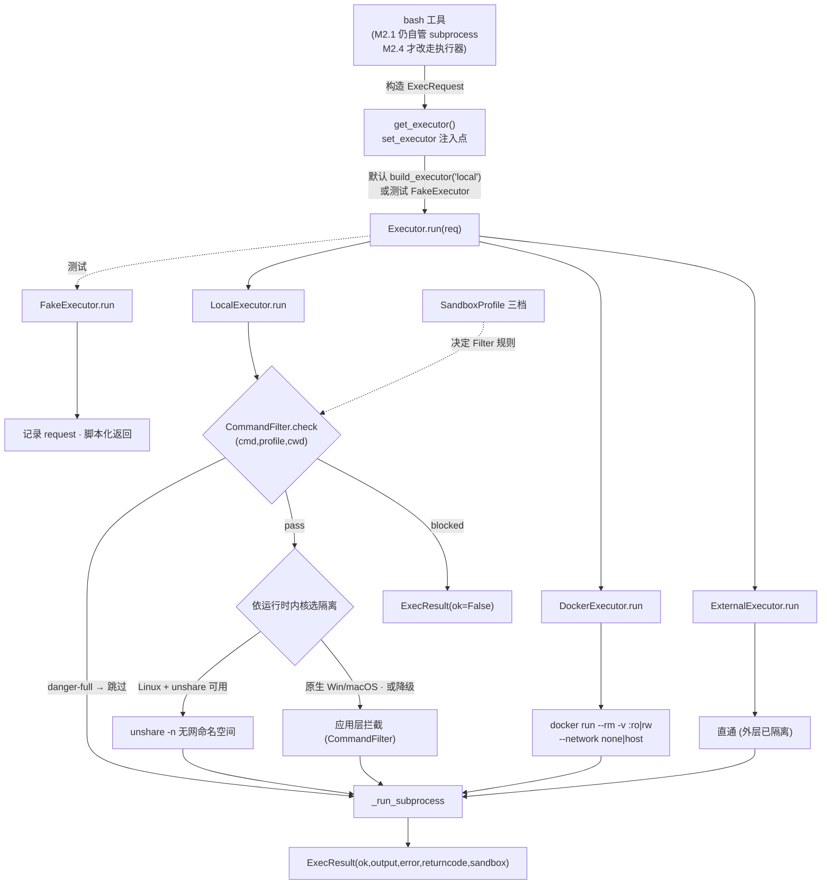
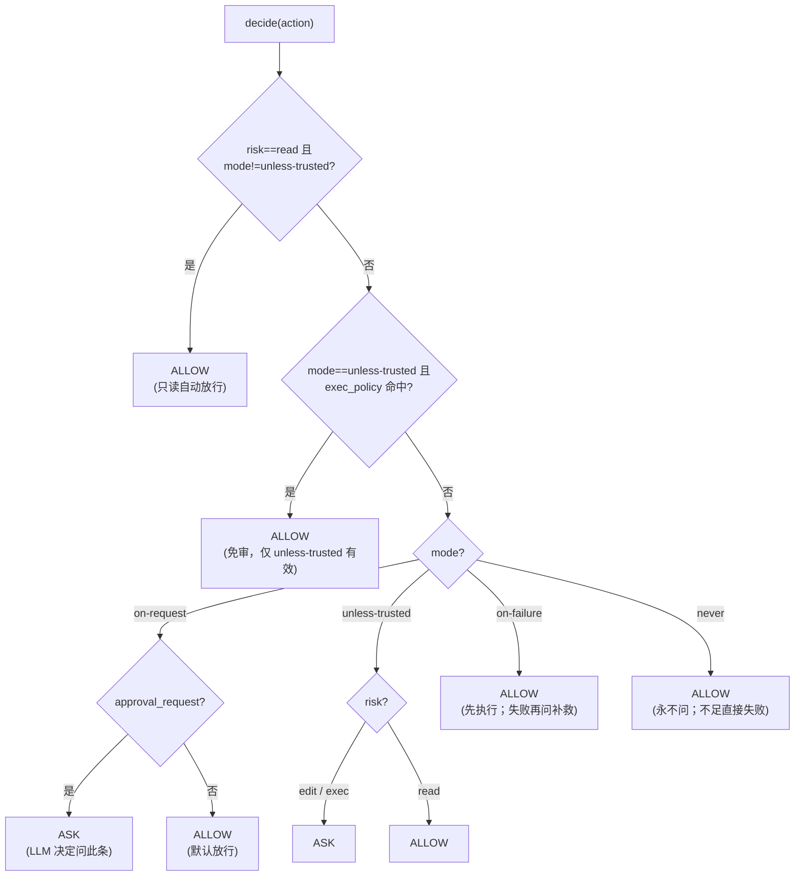

# 项目知识库索引（knowledge/INDEX.md）

> 跨里程碑共享知识。每个完成的 Step 向此处追加「主题 → 结论 → 来源里程碑/步骤」。开始新步骤前先读本文件恢复上下文。
> 维护规则：只记后续会用到且易忘的接口/约定/决策/坑；可重新生成的代码不记。

---

## 架构决策（来源：调研报告，M1 启动前沉淀，防止遗忘）

- **98/1.6 法则**：AI 只做决策，循环/权限/路由/压缩/持久化全部确定性实现且可独立测试。
- **安全在 OS 层**：沙箱是独立可插拔执行层（Local seccomp / Docker），prompt 仅软约束。→ 影响 M2；**完整设计见 `knowledge/sandbox-approval-design.md`**（Codex 模式：local/docker/external + 三档 profile + 网络默认拒绝 + AskForApproval 四模式）。
- **上下文稀缺**：静态(系统提示/规则) 与 动态(对话/工具结果) 分离；稳定前缀走 prompt caching；超阈值递归摘要。→ 影响 M4。
- **上下文管理设计文档**：`knowledge/context-management.md`（独立文档）。核心结论：**工具结果 = 对话历史，既保存也注入**（伪二选一）；本项目双轨映射——`EventStream` 全量不可变（保存/审计/压缩派生源）vs `conv`/`Session.messages` 可压缩投影（注入）；压缩只作用于 `conv`，绝不碰 `EventStream`；配对铁律（tool_use+tool_result 成对）；采用 **Claude Code 四层渐进压缩防线**（Microcompact→Snip/Collapse→Session Memory 零成本→AI 9 段摘要→Reactive Compact）；大输出走子代理隔离（M5）。详见该文档。
- **能力正交**：Tool(原子) / Skill(按需包) / Subagent(隔离上下文) 三层。→ 影响 M5。
- **两条全局主线**：事件流（状态单一事实来源）+ Trace/Span（OTel 语义，父子 parent_id）。→ 事件流在 M1.3 落地，trace 在 M1.6 占位，M3 完善。
- **可恢复**：检查点用 `session_id` + sqlite，路径 `<project>/.agent/sessions/<id>/`。→ 影响 M6 与项目隔离 M?（项目隔离贯穿）。

## 设计文档（standalone，跨里程碑）

- **上下文管理设计**：`knowledge/context-management.md` —— 工具结果「保存 vs 注入」伪二选一的结论、双轨映射、压缩策略（**采用 Claude Code 四层渐进防线**，无 Codex）、配对铁律、子代理隔离、M4 规划。（被「架构决策·上下文稀缺」引用）
- **Claude Code 上下文管理机制（详细调研）**：`knowledge/claude-code-context-management.md` —— 只讲 Claude Code 怎么做：上下文窗口四块组成（固定底座永不压 / Messages 可压）、四层渐进压缩防线（Microcompact 占位符→Snip/Collapse→Session Memory 零成本→AI 9 段摘要→Reactive Compact）、**Session Memory 深度机制（§3.5：自动后台记忆、10 段固定摘要结构每段≤2K/总≤12K、触发阈值 init 10K/between 5K/tool 3、forked agent 仅 Edit 提取、瞬时 compact、跨会话 Recall、`/remember`→AGENTS.local.md 提升通道、对比表）**、触发阈值公式（有效窗口−13K）、配对铁律、Compact Boundary 与防漂移重读、固定底座永不压缩、/context /compact 监控、与本项目双轨映射（AGENTS.md 替代 CLAUDE.md）、M4 落地建议。配套 `context-management.md`。（M4 设计依据）
- **沙盒与审批设计（M2 依据）**：`knowledge/sandbox-approval-design.md` —— **采用 Codex 模式**：① 原理（P2 安全在 OS 层、P3 最小权限+纵深、与 PLAN 正交）；② 沙盒=可插拔执行层（`local` Linux landlock+seccomp / macOS Seatbelt / Windows 进程级+告警 · `docker` · `external` 直通），三档 profile `read-only`/`workspace-write`/`danger-full`，**网络默认拒绝**；③ 审批=AskForApproval 四模式 `untrusted`/`on-request`/`on-failure`/`never` + `allow`/`deny` 规则（**deny 永远优先**）+ HITL 回调 `AgentTransport.approve`（gate 经窄协议 `ApprovalUI` 消费）；④ 决策流（loop→gate→sandbox）、决策矩阵、与既有设施边界。**落地步骤见 `milestones/M2-安全与确认/`（2.1~2.6）。**
- **Claude Code Subagents + Skills 机制（M5 依据）**：`knowledge/claude-code-subagents-skills.md` —— 调研 Claude Code 的 Subagent（独立上下文窗口、frontmatter 全字段、内置 Explore/Plan/General-purpose、fork 模式、并行/嵌套深度限制 5、摘要返回、转录持久化）与 Skill（SKILL.md frontmatter 全字段、项目/用户级 `.claude/skills/` 发现、`description` 常驻+正文按需加载、参数替换 `$ARGUMENTS/$N/$name/${...}`、多文件包 scripts/references/assets、`context:fork`+`agent:` 打通 subagent）。**重点**：逐条映射到本项目既有接口（`AgentLoop` 无状态→天然隔离、`ContextManager` 独立实例、`AgentTransport` NullTransport、`Tracer` parent_override、`ToolRegistry` 子集白名单、`ApprovalGate`/`SandboxExecutor` 覆盖、路径对齐 `.agent` 约定项目级>用户级）。**落地步骤见 `milestones/M5-扩展能力/`（5.1~5.5）。**

## 工程约定

- 语言 Python 3.12+；CLI 用 typer；异步 asyncio；配置 pydantic-settings + YAML 分层。
- LLM 一律可 Mock：`Model` 抽象 + `FakeModel`/`RecordingModel`，测试不依赖真实 API。
- 目录：`agent/core`(循环/意图/模型)、`agent/runtime`(注册/审批/沙箱)、`agent/context`、`agent/skills`、`agent/subagent.py`、`agent/resilience`(韧性层)、`agent/obs`(可观测)、`agent/config`、`tools/`、`skills/`、`tests/`。

---

## 环境与 Provider（来源：M1 启动前约定，M1.1 重构后）

- **provider 无关**：底层统一走 OpenAI 兼容协议（`/v1/chat/completions`）。代码里没有「DeepSeek」硬编码——`OpenAICompatibleModel` 只是默认实现。换 API 只改 `<项目根>/.agent/settings.yaml` 的 `llm.api_key` / `llm.base_url` / `llm.model`，不动代码。
- 默认值指向 DeepSeek：base `https://api.deepseek.com`，模型 `deepseek-v4-flash`（用户指定）。
- 配置加载：通过 `pydantic-settings` + 自定义 `YamlConfigSource` 读 YAML（用户级 + 项目级）；**不读 `.env`/环境变量**；CLI 参数（init）优先级最高。
- **流式**：`Model` 协议含 `stream(messages) -> AsyncIterator[StreamEvent]`；`StreamEvent` 分 `text`（增量）与 `done`（回传完整 `Decision`，含流式聚合的工具调用）。CLI/循环优先用流式实现实时输出。
- 测试一律用 `FakeModel` / `RecordingModel`，或向 `OpenAICompatibleModel` 注入假 client（不联网）；CI 中可用占位 key。

## M1.1 沉淀（脚手架 + Model 抽象）

- **模型边界铁律**：`Model.act(messages) -> Decision`，模型只决策不执行工具；工具执行在 M1.2 接入。
- **关键接口**（`agent/core/model.py`）：`Message(role,content,tool_calls,tool_call_id)`、`Decision(text,tool_calls)`（`is_final`）、`ToolCall(id,name,arguments)`、`StreamEvent(type,text,decision)`（流式）；`Model` 协议含 `act` 与 `stream`；`FakeModel(script)`/`RecordingModel(decision|on_act)` 作测试替身；`OpenAICompatibleModel.from_settings(settings)` 离线构建（provider 无关）；`create_model(settings)` 工厂。
- **配置**（`agent/config/settings.py`）：分层 YAML（用户级 + 项目级）+ CLI。**优先级（高→低）**：`CLI(init) > 项目级 YAML > 用户级 YAML > 内置默认`。**不读 `.env`/环境变量**（密钥走 YAML 的 `llm.api_key`）。`load_settings(project_root=, **overrides)` 供 CLI/嵌入覆盖；默认 `llm.model="deepseek-v4-flash"`、`max_iterations=25`。
- **配置分层实现要点（M1.1 补）**：自定义 `YamlConfigSource(PydanticBaseSettingsSource)`，`__init__` 预加载「用户级→项目级」合并（项目级覆盖用户级）、`get_field_value` 逐字段返回（pydantic-settings 主循环用 `get_field_value` 而非 `__call__`，这点易踩坑）；`settings_customise_sources` 排序 `init > YamlConfigSource`（合并「用户级→项目级」，项目级覆盖用户级）。YAML 支持嵌套 `llm:` 块。路径：`~/.agent/settings.yaml`（用户）、`<project>/.agent/settings.yaml`（项目，gitignore），可被 `AGENT_USER_CONFIG_DIR`/`AGENT_PROJECT_ROOT` 覆盖。**密钥 `llm.api_key` 写在项目级 YAML（不进版本控制）**。模板 `agent/config/settings.example.yaml`。
- **Tracer**（`agent/obs/tracer.py`）：`span(name,kind,parent)` 上下文管理器 + `render()` 父子树；M5 接 OTel。
- **测试**：`asyncio_mode="auto"`；`monkeypatch.setenv` 验分层。
- **约束**：`Decision.tool_calls` 形态是 M2 审批 / M3 压缩的输入；Tracer parent 是 M5 父子 span 基础。

## M1.2 沉淀（工具注册与内置工具）

- **注册抽象**（`agent/runtime/registry.py`）：`tool(name, risk, schema)` 装饰器套 `async (args:dict)->ToolResult`，返回 `ToolSpec`（不自注册）；`ToolRegistry.register/get/list/run/to_openai_tools`，未知名抛 `UnknownTool`；`ToolResult(ok,output,error)`；`default_registry` 全局单例，且 `tools/` 在导入时登记。`risk ∈ {read,edit,exec}`（M2 审批用，register 校验）。
- **内置工具**：`tools/fs.py`(read/write，工作根=进程 cwd，拒绝路径遍历)、`tools/bash.py`(异步子进程，捕获 stdout/stderr/rc)。
- **测试**：`default_registry.run("name", args)` 调度；read/write 用 `monkeypatch.chdir(tmp_path)` 隔离；bash 超时用 `python -c "import time; sleep(5)"`（跨平台）。**bash 吞超时**：返回 `ToolResult(ok=False,error="timed out")`，不抛异常。
- **Windows 子进程大坑**：`create_subprocess_shell`→`cmd.exe` 派生，仅 `proc.kill()` 留孤儿持管道；ProactorEventLoop 下 `wait_for(communicate)` 无法取消管道读。**正确超时**：`asyncio.wait({communicate_task, sleep(t)}, FIRST_COMPLETED)` 竞速 + Windows `taskkill /F /T /PID`(Unix `proc.kill()`) 杀树。
- **pytest 发现**：新子包需 `pip install -e .` 刷新 + `pyproject.toml` 加 `pythonpath = ["."]`。
- **对 M2 约束**：`risk` 是审批/沙箱输入；`ToolResult` 是事件流 tool 回执统一形态。
- **工具输出上限（M1.2 后补）**：`Settings.max_tool_output_chars`（默认 20000，保护上下文）。`ToolRegistry.run(name, args, max_output_chars)` 在**集中入口**截断超长 `output`/`error` 并附 `[output truncated: N chars, kept first M]` 提示；`ok` 标记与错误语义不变。循环 `_exec_tools` 内传入 `settings.max_tool_output_chars`，故事件流与回填 messages 中输出一致被截断。`max_output_chars=None` 表示不限制（测试直调可用）。截断函数 `_cap_result` 为模块级纯函数。
- **read 工具支持分页 + 行号（M1.2 增强，用户反馈）**：`read`（`tools/fs.py`）新增 `offset`(1-based 起始行) 与 `limit`(行数) 参数；输出带行号（`N: 内容`）并在头部标注 `lines A-B of TOTAL`，避免长文件被 `max_tool_output_chars`(默认 20000) 截断；`offset` 超界返回 `beyond end` 提示。回归：`tests/test_tools.py::test_read_paginate_offset_limit` / `test_read_offset_beyond_end`。
- **新增 `grep` 工具（M1.2 增强，用户反馈，risk=read）**：在**单文件**内按 Python 正则搜索，返回带行号匹配行（`> N: ...` 标记匹配行，空格行是 `context` 上下文）；参数 `pattern`/`path`/`context`(默认0)/`ignore_case`/`max_matches`(默认50)。用途闭环：**grep 定位行号 → read(offset/limit) 精确读范围**，避免一次读大文件撑爆上下文。整目录递归搜索用 bash 的 `grep`/`rg`（白名单已放行，PLAN 模式可用）。回归：`tests/test_tools.py::test_grep_finds_lines_with_numbers` / `test_grep_context_and_no_match`。
- **写/改工具增强（用户反馈，risk=edit）**：
  - 新增 **`edit` 局部替换工具**（`tools/fs.py`，与 write 同 risk=edit）：参数 `path`/`old_string`/`new_string`/`replace_all`(默认 false)。`old_string` 缺失→`not found`；非 `replace_all` 且出现多次→报错要求补充上下文或 `replace_all=true`（避免歧义误改）。单一匹配用 `text.replace(old,new,1)`，`replace_all` 用 `text.replace(old,new)`。
  - `write` 改为**覆盖写**并生成 unified diff；新建文件 diff 全为 `+` 行。
  - **diff 回传**：`ToolResult` 新增可选 `diff: str|None` 字段（写/改类工具回传，供 UI 展示；不计入 `output` 截断，但 `_cap_result` 重构时须保留 `diff` 透传，否则被丢）。diff 由 `tools/fs.py:_make_diff(path,old,new)` 用 `difflib.unified_diff(keepends=True, lineterm="")` 生成。
  - **UI 展示**：CLI `_RichPresenter.on_tool_result` 对 `write`/`edit`（`WRITE_TOOL_NAME`/`EDIT_TOOL_NAME` 常量）用 `rich.syntax.Syntax(diff,"diff",theme="ansi_dark")` 渲染「✅ {name} — {output}」绿色面板（diff 超 6000 字符截断），替代原「仅字符数」的纯文本——即用户要的「写入命令流式输出+diff」。其余工具仍走 Markdown 面板。回归：`tests/test_tools.py::test_write_returns_diff` / `test_edit_replaces_single_occurrence` / `test_edit_requires_unique_old_string` / `test_edit_replace_all` / `test_edit_old_string_not_found`。
- **`find` 在 PLAN 模式默认已放行（澄清，用户曾误报被拦）**：`Settings.plan_mode_bash_allow`（默认白名单）已含 `find`/`grep`/`rg` 等只读探索命令；用户报告「find 被 plan mode blocks mutating bash 拦截」是因跑了更旧、白名单尚未含 `find` 的版本。当前 `is_readonly_command` 对 `find . -name ... -not -path ... -type f 2>/dev/null || echo ...` 判定只读(True)并放行（回归 `tests/test_plan.py::test_plan_mode_allows_find_command`）。**隐患**：白名单只查命令前缀 `find`，不细分参数，故 `find . -name x -exec rm {} \;` 也会放行——需更细粒度时在 `is_readonly_command` 加参数级判断。**配置注意**：`settings.yaml` 里写 `plan_mode_bash_allow` 会**整体覆盖**默认列表（pydantic list 非追加），别误删 `find`。

## M1.3 沉淀（ReAct 循环 + 事件流）

- **模块**：`agent/core/events.py`（`Event`/`EventStream`，`to_json`/`from_json` 重放）、`agent/core/loop.py`（`AgentLoop`、`AgentResult`、`LoopMaxIteration`/`LoopStalled`）。`agent/core/__init__.py` 已重导出。
- **接口**：`AgentLoop(model, registry, settings, tracer=None)`、`async run(task)->AgentResult(text,events,iterations)`；`Event(seq,type,ts,decision,tool_use,tool_result,tool_call_id,text,error)`，`type ∈ {decision,tool_use,tool_result,final,error}`；`EventStream.append/to_json/from_json`。
- **工具调用语义**：同一次 `Decision` 内多 `tool_calls` 用 `asyncio.gather + Semaphore(settings.max_tool_concurrency)` **并发**；轮间串行（依赖 `tool_result` 回填）。结果经 `tool_call_id` 配对，执行/回填顺序解耦。`UnknownTool`/工具异常降级为 `ToolResult(ok=False)` 事件，**不崩循环**（模型自纠）。
- **重复/卡死检测（两层）**：`max_iterations` **软上限**（触顶不再抛 `LoopMaxIteration` 中断——改为返回带提示的 `AgentResult，mark `soft_limit_hit=True` 并把累计 `messages` 交回，会话层可续、用户「继续」接棒，不丢历史）；`LoopStalled` 语义检测——`callset = frozenset((name, canonical(args)))`，`canonical=json.dumps(sort_keys=True)` 使参数顺序无关，相邻轮相同计数达 `settings.max_repeat_calls` 即判原地打转（仍**硬中断**，因表示模型真打转需人工介入）。**stall 在「执行后」判断**：触发时工具已执行 `max_repeat_calls+1` 次。`LoopMaxIteration` 类保留仅作导出命名空间兼容。
- **新增配置**（`Settings`）：`max_tool_concurrency: int = 5`、`max_repeat_calls: int = 3`（与 `max_iterations` 同机制，支持 YAML/CLI 覆盖）。
- **事件流即单一事实来源**：决策/工具调用/结果/结束全落事件，供 M5 trace、M5 恢复、M3 压缩派生。`seq` 单调递增，重放按 `seq` 保真。
- **踩坑**：① dataclass 默认值字段须后置，`Event.seq=-1` 放最后；② `append` 同步无 await，并发赋值 `seq` 安全；③ gather 保序，`zip(calls,results)` 配对；④ stall 执行次数 = `max_repeat_calls+1`；⑤ 异常在 `_one` 内 catch 降级。
- **踩坑⑥（纯文本刷屏死循环，易忘）**：DeepSeek/OpenAI 在「带 `tools` 的**纯文本回复**」时，偶尔会在流式末尾附带一个 `name` 为空的 `tool_call`（流式协议边界噪声）。若不过滤，`decision.tool_calls` 非空 → `is_final=False`（定义见 `model.py`：`is_final = not tool_calls`）→ 落入执行分支，空 name 被 `registry.get("")` 当 `UnknownTool` 降级为 `ToolResult(ok=False)`，模型下一轮又输出相同文本，造成「同一段文本反复快速刷屏」。**修复**（`loop._decide` 收尾）：`decision.tool_calls = [tc for tc in decision.tool_calls if tc.name and tc.name.strip()]`。过滤后纯文本回复 `tool_calls=[]` → `is_final=True` → 直接作为 final 返回。回归测试：`tests/test_loop.py::test_empty_name_toolcall_treated_as_final`。**判据**：终端只出现纯文本"💬 模型输出"面板、无"🔧 工具调用"面板却不停重复 → 即此问题（而非 stall，stall 会在 `max_repeat_calls+1` 轮抛 `LoopStalled`）。

<!-- 以下由后续步骤追加 -->

## M1.5 沉淀（意图澄清 + 框架重构）

- **控制工具集中化**（`agent/core/control_tools.py`，新增）：所有控制工具 schema 与名常量单一事实来源——`ASK_CLARIFICATION_TOOL` / `PRESENT_PLAN_TOOL` / `UPDATE_PLAN_TOOL`，导出 `collect_control_tools(settings, *, plan_mode, has_plan) -> list[dict]` 按模式取用。**`update_plan` 仅「执行期且已知 plan_path」（`has_plan and not plan_mode`）并入**（呼应「update_plan 用于更新计划进度、应在非 plan 模式使用」）。`AgentLoop._model_tools()` 委托它，`loop.py` 零内联工具定义。
- **意图解析**（`agent/core/intent.py`）：`Question` + `to_dict/from_dict`、`extract_clarify(decision)->list[Question]|None`（澄清优先、忽略同轮其它调用；questions 空则 None）；仅从 `control_tools` 复用 `ASK_CLARIFICATION_TOOL_NAME`。
- **提示词外置**（`agent/core/prompts.py` + `agent/prompts/system.md`，新增）：主流「frontmatter(YAML) + Jinja2 模板」结构；`load_prompt(name).render(clarify_enabled, plan_mode, has_plan)`。`AgentLoop._system_prompt()` 委托渲染，与代码分离、可版本化、可项目覆盖。运行依赖新增 `jinja2`。
- **流式输出**（`agent/core/loop.py`）：`_decide(stream)` 改走 `model.stream(messages, tools=...)`，逐片 `Event(type="text", kind=...)`（kind∈{"reasoning"思考,"content"输出）+ 收尾 `Decision`；流式文本实时回调 `presenter.on_text(text, kind)`，工具调用/结果在 `_exec_tools` 回调 `presenter.on_tool_call/on_tool_result`（presenter 为 None 时静默）；事件序列在最终 `decision` 前多一个 `text` 事件（`test_basic_flow_records_events` 已更新）。
- **对话历史由会话层持有（loop 无状态）**（`agent/core/loop.py`）：`run(task, messages=None, *, clarify_total=0)` 接收会话历史（user/assistant/tool，不含 system）、回传 `AgentResult.messages`（更新后历史）/`AgentResult.clarify_total`（累计计数）；system 提示由 loop 临时拼接、不写入会话历史。loop 实例不保存任何对话——跨 run 连续性由会话层决定（M5 的 sqlite 会话直接持久此列表）。澄清回填 = 会话层用答案作为新 task、带上旧 `messages` 再次 `run`。
- **共享基础设施**（`Model.act/stream` 透传 `tools`）：OpenAI 兼容模型非空才透传 `tools=`；FakeModel/RecordingModel 记 `tools_seen`。M1.4 直接复用，无需重做。
- **循环闸门**：澄清闸门在 decision 之后、final/执行之前（最前）；命中即 `emit clarify` + 提前返回 `AgentResult(needs_clarification=True, questions)`，**澄清前不执行任何工具**。`AgentResult` 增 `needs_clarification/ questions`。
- **事件/配置**：`Event.type` 增 `"clarify"`、`"text"`（流式复用既有 `text` 字段）；`Event.questions: list[dict]|None`（JSON 友好，不反向依赖 intent）；`Settings` 增 `clarify_enabled=True` / `max_clarify_rounds=2` / `clarify_hint_min_chars=0`。
- **关键决策**：`max_clarify_rounds` 防呆用**会话级累计** `clarify_total`（随 `run` 传入、`AgentResult.clarify_total` 回传，非重跑重置），否则防呆不可达；第 `max+1` 次起不再 early-return，`ask_clarification` 作为未知工具降级，迫使 final。
- **对 M1.4/M1.6 约束**：M1.4 直接复用 `control_tools.py`（加 `present_plan`/`update_plan` 处理）+ `prompts/system.md`（plan/update_plan 分支已在模板预留）+ 流式 `_decide`，无需重做基础设施；M1.6 CLI 负责「收 answers → 再次 `run(答案)` 续上下文」「`--no-clarify` 关澄清」「串联 澄清→计划→执行」。
- **测试**：`tests/test_intent.py`（11 用例）；`tests/test_loop.py::test_basic_flow_records_events` 已含流式 `text` 事件断言；全量 `pytest` 59 passed（含 M1.4 plan + M1.6 cli）。
- **澄清引导铁律（system.md 的 clarify 段，易忘）**：模糊任务必须用 `ask_clarification` **工具**，禁止在 final 文本里用散文反问（如"你是指 X 还是 Y？"）——散文问题会被 harness 忽略且浪费轮次。每条问题尽量带 `options` 候选，便于 CLI 渲染选择（单选 prompt_toolkit 下拉箭头 / 多选编号列表+自由输入，`multiSelect:true` 多选；选项会显式打印进面板始终可见）；一次调用可问 1–3 个问题。前车之鉴：DeepSeek 曾在 PLAN 模式（bash 全拦时）陷入"反复尝试 bash 被拦 → 用散文追问"的死循环，既没澄清也没进展；故 prompt 必须硬约束「用工具而非散文」。
- **踩坑：澄清/计划提前返回后再跑报 400（`tool_calls` 后缺 tool 回执，易忘）**：`loop.run` 的澄清闸门与 PLAN 的 `present_plan` 闸门会**提前 return** 并把 `assistant(tool_calls=[...])` 写进 `conv`。但会话层（`session.step`）拿到答案后是把答案作为**新 user 消息**续跑（`current_task="question: answer"`），于是消息序列成了 `assistant(tool_calls) → user`——违反 OpenAI/DeepSeek 协议「带 `tool_calls` 的 assistant 消息必须紧跟每个 `tool_call_id` 的 tool 回执」，真实 API 报 `400 insufficient tool messages following tool_calls`（FakeModel 不校验故测试期发现不了）。**修复**：两个提前返回处只保留对应控制工具调用（`ask_clarification` / `present_plan`），并**各补一条 `Message(role="tool", tool_call_id=tc.id, content=占位说明)`** 再 return。回归测试 `tests/test_intent.py::test_clarify_messages_have_tool_receipt_for_protocol`（含 `_assert_toolcalls_have_receipts` 协议顺序校验器）。**判据**：终端出现 `BadRequestError 400 ... must be followed by tool messages` 且发生在「澄清回答之后 / 计划确认之后」的续跑 → 即此问题。
- **踩坑：澄清面板与流式文本同行粘连（CLI 渲染，易忘）**：模型的流式 reasoning/content 用 `end=""` 打印且流末不补换行；澄清 Panel（`_TyperUI.ask` / `show_questions`）紧接其后打印会与文本挤在同一行。修复：在 `ask`/`show_questions` 打印面板前先 `self._console.print()` 空一行；无 options 的 `typer.prompt` 也在问题前加 `\n`。

## M1.4 沉淀（PLAN 模式：计划落盘 + 进度更新 + 风险门控）

- **计划即工件**（`agent/core/plan.py`，新增）：`PlanStatus`、`PlanStep(id,title,status,detail?)`、`Plan(body,steps,path?)`、`PlanStore.write_plan/read_plan/update_step`。Markdown 渲染：`# Plan` + 正文 + `## Steps` + `- [mark] S1 — title`；状态标记 ASCII：`pending→[ ]`/`in_progress→[~]`/`done→[x]`/`blocked→[!]`/`skipped→[-]`。`read_plan` 剥离首行 `# Plan` 标题仅留用户正文，render↔parse 对称。
- **PLAN 闸门（loop）**：plan 模式下 `decision` 含 `present_plan` → `PlanStore.write_plan` 落盘 `settings.plan_file` + `emit Event(type="plan")` + 提前返回 `AgentResult(plan, plan_path, plan_steps, needs_plan_confirm=True)`，**不执行任何工具**（含 mutating 被风险门控拦）。
- **update_plan 虚拟工具**：执行期（plan_mode=False 且 plan_path 已知）模型调 `update_plan(step_id,status,note?)` → `PlanStore.update_step` 回写计划文件 + `emit Event(type="plan_progress", plan_path, plan_update)` + 返回 `ToolResult(ok=True)`；不进 registry，由 `_exec_tools` 分支先处理，享受 tool_call_id 配对。
- **风险门控（plan 模式）**：`_risk_blocked(risk)` 比较 `RISK_LEVELS.index(risk) > index(plan_mode_block_risk_above)`；默认阈值 `"read"` → 只放行 read，拦 edit/exec（确定性兜底，不依赖 prompt 软约束）。`unknown tool` 同样降级为 `ToolResult(ok=False)`。
- **配置**：`Settings` 增 `plan_mode=False` / `plan_mode_block_risk_above="read"` / `plan_file=".agent/plan.md"`。
- **模式按轮次可切换（用户诉求）**：`plan_mode`/`plan_path` 是 `AgentLoop.run(task, ..., plan_mode=, plan_path=)` 的**可覆盖入参**（与 `clarify_total` 同一思路），为 `None` 时回落构造期缺省。loop 实例本身**不保存任何模式状态**，因此「plan/exec 自由切换」由会话层（`agent/core/session.py` 的 `Session`）持有并在每次 `run` 间传入；同一会话可在任意轮次切回 PLAN 再探索、或切到 EXEC 执行。详见 `test_plan.py::test_mode_switchable_per_run`。
- **事件**：`Event.type` 增 `"plan"`/`"plan_progress"`；`Event.plan_path`/`plan_update`（JSON 往返保真）。
- **踩坑**：① 步骤行解析标记在 index 3（`- [ ]` 中第 4 字符），内容从 index 6 起；② 澄清/计划提前返回前需 `conv.append(assistant消息)` 保持历史连贯（会话层续接时模型看到自己已提问/已交计划）；③ update_step 找不到 step_id 抛 `KeyError` → loop 捕获转 `ToolResult(ok=False)`；④ plan 文件相对 cwd，测试用绝对 `tmp_path` 覆盖；⑤ update_plan 与同轮真实工具混排互不干扰（每 `tool_call` 独立走 `_one`）。
- **对 M1.6 约束**：CLI `run --plan` 用两阶段 loop（plan 模式落盘 → 确认 → exec 模式带 plan_path），直接消费 `AgentResult.needs_plan_confirm/plan_path`。
- **步骤结构化存储（用户诉求，plan 工件重构）**：计划步骤改为**独立 JSON** 存储——`plan.md` 仅存人类可读正文 + 一份由 JSON 生成的 `## Steps` 镜像（镜子，非来源）；权威步骤在 **`plan.steps.json`**（`[{id,title,status,detail}]`，与 `plan.md` 同目录、同名换后缀）。`PlanStore._steps_path(plan_path)` 推导 JSON 路径；`write_plan` 同时写 md+json，`read_plan` 优先读 json（缺失才回退解析 md `## Steps`），`update_step` 改写 json 并同步刷新 md 镜像。好处：步骤更新稳健、避免 Markdown 复选框脆弱解析；CLI 展示进度直接读 JSON。**进度可视化**：`LoopPresenter` 协议新增可选 `on_plan_progress(plan)`；`loop._exec_tools` 在 `update_step` 返回最新 `Plan` 后调 `getattr(presenter,'on_plan_progress',None)`（未实现静默跳过）。CLI `_RichPresenter.on_plan_progress` 渲染「📋 计划进度」步骤列表面板（状态色：pending白/in_progress黄/done绿/blocked红/skipped暗）；`on_tool_call` 对 `update_plan` 渲染专属「📋 计划更新」面板（S1 → in_progress），`on_tool_result` 因其进度已由 `on_plan_progress` 展示故跳过通用结果面板。`_TyperUI.show_plan` 与 `on_plan_progress` 共用模块级 `_render_steps_panel(steps,title)`。回归：`tests/test_plan.py` 全绿（md 镜像仍含 `## Steps` 与 `- [~] S1`）。

## M1.6 沉淀（CLI 入口 + 最简可观测）

- **CLI**（`agent/cli.py`，新增）：`typer` 应用，`run`/`chat` 子命令；`python -m agent.cli` 可运行（`if __name__=="__main__": app()`）。
- **会话层**（`agent/core/session.py`，新增）：`Session`（会话状态持有者）从 CLI 抽到 **core 层**，不依赖 typer；持有消息/澄清计数/当前模式/已知计划，`Session.step(task, ui, *, yes, fatal_plan_decline)` 处理澄清回填与计划确认。人机交互经 `SessionUI`（Protocol）注入解耦：CLI 提供 `_TyperUI` 实现（`ask`/`show_questions`/`show_plan`/`confirm_plan`/`notify` + `interactive` 属性），测试可注入假实现驱动分支、无需真实 IO。
- **run**：`--plan/--no-plan`（默认取 `settings.plan_mode`，作为**初始模式**）、`--yes`（跳过计划确认）、`--no-clarify`（关澄清）。流程：`load_settings` → `_build_model(settings)`（**测试可 monkeypatch `agent.cli._build_model` 注入 FakeModel**）→ `Tracer` → `Session` + `_TyperUI(interactive=isatty())`；澄清回填（交互逐题收集、非交互报错退出 code 2）与计划确认（确认后切 EXEC 续跑、未确认在 run 下退出 code 1）。
- **chat**：REPL，单 `Session` 持续累积 `messages`，`exit/quit` 退出；**任意轮次可用命令自由切换模式**：`/plan`（探索）`/exec`（执行）`/approve`（批准当前计划并切 EXEC）`/mode`（查看当前模式）。输入 `/plan`/`/exec` 仅改 `Session.plan_mode`、不调模型。
- **chat**：REPL，单会话持续累积 `messages`（复用同一 `AgentLoop`，会话层持有历史），`exit/quit` 退出，结束打印 trace。
- **trace（最简可观测）**：`loop.run` 包裹 `tracer.span("agent.run")`；`_exec_tools` 每工具 `span("tool.exec", parent=agent_span)`；`_decide` `span("model.act", parent=agent_span)`。`render()` 输出父子树，体现 `tool.exec` 的 parent 是 `agent.run`。
- **退出码**：0 成功；1 异常/计划未确认；2 需交互澄清但非交互（不静默跳过）。
- **渲染层（rich，`_RichPresenter`）**：CLI 用 `rich` 实现 `LoopPresenter`（`agent/core/presenter.py` 的 Protocol），把 ReAct 循环内部事件实时渲染成交互终端输出，**区分「思考/输出/工具调用」**：`reasoning` 暗色**纯文本增量**打印（不进框）；`content` 用单个 `rich.live.Live` 渲染**带框的 Markdown 面板**（`💬 模型输出`，流式时裁高防刷屏、段结束定稿完整版）；工具调用/结果用 `Panel`（结果体走 Markdown）。`Session.step(task, ui, *, presenter=...)` 透传 presenter 到 `AgentLoop.run(presenter=...)`；core 层不依赖 rich。
- **踩坑⑤（模型输出被重复刷屏，务必与「踩坑⑥纯文本死循环」区分！）**：现象是终端里同一段较长的「💬 模型输出」面板出现十几份**内容完全相同**的副本，但 **trace 里 `model.act` 次数正常、token 各不相同 → 模型并没有重复输出**，纯属 **CLI 渲染 bug**。两个叠加根因：① 旧实现用 `rich.live.Live` 流式渲染 Markdown 面板，**`Live` 只能在内容不超过终端可视高度时原地覆盖**；一旦面板比屏幕高（如长文件摘要），每次 `refresh()` 就整块重打印，流式那轮几十个 chunk 就在滚动区留下十几份相同面板。② 旧 `_RichPresenter._buf` 跨模型轮次**从不清空**，把每轮文本累积重画，放大问题。**修复（演进版，最终方案）**：仍用 `Live` 渲染**带框 Markdown**，但做三件事杜绝刷屏：① 每个内容段用独立 `_buf`，`Live` 在段开始 `start()`、段结束（`on_tool_call`/`on_tool_result`/`close`）`stop()` 后丢弃，**绝不跨段累积**；② 流式时 `_render_content(cap=True)` 把面板裁到屏幕高度内（只显示最近内容，`_max_lines = console.size.height - 4`），就地刷新（同高→不滚动、不重发）；③ 段结束 `stop()` 用**完整**面板定稿打印一次（仅一次滚动，不刷屏）。思考 `reasoning` 维持暗色纯文本增量（不进框）。回归：`pytest -q` 全绿。**判据速记**：`trace` 里模型次数正常但终端刷屏 → 渲染 bug（本条）；终端只有「💬 模型输出」无「🔧 工具调用」却反复出现 → 空 name tool_call 死循环（踩坑⑥）；`max_repeat_calls+1` 轮抛 `LoopStalled` → 模型真的原地打转。
- **token 用量（usage）**：`Decision.usage`（`prompt_tokens`/`completion_tokens`/`total_tokens`）由 `OpenAICompatibleModel` 从响应 `usage` 解析（流式需 `stream_options={"include_usage": true}`，取末个 usage-only chunk；`act` 用 `getattr(resp,"usage",None)` 容错假 client），并从 `delta.reasoning_content`（DeepSeek 思考）解析出 `kind="reasoning"`。`AgentLoop.run` 逐轮累加进 `AgentResult.usage`，**每轮 ReAct 循环结束**（`run`/`chat` 的 `step` 后）由 `_RichPresenter.report_usage` 打印。
- **测试**：`tests/test_cli.py` 用 `CliRunner` + monkeypatch 注入 FakeModel，覆盖 run 跑通+退出码0+含 trace / `--plan`+`--yes` / 澄清非交互退出2 / trace 父子关系（`tracer.spans` 断言 `tool.exec.parent_id == agent.run.id`）；`tests/test_loop.py` 新增 `test_usage_accumulates_across_iterations`（usage 跨轮累加）与 `test_presenter_receives_streaming_and_tool_events`（presenter 流式文本/工具回调）。`tests/test_plan.py` 覆盖 M1.4 验收。全量 `pytest` 64 passed。
- **踩坑**：① 澄清问题打印到 stderr，测试断言用 `result.output`（CliRunner 合并输出）；② `_build_model` 抽成模块级函数便于测试注入，避免 CLI 写测试专用分支；③ `run` 内 try/except 把未捕获异常转退出码 1，避免栈溢出到用户；④ trace 始终打印（即便失败），便于排障。
- **踩坑⑥（plan 确认崩溃 + exec 模式拿不到 update_plan）**：① `SessionUI.confirm_plan` **必须是 async**（`_TyperUI.confirm_plan` 用 `PromptSession.prompt_async`）。它从 `Session.step` 的 `asyncio.run()` 事件循环内被 `await` 调用；若用**同步** `PromptSession.prompt()`，prompt_toolkit 会在已有 loop 里再 `asyncio.run()` → 抛 `RuntimeError: asyncio.run() cannot be called from a running event loop`（恰好发生在计划已展示、要确认的那一刻，现象是「📋 计划步骤」面板已显示随后崩溃）。`ask`/`show_questions` 已是 async（`prompt_async`/`app.run_async`），只有 `confirm_plan` 漏改。② `update_plan` 仅 `has_plan(=bool(plan_path)) and not plan_mode` 时下发（`control_tools.collect_control_tools`）；而 `Session.plan_path` 原只在确认**批准**后才设置 → 一旦 ① 的崩溃使批准永远失败，`plan_path` 恒为 None → exec 模式永远无 `update_plan`。**修复**：`needs_plan_confirm` 时**立即** `self.plan_path = res.plan_path`（批准前也记录，供后续 exec 轮次启用 update_plan）；`/exec`/`/approve` 若 `plan_path` 为空但 `settings.plan_file` 已落盘则自动载入。回归：`tests/test_plan.py::test_exec_turn_gets_update_plan_after_present` / `test_plan_present_records_path_even_if_declined`。**判据**：chat 里 `/plan` 出计划后切 `/exec`，模型仍拿不到 `update_plan` → 即此问题（plan_path 未记录）。
- **踩坑⑦（澄清多选 CheckboxList 卡死/选项不显示）**：交互式多选原用 `prompt_toolkit.Application(layout=Layout(CheckboxList(...)), full_screen=False)`。**绝不能**在 rich 已占用 stdout 的 TTY 下这么用——它在已有终端输出之上启动非全屏 Application，会**既把终端状态搞乱（残留空「❓ 澄清」面板）、又不渲染选项、回车无反应、程序卡死**。修复：`_ptk_multi_choice` 弃用 `Application`+`CheckboxList`，改为「编号列表 + `PromptSession.prompt_async` 读逗号分隔编号/标签」（`_parse_multi_selection` 为纯解析核心，单测覆盖）；并把选项显式打印进澄清 Panel（`ask`），保证始终可见。单选仍用 `PromptSession.prompt_async(choices=...)` 下拉（正常）。回归：`tests/test_cli.py::test_parse_multi_selection_by_index_and_label`。
- **踩坑⑧（plan 批准后模型仍查 .plan_status / 反复确认）**：确认计划（`confirm_plan` 返回 True→`plan_mode=False`→续跑）后，模型在 EXEC 续跑里只见过 `present_plan` 的工具调用与回执，**缺「用户已批准」信号**，于是误以为仍在 PLAN 模式，去 `bash` 查不存在的 `.plan_status`、甚至再次 `present_plan`——现象即「y/n 确认后仍没通过」。**修复**：`session.step` 批准分支在向 `loop.run` 续跑前，向 `self.messages` 追加一条 `role="user"` 的批准说明（`[System] 计划已批准，进入 EXEC…不要查状态文件、不要再次 present_plan`）；同时 `system.md` 执行段明确「plan 已批准，不要查 .plan_status 等状态文件」。回归思路：`tests/test_plan.py` 的批准续跑用例 + 该批准消息须在 `self.messages` 中。判据：批准后续跑模型仍调用 `bash cat .plan_status` 或再次 `present_plan` → 即此问题。
- **踩坑⑨（write/edit 过程无流式输出）**：`model.stream` 原只把工具调用的 `arguments` 累积到收尾 `done` 事件一次性给出，循环只流式 `kind="content"` 文本 → 大段 `write` 的 `content` 在生成期间终端长时间无输出。**修复**：`StreamEvent` 新增 `type="tool_call_delta"`（携带 `tc_index/tc_name/tc_args` 累计原始 arguments），`OpenAICompatibleModel.stream` 在每个参数片段到达时增量产出；`loop._decide` 把增量回调给 presenter 的 `on_tool_call_delta`（可选方法）；`_RichPresenter.on_tool_call_delta` 用独立 `Live` 实时预览 write/edit 正文（经 `_extract_write_preview` 从可能不完整的 JSON 提取 `content`/`new_string`），`on_tool_call`/`close` 收尾该 Live。FakeModel/RecordingModel 不产 delta→测试零影响。回归：`tests/test_loop.py::test_tool_call_delta_streamed_to_presenter`、`tests/test_cli.py::test_extract_write_preview_from_partial_json`。
- **踩坑⑩（澄清面板选项不显示 / 重复 ask_clarification 面板）**：`ask_clarification` 是**控制工具**，走 loop 的澄清闸门**提前返回**（`loop.py` ① 澄清闸门 `return`，不进 `_exec_tools`）。但 `_RichPresenter.on_tool_call_delta` 在流式阶段已为 `ask_clarification` 创建了参数预览 `Live`；该 Live 正常由 `on_tool_call` 收尾，而澄清闸门下 `on_tool_call` **永不触发** → 残留 Live 把随后的 `❓ 澄清` 面板渲染搞乱（选项被覆盖/不显示、重复出现 `🔧 ask_clarification …` 面板）。**修复**：① `on_tool_call_delta` 对 `ASK_CLARIFICATION_TOOL_NAME` 直接 `return`（不创建预览 Live，因其会立即被澄清面板取代，且避免冗余面板）；② loop `run` 在 `_decide` 返回后调用可选钩子 `presenter.on_decision_done()`，`_RichPresenter.on_decision_done` 统一收尾工具预览 Live + 定稿流式内容段（覆盖「同轮先 write 后 ask_clarification」等边界）。注意：`ask`/`show_questions` 在 **`_TyperUI`**（SessionUI 实现），而 `_tool_live`/`on_decision_done` 在 **`_RichPresenter`**（LoopPresenter 实现）——二者是**不同对象**，不能在 `_TyperUI.ask` 里调 `_stop_tool_live`。回归：`tests/test_cli.py::test_on_tool_call_delta_skips_ask_clarification_live`。

## 重构沉淀（统一传输层 AgentTransport + 事件线格式 + ToolRisk 枚举）

> 来源：与 M2 设计比对后的架构对齐重构（不落地 M2 安全层）。消除「UI/交互耦合」与「同一概念多套表示」，为网页版铺路。详细步骤见 `milestones/M-refactor-统一传输层与事件线格式.md`。

- **双协议合并为单一 `AgentTransport`**（`agent/core/transport.py`，新增；`agent/core/presenter.py` 已删除）：原 `SessionUI`（HITL：interactive/ask/show_questions/show_plan/confirm_plan/notify）与 `LoopPresenter`（`on_text/on_tool_call/on_tool_result/on_plan_progress/on_decision_done/on_tool_call_delta`）分裂为两套接口，且 `LoopPresenter` 部分方法靠 `getattr` 容错（接口漏风）。现统一为 `AgentTransport` 协议：`HITL` 方法 + `bind(stream)`（订阅 `EventStream` 自行渲染）+ `close()` + `report_usage()`。CLI 的 `TerminalTransport` 实现同一协议（rich 终端）。**未来网页版只需再实现一套 `WebTransport` 订阅事件转发 websocket，无需改动 loop/session。**
- **`EventStream` 升级为唯一实时线格式**（`agent/core/events.py`）：新增 `subscribe(sink)`/`unsubscribe(sink)`，`append` 时**同步分发**给所有订阅者；新增 `emit(ev)` 仅分发**不入档**（用于瞬时 `tool_call_delta` 预览，不污染持久化事件序列与 `to_json` 重放）。`loop.run` 创建流后立即 `transport.bind(stream)`，渲染完全由订阅驱动。**铁律：不要再给 loop 加 `presenter` 回调参数**——新增实时渲染请走事件（持久化用 `append`、瞬时预览用 `emit`）。`tool_call_delta` 事件携带 `tc_index/tc_name/tc_args`。
- **事件驱动渲染映射**（CLI `TerminalTransport._on_event`）：`text→on_text`、`tool_use→on_tool_call`（同时把 `tc` 按 `id` 记到 `_tc_by_id`，供 `tool_result` 取工具名）、`tool_call_delta→on_tool_call_delta`、`tool_result→on_tool_result`（`tc` 从 `_tc_by_id` 取）、`plan_progress→on_plan_progress`（增量更新本地 `_plan_steps` 后渲染）、`decision→_on_decision_done`（收尾流式段）。`plan`/`clarify`/`final` 由 HITL（show_plan/show_questions）或已流式文本覆盖，sink 忽略。
- **`ToolRisk(str, Enum)` 取代裸 risk 串**（`agent/runtime/registry.py`）：`ToolRisk.READ/EDIT/EXEC`；`RISK_LEVELS = tuple(r.value for r in ToolRisk)`（register 校验/loop 风险门控仍用该元组比较，向后兼容字符串）。工具用 `risk=ToolRisk.*`（`tools/fs.py`/`tools/bash.py`）。**M2 审批门可直接消费 `ToolSpec.risk` 枚举，无需再做字符串映射。**
- **`fs.py` 去重**：新增 `_load_file(path) -> (Path, str)`（resolve→is_file 校验→read_text），供 `read`/`grep`/`edit` 复用；`edit` 必须保留返回的 `target` 用于写回（`target.write_text(...)`），不要丢弃。原 `write` 的「不存在即空」语义单独保留、不复用 `_load_file`。
- **bash / fs 模块拆分不冗余（评估结论）**：shell 执行 vs 文件系统操作是正交关注点，保留分文件；二者功能重叠（bash 可 cat/grep/echo>）是「逃生舱 vs 路径受限安全工具」的有意设计，非重复实现。**真正冗余只在 `fs.py` 内部样板**，已用 `_load_file` 消除。
- **回归保障**：`tests/test_loop.py` 的 presenter 录制测试改为事件订阅式 `_EventRecordingTransport`；`_Spy` 改为订阅 `tool_call_delta` 事件；`tests/test_cli.py` 用 `TerminalTransport`；`tests/test_plan.py` 的 `_FakeUI` 补 `bind`（loop.run 会订阅）。全量 `pytest` 85 passed。
- **对 M2 约束**：M2 的审批 HITL 回调（M2.5 文档）应加在统一协议 `AgentTransport`（而非新建第三个协议、也非旧 `SessionUI`）；gate 经窄协议 `ApprovalUI` 消费（`AgentTransport` 结构满足）；审批/沙箱门控接入 `loop` 时直接读 `ToolSpec.risk`/事件，不依赖任何 presenter。

## M2.1 沉淀（沙盒执行层 SandboxExecutor）

> 来源：`milestones/M2-安全与确认/2.1-沙盒执行层.md` + `knowledge/sandbox-approval-design.md`。落地 `agent/runtime/sandbox.py`。

**架构示意（命令如何流经沙盒执行层）**：

- **接口签名**：`SandboxProfile(str,Enum)` 三值 `read-only`/`workspace-write`/`danger-full`；`ExecRequest(cmd,cwd,env,timeout=30,profile=WORKSPACE_WRITE)`；`ExecResult(ok,output,error,returncode,sandbox)`（形态对齐 `ToolResult` 的 `ok/output/error`，多 `sandbox` 名）；`Executor` Protocol（`name:str` + `async run(req)->ExecResult`，`runtime_checkable`）；`FilterVerdict(blocked,reason)`；`CommandFilter(workspace).check(cmd,profile,*,cwd)->FilterVerdict`；`LocalExecutor`/`DockerExecutor`/`ExternalExecutor`/`FakeExecutor`；`build_executor(mode,*,workspace,profile)`（mode∈local/docker/external）；模块级 `get_executor()`/`set_executor(ex)` 注入点。
- **设计铁律（对齐设计文档 §2.2）**：`LocalExecutor` 按**运行时内核**选隔离，而非"是否 Windows 机器"——`os.uname().sysname=="Linux"`（含 WSL2，内核≥5.13）走 `unshare -n` 无网命名空间（断网，零依赖）；原生 Windows / macOS 无 Landlock/seccomp 内核原语，**走 `CommandFilter` 应用层主动拦截**（越界写/联网/破坏性→`ok=False`，**不打印告警**）。`unshare` 不可用（旧内核/无权限）时**降级为进程级 + ⚠️ 告警**（`_log.warning`），**绝不抛异常中断 Agent**。
- **诚实边界（M2.1 范围）**：Linux 强隔离 = `unshare -n`（真实断网）+ `CommandFilter`（写/破坏性，应用层纵深防御）；内核级 Landlock/seccomp 的 Python 绑定（`landlock`/`seccomp` 包）留作**后续可选增强**（import 失败即跳过，不影响本模块）。macOS/WSL 之外：原生 Windows + `local` 是应用层强制（可被混淆绕过），真隔离靠 `docker`/`external`。`danger-full` **跳过 `CommandFilter`**——网络与写全部放行（用户显式接受风险）。
- **`CommandFilter` 静默拦截规则**：`read-only` 任意写→拦；`workspace-write` 写目标解析后不在 `cwd` 内→拦（越界写）；`curl`/`wget`/`ssh`/`git clone`/`pip install` 等联网命令→拦（断网 profile）；`rm -rf /`/`dd of=/dev/*`/`mkfs`/fork bomb/重启等破坏性→拦。归一化 `/dev/null` 黑洞重定向与 `2>&1` fd 合并**不计入写目标**（避免误拦 `echo x > /dev/null`）。重定向正则**禁止变长 lookbehind**（`(?<!&\d*)` 会抛 `re.error: look-behind requires fixed-width pattern`）——用 `(?<!&)` + 先把 `&>` 归一为 `>` 处理。
- **`build_executor` 实测映射**：`docker` → `docker run --rm -w /work -v <ws>:/work:<ro|rw> --network <none|host> <image> /bin/sh -c <cmd>`（profile 映射：read-only→`:ro --network none`；workspace-write→`:rw --network none`；danger-full→`:rw --network host`）；`external` → 直通（不隔离，外层负责）；`local` → 见上。
- **可注入（M2.4 衔接）**：`bash` 工具**不直接 `subprocess`**，经 `get_executor().run(ExecRequest(...))`；测试用 `set_executor(FakeExecutor(...))` 替换，确定性、不依赖 root/网络。`get_executor()` 当前按默认 `local + cwd + workspace-write` 构造工厂；**M2.3/2.4 会改为读取 `Settings.sandbox_mode`/`sandbox_profile`**（本步自包含，不依赖尚未落地的配置字段）。
- **不破坏既有**：`bash` 工具本体**本步未改**（仍自管 subprocess，M2.4 才切换执行器）；PLAN 风险门控、`ToolResult` 失败降级、`_cap_result` 截断全部不变。`FakeExecutor` 记 `requests:list[ExecRequest]`，可在测试中断言 `ExecRequest.profile` 形态。
- **落地验证**：`tests/test_sandbox.py`（14 用例）全绿——`build_executor` 按 mode 返回正确实例、四执行器满足 `Executor` 协议、`FakeExecutor` 记录请求+脚本化返回、`ExternalExecutor` 直通 `echo` 成功、`LocalExecutor` 在 CI(Linux/原生Windows/macOS) 跑通 `echo`（不强依赖 root）、`CommandFilter` 拦截网络/越界写/破坏性且静默（断言无 "未隔离" 告警）、`danger-full` 放行网络、注入点 `set/get_executor`。全量 `pytest` 99 passed。

## M2.2 沉淀（审批门 ApprovalGate）

> 来源：`milestones/M2-安全与确认/2.2-审批门.md` + `knowledge/sandbox-approval-design.md` §3。落地 `agent/runtime/approval.py`。

- **接口签名**（M2 重构后精简）：`ApprovalMode(str,Enum)` 四值（按推荐：`on-request` > `unless-trusted` > `on-failure` > `never`）；`Action(tool,risk,args,description,approval_request=False)`（**去掉 `escalated`**）；`Decision(verdict,reason,elevated_profile=None)`（`verdict∈{allow,ask}`，**去掉 `deny`**；`elevated_profile` 自动携带，不再需要 `enable_elevation` 开关）；`ApprovalGate(mode, *, exec_policy, ui, noninteractive_default="allow", sandbox_profile="workspace-write", elevated_profile="danger-full")`（**去掉 `allow`/`deny`/`enable_elevation`**；`exec_policy` 仅 `unless-trusted` 有效）；`decide(action, sandbox_profile=None)->Decision`（**纯函数**）；`async authorize(action)->bool`（仅 ASK 分支 `await ui.approve`）。`approval_request` 来源：模型在工具 args 内动态返回保留字段 `_approval_request=true`，`OpenAICompatibleModel` 适配器（`_from_openai` / stream 解析）剥除并提升为 `ToolCall.approval_request`，**不写进工具 schema**。
- **决策顺序**（精简后 3 步）：`read 且非 unless-trusted` > `unless-trusted + exec_policy` > `mode`。去掉了 `deny` 和 `escalated` 两个独立分支。
- **`exec_policy` 规则匹配**：仅 `unless-trusted` 模式有效。支持**前缀匹配**（`ls `、`git status`）与**正则**（`/.../` 包裹，内部 `re.search`）。匹配对象：bash→`args["cmd"]` 经 `_normalize_cmd` 切段+去 `sudo`/`doas`/环境变量赋值（故 `sudo ls` 被 `ls ` 命中）；`read`/`write`/`edit`→`args["path"]`。`on-request`/`on-failure`/`never` 模式下 exec_policy 被忽略。
- **HITL 协议**：`ui: ApprovalUI`（`runtime_checkable` Protocol，仅 `async approve(action)->bool`），M2.5 在 `AgentTransport` 实现；`gate` 不持有 IO，只在 ASK 分支调回调。`ui=None` 时 ASK 按 `noninteractive_default`（默认 `allow`）放行。
- **提权自动（不再需要 `enable_elevation` 开关）**：只要命令经 ASK→批准且需联网（断网 profile 下），自动以 `elevated_profile`（默认 `danger-full`）临时执行。**普通 ALLOW 不提权**——失败走 on-failure，模型从沙箱错误学习并加 `_approval_request` 重试。模型"知道要审批"靠：① `system.md` 的 `## Sandbox & approval` 节注入能力（profile / 是否断网 / 策略）；② 动态保留字段 `_approval_request`。
- **裁决树 mermaid**（decide 内部，M2 重构后精简版）：

- **`never` 语义**：`never` = "永远不请求审批"，**不是**「全部允许」也不是「全部拒绝」。权限足够→直接执行；权限不足（沙箱拦截）→直接失败，**绝不因此弹审批**。
- **`unless-trusted` 模式**：exec/edit 每步 ASK（非交互按 `noninteractive_default` 放行）；`exec_policy` 命中者免审直接 ALLOW。`read` 自动 ALLOW。
- **与 PLAN 模式关系**：`ApprovalGate` 仅 EXEC 模式介入；PLAN 的 `_risk_blocked` 不动。纵深两道独立闸门（设计文档 §1）。
- **对 M2.4 约束**：`loop._exec_tools` 执行每工具前构造 `Action` 并 `await gate.authorize`；拒绝/失败返回既有 `ToolResult(ok=False)` 落事件流、不崩循环。`on-failure` 模式 `authorize` 先 ALLOW，失败后再调 `ui.approve`（M2.4 实现）。
- **落地验证**：`tests/test_approval.py` 30 passed；全量 `pytest` 129 passed。覆盖四模式矩阵(12)、deny 优先(含盖过 allow 短路)、allow 短路、escalated 无视模式、on-request 仅 `approval_request` 时 ASK、非交互默认 allow/deny、假 ui 真假、纯函数可重复、`sudo rm` 归一化、正则 `/^curl .*example\.com/`、路径 `/etc/` 匹配、接受 mode 字符串。

## M3.1 沉淀（Tracer 增强与持久化）

> 来源：`milestones/M3-可观测与韧性层/3.1-Tracer增强与持久化.md`。落地 `agent/obs/tracer.py` + `agent/obs/store.py`。

- **接口签名**：`Span.log(key, value, level="info") -> Span` — 非异步，直接追加到 `self.logs`（列表），支持链式调用。`TraceStore(db_path)` — SQLite 持久化，`save_trace(tracer)` 覆盖写，`load_trace(session_id) -> Tracer | None`。`Tracer(session_id=None)` — 不传则自动 `uuid4().hex[:12]`。`Session.__init__(..., trace_store=None)` — 可选注入，自动在 `step()` 结尾调用 `_save_trace()`。
- **表结构**：`spans(session_id, span_id, name, kind, parent_id, started_at, ended_at, meta_json)` + `logs(session_id, span_id, ts, key, value, level)`。`save_trace` 幂等策略：`DELETE WHERE session_id` → 批量 INSERT。
- **关键决策**：① `Span.log()` 是同步方法，不 await，直接在内存列表追加——log 是高频轻量操作；② TraceStore 在 `Session.step()` 结束时自动保存，非每轮 iteration；③ `--no-trace` 完全跳过 Tracer/TraceStore 创建，零开销。
- **埋点位置**：`loop.run`(task/clarify/plan/stall/soft_limit)、`loop._decide`(conv_len/plan_mode/tool_calls/final_text_len)、`loop._exec_tools`(tool/args/unknown_tool/approval_ask/approval_rejected/exec_error)、`model.stream/act`(provider/status)。
- **测试**：`tests/test_obs.py` 11 用例覆盖 Span.log / 持久化 / 恢复 / 覆盖写幂等 / session 列表。
- **全量测试**：`pytest -q` 147 passed（含 M1/M2 回归）。

## M3.2 沉淀（韧性层核心）

> 来源：`milestones/M3-可观测与韧性层/3.2-韧性层核心.md`。落地 `agent/resilience/` 包。

- **组件与接口**：
  - `RateLimiter(config)`：`acquire(key) -> bool` — 非阻塞滑动窗口（`deque[float]`），key 隔离。`remaining(key) -> float`，`reset()`。
  - `CircuitBreaker(config, *, name)`：`call(fn) -> Any` — 三态状态机（CLOSED→OPEN→HALF_OPEN），`asyncio.Lock` 保护。`state() -> CircuitState`，`failure_count() -> int`。`record_success/failure()` 是 async 方法。
  - `Fallback(config)`：`call(fn) -> Any` — 四种策略：`fail_fast`(直抛) / `retry`(指数退避+jitter) / `cache`(TTL+stale fallback) / `mock`(预设值)。`clear_cache()`。
  - `Pipeline(*, rate_limiter, circuit_breaker, fallback, name, rate_limit_key)`：`execute(fn) -> Any` — 按 RateLimiter→CircuitBreaker→Fallback→fn 顺序执行。
  - `Settings.resilience`：嵌套 `RateLimitConfigModel` / `CircuitBreakerConfigModel` / `FallbackConfigModel`。
- **关键决策**：① 非阻塞限流——`acquire` 立刻返回，不等待窗口滑动；② CircuitBreaker 释放锁后执行 fn，避免锁持有期间做 IO；③ Fallback 策略模式字典分发，新增策略只需加一个分支；④ Cache stale fallback——过期缓存不立即删除，留作调用失败的兜底返回。
- **测试**：`tests/test_resilience.py` 32 用例覆盖 RateLimiter(6) + CircuitBreaker(9) + Fallback(9) + Pipeline(8)。`asyncio_mode="auto"` 下无需手动管理事件循环。
- **全量测试**：`pytest -q` 179 passed（含 M1/M2/M3.1 回归）。

## M3.3 沉淀（韧性层 Pipeline 与集成）

> 来源：`milestones/M3-可观测与韧性层/3.3-韧性层Pipeline与集成.md`。落地 `agent/resilience/pipeline.py` + 集成到 Model/Sandbox/Session/CLI。

- **接口签名**：`Pipeline(rate_limiter, circuit_breaker, fallback, name, rate_limit_key).execute(fn, *args, **kwargs) -> Any`。`build_pipeline(name, rate_limiter, circuit_breaker, fallback, rate_limit_key) -> Pipeline | None`（全部 None→返回 None，零开销）。`build_llm_pipeline(settings) -> Pipeline | None`。`build_sandbox_pipeline(settings) -> Pipeline | None`。
- **集成点**：① `OpenAICompatibleModel.__init__(pipeline)` + `act()` 内 `pipeline.execute(_do_act)`；② `LocalExecutor.__init__(pipeline)` + `run()` 内 `pipeline.execute(_do_run)`；③ `Session.__init__` 调用 `build_sandbox_pipeline` 传入 executor；④ `cli.py` run/chat 调用 `build_llm_pipeline` 传入 model。
- **关键决策**：① 限流只检查入口，重试不重新经过限流器；② 流式调用经 `execute_stream` 保护「创建流」动作——预读第一项检测创建失败，通过 `_prepend` 放回流中；一旦开始 yield 不重试（业界共识：流建立前可重试，数据到达后不重试）；③ retry 消化瞬时抖动——CB 看到的是 retry 的最终结果，不因一次抖动触发熔断；④ build_executor 只对 LocalExecutor 注入 pipeline，Docker/External 暂不接入。
- **测试**：`tests/test_resilience.py` 48 用例（原 32 + 集成测试 11 + execute_stream 5）。`asyncio_mode="auto"`。
- **全量测试**：`pytest -q` 195 passed（含 M1/M2/M3.1/M3.2 回归）。

## M3.4 沉淀（健康检查与 CLI）

> 来源：`milestones/M3-可观测与韧性层/3.4-健康检查与CLI.md`。落地 `agent/resilience/health.py` + `agent/cli.py`。

- **接口签名**：`HealthChecker().register(name, async_fn) / check_all() -> HealthStatus`。`HealthStatus(healthy, checks, timestamp)`。`CheckResult(name, status, detail, duration_ms)`，`status ∈ {ok, degraded, fail}`。`build_default_health_checks(settings) -> HealthChecker`（注册 registry/sqlite/sandbox 三项）。`HealthHTTPHandler` — `BaseHTTPRequestHandler` 子类，从模块级 `_HTTP_CHECKER` 取 checker。
- **关键决策**：① 检查结果分级——`ok`/`degraded`（非致命）/`fail`（关键）；② `check_all` 用 `asyncio.gather` 并发执行，异常自动捕获为 `fail`；③ HTTP 零依赖——标准库 `http.server` + 模块级 `_HTTP_CHECKER` 注入；④ CLI `--watch` 复用 `rich.live.Live`，`--port` 启动 HTTP 端点。
- **踩坑**：① monkeypatch 路径必须用 `"agent.resilience.health.build_default_health_checks"`（CLI 通过模块引用调用）；② 内联类 HTTP handler 在 CliRunner 下 `NameError`——改为模块级类 + 全局变量注入。
- **测试**：`tests/test_health.py` 14 用例（HealthChecker 7 + 默认检查 2 + CLI 5）。
- **全量测试**：`pytest -q` 209 passed。

## M3.5 沉淀（测试与验收）

> 来源：`milestones/M3-可观测与韧性层/3.5-测试与验收.md`。全量测试验收。

- **测试统计**：M3 合计 73 用例（test_obs 11 + test_resilience 48 + test_health 14），全量 209 passed in 9.31s。
- **测试策略**：韧性层用 FakeModel + Pipeline(mock) 模拟限流/熔断；TraceStore 用 `tmp_path` 隔离 SQLite；CLI health 用 `CliRunner` + monkeypatch 注入 `HealthChecker`。
- **全量测试 209 passed**：覆盖 13 个测试文件，M1/M2 零回归。

## M4.1 沉淀（ContextManager 基础）

> 来源：`milestones/M4-上下文与记忆/4.1-ContextManager基础.md`。落地 `agent/context/` 包。

- **模块**：`agent/context/__init__.py`（导出 `ContextManager/ContextUsage/CompactRecord/Compactor`）、`agent/context/manager.py`、`agent/context/tokens.py`（共享 `_estimate_tokens`）、`agent/context/compactors/__init__.py`（`Compactor` 协议）、`agent/config/settings.py` 新增 `ContextConfig` 与 `Settings.context`。
- **接口签名**：`ContextManager(context_window=200_000, max_output_tokens=20_000, compact_buffer=13_000, *, system_fixed_tokens=3_000, system_dynamic_tokens=0, tools_tokens=15_000)`；属性 `conv/effective_window/compact_threshold/compact_boundary/history`；方法 `estimate_usage()->ContextUsage`、`should_compact()->bool`、`mark_boundary()`、`record_compact(method,before,after)->CompactRecord`、`set_conv(conv)`、`get_active_messages()->list[Message]`。`ContextUsage(system_fixed/system_dynamic/tools/messages/total/available/used_pct)`、`CompactRecord(ts/method/before_tokens/after_tokens)`。
- **公式**：有效窗口 `effective_window = context_window − min(max_output_tokens, 20000)`（默认 180_000）；压缩阈值 `compact_threshold = effective_window − compact_buffer`（默认 167_000）；`should_compact` 触发 `used_pct >= 0.93`（≈ 阈值）。
- **`_estimate_tokens` 共享化（重要，防循环导入）**：原在 `agent/runtime/terminal_transport.py` 的函数**抽取到 `agent/context/tokens.py`**，并让 `terminal_transport` 反向 `from agent.context.tokens import _estimate_tokens` 复用（单一事实来源）；`tokens.py` 零依赖，不存在循环导入。M4.2+ 计量统一从此处取。
- **`Message` 无 `name` 字段（踩坑）**：4.1 草稿里 `msg.name` 是笔误；`_estimate_conv_tokens` 改用 `msg.tool_call_id` 计入配对标识，`msg.tool_calls` 用 `tc.name + json.dumps(tc.arguments, sort_keys=True, ensure_ascii=False)` 估算。
- **`record_compact()` 是 4.1 草稿未列、验收要求「历史记录」所需的方法**，已补（M4.2+ 压缩时落记录用）。
- **`Compactor` 协议**：`runtime_checkable` Protocol，`async compact(conv, boundary) -> list[Message]`；具体实现 Microcompact / Auto Compact / Session Memory 在 M4.2–M4.4 落地，本步只定义协议。**配对铁律**：实现必须保持 `tool_use`/`tool_result` 配对，禁止孤立任一方。
- **本步只做计量与边界管理，不执行压缩**；`ContextManager` 不触碰 `EventStream`（审计真相不可变）。
- **配置**：`Settings.context: ContextConfig`（默认 `context_window=200_000 / max_output_tokens=20_000 / compact_buffer=13_000 / microcompact_keep_recent=5 / microcompact_enabled=True / auto_compact_enabled=True / session_memory_enabled=True / session_memory_dir=".agent/sessions" / agents_md_path="AGENTS.md" / agents_md_enabled=True`）。`ContextManager` 当前显式参数构造，M4.5 集成时可由 `settings.context` 派生阈值。
- **测试**：`tests/test_context.py` 17 用例（构造默认值 / `effective_window` 预算封顶 / 空历史总量恒等式 / messages 计量 / `used_pct∈[0,1]` / 阈值触发-空历史高固定底座+大消息 / `mark_boundary==len(conv)` / 边界排除旧消息 / `record_compact` 历史 / 投影副本 / `Settings.context` 可读 / `Compactor` 协议 isinstance 检查）。全量 `pytest` 226 passed（M1–M4.1 零回归）。

## M4.2 沉淀（Microcompact 零成本压缩）

> 来源：`milestones/M4-上下文与记忆/4.2-Microcompact.md`。落地 `agent/context/compactors/microcompact.py`。

- **模块**：`agent/context/compactors/microcompact.py`（`Microcompact` 类）、`agent/context/compactors/__init__.py`（Compactor 协议）、`agent/context/manager.py`（`apply_microcompact()` 入口）、`agent/context/__init__.py`（导出 `Microcompact/COMPACTABLE_TOOLS/PLACEHOLDER`）。
- **常量**：`COMPACTABLE_TOOLS = ("bash","read","grep","glob","write","edit","find")`（大输出类工具列表）、`PLACEHOLDER = "[Old tool result content cleared]"`。
- **`Microcompact` 接口**：`__init__(keep_recent=5, compactable_tools=None)` → `async compact(conv, boundary) -> list[Message]`（**就地修改 + 返回同一引用**）。`_build_id_to_name(conv)` 遍历 assistant.tool_calls 建 `tool_call_id→工具名` 映射；`_is_compactable(msg, id_to_name)` 先判 `content>100` 再交叉验证工具名（非 `compactable_tools` 内不压缩）。
- **`ContextManager` 集成**：`__init__` 新增 `microcompact_keep_recent=5` / `microcompact: Microcompact | None = None` 参数；`apply_microcompact() -> list[Message]` 调用 `self.microcompact.compact(self.conv, len(self.conv))`（**用 `len(self.conv)` 而非 `self.compact_boundary`**，见踩坑）。
- **关键决策 / 踩坑（M4.3 必须看）**
  1. **协议对齐强制 async**：M4.2 草稿写的是同步 `compact()`，但 `Compactor` 协议声明 `async def compact(...)` 且 M4.3 必须 async。所有实现统一 async。`ContextManager.apply_microcompact()` 相应 async。
  2. **`apply_microcompact` 用 `len(conv)` 而非 `compact_boundary`**（偏离草稿）。会话初期 `compact_boundary=0` 会使 Microcompact 对整个 conv 无操作；且 auto-compacted 区域是摘要（非长 tool 结果）不会被误伤。
  3. **`keep_recent=0` 边界修复**：草稿 `tool_indices[:-0]` 为 `tool_indices[:0]`=空（替换 0 个），实际应为 `tool_indices[: len(tool_indices) - keep_recent]`（仅当 `len > keep_recent` 时替换）。
  4. **精确工具名过滤**：通过 `tool_call_id` 交叉验证工具名，非 `compactable_tools` 内工具（如 AskUserQuestion）即便很长也不压缩。
- **测试**：`tests/test_context.py` 追加 10 个异步用例（边界零值 / keep_recent / 占位符 / 短内容不动 / 非 tool 不动 / 非大输出工具不动 / boundary 限制 / isinstance 协议 / ContextManager 集成 + 空 conv）。全量 `pytest` **237 passed**（原 226，+11 无回归）。

## M4.3 沉淀（Auto Compact 9 段摘要）

> 来源：`milestones/M4-上下文与记忆/4.3-AutoCompact.md`。落地 `agent/context/compactors/auto_compact.py` + `agent/prompts/compact_*.md`。
>
> **同期优化：contextvars 隐式 span parent 传递**（非 M4.3 内建，但在同一次开发会话中实施，直接受益 M4.3 的 AutoCompact 调用链）。详情见「M4.3 同期」小节末尾。

- **模块**：`agent/context/compactors/auto_compact.py`（`AutoCompact` 类）、`agent/context/manager.py`（`compact()` 完整流程 + `track_file_access` + `_anti_drift`）、`agent/prompts/compact_system.md` / `compact_user.md`（外置模板，代码用内联常量）。
- **`AutoCompact` 接口**：`__init__(model, max_failures=3)` → `async compact(conv, boundary) -> list[Message]`（**返回新列表**，非原地修改）。`_call_model(prompt)` 调 `model.act()` 解析 `
` 标签；`_format_history(messages)` 每条截断 2000 字符 + tool_calls 追加 `→ tool: name(args)`。
- **`ContextManager` 集成**：`compact() -> bool` 完整流程：① `apply_microcompact()` ② `should_compact()` ③ `auto_compact.compact(boundary)` → `record_compact("auto_compact")` ④ `mark_boundary()` ⑤ `_anti_drift()`。`track_file_access(path)` 记录最近 ≤10 文件（防漂移用）。`_anti_drift()` 去重取前 5 个文件每个 ≤10K 字符追加 `[Anti-Drift]` 消息。
- **关键决策 / 踩坑（M4.4 必须看）**
  1. **失败断路器用 `>=`**（草稿 `>`）：否则 `failure_count=3` 时仍会尝试第 4 次，3 次后放弃的语义不准确。
  2. **`should_compact()` 只计量 `conv[compact_boundary:]`**：大消息若在 boundary 之前不会被计量到，因此集成测试必须把大消息放在 boundary 之后才能触发 auto compact。
  3. **`AutoCompact.compact` 返回新列表**（与 Microcompact 的原地修改 + 同引用不同），`compact()` 用 `new_conv is not self.conv` 判断是否发生压缩。
  4. **`
` 标签解析 + 无标签兜底**：模型可能输出分析过程后跟标签、或纯文本无标签，两者都要处理。
  5. **防漂移用 `errors="replace"`**：防止个别文件编码问题导致整个压缩流程崩溃。
- **测试**：`tests/test_context.py` 追加 14 个异步用例（boundary=0 / 标签解析 / 无标签兜底 / 活跃消息保留 / 失败断路器 4 次验证 / 成功重置计数 / isinstance 协议 / 空历史 / tool_calls 格式化 / compact 完整流程 / microcompact only / track_file_access 路径记录 / max 10 裁剪 / anti_drift 追加文件内容）。全量 `pytest` **251 passed**（原 237，+14 无回归）。

### M4.3 同期：contextvars 隐式 span parent 传递

> 来源：同一次开发会话中实施的优化，`agent/obs/tracer.py`。直接受益 M4.3 的 `AutoCompact._call_model()` → `model.act()` 调用链——无需手动传 parent 参数即可自动成为 compact span 的子 span。

- **动机**：消除显式 `parent=` 参数在调用链中的手动传递。原实现中 `AgentLoop._span()` 每次创建子 span 都要显式传 `parent=self._agent_span`，`AutoCompact._call_model()` 等深层调用无法自动继承父 span。
- **核心改动**（`agent/obs/tracer.py`）：新增 `contextvars.ContextVar("_current_span")`；`_SpanCtx.__enter__` 自动从 contextvar 读取隐式 parent 并 push 当前 span；`__exit__` pop 恢复；`Tracer.span()` 新增可选 `parent_override` 参数（None 表示从 contextvar 继承）。新增 `Tracer.reset_current_span()` 类方法用于根 span 隔离。
- **适配**（`agent/core/loop.py`）：`run()` 入口调用 `Tracer.reset_current_span()` 确保根 span 不受外部 contextvar 影响；移除 `model.act` 和 `tool.exec` 的显式 `parent=...` 传参（contextvar 自动继承）。
- **零改动受益**：`auto_compact.py`、`model.py`、`manager.py` 均无需修改——`AutoCompact._call_model()` 内的 `model.act()` 自动继承当前 contextvar 中的 span 作为父 span。
- **根 span 隔离铁律（M5 已演进）**：原「`agent.run` 前必须 `Tracer.reset_current_span()`」在 M5 被取代——`Session` 现在创建 `root_span`（`kind="session"`）作为整条 session 的 trace 锚点，`Session.step` 把 `root_span` 作为 `agent.run` 的显式 `parent_span`；`Tracer.reset_current_span()` 已删除，parentage 不再依赖 contextvar 隐式状态，也不存在「误继承残留 span」风险。
- **测试**：`tests/test_obs.py` 追加 5 个用例（隐式 parent、显式覆盖、嵌套恢复、根隔离、异常安全）。全量 `pytest` **256 passed**（原 251，+5 无回归）。

## M4.4 沉淀（Session Memory Compact，零成本首选）

> 来源：`milestones/M4-上下文与记忆/4.4-SessionMemoryCompact.md`。落地 `agent/context/compactors/session_memory.py` + 集成进 `ContextManager` + `SubagentSpawner` 新增 `session-memory` 内置类型 + `Session` 触发后台增量更新。

- **模块**：`agent/context/compactors/session_memory.py`（`SessionMemory` 类、`SessionMemoryConfig`/`SessionMemoryData` dataclass、`SUMMARY_SECTIONS`/`MEMORY_SYSTEM_PROMPT` 常量）；`agent/context/__init__.py` 导出 `SessionMemory/SessionMemoryConfig`；`agent/config/settings.py` 的 `ContextConfig` 新增三档阈值 `session_memory_min_message_tokens=10_000` / `session_memory_min_tokens_between=5_000` / `session_memory_tool_calls_between=3`（另含既有 `session_memory_enabled` / `session_memory_dir`）。
- **`SessionMemory` 接口**（验收契约）：
  - `load() -> str | None`：未保存返回 `None`，否则返回摘要**原文**。
  - `save(summary, stats=None)`：写出摘要；目录 `0o700`、文件 `0o600`（Windows chmod 受限忽略）；版本/统计写入同名 sidecar `.meta.json`（不污染 `load()` 契约）。
  - `should_update(conv_tokens, tokens_since_update, tool_calls_since_update, last_round_has_tool) -> bool`：token 增量为必要条件；`enabled=False`→False；未保存且 `conv_tokens < init`→False；`tokens_since_update < between`→False；`tool_calls >= tool_between`→True；否则 `not last_round_has_tool`（自然断点）。
  - `compact(conv, boundary, keep_recent_tokens=10_000, min_recent_messages=5, max_recent_tokens=40_000) -> list[Message] | None`：有摘要则 `[Session Summary]\n{summary}` + 保留 boundary 后最近原文（对齐 Claude Code DEFAULT_SM_COMPACT_CONFIG），无摘要返回 `None`。
- **关键决策（偏离草稿 1 处，务必注意）**：草稿 `save()` 把 `SessionMemoryData` 序列化为 JSON，但验收契约要求 `save("x")` 后 `load()=="x"`。**实测实现改为 `summary.md` 只存摘要原文（裸 markdown）**，`SessionMemoryData` 仅作内存形态、其 `version/stats` 落 `.meta.json` sidecar。这与「10 段固定 markdown」的诉求一致，且 `load()` 直接返回供 `compact()` 复用。
- **ContextManager 集成决策流**：`compact()` → ① `apply_microcompact()` → ② `should_compact()` ③a **优先 Session Memory**（有摘要直接替换 boundary 前历史，零 API 调用，`record_compact("session_memory")`）→ ③b 否则 Auto Compact 兜底 → ④ `mark_boundary()` → ⑤ `_anti_drift()`。Session Memory 的初始摘要**仅由后台记忆子 agent 产出**（不做 Auto Compact 反填）。
- **复用 M5.4.1 后台 Subagent 做增量提取（本步核心亮点）**：记忆子 agent 不是另写一套调度，而是**复用 M5.4.1 的 `Session.spawn_background`**。`spawn_background` 新增可选 `result_sink(agent_name, task, text)` 与 `on_done(success)` 回调——记忆场景传入 `result_sink`（把子 agent 产出的摘要 `session_memory.save()` 落盘，而非像 `/agent` 那样注入 `session.messages`）与 `on_done`（释放串行化锁）。`Session` 每轮 `step()` 结束调 `_maybe_trigger_session_memory(transport)`：累计 `tokens_since_update`/`tool_calls_since_update`/`last_round_has_tool`，命中 `should_update` 则启动一次后台提取，**不阻塞主对话**。`SessionMemory` 前置要求 Auto Compact 开启（`enabled = session_memory_enabled and auto_compact_enabled`）。
- **强隔离（记忆子 agent 不碰项目代码）**：`agent/subagent.py` 新增内置 `BUILTIN_SESSION_MEMORY`（`name="session-memory"`，`tools=[]`、`no_control_tools=True`、`share_history=True`）。`AgentSpec` 新增 `no_control_tools` 旗标；`SubagentSpawner.spawn` 据此设 `loop._control_tools_enabled=False`；`AgentLoop._model_tools` 在禁用时返回 `[]`（不注入 `use_skill`/`spawn_subagent` 等控制工具）。子 agent 只从 fork 的对话历史产出 10 段 markdown 文本，结果由父 `Session` 落盘——**绝不触碰项目文件**，满足 4.4.2「只授权 Edit summary.md」的安全意图（本项目以「纯文本产出 + 父落盘」实现更强隔离）。
- **跨会话 Recall（4.4.6）**：`Session.collect_other_session_summaries() -> list[(session_id, summary)]` 收集同项目其它 session 的 `summary.md`，供新会话注入参考（标注「背景参考」由 M4.6/M6 接线）；当前 session 自身排除。
- **测试**：`tests/test_context.py` 追加 11 用例（load None / save-load 往返 + 权限 / should_update 四情形 / compact 有摘要 / compact 无摘要 / 保留原文约束 / ContextManager 优先走 Session Memory 且 Auto Compact 未被调用 / 无摘要降级 Auto / 内置 `session-memory` agent 强隔离 / **Session 后台 Subagent 复用端到端**：触发后记忆子 agent 跑完、摘要落盘、主对话不被污染、串行锁释放）。全量增量运行 `pytest tests/test_context.py` **58 passed**。

## M4.5 沉淀（集成与固定底座）

> 来源：`milestones/M4-上下文与记忆/4.5-集成与固定底座.md`。把 `ContextManager` 接入 `Session`/`Loop`/`CLI` 主流程；落地固定底座（AGENTS.md + System Prompt 静态/动态分离），为 prompt caching 奠定基础。

- **唯一集成入口 `build_context_manager(settings, model, *, session_memory, tracer)`**（`agent/context/manager.py` + 导出到 `agent/context`）：按 `settings.context` 子开关派生压缩器——`microcompact_enabled`→`Microcompact`(否则 `None` 禁用)；`auto_compact_enabled`→`AutoCompact(model)`(否则 `None`)；`session_memory` 由 `Session` 先构造后注入。全关时 `Session` 不构建 `context_mgr`（保持 `None`，零开销）。
- **⚠️ 坑：`_UNSET` 哨兵区分"缺省"与"显式禁用"**：`ContextManager.__init__` 的 `microcompact` 形参默认用模块级 `_UNSET` 哨兵——缺省→构造默认 `Microcompact`，显式 `None`→禁用。若用 `None` 当默认值，`build_context_manager(microcompact_enabled=False)` 会把"禁用"误判为"未指定"而重新构造默认实例（回归：`test_build_context_manager_respects_switches`）。
- **⚠️ 坑：压缩 span 必须挂 `Session.root_span` 下**：`ContextManager` 新增 `root_span` 字段；`apply_microcompact` 与 `compact` 的 `_span` 调用传 `parent=self.root_span`；`Session` 构建 `context_mgr` 后执行 `self.context_mgr.root_span = self.root_span`。否则 microcompact span 会成为新 root span，破坏「每 Session 仅一个 root span」契约（回归 `test_session_shares_single_root_span`）。
- **固定底座 AGENTS.md**：项目根 `AGENTS.md`（用户可编辑、应 commit）。读取优先级 项目根 `AGENTS.md` > 项目级 `.agent/AGENTS.md` > 用户级 `~/.agent/AGENTS.md`；`agents_md_enabled=False` 不读不注入。永不压缩，每次投影从磁盘重读注入 system prompt 动态段首条 `<system-reminder>`。
- **System Prompt 静态/动态分离**（`agent/core/prompts.py` 新增 `build_system_prompt`/`_build_dynamic_segment`/`_read_agents_md`）：静态段 = `system.md` 渲染（身份/安全/工具规范/模式/skill·agent 目录），稳定前缀在前复用 prompt cache；动态段 = 当前日期 + Git 状态 + AGENTS.md，每轮重新生成追加在后。**日期外移出静态段**以改善缓存命中（验证：两日期下静态前缀完全一致）。
- **集成点**：`Session.step()` 每轮前 `set_conv(messages)`、每轮后 `should_compact()`→`compact()`→`messages = context_mgr.conv`；`Loop.run()` 每轮 `_decide` 前对 conv 投影 `apply_microcompact()`（绝不碰 `EventStream`）；`Loop._exec_tools` 对 `read/write/edit` 调 `track_file_access(path)` 供防漂移。
- **测试**：`tests/test_m45_integration.py` 新增 9 用例（build_context_manager 开关 / session_memory 透传 / AGENTS.md 注入与优先级 / 静态前缀稳定 / Session 构建或跳过 context_mgr / Loop 接入 microcompact+文件跟踪），全绿。

## M4.6 沉淀（CLI 命令 /context /compact + 状态栏）

> 来源：`milestones/M4-上下文与记忆/4.6-CLI命令.md`。在 chat REPL 暴露上下文可观测命令与实时占比状态栏。

- **`/context` 命令**：chat REPL 中 `cmd == "/context"` → 若 `session.context_mgr` 非空调 `context_mgr.format_usage()`（err 输出）；否则提示"上下文管理未启用（settings.context.*_enabled 全为 false）"。
- **`/compact` 命令**：`cmd == "/compact"` → `await session.context_mgr.compact()`；成功后**以新 conv 替换会话历史** `session.messages = session.context_mgr.conv`（与 `Session.step` 末尾同步逻辑一致）。chat REPL 本就是 `async def _chat_repl`，故直接 `await`，无需 `asyncio.run()` 嵌套（比 4.6 文档原方案的嵌套更简洁且无事件循环冲突）。
- **状态栏**：`TerminalTransport` 新增可选 `context_mgr` 构造参数 + `_status_line()` 方法，返回 `ctx: [color]NN%[/color]` 富文本；占比 >90% 红、>70% 黄、否则绿；无 `context_mgr` 返回空串。`chat`/`run` 创建 `TerminalTransport` 时注入 `session.context_mgr`；REPL 每轮 `prompt_async(f"{prefix}: ")` 的 `prefix` 由 `_status_line()` 拼接。
- **`ContextManager.format_usage()`**：多行摘要（静态段/动态段/Tools/对话历史/总占用/剩余/使用率 + 最近一次 `history` 压缩记录），供 CLI 与测试复用。
- **⚠️ 字段位置坑**：`ContextUsage` 只有 `total`/`used_pct` 等字段，`effective_window` 在 `ContextManager` 上；打印当前占用取 `session.context_mgr.effective_window` 而非 `usage.effective_window`。
- **测试**：`tests/test_cli.py` 新增 5 用例（/context 明细 / 无 context_mgr 提示 / /compact 触发 / 无 context_mgr 提示 / 状态栏着色），全绿。

## M5 沉淀（SkillLoader + SubagentSpawner，落地后补全）

> 来源：`milestones/M5-扩展能力/`（5.1~5.5）。当前仅文档完成，编码落地后在此汇总跨步骤接口/决策/坑。设计依据见 `knowledge/claude-code-subagents-skills.md`。

- **路径约定（对齐 `.agent` 隔离）**：Skill 存 `<project>/.agent/skills/<name>/SKILL.md` 与 `~/.agent/skills/`；Agent 存 `<project>/.agent/agents/<name>.md` 与 `~/.agent/agents/`；**项目级 > 用户级**。
- **Skill 触发双轨**：`description`(+`when_to_use`) 常驻系统提示（低成本），正文仅 `use_skill` 调用时读取并注入 conv（绝不让所有正文常驻）。
- **Subagent 复用无状态 `AgentLoop`**：只传独立 `messages=[]` 即隔离上下文；可注入不同 `model`/`registry`/`sandbox`/`gate`。
- **Trace 父子铁律**：子 agent 经 `SubagentSpawner.spawn(..., parent_span=父span)` 调起，`AgentLoop.run` 用 `parent=parent_span` 显式挂到父调用链下（主循环=`session.root_span`，子 agent=父 `agent.run` span）。`Tracer.reset_current_span()` 已删除，`loop.py:118` 旧引用失效，parentage 不再依赖 contextvar 隐式状态。
- **摘要返回**：父 agent 只拿 `AgentResult.text`，子 agent 内部事件流不进父 `EventStream`。
- **深度限制 5**：`spawn` 入口 `if depth >= max_depth: raise RecursionError`；每次 `depth+1`。
- **工具白名单**：子 `registry` = `base_registry` 子集（`tools` 保留 / `disallowed_tools` 移除）。
- **内置类型**：`explore`/`plan`（只读，拒 write/edit，跳过会话文件）/`general-purpose`（全工具）。

### M5.1 SkillLoader 基础（落地）

> 来源：`milestones/M5-扩展能力/5.1-SkillLoader基础.md`；代码 `agent/skills/{spec,loader,__init__}.py` + `tests/test_skills.py`（22 passed，无回归）。

- **接口**：`SkillSpec`(dataclass，frontmatter 字段全映射) + `SkillLoader(project_root, user_root=None)`。`discover()` 扫 `<project_root>/.agent/skills/*` 与 `<user_root>/skills/*`（项目级同名覆盖用户级，后写覆盖先写）；`get(name)`/`catalog_prompt()`/`is_auto_enabled(spec, current_file)`。
- **frontmatter 解析**：复用 `agent.core.prompts._split_frontmatter`；`_meta_get` 兼容 snake_case 与 kebab-case 两种 key（如 `disable_model_invocation` / `disable-model-invocation`）；**解析异常降级**为「空元数据」仍保留 skill（不抛错）。
- **触发目录双轨（不变量）**：`catalog_prompt()` 只输出 `- <name>: <trigger_text>`（name + description+when_to_use，截断 1536 字符），**绝不含 SKILL.md 正文**；正文仅在 `SkillSpec.body()`/`render_body()` 显式调用时才读文件并缓存（`_body_cache`），`discover` 阶段零正文进入上下文。
- **参数替换规则**（`render_body(args, named)`）：`$ARGUMENTS`→全部参数串；`$ARGUMENTS[N]`/`$N`→0 基索引（越界保留原 token）；`$name`→`arguments` 声明的命名参数（由 `named` 提供）；`${SKILL_DIR}`→`spec.path.resolve()`；`\$`→字面 `$`（先占位保护再还原）。**关键**：正文不含 `$ARGUMENTS` token 但传入了参数时，自动追加 `\n\nARGUMENTS: <joined>`（避免模型参数丢失，对齐 Claude Code 行为）—— 测试 `test_render_body_index_args` 已覆盖此分支。
- **自动启用判定**（`is_auto_enabled`）：`disable_model_invocation=True` → False；`paths` 设 Glob → 仅 `current_file` 匹配其一返回 True（无 `current_file` 时 False，`**` 写法归一化为 `*` 兼容 fnmatch）；否则 True。`user_invocable` 不进自动门控（留给 M5.4 的 `/skill` 菜单）。
- **body 归一化**：`body()` 末尾 `rstrip("\n")`，注入更干净（测试期望不含尾换行）。
- **多文件包**：`scripts/`/`references/`/`assets/` 由正文相对链接引用，模型按需 `read`（M5.1 仅做发现/解析，调用注入在 M5.3）。

### M5.3 集成与工具白名单（落地）

> 来源：`milestones/M5-扩展能力/5.3-集成与工具白名单.md`；代码 `agent/core/loop.py`/`control_tools.py`/`session.py`/`settings.py`/`system.md`/`subagent.py` + `tests/test_loop.py` 新增 10 用例。全量 `pytest` 310 passed。

- **控制工具接入**：`control_tools.collect_control_tools` 新增 `skills_enabled`/`subagents_enabled` 关键字（默认 False）；`loop._model_tools` 按 `settings.skills.enabled and skill_loader is not None` 等计算是否下发 `use_skill`/`spawn_subagent`。
- **Skill 触发目录注入**：`loop._system_prompt` 在 `skill_loader` 非空时取 `catalog_prompt()` 注入 `system.md` 的 `skills_catalog` 变量（仅 name+trigger_text，正文不进系统提示——双轨不变量仍成立）。
- **Subagent 触发目录注入（同机制）**：`SubagentSpawner.catalog_prompt()` 列出可用 agent 类型（内置 `explore`/`plan`/`general-purpose` + 项目/用户级自定义，同名覆盖），`loop._system_prompt` 在 `subagent_spawner` 非空时注入 `agents_catalog` 变量（独立 `` 段，`## Sub-agents`）。**只列 name+description+工具约束，绝不灌 agent 的 system_prompt 正文**。`general-purpose` 是内置（可探索+修改，`tools=None` 继承全部），此前因无 catalog 暴露、系统提示只写死 `explore` 例子，模型看不到它——现已修复。
- **use_skill 分支**：`loop._tool_use_skill` → `spec.render_body(args)` → 正文压入 `self._pending_skill_injections`；`run()` 每轮把待注入正文作为 **user 消息**追加到 conv 末尾（与 tool 结果分离，持久供后续轮次）。`use_skill`/`spawn_subagent` 作为控制工具**不进真实 registry**，由 `_exec_tools` 在 `registry.get` 之前拦截。
- **spawn_subagent 分支**：`loop._tool_spawn_subagent` → `subagent_spawner.get(agent_name)`（含内置类型）→ `spawn(spec, task, depth=self._current_depth+1, parent_span=self._agent_span, base_registry, base_model, parent_transport, parent_sandbox, parent_gate)` → 返回 `[Subagent <name>]\n<text>` 摘要；`RecursionError` 降级为 `ToolResult(ok=False)`。
- **深度累加**：`subagent.spawn` 内 `loop._current_depth = depth` 传给子 loop，使嵌套 `spawn` 的 `depth+1` 正确累加；`depth>=max_depth` 抛 `RecursionError`。
- **初始化约定**：`AgentLoop.__init__` 必须显式初始化 `self._agent_span=None` / `self._transport=None`（两者在 `run()` 内设置；直接调 `_tool_spawn_subagent` 测试/路径时需回退 None，否则 AttributeError）。
- **Session 注入**：`Session.__init__` 按 `settings.skills.enabled`/`settings.subagents.enabled` 构造 `SkillLoader(AGENT_PROJECT_ROOT or cwd)` / `SubagentSpawner(settings, max_depth=settings.subagents.max_depth)` 并传给 `AgentLoop`。
- **配置**：`Settings` 新增 `skills: SkillsConfig(enabled, dirs)` / `subagents: SubagentsConfig(enabled, max_depth, auto_allow)`。
- **测试技巧**：完整 `run()` + `spawn_subagent` 难以用单一 `FakeModel` 共享（父子消费同一队列冲突），spawn 路径测试直接调 `_tool_spawn_subagent` 并给子 agent 独立 `FakeModel`，父 loop 不跑 `run`。
- **Subagent 触发目录（后续补）**：`SubagentSpawner.catalog_prompt()` 列出可用 agent 类型（内置 explore/plan/general-purpose + 自定义），`loop._system_prompt` 注入 `agents_catalog` 变量（`system.md` 独立 `## Sub-agents` 段），只列 name+description+工具约束、绝不灌 agent 正文。此前系统提示只写死 `explore` 例子，模型看不到 `general-purpose`，已修复。

### M5.4 CLI 命令（落地）

> 来源：`milestones/M5-扩展能力/5.4-CLI命令.md`；代码 `agent/core/transport.py`/`agent/runtime/terminal_transport.py`/`agent/skills/loader.py`/`agent/subagent.py`/`agent/core/session.py`/`agent/cli.py` + `tests/test_cli.py` 新增 3 用例。全量 `pytest` 314 passed。

- **Transport 协议扩展**：`AgentTransport` 新增 `show_skills(specs)` / `show_agents(specs)`（默认 `...` 占位，不破坏既有实现）。`TerminalTransport` 用 rich `Table` 渲染：`show_skills`(name/description/paths/模式[自动|仅手动|不可手动])、`show_agents`(name+（内置/自定义）/description/tools/model)；**两者均不含正文**（双轨不变量）。
- **精简列表**：`SkillLoader.summaries()` → `SkillSummary`(name/description/paths/user_invocable/disable_model_invocation)；`SubagentSpawner.summaries()` → `AgentSummary`(name/description/tools/disallowed_tools/model/permission_mode/builtin)。两者每次重新 `discover()`（实时重扫），不读正文。
- **Session 持有依赖**：`Session.__init__` 把 `skill_loader`/`subagent_spawner` 存为 `self` 属性（M5.3 只局部传参未持有，导致 CLI 无法直接查询）；新增 `list_skills()`/`list_agents()`（禁用时返回 `[]`）。
- **chat REPL 命令**：`/skills`→`show_skills(list_skills())`；`/agents`→`show_agents(list_agents())`；`/skill <name>`→命则把 `[Skill <name>]\n{spec.render_body()}` 作为 **user 消息追加到 `session.messages`**（等价于模型调 `use_skill`），未命中则 `notify("未找到 skill: <name>")`；裸 `/skill` 提示用法。所有命令 `continue`，**不调模型**。
- **大小写约定**：命令匹配用 `cmd.lower()`，但 `/skill` 名字提取用原 `task`（保留大小写）。

### M5.4 后台 Subagent（追加实现）

> 来源：`milestones/M5-扩展能力/5.4-CLI命令.md` 的「后台 Subagent」增强部分。代码 `agent/core/session.py`/`agent/cli.py` + `tests/test_cli.py` 新增 4 用例。

- **Session 接口**：`spawn_background(agent_name, task, transport, *, parent_span=None) -> str | None`——启动后台 Subagent 任务，返回 task_id（失败返回 None）。内部用 `asyncio.ensure_future` 调度到**当前运行中的事件循环**（chat 异步 REPL 的共享 loop），兜底 `try/except RuntimeError` 才新建 loop。完成后默认注入 `[Background Subagent <name> — <task>]\n
` 到 `session.messages`（或经 `result_sink` 消费）。`list_background_tasks() -> list[dict]` 返回任务列表。
- **任务管理**：`Session._bg_tasks: dict[str, asyncio.Task]` 持有运行中的后台任务；任务完成后自动从字典移除。**`Session` 不持有任何渲染/通知缓冲**——完成通知走 `transport.notify(...)`。
- **分层约束（务必注意）**：`Session`（core 层）**不构造也不依赖 `TerminalTransport`**；后台子 agent 直接复用传入的 `transport` 作 `parent_transport`。`AgentTransport.notify` 的语义只是「**记录一条通知信号，不负责渲染**」——`TerminalTransport.notify` 把消息缓冲进 `self._pending_notifications`，由 `flush_notifications()` 在**不在流式 Live 中的安全时机**刷出（`close()` 内自动触发 + REPL 每轮等待输入前调用）；`_SubAgentTransport.notify` 委派给 `self._parent.notify`，使子 agent 通知也汇入父缓冲。这样渲染职责干净留在 transport 层，既不打断前台流式渲染，也避免把渲染逻辑泄漏进 core。
- **CLI 命令**：`/agent <name> <task>`（第一个空格分隔 name 与 task）、`/agent`（提示用法）、`/bg`（展示运行中后台任务）。所有命令 `continue`，**不调模型**。
- **异步 REPL / 共享 loop（M5.4.1 后续修复，务必注意）**：`chat` 改为 `asyncio.run(_chat_repl())`，前台 `await session.step(...)` 与后台 `asyncio.ensure_future(_run())` **共享同一运行中的 loop**——后台任务在用户思考/输入期间被真正调度推进（旧同步 REPL 每轮开关 loop，自建 loop 永不 `run()` 导致后台卡死）。TTY 用 `prompt_toolkit.prompt_async` 等待输入（等待期 loop 仍可调度后台），**非 TTY 必须退化为同步 `typer.prompt`**（按 `sys.stdin.isatty()` 判定，否则 `prompt_async` 在无终端环境卡死）。REPL 每轮等待输入前 + 退出前调用 `transport.flush_notifications()` 刷出积压通知。
- **后台 Subagent 渲染策略（live=False，务必注意）—— 修复 rich Live 与 ptk 输入行争用终端**：`SubagentPanelHub` 的顶层唯一 rich `Live` 与 prompt_toolkit `prompt_async` 输入行**不能共存于同一终端**。后台 Subagent 运行时用户正处于 `you:` 提示行，二者抢光标转义序列会：① 横幅画成「两层」叠影；② `you:` 提示乱码、看似卡死。**前台 Subagent**（模型调 `spawn_subagent`，step 内执行、ptk 未活动）不受影响，仍 `live=True` 实时渲染。修复做法：`Session.spawn_background` 调 `spawner.spawn(..., live=False)`；`_SubAgentTransport(live=False)` **不注册 hub 槽**，所有 `on_*` 仅把条目累积进 `self._entries`/流式缓冲、绝不碰终端；结束时 `close()` 用 `_build_final_panel()` 定稿成**一个**最终面板，经 `parent.queue_render(panel)` 入队；`TerminalTransport.queue_render` 把面板缓冲进 `self._pending_renderables`，由 `flush_notifications()` 在「不在流式 Live / 不在 ptk 输入行」的安全时机 `console.print`。**坑**：布尔开关原名 `self._live` 与父类 `TerminalTransport.self._live`（流式 Live 实例）冲突，已改名 `self._use_live`，切勿改回 `self._live`。
- **测试技巧**：后台任务测试需在 `asyncio.run()` 内（有运行中的 loop）创建并 `await` 任务；chat 的 `CliRunner` 测试现在也走 `asyncio.run(_chat_repl())`，`/agent` 期间**已有**运行中的 loop（非旧文档说的「回退新建 loop」）。`test_background_spawn_injects_summary` 在 `asyncio.run` 内 `await sess._bg_tasks[task_id]` 等待完成。
- **验收**：`tests/test_cli.py` 4 用例 + `tests/test_context.py` M4.4 端到端用例全绿；全量 `pytest` 333 passed（唯一失败 `test_skills.py::test_discover_ignores_dir_without_skill_md` 为预先存在、与本次改动无关的环境问题）。

### M5.5 测试与验收（落地）

> 来源：`milestones/M5-扩展能力/5.5-测试与验收.md`。全量 `pytest` **314 passed**（M1–M4 零回归）。

- **测试统计**：`test_skills.py` 30 用例、`test_subagent.py` 24 用例、`test_loop.py` M5.3 追加 10 用例、`test_cli.py` M5.4 追加 3 用例，均远超最低要求（≥10/≥12/≥6/≥3）。
- **不变量全绿**：① Skill 正文不在 discover 进上下文；② 子 agent messages 与父隔离；③ 主 EventStream 不含子内部事件；④ 深度≥max_depth 抛 `RecursionError`；⑤ 子 span parent 到父。
- **覆盖率**：目标 `agent/skills/` 与 `agent/subagent.py` ≥80%；本环境未装 `pytest-cov`，未实测（需 `pip install pytest-cov` 后复核）。
- **M5 总览**：5.1–5.5 全部落地——Skill 双轨加载/触发目录 + Subagent（内置 explore/plan/general-purpose + 自定义、白名单/权限/深度/隔离/Trace 父子）完整接入主循环与 CLI。

### M4.3 压缩流程 trace 埋点（落地）

> 来源：在 contextvars 改造之后落地。`ContextManager` 与 `AutoCompact` 现在把压缩流程完整记录进 trace 树。

- **注入点**：`ContextManager.__init__(tracer=...)` 与 `AutoCompact.__init__(tracer=...)` 均接受 `Tracer | None`，缺省 None 降级为 no-op（不影响无 tracer 的旧用例）。
- **span 树**（三者须注入**同一 Tracer 实例**才能同树汇聚）：
  - `context.compact`（kind=compact，由 `ContextManager.compact()` 包裹整条流程）→ 父为调用方 contextvar 中的 span（如 `agent.run`）。
    - `compact.microcompact`（由 `apply_microcompact()` 内包，记录 `tool_results_replaced`）。
    - `compact.auto_compact`（由 `AutoCompact.compact()` 内包，记录 `boundary`/`conv_len`/`skip`/`summary_len`；边界越界或失败断路器触发时记 `skip` warn 日志）—— 自动成为 `context.compact` 的子 span。
      - `model.act`（kind=model，由 `AutoCompact._call_model()` 内包，记录 `prompt_len`/`text_len`，并把 `decision.usage` 写入 `span.meta`）—— 因 contextvars 已在栈中，自动成为 `compact.auto_compact` 的子 span（而非直接挂在 `context.compact` 下）。
    - `compact.anti_drift`（由 `_anti_drift()` 内包，仅在确有重读文件时，记录 `files_reread`）—— 同样自动挂到 `context.compact` 下。
- **microcompact 后未超阈值** → 捷径跳过 auto_compact，此时不产生 `model.act` span（验证见 `test_compact_trace_shortcut_no_auto_span`）。
- **零改动收益确认**：模型自身（`OpenAICompatibleModel._do_act`）仍不产 span，埋点在压缩器侧的 `model.act` 包裹处完成，与 loop 的 `model.act` span 解耦但同构。
- **测试**：`tests/test_context.py` 追加 4 个用例（三层 span 树 + 隐式 parent、捷径无 model.act、usage 写入 meta、tracer=None 降级）。全量 `pytest` **260 passed**（原 256，+4 无回归）。

