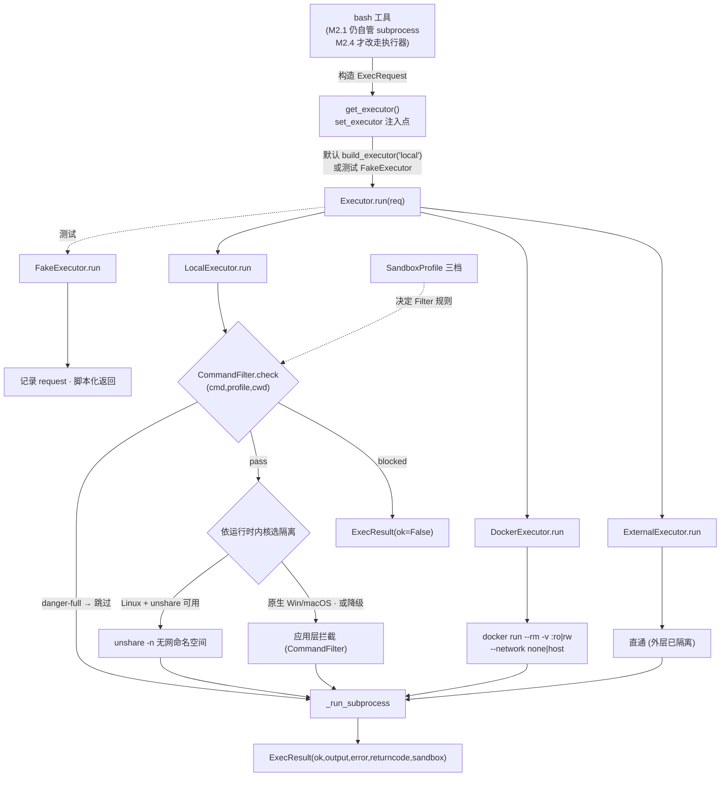
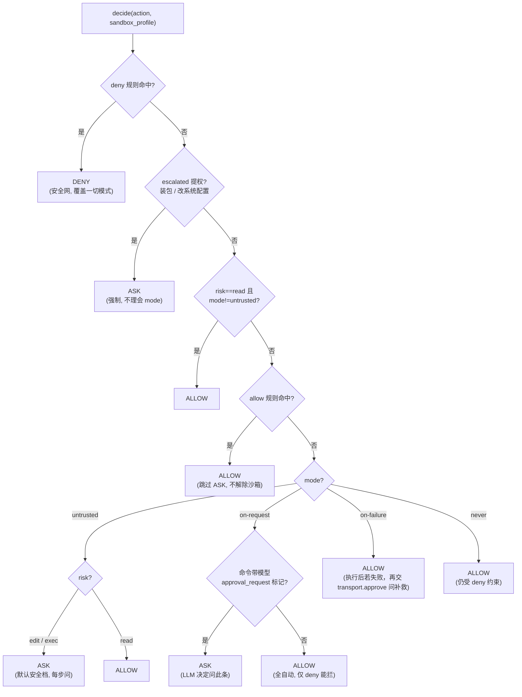

# 项目知识库索引（knowledge/INDEX.md）

> 跨里程碑共享知识。每个完成的 Step 向此处追加「主题 → 结论 → 来源里程碑/步骤」。开始新步骤前先读本文件恢复上下文。
> 维护规则：只记后续会用到且易忘的接口/约定/决策/坑；可重新生成的代码不记。

---

## 架构决策（来源：调研报告，M1 启动前沉淀，防止遗忘）

- **98/1.6 法则**：AI 只做决策，循环/权限/路由/压缩/持久化全部确定性实现且可独立测试。
- **安全在 OS 层**：沙箱是独立可插拔执行层（Local seccomp / Docker），prompt 仅软约束。→ 影响 M2；**完整设计见 `knowledge/sandbox-approval-design.md`**（Codex 模式：local/docker/external + 三档 profile + 网络默认拒绝 + AskForApproval 四模式）。
- **上下文稀缺**：静态(系统提示/规则) 与 动态(对话/工具结果) 分离；稳定前缀走 prompt caching；超阈值递归摘要。→ 影响 M3。
- **上下文管理设计文档**：`knowledge/context-management.md`（独立文档）。核心结论：**工具结果 = 对话历史，既保存也注入**（伪二选一）；本项目双轨映射——`EventStream` 全量不可变（保存/审计/压缩派生源）vs `conv`/`Session.messages` 可压缩投影（注入）；压缩只作用于 `conv`，绝不碰 `EventStream`；配对铁律（tool_use+tool_result 成对）；借鉴 Claude Code Microcompact/AutoCompact + Codex ContextManager；大输出走子代理隔离（M4）。详见该文档。
- **能力正交**：Tool(原子) / Skill(按需包) / Subagent(隔离上下文) 三层。→ 影响 M4。
- **两条全局主线**：事件流（状态单一事实来源）+ Trace/Span（OTel 语义，父子 parent_id）。→ 事件流在 M1.3 落地，trace 在 M1.6（原 M1.4）占位，M5 完善。
- **可恢复**：检查点用 `session_id` + sqlite，路径 `<project>/.agent/sessions/<id>/`。→ 影响 M5 与项目隔离 M?（项目隔离贯穿）。

## 设计文档（standalone，跨里程碑）

- **上下文管理设计**：`knowledge/context-management.md` —— 工具结果「保存 vs 注入」伪二选一的结论、双轨映射、压缩策略（Claude Code/Codex 调研）、配对铁律、子代理隔离、M3 规划。（被「架构决策·上下文稀缺」引用）
- **沙盒与审批设计（M2 依据）**：`knowledge/sandbox-approval-design.md` —— **采用 Codex 模式**：① 原理（P2 安全在 OS 层、P3 最小权限+纵深、与 PLAN 正交）；② 沙盒=可插拔执行层（`local` Linux landlock+seccomp / macOS Seatbelt / Windows 进程级+告警 · `docker` · `external` 直通），三档 profile `read-only`/`workspace-write`/`danger-full`，**网络默认拒绝**；③ 审批=AskForApproval 四模式 `untrusted`/`on-request`/`on-failure`/`never` + `allow`/`deny` 规则（**deny 永远优先**）+ HITL 回调 `AgentTransport.approve`（gate 经窄协议 `ApprovalUI` 消费）；④ 决策流（loop→gate→sandbox）、决策矩阵、与既有设施边界。**落地步骤见 `milestones/M2-安全与确认/`（2.1~2.6）。**

## 工程约定

- 语言 Python 3.12+；CLI 用 typer；异步 asyncio；配置 pydantic-settings + YAML 分层。
- LLM 一律可 Mock：`Model` 抽象 + `FakeModel`/`RecordingModel`，测试不依赖真实 API。
- 目录：`agent/core`(循环/意图/模型)、`agent/runtime`(注册/审批/沙箱)、`agent/context`、`agent/skills`、`agent/subagent.py`、`agent/resilience`、`agent/obs`、`agent/config`、`tools/`、`skills/`、`tests/`。

---

## 环境与 Provider（来源：M1 启动前约定，M1.1 重构后）

- **provider 无关**：底层统一走 OpenAI 兼容协议（`/v1/chat/completions`）。代码里没有「DeepSeek」硬编码——`OpenAICompatibleModel` 只是默认实现。换 API 只改 `.env` 的 `LLM_API_KEY` / `LLM_BASE_URL` / `LLM_MODEL`，不动代码。
- 默认值指向 DeepSeek：base `https://api.deepseek.com`，模型 `deepseek-v4-flash`（用户指定）。
- 配置加载：通过 `pydantic-settings` 读 `.env`（`LLM_*` 前缀）+ 环境变量；CLI 参数优先级最高。
- **流式**：`Model` 协议含 `stream(messages) -> AsyncIterator[StreamEvent]`；`StreamEvent` 分 `text`（增量）与 `done`（回传完整 `Decision`，含流式聚合的工具调用）。CLI/循环优先用流式实现实时输出。
- 测试一律用 `FakeModel` / `RecordingModel`，或向 `OpenAICompatibleModel` 注入假 client（不联网）；CI 中可用占位 key。

## M1.1 沉淀（脚手架 + Model 抽象）

- **模型边界铁律**：`Model.act(messages) -> Decision`，模型只决策不执行工具；工具执行在 M1.2 接入。
- **关键接口**（`agent/core/model.py`）：`Message(role,content,tool_calls,tool_call_id)`、`Decision(text,tool_calls)`（`is_final`）、`ToolCall(id,name,arguments)`、`StreamEvent(type,text,decision)`（流式）；`Model` 协议含 `act` 与 `stream`；`FakeModel(script)`/`RecordingModel(decision|on_act)` 作测试替身；`OpenAICompatibleModel.from_settings(settings)` 离线构建（provider 无关）；`create_model(settings)` 工厂。
- **配置**（`agent/config/settings.py`）：分层 YAML + env + CLI。**优先级（高→低）**：`CLI(init) > 环境变量/.env > 项目级 YAML > 用户级 YAML > 内置默认`。`load_settings(project_root=, **overrides)` 供 CLI/嵌入覆盖；默认 `llm_model="deepseek-v4-flash"`、`max_iterations=25`。
- **配置分层实现要点（M1.1 补）**：自定义 `YamlConfigSource(PydanticBaseSettingsSource)`，`__init__` 预加载「用户级→项目级」合并（项目级覆盖用户级）、`get_field_value` 逐字段返回（pydantic-settings 主循环用 `get_field_value` 而非 `__call__`，这点易踩坑）；`settings_customise_sources` 排序 `init>env>dotenv>YamlConfigSource>file_secret`。YAML 支持扁平键或嵌套 `llm:` 块（自动展平）。路径：`~/.agent/settings.yaml`（用户）、`<project>/.agent/settings.yaml`（项目，gitignore），可被 `AGENT_USER_CONFIG_DIR`/`AGENT_PROJECT_ROOT` 覆盖。**密钥走 `.env`/`LLM_API_KEY`，不写 YAML。** 模板 `agent/config/settings.example.yaml`。
- **Tracer**（`agent/obs/tracer.py`）：`span(name,kind,parent)` 上下文管理器 + `render()` 父子树；M5 接 OTel。
- **测试**：`asyncio_mode="auto"`；`monkeypatch.setenv` 验分层。
- **约束**：`Decision.tool_calls` 形态是 M2 审批 / M3 压缩的输入；Tracer parent 是 M5 父子 span 基础。

## M1.2 沉淀（工具注册与内置工具）

- **注册抽象**（`agent/runtime/registry.py`）：`tool(name, risk, schema)` 装饰器套 `async (args:dict)->ToolResult`，返回 `ToolSpec`（不自注册）；`ToolRegistry.register/get/list/run/to_openai_tools`，未知名抛 `UnknownTool`；`ToolResult(ok,output,error)`；`default_registry` 全局单例，且 `tools/` 在导入时登记。`risk ∈ {read,edit,exec}`（M2 审批用，register 校验）。
- **内置工具**：`tools/fs.py`(read/write，工作根=进程 cwd，拒绝路径遍历)、`tools/bash.py`(异步子进程，捕获 stdout/stderr/rc)。
- **测试**：`default_registry.run("name", args)` 调度；read/write 用 `monkeypatch.chdir(tmp_path)` 隔离；bash 超时用 `python -c "import time; sleep(5)"`（跨平台）。**bash 吞超时**：返回 `ToolResult(ok=False,error="timed out")`，不抛异常。
- **Windows 子进程大坑**：`create_subprocess_shell`→`cmd.exe` 派生，仅 `proc.kill()` 留孤儿持管道；ProactorEventLoop 下 `wait_for(communicate)` 无法取消管道读。**正确超时**：`asyncio.wait({communicate_task, sleep(t)}, FIRST_COMPLETED)` 竞速 + Windows `taskkill /F /T /PID`(Unix `proc.kill()`) 杀树。
- **pytest 发现**：新子包需 `pip install -e .` 刷新 + `pyproject.toml` 加 `pythonpath = ["."]`。
- **对 M2 约束**：`risk` 是审批/沙箱输入；`ToolResult` 是事件流 tool 回执统一形态。
- **工具输出上限（M1.2 后补）**：`Settings.max_tool_output_chars`（默认 20000，保护上下文）。`ToolRegistry.run(name, args, max_output_chars)` 在**集中入口**截断超长 `output`/`error` 并附 `[output truncated: N chars, kept first M]` 提示；`ok` 标记与错误语义不变。循环 `_exec_tools` 内传入 `settings.max_tool_output_chars`，故事件流与回填 messages 中输出一致被截断。`max_output_chars=None` 表示不限制（测试直调可用）。截断函数 `_cap_result` 为模块级纯函数。
- **read 工具支持分页 + 行号（M1.2 增强，用户反馈）**：`read`（`tools/fs.py`）新增 `offset`(1-based 起始行) 与 `limit`(行数) 参数；输出带行号（`N: 内容`）并在头部标注 `lines A-B of TOTAL`，避免长文件被 `max_tool_output_chars`(默认 20000) 截断；`offset` 超界返回 `beyond end` 提示。回归：`tests/test_tools.py::test_read_paginate_offset_limit` / `test_read_offset_beyond_end`。
- **新增 `grep` 工具（M1.2 增强，用户反馈，risk=read）**：在**单文件**内按 Python 正则搜索，返回带行号匹配行（`> N: ...` 标记匹配行，空格行是 `context` 上下文）；参数 `pattern`/`path`/`context`(默认0)/`ignore_case`/`max_matches`(默认50)。用途闭环：**grep 定位行号 → read(offset/limit) 精确读范围**，避免一次读大文件撑爆上下文。整目录递归搜索用 bash 的 `grep`/`rg`（白名单已放行，PLAN 模式可用）。回归：`tests/test_tools.py::test_grep_finds_lines_with_numbers` / `test_grep_context_and_no_match`。
- **写/改工具增强（用户反馈，risk=edit）**：
  - 新增 **`edit` 局部替换工具**（`tools/fs.py`，与 write 同 risk=edit）：参数 `path`/`old_string`/`new_string`/`replace_all`(默认 false)。`old_string` 缺失→`not found`；非 `replace_all` 且出现多次→报错要求补充上下文或 `replace_all=true`（避免歧义误改）。单一匹配用 `text.replace(old,new,1)`，`replace_all` 用 `text.replace(old,new)`。
  - `write` 改为**覆盖写**并生成 unified diff；新建文件 diff 全为 `+` 行。
  - **diff 回传**：`ToolResult` 新增可选 `diff: str|None` 字段（写/改类工具回传，供 UI 展示；不计入 `output` 截断，但 `_cap_result` 重构时须保留 `diff` 透传，否则被丢）。diff 由 `tools/fs.py:_make_diff(path,old,new)` 用 `difflib.unified_diff(keepends=True, lineterm="")` 生成。
  - **UI 展示**：CLI `_RichPresenter.on_tool_result` 对 `write`/`edit`（`WRITE_TOOL_NAME`/`EDIT_TOOL_NAME` 常量）用 `rich.syntax.Syntax(diff,"diff",theme="ansi_dark")` 渲染「✅ {name} — {output}」绿色面板（diff 超 6000 字符截断），替代原「仅字符数」的纯文本——即用户要的「写入命令流式输出+diff」。其余工具仍走 Markdown 面板。回归：`tests/test_tools.py::test_write_returns_diff` / `test_edit_replaces_single_occurrence` / `test_edit_requires_unique_old_string` / `test_edit_replace_all` / `test_edit_old_string_not_found`。
- **`find` 在 PLAN 模式默认已放行（澄清，用户曾误报被拦）**：`Settings.plan_mode_bash_allow`（默认白名单）已含 `find`/`grep`/`rg` 等只读探索命令；用户报告「find 被 plan mode blocks mutating bash 拦截」是因跑了更旧、白名单尚未含 `find` 的版本。当前 `is_readonly_command` 对 `find . -name ... -not -path ... -type f 2>/dev/null || echo ...` 判定只读(True)并放行（回归 `tests/test_plan.py::test_plan_mode_allows_find_command`）。**隐患**：白名单只查命令前缀 `find`，不细分参数，故 `find . -name x -exec rm {} \;` 也会放行——需更细粒度时在 `is_readonly_command` 加参数级判断。**配置注意**：`settings.yaml` 里写 `plan_mode_bash_allow` 会**整体覆盖**默认列表（pydantic list 非追加），别误删 `find`。

## M1.3 沉淀（ReAct 循环 + 事件流）

- **模块**：`agent/core/events.py`（`Event`/`EventStream`，`to_json`/`from_json` 重放）、`agent/core/loop.py`（`AgentLoop`、`AgentResult`、`LoopMaxIteration`/`LoopStalled`）。`agent/core/__init__.py` 已重导出。
- **接口**：`AgentLoop(model, registry, settings, tracer=None)`、`async run(task)->AgentResult(text,events,iterations)`；`Event(seq,type,ts,decision,tool_use,tool_result,tool_call_id,text,error)`，`type ∈ {decision,tool_use,tool_result,final,error}`；`EventStream.append/to_json/from_json`。
- **工具调用语义**：同一次 `Decision` 内多 `tool_calls` 用 `asyncio.gather + Semaphore(settings.max_tool_concurrency)` **并发**；轮间串行（依赖 `tool_result` 回填）。结果经 `tool_call_id` 配对，执行/回填顺序解耦。`UnknownTool`/工具异常降级为 `ToolResult(ok=False)` 事件，**不崩循环**（模型自纠）。
- **重复/卡死检测（两层）**：`max_iterations` **软上限**（触顶不再抛 `LoopMaxIteration` 中断——改为返回带提示的 `AgentResult，mark `soft_limit_hit=True` 并把累计 `messages` 交回，会话层可续、用户「继续」接棒，不丢历史）；`LoopStalled` 语义检测——`callset = frozenset((name, canonical(args)))`，`canonical=json.dumps(sort_keys=True)` 使参数顺序无关，相邻轮相同计数达 `settings.max_repeat_calls` 即判原地打转（仍**硬中断**，因表示模型真打转需人工介入）。**stall 在「执行后」判断**：触发时工具已执行 `max_repeat_calls+1` 次。`LoopMaxIteration` 类保留仅作导出命名空间兼容。
- **新增配置**（`Settings`）：`max_tool_concurrency: int = 5`、`max_repeat_calls: int = 3`（与 `max_iterations` 同机制，支持 YAML/env/CLI 覆盖）。
- **事件流即单一事实来源**：决策/工具调用/结果/结束全落事件，供 M5 trace、M5 恢复、M3 压缩派生。`seq` 单调递增，重放按 `seq` 保真。
- **踩坑**：① dataclass 默认值字段须后置，`Event.seq=-1` 放最后；② `append` 同步无 await，并发赋值 `seq` 安全；③ gather 保序，`zip(calls,results)` 配对；④ stall 执行次数 = `max_repeat_calls+1`；⑤ 异常在 `_one` 内 catch 降级。
- **踩坑⑥（纯文本刷屏死循环，易忘）**：DeepSeek/OpenAI 在「带 `tools` 的**纯文本回复**」时，偶尔会在流式末尾附带一个 `name` 为空的 `tool_call`（流式协议边界噪声）。若不过滤，`decision.tool_calls` 非空 → `is_final=False`（定义见 `model.py`：`is_final = not tool_calls`）→ 落入执行分支，空 name 被 `registry.get("")` 当 `UnknownTool` 降级为 `ToolResult(ok=False)`，模型下一轮又输出相同文本，造成「同一段文本反复快速刷屏」。**修复**（`loop._decide` 收尾）：`decision.tool_calls = [tc for tc in decision.tool_calls if tc.name and tc.name.strip()]`。过滤后纯文本回复 `tool_calls=[]` → `is_final=True` → 直接作为 final 返回。回归测试：`tests/test_loop.py::test_empty_name_toolcall_treated_as_final`。**判据**：终端只出现纯文本"💬 模型输出"面板、无"🔧 工具调用"面板却不停重复 → 即此问题（而非 stall，stall 会在 `max_repeat_calls+1` 轮抛 `LoopStalled`）。

<!-- 以下由后续步骤追加 -->

## M1.5 沉淀（意图澄清 + 框架重构）

- **控制工具集中化**（`agent/core/control_tools.py`，新增）：所有控制工具 schema 与名常量单一事实来源——`ASK_CLARIFICATION_TOOL` / `PRESENT_PLAN_TOOL` / `UPDATE_PLAN_TOOL`，导出 `collect_control_tools(settings, *, plan_mode, has_plan) -> list[dict]` 按模式取用。**`update_plan` 仅「执行期且已知 plan_path」（`has_plan and not plan_mode`）并入**（呼应「update_plan 用于更新计划进度、应在非 plan 模式使用」）。`AgentLoop._model_tools()` 委托它，`loop.py` 零内联工具定义。
- **意图解析**（`agent/core/intent.py`）：`Question` + `to_dict/from_dict`、`extract_clarify(decision)->list[Question]|None`（澄清优先、忽略同轮其它调用；questions 空则 None）；仅从 `control_tools` 复用 `ASK_CLARIFICATION_TOOL_NAME`。
- **提示词外置**（`agent/core/prompts.py` + `agent/prompts/system.md`，新增）：主流「frontmatter(YAML) + Jinja2 模板」结构；`load_prompt(name).render(clarify_enabled, plan_mode, has_plan)`。`AgentLoop._system_prompt()` 委托渲染，与代码分离、可版本化、可项目覆盖。运行依赖新增 `jinja2`。
- **流式输出**（`agent/core/loop.py`）：`_decide(stream)` 改走 `model.stream(messages, tools=...)`，逐片 `Event(type="text", kind=...)`（kind∈{"reasoning"思考,"content"输出）+ 收尾 `Decision`；流式文本实时回调 `presenter.on_text(text, kind)`，工具调用/结果在 `_exec_tools` 回调 `presenter.on_tool_call/on_tool_result`（presenter 为 None 时静默）；事件序列在最终 `decision` 前多一个 `text` 事件（`test_basic_flow_records_events` 已更新）。
- **对话历史由会话层持有（loop 无状态）**（`agent/core/loop.py`）：`run(task, messages=None, *, clarify_total=0)` 接收会话历史（user/assistant/tool，不含 system）、回传 `AgentResult.messages`（更新后历史）/`AgentResult.clarify_total`（累计计数）；system 提示由 loop 临时拼接、不写入会话历史。loop 实例不保存任何对话——跨 run 连续性由会话层决定（M5 的 sqlite 会话直接持久此列表）。澄清回填 = 会话层用答案作为新 task、带上旧 `messages` 再次 `run`。
- **共享基础设施**（`Model.act/stream` 透传 `tools`）：OpenAI 兼容模型非空才透传 `tools=`；FakeModel/RecordingModel 记 `tools_seen`。M1.4 直接复用，无需重做。
- **循环闸门**：澄清闸门在 decision 之后、final/执行之前（最前）；命中即 `emit clarify` + 提前返回 `AgentResult(needs_clarification=True, questions)`，**澄清前不执行任何工具**。`AgentResult` 增 `needs_clarification/ questions`。
- **事件/配置**：`Event.type` 增 `"clarify"`、`"text"`（流式复用既有 `text` 字段）；`Event.questions: list[dict]|None`（JSON 友好，不反向依赖 intent）；`Settings` 增 `clarify_enabled=True` / `max_clarify_rounds=2` / `clarify_hint_min_chars=0`。
- **关键决策**：`max_clarify_rounds` 防呆用**会话级累计** `clarify_total`（随 `run` 传入、`AgentResult.clarify_total` 回传，非重跑重置），否则防呆不可达；第 `max+1` 次起不再 early-return，`ask_clarification` 作为未知工具降级，迫使 final。
- **对 M1.4/M1.6 约束**：M1.4 直接复用 `control_tools.py`（加 `present_plan`/`update_plan` 处理）+ `prompts/system.md`（plan/update_plan 分支已在模板预留）+ 流式 `_decide`，无需重做基础设施；M1.6 CLI 负责「收 answers → 再次 `run(答案)` 续上下文」「`--no-clarify` 关澄清」「串联 澄清→计划→执行」。
- **测试**：`tests/test_intent.py`（11 用例）；`tests/test_loop.py::test_basic_flow_records_events` 已含流式 `text` 事件断言；全量 `pytest` 59 passed（含 M1.4 plan + M1.6 cli）。
- **澄清引导铁律（system.md 的 clarify 段，易忘）**：模糊任务必须用 `ask_clarification` **工具**，禁止在 final 文本里用散文反问（如"你是指 X 还是 Y？"）——散文问题会被 harness 忽略且浪费轮次。每条问题尽量带 `options` 候选，便于 CLI 渲染选择（单选 prompt_toolkit 下拉箭头 / 多选编号列表+自由输入，`multiSelect:true` 多选；选项会显式打印进面板始终可见）；一次调用可问 1–3 个问题。前车之鉴：DeepSeek 曾在 PLAN 模式（bash 全拦时）陷入"反复尝试 bash 被拦 → 用散文追问"的死循环，既没澄清也没进展；故 prompt 必须硬约束「用工具而非散文」。
- **踩坑：澄清/计划提前返回后再跑报 400（`tool_calls` 后缺 tool 回执，易忘）**：`loop.run` 的澄清闸门与 PLAN 的 `present_plan` 闸门会**提前 return** 并把 `assistant(tool_calls=[...])` 写进 `conv`。但会话层（`session.step`）拿到答案后是把答案作为**新 user 消息**续跑（`current_task="question: answer"`），于是消息序列成了 `assistant(tool_calls) → user`——违反 OpenAI/DeepSeek 协议「带 `tool_calls` 的 assistant 消息必须紧跟每个 `tool_call_id` 的 tool 回执」，真实 API 报 `400 insufficient tool messages following tool_calls`（FakeModel 不校验故测试期发现不了）。**修复**：两个提前返回处只保留对应控制工具调用（`ask_clarification` / `present_plan`），并**各补一条 `Message(role="tool", tool_call_id=tc.id, content=占位说明)`** 再 return。回归测试 `tests/test_intent.py::test_clarify_messages_have_tool_receipt_for_protocol`（含 `_assert_toolcalls_have_receipts` 协议顺序校验器）。**判据**：终端出现 `BadRequestError 400 ... must be followed by tool messages` 且发生在「澄清回答之后 / 计划确认之后」的续跑 → 即此问题。
- **踩坑：澄清面板与流式文本同行粘连（CLI 渲染，易忘）**：模型的流式 reasoning/content 用 `end=""` 打印且流末不补换行；澄清 Panel（`_TyperUI.ask` / `show_questions`）紧接其后打印会与文本挤在同一行。修复：在 `ask`/`show_questions` 打印面板前先 `self._console.print()` 空一行；无 options 的 `typer.prompt` 也在问题前加 `\n`。

## M1.4 沉淀（PLAN 模式：计划落盘 + 进度更新 + 风险门控）

- **计划即工件**（`agent/core/plan.py`，新增）：`PlanStatus`、`PlanStep(id,title,status,detail?)`、`Plan(body,steps,path?)`、`PlanStore.write_plan/read_plan/update_step`。Markdown 渲染：`# Plan` + 正文 + `## Steps` + `- [mark] S1 — title`；状态标记 ASCII：`pending→[ ]`/`in_progress→[~]`/`done→[x]`/`blocked→[!]`/`skipped→[-]`。`read_plan` 剥离首行 `# Plan` 标题仅留用户正文，render↔parse 对称。
- **PLAN 闸门（loop）**：plan 模式下 `decision` 含 `present_plan` → `PlanStore.write_plan` 落盘 `settings.plan_file` + `emit Event(type="plan")` + 提前返回 `AgentResult(plan, plan_path, plan_steps, needs_plan_confirm=True)`，**不执行任何工具**（含 mutating 被风险门控拦）。
- **update_plan 虚拟工具**：执行期（plan_mode=False 且 plan_path 已知）模型调 `update_plan(step_id,status,note?)` → `PlanStore.update_step` 回写计划文件 + `emit Event(type="plan_progress", plan_path, plan_update)` + 返回 `ToolResult(ok=True)`；不进 registry，由 `_exec_tools` 分支先处理，享受 tool_call_id 配对。
- **风险门控（plan 模式）**：`_risk_blocked(risk)` 比较 `RISK_LEVELS.index(risk) > index(plan_mode_block_risk_above)`；默认阈值 `"read"` → 只放行 read，拦 edit/exec（确定性兜底，不依赖 prompt 软约束）。`unknown tool` 同样降级为 `ToolResult(ok=False)`。
- **配置**：`Settings` 增 `plan_mode=False` / `plan_mode_block_risk_above="read"` / `plan_file=".agent/plan.md"`。
- **模式按轮次可切换（用户诉求）**：`plan_mode`/`plan_path` 是 `AgentLoop.run(task, ..., plan_mode=, plan_path=)` 的**可覆盖入参**（与 `clarify_total` 同一思路），为 `None` 时回落构造期缺省。loop 实例本身**不保存任何模式状态**，因此「plan/exec 自由切换」由会话层（`agent/core/session.py` 的 `Session`）持有并在每次 `run` 间传入；同一会话可在任意轮次切回 PLAN 再探索、或切到 EXEC 执行。详见 `test_plan.py::test_mode_switchable_per_run`。
- **事件**：`Event.type` 增 `"plan"`/`"plan_progress"`；`Event.plan_path`/`plan_update`（JSON 往返保真）。
- **踩坑**：① 步骤行解析标记在 index 3（`- [ ]` 中第 4 字符），内容从 index 6 起；② 澄清/计划提前返回前需 `conv.append(assistant消息)` 保持历史连贯（会话层续接时模型看到自己已提问/已交计划）；③ update_step 找不到 step_id 抛 `KeyError` → loop 捕获转 `ToolResult(ok=False)`；④ plan 文件相对 cwd，测试用绝对 `tmp_path` 覆盖；⑤ update_plan 与同轮真实工具混排互不干扰（每 `tool_call` 独立走 `_one`）。
- **对 M1.6 约束**：CLI `run --plan` 用两阶段 loop（plan 模式落盘 → 确认 → exec 模式带 plan_path），直接消费 `AgentResult.needs_plan_confirm/plan_path`。
- **步骤结构化存储（用户诉求，plan 工件重构）**：计划步骤改为**独立 JSON** 存储——`plan.md` 仅存人类可读正文 + 一份由 JSON 生成的 `## Steps` 镜像（镜子，非来源）；权威步骤在 **`plan.steps.json`**（`[{id,title,status,detail}]`，与 `plan.md` 同目录、同名换后缀）。`PlanStore._steps_path(plan_path)` 推导 JSON 路径；`write_plan` 同时写 md+json，`read_plan` 优先读 json（缺失才回退解析 md `## Steps`），`update_step` 改写 json 并同步刷新 md 镜像。好处：步骤更新稳健、避免 Markdown 复选框脆弱解析；CLI 展示进度直接读 JSON。**进度可视化**：`LoopPresenter` 协议新增可选 `on_plan_progress(plan)`；`loop._exec_tools` 在 `update_step` 返回最新 `Plan` 后调 `getattr(presenter,'on_plan_progress',None)`（未实现静默跳过）。CLI `_RichPresenter.on_plan_progress` 渲染「📋 计划进度」步骤列表面板（状态色：pending白/in_progress黄/done绿/blocked红/skipped暗）；`on_tool_call` 对 `update_plan` 渲染专属「📋 计划更新」面板（S1 → in_progress），`on_tool_result` 因其进度已由 `on_plan_progress` 展示故跳过通用结果面板。`_TyperUI.show_plan` 与 `on_plan_progress` 共用模块级 `_render_steps_panel(steps,title)`。回归：`tests/test_plan.py` 全绿（md 镜像仍含 `## Steps` 与 `- [~] S1`）。

## M1.6 沉淀（CLI 入口 + 最简可观测）

- **CLI**（`agent/cli.py`，新增）：`typer` 应用，`run`/`chat` 子命令；`python -m agent.cli` 可运行（`if __name__=="__main__": app()`）。
- **会话层**（`agent/core/session.py`，新增）：`Session`（会话状态持有者）从 CLI 抽到 **core 层**，不依赖 typer；持有消息/澄清计数/当前模式/已知计划，`Session.step(task, ui, *, yes, fatal_plan_decline)` 处理澄清回填与计划确认。人机交互经 `SessionUI`（Protocol）注入解耦：CLI 提供 `_TyperUI` 实现（`ask`/`show_questions`/`show_plan`/`confirm_plan`/`notify` + `interactive` 属性），测试可注入假实现驱动分支、无需真实 IO。
- **run**：`--plan/--no-plan`（默认取 `settings.plan_mode`，作为**初始模式**）、`--yes`（跳过计划确认）、`--no-clarify`（关澄清）。流程：`load_settings` → `_build_model(settings)`（**测试可 monkeypatch `agent.cli._build_model` 注入 FakeModel**）→ `Tracer` → `Session` + `_TyperUI(interactive=isatty())`；澄清回填（交互逐题收集、非交互报错退出 code 2）与计划确认（确认后切 EXEC 续跑、未确认在 run 下退出 code 1）。
- **chat**：REPL，单 `Session` 持续累积 `messages`，`exit/quit` 退出；**任意轮次可用命令自由切换模式**：`/plan`（探索）`/exec`（执行）`/approve`（批准当前计划并切 EXEC）`/mode`（查看当前模式）。输入 `/plan`/`/exec` 仅改 `Session.plan_mode`、不调模型。
- **chat**：REPL，单会话持续累积 `messages`（复用同一 `AgentLoop`，会话层持有历史），`exit/quit` 退出，结束打印 trace。
- **trace（最简可观测）**：`loop.run` 包裹 `tracer.span("agent.run")`；`_exec_tools` 每工具 `span("tool.exec", parent=agent_span)`；`_decide` `span("model.act", parent=agent_span)`。`render()` 输出父子树，体现 `tool.exec` 的 parent 是 `agent.run`。
- **退出码**：0 成功；1 异常/计划未确认；2 需交互澄清但非交互（不静默跳过）。
- **渲染层（rich，`_RichPresenter`）**：CLI 用 `rich` 实现 `LoopPresenter`（`agent/core/presenter.py` 的 Protocol），把 ReAct 循环内部事件实时渲染成交互终端输出，**区分「思考/输出/工具调用」**：`reasoning` 暗色**纯文本增量**打印（不进框）；`content` 用单个 `rich.live.Live` 渲染**带框的 Markdown 面板**（`💬 模型输出`，流式时裁高防刷屏、段结束定稿完整版）；工具调用/结果用 `Panel`（结果体走 Markdown）。`Session.step(task, ui, *, presenter=...)` 透传 presenter 到 `AgentLoop.run(presenter=...)`；core 层不依赖 rich。
- **踩坑⑤（模型输出被重复刷屏，务必与「踩坑⑥纯文本死循环」区分！）**：现象是终端里同一段较长的「💬 模型输出」面板出现十几份**内容完全相同**的副本，但 **trace 里 `model.act` 次数正常、token 各不相同 → 模型并没有重复输出**，纯属 **CLI 渲染 bug**。两个叠加根因：① 旧实现用 `rich.live.Live` 流式渲染 Markdown 面板，**`Live` 只能在内容不超过终端可视高度时原地覆盖**；一旦面板比屏幕高（如长文件摘要），每次 `refresh()` 就整块重打印，流式那轮几十个 chunk 就在滚动区留下十几份相同面板。② 旧 `_RichPresenter._buf` 跨模型轮次**从不清空**，把每轮文本累积重画，放大问题。**修复（演进版，最终方案）**：仍用 `Live` 渲染**带框 Markdown**，但做三件事杜绝刷屏：① 每个内容段用独立 `_buf`，`Live` 在段开始 `start()`、段结束（`on_tool_call`/`on_tool_result`/`close`）`stop()` 后丢弃，**绝不跨段累积**；② 流式时 `_render_content(cap=True)` 把面板裁到屏幕高度内（只显示最近内容，`_max_lines = console.size.height - 4`），就地刷新（同高→不滚动、不重发）；③ 段结束 `stop()` 用**完整**面板定稿打印一次（仅一次滚动，不刷屏）。思考 `reasoning` 维持暗色纯文本增量（不进框）。回归：`pytest -q` 全绿。**判据速记**：`trace` 里模型次数正常但终端刷屏 → 渲染 bug（本条）；终端只有「💬 模型输出」无「🔧 工具调用」却反复出现 → 空 name tool_call 死循环（踩坑⑥）；`max_repeat_calls+1` 轮抛 `LoopStalled` → 模型真的原地打转。
- **token 用量（usage）**：`Decision.usage`（`prompt_tokens`/`completion_tokens`/`total_tokens`）由 `OpenAICompatibleModel` 从响应 `usage` 解析（流式需 `stream_options={"include_usage": true}`，取末个 usage-only chunk；`act` 用 `getattr(resp,"usage",None)` 容错假 client），并从 `delta.reasoning_content`（DeepSeek 思考）解析出 `kind="reasoning"`。`AgentLoop.run` 逐轮累加进 `AgentResult.usage`，**每轮 ReAct 循环结束**（`run`/`chat` 的 `step` 后）由 `_RichPresenter.report_usage` 打印。
- **测试**：`tests/test_cli.py` 用 `CliRunner` + monkeypatch 注入 FakeModel，覆盖 run 跑通+退出码0+含 trace / `--plan`+`--yes` / 澄清非交互退出2 / trace 父子关系（`tracer.spans` 断言 `tool.exec.parent_id == agent.run.id`）；`tests/test_loop.py` 新增 `test_usage_accumulates_across_iterations`（usage 跨轮累加）与 `test_presenter_receives_streaming_and_tool_events`（presenter 流式文本/工具回调）。`tests/test_plan.py` 覆盖 M1.4 验收。全量 `pytest` 64 passed。
- **踩坑**：① 澄清问题打印到 stderr，测试断言用 `result.output`（CliRunner 合并输出）；② `_build_model` 抽成模块级函数便于测试注入，避免 CLI 写测试专用分支；③ `run` 内 try/except 把未捕获异常转退出码 1，避免栈溢出到用户；④ trace 始终打印（即便失败），便于排障。
- **踩坑⑥（plan 确认崩溃 + exec 模式拿不到 update_plan）**：① `SessionUI.confirm_plan` **必须是 async**（`_TyperUI.confirm_plan` 用 `PromptSession.prompt_async`）。它从 `Session.step` 的 `asyncio.run()` 事件循环内被 `await` 调用；若用**同步** `PromptSession.prompt()`，prompt_toolkit 会在已有 loop 里再 `asyncio.run()` → 抛 `RuntimeError: asyncio.run() cannot be called from a running event loop`（恰好发生在计划已展示、要确认的那一刻，现象是「📋 计划步骤」面板已显示随后崩溃）。`ask`/`show_questions` 已是 async（`prompt_async`/`app.run_async`），只有 `confirm_plan` 漏改。② `update_plan` 仅 `has_plan(=bool(plan_path)) and not plan_mode` 时下发（`control_tools.collect_control_tools`）；而 `Session.plan_path` 原只在确认**批准**后才设置 → 一旦 ① 的崩溃使批准永远失败，`plan_path` 恒为 None → exec 模式永远无 `update_plan`。**修复**：`needs_plan_confirm` 时**立即** `self.plan_path = res.plan_path`（批准前也记录，供后续 exec 轮次启用 update_plan）；`/exec`/`/approve` 若 `plan_path` 为空但 `settings.plan_file` 已落盘则自动载入。回归：`tests/test_plan.py::test_exec_turn_gets_update_plan_after_present` / `test_plan_present_records_path_even_if_declined`。**判据**：chat 里 `/plan` 出计划后切 `/exec`，模型仍拿不到 `update_plan` → 即此问题（plan_path 未记录）。
- **踩坑⑦（澄清多选 CheckboxList 卡死/选项不显示）**：交互式多选原用 `prompt_toolkit.Application(layout=Layout(CheckboxList(...)), full_screen=False)`。**绝不能**在 rich 已占用 stdout 的 TTY 下这么用——它在已有终端输出之上启动非全屏 Application，会**既把终端状态搞乱（残留空「❓ 澄清」面板）、又不渲染选项、回车无反应、程序卡死**。修复：`_ptk_multi_choice` 弃用 `Application`+`CheckboxList`，改为「编号列表 + `PromptSession.prompt_async` 读逗号分隔编号/标签」（`_parse_multi_selection` 为纯解析核心，单测覆盖）；并把选项显式打印进澄清 Panel（`ask`），保证始终可见。单选仍用 `PromptSession.prompt_async(choices=...)` 下拉（正常）。回归：`tests/test_cli.py::test_parse_multi_selection_by_index_and_label`。
- **踩坑⑧（plan 批准后模型仍查 .plan_status / 反复确认）**：确认计划（`confirm_plan` 返回 True→`plan_mode=False`→续跑）后，模型在 EXEC 续跑里只见过 `present_plan` 的工具调用与回执，**缺「用户已批准」信号**，于是误以为仍在 PLAN 模式，去 `bash` 查不存在的 `.plan_status`、甚至再次 `present_plan`——现象即「y/n 确认后仍没通过」。**修复**：`session.step` 批准分支在向 `loop.run` 续跑前，向 `self.messages` 追加一条 `role="user"` 的批准说明（`[System] 计划已批准，进入 EXEC…不要查状态文件、不要再次 present_plan`）；同时 `system.md` 执行段明确「plan 已批准，不要查 .plan_status 等状态文件」。回归思路：`tests/test_plan.py` 的批准续跑用例 + 该批准消息须在 `self.messages` 中。判据：批准后续跑模型仍调用 `bash cat .plan_status` 或再次 `present_plan` → 即此问题。
- **踩坑⑨（write/edit 过程无流式输出）**：`model.stream` 原只把工具调用的 `arguments` 累积到收尾 `done` 事件一次性给出，循环只流式 `kind="content"` 文本 → 大段 `write` 的 `content` 在生成期间终端长时间无输出。**修复**：`StreamEvent` 新增 `type="tool_call_delta"`（携带 `tc_index/tc_name/tc_args` 累计原始 arguments），`OpenAICompatibleModel.stream` 在每个参数片段到达时增量产出；`loop._decide` 把增量回调给 presenter 的 `on_tool_call_delta`（可选方法）；`_RichPresenter.on_tool_call_delta` 用独立 `Live` 实时预览 write/edit 正文（经 `_extract_write_preview` 从可能不完整的 JSON 提取 `content`/`new_string`），`on_tool_call`/`close` 收尾该 Live。FakeModel/RecordingModel 不产 delta→测试零影响。回归：`tests/test_loop.py::test_tool_call_delta_streamed_to_presenter`、`tests/test_cli.py::test_extract_write_preview_from_partial_json`。
- **踩坑⑩（澄清面板选项不显示 / 重复 ask_clarification 面板）**：`ask_clarification` 是**控制工具**，走 loop 的澄清闸门**提前返回**（`loop.py` ① 澄清闸门 `return`，不进 `_exec_tools`）。但 `_RichPresenter.on_tool_call_delta` 在流式阶段已为 `ask_clarification` 创建了参数预览 `Live`；该 Live 正常由 `on_tool_call` 收尾，而澄清闸门下 `on_tool_call` **永不触发** → 残留 Live 把随后的 `❓ 澄清` 面板渲染搞乱（选项被覆盖/不显示、重复出现 `🔧 ask_clarification …` 面板）。**修复**：① `on_tool_call_delta` 对 `ASK_CLARIFICATION_TOOL_NAME` 直接 `return`（不创建预览 Live，因其会立即被澄清面板取代，且避免冗余面板）；② loop `run` 在 `_decide` 返回后调用可选钩子 `presenter.on_decision_done()`，`_RichPresenter.on_decision_done` 统一收尾工具预览 Live + 定稿流式内容段（覆盖「同轮先 write 后 ask_clarification」等边界）。注意：`ask`/`show_questions` 在 **`_TyperUI`**（SessionUI 实现），而 `_tool_live`/`on_decision_done` 在 **`_RichPresenter`**（LoopPresenter 实现）——二者是**不同对象**，不能在 `_TyperUI.ask` 里调 `_stop_tool_live`。回归：`tests/test_cli.py::test_on_tool_call_delta_skips_ask_clarification_live`。

## 重构沉淀（统一传输层 AgentTransport + 事件线格式 + ToolRisk 枚举）

> 来源：与 M2 设计比对后的架构对齐重构（不落地 M2 安全层）。消除「UI/交互耦合」与「同一概念多套表示」，为网页版铺路。详细步骤见 `milestones/M-refactor-统一传输层与事件线格式.md`。

- **双协议合并为单一 `AgentTransport`**（`agent/core/transport.py`，新增；`agent/core/presenter.py` 已删除）：原 `SessionUI`（HITL：interactive/ask/show_questions/show_plan/confirm_plan/notify）与 `LoopPresenter`（`on_text/on_tool_call/on_tool_result/on_plan_progress/on_decision_done/on_tool_call_delta`）分裂为两套接口，且 `LoopPresenter` 部分方法靠 `getattr` 容错（接口漏风）。现统一为 `AgentTransport` 协议：`HITL` 方法 + `bind(stream)`（订阅 `EventStream` 自行渲染）+ `close()` + `report_usage()`。CLI 的 `TerminalTransport` 实现同一协议（rich 终端）。**未来网页版只需再实现一套 `WebTransport` 订阅事件转发 websocket，无需改动 loop/session。**
- **`EventStream` 升级为唯一实时线格式**（`agent/core/events.py`）：新增 `subscribe(sink)`/`unsubscribe(sink)`，`append` 时**同步分发**给所有订阅者；新增 `emit(ev)` 仅分发**不入档**（用于瞬时 `tool_call_delta` 预览，不污染持久化事件序列与 `to_json` 重放）。`loop.run` 创建流后立即 `transport.bind(stream)`，渲染完全由订阅驱动。**铁律：不要再给 loop 加 `presenter` 回调参数**——新增实时渲染请走事件（持久化用 `append`、瞬时预览用 `emit`）。`tool_call_delta` 事件携带 `tc_index/tc_name/tc_args`。
- **事件驱动渲染映射**（CLI `TerminalTransport._on_event`）：`text→on_text`、`tool_use→on_tool_call`（同时把 `tc` 按 `id` 记到 `_tc_by_id`，供 `tool_result` 取工具名）、`tool_call_delta→on_tool_call_delta`、`tool_result→on_tool_result`（`tc` 从 `_tc_by_id` 取）、`plan_progress→on_plan_progress`（增量更新本地 `_plan_steps` 后渲染）、`decision→_on_decision_done`（收尾流式段）。`plan`/`clarify`/`final` 由 HITL（show_plan/show_questions）或已流式文本覆盖，sink 忽略。
- **`ToolRisk(str, Enum)` 取代裸 risk 串**（`agent/runtime/registry.py`）：`ToolRisk.READ/EDIT/EXEC`；`RISK_LEVELS = tuple(r.value for r in ToolRisk)`（register 校验/loop 风险门控仍用该元组比较，向后兼容字符串）。工具用 `risk=ToolRisk.*`（`tools/fs.py`/`tools/bash.py`）。**M2 审批门可直接消费 `ToolSpec.risk` 枚举，无需再做字符串映射。**
- **`fs.py` 去重**：新增 `_load_file(path) -> (Path, str)`（resolve→is_file 校验→read_text），供 `read`/`grep`/`edit` 复用；`edit` 必须保留返回的 `target` 用于写回（`target.write_text(...)`），不要丢弃。原 `write` 的「不存在即空」语义单独保留、不复用 `_load_file`。
- **bash / fs 模块拆分不冗余（评估结论）**：shell 执行 vs 文件系统操作是正交关注点，保留分文件；二者功能重叠（bash 可 cat/grep/echo>）是「逃生舱 vs 路径受限安全工具」的有意设计，非重复实现。**真正冗余只在 `fs.py` 内部样板**，已用 `_load_file` 消除。
- **回归保障**：`tests/test_loop.py` 的 presenter 录制测试改为事件订阅式 `_EventRecordingTransport`；`_Spy` 改为订阅 `tool_call_delta` 事件；`tests/test_cli.py` 用 `TerminalTransport`；`tests/test_plan.py` 的 `_FakeUI` 补 `bind`（loop.run 会订阅）。全量 `pytest` 85 passed。
- **对 M2 约束**：M2 的审批 HITL 回调（M2.5 文档）应加在统一协议 `AgentTransport`（而非新建第三个协议、也非旧 `SessionUI`）；gate 经窄协议 `ApprovalUI` 消费（`AgentTransport` 结构满足）；审批/沙箱门控接入 `loop` 时直接读 `ToolSpec.risk`/事件，不依赖任何 presenter。

## M2.1 沉淀（沙盒执行层 SandboxExecutor）

> 来源：`milestones/M2-安全与确认/2.1-沙盒执行层.md` + `knowledge/sandbox-approval-design.md`。落地 `agent/runtime/sandbox.py`。

**架构示意（命令如何流经沙盒执行层）**：

- **接口签名**：`SandboxProfile(str,Enum)` 三值 `read-only`/`workspace-write`/`danger-full`；`ExecRequest(cmd,cwd,env,timeout=30,profile=WORKSPACE_WRITE)`；`ExecResult(ok,output,error,returncode,sandbox)`（形态对齐 `ToolResult` 的 `ok/output/error`，多 `sandbox` 名）；`Executor` Protocol（`name:str` + `async run(req)->ExecResult`，`runtime_checkable`）；`FilterVerdict(blocked,reason)`；`CommandFilter(workspace).check(cmd,profile,*,cwd)->FilterVerdict`；`LocalExecutor`/`DockerExecutor`/`ExternalExecutor`/`FakeExecutor`；`build_executor(mode,*,workspace,profile)`（mode∈local/docker/external）；模块级 `get_executor()`/`set_executor(ex)` 注入点。
- **设计铁律（对齐设计文档 §2.2）**：`LocalExecutor` 按**运行时内核**选隔离，而非"是否 Windows 机器"——`os.uname().sysname=="Linux"`（含 WSL2，内核≥5.13）走 `unshare -n` 无网命名空间（断网，零依赖）；原生 Windows / macOS 无 Landlock/seccomp 内核原语，**走 `CommandFilter` 应用层主动拦截**（越界写/联网/破坏性→`ok=False`，**不打印告警**）。`unshare` 不可用（旧内核/无权限）时**降级为进程级 + ⚠️ 告警**（`_log.warning`），**绝不抛异常中断 Agent**。
- **诚实边界（M2.1 范围）**：Linux 强隔离 = `unshare -n`（真实断网）+ `CommandFilter`（写/破坏性，应用层纵深防御）；内核级 Landlock/seccomp 的 Python 绑定（`landlock`/`seccomp` 包）留作**后续可选增强**（import 失败即跳过，不影响本模块）。macOS/WSL 之外：原生 Windows + `local` 是应用层强制（可被混淆绕过），真隔离靠 `docker`/`external`。`danger-full` **跳过 `CommandFilter`**——网络与写全部放行（用户显式接受风险）。
- **`CommandFilter` 静默拦截规则**：`read-only` 任意写→拦；`workspace-write` 写目标解析后不在 `cwd` 内→拦（越界写）；`curl`/`wget`/`ssh`/`git clone`/`pip install` 等联网命令→拦（断网 profile）；`rm -rf /`/`dd of=/dev/*`/`mkfs`/fork bomb/重启等破坏性→拦。归一化 `/dev/null` 黑洞重定向与 `2>&1` fd 合并**不计入写目标**（避免误拦 `echo x > /dev/null`）。重定向正则**禁止变长 lookbehind**（`(?<!&\d*)` 会抛 `re.error: look-behind requires fixed-width pattern`）——用 `(?<!&)` + 先把 `&>` 归一为 `>` 处理。
- **`build_executor` 实测映射**：`docker` → `docker run --rm -w /work -v <ws>:/work:<ro|rw> --network <none|host> <image> /bin/sh -c <cmd>`（profile 映射：read-only→`:ro --network none`；workspace-write→`:rw --network none`；danger-full→`:rw --network host`）；`external` → 直通（不隔离，外层负责）；`local` → 见上。
- **可注入（M2.4 衔接）**：`bash` 工具**不直接 `subprocess`**，经 `get_executor().run(ExecRequest(...))`；测试用 `set_executor(FakeExecutor(...))` 替换，确定性、不依赖 root/网络。`get_executor()` 当前按默认 `local + cwd + workspace-write` 构造工厂；**M2.3/2.4 会改为读取 `Settings.sandbox_mode`/`sandbox_profile`**（本步自包含，不依赖尚未落地的配置字段）。
- **不破坏既有**：`bash` 工具本体**本步未改**（仍自管 subprocess，M2.4 才切换执行器）；PLAN 风险门控、`ToolResult` 失败降级、`_cap_result` 截断全部不变。`FakeExecutor` 记 `requests:list[ExecRequest]`，可在测试中断言 `ExecRequest.profile` 形态。
- **落地验证**：`tests/test_sandbox.py`（14 用例）全绿——`build_executor` 按 mode 返回正确实例、四执行器满足 `Executor` 协议、`FakeExecutor` 记录请求+脚本化返回、`ExternalExecutor` 直通 `echo` 成功、`LocalExecutor` 在 CI(Linux/原生Windows/macOS) 跑通 `echo`（不强依赖 root）、`CommandFilter` 拦截网络/越界写/破坏性且静默（断言无 "未隔离" 告警）、`danger-full` 放行网络、注入点 `set/get_executor`。全量 `pytest` 99 passed。

## M2.2 沉淀（审批门 ApprovalGate）

> 来源：`milestones/M2-安全与确认/2.2-审批门.md` + `knowledge/sandbox-approval-design.md` §3。落地 `agent/runtime/approval.py`。

- **接口签名**：`ApprovalMode(str,Enum)` 四值 `untrusted`/`on-request`/`on-failure`/`never`；`Action(tool,risk,args,description,approval_request=False,escalated=False)`；`Decision(verdict,reason)`（`verdict∈{allow,deny,ask}`）；`ApprovalGate(mode, *, allow, deny, ui, noninteractive_default="allow", sandbox_profile="workspace-write")`；`decide(action, sandbox_profile=None)->Decision`（**纯函数**）；`async authorize(action)->bool`（仅 ASK 分支 `await ui.approve`）。
- **决策顺序铁律（安全不变量）**：`deny`(1) > `escalated`(2) > `read 非 untrusted`(3) > `allow`(4) > `mode`(5)。`deny` 优先于**一切**模式（含 `never` 下 deny 仍 DENY）；`escalated` 无视 mode 强制 ASK；`allow` 命中短路 ALLOW（但排在 deny/escalated 之后，故提权/deny 不受影响）。
- **规则匹配**：`allow`/`deny` 字符串列表，支持**前缀匹配**（`rm `/`git push`）与**正则**（`/.../` 包裹，内部 `re.search`）。匹配对象：bash→`args["cmd"]` 经 `_normalize_cmd` 切段+去 `sudo`/`doas`/环境变量赋值（故 `sudo rm x` 被 `rm ` 命中）；`read`/`write`/`edit`→`args["path"]`。正则务必 `/.../` 包裹，裸串按前缀。
- **HITL 协议**：`ui: ApprovalUI`（`runtime_checkable` Protocol，仅 `async approve(action)->bool`），M2.5 在 `AgentTransport` 实现；`gate` 不持有 IO，只在 ASK 分支调回调，确定性可测。`ui=None` 时 ASK 按 `noninteractive_default`（默认 `allow`）放行，不阻塞 CI（你已委派任务且命令进沙箱）。
- **感知沙箱**：`decide` 接收 `sandbox_profile`（包含程度信号），当前决策**不因其改变 verdict**（profile 在执行时由沙箱层 OS 强制隔离，见 M2.1）；签名保留供 M2.4 增强。profile 是"放行后的封顶"，与审批结果正交。
- **裁决树 mermaid**（decide 内部，权威图）：

- **与 PLAN 模式关系**：`ApprovalGate` 仅 EXEC 模式介入；PLAN 的 `_risk_blocked` 不动。纵深两道独立闸门（设计文档 §1）。
- **对 M2.4 约束**：`loop._exec_tools` 执行每工具前构造 `Action` 并 `await gate.authorize`；拒绝/失败返回既有 `ToolResult(ok=False)` 落事件流、不崩循环。`on-failure` 模式 `authorize` 先 ALLOW，失败后再调 `ui.approve`（M2.4 实现）。
- **落地验证**：`tests/test_approval.py` 30 passed；全量 `pytest` 129 passed。覆盖四模式矩阵(12)、deny 优先(含盖过 allow 短路)、allow 短路、escalated 无视模式、on-request 仅 `approval_request` 时 ASK、非交互默认 allow/deny、假 ui 真假、纯函数可重复、`sudo rm` 归一化、正则 `/^curl .*example\.com/`、路径 `/etc/` 匹配、接受 mode 字符串。

