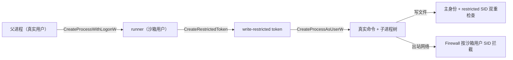

# Windows 硬沙箱设计（对齐 Codex elevated sandbox）

> 独立设计文档（**状态：已对齐 Codex 方案**，2026-08-19 重构）。
> **方案沿革**：最初设计用 AppContainer（见 `docs/windows-appcontainer-hard-sandbox.md`），
> 经调研与实测确认 AppContainer 不适合 Coding Agent 场景（读默认拒绝导致命令跑不起来），
> 先转向「独立低权限沙箱用户 + CreateProcessWithLogonW」，再进一步对齐 Codex 真实方案：
> **专用本地用户 + write-restricted token + 合成 SID `sandbox-write` + ACL + Firewall 按用户 SID
> + DPAPI 凭据 + runner 分层**。本文档为当前生效的工程落地设计。
> 实现代码：`agent/runtime/sandbox_windows.py`（spawner + ACL + DPAPI）、
> `agent/runtime/windows_sandbox_runner.py`（restricted token runner）、
> `scripts/windows_sandbox_setup.ps1`（管理员 setup）、`agent/runtime/sandbox.py`、
> `agent/config/settings.py`。

### 已落地要点（快速索引）

- **隔离选择**：`LocalExecutor._choose_isolation()` 在 Windows 上经 `usable()` 探测返回
  `windows-restricted-user`；`danger-full` 走裸子进程（真实用户，对齐 Codex full access），
  仅 `read-only`/`workspace-write` 走沙箱。
- **沙箱用户**：`CodexSandboxOffline`（断网）/ `CodexSandboxOnline`（联网），属
  `CodexSandboxUsers` 组，由 setup 管理员一次性创建。
- **合成 SID**：`sandbox-write`（`S-1-5-21-<随机4段>`），持久化到
  `<workspace>/.agent/sandbox-write.sid`，用于 ACL 与 restricted token。
- **write-restricted token**：runner 用 `CreateRestrictedToken`（`DISABLE_MAX_PRIVILEGE |
  LUA_TOKEN | WRITE_RESTRICTED`），restricted SID list = `[Everyone, LogonSession,
  sandbox-write]`；写操作必须同时通过主身份检查与 restricted SID 检查。
- **runner 分层**：父进程 `CreateProcessWithLogonW` 以沙箱用户启动
  `windows_sandbox_runner.py`（免提权）；runner 从自身 token 派生 restricted token，
  再 `CreateProcessAsUserW` 启动真实命令。
- **写隔离**：工作区 / `writable_roots` 授予 `sandbox-write` `(OI)(CI)(W,D,AD,DC,X)`；
  `.git` / `.codex` / `.agents` / `.agent` 对同一 SID 显式 Deny Write。
- **读/执行**：setup 给 `CodexSandboxUsers` 组补 workspace 与常见目录（用户目录、
  Windows、Program Files、ProgramData）的 Read/Execute ACL，保证“任意读”。
- **网络隔离**：防火墙规则用 `-LocalUser <CodexSandboxOffline SID>` 精确绑定，禁止该用户出站。
- **凭据**：DPAPI（CurrentUser scope）加密保存 `<workspace>/.agent/sandbox_creds.bin`，
  沙箱用户无法解密；旧版明文 `sandbox_user.txt` 仅作迁移读取，setup 会删除。
- **fail-closed**：Windows 沙箱一旦被选中，初始化/执行失败**不再降级裸执行**；`auto`
  模式在探测失败时才退回 `app-layer`（软沙箱）并打 warning。
- **ACL 由管理员一次性配置**：setup 负责 workspace / `writable_roots` 的授写与 Deny；
  运行时 `prepare()` 只检查凭据/SID 就绪，不再尝试提权跑 icacls。
- **runner 自处理超时**：payload 携带 `timeout`，runner 在沙箱用户内
  `taskkill /F /T` 杀命令树并返回 124；父进程只做 `timeout + 30s` 兜底。

---

## 1. 背景与动机（为什么不用 AppContainer）

- **现状缺口**：早期 Windows 上只有应用层 `CommandFilter` 软沙箱，可被混淆绕过。
- **为何弃 AppContainer**：AppContainer 的“读也默认拒绝”导致两条死路：授任意读则用户文件全暴露；
  授 System32 RX 普通用户做不到（`icacls System32` error 5），命令跑不起来。
- **对齐 Codex 的方案**：独立本地沙箱用户 + write-restricted token + 合成 SID ACL + Firewall
  按用户 SID。读靠主身份 + setup 补 ACL；写靠 restricted SID 双重检查；网络靠专用用户身份。
- **三档映射**：
  - `read-only`：`CodexSandboxOffline` + restricted token + 只补读 ACL（无写授权）+ 断网。
  - `workspace-write`：`CodexSandboxOffline` + restricted token + workspace/writable_roots
    写授权 + `.git` 等 Deny + 断网。
  - `danger-full`：脱离沙箱，真实用户裸跑（联网），与 Codex full access 语义一致。

## 2. 管理员初始化（一次性提权）

`scripts/windows_sandbox_setup.ps1`（**管理员运行一次**）：

| 步骤 | 动作 |
|---|---|
| 创建组 | `CodexSandboxUsers` |
| 创建用户 | `CodexSandboxOffline` / `CodexSandboxOnline`（标准用户，本地登录） |
| 合成 SID | 生成 `S-1-5-21-<随机4段>`，写入 `.agent/sandbox-write.sid`（存在则复用） |
| 凭据 | DPAPI 加密 JSON 凭据写入 `.agent/sandbox_creds.bin`，文件/目录 ACL 收紧 |
| 读 ACL | workspace 递归授予 `CodexSandboxUsers:(OI)(CI)(RX)`；常见目录补读 |
| 写 ACL | workspace / writable_roots 授予 `sandbox-write:(OI)(CI)(W,D,AD,DC,X)` |
| Deny | `.git` / `.codex` / `.agents` / `.agent` 对 `sandbox-write` Deny Write |
| 防火墙 | `-LocalUser <Offline SID>` 禁止 `CodexSandboxOffline` 所有出站 |
| 清理 | 删除旧版明文 `sandbox_user.txt` |

> `-WritableRoots` 可传一个或多个额外路径（如 `-WritableRoots "D:\build","D:\cache"`），
> 与 `settings.yaml` 的 `sandbox.writable_roots` 保持一致；运行时不会修改 ACL。

> 凭据/SID 文件通过 `icacls /inheritance:r /grant:r` 仅授予当前用户、SYSTEM、Administrators，
> 沙箱用户（即使获得自己进程）也读不到 DPAPI 密文。

## 3. 运行时链路（免提权）



- **`CreateProcessWithLogonW`**：无特殊特权要求，只需沙箱用户允许本地登录。
- **runner payload**：父进程经 stdin 管道传 JSON（命令、cwd、env、sandbox-write SID），
  不落盘，避免沙箱用户读取密钥文件。
- **restricted token**：`DISABLE_MAX_PRIVILEGE | LUA_TOKEN | WRITE_RESTRICTED`；
  restricted SID list = `[Everyone(S-1-1-0), LogonSession, sandbox-write]`。
- **输出收集**：runner 继承父进程管道句柄，再传给子进程；超时 `taskkill /F /T` 杀进程树。
- **ACL 幂等**：spawner `prepare()` 进程内只跑一次（`_acl_cache`），避免每条命令都跑 icacls。

## 4. 与现有架构的接入点

```
LocalExecutor._choose_isolation()
  ├─ Linux + unshare 可用 → "linux-kernel"
  ├─ win32 + usable() → "windows-restricted-user"（前两档走沙箱）
  └─ 不可用 → "app-layer"（CommandFilter 软沙箱，打 warning）
```

- `sandbox.py`：`LocalExecutor` 新增 `writable_roots`；Windows 沙箱失败 fail-closed。
- `sandbox_windows.py`：SID / DPAPI / ACL / spawner。
- `windows_sandbox_runner.py`：restricted token + `CreateProcessAsUserW`。
- `settings.py`：`sandbox.writable_roots: list[str]`（对齐 Codex writable_roots）。
- `session.py`：把 `settings.sandbox.writable_roots` 透传 `build_executor`。
- `danger-full` 不创建沙箱进程，走既有裸 `_run_subprocess`。

`<项目根>/.agent/settings.yaml` 配置示例（`auto` 为默认；显式 `restricted-user`
在 Windows 沙箱未就绪时直接报错，不静默降级）：

```yaml
sandbox:
  mode: local
  profile: workspace-write
  isolation: restricted-user   # auto / restricted-user / app-layer
  writable_roots:
    - D:/build-cache
```

对应 setup：`powershell -File scripts/windows_sandbox_setup.ps1 -WritableRoots "D:\build-cache"`。

## 5. 坑与风险

1. **runner 解释器可读性**：runner 由沙箱用户执行，需要沙箱用户能读/执行 Python 解释器与
   runner 脚本；setup 默认补常见目录 + `D:\Program Files\Git` / `D:\anaconda3`，
   其他安装位置可用 `-ReadDirs` 追加。若 `sys.executable` 是 WindowsApps 占位或 venv
   在不可读路径，`usable()` 探测失败并退回 `app-layer`。
2. **凭据安全**：DPAPI 密文绑定当前 Windows 用户；重装/换用户后需重跑 setup。
3. **防火墙规则**：必须 `-LocalUser` 绑定 Offline 用户 SID，否则会误伤其他用户。
4. **ACL 成本**：workspace 写授权用 `/T` 递归，大仓库首次 setup/首次运行较慢。
5. **TEMP 等环境变量**：子进程沿用父进程 env，`%TEMP%` 指向真实用户目录时沙箱用户可能
   写不了；复杂构建场景可把相应路径加入 `writable_roots`。
6. **`.agent` 只读**：默认把 `.agent` 加入 Deny Write，沙箱命令不能改 agent 自身状态；
   需要其写临时文件时应配置额外 writable_roots。
7. **受限进程内不能嵌套 CreateRestrictedToken**：在已经持有 restricted token 的进程里
   再调用 `CreateRestrictedToken` 会得到 `ERROR_INVALID_PARAMETER (87)`（当前 Codex
   沙箱会话与官方 issue #18451 均可复现）。因此 runner 必须由父进程以
   `CreateProcessWithLogonW` 启动为**独立登录进程**后再派生 restricted token；
   不要在受限 shell 里直接跑 runner 冒烟。

## 6. 验收标准（已实现）

1. Windows `sandbox.isolation=restricted-user` 且 setup 就绪时，`workspace-write` 下命令以
   `CodexSandboxOffline` + restricted token 运行，断网，可读写 workspace、读系统目录。
2. `.git` / `.codex` / `.agents` / `.agent` 内写入被 ACL Deny。
3. `read-only` 不授予写 ACL，写入被拒。
4. `danger-full` 走裸子进程（真实用户，可联网）。
5. 沙箱初始化/执行失败时不降级裸执行；`auto` 探测失败才退回 `app-layer` 并打 warning。
6. 门禁：`ruff check .` / `ruff format --check .` / `basedpyright` 全绿；`pytest -q` 通过。

## 7. 后续增强

- 真沙箱冒烟在 CI Windows runner 跑（`pytest -m slow`）。
- 若需更强网络边界，可加 Codex 同款 loopback TCP/UDP block 规则或 WFP filters。
- runner 可考虑编译为独立二进制（对齐 Codex `codex-command-runner`），消除 Python
  解释器可读性依赖。

## 8. 决策留痕

- **2026-08-19（方案转向）**：放弃 AppContainer → 独立低权限沙箱用户。
- **2026-08-19（对齐 Codex elevated）**：进一步实现 write-restricted token + 合成 SID +
  ACL 双重检查 + DPAPI + 防火墙按用户 SID + runner 分层，替代“直接以沙箱用户完整 token
  跑命令”的简化方案；命令失败不再降级裸跑。
