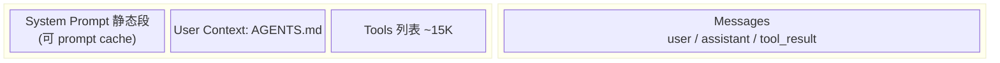
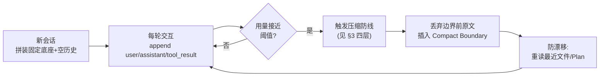
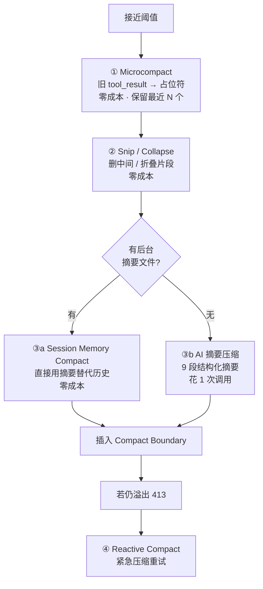
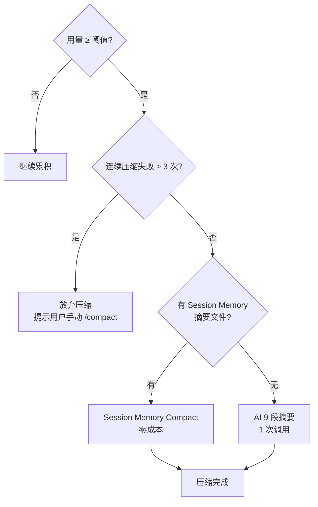
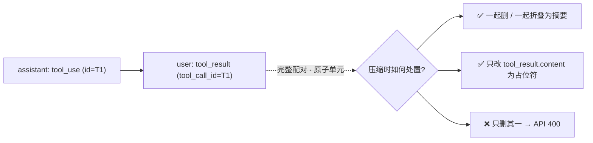
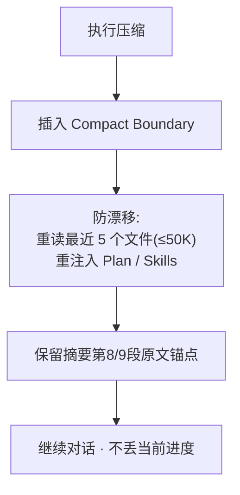
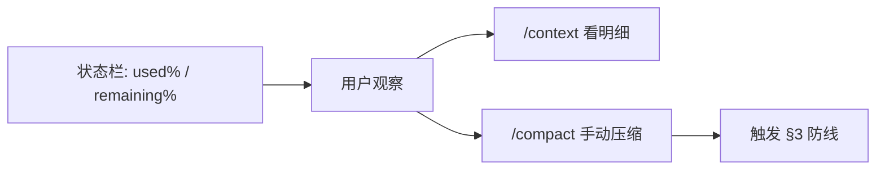
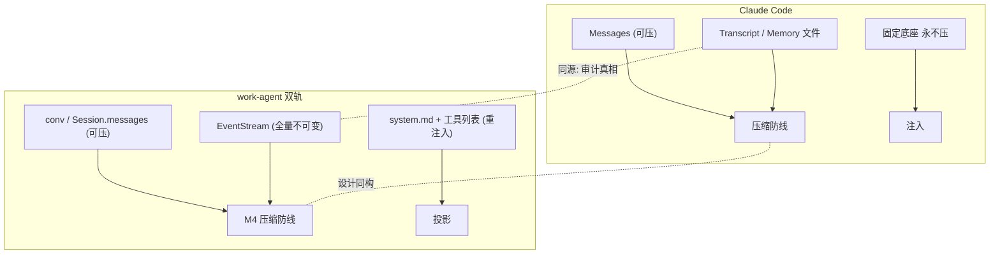

# Claude Code 上下文管理机制 · 详细调研

> 配套文档：
> - 本项目设计结论 `knowledge/context-management.md`（工具结果"保存 vs 注入"伪二选一、双轨映射、配对铁律、M4 规划）
> - 架构依据 `通用Agent架构调研与设计报告.md`
>
> 本文**只讲 Claude Code 怎么做**——从"上下文窗口里到底装了什么"到"四层渐进压缩防线"再到"压缩后怎么不丢信息"，全程大白话 + mermaid 流程图。结论与对本项目的落地映射放在第 9、10 节。
>
> 调研时间：2026-07；主要来源见第 11 节（官方 DeepWiki、源码级拆解博客、上下文工程专栏）。

---

## 0. 一句话概括

Claude Code 把上下文窗口当成**稀缺的内存**：固定底座（系统提示 / 工具列表 / AGENTS.md）**永不压缩**，对话历史（user / assistant / tool_result）**随轮累积**，接近上限时走一套**从"零成本"到"花一次模型调用"的渐进压缩防线**，压缩后插一个边界标记、并主动重读最近操作的文件防"失忆"。

---

## 1. 上下文窗口由什么组成（钱花在哪了）

一次发给模型的完整上下文，并不是只有"聊天记录"。它大致由 4 块拼成：

| 组成 | 性质 | 是否参与压缩 | 量级 |
|---|---|---|---|
| **System Prompt**（静态段） | 身份/安全/工具规范/语气；可全局缓存 | 永不压缩 | ~3K |
| **System Prompt**（动态段）+ System Context | 会话指引、Memory、Git 仓库状态 | 一般不压缩 | 可变 |
| **User Context** 中的 AGENTS.md | 项目指令，注入首条 `<system-reminder>` | 永不压缩 | 可变 |
| **Tools 列表** | 内置工具 + Skill 清单 + MCP 工具（独立字段） | 永不压缩 | ~15K+ |
| **Messages**（user/assistant/tool_result） | 真正的对话历史 | **压缩的作用对象** | 持续增长 |



关键点（和我们项目强相关）：

- **大钱在 tool_result**：读一个文件、跑一条 bash、grep 一把，都是 tool_result，是 token 消耗大户。纯问答一轮 ~1K，读文件 ~3–5K，重度开发轮 ~20K+。
- 系统提示里**日期信息被移出**到动态段，是为了改善 prompt caching 命中率（稳定前缀才能缓存）。
- 可用 `/context` 命令实时看占用：固定底座约 19K，只有 Messages 在涨。

---

## 2. 长会话的"无限上下文"循环

Claude Code 的设计目标：**对话不被上下文窗口限制**。它靠"边攒边压"实现"看起来无限"：



> 实践数据（1M 窗口重度开发）：约第 47 轮第一次压缩，之后每 ~45 轮循环压缩一次。早期逐字细节会逐级流失——**重要信息应写进 AGENTS.md 永久保留**（因为 AGENTS.md 在固定底座，永不进摘要）。

---

## 3. 四层渐进压缩防线（核心）

压缩不是"一把梭全压成摘要"，而是**从便宜到贵、从局部到整体**的四层防线。能零成本解决就不动用模型调用。

| 层级 | 名称 | 成本 | 做法 | 何时用 |
|---|---|---|---|---|
| 1 | **Microcompact** | 0 | 把**旧的** tool_result 内容替换成占位符 `[Old tool result content cleared]`，保留最近 N 个不动 | 每次请求前，旧结果缓存已冷 |
| 2 | **Snip / Collapse**（实验） | 0 | 物理删中间片段 / 折叠为摘要 | 局部过长时 |
| 3a | **Session Memory Compact** | 0 | 直接复用后台持续更新的"摘要文件"替代历史 | 优先于 AI 摘要 |
| 3b | **AI 摘要压缩** | 1 次调用 | 模型生成 **9 段结构化摘要** | 无现成摘要时兜底 |
| 4 | **Reactive Compact** | 1 次调用 | API 返 413（窗口溢出）时紧急重试 | 兜底兜底 |



### 3.1 Microcompact（最常用、最便宜）

- **触发**：每次 API 请求前，若某个旧工具结果缓存已"冷"（距上次响应超过阈值）。
- **作用对象**：仅 `COMPACTABLE_TOOLS`（FileRead、Bash、Grep、Glob、WebSearch 等）。
- **做法**：把旧 tool_result 内容替换成固定占位符字符串，例如：
  - Before：`tool_result = "第1行代码\n...（500 行）"`
  - After：`tool_result = "[Old tool result content cleared]"`
- **零成本**：不调模型，消息**条数不变**（只改 content），保留最近 N 个结果不动。
- 这就是我们项目 M4 的"先做 Microcompact"直接借鉴对象。

### 3.2 Snip / Collapse（实验层）

- 物理删除中间已经不重要的片段，或把一段折叠成一句话摘要。仍在零成本区间，是局部微调。

### 3.3a Session Memory Compact（零成本首选）

- Claude Code 后台**持续把对话更新进一个"摘要文件"**（Session Memory）。
- 触发压缩时，**优先直接用这份摘要替代历史**，保留最近 10K~40K tokens 的原文细节。
- 因为摘要是平时增量维护的，压缩这一刻**零 API 调用**，最划算。

> 源码级深度机制见 §3.5 与《Claude Code Session Memory 深度解析》。

**为什么需要 Session Memory，而不是只靠阈值触发压缩？**

这是两个不同目的：

| | **阈值触发压缩（Auto Compact）** | **Session Memory / Session Compact** |
|---|---|---|
| **时机** | 接近上下文窗口上限时 | **每轮对话结束后**（后台异步执行） |
| **触发条件** | 有效窗口 − 13K buffer 用完 | `minimumMessageTokensToInit`(10K)、`minimumTokensBetweenUpdate`(5K)、`toolCallsBetweenUpdates`(3) 任一满足 |
| **内容** | 压缩**最近的对话历史**（messages） | 从对话中**提取长期记忆**（项目结构、用户偏好、关键决策） |
| **输出** | 一段摘要，替换历史消息 | 一段结构化记忆（10 段固定格式，每段 ~2K，共 ~12K tokens） |
| **用途** | 腾出 token 空间继续对话 | **跨压缩/跨会话保留"不会忘"的信息** |

Auto Compact 的摘要是有代价的——压缩后信息就固化了，后续新压缩只能基于已压缩的摘要再压缩，多次压缩后细节不断丢失（"传话游戏"效应）。Session Memory 独立于消息序列，**每次压缩后都重新从全量对话中提取**，把最重要的信息提升到固定底座里，这些信息**永不进入摘要链**，也就不会被多次压缩稀释。

打比方：Auto Compact = 每次写便签把黑板擦掉一部分；Session Memory = 旁边有一本"会议记录本"，每次会后都从全部内容中提炼要点写到本子上，黑板擦了也没关系，下次直接看本子。两者互补——Auto Compact 解决"马上放不下了"的燃眉之急，Session Memory 解决"长期记忆不衰减"的根本问题。

### 3.3b AI 摘要压缩（兜底，1 次调用）

- 发送"全部历史 + 压缩 prompt"，要求模型**只输出文本、禁止调用任何工具**，生成 **9 段结构化摘要**：

  1. **Primary Request and Intent**（用户原始意图）
  2. **Key Technical Concepts**（关键技术概念）
  3. **Files and Code Sections**（涉及的文件与代码段）
  4. **Errors and fixes**（遇到的错误与修复）
  5. **Problem Solving**（问题解决思路）
  6. **All user messages**（所有用户消息）
  7. **Pending Tasks**（待办）
  8. **Current Work**（当前正在做的事）
  9. **Optional Next Step**（建议的下一步）

- 输出经 `<analysis>` 剥离，只保留 `<summary>` 部分。
- 第 9 段**要求原文引用**（见 §6 防漂移），是抵抗语义漂移的关键锚点。

### 3.4 Reactive Compact（兜底兜底）

- 若前面方案仍导致 API 返 `413`（上下文溢出），紧急再做一次压缩并重置请求。属于"最后保险"。

### 3.5 Session Memory 深度机制（零成本首选的内部）

> 源码级拆解见《Claude Code Session Memory 深度解析》（claudefa.st/blog/guide/mechanics/session-memory）。本项目落地见 `milestones/M4-上下文与记忆/4.4-SessionMemoryCompact.md`。

**(1) 是什么**：Session Memory 是 Claude Code 的**自动后台记忆系统**，会话过程中持续把对话提炼成结构化摘要写入磁盘，下次会话自动加载。与 AGENTS.md（人工维护）不同，它**完全自动、无需干预**。

**(2) 摘要文件结构（10 段固定 section）**：每个 section 最大 **2,000 tokens**，整文件最大 **12,000 tokens**（超限时 AI 被强制压缩旧内容）：

1. **Session Title**（5-10 词信息密集描述）
2. **Current State**（正在做 / 未完成 / 下一步）
3. **Task specification**（用户要构建什么、设计决策）
4. **Files and Functions**（重要文件及其作用）
5. **Workflow**（常用命令及执行顺序）
6. **Errors & Corrections**（错误及修复）
7. **Codebase and System Documentation**（系统组件）
8. **Learnings**（有效 / 无效方法）
9. **Key results**（用户要求的具体输出）
10. **Worklog**（逐步行动记录）

存储：`~/.claude/projects/<project-hash>/<session-id>/session-memory/summary.md`，每 session 独立，目录 0o700 / 文件 0o600（摘要含项目敏感信息）。

**(3) 触发机制（增量提取阈值）**：提取由**后处理钩子**驱动（每次回复后），`shouldExtractMemory()` **必要条件：token 增量阈值始终要求满足**：

| 参数 | 默认值 | 含义 |
|------|--------|------|
| `minimumMessageTokensToInit` | 10,000 | 初次触发上下文 token 阈值（短会话 < 10K 不提取） |
| `minimumTokensBetweenUpdate` | 5,000 | 两次更新之间最小 token 增量 |
| `toolCallsBetweenUpdates` | 3 | 两次更新之间最少 tool call 次数 |

触发条件（满足其一）：① token 增量达标 **AND** tool call 达标；② token 增量达标 **AND** 最后一轮无 tool call（自然对话断点）。**前置**：要求 auto-compact 开启，否则跳过（`if (!autoCompactEnabled) return`）。

**(4) 提取过程（不阻塞）**：通过 `runForkedAgent()` 独立子 agent 运行，**只授权 Edit 改 summary.md**，其他工具拒绝；串行化（同时只有一个提取在运行）。

**(5) Session Memory Compact（瞬时压缩）**：当 `tengu_sm_compact` 开启，`/compact` 直接加载 summary.md 作为压缩结果，无需重新分析（传统 AI 摘要约 2 分钟）。保留约束（DEFAULT_SM_COMPACT_CONFIG）：最少 10K tokens、最少 5 条含文本消息、最多 40K tokens。

**(6) 跨会话 Recall**：新会话启动查找项目目录下历史 summary.md 注入上下文，标注 *"来自过去会话的背景参考，不一定与当前任务相关"*，避免模型盲目遵循旧决策。终端显示 `Recalled N memories`。

**(7) 与 `/remember` → AGENTS.local.md 提升通道**：Session Memory（自动 / 临时）→ AGENTS.local.md（手动 / 持久）的提升；`/remember` 识别跨 session 重复模式，提议写入永久规则。

| 特性 | Session Memory | AGENTS.md |
|------|---------------|-----------|
| 创建者 | Agent（自动） | 用户（手动） |
| 范围 | 每 session 快照 | 持久项目规则 |
| 优先级 | 背景参考 | 高优先指令 |
| 最佳用途 | 跨 session 连续性 | 标准规范、架构、命令 |

---

## 4. 触发与决策流

### 4.1 阈值公式

```
有效窗口 = 上下文窗口 − min(max_output_tokens, 20_000)
Auto Compact 阈值 = 有效窗口 − 13_000   (AUTOCOMPACT_BUFFER_TOKENS)
```

- 默认窗口 200,000 → 有效 ~180K → 阈值 **~187K**
- 1M 窗口 → 有效 ~980K → 阈值 **~967K**
- 早期文档也提到"约 98% 有效窗口"触发自动压缩（口径一致）。

### 4.2 决策流



> 手动 `/compact` 可随时显式触发，主动清理历史或优化上下文。

---

## 5. 配对铁律（API 安全）

无论 Microcompact、Snip、Collapse 还是 Auto Compact，**绝不能拆散 `tool_use` 与 `tool_result` 的配对**，否则 OpenAI/DeepSeek 协议直接报 400（"带 tool_calls 的 assistant 必须紧跟对应 tool 回执"）。

- 删调用必删结果，删结果必删调用，或二者一起折叠为摘要。
- 占位替换只改 `tool_result.content`，保留 `tool_call_id` 配对。
- Session Memory Compact 里专门有 `adjustIndexToPreserveAPIInvariants`，保证压缩边界不切断配对。



> 这条铁律与本项目 `context-management.md` §5 完全一致，是我们的硬约束。

---

## 6. Compact Boundary 与防漂移

### 6.1 Compact Boundary（边界标记）

每次压缩后，在消息序列里插入一个**边界标记**。之后每次请求**只发送边界之后的消息**，边界前的历史由摘要承载"记忆"。下次压缩再从新边界往后取。

**为什么不用滑动窗口？**

Claude Code 没有采用传统的"滑动窗口"（超过 N 条直接丢弃最早的），原因：

| | 滑动窗口 | Compact Boundary + 摘要 |
|---|---|---|
| **机制** | 超过 N 条直接丢弃最早消息 | 把历史浓缩成摘要，保留"记忆" |
| **信息损失** | 完全丢失（模型"忘了"） | 摘要形式保留（模型"记得大意"） |
| **实现** | 简单截断数组 | 调模型做一次压缩对话（有成本） |
| **恢复** | 不可逆 | 不可逆（但比丢弃好） |

Claude Code 的选择是：**宁可花一次模型调用做压缩，也不直接扔掉历史**。本质上是**用 token（压缩成本）换上下文质量**——丢掉历史会让模型"失忆"（忘了项目结构、用户偏好），而摘要至少让模型知道大概。渐进防线（§3）也体现了这个思路：能不压缩就不压，要压也尽量用免费手段（折叠/占位符），最后才用 AI 调用做摘要。

### 6.2 防漂移（压缩后别"忘事"）

压缩会丢细节，Claude Code 用两招对抗"模型忘了正在改什么"：

1. **主动重读**：压缩后主动重新读取**最近操作的 5 个文件**（预算 ~50K tokens），把最新代码贴回上下文；Plan、Skills 等也重新注入。
2. **原文锚点**：要求 9 段摘要的第 8/9 段（Current Work / Optional Next Step）包含**原文引用**，让模型理解不漂移。



---

## 7. 固定底座（永不压缩）

以下三类是"记忆的锚"，**压缩永不触碰**，靠从磁盘重新注入对抗长期衰减：

- **System Prompt 静态段**：可全局缓存（`scope: 'global'`）。
- **AGENTS.md / 自动记忆 / 技能体**：每次都从磁盘重新注入到 messages 首条 `<system-reminder>`。
- **Tools 列表**：会话内固定。

> 推论：**想让信息"跨压缩不丢"，就写进 AGENTS.md**（或项目级记忆文件），而不是依赖对话历史。这是用户使用习惯层面的关键建议。

---

## 8. 监控与手动控制

- 状态栏实时暴露 `context_window.used_percentage` / `remaining_percentage`。
- `/context` 命令：查看各类占用明细（固定底座 / 动态对话 / 工具结果）。
- `/compact` 命令：手动触发压缩。



---

## 9. 与本项目双轨设计的映射

本项目（`CODEBUDDY.md`）已定调"事件流（单一事实来源）+ 上下文窗口（派生投影）"双轨，正好一一对应 Claude Code 的"保存 / 注入"：

| Claude Code 概念 | 本项目对应 | 说明 |
|---|---|---|
| Messages（可压缩历史） | `Session.messages` / `conv`（上下文投影） | 压缩作用对象 |
| Transcript 落盘 / Session Memory 文件 | `EventStream`（全量不可变，审计真相） | 压缩派生源，**永不压缩** |
| 固定底座（System / AGENTS.md / Tools） | `system.md` + `prompts/` + 工具列表（投影时重新注入） | 永不进摘要 |
| Microcompact | M4 第一层：旧 tool_result 占位替换 | 零成本，先做 |
| AI 9 段摘要 | M4 第二层：Auto Compact 结构化摘要 | 边界前整批压 + Boundary |
| 防漂移重读 | M4 压缩后重读最近文件 | 一致 |
| 配对铁律 | `context-management.md` §5 | 硬约束，已定 |
| Session Memory 零成本摘要 | 可演进：后台增量维护摘要文件 | 进阶项 |



**核心一致点**：压缩**只作用于 `conv`/上下文投影**，**绝不触碰 `EventStream`**（审计真相不可变）；配对铁律贯穿。

---

## 10. M4 落地建议（本院借鉴 Claude Code 方案）

按"零成本优先、贵操作兜底"的顺序落地到 `agent/context/`：

1. **`ContextManager`**：持有 `conv` 投影、估算 token（复用 `_estimate_tokens`，输出分类明细）、记录压缩历史与 Boundary 位置。
2. **① Microcompact（零成本，先做）**：对 `conv` 中较旧的 `role="tool"` 消息，把 `content` 替换为 `[Old tool result content cleared]`，保留最近 N 个；成对处理（不动 `tool_use`/`tool_result` 配对）。
3. **③b Auto Compact（1 次调用，兜底）**：越阈值时把边界前历史整批压成**9 段结构化摘要**插入 Compact Boundary；压缩后**重读最近文件最新版防漂移**。
4. **③a 演进项（零成本首选）**：后台增量维护"会话摘要文件"，压缩时优先复用（Session Memory Compact 思路）。
5. **触发与计量**：复用 `_estimate_tokens`（CJK 1 token/字、其它 4 字符/token）；阈值取「有效窗口 − 余量」（参考 ~13K buffer 思路）。
6. **prompt caching**：稳定前缀（system / AGENTS.md 类）走缓存，降成本（呼应 Claude Code 把日期移出静态段）。
7. **子代理隔离接入（M5 协同）**：大输出（读大文件 / 长 bash 日志）不塞主上下文，委托子代理，主窗口只回收"摘要 + 小元数据尾迹"。
8. **恢复（M5）**：从 `EventStream` 重放重建 `conv`，压缩层可基于事件流重新派生。

**落点纪律**：压缩只改 `conv`（可投影）；`EventStream` 永久全量、只读；配对铁律不可违反。

---

## 11. 来源

- **Context Window & Compaction — anthropics/claude-code（DeepWiki，2026-07-14 索引）**：上下文窗口结构、约 98% 阈值自动压缩、`/compact` 手动压缩、压缩前剥离媒体/截断大输出、会话配置（含自定义指令）压缩后存活。
- **《CLAUDE CODE 上下文管理机制深度解析》（blog.cyeam.com，2026-06-03）**：会话初始四块拼装（System 静态/动态、System Context、User Context、Tools）、消息积累量级、Microcompact 占位符、有效窗口公式（−13K buffer）、Session Memory / AI 9 段摘要、配对约束 `adjustIndexToPreserveAPIInvariants`、Compact Boundary、防漂移重读最近 5 文件（50K）、实践数据（47 轮首压 / 每 45 轮循环）、CLAUDE.md 永久保留建议。
- **《Claude Code上下文工程拆解：从 Snip 到 AutoCompact》（juejin，2026-04）**：Snip → MicroCompact → AutoCompact 分层管线、压缩 prompt 9 段与断路器设计。
- **《Claude Code 的上下文压缩:五层级联与免费摘要的艺术》（finisky.github.io，2026-04）**：200K 窗口成本账、五级流水线、免费摘要优先。
- **《S05: Context & Compact — 深入 Claude Code 源码》（learn-claude-source，2026-03）**：三层渐进式压缩、压缩触发时机。
- **《Claude Code Session Memory 深度解析》（claudefa.st/blog/guide/mechanics/session-memory，源码级拆解）**：自动后台记忆系统、10 段固定摘要结构（每节 2K / 总 12K tokens）、触发阈值（`minimumMessageTokensToInit` 10K / `minimumTokensBetweenUpdate` 5K / `toolCallsBetweenUpdates` 3）、后处理钩子 `shouldExtractMemory`、forked agent 提取（仅 Edit 授权）、`tengu_session_memory` feature flag 前置要求 auto-compact 开启、Session Memory Compact 瞬时压缩（DEFAULT_SM_COMPACT_CONFIG：10K/5 条/40K）、跨会话 Recall、`/remember` → AGENTS.local.md 提升通道、对比表。
- 本项目：`CODEBUDDY.md`（双轨/上下文稀缺/能力正交）、`knowledge/context-management.md`（双轨映射/配对铁律/M4 规划）、`agent/core/events.py`（EventStream）、`agent/core/loop.py`（tool_result 进 conv）、`agent/runtime/registry.py`（`_cap_result` / `max_tool_output_chars`）。
