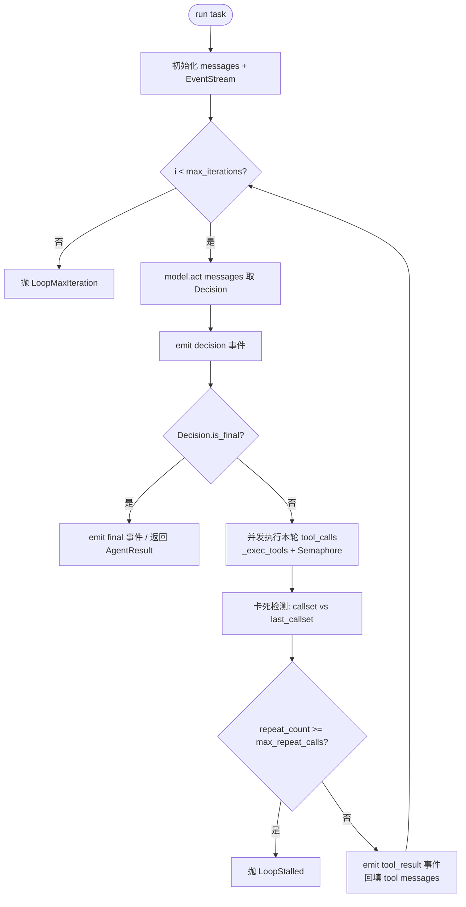
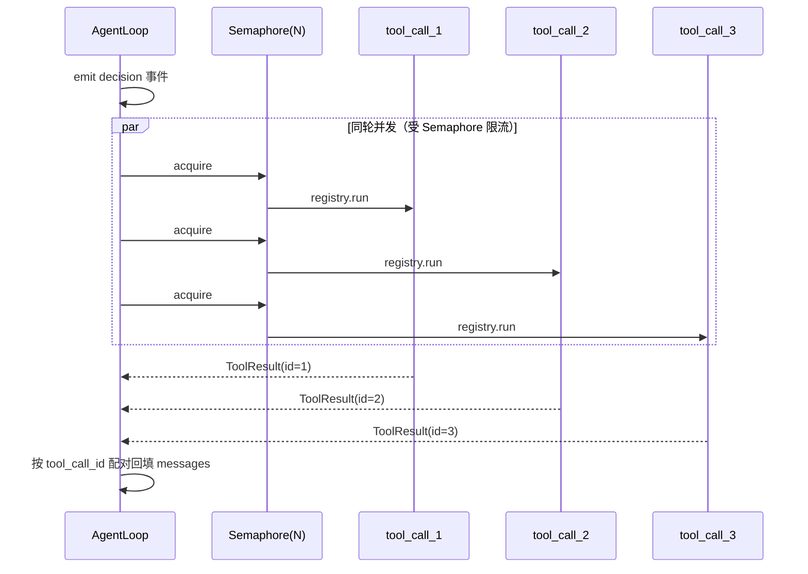

# Step M1.3 ReAct 循环 + 事件流

## 实现方案

- **目标**：实现 `AgentLoop`：接 `Model` + `ToolRegistry` + `Settings`，跑「决策 → 工具 → 观察」循环。引入轻量**事件流（Event Stream）**作为状态单一事实来源（decision / tool_use / tool_result / final / error 全是事件，可序列化、可重放）。用 `FakeModel` 脚本（如：先调 `write` 再产出最终文本）跑通空转。
- **改动文件**：
  - `agent/core/events.py`：`Event` 类型 + `EventStream`（追加 / 序列化 `to_json` / 重放 `from_json`）。
  - `agent/core/loop.py`：`AgentLoop.run(task)`（含 `max_iterations` 防失控、工具并发调度、重复/卡死检测）。
  - `agent/config/settings.py`：新增两个旋钮 `max_tool_concurrency`（默认 5）、`max_repeat_calls`（默认 3）。
  - `tests/test_loop.py`：用 `FakeModel` + `RecordingModel` 断言事件流、并发、卡死、max_iterations。
- **关键接口**：
  ```python
  # events.py
  @dataclass
  class Event:
      seq: int                 # 单调递增序号，顺序即因果
      type: str                # decision | tool_use | tool_result | final | error
      ts: float = field(default_factory=time.time)
      decision: Decision | None = None
      tool_use: ToolCall | None = None
      tool_result: ToolResult | None = None
      tool_call_id: str | None = None
      text: str | None = None
      error: str | None = None

  class EventStream:
      def append(self, ev: Event) -> Event      # 自动写 seq
      def to_json(self) -> str
      @classmethod
      def from_json(cls, s: str) -> "EventStream"  # 重放/恢复（M5）

  # loop.py
  class LoopMaxIteration(RuntimeError): ...
  class LoopStalled(RuntimeError): ...        # 重复调用 / 原地打转

  @dataclass
  class AgentResult:
      text: str
      events: EventStream
      iterations: int

  class AgentLoop:
      def __init__(self, model: Model, registry: ToolRegistry,
                   settings: Settings, tracer=None): ...
      async def run(self, task: str) -> AgentResult
  ```

### 工具调用细节（核心）

工具调用是 ReAct 的核心，必须明确**并发**、**重复/卡死检测**、**异常**三件事。

#### 1. 并发策略：同轮并发、跨轮串行

- **同一次 `Decision` 内的多个 `tool_calls` 相互独立**（互不依赖输入），用 `asyncio.gather` 并发执行；并发度受 `Semaphore(settings.max_tool_concurrency)` 限制，避免一次开太多子进程/连接。
- **轮与轮之间串行**：下一轮 `Decision` 依赖上一轮 `tool_result` 回填到 messages，天然不能并发。这是 ReAct 的固有结构，不是限制。
- **结果关联**：每个 `ToolResult` 通过 `tool_call_id` 与 `ToolCall` 配对拼回 `Message(role="tool", tool_call_id=...)`，顺序无关（模型按 id 配对，不要求原序）。
- **事件顺序**：决策阶段先 emit 一个 `decision` 事件；该轮每个 `tool_use` 在 gather 前 emit（决策已包含所有调用）；`tool_result` 事件按**实际完成顺序** emit（更能反映真实并发时序）。

```python
async def _exec_tools(self, calls: list[ToolCall], stream: EventStream) -> list[ToolResult]:
    sem = asyncio.Semaphore(self.settings.max_tool_concurrency)

    async def _one(tc: ToolCall) -> ToolResult:
        async with sem:
            try:
                return await self.registry.run(tc.name, tc.arguments)
            except UnknownTool:  # 未知工具不崩循环，转为错误结果让模型自纠
                return ToolResult(ok=False, error=f"unknown tool: {tc.name}")
            except Exception as e:  # 工具内部未捕获异常同样不崩循环
                return ToolResult(ok=False, error=f"{type(e).__name__}: {e}")

    results = await asyncio.gather(*(_one(tc) for tc in calls))
    return list(results)
```

#### 2. 重复调用 / 卡死检测（防原地打转）

"卡死"指模型**永不给 final 答案、反复调相同工具**。仅靠 `max_iterations` 是兜底（硬上限），语义上应更早、更友好地识别。两层机制：

- **`max_iterations`（硬上限）**：循环 `for i in range(settings.max_iterations)`，超出抛 `LoopMaxIteration`。任何情况都兜底，绝不无限循环。
- **`LoopStalled`（语义检测）**：维护「最近一次迭代的调用签名集合」`last_callset = frozenset((name, canonical(args)))`，与 `repeat_count`：
  - `canonical(args) = json.dumps(args, sort_keys=True, ensure_ascii=False)`（参数顺序无关）。
  - 若本轮 `callset == last_callset`（完全一致的重调用）→ `repeat_count += 1`；否则重置为 0。
  - 当 `repeat_count >= settings.max_repeat_calls`（默认 3）→ 抛 `LoopStalled("model is looping on identical tool calls")`。
- **与 max_iterations 的分工**：stall 在达到 `max_iterations` 之前就能触发（更早终止、错误可读）；`max_iterations` 是最后防线（覆盖"每次调用都不同但永不收尾"等非重复式失控）。
- **可重试性**：阈值 `max_repeat_calls` 给一定冗余，合法重试（如 bash 偶发失败、换个参数）不会误杀。

#### 3. 异常处理约定

- `UnknownTool` / 工具未捕获异常 → 转为 `ToolResult(ok=False, error=...)` 事件，**不中断循环**，让模型看到错误后自我纠正（符合 ReAct 的"观察—反思"语义）。
- `Model` 调用异常（API 超时/限流）→ 交由 M5 韧性层（重试/熔断），1.3 先直接向上抛，由上层捕获。
- `final` 判定：`Decision.is_final`（无 `tool_calls`）。若 `is_final` 但 `text is None` → 以空串收尾并 emit `final` 事件。

### 主循环算法（伪代码）

```text
messages = [Message(role="user", content=task)]
stream   = EventStream()
last_callset, repeat_count = None, 0

for i in range(settings.max_iterations):
    decision = await model.act(messages)          # 或 stream() 实时输出
    stream.append(Event(type="decision", decision=decision))

    if decision.is_final:                          # 终止条件
        stream.append(Event(type="final", text=decision.text or ""))
        return AgentResult(text=decision.text or "", events=stream, iterations=i+1)

    results = await _exec_tools(decision.tool_calls, stream)   # 同轮并发

    # 卡死检测
    callset = frozenset((tc.name, canonical(tc.arguments)) for tc in decision.tool_calls)
    repeat_count = repeat_count + 1 if callset == last_callset else 0
    last_callset = callset
    if repeat_count >= settings.max_repeat_calls:
        raise LoopStalled(...)

    # 回填 messages，进入下一轮
    messages.append(Message(role="assistant", tool_calls=decision.tool_calls))
    for tc, res in zip(decision.tool_calls, results):
        stream.append(Event(type="tool_result", tool_call_id=tc.id, tool_result=res))
        messages.append(Message(role="tool", content=res.output or res.error, tool_call_id=tc.id))

raise LoopMaxIteration(f"exceeded {settings.max_iterations} iterations")
```

## 验收标准

- [ ] `pytest tests/test_loop.py` 通过：
  - 给定 FakeModel 脚本（先 `write` 再 final），循环按序调用并正确返回最终文本；事件流完整记录 `decision → tool_use → tool_result → final`。
  - **并发**：一次 Decision 含 2+ 个 `tool_calls`，断言它们被**并发**执行（如用带 sleep 的假工具测总耗时 ≈ 单次而非累加），且结果按 `tool_call_id` 正确配对。
  - **卡死检测**：FakeModel 脚本重复返回相同 `tool_calls`，断言在第 `max_repeat_calls` 次触发 `LoopStalled`。
  - **max_iterations**：FakeModel 永不 final，断言触发 `LoopMaxIteration`，不无限循环。
  - **UnknownTool 不崩**：模型请求未注册工具，断言循环收到 `ToolResult(ok=False)` 而非抛异常，且事件流记录 `tool_result` 错误事件。
- [ ] 事件流 `to_json()` 可序列化、`from_json()` 可重放且事件序列一致。

## 知识沉淀

> 完成本步后回填：接口签名、模块边界、实现原理、流程图、决策理由、踩坑。同步追加到 `knowledge/INDEX.md`。

### 接口签名
- `agent/core/events.py`：`Event(seq,type,ts,decision,tool_use,tool_result,tool_call_id,text,error)`；`EventStream.append/to_json/from_json`。`type ∈ {decision,tool_use,tool_result,final,error}`。
- `agent/core/loop.py`：`AgentLoop(model,registry,settings,tracer=None)`、`async run(task)->AgentResult(text,events,iterations)`；异常 `LoopMaxIteration` / `LoopStalled`。
- 新增配置（落 `Settings`）：`max_tool_concurrency: int = 5`、`max_repeat_calls: int = 3`。

### 模块边界
- `loop.py` 是**确定性的循环编排**：只负责"调模型→并发跑工具→回填→检测"，不做任何 IO、不调用任何具体工具实现（统一走 `registry.run`）、不直连 LLM（走 `Model` 抽象）。
- `events.py` 是**纯数据结构 + 序列化**，无业务逻辑，是状态单一事实来源。
- 模型调用异常/M 韧性、工具审批/M2 沙箱，均不在 1.3 内消化——1.3 仅预留钩子（异常向上抛 / `risk` 字段已存在）。

### 流程图

**主循环（ReAct + 事件流）**


**同轮工具并发时序**


**重复调用 / 卡死检测**
```mermaid
flowchart LR
    D[本轮 Decision] --> C[callset = frozenset((name, canonical(args)))]
    C --> E{callset == last_callset?}
    E -- 是 --> R[repeat_count += 1]
    E -- 否 --> Z[repeat_count = 0]
    R --> F{repeat_count >= max_repeat_calls?}
    Z --> L[last_callset = callset, 继续]
    F -- 是 --> S[抛 LoopStalled]
    F -- 否 --> L
```

### 实现原理
1. **单一事实来源**：循环不产生"隐藏状态"，所有关键动作（决策、每次工具调用与结果、结束/错误）都 append 进 `EventStream`。后续可观测（M5 trace）、恢复（M5 session）、压缩（M3）都从这份事件序列派生，避免多处状态不一致。
2. **AI 只决策、循环确定性**（98/1.6 法则）：`Model` 只吐 `Decision`；并发调度、回填、卡死检测、max_iterations 全是纯确定性逻辑，可单测、可重放。
3. **并发的本质边界**：ReAct 的"思考—行动"串行，但"一次行动内的多工具"可并行。用 `asyncio.gather` + `Semaphore` 实现有界并发；`tool_call_id` 解耦执行顺序与回填顺序。
4. **卡死检测 = 行为指纹比对**：用「调用签名集合」`frozenset((name, canonical(args)))` 作为行为指纹，相邻轮比较；重复达到阈值即判定原地打转。`canonical` 用 `sort_keys` 使参数顺序无关，避免"换参数顺序伪装成新调用"。
5. **错误隔离**：工具侧异常（含 `UnknownTool`）不冒泡中断循环，而是降级成 `ToolResult(ok=False)` 事件，让模型在下一轮"观察"到错误并自我纠正——这是 ReAct 容错性的来源。

### 约定与决策理由
- 事件 `seq` 单调递增，顺序即因果；`from_json` 重放时严格按 `seq` 恢复，保证可观测/可恢复一致性。
- `max_iterations` 兜底 vs `LoopStalled` 语义检测分工：前者保证"绝不无限循环"，后者保证"更早、更可读地退出原地打转"。
- 工具并发默认上限 5（多数场景足够，且避免 Windows 子进程句柄耗尽）；可通过 `settings.max_tool_concurrency` 调。
- `Decision.is_final` 作为唯一终止信号；文本为 `None` 时以空串收尾，仍 emit `final` 事件（不丢状态）。

### 踩坑（实现后回填）
- **dataclass 默认值顺序**：`Event` 的 `seq` 带默认值 `=-1`，必须把 `seq` 放在字段列表**最后**，否则 `non-default argument follows default argument`。构造事件时不传 `seq`，由 `EventStream.append` 写入。
- **并发 append 安全**：`_exec_tools` 在并发 task 内调 `stream.append(Event(...))`，但 `append` 是纯同步（无 await 点），单线程 event loop 下 `len + 赋值 + append` 不可被插空，`seq` 不会错乱。
- **gather 保序**：`asyncio.gather(*tasks)` 返回的 `results` 顺序与 `calls` 一致；循环用 `zip(decision.tool_calls, results)` 配对，故 `tool_result` 事件的 `tool_call_id` 与调用一一对应（执行/回填顺序靠 id 解耦，不依赖完成先后）。
- **事件顺序**：同轮内所有 `tool_use` 事件在并发 task 起始处 append，所有 `tool_result` 事件在 `gather` 返回后的主循环 append → 该轮 `tool_use` 全在 `tool_result` 之前。
- **stall 检测在「执行后」**：卡死判断写在 `_exec_tools` 之后，故第 `max_repeat_calls` 次**重复执行**完成后 `repeat_count` 才达到阈值并抛 `LoopStalled`；若断言"执行次数"，应为 `max_repeat_calls + 1` 次，而非 `max_repeat_calls` 次。
- **异常降级不崩循环**：`UnknownTool` 及工具未捕获异常在 `_one` 内被 catch，转成 `ToolResult(ok=False, error=...)` 事件，循环继续；模型下一轮"观察"错误后可自我纠正（ReAct 容错核心）。
- **序列化保真**：`Event.to_dict` 对嵌套 `Decision/ToolCall/ToolResult` 自定义互转；`from_json` 严格按 `seq` 恢复，`seq == range(len)` 可作为重放一致性校验。

