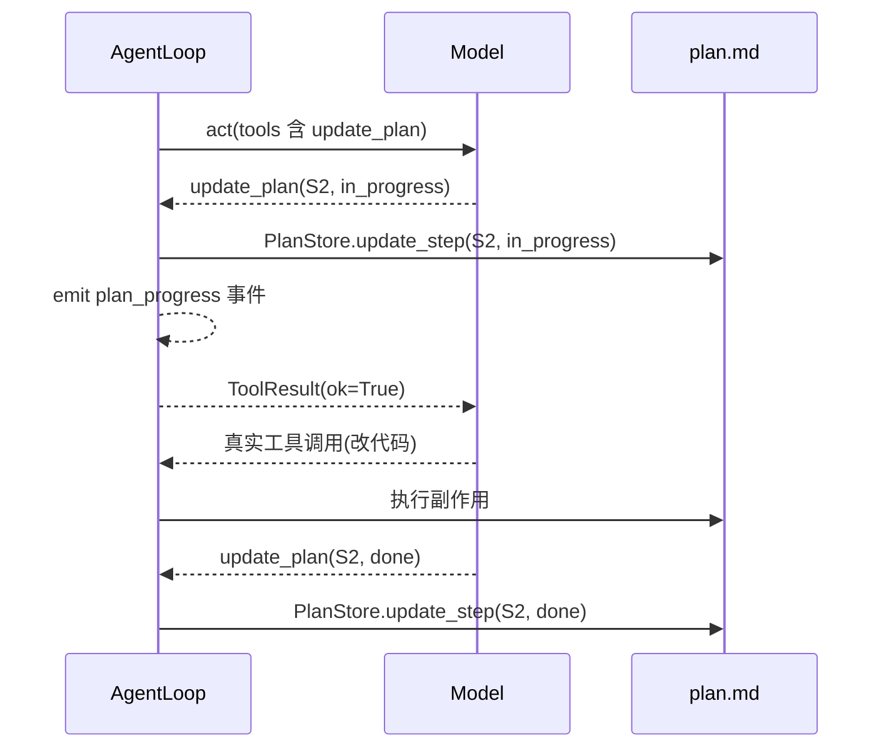
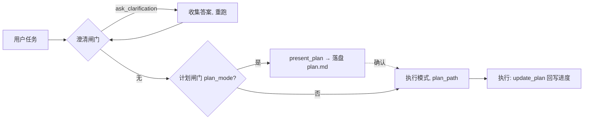

# Step M1.4 PLAN 模式（只读探索 + 计划文件 + 进度更新）

> 注：本步插在原 M1.3 与 M1.4 之间。运行期顺序上，意图澄清（M1.5）作为「前置闸门」先于 PLAN 执行；CLI（M1.6）负责把二者串成 **澄清 → 计划 → 执行**。本步先建立「控制工具 + 提前返回 + AgentResult 新增字段」的通用模式，M1.5 复用此模式。
> 本步要点（相对初版增强）：生成的计划是一个**落盘文件**（非仅内存字符串），含「正文 + 结构化执行步骤列表」；计划批准后进入执行，模型可调用 `update_plan` **实时更新每步进度**（pending/in_progress/done/blocked/skipped），进度回写同一计划文件并落事件流，供用户/可观测系统持续查看。

## 实现方案

- **目标**：给 `AgentLoop` 增加 **plan 模式**与**计划进度机制**。
  1. **plan 模式**：Agent 只能做只读探索，最终通过控制工具 `present_plan(body, steps)` 产出一份结构化计划；循环把计划**落盘为文件**（正文 + 步骤列表），捕获后不执行任何写操作，提前返回 `AgentResult(plan_path=...)` 供审阅。
  2. **进度更新**：计划经批准、进入执行后，Agent 用控制工具 `update_plan(step_id, status, note?)` 在推进每步时标记 `in_progress`、完成后标记 `done`、遇阻标记 `blocked`；循环把状态**回写计划文件**并 emit `plan_progress` 事件，形成可追溯的实时进度。
- **改动文件**：
  - `agent/core/plan.py`（**新增**）：`PlanStatus`（字符串字面量集合）、`PlanStep(id,title,status,detail?)`、`Plan(body,steps,path?)`、`PlanStore.write_plan/read_plan/update_step`（Markdown 渲染/解析 + 步骤状态回写）。
  - `agent/core/model.py`：新增常量 `PLAN_TOOL_NAME="present_plan"`、`UPDATE_PLAN_TOOL_NAME="update_plan"`；`Model.act`/`Model.stream` 协议增加可选 `tools: list[dict] | None = None`（把注册表工具 + 控制工具一起透传给真实模型）；`OpenAICompatibleModel` `create(...)` 带上 `tools=`；`FakeModel`/`RecordingModel` 忽略 `tools`。
  - `agent/core/loop.py`：`AgentLoop` 增加 `plan_mode: bool | None`（缺省取 `settings.plan_mode`）与 `plan_path: str | None`（执行期已知计划文件路径）；`present_plan` 检测 → 落盘 + 提前返回；`update_plan` 作为**循环内虚拟工具**在 `_exec_tools` 中特殊处理（写文件 + 事件，返回 no-op `ToolResult(ok=True)`）；plan 模式风险门控。
  - `agent/core/events.py`：`Event.type` 增加 `"plan"` 与 `"plan_progress"`；`Event` 增加 `plan_path: str | None = None`、`plan_update: dict | None = None`（步骤更新结构化数据，便于 JSON 重放）。
  - `agent/core/loop.py` 的 `AgentResult` 增加 `plan: str | None = None`（正文）、`plan_path: str | None = None`、`plan_steps: list[PlanStep] | None = None`。
  - `agent/config/settings.py`：新增 `plan_mode: bool = False`、`plan_mode_block_risk_above: str = "read"`、`plan_file: str = ".agent/plan.md"`（计划文件落盘路径，M5 可改为 session 级）。
  - `tests/test_plan.py`：FakeModel 在 plan 模式产出 `present_plan` → 断言计划文件已生成、含正文与步骤列表、无 mutating 工具执行；执行期调用 `update_plan` → 断言计划文件步骤状态被改写、emit `plan_progress`；误调写工具被阻断。
- **依赖/环境**：依赖 M1.3 的 `AgentLoop`/`EventStream`/`Decision`；`tools` 参数扩展是前置小改动（本步一并完成）。

## PLAN 模式机制（核心）

#### 1. 计划即文件：`Plan` / `PlanStep` / `PlanStore`
计划不再只是内存字符串，而是一个可落盘、可重看、可续写的**工件（artifact）**。

```python
# agent/core/plan.py
PlanStatus = ("pending", "in_progress", "done", "blocked", "skipped")

@dataclass
class PlanStep:
    id: str                     # 稳定标识，如 "S1"；update_plan 据此定位
    title: str
    status: str = "pending"     # ∈ PlanStatus
    detail: str | None = None

@dataclass
class Plan:
    body: str                   # Markdown 正文：目标/方案/风险/文件清单
    steps: list[PlanStep]
    path: str | None = None

class PlanStore:
    @staticmethod
    def write_plan(plan: Plan, path: str) -> str: ...
    @staticmethod
    def read_plan(path: str) -> Plan: ...
    @staticmethod
    def update_step(path: str, step_id: str, status: str, note: str | None = None) -> Plan: ...
```

**计划文件 Markdown 格式**（人类可读 + 可机器解析）：
```markdown
# Plan

<正文 body — Markdown 自由文本，说明目标、方案、风险点、将改动的文件/命令>

## Steps

- [ ] S1 — 创建模块骨架
- [~] S2 — 实现核心函数
- [x] S3 — 运行测试
- [!] S4 — 部署（待确认）
- [-] S5 — 写文档（本次跳过）
```
状态标记映射：`pending → [ ]`、`in_progress → [~]`、`done → [x]`、`blocked → [!]`、`skipped → [-]`。`PlanStore` 负责渲染（Plan→文件）与解析（文件→Plan），`update_step` 仅改对应步骤状态并重写文件，正文与其它步骤不动。

#### 2. 控制工具 `present_plan`（产出计划文件，对齐 Claude Code 的 ExitPlanMode）
```json
{
  "type": "function",
  "function": {
    "name": "present_plan",
    "description": "PLAN 模式下调查完成后调用，提交计划。计划会落盘为文件供用户审阅。",
    "parameters": {
      "type": "object",
      "properties": {
        "body": {"type": "string", "description": "Markdown 计划正文：目标/方案/风险/文件清单"},
        "steps": {
          "type": "array",
          "items": {
            "type": "object",
            "properties": {
              "id": {"type": "string", "description": "步骤稳定 id，如 S1"},
              "title": {"type": "string"},
              "detail": {"type": "string"}
            },
            "required": ["id", "title"]
          }
        }
      },
      "required": ["body", "steps"]
    }
  }
}
```
- 循环在 plan 模式下把它并入 `tools`，并在 system 提示告知：「你处于 PLAN 模式，只能用只读工具调查，禁止改动任何文件/状态；调查清楚后调用 `present_plan(body, steps)`，steps 为结构化执行步骤列表（每步含稳定 id 与 title）。」
- `present_plan` 被调用即视为**终止信号**：循环解析 `body`+`steps` 构建 `Plan`，经 `PlanStore.write_plan` 落盘到 `settings.plan_file`，emit `Event(type="plan", text=body, plan_path=path)`，返回 `AgentResult(plan=body, plan_path=path, plan_steps=steps, ...)`。**不执行该工具、不进入写操作。**

#### 3. 执行进度更新：控制工具 `update_plan`（模型边做边更新）
计划批准、进入执行后，Agent 用 `update_plan` 实时跟踪进度。它是**循环内虚拟工具**（不进 `registry`，由 `_exec_tools` 特殊处理），因此消息配对（tool_call_id）与正常工具完全一致，无需特殊流程分支。

```json
{
  "type": "function",
  "function": {
    "name": "update_plan",
    "description": "推进已批准计划时，标记某步状态。开始做前标记 in_progress，完成标记 done，遇阻标记 blocked，决定跳过标记 skipped。",
    "parameters": {
      "type": "object",
      "properties": {
        "step_id": {"type": "string", "description": "present_plan 中给出的步骤 id，如 S2"},
        "status": {"type": "string", "enum": ["in_progress", "done", "blocked", "skipped"]},
        "note": {"type": "string"}
      },
      "required": ["step_id", "status"]
    }
  }
}
```
```python
# 在 _exec_tools 的 _one 内
if tc.name == UPDATE_PLAN_TOOL_NAME:
    a = tc.arguments
    PlanStore.update_step(self.plan_path or self.settings.plan_file,
                          a["step_id"], a.get("status", "done"), a.get("note"))
    stream.append(Event(type="plan_progress",
                        plan_path=self.plan_path or self.settings.plan_file,
                        plan_update={"step_id": a["step_id"], "status": a.get("status"), "note": a.get("note")}))
    return ToolResult(ok=True, output="progress updated")
```
- `update_plan` 仅在**执行期且已知 `plan_path`** 时并入 `tools`（CLI 传入批准计划的路径；若 CLI 直接 `--yes` 执行，也可沿用 `settings.plan_file`）。plan 模式不提供它。
- 模型典型节奏：调 `update_plan(S2, in_progress)` → 跑真实工具改代码 → `update_plan(S2, done)`，再 `update_plan(S3, in_progress)`……进度持续回写计划文件，事件流同步记录，用户随时可看 `plan.md` 当前进度。

#### 4. 工具风险门控（安全网，非唯一依赖）
即便模型越界调用写工具，循环也要拦住（prompt 是软约束，门控是确定性兜底）：
```python
# 在 _exec_tools 的 _one 内，plan 模式额外判断（update_plan 不在此列，它由虚拟工具分支先处理）
if self.plan_mode and spec.risk != "read" and tc.name != PLAN_TOOL_NAME:
    return ToolResult(ok=False, error=f"plan mode blocks mutating tool: {tc.name} (risk={spec.risk})")
```
`spec.risk` 沿用 M1.2 的 `("read","edit","exec")` 分级；plan 模式只允许 `read`。阈值 `plan_mode_block_risk_above` 可配（默认 `"read"`）。

#### 5. 系统提示注入
`AgentLoop` 构造 messages 时，按模式追加固定指令（与代码分离，可放 `prompts/` Markdown）：
- plan 模式：*你处于 PLAN 模式。仅可用只读工具调查代码库；禁止创建/修改文件、禁止改写状态或外部可见命令。调查清楚后调用 `present_plan(body, steps)` 提交计划（steps 为结构化步骤列表，每步含稳定 id 与 title），不要自己动手改。*
- 执行（已批准计划，`plan_path` 已知）：*你有一个已批准计划文件 `<path>`。执行时，用 `update_plan(step_id, status)` 在开始每步前标记 `in_progress`、完成后标记 `done`、遇阻标记 `blocked`，使进度可追溯。*

#### 6. 与 M1.5 意图澄清的前后关系
循环每次 `act` 后按如下优先级处理 `Decision`：
1. **澄清闸门**（M1.5，若 `clarify_enabled`）：`ask_clarification` → 提前返回。
2. **计划闸门**（本步，若 `plan_mode`）：`present_plan` → 落盘 + 提前返回。
3. **正常执行**：`is_final` 或并发跑工具（`update_plan` 在此阶段作为虚拟工具被 `_exec_tools` 处理，不提前返回）。

典型路径：`澄清(可能多次) → 计划(plan 模式，落盘) → 执行(按 plan.md 推进，update_plan 回写进度)`。

## 主流程算法（伪代码）

```text
async def run(self, task):
    messages = [system_prompt(self.plan_mode, self.settings.clarify_enabled, self.plan_path),
                Message(role="user", content=task)]
    stream   = EventStream()
    tools    = self._model_tools()          # 注册表工具 + 控制工具(按模式)
    last_callset, repeat_count = None, 0

    for i in range(settings.max_iterations):
        decision = await model.act(messages, tools=tools)   # ① tools 参数(本步新增)
        stream.append(Event(type="decision", decision=decision))

        # ② 澄清闸门（M1.5）
        if settings.clarify_enabled and (cq := extract_clarify(decision)) is not None:
            stream.append(Event(type="clarify", ...))
            return AgentResult(needs_clarification=True, questions=cq, ...)

        # ③ 计划闸门（本步，仅 plan 模式）
        if self.plan_mode and (p := extract_present_plan(decision)) is not None:
            plan = Plan(body=p.body, steps=[PlanStep(**s) for s in p.steps])
            path = PlanStore.write_plan(plan, self.settings.plan_file)
            stream.append(Event(type="plan", text=plan.body, plan_path=path))
            return AgentResult(plan=plan.body, plan_path=path, plan_steps=plan.steps, ...)

        if decision.is_final:
            stream.append(Event(type="final", text=decision.text or ""))
            return AgentResult(text=decision.text or "", ...)

        # ④ 执行（update_plan 在此作为虚拟工具被处理：写文件 + 事件，返回 ok）
        results = await self._exec_tools(decision.tool_calls, stream)   # 内含 plan 模式风险门控 + update_plan 分支
        # ... 卡死检测 + 回填 messages（同 M1.3）
    raise LoopMaxIteration(...)
```

## 验收标准

- [ ] `pytest tests/test_plan.py` 通过：
  - plan 模式下 FakeModel 产出 `present_plan(body, steps=[{id:"S1",title:..},{id:"S2",title:..}])`：
    - `settings.plan_file` 指向的文件已生成，内容含**正文**与 `## Steps` 下列表，步骤数为 2、初始状态 `pending`。
    - `AgentResult.plan_path` 非空、`plan_steps` 长度 2；全程**无任何 `edit`/`exec` 工具被执行**（事件流只有 `decision → tool_use(read) → tool_result → plan`）。
  - 执行期（CLI 以 `--yes` 或传入 `plan_path` 重跑）FakeModel 调用 `update_plan(step_id="S1", status="in_progress")` 后再做真实工具：
    - 计划文件里 `S1` 的状态被改写为 `in_progress`（标记 `[~]`）；事件流含 `plan_progress`（带 `plan_update={step_id,status}`）。
    - 再次 `update_plan(S1, done)` → 文件状态变 `[x]`。
  - plan 模式下模型误调 `write`/`bash`（写）类工具 → 循环返回 `ToolResult(ok=False, error 含 "plan mode blocks")`，循环不崩。
  - 非 plan 模式（`plan_mode=False`）下同样脚本 → 正常执行写工具、不进入 plan 提前返回。
  - `plan_mode_block_risk_above="exec"` → 只拦 `edit`/`exec`，放行 `read`/`edit`（阈值生效）。
- [ ] `Event.type` 的 `"plan"` 与 `"plan_progress"` 均可被 `to_json`/`from_json` 重放保真（`plan_path`/`plan_update` 字段不丢）。
- [ ] `PlanStore.read_plan(write_plan(...))` 往返：正文、步骤 id/title/status 一致（渲染↔解析对称）。
- [ ] `Model.act`/`stream` 新增的 `tools` 参数：真实 `OpenAICompatibleModel` 透传 `tools`；`FakeModel`/`RecordingModel` 忽略（既有测试不破）。

## 知识沉淀

> 完成本步后回填：接口签名、模块边界、流程图、实现原理、决策理由、踩坑。同步追加到 `knowledge/INDEX.md`。

### 接口签名
- `agent/core/plan.py`：`PlanStatus`、`PlanStep(id,title,status,detail?)`、`Plan(body,steps,path?)`、`PlanStore.write_plan/read_plan/update_step`。
- `agent/core/control_tools.py`：`PRESENT_PLAN_TOOL_NAME="present_plan"`、`UPDATE_PLAN_TOOL_NAME="update_plan"`（与 `ASK_CLARIFICATION_TOOL_NAME` 同文件，控制工具名常量单一事实来源）；`collect_control_tools(settings, *, plan_mode, has_plan)` 按模式取用（present_plan 仅 plan 模式、update_plan 仅执行期）。`Model.act/stream` 透传 `tools=` 已在 M1.5 先行落地（`OpenAICompatibleModel` 非空透传、`FakeModel`/`RecordingModel` 记 `tools_seen`）。
- `agent/core/loop.py`：`AgentLoop(..., plan_mode: bool | None = None, plan_path: str | None = None)`；`AgentResult` 新增 `plan: str | None`、`plan_path: str | None`、`plan_steps: list[PlanStep] | None`。
- `agent/core/events.py`：`Event.type` 增加 `"plan"`、`"plan_progress"`；`Event` 增加 `plan_path: str | None`、`plan_update: dict | None`。
- `agent/config/settings.py`：新增 `plan_mode: bool = False`、`plan_mode_block_risk_above: str = "read"`、`plan_file: str = ".agent/plan.md"`。

### 模块边界
- `plan.py` 是**纯数据 + 文件渲染/解析**，无循环逻辑；它定义计划的"形状"与持久化，是计划工件的单一真相来源。
- `loop.py` 负责**解释控制工具**（`present_plan` 提前返回、`update_plan` 虚拟工具写文件）并编排；控制工具本身**不注册为真实可执行工具**（避免污染 M2 审批/沙箱对真实工具的枚举）。
- 风险分级 `risk`（`"read"/"edit"/"exec"`）由 M1.2 提供，本步仅做**门控消费**。
- 真实模型的 `tools` 透传是确定性适配；模型「何时调用 `present_plan` / `update_plan`」是 AI 决策，符合 98/1.6 法则。

### 流程图

**PLAN 模式主流程（计划落盘）**
```mermaid
flowchart TD
    A([run task, plan_mode=True]) --> B[注入 PLAN 系统提示<br/>+ present_plan 控制工具]
    B --> C{model.act}
    C --> D{Decision 含 present_plan?}
    D -- 否 --> E{是否调用 mutating 工具?}
    E -- 是 --> F[阻断: ToolResult(ok=False)<br/>plan mode blocks]
    E -- 否 --> G[执行只读工具, 继续探索]
    G --> C
    D -- 是 --> H[PlanStore.write_plan 落盘<br/>emit plan 事件]
    H --> I([返回 AgentResult(plan_path)])
    I -. 用户确认 .-> J[execute 模式, 传入 plan_path]
```

**执行期进度更新（update_plan 回写）**


**澄清 → 计划 → 执行 组合（运行期顺序，含 M1.5）**


### 实现原理
1. **计划即工件（artifact）**：计划从"内存字符串"升级为"落盘文件"，成为可审阅、可续写、可恢复（`plan_path` 即句柄）的一等公民；M5 会话恢复可直接读 `plan.md` 续跑。
2. **结构化步骤 + 稳定 id**：步骤用稳定 `id`（如 S1）标识，`update_plan` 据此定位；比"全文重写进度"更稳、更易解析、更低 token 成本。
3. **控制工具即终止/副作用信号**：`present_plan` 表达"我就绪、这是计划"→ 提前返回；`update_plan` 表达"进度变化"→ 虚拟工具写文件 + 事件。二者都贴合真实 provider 的 function-calling，无需改 `Decision` 结构。
4. **进度回写同源**：执行期每步状态变更都回写同一 `plan.md` 并落 `plan_progress` 事件，使"文件视图"与"事件流视图"一致，用户与可观测系统看到同一份真相。
5. **prompt 软约束 + 门控硬兜底**：只读要求 + `risk` 门控（98/1.6 法则：安全在确定性层），plan 模式写不进任何文件。

### 约定与决策理由
- 控制工具**不写入默认注册表**（`default_registry`），由 `AgentLoop._model_tools()` 按模式临时并入；`update_plan` 作为**循环内虚拟工具**（在 `_exec_tools` 分支处理），既享受 tool_call_id 配对，又不污染真实工具枚举。
- 状态标记用 ASCII 而非 emoji（`[~]`/`[x]`/`[!]`/`[-]`），保证跨平台/编码一致、易解析。
- `plan_mode` 默认关闭；开启后**必须**配合 CLI 确认（M1.6）。`update_plan` 仅在"已知 plan_path 的执行期"提供。
- 计划正文用 Markdown 自由文本（降低模型出错率）；步骤结构化（id/title/status）供 M2 审批与进度 UI 消费。

### 踩坑（实现后回填）
- **步骤行解析**：`- [ ]` 中复选框标记在 index 3（`-`/空格/`[`/空格/`]`/空格），内容从 index 6 起；用 `rest.split(" ", 1)` 取首个空格前的 `id`、标题取剩余并 `lstrip("—- ")`。标题含 `—` 不影响 `id` 提取（id 约定 `S1` 无空格）。
- **read_plan 正文**：渲染首行是 `# Plan` 标题，解析时剥离该行只留用户正文，否则 round-trip 不一致（测试 `test_planstore_roundtrip` 验证）。
- **提前返回前补 assistant 消息**：澄清/计划提前返回前必须 `conv.append(Message(role="assistant", tool_calls=...))`，否则会话层续接时模型看不到自己已提问/已交计划，上下文断裂；final 也补 `assistant(content=text)` 保持连贯。
- **update_step 找不到 step_id**：抛 `KeyError`，loop 在 `_exec_tools` 的 update_plan 分支捕获转为 `ToolResult(ok=False, error=str(e))`，不崩循环。
- **plan 文件相对基准**：`settings.plan_file` 默认 `.agent/plan.md` 相对 cwd；`PlanStore.write_plan` 用 `Path(path)` 解析（Windows 正常）。测试用绝对 `tmp_path` 覆盖避免污染 cwd。
- **update_plan 与真实工具混排**：同一次 `Decision` 内 update_plan + 真实工具调用各自独立走 `_one`，update_plan 分支先 `if tc.name == UPDATE_PLAN_TOOL_NAME` 判断，互不干扰；回填按 `tool_call_id` 配对。
- **plan_mode 改为 run 级可覆盖入参**：`AgentLoop.run(task, ..., plan_mode=None, plan_path=None)`，为 `None` 时回落构造期 `self.plan_mode`（其缺省取 `settings.plan_mode`）。loop 实例**不保存模式状态**——「plan/exec 任意轮次切换」由会话层（`agent/core/session.py::Session`）在每次 `run` 间传入。曾因仅在构造期固定、会话全程不变，导致无法在任意轮次切换（用户诉求）。
- **非 plan 模式同脚本**：`plan_mode=False` 下 `present_plan` 不并入 tools，模型即便返回该调用也会走执行分支 → `unknown tool` 降级，不进入 plan 提前返回。
