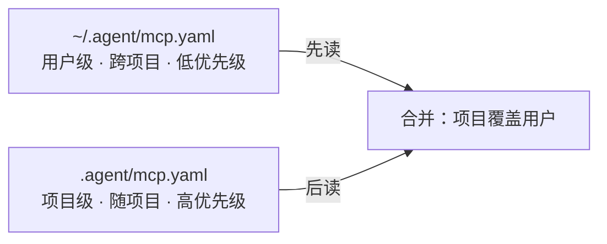
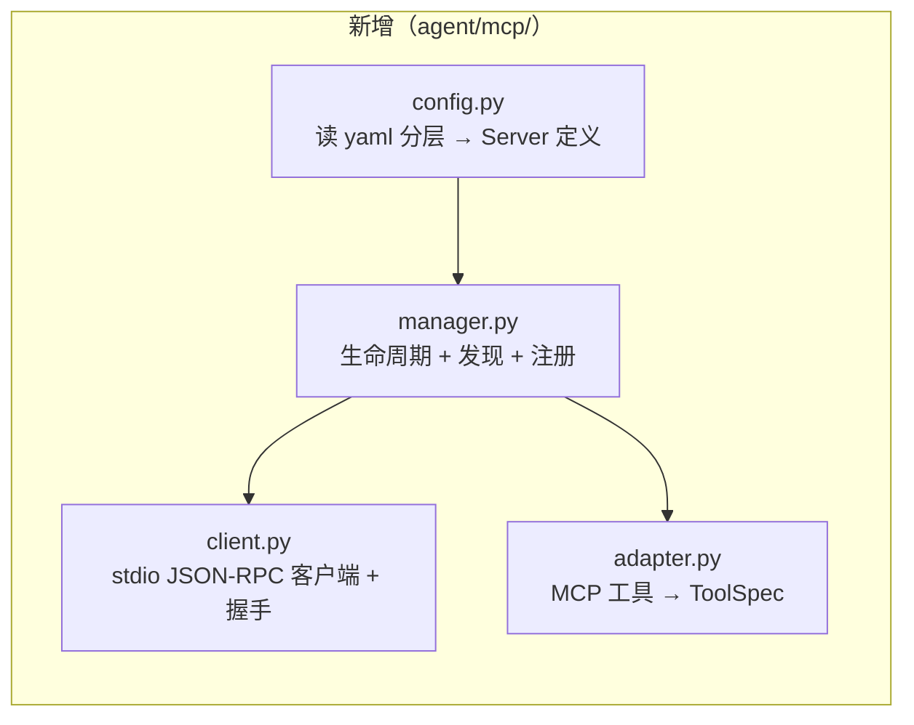
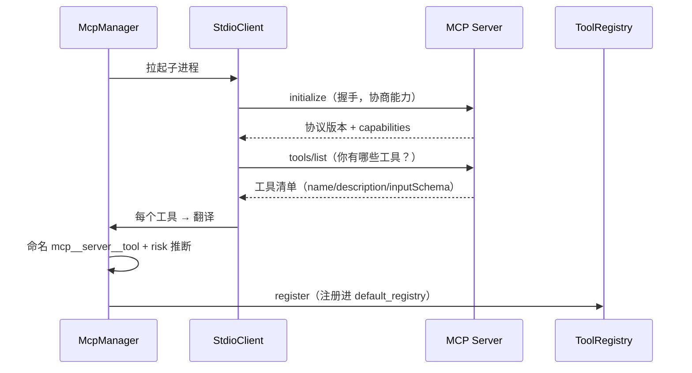
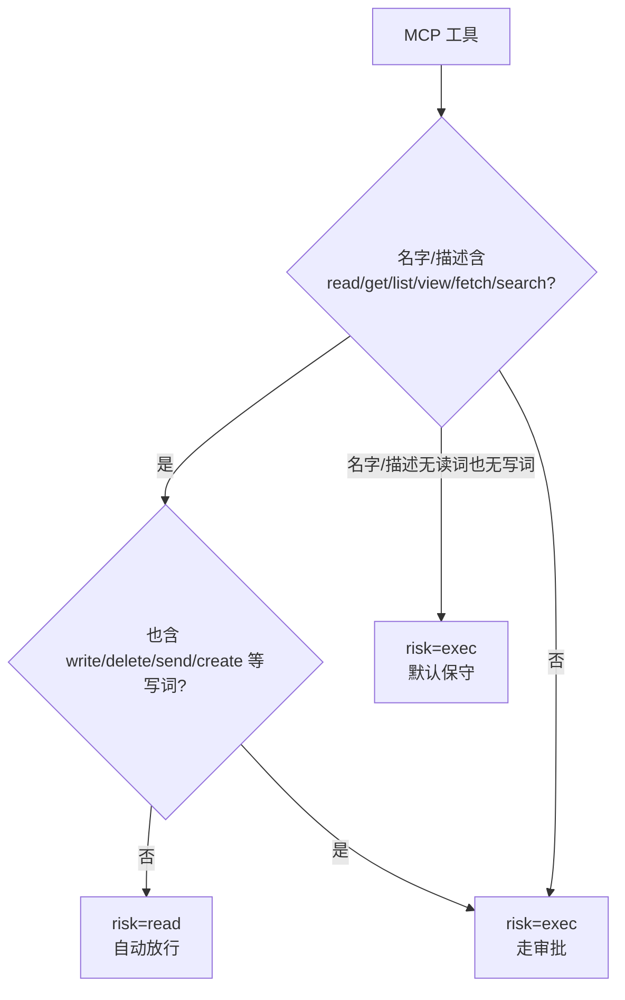
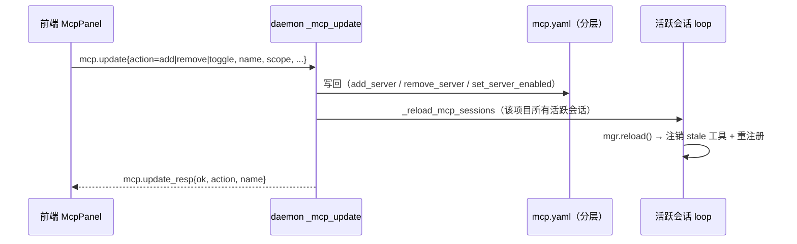

# Step M11.6 MCP 接入：把外部工具"翻译"成 work-agent 的工具

## 实现方案

### 先说人话：这一章到底在做什么

你有没有想过，为什么 AI 助手只能读你项目里的文件，却不能去查 GitHub、不能查你的数据库、不能调用你的内部 API？

**因为每个工具都要单独对接。** 接 10 个工具，就要为每个 AI 应用 × 每个工具写一段对接代码——这就是业内的 **N×M 问题**。

**MCP（Model Context Protocol）就是来解这个问题的。** 它定了统一标准：工具方实现一次 MCP Server，AI 应用按标准接入，就能用遍整个工具生态。Claude Code、OpenAI Codex 都已经支持 MCP。

这一章，就是让 **work-agent 也能接 MCP**。核心思路只有一句话：

> **把 MCP 工具"翻译"成 work-agent 已有的普通工具，让调度、审批、上下文统统无感。**

你只要记住这个类比：MCP 工具就像一个"外挂"的工具，挂进我们已有的工具库里。对模型来说，`mcp__github__search_issues` 和内置的 `read` **长得一模一样**。

### 配置：统一 yaml，分两层

MCP Server 在哪配置？我们不用 JSON，**统一用 yaml**，而且分两层（和 `settings.yaml` 完全一致的套路）：



- **用户级** `~/.agent/mcp.yaml`：配一台机器通用的 Server（比如你的 GitHub Server）。
- **项目级** `.agent/mcp.yaml`：配当前项目专用的 Server（比如这个项目的数据库）。
- 同名 Server **项目级覆盖用户级**。

配置长这样：

```yaml
# .agent/mcp.yaml
mcpServers:
  github:
    command: npx
    args: ["-y", "github-mcp-server"]
    env:
      TOKEN: "${GITHUB_TOKEN}"   # ${VAR} 从环境变量展开，密钥不进 yaml
  demo:
    command: python
    args: ["-m", "agent.mcp.demo_server"]
```

> **安全提醒**：`.agent/` 目录已经被 `.gitignore` 忽略，所以项目级 `mcp.yaml` 天然不会进版本控制；密钥用 `${VAR}` 展开，放在环境变量里。

### 三大组件：谁负责干什么

要实现 MCP 接入，只需要三个新东西。它们各管一摊，互不越权：



| 组件 | 干什么 | 通俗类比 |
|---|---|---|
| `config.py` | 读 yaml，得到"要接哪些 Server" | 查通讯录，看看要打给谁 |
| `client.py` | 拉起 Server 子进程，握手、`tools/list`、`tools/call` | 打电话的人，负责收发消息 |
| `adapter.py` | 把 MCP 工具翻译成 `ToolSpec` | 翻译官，把"外语工具"说成"自己人" |
| `manager.py` | 统筹生命周期，发现后注册进工具库 | 管家，把翻译好的工具都安顿好 |

### 发现：怎么知道 MCP Server 有什么工具

一个 Server 可能暴露几十个工具。怎么把它们变成 work-agent 认得的工具？

流程是这样的：



**命名用三段式**：`mcp__<server>__<tool>`。好处是 `mcp__` 前缀天然不可能和内置工具（`read`/`write`/`bash`…）撞名，还能一眼看出归属。

```python
# adapter.py 关键代码
def name(self) -> str:
    return f"mcp__{safe_name(self.server_name)}__{safe_name(self.tool_name)}"
```

### 风险推断：fail-closed，宁可多审一次

MCP 工具**不会自报风险**，得靠我们猜。猜的原则只有一条：

> **宁可保守。** 拿不准就当"写操作"处理（走审批），只有明确是只读才放行。



```python
# adapter.py 关键代码
def _infer_risk(name, description) -> str:
    text = f"{name} {description}".lower()
    is_read_hint = any(w in text for w in READ_WORDS)
    is_write_hint = any(w in text for w in WRITE_WORDS)
    if is_read_hint and not is_write_hint:
        return "read"  # 明确只读才放行
    return "exec"  # 其余一律保守 → 走审批
```

> 记住：**宁可多审一次，不可漏审一次。** 把写操作误判成只读放行，可能造成破坏。

### 调用：完全走现成路径

调用 MCP 工具，和调用内置工具**一模一样**——因为翻译后它就是普通 `ToolSpec`：

```mermaid
sequenceDiagram
    participant Model as 大模型
    participant Loop as ReAct 循环
    participant Gate as ApprovalGate
    participant Ad as MCPToolAdapter
    participant S as MCP Server

    Model->>Loop: tool_call(mcp__demo__search_files, {...})
    Loop->>Gate: 按 risk 判断（read 放行 / exec 弹审批）
    Loop->>Ad: adapter.fn(args)
    Ad->>S: tools/call(name, args)
    S-->>Ad: 结果 content 数组
    Ad-->>Loop: ToolResult（文本拼好）
    Loop-->>Model: 结果回填
```

**注意 MCP 返回的是 `content` 数组**，可能是文本、图片等。目前只支持文本，从 `TextContent` 里抽出拼成 `output`：

```python
# adapter.py 关键代码
async def fn(self, args):
    resp = await self.client.call_tool(self.tool_name, args or {})
    if resp.isError:
        return ToolResult(ok=False, error=resp.text())
    return ToolResult(ok=True, output=resp.text())
```

### 懒启动：什么时候拉起 Server

MCP Server 是子进程，拉起要花时间。所以**不要程序一启动就去拉**，而是等 Agent 真正开始干活（`run()`）时才拉起，而且只拉一次（幂等）：

```python
# loop.py
async def _ensure_mcp(self):
    if self._mcp_started or self.mcp_manager is None:
        return
    self._mcp_started = True
    try:
        await self.mcp_manager.start()
        self.mcp_manager.register_to(self.registry)
    except Exception:
        logger.warning("MCP init failed, tools unavailable", exc_info=True)
```

### daemon 无会话也能查 MCP

你也许想知道："我 daemon 都启动了，还没建任何会话，能不能先看看配了哪些 MCP？"

**能。** 我们加了个 `/mcp` 命令 + `show_mcp` 消息，跟 `/skills` `/agents` `/tools` 一样，是**全局只读查询**：

```text
前端发 command{mcp} → daemon 读分层 yaml → 回 show_mcp{servers:[{name, source}]}
```

`source` 告诉你是用户级还是项目级配的。**不拉起进程，纯读配置**，所以很轻。

## 验收标准

- [x] yaml 分层配置：项目级覆盖用户级；`${VAR}` 环境变量展开。
  - 验证：`tests/unit/test_mcp.py::test_load_servers_project_overrides_user` / `test_load_servers_env_expansion` / `test_mcp_config_paths` 通过。
- [x] 命名：`mcp__<server>__<tool>` 三段式 + 非法字符清洗。
  - 验证：`test_safe_name` 通过（`My Server!` → `My_Server`，空 → `tool`）。
- [x] risk fail-closed：只读白名单才 read，其余 exec（走审批）。
  - 验证：`test_infer_risk_read_vs_write` 通过（`search_issues`→read，`delete_file`→exec，`read_and_delete`→exec）。
- [x] 真实拉起 demo_server 子进程，能发现 4 个工具并注册。
  - 验证：`test_discover_and_call` 通过（`mcp__demo__search_files` 等注册；`search_files` risk=read，`delete_file` risk=exec；调用 `add` 返回 5）。
- [x] 调用 MCP 工具返回正确 `ToolResult`；未知工具返回 `isError`。
  - 验证：`test_call_unknown_tool_returns_error` 通过（demo server 对未知工具返回 `unknown tool`）。
- [x] 容错：单个 Server 启动失败不拖垮整体。
  - 验证：`test_start_skips_broken_server` 通过（broken 跳过，demo 仍发现 4 个工具）。
- [x] daemon 无会话可查 MCP：`/mcp` + `show_mcp`。
  - 验证：协议契约 `test_m9_protocol_contract` 通过（MsgType=44，含 `show_mcp`）；`_list_mcp` 读分层 yaml。
- [x] 门禁全绿。
  - 验证：`ruff check` / `ruff format --check` / `basedpyright`(0 errors) / `pytest` **473 passed**（+9 MCP 用例）；前端 `tsc` / `vitest` 81 passed / `build`。

## 知识沉淀

### MCP 接入最终形态（`agent/mcp/`）

- **配置**：`config.py` 读**分层 yaml**（用户级 `~/.agent/mcp.yaml` + 项目级 `.agent/mcp.yaml`，项目覆盖用户）。`load_servers(project_root, inline)` 是唯一入口，同时服务 `McpManager` 和 daemon 查询。`${VAR}` 环境变量展开。
- **客户端**：`client.py` 的 `StdioClient` 管理子进程 stdin/stdout 的 **newline-delimited JSON-RPC 2.0**。生命周期：`start()` → `initialize()`（握手）→ `tools/list` → `tools/call` → `close()`。pending 请求用 `dict[id]→Future` 配对。
- **适配器**：`adapter.py` 的 `McpToolAdapter` 把 MCP 工具翻译成 `ToolSpec`。命名 `mcp__server__tool`（`safe_name` 清洗非法字符成 `_`）；risk 用 `_infer_risk` **fail-closed**（只读白名单 → read，其余 → exec）；fn 发 `tools/call`，从 `content` 数组的 `TextContent` 抽文本拼 `ToolResult`，超时/异常转 `ok=False`。
- **管理器**：`manager.py` 的 `McpManager` 构造时加载配置（同步，不拉起），`start()` 幂等地拉起 Server、握手、发现、翻译；`register_to(registry)` 注册；`close()` 关闭所有连接。**单 Server 失败只记日志跳过，不拖垮整体**。
- **`ToolSpec` 扩展**：加了 `is_mcp: bool`、`mcp_server: str | None`、`to_catalog()`（L1 目录，延迟加载预留）。调度/审批/上下文**零改动**——它们只认扁平 `name`。
- **配置**：`Settings.mcp`（`MCPConfig`）：`enabled` / `tool_timeout_sec` / `concurrency` / `max_output_chars` / `max_catalog` / `max_active`。

### 懒启动与错误处理（loop.py）

- `AgentLoop._ensure_mcp()`：首次 `run()` 才 `mcp_manager.start()` + `register_to(self.registry)`，幂等（`_mcp_started`），失败仅记日志不影响主循环。
- `Session.__init__`：若 `settings.mcp.enabled` 则构造 `McpManager(settings.mcp, project_root=cwd)` 传给 `AgentLoop`。

### daemon 无会话查询 MCP

- `protocol.py` 新增 `SHOW_MCP`（MsgType 44→46）。`server.py` `_command` 无 attach 分支：`name=="mcp"` → `_list_mcp(conn, project_root)`，读分层 yaml 返回 `{servers:[{name, source, command, args, env, enabled}]}`（source ∈ user/project，项目覆盖用户后去重），**不拉起进程**。返回完整配置，前端才能展示/编辑。
- 契约三处同步：`protocol.py` + `docs/daemon-api.md`（5.15 `show_mcp`）+ `desktop/src/protocol/types.ts`（`McpServerInfo`），契约测试 count=46。

### 内建 skill 与内建 MCP

**内建 skill（skillcreator）**：
- `SkillLoader` 加**内建目录扫描**：`agent/skills/builtin/<name>/SKILL.md`（随代码分发，任何项目开箱即用）。
- `discover()` 扫描顺序 `builtin → user → project`（后扫描覆盖先扫描，即项目 > 用户 > 内建）。
- `SkillSpec.source` 扩展为 `builtin/user/project`。
- `skillcreator` 技能教 Agent 如何写规范 SKILL.md（frontmatter 字段 + 模板变量 `$ARGUMENTS`/`$1`/`${SKILL_DIR}` 等）。

**内建 MCP（天气查询 weather）**：
- `agent/mcp/weather_server.py`：本地 stdio MCP server，暴露 `get_weather(city)`（只读，模拟数据，离线可用）。
- `McpManager._load_config()`：加载 yaml 后，若没有名为 `weather` 的 server，则**自动追加内建 weather**（command=`sys.executable -m agent.mcp.weather_server`）；用户已在 yaml 配了同名 `weather` 则覆盖（不重复拉起）。
- 工具名 `mcp__weather__get_weather`，risk=read（名字含 get + 描述只读）。

### 管理交互：前端增删改 / 启停

用户要"方便地管理和接入 MCP，并决定是否开启"。设计是仿照 `skill.update`/`agent.update` 的**写回 + 重载**模式：



- **协议**：`mcp.update`（C→S）+ `mcp.update_resp`（S→C）。`action`=add/remove/toggle，`scope`=user/project（默认 project）。
- **写回**：`config.add_server(name, command, args?, env?, cwd?, enabled?, scope?)` / `remove_server` / `set_server_enabled`，**原子写**（临时文件 `.yaml.tmp` → replace），${VAR} 不展开原样保留。
- **重载**：`_reload_mcp_sessions(registry, proj)` 遍历 `registry._sessions`，对 `handle.session.loop.mcp_manager` 调 `reload()`，用返回的 stale 工具名从 `loop.registry.unregister` 注销，再重注册新工具。
- **`McpManager.reload()`**：对比前后配置——禁用/删除的停掉（返回其工具名供注销）、新增/启用的拉起、command 变化的重连；`reload_if_changed()` 按配置 mtime 惰性检测（loop 每轮 `_ensure_mcp` 调用）。
- **`ToolRegistry`** 加 `unregister(name)` / `unregister_server(mcp_server)`。
- **前端 `McpPanel.tsx`**：订阅 `show_mcp` + `command('mcp')`；卡片列表（名称 + 来源徽标 + enabled 开关 + command 显示 + 编辑/删除）；新增/编辑表单（name/command/args/env/scope/enabled）；`client.updateMcp(action, name, {...})`。Sidebar 加 `LeftNav 'mcp'`（`Plug` 图标）。

### 关键坑

1. **Windows 子进程 transport 泄漏**：`StdioClient.close()` 必须 `terminate()` + cancel read task，否则跑 pytest 会 `ResourceWarning`（proactor transport 未关）。
2. **demo_server 只在 tools/list 里声明过的工具能调**：`registry.run` 只能调注册过的 spec；测"未知工具"要直接 `client.call_tool("no_such", {})` 走 server 的 `isError` 分支。
3. **`_infer_risk` 对模糊名判 exec**：`echo`/`add` 名字不含读词 → 判 exec，这是设计如此（fail-closed），不是 bug。测试只读断言要用名字含 read 词的工具（如 `search_files`）。
4. **`tool_search` 延迟加载（已实现）**：**未激活的 MCP 工具不进 tools 列表**——只在 system prompt 的 `_mcp_catalog_prompt()` 文本目录列出 name+一句话；模型 `tool_search(query)` 命中→入 `loop._mcp_active`→下一轮完整 `to_openai()` 进 tools 列表，激活后从目录消失。**坑**：① 千万别把未激活 MCP 以 function 形式塞进 tools 列表（模型会直接调空 schema 工具→参数缺失→出错，**这是实际踩过的坑**）；② `tool_search`/`_mcp_catalog_prompt`/`TOOL_SEARCH_TOOL_NAME` 必须放所有 import 之后（否则 E402），记得 import `ToolSpec`；③ `to_catalog()` 现不再使用（保留但无效），用 `_mcp_catalog_prompt()` 文本代替；④ `_exec_tools` 加 `tc.name=="tool_search"` 分支。
5. **`show_mcp` 必须返回完整配置**（command/args/env/enabled），否则前端只有名字无法编辑。
6. **内建 weather 不全量下发**：MCP 工具（含内建 weather）默认只在 `tool_search` 目录里，不会直接出现在完整工具列表；模型要天气先 `tool_search("weather")`。
6. **`scope` 写错层**：写 project 却配到 user，工具在错误 scope 生效；同名 server 项目级会覆盖用户级，改的时候要注意目标层。
7. **重载注销要与注册成对**：`mgr.reload()` 返回 stale 工具名后，调用方必须 `unregister` + `register_to`，否则旧工具残留或新工具缺失。

> 同步追加至 `knowledge/INDEX.md` 的「MCP 接入设计」与「MCP 已落地」「MCP 管理交互」条目。
