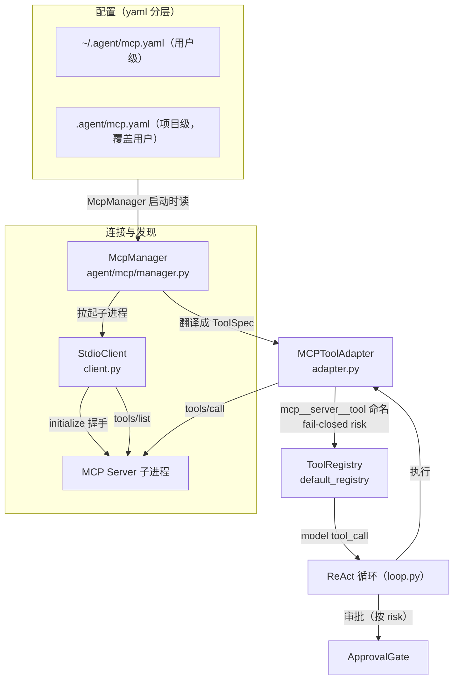

# 里程碑 M11：技能 / 智能体面板 + MCP 接入

> 让 Agent 的"能力"更开放、更好管：一边打磨技能/智能体面板的交互与可视化，
> 一边接入 **MCP（Model Context Protocol）**，把外部工具生态接进 work-agent。

## 一句话目标

> **让 Agent 会"用外部工具"，也让用户"看得见、管得住"Agent 的能力。**

本里程碑分两大块：

| 块 | 内容 | 步骤 |
|---|---|---|
| **技能/智能体面板** | 来源分组、技能开关、智能体编辑、编辑面板 UI 美化 | M11.1–M11.5 |
| **MCP 接入** | yaml 分层配置 + stdio 发现/调用 + daemon 无会话查询 | M11.6 |

## 已确认的关键决策

| 项 | 决策 |
|---|---|
| MCP 配置格式 | **统一 yaml 分层**：用户级 `~/.agent/mcp.yaml` + 项目级 `.agent/mcp.yaml`（项目覆盖用户），与 settings.yaml 同约定 |
| MCP 工具接入方式 | 翻译成普通 `ToolSpec` 进 `default_registry`，让调度/审批/上下文**零改动**复用 |
| MCP 工具命名 | `mcp__<server>__<tool>` 三段式（`mcp__` 免疫内置冲突 + 非法字符清洗） |
| MCP risk 推断 | **fail-closed**：默认当有写操作（exec 走审批），只读白名单例外才 read |
| 启动方式 | 懒启动：`AgentLoop` 首次 `run()` 才拉起 Server + 注册工具（幂等） |
| daemon 无会话查询 | `/mcp` 命令 + `show_mcp` 消息，读分层 yaml 返回 `{name, source}` 清单（不拉起进程） |
| 工具/技能清单 | `/tools` + `show_tools`，前端从后台真实注册表拉取，不再硬编码 |

## 架构总览

MCP 接入的本质：**把"外部工具"翻译成 work-agent 已有的"内部工具"，让一切无感**。

**关键洞察**：模型、审批、上下文看到的 MCP 工具，和内置 `read`/`bash` **长得一模一样**。MCP 只出现在 adapter 的 `fn` 里（发一次 `tools/call` 到远端）。

## 前置依赖

- **M7 daemon** 已完成：WS 协议、`MsgType`、无会话全局查询分支（`/skills` `/agents` 已落地）。
- **M11.0 工具白名单后台化**（M11.6 内）：`/tools` + `show_tools` 已实现。
- 系统已装 Python 3.12+ + `pip install -e ".[dev]"`（测试拉起 demo_server 子进程需要）。

## 步骤索引

| 步骤 | 文件 | 目标 |
|---|---|---|
| M11.1–M11.5 | （技能/智能体面板，非本 README 重点） | 来源分组、技能开关、智能体编辑、编辑面板 UI |
| M11.6 | [M11.6-MCP接入.md](./M11.6-MCP接入.md) | MCP 接入：yaml 分层配置 + stdio 发现/调用 + risk 推断 + daemon 无会话查询 |

## 里程碑级知识沉淀

> 全部步骤完成后，汇总跨步骤结论。MCP 接入的完整沉淀见 M11.6 文档与 `knowledge/INDEX.md` 的「MCP 接入设计」条目。
