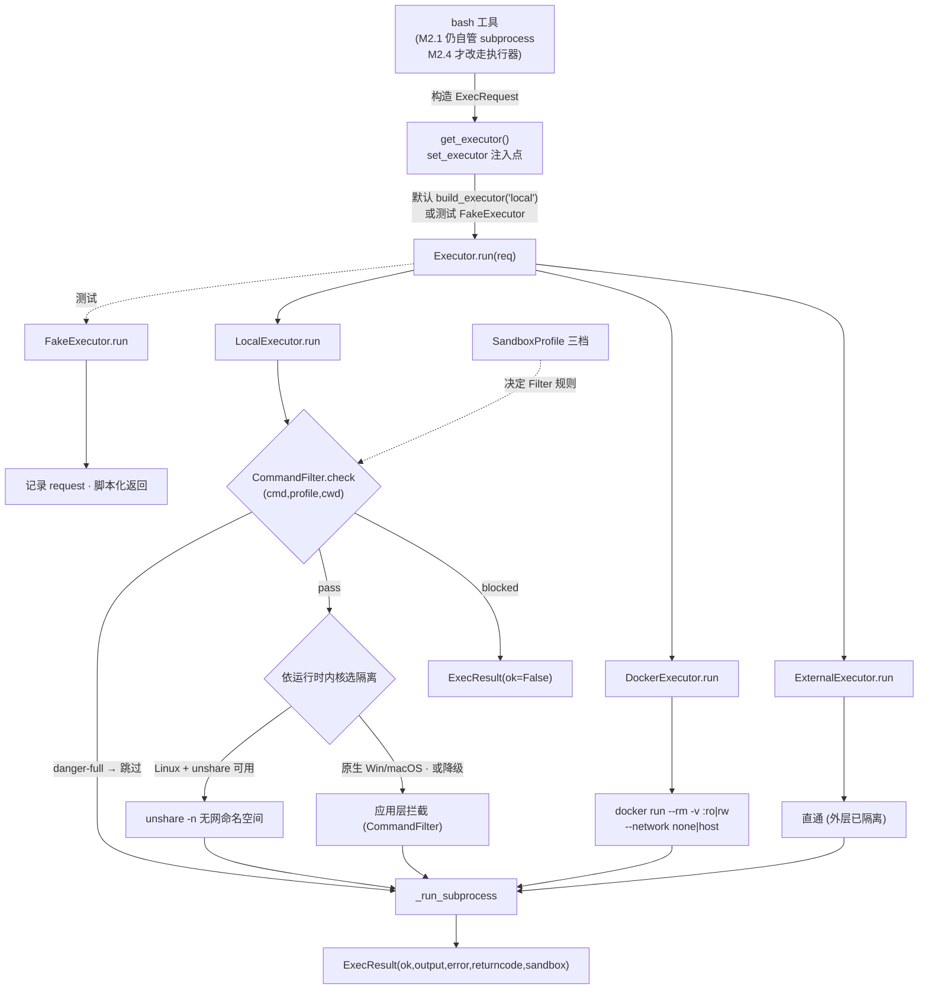

# Step M2.1 沙盒执行层（SandboxExecutor）

## 实现方案

- 目标：实现 OS 级、可插拔的**命令执行层**，把"命令跑在哪、能读写什么、能否联网"从 `bash` 工具里抽出来，统一交给 `Executor`。参考 Codex 的 `sandbox` 模块（`local`/`docker`/`external` + 三档 profile）。
- 改动文件：新建 `agent/runtime/sandbox.py`；`agent/runtime/__init__.py` 导出 `SandboxProfile`/`Executor`/`build_executor` 等。
- 关键接口/算法（伪代码/签名，详见设计文档 §2.5）：

  ```python
  # agent/runtime/sandbox.py
  class SandboxProfile(str, Enum):
      READ_ONLY = "read-only"
      WORKSPACE_WRITE = "workspace-write"
      DANGER_FULL = "danger-full"

  @dataclass
  class ExecRequest:
      cmd: str
      cwd: Path
      env: dict[str, str]
      timeout: int = 30
      profile: SandboxProfile = SandboxProfile.WORKSPACE_WRITE

  @dataclass
  class ExecResult:
      ok: bool
      output: str
      error: str | None
      returncode: int
      sandbox: str           # 实际执行器名，trace 用

  class Executor(Protocol):
      name: str
      async def run(self, req: ExecRequest) -> ExecResult: ...

  class LocalExecutor:       # OS 级：Linux/macOS 用内核原语强隔离；原生 Windows 用 CommandFilter 应用层拦截（不打印告警）；旧内核降级 + ⚠️告警
  class DockerExecutor:      # docker run --rm -v ... -w /work --network <none|host>
  class ExternalExecutor:    # 直通（外层已隔离，对应 Codex externalSandbox）
  class FakeExecutor:        # 测试：记录请求、可脚本化返回（不真跑）

  @dataclass
  class FilterVerdict:
      blocked: bool
      reason: str | None = None   # 被哪条规则拦（用于 ExecResult.error）

  class CommandFilter:       # 应用层命令沙箱：spawn 前静态分析命令，按 profile 主动拦截
      def check(self, cmd: str, profile: SandboxProfile, *, cwd: Path) -> FilterVerdict:
          # read-only/workspace-write：越界写、联网、破坏性模式 → blocked
          # danger-full：放行
          ...

  def build_executor(mode: str, *, workspace: Path,
                     profile: SandboxProfile) -> Executor:
      # mode ∈ {"local","docker","external"}（settings.sandbox_mode）
  ```

- **LocalExecutor 的 OS 级策略（设计文档 §2.2）**：
  - Linux（≥5.13）：优先 `unshare -n`（无网命名空间，零依赖）断网；可用时叠加 Landlock（FS 规则：read-only=全只读，workspace-write=cwd 可写）与 seccomp（拦 `socket` 等网络/危险 syscall）。隔离库（`landlock`/`seccomp` PyPI）**可选**，import 失败则降级为仅 `unshare -n` 或纯进程级，并打告警。
  - macOS：Seatbelt（`sandbox-exec` + 内联 `.sb` profile），read-only/workspace-write 对应不同规则。
  - Windows：**无原生 seccomp/Landlock**。`LocalExecutor` 内装**应用层 `CommandFilter`**：`run()` spawn 前静态分析命令，按 profile 拦越界写/联网/破坏性模式（返回 `ok=False`，理由写"沙箱拦截：…"），**不打印告警**；叠 Job Object 限制子进程树。仍是软约束（可被混淆绕过），极高风险任务用 `mode=docker`/`external`。
  - **可用性门控**：Linux/macOS 因内核过旧无法用 OS 原语时**不崩溃**，降级为"尽力而为 + ⚠️ 告警"并推荐 `docker`/`external`；原生 Windows 走 `CommandFilter` 应用层主动拦截（不打印告警）。架构正确、可插拔，不强依赖 root/特定内核。
- **DockerExecutor**：`docker run --rm -w /work <image> <shell> -c <cmd>`，profile 映射：`read-only`→`-v :ro --network none`；`workspace-write`→`-v :rw --network none`；`danger-full`→`-v :rw --network host`。通过 `subprocess` 调 `docker` CLI（不引入重依赖）。
- **ExternalExecutor**：`run` 直接以普通子进程执行（不隔离），由外层环境负责安全。
- **执行器可注入**：`get_executor()` 模块级函数读取当前 `Settings.sandbox_mode` 返回实例；`bash` 工具调用它。测试用 `FakeExecutor` 替换，保证确定性、不依赖 root/网络。
- 依赖/环境：`pyproject.toml` 把 `docker`/`landlock`/`seccomp` 列为**可选**额外依赖（`pip install -e ".[sandbox]"`），不强依赖；核心路径不 import 它们（用 try/except 懒加载）。

## 验收标准

- [ ] 命令/测试：`pytest tests/test_sandbox.py -q` 全绿；包含：`build_executor` 按 `mode` 返回正确实例；`FakeExecutor` 记录 `ExecRequest` 并返回脚本化 `ExecResult`；`ExternalExecutor` 直通执行 `echo` 成功；`LocalExecutor` 在测试环境（CI Linux）能跑通 `echo`（不强依赖 root，隔离不可用时降级不报错）。
- [ ] 行为：`LocalExecutor` 原生 Windows 经 `CommandFilter` 主动拦截越界写/联网（不打印告警），Linux/macOS 旧内核降级为 ⚠️ 告警；`profile=read-only` 时构造的请求不含网络放行标记（可在 `FakeExecutor` 断言 `ExecRequest.profile`）。
- [ ] 不变量：`ExecResult` 形态与 `ToolResult` 对齐（`ok/output/error`），便于 `bash` 工具直接转 `ToolResult`；执行器接口 `Protocol` 被 `FakeExecutor`/`LocalExecutor`/`DockerExecutor`/`ExternalExecutor` 全部满足（静态/运行时可检查）。

## 知识沉淀

> 完成本步后填写：接口签名、OS 降级策略、注入点、踩坑。同步追加到 `knowledge/INDEX.md`（见 M2.4 汇总或每步各补一条）。

**架构示意（命令如何流经沙盒执行层）**：



- **接口签名**：`SandboxProfile`（str Enum 三值）、`ExecRequest`/`ExecResult` dataclass、`Executor` Protocol（`name` + `async run`）、`build_executor(mode, *, workspace, profile)`、`get_executor()` 模块级注入点、`FakeExecutor`（测试）。→ 详见 `knowledge/INDEX.md` 的「M2.1 沉淀」小节（权威、跨里程碑）。
- **OS 降级铁律**：内核隔离**可用时才用**（Linux `unshare -n` 探活后再用），不可用时退化为进程级 + `logging.warning` 告警，**绝不抛异常中断 Agent**。`unshare -n` 是 Linux 断网的最低成本手段（无需 root，WSL2 自动命中）。
- **Windows 现实**：无 seccomp/Landlock，`LocalExecutor` 内装 `CommandFilter` 应用层主动拦截越界写/联网/破坏性命令（**不打印告警**）；它弱于内核沙箱（可被混淆绕过）；真隔离靠 `docker`/`external`（WSL 属 Linux，landlock 可用）。macOS 本步同样走 `CommandFilter` 应用层（Seatbelt 集成留作后续可选）。
- **可注入**：`bash` 不直接 `subprocess`，而是经 `get_executor()`；测试用 `set_executor(FakeExecutor(...))` 替换，避免联网/root。`get_executor()` 当前按默认 `local + cwd + workspace-write` 构造工厂；M2.3/2.4 改为读取 `Settings.sandbox_mode`/`sandbox_profile`。
- **对 M2.4 约束**：`bash` 工具将改为构造 `ExecRequest` 并调 `get_executor().run(...)`，把 `ExecResult` 转 `ToolResult`；`ExecResult` 形态已对齐 `ToolResult` 的 `ok/output/error`。
- **踩坑（必记）**：重定向正则 `re.finditer(r"(?<!&)(>>?)\s*(\S+)", ...)` 的**负向 lookbehind 必须是定宽**——写成 `(?<!&\d*)` 会因变长后顾断言抛 `re.error: look-behind requires fixed-width pattern`。正确做法：先 `re.sub(r"&>", "> ", norm)` 把 `&>` 归一成普通 `>` 重定向，再用定宽 `(?<!&)` 匹配；`/dev/null` 黑洞重定向与 `2>&1` fd 合并须在归一化阶段剔除，不计入写目标。
- **验收结果**：`pytest tests/test_sandbox.py -q` 14 passed；全量 `pytest` 99 passed。`FakeExecutor` 记录 `ExecRequest` 并可断言 `profile`；`ExternalExecutor` 直通 `echo` 成功；`LocalExecutor` 在 CI(Linux/原生 Windows/macOS) 跑通 `echo` 且不强依赖 root；`CommandFilter` 拦截网络/越界写/破坏性且静默（无 "未隔离" 告警）；`danger-full` 放行网络。
