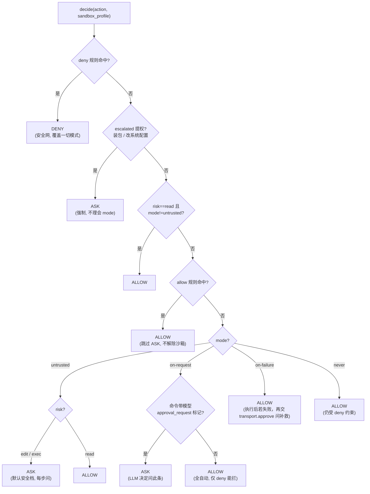

# Step M2.2 审批门（ApprovalGate）

## 实现方案

- 目标：实现确定性**审批决策组件** `ApprovalGate`，采用 Codex 的 `AskForApproval` 四模式 + allow/deny 声明式规则 + 单步 HITL 回调。它不执行命令，只回答"这次工具调用能不能跑"。
- 改动文件：新建 `agent/runtime/approval.py`；`agent/runtime/__init__.py` 导出。
- 关键接口/算法（设计文档 §3.4）：

  ```python
  # agent/runtime/approval.py
  class ApprovalMode(str, Enum):
      UNTRUSTED = "untrusted"     # exec/edit 每步问；read 自动过
      ON_REQUEST = "on-request"   # 自动跑；模型对单条命令标 approval_request 才问（LLM 决定），deny 仍拦
      ON_FAILURE = "on-failure"   # 自动跑；执行后若失败，才交 HITL 问补救（非事前问）
      NEVER = "never"             # 全自动；deny 仍生效

  @dataclass
  class Action:
      tool: str          # bash / read / write / edit ...
      risk: str          # read / edit / exec（来自 registry.risk）
      args: dict         # 命令文本 / 路径，供规则匹配
      description: str   # 人类可读一行，给 HITL 展示
      approval_request: bool = False  # 模型在单条命令显式请求审批（on-request 模式用）
      escalated: bool = False         # 提权操作（装包 / 改系统配置），触发强制 ASK

  @dataclass
  class Decision:
      verdict: str       # "allow" | "deny" | "ask"
      reason: str

  class ApprovalGate:
      def __init__(self, mode: ApprovalMode, *, allow=None, deny=None,
                   ui=None, noninteractive_default: str = "allow",
                   sandbox_profile: str = "workspace-write"):
          self.sandbox_profile = sandbox_profile   # 感知沙箱：作为 decide 的包含程度信号
          ...
      def decide(self, action: Action, sandbox_profile: str) -> Decision:
          # 1) deny 规则命中 → DENY（安全不变量，优先于一切模式）
          # 2) escalated 提权 → ASK（不理会 mode）
          # 3) read 且非 untrusted → ALLOW
          # 4) allow 规则命中 → ALLOW（短路，减少确认疲劳）
          # 5) 按 mode：
          #    untrusted → (exec/edit)ASK / (read)ALLOW
          #    on-request → 命令带 approval_request? ASK : ALLOW   # ← LLM 决定
          #    on-failure → ALLOW（执行后才可能问；失败才交 HITL 问补救）
          #    never     → ALLOW（仍受 deny 约束）
          # 注：sandbox_profile 作为"包含程度"信号参与风险判定（感知沙箱）
      async def authorize(self, action: Action) -> bool:
          d = self.decide(action, self.sandbox_profile)
          if d.verdict == "deny":
              return False
          if d.verdict == "allow":
              return True
          # ASK：调 ui.approve(action)；无 ui（非交互）→ noninteractive_default
  ```

- **规则匹配（Codex ExecPolicy 思想）**：`deny`/`allow` 为字符串列表，支持**前缀匹配**（如 `rm `、`git push`）与**正则**（以 `/.../` 包裹）。匹配对象：
  - `bash`：`args["cmd"]` 文本（复用 `bash.is_readonly_command` 的分段归一化思路——按 `; && || |` 切段、去 `sudo`、判重定向，避免 `echo x > file` 被当只读放行）。
  - `read`/`write`/`edit`：`args["path"]`（可后续细化到路径前缀）。
- **HITL 回调**：`ui` 为可选 `ApprovalUI`（窄 HITL 协议，仅 `async approve(action)->bool`；由统一协议 `AgentTransport` 结构满足，M2.5 在 `AgentTransport` 上实现 `approve`）。ASK 时 `await ui.approve(action) -> bool`。`ui` 为 `None`（非交互 / 测试）时按 `noninteractive_default`（默认 `allow`）放行——你已委派任务、命令进沙箱，不应阻塞 CI。
- **`on-failure` 语义**：`decide` 返回 ALLOW 先执行；执行后由调用方（M2.4 的 `loop`）判断 `ToolResult.ok`，失败时再 `await ui.approve`（问是否重试/继续）。
- **`deny` 永远优先**：即便 `mode=never`，命中 `deny` 仍 DENY——安全不变量不可被"信任模式"绕过（设计文档 §1 不变式）。
- 依赖/环境：纯 Python，无新依赖；可独立单测（注入假 `ui`）。

## 验收标准

- [ ] 命令/测试：`pytest tests/test_approval.py -q` 全绿，覆盖：
  - 四模式对 read/edit/exec 的 verdict（见设计文档 §4.3 矩阵）；
  - **deny 优先**于所有模式（含 `never` 下 deny 仍 DENY）；
  - **allow 短路**跳过 ASK；
  - `noninteractive_default`：无 `ui` 时 ASK→按默认（默认 allow）返回 True；
  - 注入假 `ui` 返回 False → `authorize` 返回 False；返回 True → True；
  - 规则匹配：前缀 `rm ` 命中 deny；`/^curl .*example\.com/` 正则命中；`sudo rm x` 归一化后被 deny 命中。
- [ ] 行为：`decide` 是纯函数（无副作用、可重复调用）；`authorize` 仅在 ASK 分支 await `ui`。
- [ ] 不变量：`read` 在 `untrusted` 下 ALLOW（只读不危险）；`exec`/`edit` 在 `untrusted` 下 ASK；`deny` 命中无论模式皆 DENY。

## 知识沉淀

> 完成本步后填写：接口签名、决策顺序、deny 优先铁律、HITL 协议约定。同步追加到 `knowledge/INDEX.md`。

**裁决树（decide 内部，核心铁律）**：



- **接口签名**：`ApprovalMode`（str Enum 四值 `untrusted`/`on-request`/`on-failure`/`never`）、`Action(tool,risk,args,description,approval_request=False,escalated=False)`、`Decision(verdict,reason)`（`verdict∈{allow,deny,ask}`）；`ApprovalGate(mode, *, allow, deny, ui, noninteractive_default="allow", sandbox_profile="workspace-write")`；`decide(action, sandbox_profile=None)->Decision`（**纯函数**，无副作用、可重复调用）；`async authorize(action)->bool`（仅在 ASK 分支 `await ui.approve`）。→ 详见 `knowledge/INDEX.md` 的「M2.2 沉淀」小节（权威、跨里程碑）。
- **决策顺序铁律**：`deny`(1) > `escalated`(2) > `read 非 untrusted`(3) > `allow`(4) > `mode`(5)。`deny` 优先于模式是**安全不变量**（含 `never` 下 deny 仍 DENY），写测试专门守护（`test_deny_beats_never_mode` / `test_deny_beats_allow_shortcut`）。
- **规则匹配（Codex ExecPolicy 思想）**：`allow`/`deny` 为字符串列表，支持**前缀匹配**（`rm `、`git push`）与**正则**（`/.../` 包裹，内部 `re.search`）。匹配对象：bash→`args["cmd"]` 经 `_normalize_cmd` 按 `; && || |` 切段、去 `sudo`/`doas`/环境变量赋值归一化（故 `sudo rm x` 被 `rm ` 命中）；`read`/`write`/`edit`→`args["path"]`。正则规则务必 `/.../` 包裹，裸串按前缀。
- **HITL 协议**：`ui` 为可选 `ApprovalUI`（`runtime_checkable` Protocol，仅 `async approve(action)->bool`），M2.5 在 `AgentTransport` 上实现；`gate` 不持有 IO，只在 ASK 分支调回调，保持确定性、可测。`ui=None`（非交互/测试）时 ASK 按 `noninteractive_default`（默认 `allow`）放行，不阻塞 CI。
- **感知沙箱**：`decide` 接收 `sandbox_profile`（包含程度信号），当前决策逻辑**不因其改变 verdict**（profile 在执行时由沙箱层 OS 强制隔离，见 M2.1）；签名保留供 M2.4 增强。注意 profile 是"放行后的封顶"，与审批结果无关。
- **与 PLAN 模式关系**：`ApprovalGate` 仅 EXEC 模式介入；PLAN 的 `_risk_blocked` 不动。二者是纵深两道独立闸门（设计文档 §1）。
- **对 M2.4 约束**：`loop._exec_tools` 在执行每个工具前构造 `Action` 并 `await gate.authorize`；`bash` 走 `executor`，其余走 `spec.fn`；拒绝/失败返回既有 `ToolResult(ok=False)` 落事件流、不崩循环。`on-failure` 模式下 `authorize` 先 ALLOW，失败后再调 `ui.approve`（M2.4 实现）。
- **验收结果**：`pytest tests/test_approval.py -q` 30 passed；全量 `pytest` 129 passed。覆盖：四模式矩阵（12 例）、deny 优先（含盖过 allow 短路）、allow 短路跳过 ASK、escalated 无视模式强制 ASK（never/on-request）、on-request 仅 `approval_request` 时 ASK、非交互默认 allow/deny、假 ui 返回真假、`decide` 纯函数可重复、`sudo rm` 归一化命中、正则 `/^curl .*example\.com/`、路径工具 `/etc/` 匹配、接受 mode 字符串。
