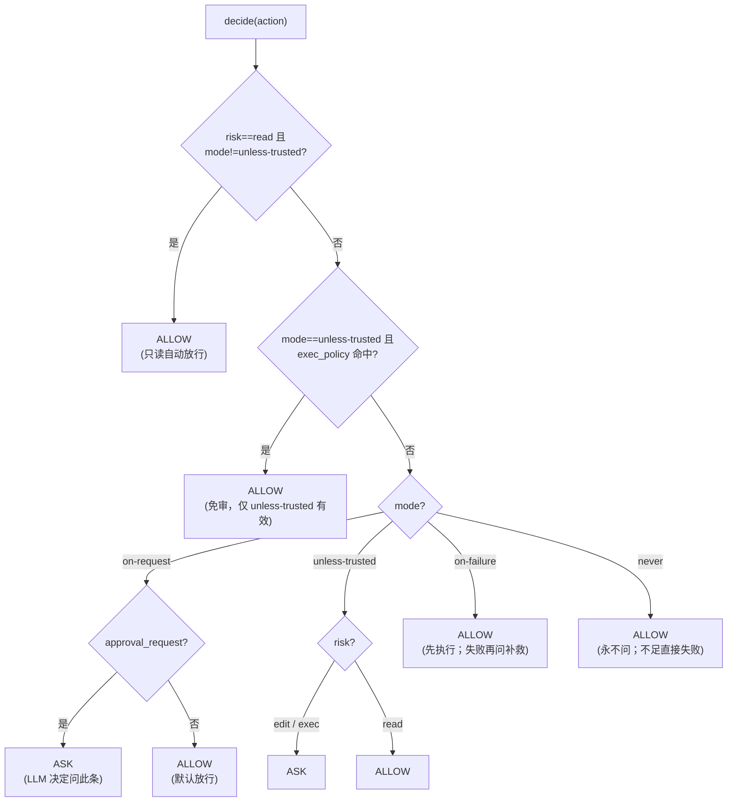

# Step M2.2 审批门（ApprovalGate）

## 实现方案

- 目标：实现确定性**审批决策组件** `ApprovalGate`，采用 Codex 的 `AskForApproval` 四模式 + 执行策略（exec_policy）+ 单步 HITL 回调。
- 改动文件：新建 `agent/runtime/approval.py`；`agent/runtime/__init__.py` 导出。
- **M2 重构后精简**：去掉 deny 规则、去掉 escalated 提权门、exec_policy 仅 unless-trusted 有效、提权自动。
- 关键接口/算法（设计文档 §3.3）：

  ```python
  # agent/runtime/approval.py
  class ApprovalMode(str, Enum):
      ON_REQUEST = "on-request"          # 官方推荐。默认放行；模型标 approval_request 才 ASK
      UNLESS_TRUSTED = "unless-trusted"  # exec/edit 每步问，exec_policy 命中者免审；read 自动过
      ON_FAILURE = "on-failure"          # 先执行，失败才问
      NEVER = "never"                    # 永远不请求审批；权限不足→直接失败

  @dataclass
  class Action:
      tool: str          # bash / read / write / edit ...
      risk: str          # read / edit / exec
      args: dict         # 命令文本 / 路径
      description: str   # 人类可读一行
      approval_request: bool = False  # 模型在单条命令显式请求审批（on-request 模式用）

  @dataclass
  class Decision:
      verdict: str       # "allow" | "ask"
      reason: str
      elevated_profile: SandboxProfile | None = None  # 自动提权（若需联网）

  class ApprovalGate:
      def __init__(self, mode, *, exec_policy=None, ui=None,
                   noninteractive_default="allow", sandbox_profile="workspace-write",
                   elevated_profile="danger-full"):
          ...
      def decide(self, action, sandbox_profile=None) -> Decision:
          # 1) read 且非 unless-trusted → ALLOW
          # 2) unless-trusted + exec_policy 命中 → ALLOW
          # 3) 按 mode：
          #    on-request → approval_request? ASK : ALLOW
          #    unless-trusted → exec/edit ASK, read ALLOW
          #    on-failure → ALLOW
          #    never → ALLOW
          # 提权自动：仅 verdict=="ask" 且需联网时携带 elevated_profile
      async def authorize(self, action) -> bool:
          # ASK 分支 await ui.approve；无 ui → noninteractive_default
  ```

- **执行策略（exec_policy）**：仅 `unless-trusted` 模式有效。支持前缀匹配（`ls `、`git status`）与正则（`/.../` 包裹）。
- **HITL 回调**：`ui` 为可选 `ApprovalUI`（`async approve(action)->bool`）。
- **提权自动**：不再需要 `enable_elevation` 开关。只要命令经 ASK→批准且需联网（断网 profile），自动以 `elevated_profile` 临时执行。

## 验收标准

- [ ] 命令/测试：`pytest tests/test_approval.py -q` 全绿，覆盖：
  - 四模式对 read/edit/exec 的 verdict（见设计文档 §5.2 矩阵）；
  - `unless-trusted` + `exec_policy` 命中 → ALLOW（免审）；
  - `exec_policy` 在 `on-request`/`on-failure`/`never` 下不生效；
  - `noninteractive_default`：无 `ui` 时 ASK→按默认放行；
  - 注入假 `ui` 返回 False → `authorize` 返回 False；
  - 规则匹配：前缀 `ls ` 命中 exec_policy；正则 `/^git (status|log)/` 命中；`sudo ls` 归一化后被命中。
- [ ] 行为：`decide` 是纯函数；`authorize` 仅在 ASK 分支 await `ui`。
- [ ] 不变量：`read` 在 `unless-trusted` 下 ALLOW（只读不危险）；`exec`/`edit` 在 `unless-trusted` 下 ASK。

## 知识沉淀

**裁决树**：



- **接口签名**：`ApprovalMode`（str Enum 四值：`on-request` > `unless-trusted` > `on-failure` > `never`）、`Action(tool,risk,args,description,approval_request=False)`、`Decision(verdict,reason,elevated_profile=None)`；`ApprovalGate(mode, *, exec_policy, ui, noninteractive_default="allow", sandbox_profile="workspace-write", elevated_profile="danger-full")`；`decide(action)->Decision`（**纯函数**）；`async authorize(action)->bool`（仅在 ASK 分支 `await ui.approve`）。
- **决策顺序**（精简后 3 步）：`read 且非 unless-trusted` > `unless-trusted + exec_policy` > `mode`。去掉了 deny 和 escalated。
- **exec_policy 仅 unless-trusted 有效**：`on-request`/`on-failure`/`never` 模式下 exec_policy 被忽略。
- **提权自动**：不再需要 `enable_elevation` 开关。`verdict=="ask"` 且需联网时自动携带 `elevated_profile`。
- **感知沙箱 + 提权**：`decide` 接收 `sandbox_profile` 用于判断是否需要提权（联网命令在断网 profile 下需提升）。
- **HITL 协议**：`ui` 为可选 `ApprovalUI`（`runtime_checkable` Protocol，仅 `async approve(action)->bool`）。
