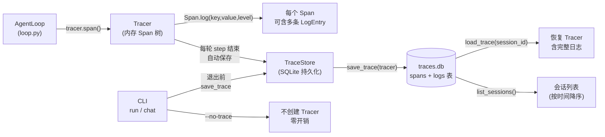

# Step M3.1 Tracer 增强与持久化

## 实现方案

**目标**：把当前内存 Tracer 扩展为可持久化、支持结构化日志的完整可观测基础设施。

### 当前状态（M1.6 占位）

- `agent/obs/tracer.py`：`Tracer` 将 Span 存于 `self.spans: list[Span]`（内存），`render()` 输出父子树。
- `Span`：`id/name/kind/parent_id/started_at/ended_at/meta`。
- loop 用 `tracer.span(...)` 包裹 `agent.run` / `model.act` / `tool.exec`。
- CLI 在结束时调用 `_print_trace(tracer)` 打印一次（`run` 和 `chat` 命令尾部）。

### 架构示意（可观测数据流）



### 改动文件

| 文件 | 变更 |
|---|---|
| `agent/obs/tracer.py` | 重写：新增 `LogEntry`、`Span.log()`、`Tracer.session_id` |
| `agent/obs/store.py` | **新建**：SQLite 持久化存储（`TraceStore`） |
| `agent/config/settings.py` | 新增 `ObsConfig`（trace 开关、SQLite 路径） |
| `agent/core/session.py` | Session 每轮 step 结束自动持久化 trace |
| `agent/cli.py` | run/chat 退出前持久化 trace；`--no-trace` 选项 |
| `agent/obs/__init__.py` | 重导出新接口 |
| `tests/test_obs.py` | 覆盖持久化读写 + log + 恢复 |

### 关键设计

#### Span.log() 方法

```python
@dataclass
class LogEntry:
    ts: float  # 时间戳
    key: str  # 日志键
    value: Any  # 日志值
    level: str = "info"  # info / warn / error


class Span:
    logs: list[LogEntry] = field(default_factory=list)

    def log(self, key: str, value: Any, level: str = "info") -> Span:
        """在 span 存活期内追加一条结构化日志。返回 self 支持链式调用。"""
        self.logs.append(LogEntry(ts=time.time(), key=key, value=value, level=level))
        return self
```

一个 span 可以记录多条 log，用于模型调用的 prompt/completion 详情、工具调用的参数/结果、错误详情等。`render()` 在 span 树中展示最近的 warn/error 日志。

#### TraceStore（SQLite 持久化）

```python
class TraceStore:
    def __init__(self, db_path: str | Path): ...
    def save_trace(self, tracer: Tracer) -> None: ...
    def load_trace(self, session_id: str) -> Tracer | None: ...
    def list_sessions(self) -> list[dict]: ...
```

- 两张表：`spans(session_id, span_id, name, kind, parent_id, started_at, ended_at, meta_json)` + `logs(session_id, span_id, ts, key, value, level)`
- `session_id` 作为分区键，支持跨 session 查询。
- `save_trace` 覆盖写（先删后插），保证幂等。
- `load_trace` 重建完整 Tracer（含 logs 列表）。

#### Session 集成

- `Session.__init__` 接受可选的 `trace_store: TraceStore | None`。
- 每轮 `step` 结束时自动 `save_trace`（`_save_trace()` 私有方法）。
- `Tracer` 构造时自动分配 `session_id`（`uuid4().hex[:12]`）。

#### 关键代码节点的 Span.log() 埋点

| 位置 | 记录的 log |
|---|---|
| `loop.run` (agent.run span) | `task`、`clarify`、`plan`、`stall`(error)、`soft_limit`(warn) |
| `loop._decide` (model.act span) | `conv_len`、`plan_mode`、`tool_calls`、`final_text_len` |
| `loop._exec_tools` (tool.exec span) | `tool`、`args`、`unknown_tool`(warn)、`approval_ask`、`approval_rejected`(warn)、`exec_error`(error) |
| `model.stream/act` (model.act span) | `provider`、`status`(ok/tool_call) |

### 依赖/环境

- 无需新外部依赖（SQLite 标准库 `sqlite3`）。

## 验收标准

- [x] `Span.log()` 可在 span 内追加多条结构化日志，`render()` 展示日志摘要。
- [x] `TraceStore.save_trace` / `load_trace` 往返保真（Span 属性 + logs 列表）。
- [x] `TraceStore.list_sessions` 返回非空列表（有记录时）。
- [x] `Session` 每轮 step 结束自动持久化。
- [x] CLI `run` / `chat` 退出后 SQLite 文件有数据。
- [x] CLI `--no-trace` 关闭 trace（内存 tracer 也不创建）。
- [x] `pytest tests/test_obs.py` 全绿（11 用例）。

## 知识沉淀

> 完成本步后填写。关键接口签名、表结构、与 Session/Tracer 的集成约定。

### 接口签名

- `Span.log(key, value, level="info") -> Span` — 非异步，直接追加到 `self.logs`（列表），支持链式调用。
- `TraceStore(db_path)` — SQLite 持久化，`save_trace(tracer)` 覆盖写，`load_trace(session_id) -> Tracer | None`。
- `Tracer(session_id=None)` — 不传则自动 `uuid4().hex[:12]`。
- `Session.__init__(..., trace_store=None)` — 可选注入，自动在 `step()` 结尾调用 `_save_trace()`。

### 表结构

```sql
spans(session_id, span_id, name, kind, parent_id, started_at, ended_at, meta_json)
logs(session_id, span_id, ts, key, value, level)
```

`save_trace` 幂等策略：`DELETE WHERE session_id` → 批量 INSERT。

### 关键决策

- `Span.log()` 是**同步**方法，不 await，直接在事件循环中写入内存列表——因为 log 是高频轻量操作，异步化只会增加开销且无必要。
- TraceStore 的 `save_trace` 在 `Session.step()` 结束时自动调用（非每轮 iteration），平衡持久化粒度与性能。
- `--no-trace` 完全跳过 Tracer 创建，零运行时开销（不创建空 tracer，也不创建 TraceStore）。
- 测试验证：`tests/test_obs.py` 11 用例覆盖 Span.log / 持久化 / 恢复 / 覆盖写幂等 / session 列表。
