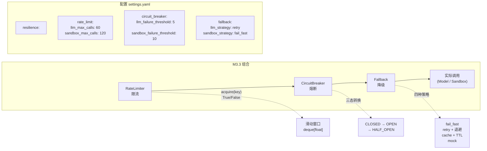
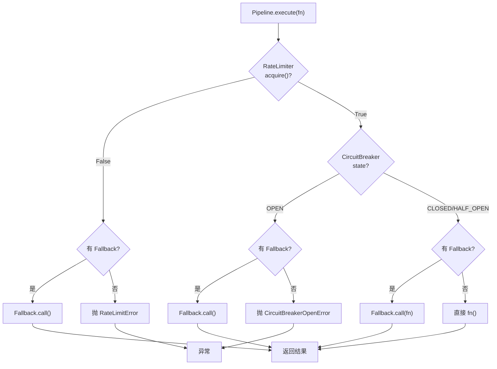
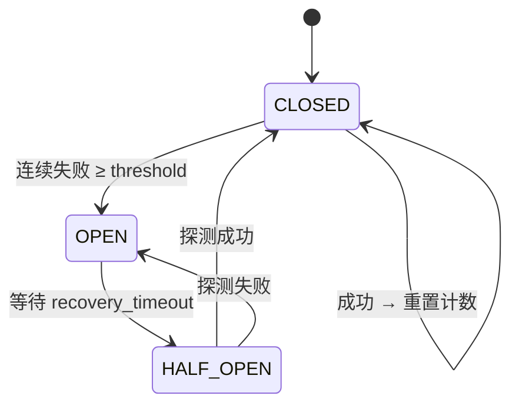

# Step M3.2 韧性层核心

## 实现方案

**目标**：实现韧性层三大核心组件——`RateLimiter`、`CircuitBreaker`、`Fallback`——为保护外部调用（LLM API / 沙箱 / 注册表）做准备。

### 架构示意（韧性层组件关系）



### Pipeline 执行顺序



### CircuitBreaker 三态状态机



### 改动文件

| 文件 | 变更 |
|---|---|
| `agent/resilience/__init__.py` | **新建**，重导出 |
| `agent/resilience/rate_limiter.py` | **新建** |
| `agent/resilience/circuit_breaker.py` | **新建** |
| `agent/resilience/fallback.py` | **新建** |
| `agent/resilience/pipeline.py` | **新建**（骨架，M3.3 完善） |
| `agent/config/settings.py` | 新增 `ResilienceConfig` |
| `tests/test_resilience.py` | **新建**（32 用例） |

### 关键设计

#### RateLimiter — 滑动窗口限流

```python
@dataclass
class RateLimitConfig:
    max_calls: int = 60  # 窗口内最大调用次数
    window_seconds: int = 60  # 滑动窗口秒数


class RateLimiter:
    def __init__(self, config: RateLimitConfig | None = None) -> None: ...

    async def acquire(self, key: str = "default") -> bool:
        """尝试获取一个令牌；返回 True 成功 / False 被限流（非阻塞）。"""

    def remaining(self, key: str = "default") -> float:
        """当前 key 在窗口内剩余配额（0~1）。"""

    def reset(self) -> None:
        """重置所有 key 的状态。"""
```

- 实现：`collections.deque[float]` 存时间戳，`_slide()` 移除窗口外过期戳。
- 非阻塞：`acquire` 立刻返回布尔值（不等待窗口滑动）。
- `key` 隔离：不同 key 互不影响（LLM / Sandbox 分别计数）。

#### CircuitBreaker — 三态熔断器

```python
class CircuitBreakerConfig:
    failure_threshold: int = 5  # 连续失败次数阈值
    recovery_timeout: float = 30.0  # OPEN→HALF_OPEN 等待秒数
    half_open_max_calls: int = 1  # HALF_OPEN 探测请求数


class CircuitBreaker:
    def __init__(self, config=None, *, name: str = "") -> None: ...

    async def call(self, fn, *args, **kwargs):
        """带熔断保护调用。OPEN 时抛 CircuitBreakerOpenError。"""

    def state(self) -> CircuitState: ...
    def failure_count(self) -> int: ...
```

- `call()` 内：持有 `asyncio.Lock` 判断状态 → 释放锁后执行 `fn` → 执行后 `record_success/failure`。
- `record_success()` / `record_failure()` 是 async 方法，外部可手动调用。

#### Fallback — 四种降级策略

```python
class FallbackConfig:
    strategy: str = "fail_fast"  # fail_fast / retry / cache / mock
    max_retries: int = 3
    retry_delay: float = 1.0
    retry_backoff: float = 2.0
    cache_ttl: float = 300.0
    mock_result: Any = None


class Fallback:
    def __init__(self, config: FallbackConfig | None = None) -> None: ...

    async def call(self, fn, *args, **kwargs) -> Any:
        """按策略执行调用。"""

    def clear_cache(self) -> None: ...
```

| 策略 | 行为 |
|---|---|
| `fail_fast` | 直接抛出原始异常，不做任何降级 |
| `retry` | 指数退避 + jitter（±25%），最多 `max_retries` 次 |
| `cache` | 缓存成功结果（TTL），未命中且失败时返回过期缓存（stale fallback） |
| `mock` | 不调用原始函数，直接返回 `mock_result` |

#### Pipeline（骨架，M3.3 完善）

```python
class Pipeline:
    def __init__(
        self,
        *,
        rate_limiter=None,
        circuit_breaker=None,
        fallback=None,
        name="",
        rate_limit_key="default",
    ): ...

    async def execute(self, fn, *args, **kwargs) -> Any:
        """按顺序执行：RateLimiter → CircuitBreaker → Fallback → 实际调用。"""
```

#### 配置

```yaml
resilience:
  enabled: true
  rate_limit:
    llm_max_calls: 60
    llm_window_seconds: 60
    sandbox_max_calls: 120
    sandbox_window_seconds: 60
  circuit_breaker:
    llm_failure_threshold: 5
    llm_recovery_timeout: 30.0
    sandbox_failure_threshold: 10
    sandbox_recovery_timeout: 60.0
  fallback:
    llm_strategy: retry
    sandbox_strategy: fail_fast
```

### 依赖/环境

- 无需新外部依赖（标准库 `asyncio`, `collections`, `time`, `functools`）。

## 验收标准

- [x] `RateLimiter.acquire` 在窗口内准确限流（超配额返回 False，配额内返回 True）。
- [x] `RateLimiter` 跨 key 隔离（不同 key 互不影响）。
- [x] `CircuitBreaker` 三态转换正确：CLOSED→失败达阈值→OPEN→等待超时→HALF_OPEN→成功→CLOSED。
- [x] `CircuitBreaker.call` 在 OPEN 时抛 `CircuitBreakerOpenError`。
- [x] `Fallback.retry` 在失败后重试指定次数。
- [x] `Fallback.cache` 在 TTL 内返回缓存值，过期后 stale fallback。
- [x] `Fallback.mock` 返回预设 `mock_result`。
- [x] `pytest tests/test_resilience.py` 全绿（32 用例）。

## 知识沉淀

> 完成本步后填写。接口签名、关键设计、决策理由。

### 接口签名

- `RateLimiter(config) -> acquire(key) -> bool` — 非阻塞滑动窗口，key 隔离。
- `CircuitBreaker(config, *, name) -> call(fn) -> Any` — 三态状态机，`asyncio.Lock` 保护。
- `Fallback(config) -> call(fn) -> Any` — 四种策略，`clear_cache()` 清空缓存。
- `Pipeline(*, rate_limiter, circuit_breaker, fallback) -> execute(fn) -> Any` — 可组合包装器。
- `Settings.resilience` — 嵌套 `RateLimitConfigModel` / `CircuitBreakerConfigModel` / `FallbackConfigModel`。

### 关键决策

- **非阻塞限流**：`RateLimiter.acquire` 立刻返回布尔值，不等待窗口滑动。调用方（Pipeline）负责降级或报错。
- **CircuitBreaker 锁释放后执行 fn**：避免持有 `asyncio.Lock` 期间做 IO（LLM API 调用可能耗时很长）。
- **Fallback 策略模式**：`call()` 内 `strategy -> dispatch` 字典分发，新增策略只需加一个分支。
- **Cache stale fallback**：缓存过期后不立即删除，留作调用失败的兜底返回（`_cached_call` 的 `stale_available` 变量）。
- **配置嵌套**：`ResilienceConfig` 在 `Settings` 中作为嵌套子模型，YAML 可直接写 `resilience.rate_limit.llm_max_calls`。
- **测试 32 用例**：覆盖 RateLimiter(6) + CircuitBreaker(9) + Fallback(9) + Pipeline(8)，`asyncio_mode="auto"` 下无需手动管理事件循环。
