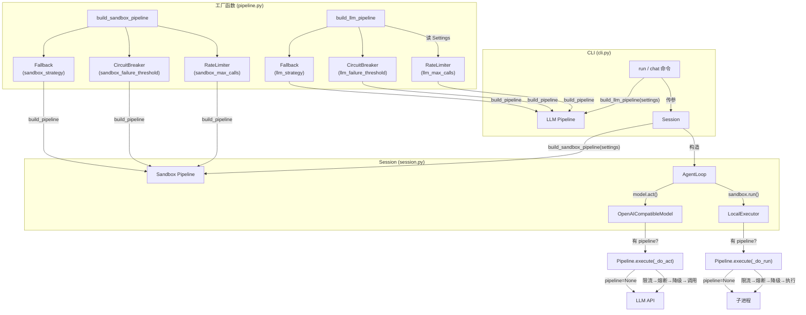
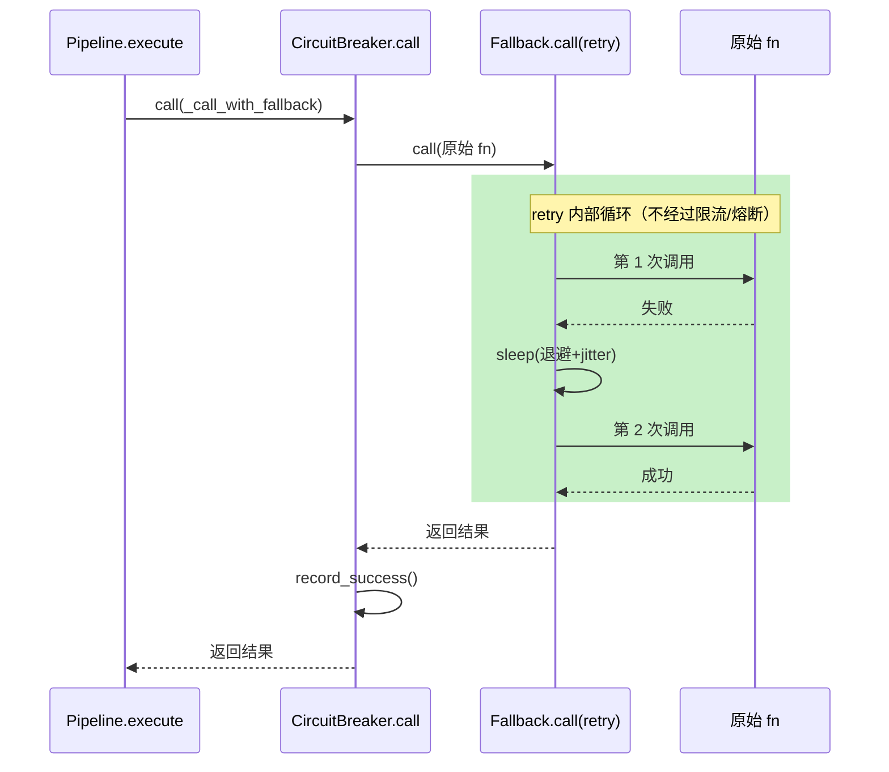

# Step M3.3 韧性层 Pipeline 与集成

## 实现方案

**目标**：把 M3.2 的三大组件组合成可编排的 `Pipeline`，并集成到现有 Model 调用和 Sandbox 执行链中。

### 架构示意（Pipeline 集成全景）



### Pipeline 重试流程（retry 在 Fallback 内部）



重试设计要点：
- **限流只检查入口**，重试不重新经过 `RateLimiter`——重试是降级内部逻辑，不应被限流再次拒绝。
- **熔断看到的是 retry 的最终结果**：retry 成功→CB 记录 success；retry 全部耗尽→CB 记录 failure。这样瞬时抖动被 retry 消化，不误触熔断。
- **流式调用经 `execute_stream` 保护「创建流」动作**：`execute_stream` 内部预读第一项来检测创建失败（异步生成器是惰性的——body 在 `async for` 时才执行），创建成功后再通过 `_prepend` 把第一项放回流中。一旦流开始 yield，中途失败不重试——符合 LLM 流式业界共识：流建立前可重试，数据开始到达后不重试（已生成的内容不可幂等回退）。

### 改动文件

| 文件 | 变更 |
|---|---|
| `agent/resilience/pipeline.py` | 重写：完善 Pipeline + 新增 `build_pipeline` / `build_llm_pipeline` / `build_sandbox_pipeline` 工厂 |
| `agent/resilience/__init__.py` | 重导出工厂函数 |
| `agent/core/model.py` | `OpenAICompatibleModel` 接受 `pipeline` 参数；`act()` 走 Pipeline；`stream()` 暂不包裹 |
| `agent/runtime/sandbox.py` | `LocalExecutor` 接受 `pipeline`；`run()` 走 Pipeline；`build_executor` 透传 |
| `agent/core/session.py` | `Session.__init__` 构造 sandbox pipeline 并传入 executor |
| `agent/cli.py` | `_build_model` 透传 pipeline；run/chat 构建 LLM pipeline |
| `tests/test_resilience.py` | 新增 11 个集成测试 |

### 关键设计

#### Pipeline 最终版

```python
class Pipeline:
    def __init__(
        self,
        *,
        rate_limiter=None,
        circuit_breaker=None,
        fallback=None,
        name="",
        rate_limit_key="default",
    ): ...

    async def execute(self, fn, *args, **kwargs) -> Any:
        """按顺序执行：RateLimiter → CircuitBreaker → Fallback → 实际调用。"""

    async def execute_stream(self, factory, *args, **kwargs) -> AsyncIterator[Any]:
        """带 Pipeline 保护的流式执行。

        保护「创建流」动作（限流+熔断+retry），
        流开始 yield 后不再重试。
        """
```

执行顺序（完整版）：
1. `rate_limiter.acquire(key)` → False → 有 Fallback 就走 Fallback，否则抛 `RateLimitError`。
2. `circuit_breaker.call(fn)` → OPEN → 有 Fallback 就走 Fallback，否则抛 `CircuitBreakerOpenError`。
3. 正常调用 → `record_success()`。
4. 异常 → `record_failure()`。

#### 工厂函数

```python
def build_pipeline(
    *, name, rate_limiter, circuit_breaker, fallback, rate_limit_key="default"
) -> Pipeline | None:
    """所有组件均为 None 时返回 None（零开销）。"""


def build_llm_pipeline(settings) -> Pipeline | None:
    """从 Settings.resilience 构建 LLM Pipeline。rate_limit_key="llm:{model}" """


def build_sandbox_pipeline(settings) -> Pipeline | None:
    """从 Settings.resilience 构建 Sandbox Pipeline。rate_limit_key="sandbox:local" """
```

#### 集成点

| 集成点 | 位置 | 行为 |
|---|---|---|
| `create_model(settings, tracer, pipeline)` | `model.py` | 透传 pipeline 到 `OpenAICompatibleModel` |
| `OpenAICompatibleModel.act()` | `model.py` | 有 pipeline 则 `pipeline.execute(_do_act)` |
| `OpenAICompatibleModel.stream()` | `model.py` | 有 pipeline 则 `pipeline.execute_stream(_do_stream_iter)` |
| `build_executor(mode, workspace, profile, pipeline)` | `sandbox.py` | 透传 pipeline 到 `LocalExecutor` |
| `LocalExecutor.run()` | `sandbox.py` | 有 pipeline 则 `pipeline.execute(_do_run)` |
| `Session.__init__` | `session.py` | 调用 `build_sandbox_pipeline(settings)` |
| `cli.py run/chat` | `cli.py` | 调用 `build_llm_pipeline(settings)` |

### 配置示例

```yaml
resilience:
  enabled: true
  rate_limit:
    llm_max_calls: 60
    llm_window_seconds: 60
    sandbox_max_calls: 120
    sandbox_window_seconds: 60
  circuit_breaker:
    llm_failure_threshold: 5
    llm_recovery_timeout: 30.0
    sandbox_failure_threshold: 10
    sandbox_recovery_timeout: 60.0
  fallback:
    llm_strategy: retry          # LLM 调用失败自动重试
    sandbox_strategy: fail_fast  # 沙箱失败直接抛（不重试，安全优先）
```

`resilience.enabled=false` 时，所有工厂返回 None，Model/Sandbox 行为不变（零运行时开销）。

### 依赖/环境

- 依赖 M3.2（RateLimiter / CircuitBreaker / Fallback）。

## 验收标准

- [x] `Pipeline.execute` 按 RateLimiter → CircuitBreaker → Fallback → fn 顺序执行。
- [x] 限流时正确触发 Fallback 策略（mock/retry）。
- [x] 熔断 OPEN 状态被 Fallback 捕获（返回 mock 值而非抛异常）。
- [x] `create_model` 在 `resilience.enabled=True` 时注入 Pipeline。
- [x] `build_executor` 在 `resilience.enabled=True` 时注入 Pipeline。
- [x] `resilience.enabled=False` 时 Model/Sandbox 行为不变（零侵入）。
- [x] 全链路集成测试：FakeModel + Pipeline(mock fallback) 模拟限流/熔断后仍返回有效结果。
- [x] `pytest tests/test_resilience.py` 全绿（48 用例，含 execute_stream 5 个）。
- [x] `pytest -q` 全量 195 passed。

## 知识沉淀

### 接口签名

- `Pipeline(rate_limiter, circuit_breaker, fallback, name, rate_limit_key).execute(fn, *args, **kwargs) -> Any`
- `build_pipeline(name, rate_limiter, circuit_breaker, fallback, rate_limit_key) -> Pipeline | None`
- `build_llm_pipeline(settings) -> Pipeline | None` — 从 `Settings.resilience` 构建 LLM 管道
- `build_sandbox_pipeline(settings) -> Pipeline | None` — 从 `Settings.resilience` 构建 Sandbox 管道

### 集成约定

- **Pipeline 在 Model 构造时注入**：`OpenAICompatibleModel.__init__(pipeline)`，`act()` 内 `pipeline.execute(_do_act)`。
- **Pipeline 在 Executor 构造时注入**：`LocalExecutor.__init__(pipeline)`，`run()` 内 `pipeline.execute(_do_run)`。
- **Session 负责构建 sandbox pipeline**：`Session.__init__` 调用 `build_sandbox_pipeline(settings)`。
- **CLI 负责构建 LLM pipeline**：`cli.py` 中 run/chat 命令调用 `build_llm_pipeline(settings)`。
- **`resilience.enabled` 总开关**：`False` 时工厂返回 None，所有集成点检查 `if self._pipeline is not None` 跳过。

### 关键决策

- **限流只检查入口，重试不重新经过限流器**。重试是 Fallback 的内部实现细节，重试期间被限流会破坏降级语义。
- **流式调用经 `execute_stream` 保护**。异步生成器是惰性的——body 在 `async for` 时才执行。`execute_stream` 内部通过 `_try_create` 预读第一项来检测创建失败，然后通过 `_prepend` 辅助生成器把第一项放回流中。创建成功后开始 yield，中途失败不重试。
- **重试消化瞬时抖动，保护熔断器**：Fallback.retry 在内部重试，CircuitBreaker 看到的是 retry 的最终结果（成功→record_success，全部耗尽→record_failure）。不会因一次网络抖动就触发熔断。
- **build_executor 只对 LocalExecutor 注入 pipeline**：DockerExecutor/ExternalExecutor 暂不接入，因为这些执行器通常用于生产环境，外层已有独立防护。
- **测试 48 用例**：原 32 + 集成测试 11 + execute_stream 5（流创建重试、限流、熔断、正常流消费）。
- **全量测试 195 passed**。

### 踩坑记录

- **`sandbox.py` 缺少 `Any` 导入**：给 `LocalExecutor.__init__` 加 `pipeline: Any | None = None` 参数时，文件顶部 `from typing import ...` 未包含 `Any`，导致 IDE 报 `reportUndefinedVariable`。修复：在已有 `from typing import Callable, Protocol, runtime_checkable` 中追加 `Any`。
- **CLI 测试 `_patch_model` 兼容性**：`_build_model` 新增 `pipeline` 参数后，`tests/test_cli.py` 中的 `_patch_model` 用的 lambda 只接受 `settings` 和 `tracer`，导致 CLI 测试报 `unexpected keyword argument 'pipeline'`。修复：lambda 改为 `lambda settings, tracer=None, pipeline=None: model`。
- **`FakeModel([])` 空脚本不抛异常**：集成测试 `test_model_act_pipeline_all_fail` 原以为 `FakeModel([])` 会因脚本耗尽抛 `IndexError`，但实际上它返回 `Decision(text="<script exhausted>")`。修复：改用自定义 `AlwaysFailModel` 确保每次调用都抛 `ValueError`，验证 retry 次数。
- **Python 3.12 异步生成器不能用 `return` 带值**：`execute_stream` 中限流分支原来用 `return await self._fallback.call(...)` 提前退出，但 `execute_stream` 包含 `yield`，Python 3.12 禁止异步生成器使用带值的 `return`（`SyntaxError: 'return' with value in async generator`）。修复：改为 `yield` 迭代结果或直接 `return`（无值）。
- **异步生成器是惰性的**：`_create_stream_protected` 中的 `factory()` 是异步生成器函数，调用后立即返回 `AsyncIterator` 而不执行 body。创建失败（如网络错误）在 `async for` 时才抛异常。修复：`_try_create` 预读第一项（`__anext__()`）来检测创建失败，然后通过 `_prepend` 辅助生成器把第一项放回流中——调用方无感知。
