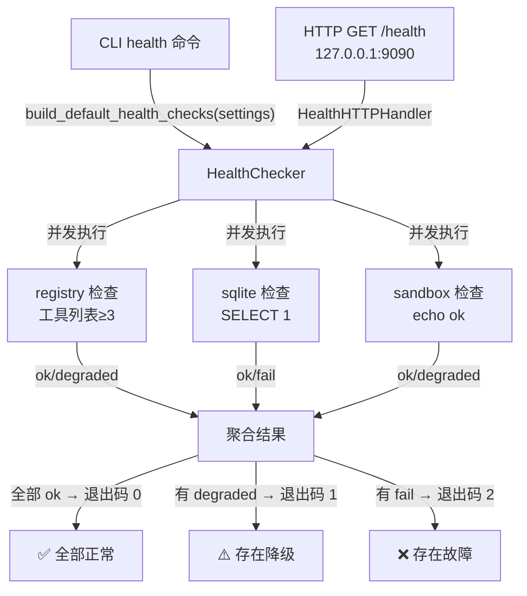

# Step M3.4 健康检查与 CLI

## 实现方案

**目标**：提供 Agent 自身健康状态的可观测入口——CLI `health` 命令 + 嵌入式 HTTP 端点。

### 架构示意（健康检查数据流）



### 改动文件

| 文件 | 变更 |
|---|---|
| `agent/resilience/health.py` | **新建**：HealthChecker + HealthHTTPHandler + build_default_health_checks |
| `agent/resilience/__init__.py` | 重导出 HealthChecker/HealthStatus/HealthHTTPHandler |
| `agent/cli.py` | 新增 `health` 命令（`--watch` 轮询 / `--port` HTTP 端点） |
| `tests/test_health.py` | **新建**（14 用例） |

### 关键设计

#### HealthChecker

```python
@dataclass
class CheckResult:
    name: str
    status: str = "ok"  # ok / degraded / fail
    detail: str = ""
    duration_ms: float = 0.0

@dataclass
class HealthStatus:
    healthy: bool
    checks: dict[str, CheckResult]
    timestamp: float = 0.0

class HealthChecker:
    def __init__(self): ...
    def register(self, name, check_fn): ...
    def registered(self) -> list[str]: ...
    async def check_all(self) -> HealthStatus: ...
```

- `check_all` 用 `asyncio.gather` 并发执行所有已注册检查。
- 检查函数抛异常时自动捕获，标记为 `fail` 并记录错误信息。
- `duration_ms` 由 `_run_check` 自动填充。

#### 默认检查项

| 检查项 | 检测方法 | 严重级别 |
|---|---|---|
| `registry` | `default_registry.list()` ≥ 3 个工具 | 非致命（degraded） |
| `sqlite` | `TraceStore.list_sessions()` 执行 SELECT | 关键（fail） |
| `sandbox` | `get_executor().run(echo ok)` | 非致命（degraded） |

#### CLI health 命令

```bash
python -m agent.cli health           # 一次性检查，rich 面板输出
python -m agent.cli health --watch   # 每 5 秒轮询，Live 实时刷新
python -m agent.cli health --port 9090  # 启动 HTTP /health 端点
```

- 退出码：0（全 ok）/ 1（有 degraded）/ 2（有 fail）。
- `--watch` 复用 `rich.live.Live`，每秒刷新 0.2 次。
- `--port` 使用标准库 `http.server`，绑定 `127.0.0.1`，适合 K8s probe / supervisor。

#### HTTP 健康端点

```python
class HealthHTTPHandler(BaseHTTPRequestHandler):
    """GET /health → JSON {healthy, checks, timestamp}"""
```

- 模块级变量 `_HTTP_CHECKER` 注入 checker 实例。
- 全部 ok → 200，有异常 → 503。
- 仅本机绑定（`127.0.0.1`），零外部依赖。

### 依赖/环境

- 无新外部依赖（标准库 `http.server`, `json`, `asyncio`）。

## 验收标准

- [x] `python -m agent.cli health` 输出各组件状态面板。
- [x] `--watch` 模式持续轮询，Live 刷新。
- [x] `health --port 9090` 启动 HTTP 端点，返回 JSON。
- [x] 退出码 0（全 ok）/ 1（有 degraded）/ 2（有 fail）。
- [x] `pytest tests/test_health.py` 全绿（14 用例）。
- [x] `pytest -q` 全量 209 passed。

## 知识沉淀

### 接口签名

- `HealthChecker().register(name, async_fn) / check_all() -> HealthStatus`
- `HealthStatus(healthy, checks, timestamp)` — `checks` 是 `dict[str, CheckResult]`
- `CheckResult(name, status, detail, duration_ms)` — `status ∈ {ok, degraded, fail}`
- `build_default_health_checks(settings) -> HealthChecker` — 注册 registry/sqlite/sandbox 三项
- `HealthHTTPHandler` — `BaseHTTPRequestHandler` 子类，从模块级 `_HTTP_CHECKER` 取 checker

### 关键决策

- **检查结果分级**：`ok` / `degraded`（不影响核心功能）/ `fail`（关键链路中断）。LLM 和 sandbox 标记为 `degraded`（非致命），sqlite 标记为 `fail`（数据持久化关键）。
- **并发执行**：`check_all` 用 `asyncio.gather`，检查函数抛异常时自动捕获为 `fail`。
- **HTTP 零依赖**：用标准库 `http.server` + `run_in_executor`（在 `--watch` 模式的事件循环中），避免引入 FastAPI。
- **模块级 checker 注入**：`_HTTP_CHECKER` 全局变量，由 CLI 在启动 HTTP 服务前设置，避免内联类在 CliRunner 下引用失败。

### 踩坑记录

- **`build_default_health_checks` 的 monkeypatch 路径**：CLI 的 `health` 函数通过 `import agent.resilience.health as _health_mod` 模块引用调用 `_health_mod.build_default_health_checks`，因此 monkeypatch 必须用 `"agent.resilience.health.build_default_health_checks"` 路径（而非 `"agent.cli.build_default_health_checks"`）。
- **内联类 HTTP handler 在 CliRunner 下引用失败**：原实现中 `_HealthHandler` 是 `health` 函数内的内联类，引用函数局部变量 `checker`。CliRunner 执行时导致 `NameError: name 'checker' is not defined`。修复：将 HTTP handler 提取为模块级类 `HealthHTTPHandler`，通过模块级全局变量 `_HTTP_CHECKER` 注入 checker 实例。
