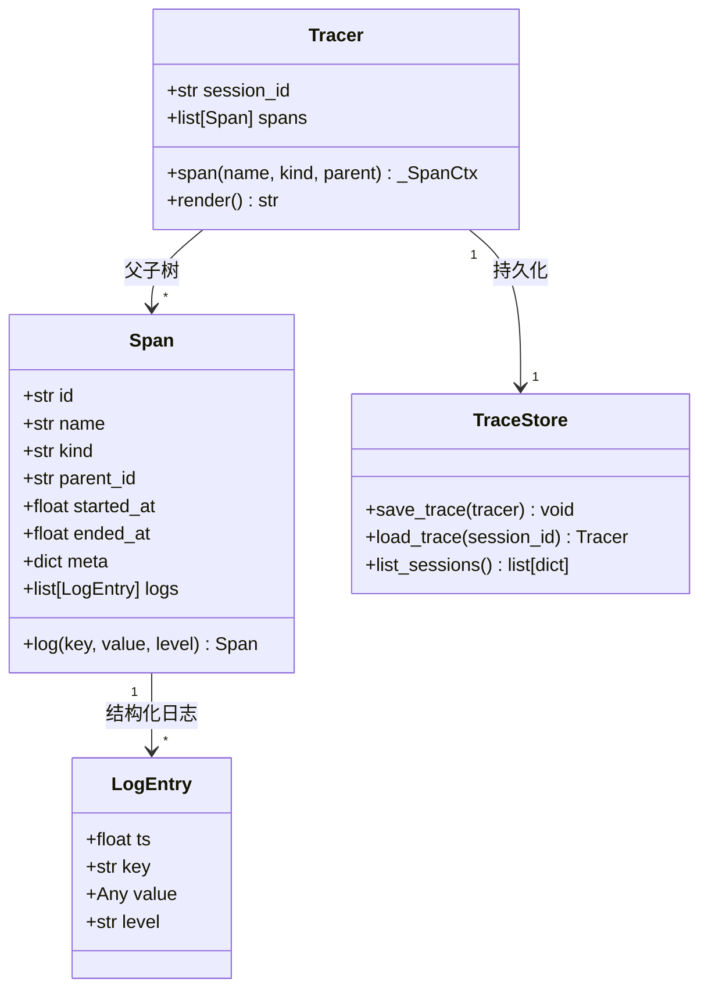
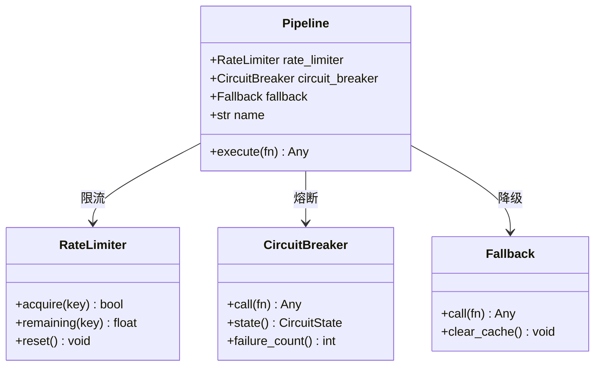
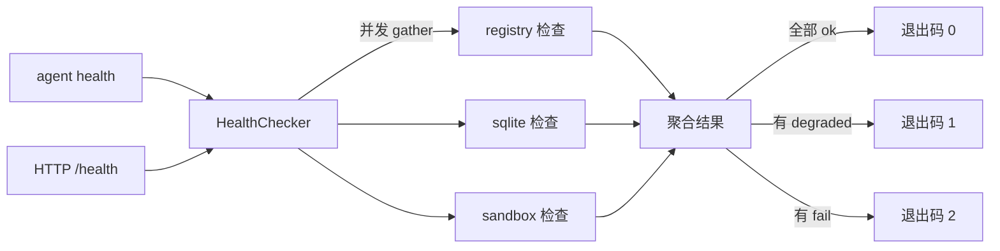

# M3 可观测与韧性层

> 本里程碑把现有 M1.6 占位的**最简 Tracer** 扩展为完整可观测体系（Span + Log + 持久化），
> 并引入韧性层（限流 / 熔断 / 降级），使 Agent 在生产中**看得见、可恢复、不掉线**。
> 原「上下文与记忆」推后为 M4，「扩展能力」→ M5，「生产化」→ M6。

## 目标

1. **可观测性（Obs）**：内存 Span 树 → 持久化 SQLite（按 session 归档）→ 支持 `Tracer.log()` 在 span 内记录结构化日志（key-value 列表），每条 log 含时间戳。Session 重启/恢复时能回放 trace。
2. **韧性层（Resilience）**：`RateLimiter`（LLM 请求频率限制）、`CircuitBreaker`（LLM/沙箱/网络调用熔断）、`Fallback`（降级策略：`fail_fast`/`cache`/`mock` 等），可组合成 `Pipeline` 包裹外部调用。
3. **健康检查**：CLI 新增 `health` 命令 + `GET /health` HTTP 端点（嵌入 Agent 进程），报告各组件（LLM / 沙箱 / SQLite / 注册表）状态。

## 前置依赖

- M1 全部完成（事件流、Session、CLI、Tracer 占位、配置系统已就位）。
- M2 全部完成（沙箱、审批、TerminalTransport 已就位，韧性层需保护沙箱调用）。
- 知识库：`knowledge/INDEX.md` 架构决策中的「两条全局主线」、「可恢复」、「韧性层」部分。

## 步骤索引

| 步骤 | 文件 | 目标 | 状态 |
|---|---|---|---|
| M3.1 | [3.1-Tracer增强与持久化.md](./3.1-Tracer增强与持久化.md) | Tracer 持久化（SQLite）+ `log()` 方法 + 跨 session 恢复 | ✅ 完成 |
| M3.2 | [3.2-韧性层核心.md](./3.2-韧性层核心.md) | RateLimiter + CircuitBreaker + Fallback 基础实现 | ✅ 完成 |
| M3.3 | [3.3-韧性层Pipeline与集成.md](./3.3-韧性层Pipeline与集成.md) | Pipeline 可组合包装器 + 集成到 Model/Sandbox 调用链 | ✅ 完成 |
| M3.4 | [3.4-健康检查与CLI.md](./3.4-健康检查与CLI.md) | `agent health` 命令 + HTTP 健康端点 | ⚪ 待启动 |
| M3.5 | [3.5-测试与验收.md](./3.5-测试与验收.md) | 全量测试通过 + 韧性层集成测试 + trace 持久化验证 | ⚪ 待启动 |

## 里程碑级知识沉淀

> 本里程碑完成后，汇总跨步骤结论：

### 可观测体系接口约定

### 韧性层组件关系

### 韧性层 Pipeline 组合模式

执行顺序：`RateLimiter.acquire()` → `CircuitBreaker.call()` → `Fallback.call()` → 实际 `fn()`
每一层失败后若配置了 Fallback，则走降级策略而非直接抛异常。

### 健康检查端点设计

- CLI：`python -m agent.cli health [--watch] [--port 9090]`
- HTTP：`GET /health` → JSON `{healthy, checks, timestamp}`，200/503
