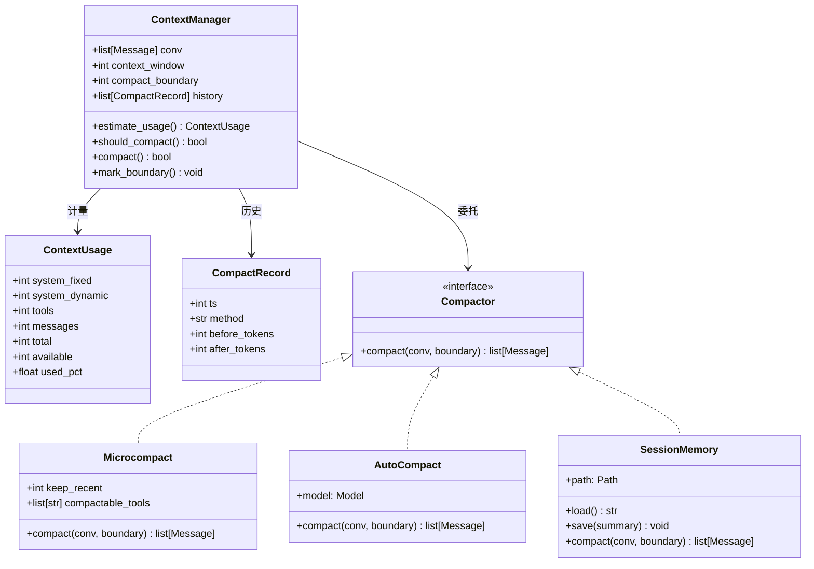
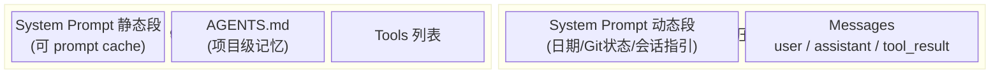

# M4 上下文与记忆

> 本里程碑实现 Claude Code 四层渐进压缩防线（详见 `knowledge/claude-code-context-management.md` 与 `knowledge/context-management.md`），
> 使 Agent 在长对话中**不被上下文窗口限制**——固定底座永不压缩、对话历史逐级压缩、压缩后防漂移。
>
> **重要命名替换**：本项目将 Claude Code 的 `CLAUDE.md` 改名为 `AGENTS.md`（项目级记忆文件，见 M4.5）。

## 目标

1. **`ContextManager` 基础**（M4.1）：持有 `conv` 投影、估算 token 分类明细、记录压缩历史与 Compact Boundary 位置。
2. **Microcompact 零成本压缩**（M4.2）：旧 `tool_result` 内容替换为占位符，保留最近 N 个，不拆散配对。
3. **Auto Compact**（M4.3）：阈值触发 → 9 段结构化摘要 → Compact Boundary → 防漂移重读最近文件。
4. **Session Memory Compact**（M4.4）：后台增量维护会话摘要文件，压缩时零成本优先复用。
5. **集成与固定底座**（M4.5）：系统提示重构（日期外移进动态段）、prompt caching 支持、AGENTS.md 项目级记忆文件、Tools 列表固定底座。
6. **CLI 命令**（M4.6）：`/context` 查看占用明细、`/compact` 手动触发压缩、状态栏实时占比。
7. **测试与验收**（M4.7）：全量测试 + 集成测试 + 压缩流程端到端验证。

## 前置依赖

- M1 全部完成（事件流、Session、CLI、Tracer、配置系统、`_estimate_tokens` 估算函数）。
- M2 全部完成（沙箱、审批、TerminalTransport）。
- M3 全部完成（韧性层、可观测、健康检查）。
- 知识库：`knowledge/claude-code-context-management.md`、`knowledge/context-management.md`、`knowledge/INDEX.md`。

## 步骤索引

| 步骤 | 文件 | 目标 | 状态 |
|---|---|---|---|
| M4.1 | [4.1-ContextManager基础.md](./4.1-ContextManager基础.md) | ContextManager 类 + 配置 + 计量 | ⚪ 待启动 |
| M4.2 | [4.2-Microcompact.md](./4.2-Microcompact.md) | 旧 tool_result 占位替换（零成本） | ⚪ 待启动 |
| M4.3 | [4.3-AutoCompact.md](./4.3-AutoCompact.md) | 9 段摘要 + Compact Boundary + 防漂移 | ⚪ 待启动 |
| M4.4 | [4.4-SessionMemoryCompact.md](./4.4-SessionMemoryCompact.md) | 后台增量摘要文件（零成本首选） | ⚪ 待启动 |
| M4.5 | [4.5-集成与固定底座.md](./4.5-集成与固定底座.md) | 系统提示重构 + prompt caching + AGENTS.md | ⚪ 待启动 |
| M4.6 | [4.6-CLI命令.md](./4.6-CLI命令.md) | /context /compact 命令 + 状态栏 | ⚪ 待启动 |
| M4.7 | [4.7-测试与验收.md](./4.7-测试与验收.md) | 全量测试通过 + 压缩流程端到端验证 | ⚪ 待启动 |

## 里程碑级知识沉淀

> 本里程碑完成后，汇总跨步骤结论。以下为规划的结构，各步骤完成后填充。

### 上下文管理体系接口约定

### 压缩防线决策流

```mermaid
flowchart TD
    START["ContextManager.should_compact()?"] -->|"否"| CONT["继续累积"]
    START -->|"是"| MC["① Microcompact<br/>旧 tool_result → 占位符"]
    MC --> MEM{"有 Session<br/>Memory 文件?"}
    MEM -->|"有"| SM["③a Session Memory Compact<br/>复用摘要 · 零成本"]
    MEM -->|"无"| AI["③b Auto Compact<br/>9 段结构化摘要 · 1 次调用"]
    SM --> DONE["插入 Compact Boundary"]
    AI --> DONE
    DONE --> ANTI["防漂移：重读最近文件<br/>AGENTS.md / Plan / Skills 重注入"]
    ANTI --> CONT
```

### 固定底座结构（永不压缩）

### 配对铁律

裁剪 / 压缩 / 摘要时，`tool_use` 与 `tool_result` 永远是原子单元：
- 删调用必删结果，删结果必删调用，或二者一起折叠为摘要；
- 占位替换只改 `tool_result.content`，保留 `tool_call_id` 配对；
- 违反即 API 400（M1.5 前车之鉴）。

### 命名约定

| Claude Code 概念 | 本项目名称 | 位置 |
|---|---|---|
| `CLAUDE.md` | `AGENTS.md` | 项目根（用户级） + `<project>/.agent/AGENTS.md`（项目级） |
| Session Memory | 会话摘要文件 | `<project>/.agent/sessions/<session_id>/memory.json` |
| Compact Boundary | Compact Boundary | `ContextManager.compact_boundary`（int 索引） |
| Microcompact | Microcompact | `agent/context/compactors/microcompact.py` |
| Auto Compact | Auto Compact | `agent/context/compactors/auto_compact.py` |
