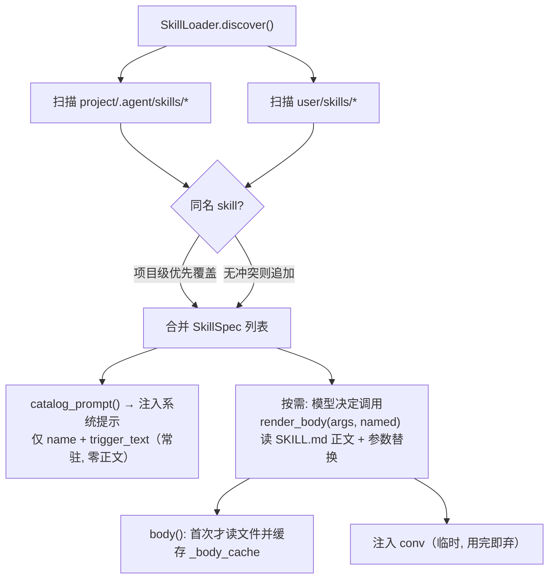

# Step M5.1 SkillLoader 基础

## 实现方案

**目标**：实现 `SkillLoader`——从项目/用户级 `.agent/skills/` 发现并解析 Skill，把每个 Skill 的「触发描述」注入主循环系统提示（常驻、低成本），正文**按需加载**并在模型决定调用时做参数替换后注入 conv；支持多文件包（scripts/references/assets）与 `allowed-tools`/`disallowed-tools`/`paths`/`disable-model-invocation`/`user-invocable` 字段。

**改动文件**（新建 `agent/skills/` 包）：
- `agent/skills/__init__.py`：导出 `SkillSpec` / `SkillLoader`。
- `agent/skills/spec.py`：`SkillSpec` dataclass + frontmatter 解析。
- `agent/skills/loader.py`：`SkillLoader`（发现 / 加载 / 触发目录 / 正文渲染）。
- `agent/skills/prompt.md`（可选）：Skill 调用工具的系统提示片段模板（或在 5.3 统一处理）。

**关键接口**：

```python
# agent/skills/spec.py
from dataclasses import dataclass, field
from pathlib import Path

@dataclass
class SkillSpec:
    name: str                       # 目录名（kebab-case）
    description: str                # 触发描述（常驻）
    path: Path                      # SKILL.md 所在目录
    when_to_use: str = ""           # 额外触发上下文
    arguments: list[str] = field(default_factory=list)   # 命名位置参数
    argument_hint: str = ""
    disable_model_invocation: bool = False   # True→仅 /name 手动
    user_invocable: bool = True
    allowed_tools: list[str] = field(default_factory=list)
    disallowed_tools: list[str] = field(default_factory=list)
    model: str | None = None        # 活动时覆盖模型（"inherit" 或模型 id）
    effort: str | None = None
    context: str | None = None      # "fork" → 在 subagent 中执行
    agent: str | None = None        # context:fork 时用的 subagent 类型
    hooks: list[dict] = field(default_factory=list)
    paths: list[str] = field(default_factory=list)   # Glob，限定自动触发文件
    shell: str = "bash"

    @property
    def trigger_text(self) -> str:
        """常驻触发描述：description + when_to_use（截断 1536 字符）。"""
        t = self.description
        if self.when_to_use:
            t = f"{t}\n何时使用：{self.when_to_use}"
        return t[:1536]

    def body(self) -> str:
        """按需读取 SKILL.md 正文（不含 frontmatter）。缓存到实例。"""
        ...

    def render_body(self, args: list[str] | None = None,
                    named: dict[str, str] | None = None) -> str:
        """参数替换：$ARGUMENTS / $N / $name / ${SKILL_DIR} 等。"""
        ...
```

```python
# agent/skills/loader.py
class SkillLoader:
    def __init__(self, project_root: Path, user_root: Path | None = None):
        ...

    def discover(self) -> list[SkillSpec]:
        """扫描 <project>/.agent/skills/* 与 ~/.agent/skills/*（项目级覆盖同名用户级）。"""

    def get(self, name: str) -> SkillSpec | None: ...

    def catalog_prompt(self) -> str:
        """返回注入系统提示的触发目录文本（仅 name + trigger_text，低成本）。"""

    def is_auto_enabled(self, spec: SkillSpec, current_file: str | None = None) -> bool:
        """disable_model_invocation / user_invocable / paths glob 三重判定。"""
```

**双轨加载机制（架构图）**：



**frontmatter 解析**：复用 `agent/core/prompts.py` 的 `_split_frontmatter`（包内共享），或直接 `yaml.safe_load` frontmatter 段；正文保留 Markdown。

**路径约定（对齐 `.agent` 隔离）**：
- 项目级：`<project>/.agent/skills/<name>/SKILL.md`
- 用户级：`~/.agent/skills/<name>/SKILL.md`
- 优先级：**项目级 > 用户级**（同名项目级覆盖，不冲突来源）。
- 实时检测：M5.1 先做「启动时一次性发现」；M5.4 可加会话内重扫。

**参数替换规则**：
- `$ARGUMENTS` → 全部参数串；不存在则追加 `ARGUMENTS: <value>`。
- `$ARGUMENTS[N]` / `$N` → 0 基索引参数。
- `$name` → `arguments` 声明的命名参数。
- `${SKILL_DIR}` → `spec.path` 绝对路径（脚本引用用）。
- 转义：`\$` 保留文字 `$`。

**多文件包**：`scripts/`（可执行，用 `${SKILL_DIR}/scripts/x.sh`）、`references/`（按需 `read`）、`assets/`（模板/查找表）。正文用相对链接引用（如 `[ref.md](references/ref.md)`），模型按需读取。

**依赖/环境**：
- `agent/core/prompts.py` 的 `_split_frontmatter` / `yaml`。
- `Settings`（`.agent` 路径可由 `settings` 或 `AGENT_PROJECT_ROOT`/`AGENT_USER_CONFIG_DIR` 推导）。
- 不依赖真实 API；测试用本地临时目录 + `FakeModel`（5.3 接入后驱动）。

## 验收标准

- [ ] `SkillLoader.discover()` 能发现项目级与用户级 skills，项目级同名覆盖用户级。
- [ ] `SkillSpec` 正确解析 frontmatter 所有字段（含 `disable_model_invocation`/`paths`/`allowed-tools`）。
- [ ] `catalog_prompt()` 只含 `name` + `trigger_text`，不含 SKILL.md 正文（省 token）。
- [ ] `body()` 按需读取正文（首次调用才读文件，可缓存）。
- [ ] `render_body(["a","b"], {"x":"1"})` 正确替换 `$ARGUMENTS`/`$0`/`$x`/`${SKILL_DIR}`；`\$` 转义为 `$`。
- [ ] `is_auto_enabled`：对 `disable_model_invocation=True` 返回 False；`paths` 设 Glob 时仅匹配文件返回 True；否则 True。
- [ ] 不变量：所有 skill 正文**不会**在 discover 阶段进入上下文（仅 catalog）。
- [ ] 测试：`tests/test_skills.py` 新建，≥10 用例覆盖发现/解析/触发目录/参数替换/自动启用判定。

## 知识沉淀

**运行时调用时序（mermaid）**：

```mermaid
sequenceDiagram
    participant Loop as 主循环
    participant Loader as SkillLoader
    participant Spec as SkillSpec
    participant FS as SKILL.md 文件
    Loop->>Loader: discover()
    Loader->>FS: 仅读 frontmatter（解析元数据）
    Loader-->>Loop: catalog_prompt() 触发目录
    Note over Loop: 注入系统提示（低成本, 零正文进上下文）
    Loop->>Loader: 模型选中某 skill
    Loader->>Spec: render_body(args, named)
    Spec->>FS: 首次才读正文 body()
    FS-->>Spec: 缓存到 _body_cache
    Spec-->>Loop: 参数替换后正文 → 注入 conv
```

**已落地实现**（`agent/skills/`）：

- `spec.py`：`SkillSpec` dataclass，字段与里程碑接口一致（`name`=`目录名`、`description`、`path`、`when_to_use`、`arguments`、`argument_hint`、`disable_model_invocation`、`user_invocable`、`allowed_tools`/`disallowed_tools`、`model`、`effort`、`context`、`agent`、`hooks`、`paths`、`shell`）。
  - `trigger_text` 属性：`description` + `when_to_use`，截断 1536 字符。
  - `body()`：首次调用才读 `path/SKILL.md` 正文（经 `_split_frontmatter` 去 frontmatter），缓存到 `_body_cache`；末尾 `rstrip("\n")`。
  - `render_body(args, named)`：参数替换（见下「替换规则」）。
- `loader.py`：`SkillLoader(project_root, user_root=None)`；`discover()` 扫 `project/.agent/skills` 与 `user/skills`（项目级覆盖用户级）；`get`/`catalog_prompt`/`is_auto_enabled`；`_parse_skill_dir` 解析 frontmatter（兼容 snake/kebab，`yaml` 异常降级为空元数据，缺 `SKILL.md` 的目录跳过）。
- `__init__.py`：导出 `SkillSpec` / `SkillLoader`。

**参数替换规则**（`render_body`）：
- `$ARGUMENTS` → 全部参数串；正文不含该 token 但传入参数时，自动追加 `\n\nARGUMENTS: <joined>`（避免参数丢失）。
- `$ARGUMENTS[N]` / `$N` → 0 基索引参数（越界保留原 token）。
- `$name` → `arguments` 声明的命名参数（由 `named` 提供）。
- `${SKILL_DIR}` → `spec.path.resolve()`（脚本引用用）。
- 转义：`\$` → 字面 `$`（先占位保护再还原，避免被当参数 token）。

**自动启用判定**（`is_auto_enabled`）：`disable_model_invocation=True` → False；`paths` 设 Glob → 仅 `current_file` 匹配其一返回 True（无 `current_file` 时 False；`**` 归一化为 `*` 兼容 fnmatch）；否则 True。`user_invocable` 不进自动门控（留给 M5.4 的 `/skill` 菜单）。

**踩坑 / 约定**：
- 不变量：`discover` 阶段零正文进上下文（实测 `spec._body_cache is None` 直到显式 `body()`/`render_body()`），`catalog_prompt()` 仅 name+trigger_text。
- frontmatter 解析异常降级：非法 YAML 不抛错，`SkillSpec` 仍保留（description 为空），保证一个坏 skill 不拖垮整个 discover。
- `body()` 末尾 `rstrip("\n")`：文件尾换行是噪声，注入更干净；测试期望不含尾换行。
- 命名参数替换用 `\b` 词边界，避免 `$filex` 误命中 `$file`。

**验收**：`tests/test_skills.py` 22 用例全过（发现/解析全字段/触发目录不含正文/body 按需+缓存/参数替换 6 类/`is_auto_enabled` 4 类/触发文本截断）。全量 `pytest` 300 passed，无回归。
