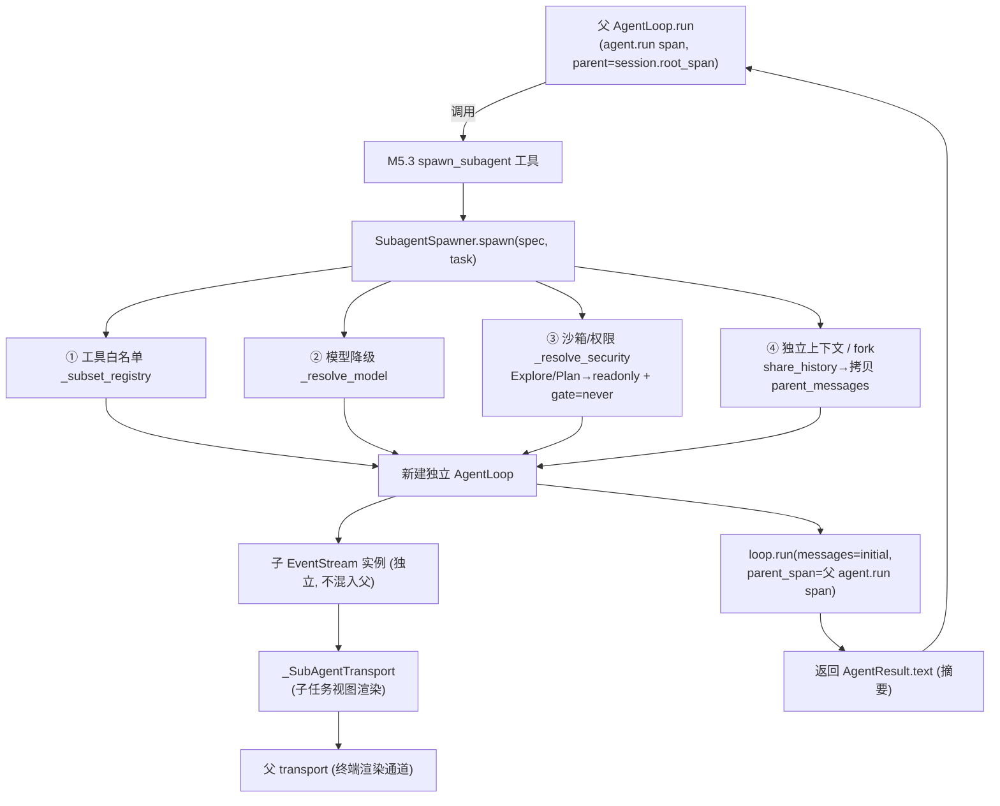
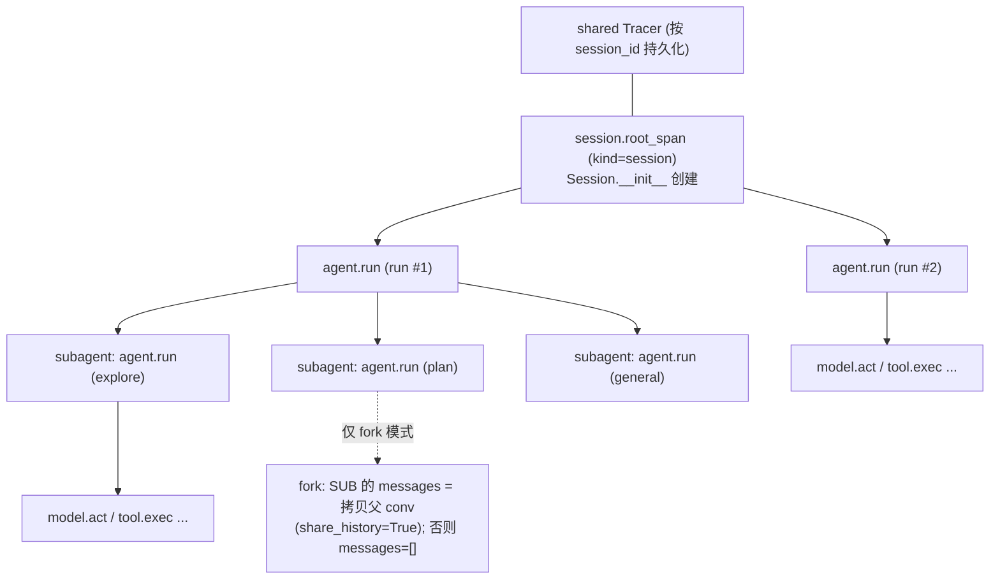

# Step M5.2 SubagentSpawner

## 实现方案

**目标**：实现 `SubagentSpawner`——把子任务委派给一个**独立上下文窗口**的 `AgentLoop` 分身，主上下文只拿回文本摘要；支持并行（asyncio.gather）、嵌套（深度限制 5）、模型降级、工具白名单、独立沙箱/权限；预置 Explore/Plan/General-purpose 三种内置类型。

**改动文件**（新建 `agent/subagent.py`）：
- `agent/subagent.py`：`AgentSpec` dataclass + `SubagentSpawner` 类 + 内置类型常量。
- `agent/context/manager.py`：`ContextManager` 已满足子 agent 独立实例需求，本步**不改动**（仅 spawn 时各自 new 一个）。
- `agent/obs/tracer.py`：本步**不改动**（已支持 `parent_override`，见下方关键决策）。

**关键接口**：

```python
# agent/subagent.py
from dataclasses import dataclass, field
from pathlib import Path


@dataclass
class AgentSpec:
    name: str
    description: str
    system_prompt: str  # 正文（替代默认 system 提示）
    tools: list[str] | None = None  # 白名单；None=继承所有
    disallowed_tools: list[str] = field(default_factory=list)
    model: str | None = None  # 覆盖 llm.model（None=inherit）
    permission_mode: str | None = None  # "plan"/"auto"/"dontAsk"/... 映射到 gate/sandbox
    max_turns: int | None = None
    effort: str | None = None
    isolation: str | None = None  # "worktree" 可选（M5 先留接口，不强制）
    share_history: bool = False  # True=fork 模式：继承父 conv（如记忆子 agent 需读父对话）
    builtin: bool = False


class SubagentSpawner:
    def __init__(self, settings: Settings, *, tracer: Tracer | None = None, max_depth: int = 5):
        self.settings = settings
        self.tracer = tracer
        self.max_depth = max_depth

    def discover(self) -> list[AgentSpec]:
        """扫描 <project>/.agent/agents/*.md 与 ~/.agent/agents/*.md（项目级覆盖同名）。"""

    def get(self, name: str) -> AgentSpec | None: ...

    async def spawn(
        self,
        spec: AgentSpec,
        task: str,
        *,
        depth: int = 0,
        parent_span=None,
        base_registry: ToolRegistry | None = None,
        base_model: Model | None = None,
        parent_transport: AgentTransport | None = None,
        parent_messages: list[Message] | None = None,
    ) -> AgentResult:
        """构造独立 AgentLoop（独立 ContextManager/EventStream），fork 时继承父 conv，跑 run()，返回摘要。"""
        if depth >= self.max_depth:
            raise RecursionError(f"subagent depth limit {self.max_depth} reached")
        # ① 工具白名单：base_registry 子集（tools 保留 / disallowed_tools 移除）
        sub_reg = self._subset_registry(base_registry or default_registry, spec)
        # ② 模型降级：spec.model 覆盖
        sub_model = self._resolve_model(base_model, spec)
        # ③ 沙箱/权限：permission_mode 映射（plan→read-only + 跳过 exec gate）
        sub_sandbox, sub_gate = self._resolve_security(spec)
        # ④ 独立上下文 + fork（share_history=True 时继承父 conv）
        initial = list(parent_messages) if (spec.share_history and parent_messages) else []
        ctx = ContextManager(...)  # 独立实例（recent_files 不串父）
        loop = AgentLoop(
            sub_model,
            sub_reg,
            self.settings,
            tracer=self.tracer,
            sandbox=sub_sandbox,
            gate=sub_gate,
        )
        sub_transport = _SubAgentTransport(parent=parent_transport)  # 子任务视图渲染，屏蔽独立 HITL
        result = await loop.run(
            task,
            messages=initial,  # fork 模式非空；独立上下文为空
            transport=sub_transport,
            parent_span=parent_span,
        )
        # ⑤ 摘要回填由调用方处理；spawn 仅返回 AgentResult（text=摘要）
        return result
```

**内置类型常量**：

```python
BUILTIN_EXPLORE = AgentSpec(
    name="explore",
    description="快速代码库搜索（只读，跳过会话文件）",
    system_prompt="你是代码探索专家，只做只读搜索...",
    tools=["read", "grep", "glob", "bash"],
    disallowed_tools=["write", "edit"],
    permission_mode="plan",
    builtin=True,
)
BUILTIN_PLAN = AgentSpec(
    name="plan",
    description="plan mode 期间研究（只读）",
    system_prompt="你是研究规划专家...",
    tools=["read", "grep", "glob", "bash"],
    disallowed_tools=["write", "edit"],
    permission_mode="plan",
    builtin=True,
)
BUILTIN_GENERAL = AgentSpec(
    name="general-purpose",
    description="复杂多步骤（探索+修改）",
    system_prompt="你是通用执行 agent...",
    tools=None,
    builtin=True,
)
```

**关键决策 / 踩坑（M5.3 务必先看）**：

1. **Trace 父子（最重要）**：`agent.run` 的 parent 由 `parent_span` **显式指定**（`Tracer.reset_current_span()` 已删除，不再依赖 contextvar 隐式状态）。主循环 `Session.step` 传 `session.root_span`，子 agent 经 `SubagentSpawner` 调起时传调用方的 `agent.run` span → 子 agent 的 `model.act`/`tool.exec` 自动成为父调用链的子 span（复用 M4.3 同期的 contextvars 机制，但父子关系靠显式 `parent_span` 而非 reset）。

   **并行安全前提**：多个子 agent 经 `asyncio.gather(spawn(...), ...)` 并行时，每个 `spawn` 必须在**独立 `asyncio.Task`**（`asyncio.create_task`）中运行子 `loop.run`，借助 `contextvars` 按 Task 隔离，避免父子/兄弟 span 互相改写当前 span；且 `parent_span` 必须**显式**传入（经 `parent_override`），不可依赖 contextvars 隐式继承——否则嵌套 spawn 时子子 agent 可能挂错树（误挂到兄弟 span）。满足这两点，并行不会破坏 trace 父子结构。
2. **子 agent 有自己的 EventStream（独立实例）+ 子任务渲染**：`loop.run` 内部**新建独立 `EventStream()`** 并 `transport.bind(stream)`——子 agent 拥有**完全独立的事件流实例**，不与父 EventStream 串流、不污染父的持久化/检索。渲染上，子 agent 用 `_SubAgentTransport(parent=父transport)`：将该独立 stream 的事件转发给父 transport 渲染为**子任务视图**（折叠面板/独立区块，标记来源），用户可见子 agent 在做什么；但**事件本身不写入/混入父 agent 自己的 EventStream**，父只拿 `AgentResult.text` 摘要（采用「摘要返回」方式）。即：**独立 stream 实例 + 共享终端渲染通道**。
3. **`_SubAgentTransport` 屏蔽 HITL**：继承 `TerminalTransport`，覆盖 `ask()`/`interactive`——子 agent **不弹出独立澄清/审批交互**（HITL 由父代理统一决策或按 `gate` 策略自动处理）；事件渲染保留（带来源标记）。不要用全 no-op 的 `_NullTransport`，否则子 agent 完全静默、不可观测。
4. **工具白名单**：`_subset_registry` 从 `base_registry.list()` 过滤（`tools` 保留白名单，`disallowed_tools` 移除，二者并存时先移除再保留）。传给 `AgentLoop(registry=sub_reg)`；`loop._model_tools()` 自动 `registry.list()` + `collect_control_tools()`，无需改 loop。
5. **模型降级**：`spec.model` 非空时，用同 `settings` 但换 `llm.model` 构造另一 `OpenAICompatibleModel`（或测试用 `FakeModel`）。`inherit`/空 → 用 `base_model`。
6. **权限/沙箱映射**：`permission_mode="plan"` → `sandbox=build_executor('local', profile=read-only)` + `gate` 配置跳过 exec（如 `ApprovalGate(mode="never")` 配合只读沙箱）；默认 → 继承父 `sandbox`/`gate`。**Explore/Plan 确为只读**（拒 `write`/`edit`），仅用于探索/规划类任务。需**写操作**的子任务——如 M4.4 SessionMemory Compact 的"记忆子 agent"（只授权 Edit `summary.md`）——**必须用 `general-purpose` 或自定义可写类型**，绝不可误用 Explore/Plan；其沙箱应限定到目标目录（如 `.agent/sessions/<id>/session-memory/`，`profile=workspace-write` 但 `paths` 收窄），避免 workspace 全写越权；**且因需读取父 conv 才能提取摘要，应设 `share_history=True`（fork 模式）继承父历史**，否则子 agent 在空上下文中看不到待压缩的对话。
7. **深度限制 5**：`spawn` 入口 `if depth >= max_depth: raise RecursionError`；每次 spawn 传 `depth+1`。子 agent 若被授权生成 subagent（M5.3 接入 `spawn_subagent` 工具），`depth` 已 +1。
8. **压缩不碰 EventStream**：子 agent 的 `ContextManager` 同守 M4.1 铁律（只压 conv 投影）。子 `ContextManager` 独立 `recent_files`，不与父串。
9. **fork 模式（M5.2 必须实现，非可选）**：`AgentSpec.share_history=True` 时，`spawn` 把父 `messages` 拷贝为子的**初始 `messages`**（`loop.run(messages=initial)`），子 agent 因此能看到父对话历史（但仍独立 `ContextManager`，工具调用在父上下文外、不串 `recent_files`）。fork 与只读/可写正交：记忆子 agent = `fork=True`（继承历史）+ 可写白名单（只 Edit summary.md）；Explore/Plan = `fork=False`（独立上下文，省 token）。`spawn` 新增 `parent_messages` 参数（调用方传入父 `loop` 的当前 conv），`share_history=False` 或 `parent_messages=None` 时 `initial=[]`。典型场景：M4.4 SessionMemory Compact 的"记忆子 agent"**必须 fork**（继承父 conv 才能基于对话历史增量更新 `summary.md`），否则空上下文无法提取。

**依赖/环境**：
- `AgentLoop` / `AgentResult` / `Model` / `FakeModel` / `RecordingModel`（M1）。
- `ContextManager`（M4）、`ToolRegistry`/`default_registry`（M1.2）、`ApprovalGate`/`SandboxExecutor`/`build_executor`（M2）。
- `Tracer`（`parent_override` 已支持，M4.3 同期）。
- 不依赖真实 API；测试用 `FakeModel` 驱动 `spawn()`。

## 架构图（Mermaid）

**① spawn 与隔离**：子 agent 拥有独立 `ContextManager` + 独立 `EventStream` 实例；事件经 `_SubAgentTransport` 转发给父 transport 渲染为「子任务视图」，父只拿回 `AgentResult.text` 摘要。



**② Trace 树（session 锚点 + 并行安全）**：整条 session 是一棵树——`session.root_span` 下挂各轮 `agent.run`；同一轮内多个子 agent 经 `asyncio.gather` 并行，各自独立 Task + 显式 `parent_span`，都挂到同一父 `agent.run` 下（兄弟关系，不互相改写）。



## 验收标准

- [ ] `SubagentSpawner.discover()` 发现项目级/用户级 agents，项目级覆盖同名。
- [ ] `spawn(explore_spec, task)` 返回 `AgentResult`，其 `messages` 与父 agent **完全隔离**（独立上下文，`messages` 从 `[]` 开始）；子 agent 拥有**独立的 `EventStream` 实例**（不混入父 stream）。
- [ ] **fork 模式**：`spawn(spec, task, parent_messages=父conv)` 且 `spec.share_history=True` 时，子的初始 `messages` 拷贝父 conv（断言子首轮能看到父历史）；`share_history=False` 时 `initial=[]`（断言子看不到父历史）。记忆子 agent 场景单测覆盖。
- [ ] 摘要回填：父 agent 拿到 `AgentResult.text`（子 agent 的最终文本），不混入子 agent 事件流。
- [ ] 工具白名单生效：`tools=["read"]` 的 subagent 调 `write` 被 `UnknownTool` 降级（或 `registry` 根本不含）。
- [ ] 模型降级：传 `FakeModel` 作为 `base_model` 时子 loop 用该模型；`spec.model` 覆盖生效（单测用 `RecordingModel` 断言 `model` 实例）。
- [ ] 深度限制：`depth>=5` 抛 `RecursionError`。
- [ ] Trace 父子：`spawn(..., parent_span=p)` 后，子 agent 的 `model.act` span 的 `parent_id == p.id`（不 reset 到根）。
- [ ] `_SubAgentTransport` 继承 `TerminalTransport`，子 agent 事件以**子任务视图**渲染（可见来源）、不混入父 EventStream、不触发独立 HITL 交互。
- [ ] 内置 Explore/Plan/General-purpose 三种 `AgentSpec` 常量可用，Explore/Plan 拒 write/edit。
- [ ] 测试：`tests/test_subagent.py` 新建，≥12 用例覆盖发现/隔离/白名单/模型降级/深度/trace 父子/null transport/内置类型。

## 知识沉淀

**已落地实现**（`agent/subagent.py` + `agent/core/loop.py` 改动）：

- `AgentSpec` dataclass：`name/description/system_prompt/tools/disallowed_tools/model/permission_mode/max_turns/effort/isolation/share_history/builtin`。`share_history=True` 即 fork 模式。
- `SubagentSpawner`：`discover()`（扫描 `<project>/.agent/agents/*.md` 与 `~/.agent/agents/*.md`，项目级覆盖同名；内置 explore/plan/general-purpose 始终可用）、`get(name)`、`spawn(...)`。
- `spawn` 关键参数：`parent_span`（trace 挂载）、`parent_transport`（子任务视图渲染）、`parent_messages`（fork 时父 conv 拷贝来源）、`parent_sandbox`/`parent_gate`（默认继承父；Explore/Plan 强制 readonly 沙箱 + `ApprovalGate("never")`）、`base_registry`/`base_model`、`depth`（≥`max_depth` 抛 `RecursionError`）。
- `_SubAgentTransport(parent, name)`：继承 `TerminalTransport`，`bind` 时打印来源标记头并以子 agent 独立 `EventStream` 渲染（**不混入父 EventStream**）；`ask` 委托父 transport（无交互父则抛错），`approve` 委托父 transport（非交互自动放行）——即屏蔽独立 HITL、由父代理统一决策。
- `AgentLoop.run` 改动（**唯一动的 loop 代码**）：新增 `parent_span=None` 与 `system_prompt=None`。`agent.run` 的 parent 全部由 `parent_span` **显式指定**——主循环 `Session.step` 传 `session.root_span`，子 agent 传调用方的 `agent.run` span；**不再调用 `Tracer.reset_current_span()`**（该方法已删除），彻底去掉「根 span 隔离」hack。`system_prompt` 非 None 时替代默认 system 提示（子 agent 用自带提示）。

**踩坑 / 约定**：
- 子 agent **独立 EventStream 实例** + 共享终端渲染通道（经 `_SubAgentTransport`）；事件不写入父 stream，故不污染父的持久化/重放。
- Trace 并行：`asyncio.gather(asyncio.create_task(spawn(...)), ...)` 各自独立 Task，配合 `parent_span` 显式传入，span 树正确（兄弟子 agent 都挂同一父 span 下）。
- fork 与只读/可写正交：记忆子 agent（SessionMemory Compact）= `fork=True` + 可写白名单（如 `tools=["edit"]`）；Explore/Plan = `fork=False` + 只读。
- `_resolve_model`：仅当 `spec.model` 非空才重建 `OpenAICompatibleModel`（复用 `settings.llm.api_key/base_url`）；否则用 `base_model`（测试用 `FakeModel`）。
- `discover` 解析 agent `.md`：YAML frontmatter（`name/tools/disallowed_tools/model/permission_mode/max_turns/share_history`） + Markdown 正文作 `system_prompt`；复用 `agent.core.prompts._split_frontmatter`。
- 子 agent 隔离发生在 **messages 层**（`loop.run(messages=initial)`）；`AgentLoop` 内部不使用 `ContextManager`，故无需为子 agent new 一个 `ContextManager`（M4 压缩在 session 层，不影响此隔离）。
