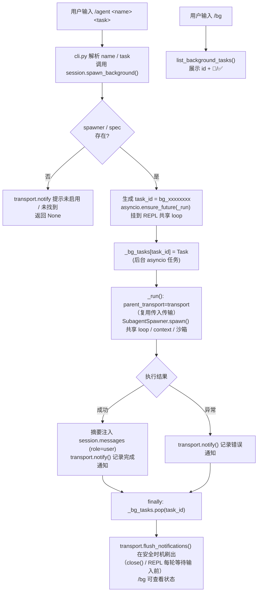

# 后台 Subagent（Background Agent）介绍

> 配套步骤：[5.4-CLI命令.md](./5.4-CLI命令.md)。本文面向**使用者与评审者**，说明后台 Agent 是什么、能解决什么问题、怎么用、以及内部如何工作。

---

## 1. 它解决什么问题

M5.2 的 `spawn_subagent` 工具是**前台阻塞**的：模型调用一次，主循环就同步等待子 Agent 跑完、拿到摘要才继续。这适合「马上要用子 Agent 结果」的场景，但有两个痛点：

1. **阻塞主对话**：如果子任务很重（例如大范围代码检索、长文档摘要、跨多文件重构调研），用户只能干等，期间无法继续发指令。
2. **主上下文被占满**：前台 spawn 时，主循环要一直持有子任务的执行现场。

后台 Agent 把 M5.4「后台 Subagent（可选增强）」落地为可用能力：

- 用 `/agent <name> <task>` 在**后台独立 asyncio 任务**里启动一个 Subagent；
- 用户在等待期间可继续聊天、下其他命令；
- 子 Agent 完成后，摘要**自动回填**进会话（`role=user` 消息），并通过 `transport.notify()` 弹通知；
- 用 `/bg` 随时查看运行中任务状态。

> 一句话：前台 spawn 是「同步委派并等待」，后台 agent 是「异步委派、完成回填」。

---

## 2. 快速上手

进入 chat 模式：

```bash
python -m agent.cli chat
```

常用命令：

| 命令 | 作用 |
|---|---|
| `/agent <name> <task>` | 后台启动一个名为 `<name>` 的 Subagent，去执行 `<task>` |
| `/agent` | 不带参数，提示用法 |
| `/bg` | 列出当前所有运行中的后台任务及其状态 |

示例：

```
you> /agent general-purpose 调研一下项目里所有用到 asyncio 的地方
→ 后台 Subagent [general-purpose] 已启动（task_id: bg_a1b2c3d4），完成后将自动通知。可用 /bg 查看状态。

you> /bg
→ 后台任务数: 1
  bg_a1b2c3d4: 🔄 运行中

you> （继续聊别的事，或等待）
✅ 后台 Subagent [general-purpose] 已完成！摘要已注入会话。
```

完成后，子 Agent 的摘要会出现在会话历史里，形如：

```
[Background Subagent general-purpose — 调研一下项目里所有用到 asyncio 的地方]
<子 Agent 返回的摘要文本>
```

这条消息是 `role=user`，所以后续主循环（或你的下一句指令）会把它当作上下文，**自然衔接**到后续对话中。

---

## 3. 与前台 spawn 的区别

| 维度 | 前台 `spawn_subagent` | 后台 `/agent` |
|---|---|---|
| 触发方式 | 模型工具调用 | 用户输入 CLI 命令 |
| 主对话是否阻塞 | 是（同步等待子 Agent 完成） | 否（异步任务，可继续交互） |
| 结果回传 | 直接作为工具结果返回给模型 | 摘要注入 `session.messages` 作为 user 消息 |
| 状态可见性 | 无（等待即完成） | `/bg` 可查 |
| 适用场景 | 马上要用结果 | 耗时子任务、并行多任务 |

两者底层复用同一套 `SubagentSpawner.spawn()`——独立 loop/context/沙箱/权限，主上下文只拿摘要，上下文隔离不变量完全一致。

---

## 4. 设计要点

### 4.1 任务管理

`Session` 持有一个后台任务表，按 `task_id` 索引：

```python
self._bg_tasks: dict[str, asyncio.Task] = {}  # task_id -> asyncio.Task
```

- `spawn_background(agent_name, task, transport, *, parent_span=None) -> str | None`
  启动后台 Subagent，成功返回 `bg_<8位hex>` 任务 id；未启用/未找到则返回 `None` 并通过 `transport.notify()` 提示。
- `list_background_tasks() -> list[dict]`
  返回 `[{"id", "agent", "done"}, ...]`，供 `/bg` 展示。

### 4.2 异步调度与事件循环兼容（共享单一 loop）

> **关键修复（M5.4.1 后续）**：原本 chat REPL 是「同步 + 每轮开关 loop」，`spawn_background` 自建的
> 新 loop 永远没人去 `run()`，后台 `_run()` 因此**永不执行**（卡死）。修复后 chat 改为**异步 REPL**
> （`asyncio.run(_chat_repl())`），前台 `await session.step(...)` 与后台 `asyncio.ensure_future(_run())`
> **共享同一个运行中的事件循环**，于是后台任务在用户思考/输入期间被事件循环真正调度推进。

`spawn_background` 内部用一个 `_run()` 协程包裹 `SubagentSpawner.spawn(...)`，调度关键点：

```python
try:
    loop = asyncio.get_running_loop()  # 异步 REPL 下有运行中的 loop
except RuntimeError:
    # 兜底：没有运行中的事件循环（极少路径，如纯同步调用），退化为新建 loop
    loop = asyncio.new_event_loop()
    asyncio.set_event_loop(loop)
spawner = self.subagent_spawner  # 局部绑定，绕过协程内类型收窄
bg_task = asyncio.ensure_future(_run(), loop=loop)  # 挂到运行中的（共享）loop
```

- 异步 REPL 下 `get_running_loop()` 命中，任务挂到 REPL 的 loop，loop 持续转动 → 后台真正并发。
- `pytest-asyncio` / `asyncio.run` 内（测试、M4.4 记忆子 agent）同样有运行中的 loop，可直接 `await` 任务。
- `except RuntimeError` 分支仅作兜底，正常路径不再依赖它。

### 4.3 完成回填与通知（notify 只记录，由 transport 在合适时机呈现）

> **分层约束（重要）**：`Session`（core 层）**不应持有任何渲染逻辑**。后台子 agent 的传输直接复用
> 传入的 `transport`（`parent_transport=transport`），**不在 session 内构造 `TerminalTransport`**；
> 完成/错误通知通过 `transport.notify(...)` 发出——而 `notify` 的语义只是「**记录一条通知信号**」，
> **不直接渲染/输出**。真正的呈现由 `TerminalTransport` 在不在流式 `Live` 中的安全时机完成：
> `notify` 把消息缓冲进 `self._pending_notifications`，由 `flush_notifications()`（在 `close()` 内
> 及 REPL 每轮等待输入前触发）统一刷出。这样既不打断前台流式渲染，又把渲染职责干净地留在 transport 层。

`_run()` 收尾逻辑：

```python
if result_sink is not None:
    result_sink(agent_name, task, result.text)
    transport.notify("✅ 后台 Subagent [{agent_name}] 已完成，结果已处理。")
else:
    summary = f"[Background Subagent {agent_name} — {task}]\n{result.text}"
    self.messages.append(Message(role="user", content=summary))  # 注入主会话
    transport.notify("✅ 后台 Subagent [{agent_name}] 已完成！摘要已注入会话。")
```

- **成功**：默认把摘要作为 `role=user` 消息追加到 `session.messages`；若传了 `result_sink` 则由 sink 消费
  （如 M4.4 记忆子 agent 把摘要落盘 `summary.md`）。
- **通知**：`transport.notify(...)` 只记录不渲染，由 transport 在 `close()` / REPL 刷新时呈现，不打断前台 Live。
- **异常**：捕获后 `transport.notify("❌ 后台 Subagent [...] 出错: ...")`，同样只记录，不会让整个会话崩溃。
- **清理**：`finally` 块里 `self._bg_tasks.pop(task_id)`，保证任务字典不会无限堆积。

### 4.3.1 后台 Subagent 的渲染策略（live=False：避免与 ptk 输入行争用终端）

> **坑（已修复）**：`SubagentPanelHub` 用顶层唯一 rich `Live` 实时渲染子 agent 面板。该 `Live` 与
> prompt_toolkit 的 `prompt_async` 输入行**不能共存于同一终端**——后台 Subagent 运行时用户正处于
> `you:` 提示行，二者互相用光标转义序列抢占，导致：① 横幅被画成「两层」叠影；② `you:` 提示行乱码、
> 看似卡死。前台 Subagent（模型在 step 内调用 `spawn_subagent`）无此问题，因为那时 ptk 不在活动。

**修复**：`session.spawn_background` 调 `spawner.spawn(..., live=False)` 关掉后台子 agent 的实时 `Live`：
- `_SubAgentTransport(live=False)` **不注册** hub 槽、所有 `on_*` 回调仅把条目累积进 `self._entries`
  /`self._stream_text`/`self._reasoning_text`，绝不触碰终端；
- 子 agent 结束时 `close()` 用 `_build_final_panel()` 把累积条目定稿成**一个**最终面板，通过
  `parent.queue_render(panel)` 入队；
- `TerminalTransport.queue_render` 把面板缓冲进 `self._pending_renderables`，由 `flush_notifications()`
  在「不在流式 Live / 不在 ptk 输入行」的安全时机（REPL 每轮等待输入前、`close()` 内）统一 `console.print`。

前台 Subagent（`loop._tool_spawn_subagent`）仍走 `live=True`：注册 hub 槽、实时渲染，因为那期间 ptk 未活动。
**关键不变量**：`_SubAgentTransport` 的布尔开关原名会与父类 `TerminalTransport.self._live`（流式 Live 实例）
冲突，已改名为 `self._use_live`，切勿再改回 `self._live`。

### 4.4 Trace 父子关系

后台 Subagent 复用 `Session.root_span`（或显式传入的 `parent_span`）作为 trace 父 span，因此它的执行痕迹会挂到主会话的 trace 树下，可观测性不丢失（见 M3 `Tracer` 的 OTel 父子语义）。

### 4.5 隔离边界（复用 M5.2 不变量）

- 子 Agent 跑在**独立上下文窗口**（`messages=[]`），拿回的只是摘要，主上下文不被子任务细节撑爆。
- 子 Agent 继承父的 `registry` / `model` / `sandbox` / `gate`，工具白名单与权限模型同前台 spawn，**安全边界不变**。

### 4.6 后台任务生命周期（流程图）



> 关键点：`spawn_background` 现在**共享 chat 异步 REPL 的单一事件循环**——后台任务在用户思考/输入期间
> 被事件循环真正调度推进（不再卡死）。`try/except RuntimeError` 仅作无 loop 的兜底；测试与 M4.4 记忆子
> agent 均在运行中的 loop 内调用，可直接 `await`。**分层约束**：`Session` 不持有渲染逻辑，后台子 agent 复用
> 传入的 `transport`；`notify` 只记录通知、不渲染，由 `TerminalTransport` 在 `close()` / REPL 刷新等安全时机
> 通过 `flush_notifications()` 统一呈现，既不打断前台流式渲染，又把渲染职责留在 transport 层。

---

## 5. 验收情况

- 新增 4 个测试用例（`tests/test_cli.py`）：
  - `test_chat_agent_command_usage`：`/agent` 用法提示、未知 agent 提示未找到。
  - `test_chat_agent_starts_background`：`/agent <name> <task>` 启动并返回 `task_id`。
  - `test_chat_bg_lists_no_tasks`：`/bg` 无任务时正确提示。
  - `test_background_spawn_injects_summary`：完成后摘要确实以 `role=user` 注入 `session.messages`，任务字典被清理。
- 上述用例全绿；`tests/test_cli.py` + `tests/test_context.py` 全量 74 passed（含 M4.4 记忆子 agent 复用
  `spawn_background` 的端到端用例），M1–M4 零回归。
- **M5.4.1 后续修复（异步 REPL + 共享 loop）验证**：
  - `chat` 改为 `asyncio.run(_chat_repl())`，前台 `await session.step` 与后台 `asyncio.ensure_future(_run())`
    共享同一 loop；`test_chat_*` 仍全绿（非 TTY 经 `CliRunner` 走同步 `typer.prompt` 退化路径，不触发
    `prompt_async` 卡死）。
  - **分层约束落实**：`Session` 不构造任何 `TerminalTransport`；后台子 agent 复用传入的 `transport`，
    完成/错误走 `transport.notify()`（只记录、不渲染），由 `TerminalTransport.flush_notifications()` 在
    `close()` 与 REPL 每轮等待输入前刷出，渲染职责干净留在 transport 层。
  - 全量 `pytest` 333 passed（唯一失败 `tests/test_skills.py::test_discover_ignores_dir_without_skill_md`
    为 **预先存在、与本次改动无关** 的环境问题：项目内置/用户级 `code-review` skill 被 loader 一并发现）。

---

## 6. 已知限制与后续可扩展

- **退出时默认不等待后台收尾**：`asyncio.run` 结束会取消所有未完成的 `_bg_tasks`。如需优雅退出，
  可在 `_chat_repl` 退出前 `await asyncio.gather(*session._bg_tasks.values(), return_exceptions=True)`。
- **无并发上限**：可同时起任意多个 `/agent`，未来可加 `max_concurrent` 配置。
- **结果不持久化**：回填的摘要仅存在于内存 `session.messages`，未单独落库；可借 M4 `TraceStore`/会话持久化进一步留存。
- **仅 CLI 入口**：目前仅供 chat REPL 触发。模型若想「派一个后台分身」，后续可在 M5.3 的 `spawn_subagent` 工具上加 `blocking=False` 选项复用同一套 `spawn_background`。
