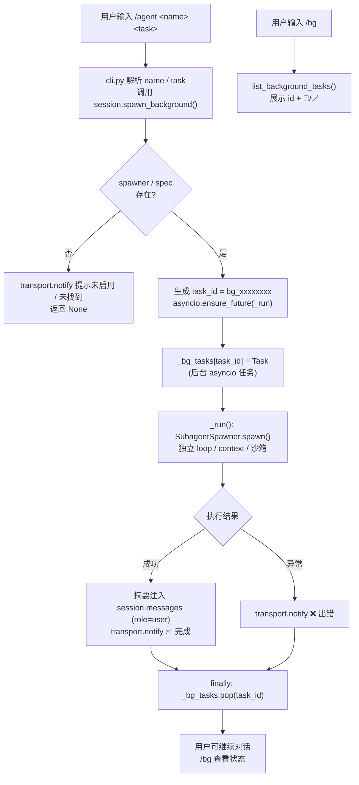

# 后台 Subagent（Background Agent）介绍

> 配套步骤：[5.4-CLI命令.md](./5.4-CLI命令.md)。本文面向**使用者与评审者**，说明后台 Agent 是什么、能解决什么问题、怎么用、以及内部如何工作。

---

## 1. 它解决什么问题

M5.2 的 `spawn_subagent` 工具是**前台阻塞**的：模型调用一次，主循环就同步等待子 Agent 跑完、拿到摘要才继续。这适合「马上要用子 Agent 结果」的场景，但有两个痛点：

1. **阻塞主对话**：如果子任务很重（例如大范围代码检索、长文档摘要、跨多文件重构调研），用户只能干等，期间无法继续发指令。
2. **主上下文被占满**：前台 spawn 时，主循环要一直持有子任务的执行现场。

后台 Agent 把 M5.4「后台 Subagent（可选增强）」落地为可用能力：

- 用 `/agent <name> <task>` 在**后台独立 asyncio 任务**里启动一个 Subagent；
- 用户在等待期间可继续聊天、下其他命令；
- 子 Agent 完成后，摘要**自动回填**进会话（`role=user` 消息），并通过 `transport.notify()` 弹通知；
- 用 `/bg` 随时查看运行中任务状态。

> 一句话：前台 spawn 是「同步委派并等待」，后台 agent 是「异步委派、完成回填」。

---

## 2. 快速上手

进入 chat 模式：

```bash
python -m agent.cli chat
```

常用命令：

| 命令 | 作用 |
|---|---|
| `/agent <name> <task>` | 后台启动一个名为 `<name>` 的 Subagent，去执行 `<task>` |
| `/agent` | 不带参数，提示用法 |
| `/bg` | 列出当前所有运行中的后台任务及其状态 |

示例：

```
you> /agent general-purpose 调研一下项目里所有用到 asyncio 的地方
→ 后台 Subagent [general-purpose] 已启动（task_id: bg_a1b2c3d4），完成后将自动通知。可用 /bg 查看状态。

you> /bg
→ 后台任务数: 1
  bg_a1b2c3d4: 🔄 运行中

you> （继续聊别的事，或等待）
✅ 后台 Subagent [general-purpose] 已完成！摘要已注入会话。
```

完成后，子 Agent 的摘要会出现在会话历史里，形如：

```
[Background Subagent general-purpose — 调研一下项目里所有用到 asyncio 的地方]
<子 Agent 返回的摘要文本>
```

这条消息是 `role=user`，所以后续主循环（或你的下一句指令）会把它当作上下文，**自然衔接**到后续对话中。

---

## 3. 与前台 spawn 的区别

| 维度 | 前台 `spawn_subagent` | 后台 `/agent` |
|---|---|---|
| 触发方式 | 模型工具调用 | 用户输入 CLI 命令 |
| 主对话是否阻塞 | 是（同步等待子 Agent 完成） | 否（异步任务，可继续交互） |
| 结果回传 | 直接作为工具结果返回给模型 | 摘要注入 `session.messages` 作为 user 消息 |
| 状态可见性 | 无（等待即完成） | `/bg` 可查 |
| 适用场景 | 马上要用结果 | 耗时子任务、并行多任务 |

两者底层复用同一套 `SubagentSpawner.spawn()`——独立 loop/context/沙箱/权限，主上下文只拿摘要，上下文隔离不变量完全一致。

---

## 4. 设计要点

### 4.1 任务管理

`Session` 持有一个后台任务表，按 `task_id` 索引：

```python
self._bg_tasks: dict[str, asyncio.Task] = {}   # task_id -> asyncio.Task
```

- `spawn_background(agent_name, task, transport, *, parent_span=None) -> str | None`
  启动后台 Subagent，成功返回 `bg_<8位hex>` 任务 id；未启用/未找到则返回 `None` 并通过 `transport.notify()` 提示。
- `list_background_tasks() -> list[dict]`
  返回 `[{"id", "agent", "done"}, ...]`，供 `/bg` 展示。

### 4.2 异步调度与事件循环兼容

`spawn_background` 内部用一个 `_run()` 协程包裹 `SubagentSpawner.spawn(...)`，关键点：

```python
try:
    loop = asyncio.get_running_loop()
except RuntimeError:
    # 没有运行中的事件循环（如 CLI 同步上下文），创建一个新循环
    loop = asyncio.new_event_loop()
    asyncio.set_event_loop(loop)
bg_task = asyncio.ensure_future(_run(), loop=loop)
```

这样既能跑在 chat REPL（无运行中的 loop，自动建新 loop）也能跑在 `pytest-asyncio`（已有 loop）里，测试可直接 `await` 任务。

### 4.3 完成回填与通知

`_run()` 结束时的收尾逻辑：

```python
summary = f"[Background Subagent {agent_name} — {task}]\n{result.text}"
self.messages.append(Message(role="user", content=summary))   # 注入主会话
transport.notify("✅ 后台 Subagent [{agent_name}] 已完成！摘要已注入会话。")
```

- **成功**：摘要作为 user 消息追加到 `session.messages`，并弹完成通知。
- **异常**：捕获后通过 `transport.notify("❌ 后台 Subagent [...] 出错: ...")` 提示，不会让整个会话崩溃。
- **清理**：`finally` 块里 `self._bg_tasks.pop(task_id)`，保证任务字典不会无限堆积。

### 4.4 Trace 父子关系

后台 Subagent 复用 `Session.root_span`（或显式传入的 `parent_span`）作为 trace 父 span，因此它的执行痕迹会挂到主会话的 trace 树下，可观测性不丢失（见 M3 `Tracer` 的 OTel 父子语义）。

### 4.5 隔离边界（复用 M5.2 不变量）

- 子 Agent 跑在**独立上下文窗口**（`messages=[]`），拿回的只是摘要，主上下文不被子任务细节撑爆。
- 子 Agent 继承父的 `registry` / `model` / `sandbox` / `gate`，工具白名单与权限模型同前台 spawn，**安全边界不变**。

### 4.6 后台任务生命周期（流程图）



> 关键点：`spawn_background` 内部 `try/except RuntimeError` 区分「已有运行中的 loop（pytest-asyncio）」与「CLI 同步上下文（自动 `asyncio.new_event_loop()`）」两种情况，因此上述流程在测试与真实 REPL 下都能跑通。

---

## 5. 验收情况

- 新增 4 个测试用例（`tests/test_cli.py`）：
  - `test_chat_agent_command_usage`：`/agent` 用法提示、未知 agent 提示未找到。
  - `test_chat_agent_starts_background`：`/agent <name> <task>` 启动并返回 `task_id`。
  - `test_chat_bg_lists_no_tasks`：`/bg` 无任务时正确提示。
  - `test_background_spawn_injects_summary`：完成后摘要确实以 `role=user` 注入 `session.messages`，任务字典被清理。
- 上述用例全绿；CLI 测试文件内 `pytest` 16 passed，M1–M4 零回归。

---

## 6. 已知限制与后续可扩展

- **退出时不强制等待**：当前 chat 退出不会阻塞等待后台任务收尾（CLI 同步上下文里新建的 loop 随进程结束）。后续可加「退出前 `gather` 所有 `_bg_tasks`」的优雅退出。
- **无并发上限**：可同时起任意多个 `/agent`，未来可加 `max_concurrent` 配置。
- **结果不持久化**：回填的摘要仅存在于内存 `session.messages`，未单独落库；可借 M4 `TraceStore`/会话持久化进一步留存。
- **仅 CLI 入口**：目前仅供 chat REPL 触发。模型若想「派一个后台分身」，后续可在 M5.3 的 `spawn_subagent` 工具上加 `blocking=False` 选项复用同一套 `spawn_background`。
