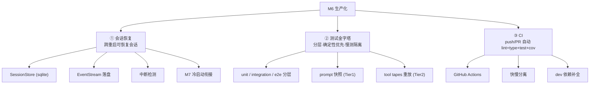
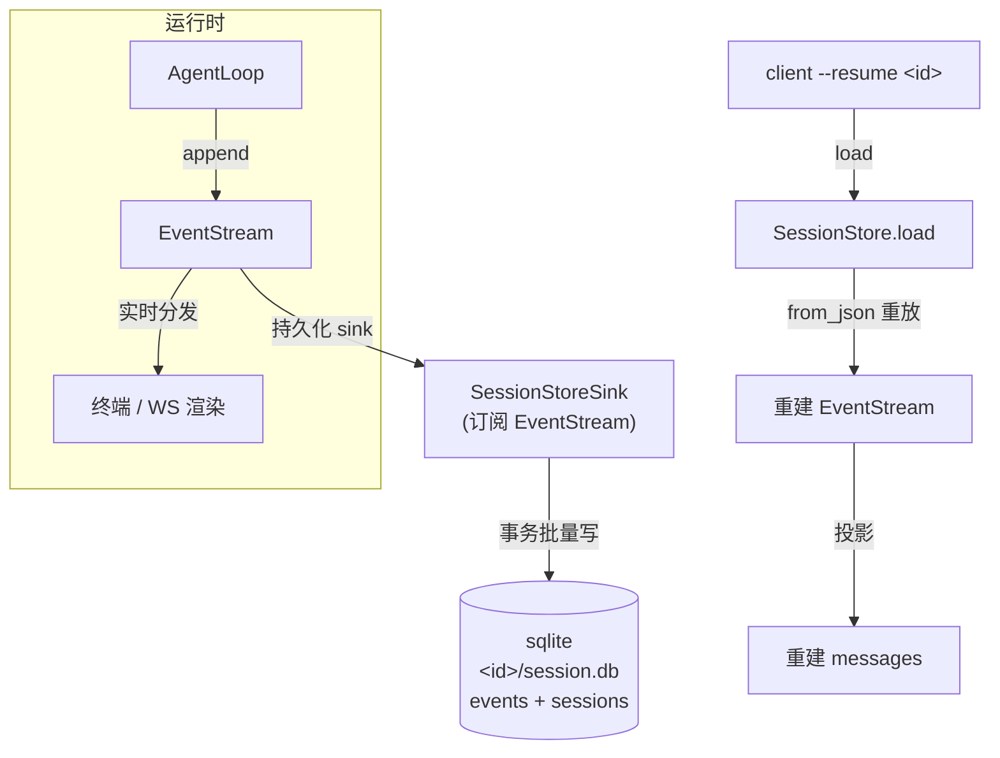
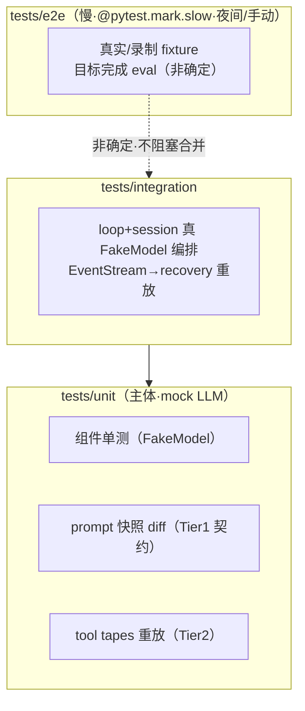
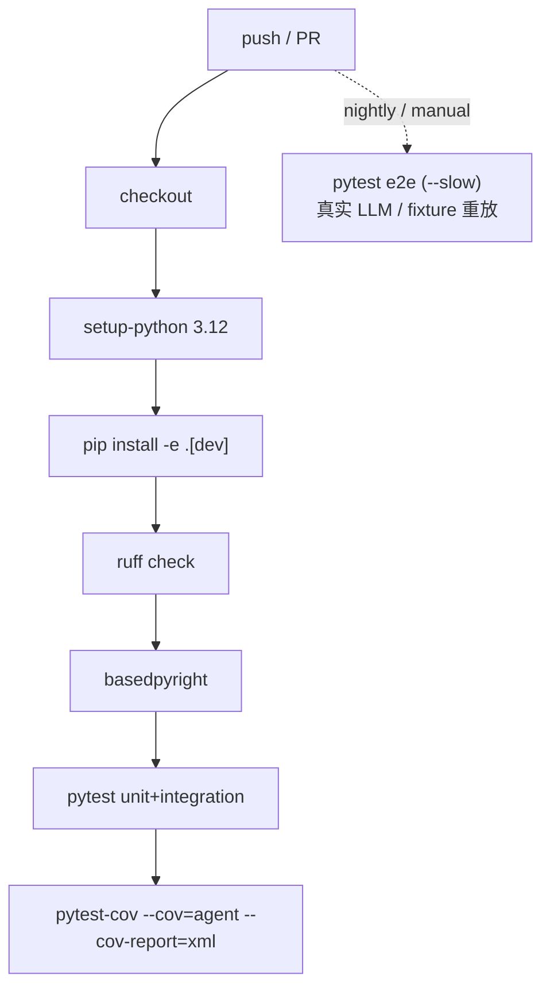
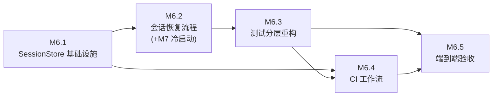

# 里程碑 M6 — 生产化

> 状态：⚪ 待启动。本文档为 M6 **规划**（目标 / 现状缺口 / 方案 / 步骤拆分）。
> 调研详情与全部外部方案来源见 **`调研.md`**（含现状持久化边界、Claude Code/OpenAI 恢复流水线、测试金字塔、CI 等 mermaid 图）。
> 三要素（实现方案/验收标准/知识沉淀）在正式启动后拆到各 `M6.x-*.md` 步骤文件。

---

## 一、目标

把 agent 从「开发可跑」推进到「生产可运维」——三大支柱：



> M7 已落地 daemon 常驻 + WS + 多会话**内存态**切换回放，是 M6「可恢复可观测可测」的前置基础；M6 补齐「跨重启持久化」与「工程化测试/CI」。

---

## 二、M6 需要做的事（现状缺口）

缺口全景见 `调研.md §一`，要点：

| 能力 | 现状 | 缺口 |
|---|---|---|
| 会话索引 / 回放 | `SessionRegistry._sessions`、`event_buffer=deque(200)` 全内存 | daemon 重启即丢 |
| `resume` | `client --resume` 连 daemon 最近会话 | **非存储恢复** |
| 事件流 | `EventStream` 可 `to_json/from_json` 但仅驻内存 | 不落盘 |
| sqlite | `TraceStore`、`SessionMemory` | 无整段会话 |

**核心缺口**：对话历史（`messages`）+ 事件流（`events`）+ 计划 + session_memory 摘要，没有**统一的跨重启持久化与恢复**机制。

---

## 三、M6 方案（贴合本项目）

### 3.1 会话恢复 — 目标架构



**恢复时序（含中断检测）**

```mermaid
sequenceDiagram
    participant U as User
    participant C as CLI
    participant S as SessionStore
    participant ES as EventStream
    participant L as AgentLoop
    U->>C: resume &lt;session_id&gt;
    C->>S: load(session_id)
    S->>ES: from_json 重放 events（按 seq）
    ES->>ES: 投影 → messages
    alt 末条是 tool_use 无对应 tool_result
        ES->>ES: 中断检测 → 注入『继续』user 消息
    end
    U->>C: 继续任务
    C->>L: step(task, messages)
```

**要点**
- 新增 `SessionStore`（复用 `TraceStore` 的 sqlite 模式）：`<project>/.agent/sessions/<id>/session.db`。
  - `events(session_id, seq, type, json, transient, ts)` 直接存 `Event.to_json()`；`transient` 排除 `tool_call_delta`。
  - `sessions(session_id, name, parent_session_id, created_at, updated_at, plan_path, model_meta_json)` —— **`parent_session_id` 记录 fork 血缘**（NULL=根会话）。
  - **会话 fork（M6 新增）**：`SessionStore.fork(parent_id)` 生成新 `session_id`，并把父会话 events **前缀完整拷贝**到新会话（复制语义，非 per-event 链表）。fork 后父子各自独立演进，恢复时无需特殊分支。
    ```mermaid
    flowchart LR
      P["父会话 events\n(seq 0..N)"] -->|"fork: 复制前缀"| C["子会话 events\n(0..N 共享 + 新续)"]
      P -. "parent_session_id" .-> C
    ```
  - **关键决策**：`session_id` 必须统一——当前 `SessionRegistry.new` 与 `Session.__init__` 各生成一份 `sid`（不一致），M6.1 改为 daemon/CLI 创建时生成并传入 `Session`，否则持久化 id 与运行时 id 对不上。
- **写入点**：给 `EventStream` 增加持久化 sink，`append` 时批量写 sqlite（事务）；`emit` 瞬时不入档。
- **中断检测**（借鉴 Claude Code）：恢复时若末条 `Event` 是 `tool_use` 且无 `tool_result`（`interrupted_turn`），注入「继续」user 消息。
- **与 M7 衔接**：`SessionRegistry.new/get` 增加 sqlite 落地与恢复；内存回放缓冲仍走内存，但**冷启动从 sqlite 加载初始 events** 进 `event_buffer`。
- **不变量（呼应 M4 双轨）**：`EventStream` 永不压缩；恢复后重放再应用 `ContextManager` 投影，绝不等价存储压缩后 `conv`；重建 `messages` 必须满足 OpenAI/DeepSeek 配对（呼应 M1.5 踩坑：tool_calls 后必跟 tool_result）。

### 3.2 测试金字塔



**要点**
- 分层目录 + marker：`tests/unit/`(扩主体) / `tests/integration/`(扩 `test_integration`) / `tests/e2e/`(慢 `@mark.slow`)。
- **Prompt 快照测试**（Tier1）：渲染 `system.md` 存 `tests/fixtures/prompts/<case>.json` 与基线 diff（防 system prompt 被意外改）。
- **Tool tapes**（Tier2）：用 `EventStream` 作天然录制载体，新增「录制/重放」模式（`RecordedModel` 回放事件流），CI 验证工具顺序/参数/错误分支（超时退避、优雅降级）。
- 本项目 `FakeModel` 策略 = Tier1 核心，必须保留并扩展为「契约 + fixture 重放」主力，**避免集成测试调真实 LLM（烧钱+非确定）**。

### 3.3 CI



**要点**
- 新增 `.github/workflows/ci.yml`：矩阵 Python 3.12（可加 3.13）；steps 见上图。
- **快慢分离**：push/PR 跑 unit+integration+lint+type；e2e/eval 夜间或手动。
- `pyproject.toml` `dev` 依赖补全：`pytest-cov`、`ruff`、可选 `pytest-xdist`；可选 `pre-commit`（ruff + 格式化 + 防提交 secret）。

---

## 四、建议步骤拆分（草案）



| 步骤 | 文件 | 目标 |
|---|---|---|
| M6.1 | [6.1-SessionStore基础设施.md](./6.1-SessionStore基础设施.md) | sqlite schema + 写入 sink + `load`/`list_sessions` + **fork 血缘/复制**；统一 `session_id`（修复 daemon 与 Session 双 id） |
| M6.2 | [6.2-会话恢复流程.md](./6.2-会话恢复流程.md) | `rebuild_messages` 事件→Message + 中断检测 + M7 冷启动衔接 + **fork 恢复** + `resume`/`fork` 命令 |
| M6.3 | [6.3-测试分层重构.md](./6.3-测试分层重构.md) | unit/integration/e2e 分层 + marker + prompt 快照 + tool tapes 录制重放 |
| M6.4 | [6.4-CI工作流.md](./6.4-CI工作流.md) | GitHub Actions（lint+type+cov+快慢分离）+ dev 依赖补全 |
| M6.5 | [6.5-端到端验收.md](./6.5-端到端验收.md) | **resume 跨重启 + fork 跨重启** + CI 绿 + 覆盖率报告 + 回归零 |

---

## 五、风险与待确认决策点

1. **存储格式**：sqlite 主 vs JSONL 主（建议 **sqlite 主 + 可选 JSONL 导出**，呼应 Claude Code）。
2. **恢复协议配对**：重建 `messages` 须满足 OpenAI/DeepSeek 配对；中断检测注入「继续」消息。
3. **e2e 非确定性**：默认 CI 门禁用 fixture 重放，**真实 LLM e2e 走夜间/手动**。
4. **M7 衔接**：热切换走内存回放；冷启动（daemon 重启后 attach 旧 `session_id`）从 sqlite 加载。
5. **与 M4 双轨一致性**：`EventStream` 为唯一真相、永不压缩；恢复后重放再投影。
