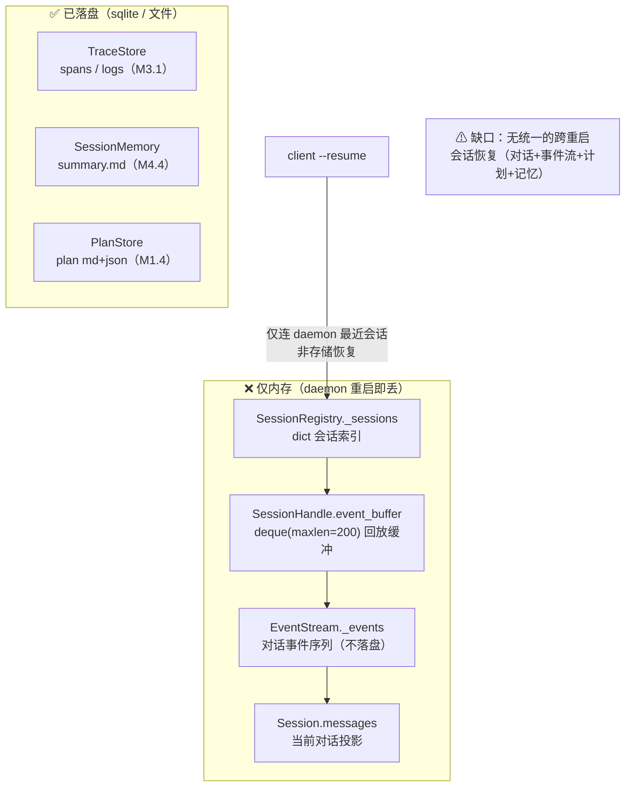
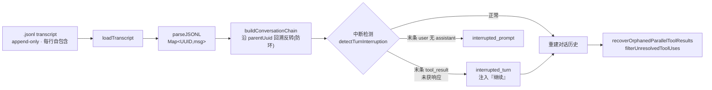
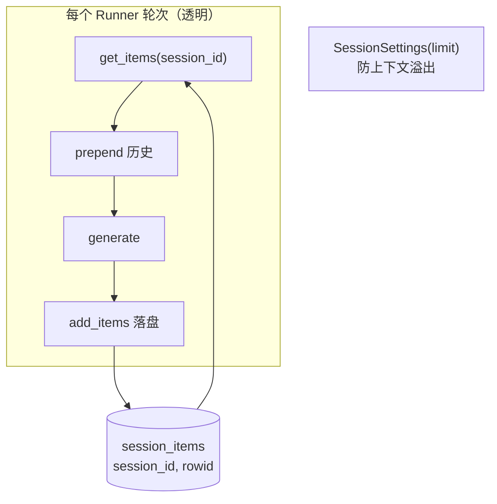
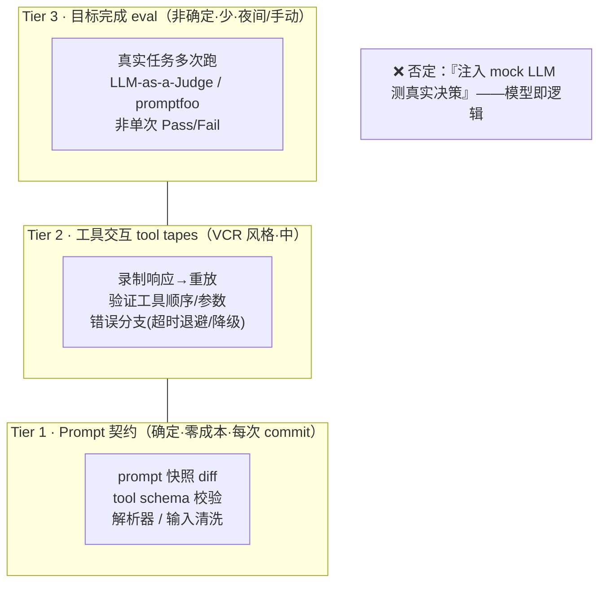
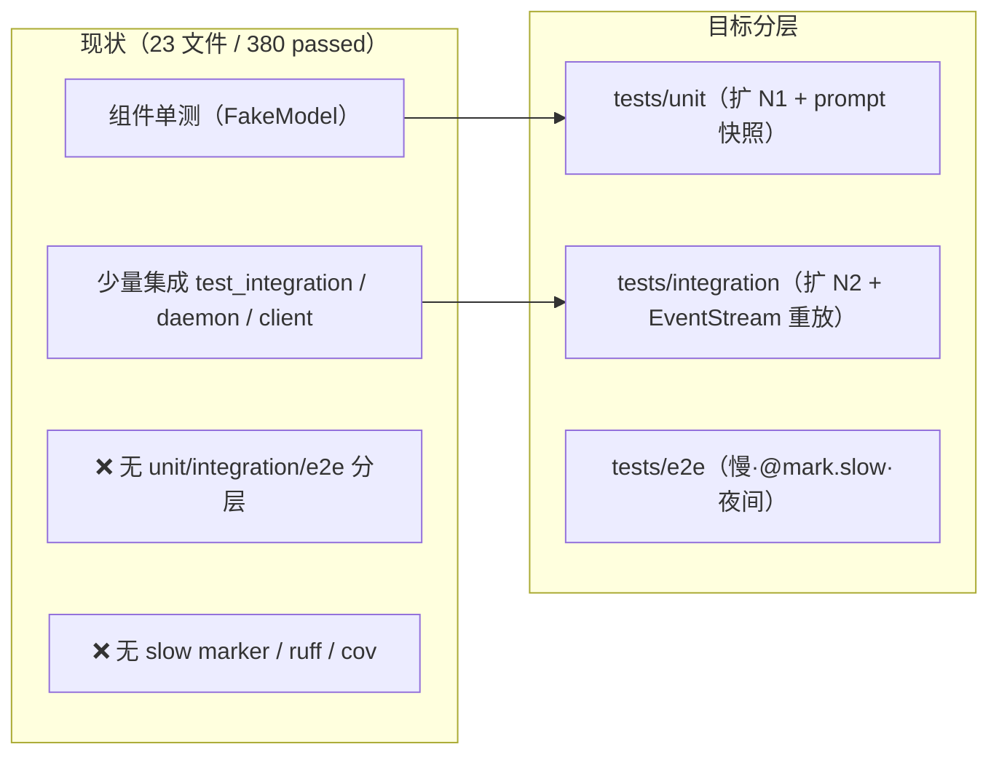
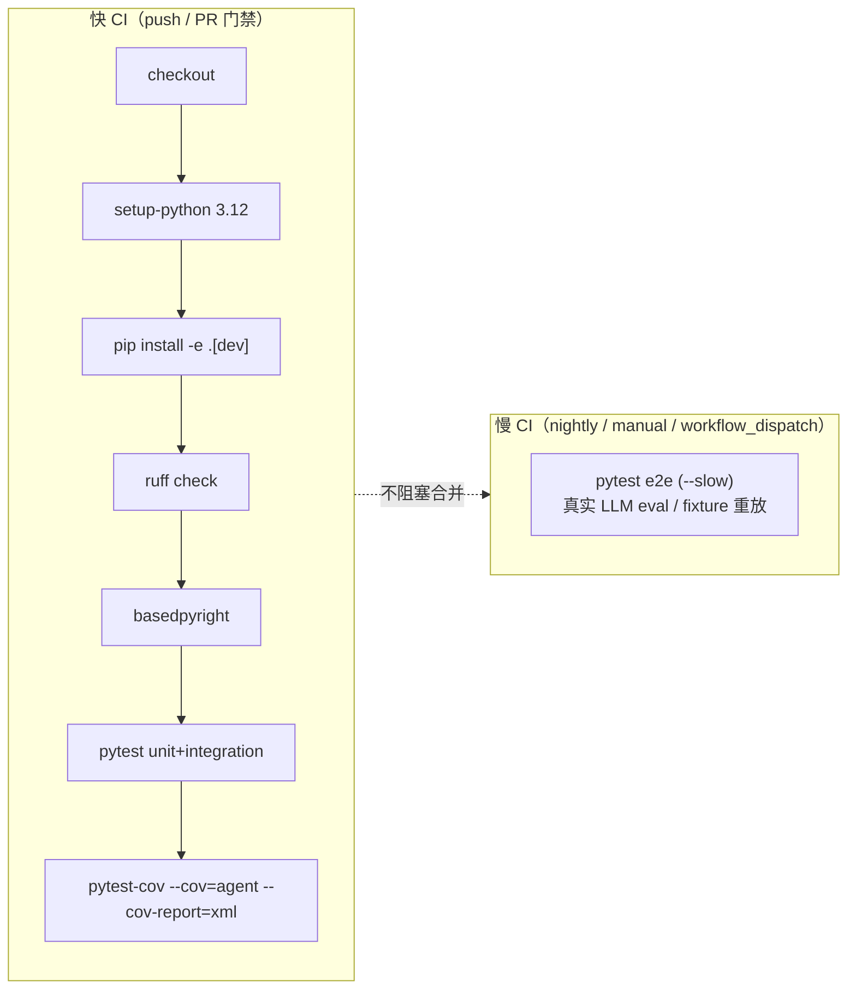

# M6 调研文档 — 会话恢复 / 测试金字塔 / CI

> 配套：`README.md`(M6 规划) · 来源 `agent/core/session.py` `agent/core/events.py` `agent/daemon/registry.py` `agent/obs/store.py` 及文末外部链接。
> 本文档聚焦「M6 要做什么（现状缺口）」+「外部优秀方案」，所有结论用 mermaid 图可视化。

---

## 一、现状全景：什么在内存、什么已落盘

M7 已完成 daemon 常驻 + WS + 多会话**内存态**切换回放，这是 M6 的前置基础。
但「跨进程 / 重启恢复」仍是空白——下图标出持久化边界。

**关键事实**
- `EventStream` 已实现 `to_json()` / `from_json()`（`M1.3`），但只在内存；`seq` 单调、`transient` 标记已就绪——这是落地持久化的天然接口。
- daemon 的 `SessionRegistry` 全内存，`resume` 只是连上 daemon 进程内的最近会话，daemon 没起 / 重启后**无法恢复**。
- sqlite 目前只有 `TraceStore` 与 `SessionMemory` 摘要，没有「整段会话」。

---

## 二、会话恢复（Session Recovery）外部方案

### 2.1 Claude Code — JSONL 仅追加 transcript ⭐ 最贴近本项目

要点（与本项目映射）：
- 每会话一个 JSONL，`parentUuid → uuid` 链表支持 **fork 分支**与子 agent 侧链；压缩边界用 `null` parent 截断。
- 崩溃安全：append-only，忽略不完整末行；轻量恢复只读头尾各 64KB。
- **本项目映射**：`EventStream` 已是「单一事实来源 + `seq` 单调 + `to_json/from_json` + `transient`」，与 JSONL transcript **等价**。落地 = 把 `Event` 按 `seq` 落盘，`from_json` 重放 → 重建 `messages`。**零新概念、复用既有协议**。

### 2.2 OpenAI Agents SDK — `SQLiteSession`（透明自动持久化）

要点：借鉴「**透明自动**」API——`AgentLoop.step` 结束自动把本轮新增 events 落 sqlite，恢复时自动 `get_items` 重建，业务代码无感知。多 worker 场景再换 Redis/SQLAlchemy。

### 2.3 其他参考
- **Aider**：`.aider.chat.history` + `.aider.llm.history` 双文件。
- **OpenHands**：会话存后端（sqlite + 文件）。
- **agent-memory**（OctavianTocan）：本地 sqlite + 语义检索——属「长期记忆」，非「会话恢复」，可作 M6 之后增强。

---

## 三、测试金字塔（Agent Test Pyramid）外部方案

### 3.1 传统 70/20/10 对 Agent 失效

Tian Pan(2026-04) 核心论点：单元非真单元、集成烧钱、e2e 非确定。
改为「**成本 / 保真度**」三层金字塔：

### 3.2 业界共识（zylos / openhelm / szaher）
- **单元**：工具 + Mock LLM 响应（确定性、免费、底座最大）。
- **集成**：agent loop + 确定性 fixture，验证工作流。
- **e2e**：真实/录制任务，昂贵、评估向。

### 3.3 本项目现状与落点

**落点**：本项目 `FakeModel`/`RecordingModel` 策略即 Tier1 核心，须扩为「契约 + fixture 重放」主力，**避免集成测试动辄调真实 LLM（烧钱 + 非确定）**。

---

## 四、CI 外部方案

业界通行：GitHub Actions + ruff + basedpyright + `pytest --cov` + Codecov。
agent 项目（OpenHands / SWE-bench）普遍**快慢分离**：

---

## 五、结论与推荐

| 主题 | 推荐方案 | 依据 |
|---|---|---|
| 会话恢复存储 | **sqlite 主** + 可选 JSONL 导出 | 现有 `TraceStore` 基础设施可复用；JSONL 导出呼应 Claude Code |
| 持久化协议 | 复用 `EventStream` `to_json/from_json` | 已等价 JSONL transcript，零新概念 |
| 中断检测 | 末条 `tool_use` 无 `tool_result` → 注入「继续」 | 直接映射 Claude Code `interrupted_turn` |
| 测试分层 | unit / integration / e2e + slow marker | Tian Pan 成本/保真度金字塔 |
| 录制重放 | 用 `EventStream` 作天然 tape | 事件流即「工具交互录像带」 |
| CI | GitHub Actions 快慢分离 | OpenHands / SWE-bench 通行做法 |

---

## 六、外部方案来源

- Claude Code 会话持久化（JSONL transcript / parentUuid 链 / 中断检测）：<https://openedclaude.github.io/claude-reviews-claude/zh-CN/chapters/09-session-persistence> · 官方 <https://code.claude.com/docs/en/sessions>
- OpenAI Agents SDK `SQLiteSession`：<https://callsphere.ai/blog/sqlite-session-persistent-conversations-ai-agents>
- Agent Test Pyramid（成本/保真度三层、否定 mock LLM 测决策）：<https://tianpan.co/blog/2026-04-15-agent-test-pyramid-llm-testing>
- Agent 测试策略综述：<https://zylos.ai/zh/research/2026-05-07-ai-agent-testing-strategies-production-validation/> · <https://www.openhelm.ai/blog/agent-testing-strategies-unit-integration-e2e>
- agent-memory（长期记忆，非会话恢复）：<https://github.com/OctavianTocan/agent-memory>
