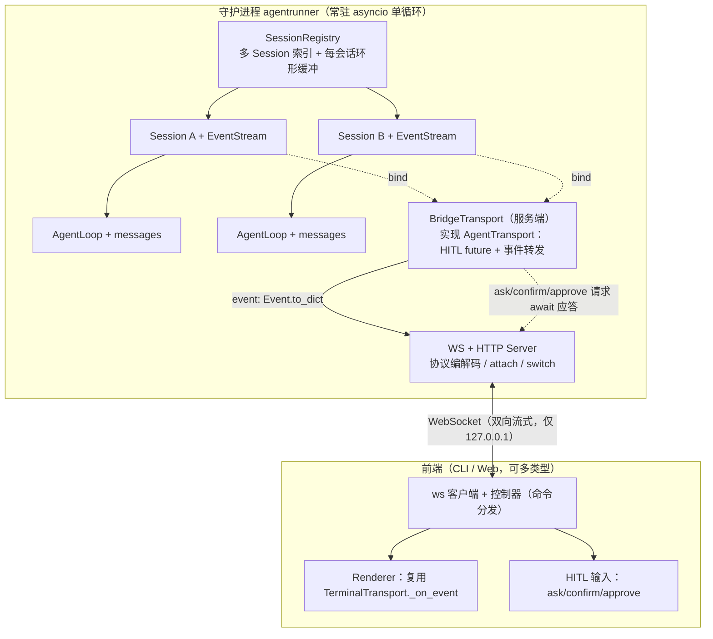

# 里程碑 M7：agentrunner 守护进程分离 + 通信协议

> 触发：现有 `agent/cli.py` 的 `run()` / `chat()` 在**进程内**创建 `Session` + `TerminalTransport` 并就地 `asyncio.run(session.step(...)))`，agentrunner（core 驱动）与渲染 CLI 强耦合于同一进程。本里程碑将其拆为「守护进程 `agentrunner`（常驻）+ 渲染前端（CLI / Web）」，二者经 WebSocket 通信协议交互，daemon 常驻多会话、前端可 `attach` / `切换`，并复用既有 `AgentTransport` / `EventStream` 序列化基础。
> 前置基础：既有重构 `milestones/M-refactor-统一传输层与事件线格式.md` 已落地（`AgentTransport` 合并 + `EventStream` 唯一实时线格式）。本里程碑是该基础的 **client-server 落地化**：不仅把事件转发出去，还把 HITL 也经协议请求/应答，形成完整闭环。
> 本里程碑 **已全部编码落地（M7.1–M7.6 全部完成，全量 `pytest` 380 passed）**。步骤文档含「实现方案 / 验收标准 / 知识沉淀」三要素，每步均通过自身验收标准。

## 目标
将 agentrunner 与渲染层完全分离为「常驻守护进程 + 前端」，经 WebSocket 协议交互，支持多会话 attach / switch 与后台持续运行；core（loop / session / transport / events）保持零 / 极小改动。

## 前置依赖
- M1（骨架）、M2（安全与确认）、M3（可观测与韧性）、M5（扩展能力）已完成。
- 既有传输层重构已落地（`AgentTransport` + `EventStream`）。
- 不变量：`agent/core/{loop,session,transport,events}.py` 仅允许**极小非破坏性扩展**（见全局约定）。

## 背景与动机
1. **完全分离**：core（loop / session / model）与渲染（rich / web）不在同一进程。
2. **守护进程常驻**：前端断连不影响 agent 运行，重连可继续（真正的「后台持续」）。
3. **多会话切换**：daemon 管理多个 `Session`，切换 = `detach` 当前 + `attach` 另一；后台子 agent 在无人 `attach` 时仍由 daemon 事件循环驱动。
4. **统一协议服务 CLI 与 Web**：单 WebSocket 服务同时对接 CLI 客户端与未来 Web 前端；事件直接复用 `Event.to_dict()` 序列化转发，新增 Web 仅需另写一个前端渲染器。
5. **保留进程内快捷入口**：现有 `run` / `chat` 完全保留；新增 `daemon` + `client` 子命令为并行入口。

## 目标架构

**关键角色**：
- `SessionRegistry`（`agent/daemon/registry.py`）：以 `session_id` 索引多 `SessionHandle`；负责 `new` / `attach` / `detach` / `switch` / `list`。
- `SessionHandle`：持有 `Session` 实例、事件环形缓冲（`deque(maxlen=K)`，**仅收非 transient 事件**）、当前 `attached_conn`、`running` 标志、`last_activity`、每会话 `asyncio.Lock`。
- `BridgeTransport`（`agent/daemon/bridge.py`）：服务端 `AgentTransport` 实现。`bind(stream)` 注册 sink 把每个 `Event` `to_dict()` 转发；HITL 方法把请求封装为带 `id` 的协议消息并 `await` 一个 `asyncio.Future`，收到对应 `id` 的应答时 `set_result` 唤醒。
- `Server`（`agent/daemon/server.py`）：`websockets` 服务 + 本地 HTTP（健康检查 / 静态资源）；按连接路由消息，驱动 `SessionRegistry` 与 `BridgeTransport`。
- `Client`（`agent/daemon/client.py`；CLI 入口 `agent client`）：ws 客户端；收到 `event` 经 `Event.from_dict()` 喂给复用 `TerminalTransport._on_event` 的渲染器；收到 HITL 请求就地向用户提问并回传应答。

## 全局约定（铁律，含本次修复的两点）
- **core 零 / 极小改动**：新增只在 `agent/daemon/`（新增）与 `agent/cli.py`（新增子命令 + 抽取命令分发）。允许的极小 core 扩展：**给 `Event` 增加 `transient: bool = False` 字段**（`to_dict` / `from_dict` 不计，向后兼容），`EventStream.emit` 分发前置 `transient=True` —— 用于区分瞬时事件。
- **协议流式能力（已确认）**：WebSocket 双向流式；`loop` 已逐块 emit `text`（append 入档）与 `tool_call_delta`（emit 瞬时）；`event` 消息逐条承载 `Event.to_dict()`，客户端复用 `TerminalTransport._on_event` 逐事件渲染即逐字 / 逐参流式。
- **修复点①（events.py 注释）**：`Event.type` 枚举注释原漏写实际类型 `text` / `tool_call_delta` / `clarify`，已在代码中更正为实际产出集合（`decision | clarify | plan | plan_progress | tool_use | tool_result | final | error | text | tool_call_delta`）。
- **修复点②（回放缓冲只收持久化事件）**：`SessionHandle` 环形缓冲 `deque(maxlen=K)` **仅写入非 `transient` 事件**（即 `append` 持久化事件）；`emit` 瞬时事件（`tool_call_delta`）仅实时转发、不进缓冲，attach / switch 回放时不重画参数预览，避免重复渲染。客户端实时渲染仍消费全部事件（含 `transient`）。
- **复用约定**：客户端渲染直接复用 `TerminalTransport._on_event(Event.from_dict(...))`（TerminalTransport 零改动）；命令分发抽为共享 `dispatch_command`（cli 与 daemon 共用）。
- **安全**：daemon 仅绑 `127.0.0.1`；实现时向 `pyproject.toml` 增 `websockets`（仅 daemon / client 路径 import）。

## 步骤索引

| 步骤 | 文件 | 目标 | 状态 |
|---|---|---|---|
| M7.1 | [M7.1-daemon骨架.md](./M7.1-daemon骨架.md) | SessionRegistry + WS / HTTP server 骨架，多会话常驻 | ✅ 已完成 |
| M7.2 | [M7.2-协议层.md](./M7.2-协议层.md) | 协议信封 / 编解码 + BridgeTransport + HITL future 机制（含完整协议规范 §3.1–3.5） | ✅ 已完成 |
| M7.3 | [M7.3-CLI客户端.md](./M7.3-CLI客户端.md) | CLI 客户端：渲染复用 + HITL 回传 | ✅ 已完成 |
| M7.4 | [M7.4-session切换回放.md](./M7.4-session切换回放.md) | attach / switch / 回放缓冲（仅收持久化事件） | ✅ 已完成 |
| M7.5 | [M7.5-与run-chat共存.md](./M7.5-与run-chat共存.md) | 与 run / chat 共存 + 抽取 dispatch_command | ✅ 已完成 |
| M7.6 | [M7.6-安全与端到端验收.md](./M7.6-安全与端到端验收.md) | 安全约束 + 端到端验收 + core 不变性 | ✅ 已完成 |

## 里程碑级知识沉淀
> 已落地（M7.1–M7.6 全部完成）。核心结论：
> 1. **协议铁律**：WebSocket 双向流式，事件直接复用 `Event.to_dict()` 转发，客户端复用 `TerminalTransport._on_event`；HITL 经带 `id` 的协议消息 + `asyncio.Future` 往返。
> 2. **session 切换语义**：`detach` 当前 + `attach` 另一；环形缓冲 `deque(maxlen=K)` 仅收非 `transient` 事件，回放 `replay_start` + 最近 K 条 + `replay_end`，`tool_call_delta` 不重画，杜绝重复渲染。
> 3. **复用约定**：命令分发抽为共享 `dispatch_command`（cli 与 daemon 共用，单一来源）；core 零/极小改动（仅 M7.1 引入 `EventType` 枚举 + `Event.transient` + `Session.event_stream` 只读）。
> 4. **core 不变性核验**：`git log --oneline -- agent/core/` 显示 M7 阶段仅 M7.1 触碰 core，其后均保持不动；`AgentTransport` 协议签名不变。
> 5. **对 M6 衔接**：守护进程常驻 + sqlite 会话天然支撑 M6 远程接入形态（会话恢复 / 可测 / CI）。
> 详细沉淀见各 step 文档的「知识沉淀 / 实施记录」小节。
